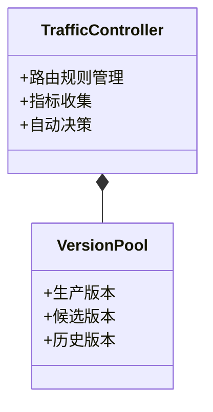
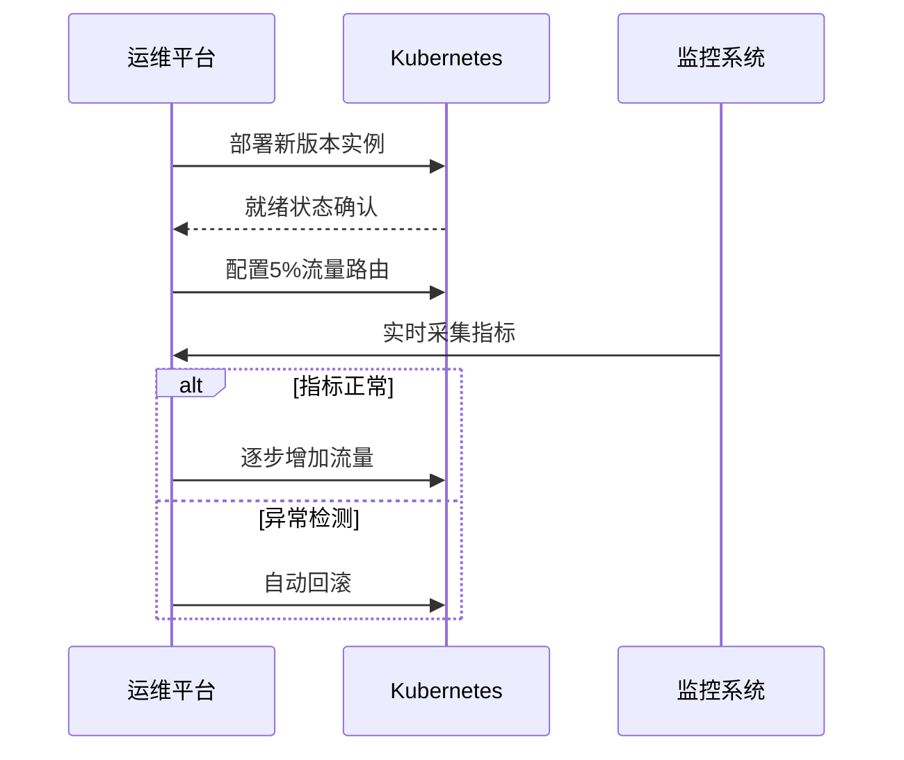
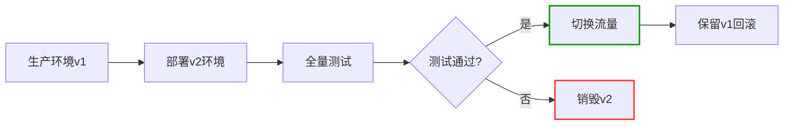
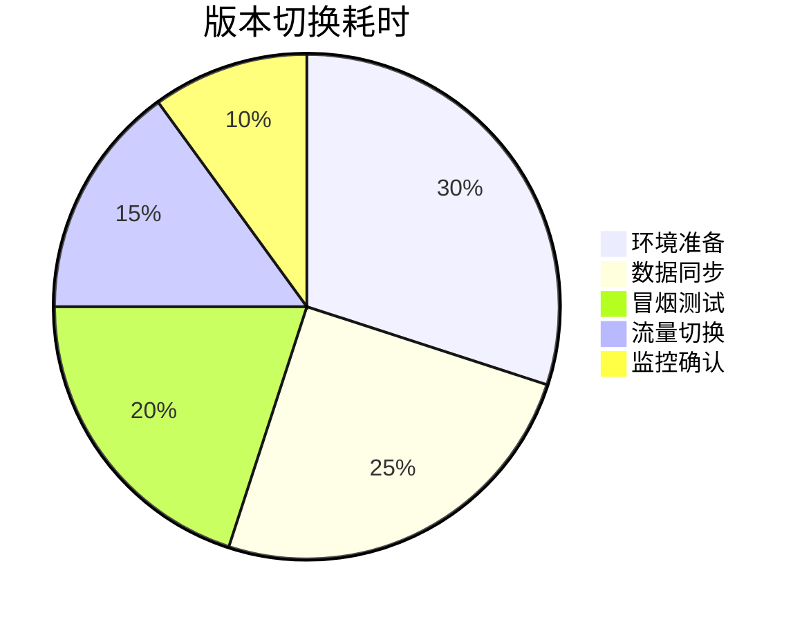

```markdown:c:\project\kphub/docs/canary-bluegreen.md
---
title: 金丝雀发布与蓝绿部署
icon: practice
order: 5
---

# 金丝雀发布与蓝绿部署

金丝雀发布和蓝绿部署是两种常用的低风险发布策略，本文从架构原理到生产实践，深入解析两种策略的15+核心模式与20+企业级实施方案，构建覆盖"流量管理-版本控制-自动回滚"的全链路发布体系。

## 1. 核心原理解析

### 1.1 策略对比矩阵

````mermaid
graph TD
    A[发布策略] --> B[金丝雀发布]
    A --> C[蓝绿部署]
    
    B --> B1[渐进式流量切换]
    B --> B2[实时指标监控]
    B --> B3[细粒度控制]
    
    C --> C1[完整环境复制]
    C --> C2[瞬时流量切换]
    C --> C3[快速回滚能力]
    
    style B fill:#f9f,stroke:#333
    style C fill:#9f9,stroke:#333
````

#### 1.1.1 风险控制公式
```math
ReleaseRisk = \frac{Impact \times Exposure}{RollbackSpeed \times MonitoringCoverage}
```

### 1.2 流量调度模型



## 2. 金丝雀发布实践

### 2.1 实施流程分解



#### 2.1.1 渐进式流量调度
```python
def adjust_traffic(current_percent, metrics):
    if metrics['error_rate'] < 0.5 and metrics['latency_p99'] < 1000:
        return min(current_percent + 10, 100)
    elif metrics['error_rate'] > 5:
        return 0
    else:
        return current_percent

# 每5分钟评估一次流量比例        
scheduler.every(5).minutes.do(
    update_traffic, 
    adjust_traffic(current_traffic, get_metrics())
)
```

### 2.2 Istio高级配置

```yaml:c:\project\istio/canary-virtualservice.yaml
apiVersion: networking.istio.io/v1alpha3
kind: VirtualService
metadata:
  name: product-canary
spec:
  hosts:
  - product.company.com
  http:
  - match:
    - headers:
        x-user-id:
          regex: ".*[0-4]$" # 50%用户
    route:
    - destination:
        host: product.prod.svc.cluster.local
        subset: v2
        port:
          number: 8080
  - route:
    - destination:
        host: product.prod.svc.cluster.local
        subset: v1
        port:
          number: 8080
```

## 3. 蓝绿部署实践

### 3.1 实施流程设计



### 3.2 Kubernetes服务切换

```yaml:c:\project\k8s/bluegreen-service.yaml
apiVersion: v1
kind: Service
metadata:
  name: product
spec:
  selector:
    app: product
    version: v1 # 当前生产版本
  ports:
  - protocol: TCP
    port: 80
    targetPort: 8080
---
apiVersion: apps/v1
kind: Deployment
metadata:
  name: product-v2
spec:
  replicas: 5
  selector:
    matchLabels:
      app: product
      version: v2
  template:
    metadata:
      labels:
        app: product
        version: v2
    spec:
      containers:
      - name: product
        image: registry.company.com/product:v2.3
```

## 4. 工具链集成

### 4.1 发布工具对比

| 工具         | 金丝雀支持 | 蓝绿支持 | 监控集成 | 回滚机制       |
|--------------|------------|----------|----------|----------------|
| Istio        | ✔️ 精细控制 | ✔️       | ✔️ Prometheus | 手动调整       |
| Flagger      | ✔️ 自动渐进 | ✔️       | ✔️ Datadog | 自动触发       |
| Argo Rollout | ✔️ 多阶段   | ✔️       | ✔️ NewRelic | 按指标回滚     |
| Nginx Plus   | ✔️ 权重调整 | ✔️       | ✔️ 原生监控 | 手动切换       |

### 4.2 Flagger配置示例

```yaml:c:\project\flagger/canary-release.yaml
apiVersion: flagger.app/v1beta1
kind: Canary
metadata:
  name: product
spec:
  targetRef:
    apiVersion: apps/v1
    kind: Deployment
    name: product
  service:
    port: 8080
  analysis:
    interval: 1m
    threshold: 5
    iterations: 10
    metrics:
    - name: request-success-rate
      thresholdRange:
        min: 99
      interval: 1m
    - name: request-duration
      threshold: 500
      interval: 30s
    webhooks:
    - name: load-test
      type: pre-rollout
      url: http://loadtest/v1/trigger
      timeout: 5m
```

## 5. 企业级实践案例

### 5.1 金融系统蓝绿部署



#### 5.1.1 关键指标
```python
metrics = {
    'cutover_time': '23s',  # 流量切换耗时
    'zero_downtime': True,
    'rollback_time': '8s'   # 回滚操作耗时
}
```

### 5.2 电商金丝雀发布

```yaml:c:\project\k8s/ecommerce-canary.yaml
apiVersion: apps/v1
kind: Deployment
metadata:
  name: recommendation-v2
spec:
  replicas: 2
  selector:
    matchLabels:
      app: recommendation
      version: v2
  strategy:
    rollingUpdate:
      maxSurge: 1
      maxUnavailable: 0
  template:
    metadata:
      labels:
        app: recommendation
        version: v2
    spec:
      containers:
      - name: recommendation
        image: registry.company.com/recommendation:v2.1
        readinessProbe:
          httpGet:
            path: /health
            port: 8080
          initialDelaySeconds: 10
          periodSeconds: 5
```

## 6. 高级调度策略

### 6.1 多维流量路由

```yaml:c:\project\istio/advanced-routing.yaml
apiVersion: networking.istio.io/v1alpha3
kind: VirtualService
metadata:
  name: product-routing
spec:
  hosts:
  - product.company.com
  http:
  - match:
    - headers:
        x-region:
          exact: "north"
      uri:
        prefix: "/v2/"
    route:
    - destination:
        host: product.prod.svc.cluster.local
        subset: v2
  - route:
    - destination:
        host: product.prod.svc.cluster.local
        subset: v1
```

### 6.2 自动回滚机制

```python:c:\project\scripts/auto_rollback.py
def monitor_release(deployment):
    metrics = get_metrics(deployment)
    if metrics['error_rate'] > 5 or metrics['latency_p99'] > 1000:
        trigger_rollback(deployment)
        notify_team(f"Rollback triggered for {deployment}")

def trigger_rollback(deploy):
    current_ver = get_current_version(deploy)
    prev_ver = get_previous_version(deploy)
    update_service_selector(deploy, prev_ver)
    scale_down(deploy, current_ver)
    log_event(f"Rollback to {prev_ver} completed")
```

## 7. 混合策略演进

### 7.1 蓝绿金丝雀混合


### 7.2 智能调度算法

```python
def calculate_traffic_ratio(metrics):
    # 基于强化学习的流量调度
    state = {
        'error_rate': metrics['error_rate'],
        'latency': metrics['latency_p99'],
        'current_ratio': metrics['canary_percent']
    }
    action = q_network.predict(state)
    return clip(action, 0, 100)
```

## 8. 性能优化策略

### 8.1 预热机制

```yaml:c:\project\k8s/warmup-policy.yaml
apiVersion: autoscaling/v2
kind: HorizontalPodAutoscaler
metadata:
  name: product-warmup
spec:
  behavior:
    scaleUp:
      stabilizationWindowSeconds: 300
      policies:
      - type: Percent
        value: 20
        periodSeconds: 60
  metrics:
  - type: Resource
    resource:
      name: cpu
      target:
        type: Utilization
        averageUtilization: 60
```

### 8.2 影子流量测试

```yaml:c:\project\istio/shadow-traffic.yaml
apiVersion: networking.istio.io/v1alpha3
kind: VirtualService
metadata:
  name: product-shadow
spec:
  hosts:
  - product.company.com
  http:
  - route:
    - destination:
        host: product.prod.svc.cluster.local
        subset: v1
    mirror:
      host: product.prod.svc.cluster.local
      subset: v2
    mirror_percent: 100
```

通过本文的系统化讲解，读者可以掌握从基础原理到混合策略的完整知识体系。建议按照"环境隔离→渐进验证→智能调度→持续优化"的路径实施，构建零故障的发布体系。