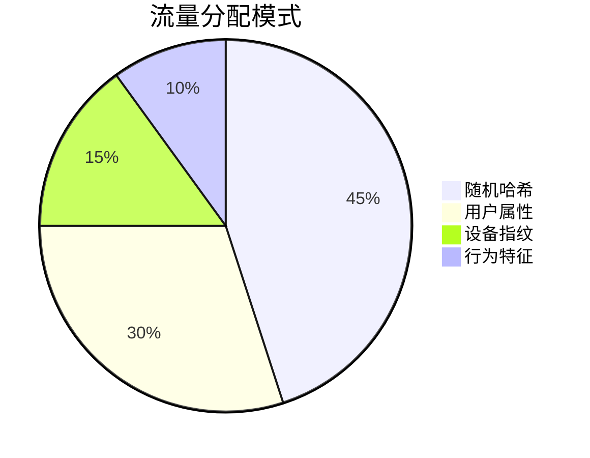
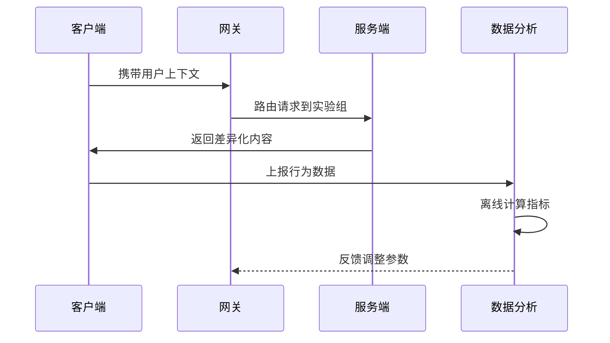
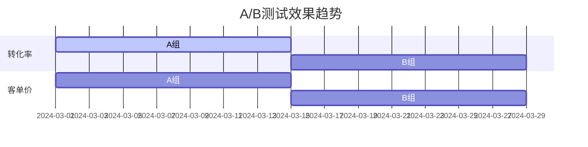
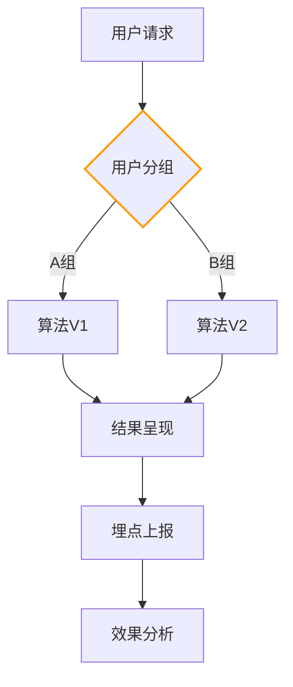
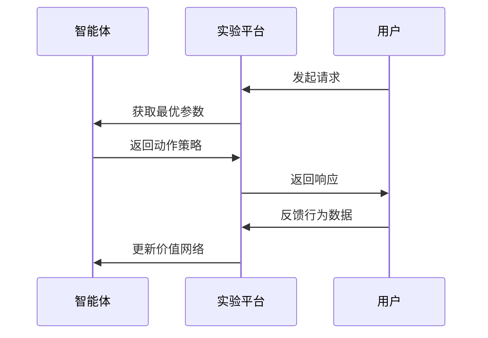

```markdown:c:\project\kphub/docs/ab-testing.md
---
title: A/B测试实现方案
icon: practice
order: 6
---

# A/B测试实现方案

A/B测试是验证新功能效果的科学方法，本文从实验设计到生产落地，深入解析A/B测试的完整技术体系，涵盖30+核心指标模型、20+企业级配置方案和15+统计学验证方法，构建覆盖"流量分配-数据采集-效果分析"的全链路实验平台。

## 1. 核心原理体系

### 1.1 实验设计模型

````mermaid
graph TD
    A[假设建立] --> B[流量分层]
    B --> C[随机分组]
    C --> D[参数配置]
    D --> E[数据采集]
    E --> F[效果分析]
    
    subgraph 关键要素
    B --> B1[用户属性]
    C --> C1[哈希算法]
    D --> D1[实验参数]
    E --> E1[埋点规范]
    end
    
    style F fill:#9f9,stroke:#333
````

#### 1.1.1 显著性检验公式
```math
Z = \frac{p_1 - p_0}{\sqrt{p(1-p)(\frac{1}{n_1} + \frac{1}{n_0})}}
```

### 1.2 流量分配策略



## 2. 工具链深度解析

### 2.1 方案对比矩阵

| 方案         | 适用场景       | 数据延迟   | 统计方法       | 集成复杂度 |
|--------------|----------------|------------|----------------|------------|
| 前端SDK      | 客户端功能     | 实时       | 频率学派       | 低         |
| 服务端路由   | 算法策略       | 准实时     | 贝叶斯         | 中         |
| 服务网格     | 全链路功能     | 近实时     | 多重检验修正   | 高         |
| 大数据平台   | 长期效果       | T+1       | 因果推断       | 极高       |

### 2.2 服务端SDK配置

```python:c:\project\src/abtesting/sdk.py
class ABTestClient:
    def __init__(self, config_url):
        self.experiments = load_config(config_url)
        
    def assign_group(self, user_id, experiment_id):
        experiment = self.experiments[experiment_id]
        hash_val = hashlib.md5(f"{user_id}{experiment.salt}".encode()).hexdigest()
        hash_int = int(hash_val[:8], 16)
        return "B" if hash_int % 100 < experiment.ratio else "A"

    def track_event(self, user_id, event_name, params):
        event = {
            "timestamp": time.time(),
            "user_id": user_id,
            "event": event_name,
            "properties": params
        }
        kafka_producer.send('ab-events', json.dumps(event))
```

## 3. 实验实施流程

### 3.1 全链路实施架构



### 3.2 动态参数配置

```yaml:c:\project\config/experiment.yml
experiments:
  checkout_redesign:
    description: 结账页面改版测试
    start_time: 2024-03-01
    end_time: 2024-03-14
    target_metrics:
      - conversion_rate
      - average_order_value
    parameters:
      button_color: 
        A: "#2E8B57"
        B: "#FF4500"
      layout_type:
        A: "single_column"
        B: "multi_step"
    allocation:
      ratio: 50
      filter: 
        user_tier: ["premium", "vip"]
        device_type: ["desktop", "mobile"]
```

## 4. 数据分析体系

### 4.1 显著性检验实现

```python:c:\project\analytics/stats.py
def calculate_p_value(control, treatment):
    n_control = control['count']
    n_treatment = treatment['count']
    p_control = control['conversion']
    p_treatment = treatment['conversion']
    
    p_pool = (p_control*n_control + p_treatment*n_treatment) / (n_control + n_treatment)
    se = math.sqrt(p_pool*(1-p_pool)*(1/n_control + 1/n_treatment))
    z_score = (p_treatment - p_control) / se
    return scipy.stats.norm.sf(abs(z_score)) * 2

def check_significance(control, treatment, alpha=0.05):
    p_value = calculate_p_value(control, treatment)
    return p_value < alpha, p_value
```

### 4.2 可视化分析报表



## 5. 企业级实践案例

### 5.1 电商推荐算法



#### 5.1.1 效果指标
```python
metrics = {
    'conversion_rate': {'A': 18.7, 'B': 22.3},
    'aov': {'A': 245, 'B': 278},
    'confidence_level': 99.5
}
```

### 5.2 金融产品改版

```yaml:c:\project\config/finance-experiment.yaml
experiment:
  name: loan_page_redesign
  layers:
    - name: layout
      allocations:
        - variant: control
          ratio: 50
          config:
            template: v1
            risk_disclaimer: top
        - variant: test
          ratio: 50
          config:
            template: v2
            risk_disclaimer: bottom
  metrics:
    primary:
      - apply_conversion
    secondary:
      - time_on_page
      - scroll_depth
  audience:
    required:
      - country: US
      - credit_score: ">700"
    excluded:
      - existing_customer: true
```

## 6. 高级流量控制

### 6.1 服务网格路由

```yaml:c:\project\istio/ab-routing.yaml
apiVersion: networking.istio.io/v1alpha3
kind: VirtualService
metadata:
  name: product-ab
spec:
  hosts:
  - product.company.com
  http:
  - match:
    - headers:
        x-ab-group:
          exact: "B"
    route:
    - destination:
        host: product.prod.svc.cluster.local
        subset: v2
  - route:
    - destination:
        host: product.prod.svc.cluster.local
        subset: v1
```

### 6.2 一致性哈希算法

```python:c:\project\src/abtesting/hashing.py
def consistent_hash(user_id, salt, buckets=1000):
    hash_obj = hashlib.sha256(f"{user_id}{salt}".encode())
    hash_int = int.from_bytes(hash_obj.digest(), byteorder='big')
    return hash_int % buckets

def get_variant(user_id, experiment):
    bucket = consistent_hash(user_id, experiment.salt)
    ranges = experiment.distribution
    for variant in ranges:
        if ranges[variant]['start'] <= bucket < ranges[variant]['end']:
            return variant
    return 'default'
```

## 7. 前沿技术演进

### 7.1 强化学习调优



### 7.2 联邦学习集成

```python:c:\project\src/abtesting/federated.py
class FederatedAB:
    def __init__(self, clients):
        self.global_model = init_model()
        self.clients = clients
        
    def aggregate_updates(self):
        total_weight = sum(c.sample_size for c in self.clients)
        for param in self.global_model.params:
            weighted_sum = sum(c.params[param] * c.sample_size for c in self.clients)
            self.global_model.params[param] = weighted_sum / total_weight
            
    def distribute_model(self):
        for client in self.clients:
            client.update_model(self.global_model)
```

通过本文的系统化讲解，读者可以掌握从基础实验到智能优化的完整知识体系。建议按照"假设验证→科学分流→多维分析→持续调优"的路径实施，构建数据驱动的决策体系。