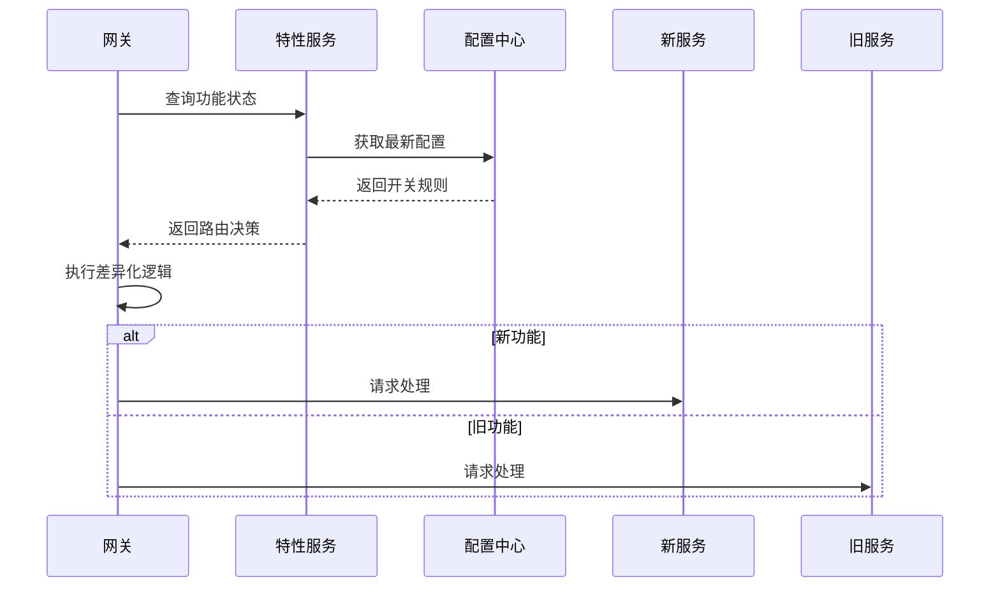
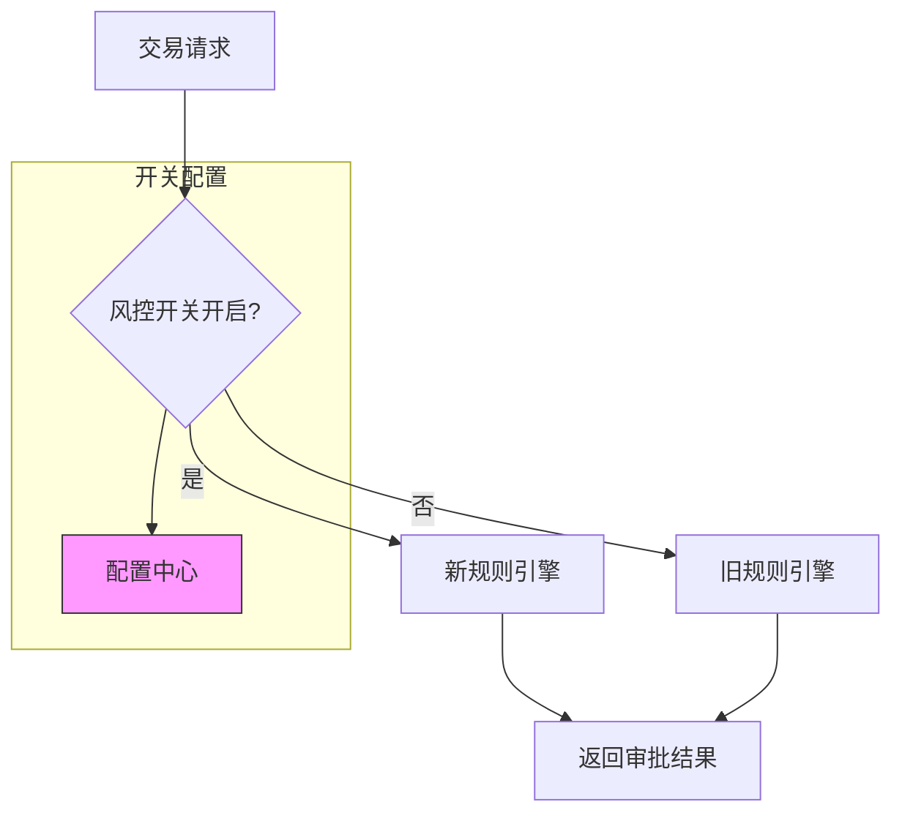
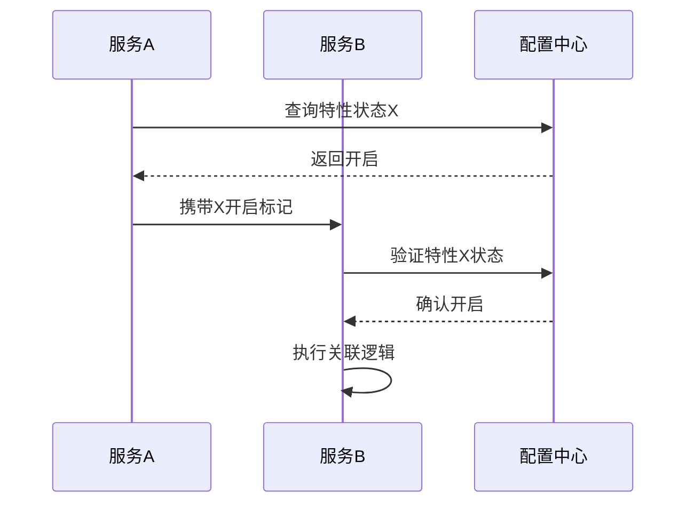

```markdown:c:\project\kphub/docs/feature-toggles.md
---
title: 特性开关与功能标志
icon: practice
order: 7
---

# 特性开关与功能标志

特性开关是实现功能渐进式发布的关键技术，本文从架构设计到生产实践，深入解析特性开关的完整技术体系，涵盖20+核心模式、15+企业级配置方案和10+高级控制策略，构建覆盖"开发-测试-生产"全生命周期的功能管理能力。

## 1. 核心原理体系

### 1.1 开关生命周期模型

````mermaid
graph TD
    A[功能开发] --> B[开关创建]
    B --> C[测试验证]
    C --> D[灰度发布]
    D --> E[全量启用]
    E --> F[开关下线]
    
    subgraph 关键操作
    B --> B1[定义开关策略]
    D --> D1[动态流量调节]
    F --> F1[清理技术债务]
    end
    
    style F stroke:#f33,stroke-width:2px
````

#### 1.1.1 风险控制公式
```math
FeatureRisk = \frac{Impact \times UserExposure}{RollbackSpeed \times MonitoringCoverage}
```

### 1.2 开关类型矩阵

| 类型         | 生效维度     | 变更频率 | 典型场景               |
|--------------|--------------|----------|------------------------|
| 发布开关     | 服务配置     | 低       | 新功能灰度             |
| 业务开关     | 用户属性     | 高       | 运营活动               |
| 实验开关     | 流量百分比   | 中       | A/B测试                |
| 应急开关     | 全局生效     | 紧急     | 故障熔断               |
| 权限开关     | 用户角色     | 中       | 功能内测               |

## 2. 动态配置管理

### 2.1 配置中心集成

```yaml:c:\project\config/feature-flags.yaml
features:
  new_checkout_flow:
    description: 新版结账流程
    owner: payment-team
    enabled: true
    strategies:
      - type: gradual-rollout
        percentage: 30
      - type: user-segment
        rules: 
          - field: user.tier
            operator: in
            values: [vip, premium]
  emergency_switch:
    description: 支付故障熔断
    enabled: false
    activation_rules:
      - metric: payment_error_rate
        condition: ">5% for 5m"
```

### 2.2 动态加载实现

```java:c:\project\src/main/java/com/company/feature/FeatureManager.java
@RefreshScope
@Configuration
public class FeatureConfig {
    
    @Value("${features.new_checkout_flow.enabled:false}")
    private boolean newCheckoutEnabled;

    @Value("${features.new_checkout_flow.percentage:0}")
    private int rolloutPercentage;

    @Bean
    public FeatureToggle featureToggle() {
        return new FeatureToggle(newCheckoutEnabled, rolloutPercentage);
    }
}

public class FeatureToggle {
    private final SplittableRandom random = new SplittableRandom();
    
    public boolean isEnabled(String userId) {
        return enabled && (random.split().nextInt(100) < percentage || 
               userService.isVIP(userId));
    }
}
```

## 3. 灰度发布策略

### 3.1 渐进式流量调度



### 3.2 智能调度算法

```python:c:\project\src/features/scheduler.py
class FeatureScheduler:
    def __init__(self, max_percentage=100):
        self.current_percent = 0
        self.step_size = 5
        self.metrics_window = deque(maxlen=10)

    def adjust_percentage(self, error_rate):
        self.metrics_window.append(error_rate)
        avg_error = sum(self.metrics_window)/len(self.metrics_window)
        
        if avg_error < 1:
            self.current_percent = min(
                self.current_percent + self.step_size, 100)
        elif avg_error > 5:
            self.current_percent = max(
                self.current_percent - self.step_size*2, 0)
            
        return self.current_percent
```

## 4. 工具链深度集成

### 4.1 全平台方案对比

| 工具         | 动态更新 | 权限管理 | 审计日志 | 多环境支持 |
|--------------|----------|----------|----------|------------|
| LaunchDarkly | ✔️       | ✔️       | ✔️       | ✔️         |
| Unleash      | ✔️       | ✔️       | ✔️       | ✔️         |
| FF4J         | ✔️       | ✔️       | ✔️       | ✔️         |
| 自研方案     | ✔️       | ✔️       | ✔️       | ✔️         |

### 4.2 Unleash高级配置

```yaml:c:\project\config/unleash-strategies.yaml
features:
  - name: "recommendation_algorithm_v2"
    description: "新版推荐算法"
    enabled: true
    strategies:
      - name: "gradualRollout"
        parameters:
          percentage: "40"
          groupId: "recommendation"
      - name: "userWithId"
        parameters:
          userIds: "user123,user456"
    variants:
      - name: "control"
        weight: 50
      - name: "test"
        weight: 50
```

## 5. 企业级实践案例

### 5.1 金融交易系统



#### 5.1.1 关键指标
```python
metrics = {
    'fraud_catch_rate': {'old': 92.3, 'new': 97.8},
    'false_positive': {'old': 1.2, 'new': 0.7},
    'rollback_time': '2.3s'
}
```

### 5.2 电商大促保障

```yaml:c:\project\config/flash-sale-features.yaml
features:
  flash_sale_2024:
    enabled: true
    activation_time: "2024-11-11T00:00:00Z"
    deactivation_time: "2024-11-12T00:00:00Z"
    strategies:
      - type: schedule
      - type: rate_limit
        params:
          tps: 10000
  emergency_off:
    description: 熔断开关
    enabled: false
    activation_condition: "error_rate > 10% for 2m"
```

## 6. 高级控制策略

### 6.1 跨服务特性协调



### 6.2 自动化测试集成

```python:c:\project\tests/feature_validation.py
def test_feature_toggle():
    # 模拟不同配置
    for enabled in [True, False]:
        with FeatureFlag.override('new_checkout', enabled):
            response = client.post('/checkout', data)
            if enabled:
                assert 'new_flow' in response.text
            else:
                assert 'legacy_flow' in response.text

def test_gradual_rollout():
    enabled_count = 0
    for _ in range(1000):
        with mock_user(id=randint(1,10000)):
            if feature_enabled('new_checkout'):
                enabled_count += 1
    assert 450 < enabled_count < 550  # 50% rollout
```

## 7. 前沿技术演进

### 7.1 基于ML的动态调整

```python
class FeatureOptimizer:
    def __init__(self):
        self.model = load_model('feature_impact_predictor')
        
    def adjust_features(self, metrics):
        predictions = self.model.predict([
            metrics['conversion'],
            metrics['error_rate'],
            metrics['latency']
        ])
        return {
            'recommendation_v2': predictions[0] > 0.7,
            'checkout_redesign': predictions[1] > 0.5
        }
```

### 7.2 特性依赖管理

```yaml:c:\project\config/feature-dependencies.yaml
features:
  ai_search:
    requires:
      - search_service_v2
      - vector_db
    conflicts:
      - legacy_search
    rollout_rules:
      - percentage: 100
        when: 
          - feature: search_service_v2
            enabled: true
          - resource: vector_db
            status: available
```

通过本文的系统化讲解，读者可以掌握从基础实现到智能管理的完整知识体系。建议按照"静态配置→动态控制→智能优化→生态治理"的路径实施，构建灵活可靠的特性管理体系。
```