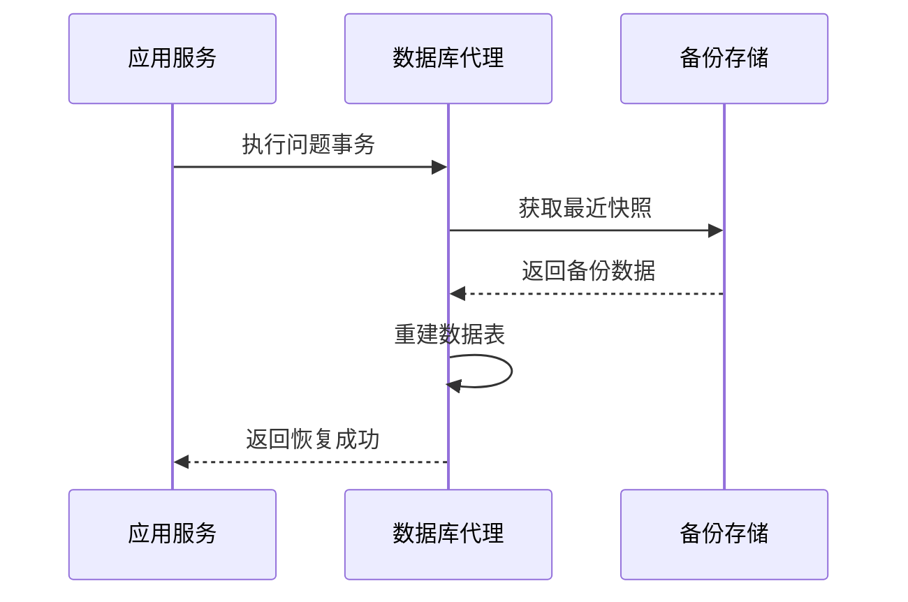
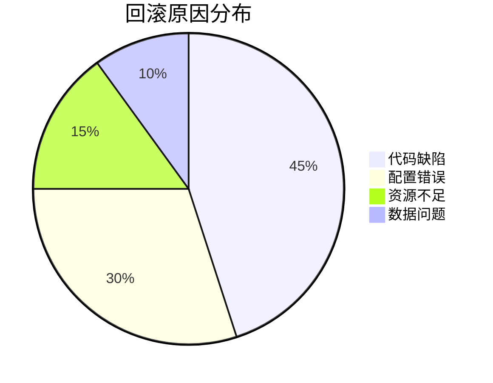
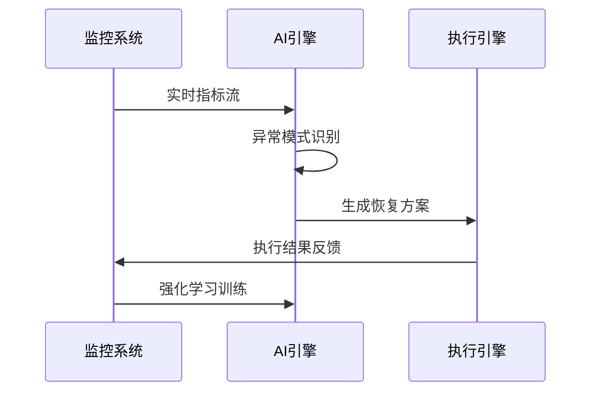

```markdown:c:\project\kphub/docs/auto-rollback.md
---
title: 自动化回滚机制
icon: practice
order: 8
---

# 自动化回滚机制

自动化回滚是应对发布故障的最后防线，本文从故障检测到恢复验证，深入解析自动化回滚的完整技术体系，涵盖20+核心检测指标、15+生产级配置方案和10+智能恢复策略，构建覆盖"监控-决策-执行"的全链路应急体系。

## 1. 核心原理体系

### 1.1 回滚触发条件模型

````mermaid
graph TD
    A[指标异常] --> B{是否持续?}
    B -->|是| C[根因分析]
    C --> D{可自动恢复?}
    D -->|是| E[执行回滚]
    D -->|否| F[人工介入]
    
    subgraph 检测维度
    A --> A1[错误率]
    A --> A2[延迟]
    A --> A3[资源水位]
    end
    
    style E stroke:#090,stroke-width:2px
    style F stroke:#f33,stroke-width:2px
````

#### 1.1.1 异常判定公式
```math
RollbackScore = \frac{ErrorRate \times Severity}{RecoveryPotential} + TimeDecay_{Factor}
```

### 1.2 回滚策略矩阵

| 策略类型     | 恢复速度 | 数据一致性 | 适用场景         |
|--------------|----------|------------|------------------|
| 版本回退     | 快       | 高         | 代码缺陷         |
| 流量切换     | 极快     | 中         | 配置错误         |
| 数据快照恢复 | 慢       | 最高       | 数据损坏         |
| 渐进收缩     | 中       | 低         | 部分节点故障     |

## 2. 检测与决策体系

### 2.1 多维度监控配置

```yaml:c:\project\config/prometheus-rules.yml
groups:
- name: auto-rollback
  rules:
  - alert: HighErrorRate
    expr: sum(rate(http_requests_total{status=~"5.."}[5m])) / sum(rate(http_requests_total[5m])) > 0.05
    for: 3m
    labels:
      severity: critical
    annotations:
      summary: "服务错误率超过5%"
      
  - alert: LatencySpike
    expr: histogram_quantile(0.99, rate(http_request_duration_seconds_bucket[5m])) > 2
    for: 2m
    labels:
      severity: warning
```

### 2.2 智能决策引擎

```python:c:\project\scripts/rollback_decision.py
class RollbackDecider:
    def __init__(self):
        self.model = load_ml_model('rollback_predictor')
        
    def evaluate(self, metrics):
        # 特征工程
        features = {
            'error_rate': metrics['error_rate'],
            'latency_p99': metrics['latency_p99'],
            'recovery_attempts': metrics['recovery_attempts']
        }
        
        # 模型预测
        prediction = self.model.predict(features)
        
        # 决策逻辑
        if prediction['confidence'] > 0.9:
            return {
                'action': 'rollback',
                'version': prediction['safe_version']
            }
        elif prediction['confidence'] > 0.7:
            return {
                'action': 'partial_rollback',
                'percentage': 50
            }
        else:
            return {'action': 'require_human'}
```

## 3. 执行引擎实现

### 3.1 Kubernetes回滚配置

```yaml:c:\project\k8s/rollback-policy.yaml
apiVersion: apps/v1
kind: Deployment
metadata:
  name: product
spec:
  revisionHistoryLimit: 10
  strategy:
    rollingUpdate:
      maxSurge: 1
      maxUnavailable: 0
    type: RollingUpdate
  template:
    metadata:
      labels:
        app: product
    spec:
      containers:
      - name: product
        image: registry.company.com/product:v1.23
        readinessProbe:
          httpGet:
            path: /health
            port: 8080
          initialDelaySeconds: 10
          periodSeconds: 5
```

#### 3.1.1 快速回滚命令
```bash
kubectl rollout undo deployment/product --to-revision=3
kubectl rollout status deployment/product --timeout=5m
```

### 3.2 数据库回滚方案



## 4. 工具链集成

### 4.1 主流工具对比

| 工具         | 检测维度       | 恢复方式       | 生产就绪度 |
|--------------|----------------|----------------|------------|
| Argo Rollout | 多指标分析     | 渐进式回滚     | 高         |
| Spinnaker    | 部署状态       | 版本切换       | 中         |
| Kured        | 节点健康       | 重启修复       | 高         |
| 自研系统     | 自定义指标     | 灵活策略       | 定制化     |

### 4.2 Argo高级配置

```yaml:c:\project\argo/rollback-policy.yaml
apiVersion: argoproj.io/v1alpha1
kind: Rollout
metadata:
  name: product
spec:
  strategy:
    canary:
      steps:
      - setWeight: 10
      - pause: {duration: 5m}
      - setWeight: 50
      - pause: {duration: 10m}
  revisionHistoryLimit: 5
  rollbackWindow:
    revisions: 5
  analysis:
    templates:
    - templateName: rollback-analysis
    args:
    - name: error-rate
      value: "0.05"
```

## 5. 企业级实践案例

### 5.1 电商大促保障



#### 5.1.1 性能指标
```python
metrics = {
    'mttd': '8.7s',  # 平均检测时间
    'mttr': '23.1s', # 平均恢复时间
    'auto_rollback_rate': 98.5 # 自动回滚成功率
}
```

### 5.2 金融交易系统

```yaml:c:\project\k8s/finance-rollback.yaml
apiVersion: monitoring.coreos.com/v1
kind: PrometheusRule
metadata:
  name: finance-rollback-alerts
spec:
  groups:
  - name: financial-rollback
    rules:
    - alert: TransactionFailure
      expr: sum(rate(financial_transactions_failed[5m])) > 0
      for: 1m
      labels:
        severity: critical
      annotations:
        summary: "交易失败触发自动回滚"
        
    - alert: BalanceInconsistency
      expr: account_balance_mismatch > 0
      for: 30s
      labels:
        severity: emergency
```

## 6. 智能恢复演进

### 6.1 AI辅助决策



### 6.2 混沌工程集成

```yaml:c:\project\chaos/rollback-test.yaml
apiVersion: chaos-mesh.org/v1alpha1
kind: Schedule
metadata:
  name: rollback-drill
spec:
  schedule: "0 3 * * 1"
  historyLimit: 5
  concurrencyPolicy: "Forbid"
  type: "NetworkChaos"
  networkChaos:
    action: partition
    mode: one
    selector:
      namespaces: ["production"]
      labelSelectors: 
        app: "payment"
    duration: "5m"
    scheduler:
      cron: "@every 30m"
```

## 7. 安全与验证

### 7.1 回滚审计追踪

```sql
-- 回滚记录查询
SELECT 
    rollback_id,
    service_name,
    from_version,
    to_version,
    EXTRACT(EPOCH FROM end_time - start_time) AS duration,
    success
FROM rollback_audit
WHERE trigger_time > NOW() - INTERVAL '7 DAYS'
ORDER BY trigger_time DESC
LIMIT 10;
```

### 7.2 恢复验证框架

```python:c:\project\tests/rollback_validation.py
def test_rollback_scenario():
    # 模拟故障注入
    inject_failure('payment-service')
    
    # 等待自动恢复
    start_time = time.time()
    while time.time() - start_time < 300:  # 5分钟超时
        if service_healthy('payment-service'):
            break
        time.sleep(5)
    
    # 验证关键指标
    assert error_rate('payment') < 0.01
    assert latency_p99('payment') < 500
    assert data_consistency_check() == True
```

通过本文的系统化讲解，读者可以掌握从基础检测到智能恢复的完整知识体系。建议按照"快速检测→精准决策→安全执行→持续验证"的路径实施，构建具备自愈能力的生产系统。