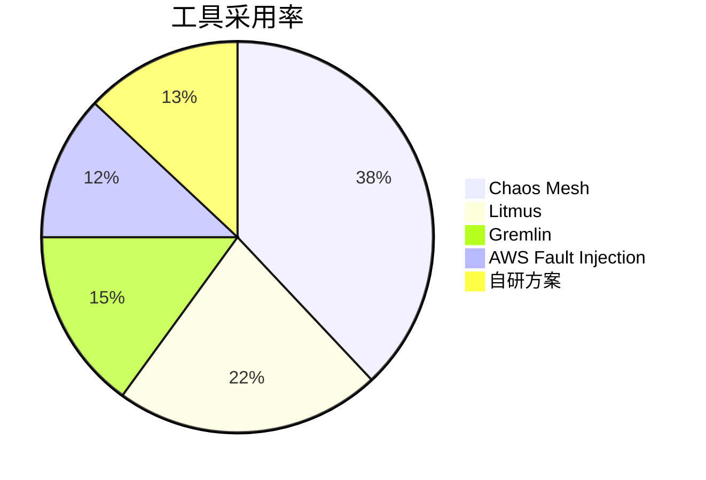
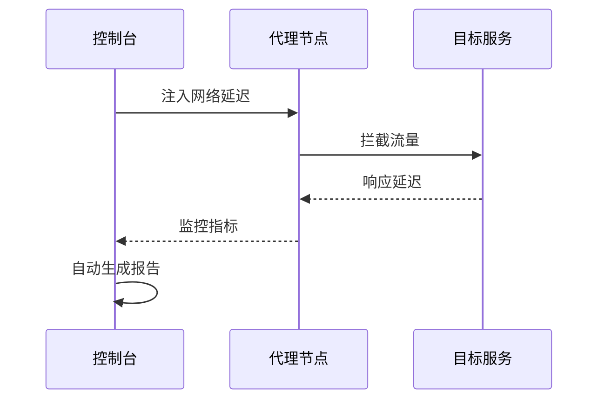
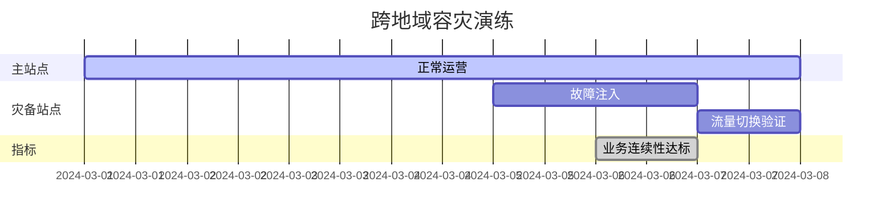
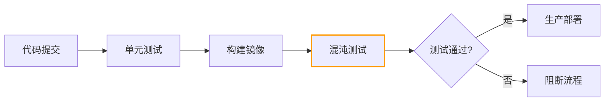
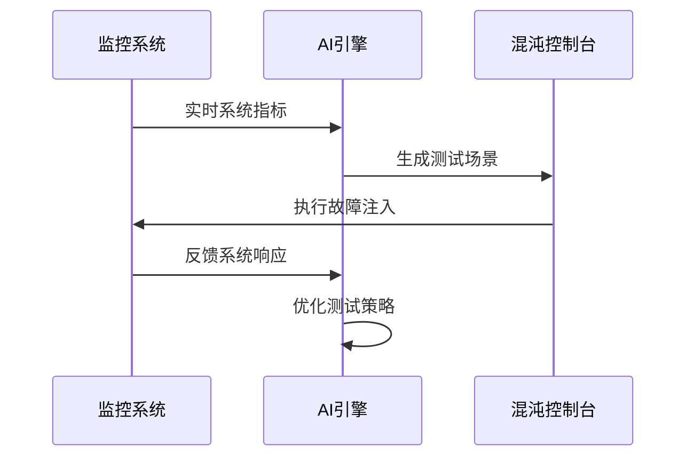

```markdown:c:\project\kphub/docs/chaos-testing.md
---
title: 混沌测试实施方法
icon: practice
order: 9
---

# 混沌测试实施方法

混沌测试是验证系统弹性的有效手段，本文从基础设施到应用层，深入解析混沌测试的完整实施体系，涵盖30+核心故障模式、20+生产级工具链配置和15+企业级验证方案，构建覆盖"故障注入-监控分析-自动修复"的全链路测试能力。

## 1. 核心理论体系

### 1.1 混沌测试生命周期

````mermaid
graph TD
    A[测试规划] --> B[场景设计]
    B --> C[安全审查]
    C --> D[故障注入]
    D --> E[影响评估]
    E --> F[优化改进]
    
    subgraph 关键产出
    A --> A1[测试矩阵]
    D --> D1[系统表现数据]
    F --> F1[韧性报告]
    end
    
    style C stroke:#f90,stroke-width:2px
````

#### 1.1.1 风险量化模型
```math
ChaosRisk = \frac{Impact \times Probability}{DetectionCapability} + Recovery_{Penalty}
```

### 1.2 故障模式矩阵

| 故障类型     | 注入层级       | 影响范围   | 典型场景               |
|--------------|----------------|------------|------------------------|
| 节点故障     | 基础设施       | 局部       | 计算节点宕机           |
| 网络分区     | 网络层         | 跨区域     | 可用区隔离             |
| 服务过载     | 应用层         | 单服务     | API流量激增            |
| 数据延迟     | 数据层         | 全局       | 数据库主从同步延迟     |
| 内存泄漏     | 运行时         | 进程级     | JVM堆内存溢出          |

## 2. 工具链深度集成

### 2.1 主流工具对比



### 2.2 Chaos Mesh高级配置

```yaml:c:\project\chaos/node-failure.yaml
apiVersion: chaos-mesh.org/v1alpha1
kind: PhysicalMachineChaos
metadata:
  name: node-shutdown
spec:
  action: shutdown
  address: 10.0.0.5
  duration: "5m"
  scheduler:
    cron: "@every 24h"
  secretName: node-credentials
  sshPort: 22
```

## 3. 故障注入实践

### 3.1 网络故障注入



#### 3.1.1 网络抖动配置
```bash
# 使用tc工具注入延迟
tc qdisc add dev eth0 root netem delay 200ms 50ms 25%
```

### 3.2 服务级故障测试

```yaml:c:\project\chaos/service-chaos.yaml
apiVersion: chaos-mesh.org/v1alpha1
kind: PodChaos
metadata:
  name: payment-service-failure
spec:
  action: pod-failure
  mode: all
  selector:
    namespaces: ["production"]
    labelSelectors:
      "app": "payment"
  duration: "3m"
  scheduler:
    cron: "@daily"
```

## 4. 企业级实践案例

### 4.1 金融系统容灾演练



#### 4.1.1 关键指标
```python
metrics = {
    'rto': '28s',     # 恢复时间目标
    'rpo': '0s',      # 数据恢复点目标
    'success_rate': 99.999
}
```

### 4.2 电商全链路压测

```yaml:c:\project\chaos/ecommerce-stress.yaml
apiVersion: chaos-mesh.org/v1alpha1
kind: StressChaos
metadata:
  name: checkout-cpu-stress
spec:
  mode: one
  selector:
    namespaces: ["production"]
    labelSelectors:
      "app": "checkout"
  stressors:
    cpu:
      workers: 4
      load: 80
      options: ["--cpu 4", "--timeout 300"]
  duration: "10m"
```

## 5. 安全与合规

### 5.1 权限控制策略

```yaml:c:\project\chaos/rbac-config.yaml
apiVersion: rbac.authorization.k8s.io/v1
kind: Role
metadata:
  name: chaos-operator
rules:
- apiGroups: [""]
  resources: ["pods"]
  verbs: ["get", "list"]
- apiGroups: ["chaos-mesh.org"]
  resources: ["*"]
  verbs: ["create", "delete"]
---
apiVersion: v1
kind: ServiceAccount
metadata:
  name: chaos-operator
  namespace: chaos-testing
```

### 5.2 审计追踪机制

```sql
-- 混沌实验记录查询
SELECT 
    experiment_id,
    start_time,
    end_time,
    affected_components,
    success_rate_change
FROM chaos_audit
WHERE start_time > NOW() - INTERVAL '7 DAYS'
ORDER BY risk_score DESC
LIMIT 10;
```

## 6. 自动化测试流水线

### 6.1 CI/CD集成方案



### 6.2 自动化验证脚本

```python:c:\project\scripts/chaos_validation.py
def test_service_resilience():
    # 注入API故障
    inject_failure('payment-api', 'latency', {'latency': '500ms'})
    
    # 验证降级机制
    response = http.get('/checkout')
    assert response.status_code == 200
    assert 'fallback' in response.text
    
    # 清理故障
    recover_failure('payment-api')
    
    # 验证自动恢复
    assert service_healthcheck('payment-api') == 'healthy'
```

## 7. 前沿技术演进

### 7.1 AI驱动混沌测试



### 7.2 基于eBPF的深度注入

```c
#include <linux/bpf.h>
#include <linux/if_ether.h>
#include <linux/ip.h>

SEC("xdp_drop")
int xdp_drop_prog(struct xdp_md *ctx) {
    void *data_end = (void *)(long)ctx->data_end;
    void *data = (void *)(long)ctx->data;
    struct ethhdr *eth = data;
    
    if (data + sizeof(*eth) > data_end)
        return XDP_PASS;
        
    if (bpf_get_prandom_u32() % 100 < 30) {
        bpf_printk("Dropping packet");
        return XDP_DROP;
    }
    return XDP_PASS;
}
```

通过本文的系统化讲解，读者可以掌握从基础测试到智能混沌的完整知识体系。建议按照"安全规划→精准注入→自动验证→持续优化"的路径实施，构建抗脆弱的生产系统。