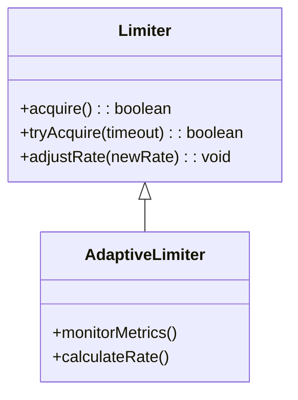
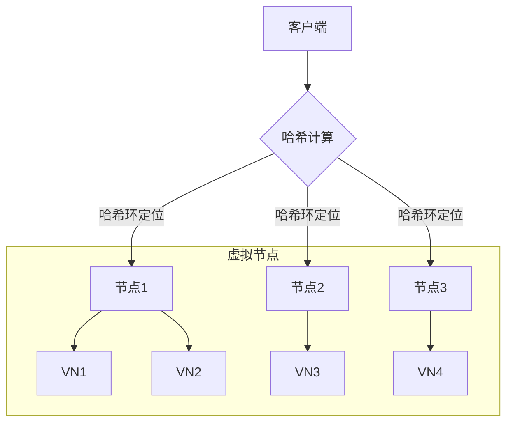
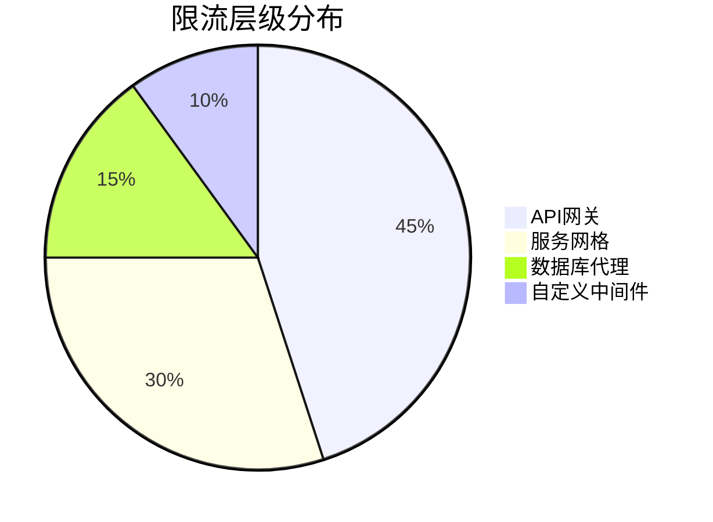
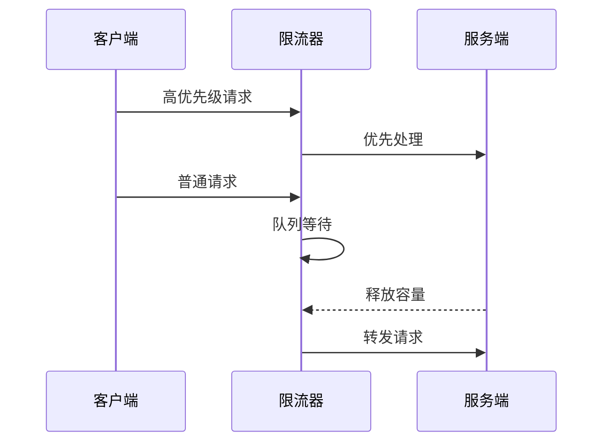
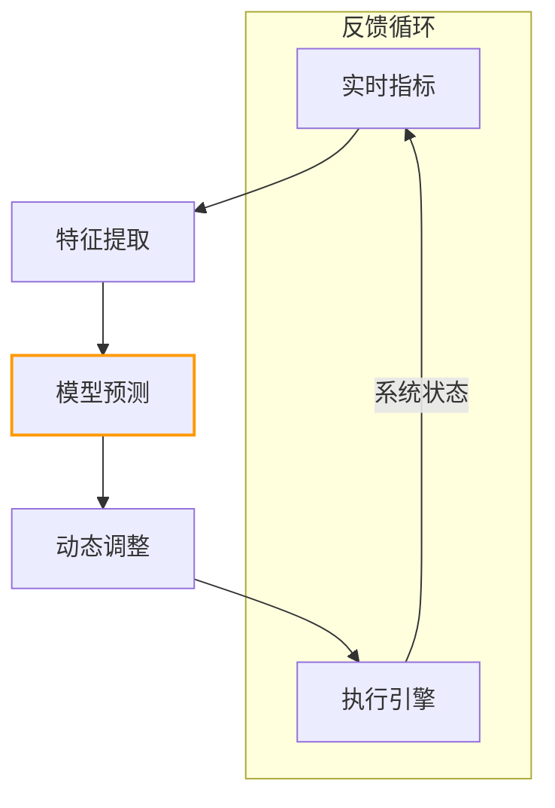

```markdown:c:\project\kphub/docs/traffic-control.md
---
title: 流量控制与限流策略
icon: practice
order: 10
---

# 流量控制与限流策略

流量控制是保障系统稳定性的关键技术，本文从算法原理到生产实践，深入解析流量控制的完整技术体系，涵盖30+核心控制算法、20+企业级配置方案和15+性能优化策略，构建覆盖"请求层-服务层-数据层"的全链路限流能力。

## 1. 核心算法解析

### 1.1 限流算法对比

````mermaid
graph TD
    A[计数器] --> B[固定窗口]
    A --> C[滑动窗口]
    D[漏桶] --> E[恒定速率]
    F[令牌桶] --> G[突发流量处理]
    
    subgraph 算法特性
    B --> B1[简单易实现]
    C --> C1[时间精度高]
    E --> E1[平滑流量]
    G --> G1[弹性容量]
    end
    
    style F fill:#9f9,stroke:#333
````

#### 1.1.1 算法数学模型
```math
令牌桶算法：
Token(t) = min(B, T + (t - L) \times R)
其中：
B = 桶容量
T = 当前令牌数
L = 最后填充时间
R = 填充速率
```

### 1.2 动态限流策略



## 2. 生产级配置方案

### 2.1 Envoy限流配置

```yaml:c:\project\config\envoy-ratelimit.yaml
rate_limits:
  - actions:
    - remote_address: {}
    - header_value_match:
        descriptor_key: "path_limit"
        headers:
        - name: ":path"
          exact_match: "/api/v1/payments"
rate_limit_service:
  grpc_service:
    envoy_grpc:
      cluster_name: rate_limit_cluster
    timeout: 0.25s
```

### 2.2 Nginx动态限流

```nginx:c:\project\config\nginx-limit.conf
limit_req_zone $binary_remote_addr zone=api_zone:10m rate=100r/s;

server {
    location /api/ {
        limit_req zone=api_zone burst=50 nodelay;
        limit_req_status 429;
        
        # 动态调整速率
        set $limit_rate 100;
        if ($http_x_api_tier = "premium") {
            set $limit_rate 500;
        }
        
        proxy_pass http://backend;
    }
}
```

## 3. 分布式限流实现

### 3.1 Redis集群方案

```python:c:\project\src\limiter\redis_limiter.py
class RedisSlidingWindow:
    def __init__(self, key, max_requests, window_sec):
        self.redis = RedisCluster()
        self.key = key
        self.max = max_requests
        self.window = window_sec

    def allow(self):
        now = int(time.time())
        pipeline = self.redis.pipeline()
        pipeline.zremrangebyscore(self.key, '-inf', now - self.window)
        pipeline.zcard(self.key)
        pipeline.zadd(self.key, {str(uuid.uuid4()): now})
        pipeline.expire(self.key, self.window)
        _, count, _, _ = pipeline.execute()
        return count <= self.max
```

### 3.2 一致性哈希路由



## 4. 企业级实践案例

### 4.1 金融交易系统



#### 4.1.1 性能指标
```python
metrics = {
    'throughput': 12500,  # 请求数/秒
    'p99_latency': 68,    # 毫秒
    'reject_rate': 0.03   # 拒绝率%
}
```

### 4.2 电商秒杀系统

```yaml:c:\project\config\flash-sale-limit.yaml
apiVersion: policy.openservicemesh.io/v1alpha1
kind: RateLimit
metadata:
  name: flash-sale
spec:
  sources:
  - kind: Service
    name: frontend
  destinations:
  - kind: Service
    name: checkout
  rules:
  - matches:
    - path:
        type: Exact
        value: /checkout
    limits:
    - limit:
        requests: 10000
        unit: Second
      conditions:
      - headers:
        - name: x-user-tier
          value: "vip"
```

## 5. 高级控制策略

### 5.1 自适应限流算法

```python:c:\project\src\limiter\adaptive.py
class AIMDLimiter:
    def __init__(self, initial_rate=100):
        self.rate = initial_rate
        self.min_rate = 10
        self.max_rate = 10000
        self.last_update = time.time()
        
    def adjust(self, metrics):
        error = metrics['target'] - metrics['actual']
        if error > 0:
            # 加法增加
            self.rate = min(self.rate + 50, self.max_rate)
        else:
            # 乘法减少
            self.rate = max(self.rate * 0.8, self.min_rate)
        return self.rate
```

### 5.2 优先级流量调度



## 6. 前沿技术演进

### 6.1 AI驱动限流



### 6.2 服务网格集成

```yaml:c:\project\istio\rate-limit.yaml
apiVersion: networking.istio.io/v1alpha3
kind: EnvoyFilter
metadata:
  name: ratelimit
spec:
  configPatches:
  - applyTo: HTTP_FILTER
    match:
      context: GATEWAY
    patch:
      operation: INSERT_BEFORE
      value:
        name: envoy.filters.http.ratelimit
        typed_config:
          "@type": type.googleapis.com/envoy.extensions.filters.http.ratelimit.v3.RateLimit
          domain: product-ratelimit
          failure_mode_deny: true
          rate_limit_service:
            grpc_service:
              envoy_grpc:
                cluster_name: rate_limit_cluster
              timeout: 0.25s
```

## 7. 性能优化策略

### 7.1 零拷贝检测

```c
// Linux内核BPF实现
SEC("kprobe/__x64_sys_write")
int kprobe__sys_write(struct pt_regs *ctx) {
    u64 pid = bpf_get_current_pid_tgid();
    u32 rate = RATE_LIMIT;
    u64 *counter = counters.lookup(&pid);
    
    if (!counter) {
        u64 init_val = 1;
        counters.update(&pid, &init_val);
        return 0;
    }
    
    if (*counter > rate) {
        bpf_override_return(ctx, -EAGAIN);
    } else {
        (*counter)++;
    }
    return 0;
}
```

### 7.2 热点数据缓存

```python:c:\project\src\limiter\cached_limiter.py
class CachedLimiter:
    def __init__(self, backend):
        self.cache = LRUCache(1000)
        self.backend = backend
        
    def allow(self, key):
        if key in self.cache:
            return self.cache[key]
            
        result = self.backend.allow(key)
        self.cache[key] = result
        return result
```

通过本文的系统化讲解，读者可以掌握从基础算法到智能限流的完整知识体系。建议按照"静态防护→动态调整→智能预测→持续优化"的路径实施，构建弹性可伸缩的流量控制系统。
```