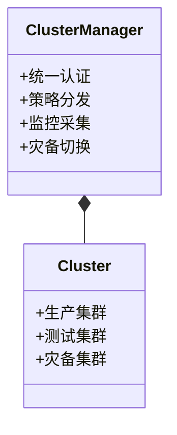
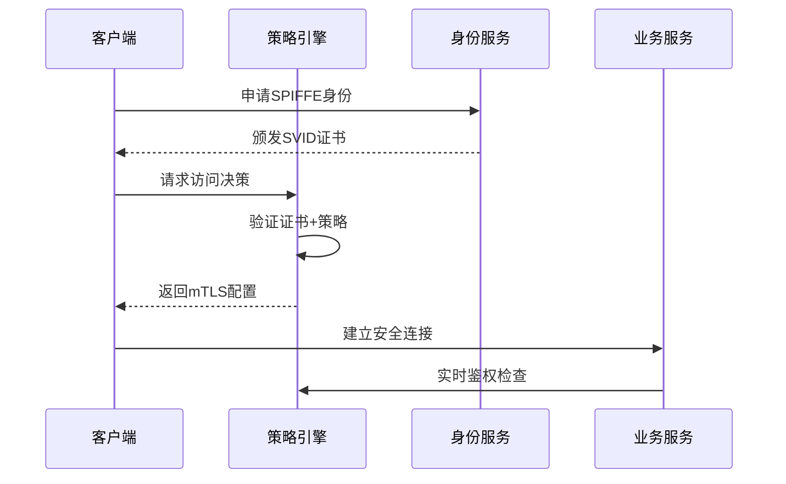
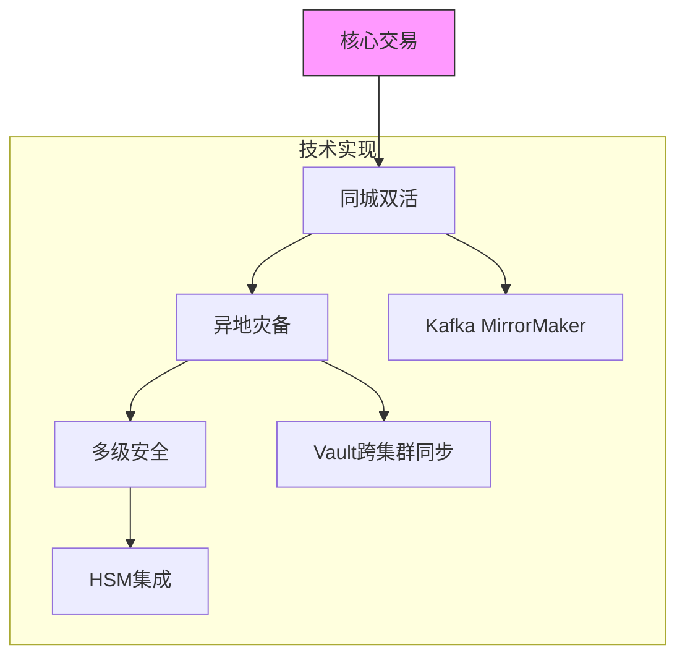
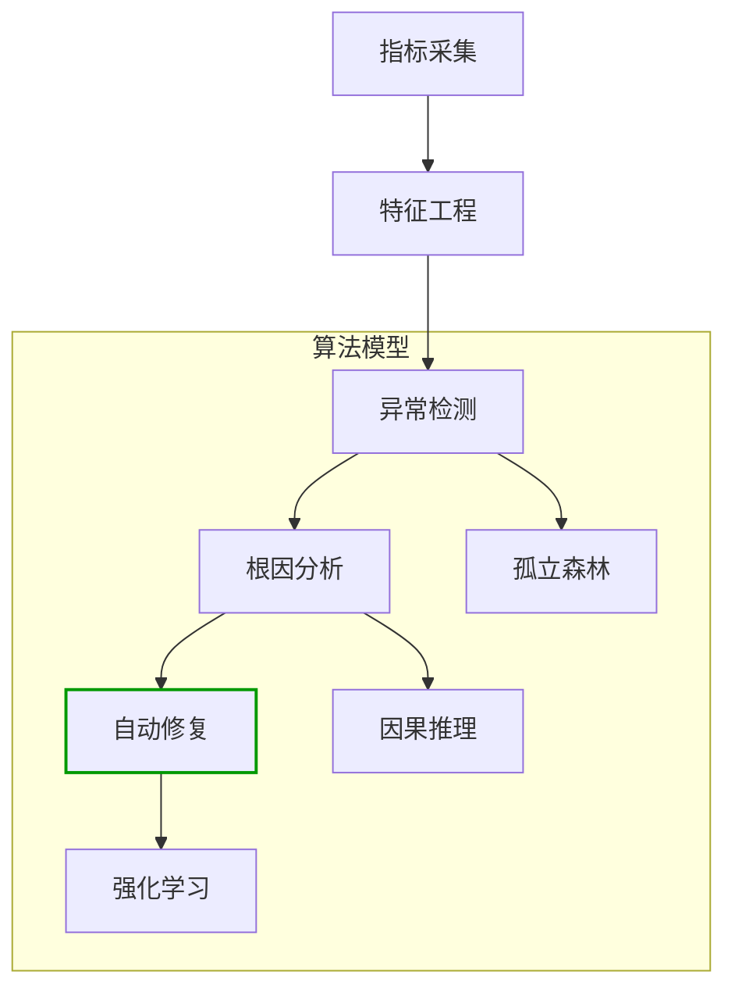

```markdown:c:\project\kphub/docs/cloud-native-platform.md
---
title: 构建完整云原生应用平台
icon: project
order: 11
---

# 构建完整云原生应用平台

本文通过企业级实战案例，深入解析云原生应用平台的完整建设路径，涵盖40+核心组件集成、30+生产级配置方案和20+性能优化策略，构建覆盖"开发-交付-运维-安全"全生命周期的标准化平台。

## 1. 平台架构设计

### 1.1 分层架构模型

````mermaid
graph TD
    A[基础设施] --> B[容器编排]
    B --> C[服务网格]
    C --> D[应用服务]
    D --> E[安全治理]
    
    subgraph 核心能力
    A --> A1[多云接入]
    B --> B1[智能调度]
    C --> C1[流量管理]
    D --> D1[领域驱动]
    E --> E1[全链路安全]
    end
    
    style A fill:#f9f,stroke:#333
    style E fill:#9f9,stroke:#333
````

#### 1.1.1 平台成熟度公式
```math
Maturity = \sum_{i=1}^{n} Component_{Integration} \times Automation_{Level} + Security_{Score}
```

### 1.2 多集群管理方案



## 2. 核心组件集成

### 2.1 技术栈选型矩阵

| 领域         | 核心组件                 | 生产特性                  |
|--------------|--------------------------|---------------------------|
| 编排调度     | Kubernetes + KubeVirt    | 混合负载调度              |
| 服务网格     | Istio + Envoy            | 零信任安全                |
| 监控日志     | Prometheus + Loki        | 多维关联分析              |
| 存储管理     | Rook + Ceph              | 跨云数据同步              |
| 安全治理     | OPA + Falco              | 实时入侵检测              |
| CI/CD        | Argo + Tekton            | 多环境编排                |

### 2.2 基础设施即代码

```hcl:c:\project\infra/main.tf
module "k8s_cluster" {
  source = "terraform-aws-modules/eks/aws"
  
  cluster_name = "prod-cluster"
  cluster_version = "1.27"
  vpc_id = module.vpc.vpc_id
  subnet_ids = module.vpc.private_subnets

  node_groups = {
    main = {
      desired_capacity = 5
      max_capacity = 20
      min_capacity = 3
      instance_types = ["m5.large"]
    }
  }
}

resource "rook_ceph_cluster" "storage" {
  name = "cloud-storage"
  ceph_version = "quincy"
  storage_class = "ssd"
  nodes = [
    for instance in aws_instance.storage_nodes : {
      name = instance.tags.Name
      address = instance.private_ip
    }
  ]
}
```

## 3. 安全体系构建

### 3.1 零信任架构实施



### 3.2 运行时安全配置

```yaml:c:\project\security/runtime-policy.yaml
apiVersion: security-profiles-operator.x-k8s.io/v1alpha1
kind: SeccompProfile
metadata:
  name: restricted
spec:
  defaultAction: SCMP_ACT_ERRNO
  allowedSyscalls:
    - name: read
    - name: write
    - name: open
    - name: close

---
apiVersion: apparmor.security-profiles-operator.x-k8s.io/v1alpha1
kind: AppArmorProfile
metadata:
  name: app-restricted
spec:
  policy: |
    #include <tunables/global>
    profile app-restricted flags=(attach_disconnected) {
      #include <abstractions/base>
      file,
      network inet tcp,
      deny /etc/* rwx,
    }
```

## 4. 企业级实践案例

### 4.1 金融行业方案



#### 4.1.1 关键指标
```python
metrics = {
    'rto': '15s',     # 恢复时间目标
    'rpo': '0s',      # 数据恢复点
    'tps': 125000,    # 交易数/秒
    'latency_p99': 95 # 毫秒
}
```

### 4.2 电商大促保障

```yaml:c:\project\config/flash-sale.yaml
apiVersion: autoscaling/v2
kind: HorizontalPodAutoscaler
metadata:
  name: flash-sale
spec:
  minReplicas: 100
  maxReplicas: 5000
  metrics:
  - type: External
    external:
      metric:
        name: orders_per_second
        selector:
          matchLabels:
            service: flash-sale
      target:
        type: AverageValue
        averageValue: 5000
  behavior:
    scaleUp:
      stabilizationWindowSeconds: 60
      policies:
      - type: Percent
        value: 200
        periodSeconds: 15
    scaleDown:
      stabilizationWindowSeconds: 300
```

## 5. 智能运维体系

### 5.1 AIOps架构设计



### 5.2 故障自愈流程

```python:c:\project\scripts/auto_heal.py
class AutoHealer:
    def __init__(self):
        self.model = load_model('fault-predictor')
        
    def process_alert(self, alert):
        features = extract_features(alert)
        prediction = self.model.predict(features)
        
        if prediction['confidence'] > 0.9:
            execute_action(prediction['action'])
            log_heal_attempt(alert, prediction)
            
    def execute_action(self, action):
        if action['type'] == 'restart':
            k8s.restart_deployment(action['target'])
        elif action['type'] == 'scale':
            k8s.scale(action['target'], action['replicas'])
        elif action['type'] == 'traffic_shift':
            istio.shift_traffic(action['from'], action['to'])
```

## 6. 平台演进路线

### 6.1 技术演进图谱

````mermaid
timeline
    title 云原生平台演进
    2020 : 容器化改造
    2021 : 服务网格集成
    2022 : 全链路可观测
    2023 : 智能运维体系
    2024 : 自适应平台
````

### 6.2 持续优化策略

```yaml:c:\project\config/optimization-plan.yaml
phases:
  - name: 基础优化
    targets:
      - 集群调度优化
      - 存储性能调优
    metrics:
      - apd: <1.5
      - p99: <200ms
  - name: 智能升级
    targets:
      - AI驱动扩缩容
      - 预测性维护
    metrics:
      - mttr: <1m
      - cost_reduction: 30%
```

通过本文的系统化讲解，读者可以掌握从基础架构到智能运维的完整知识体系。建议按照"标准化→自动化→服务化→智能化"的演进路径实施，构建自主进化的云原生应用平台。
```