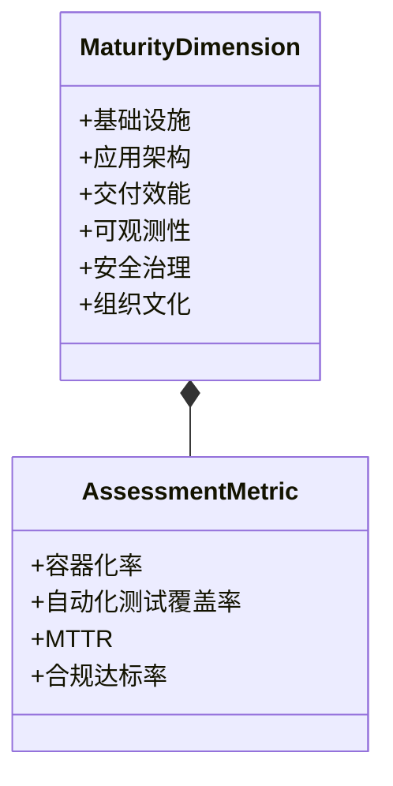
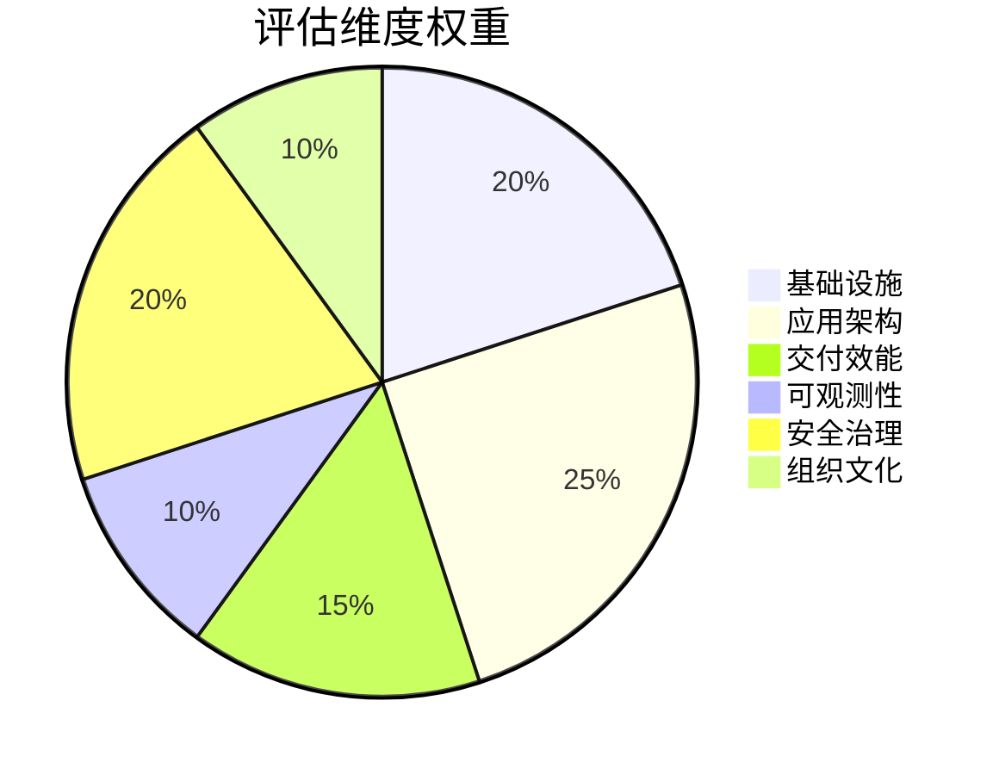
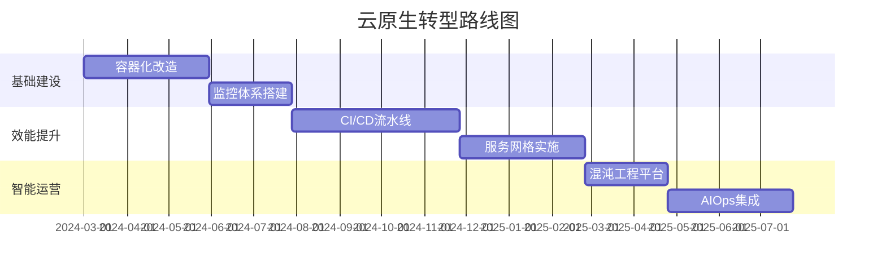
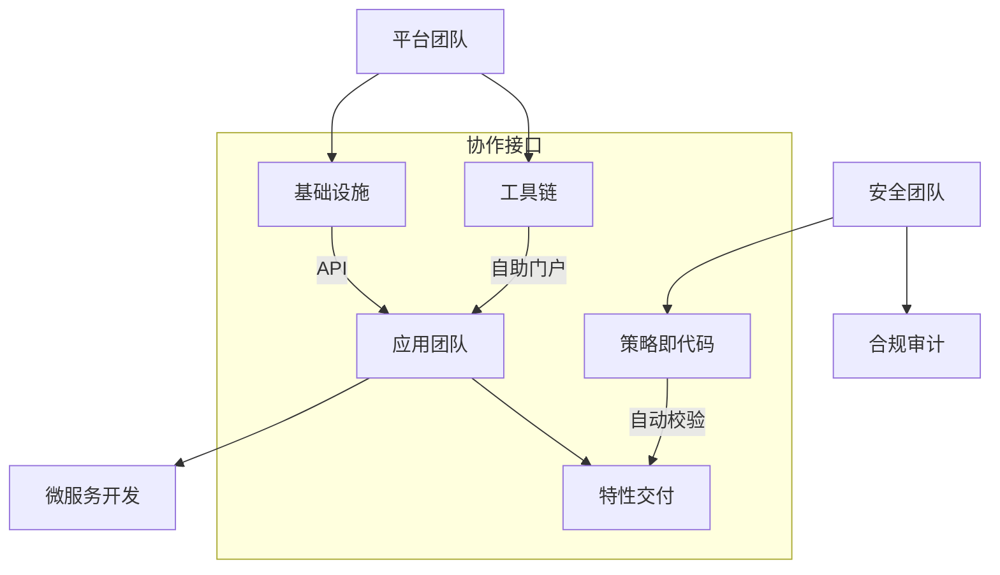
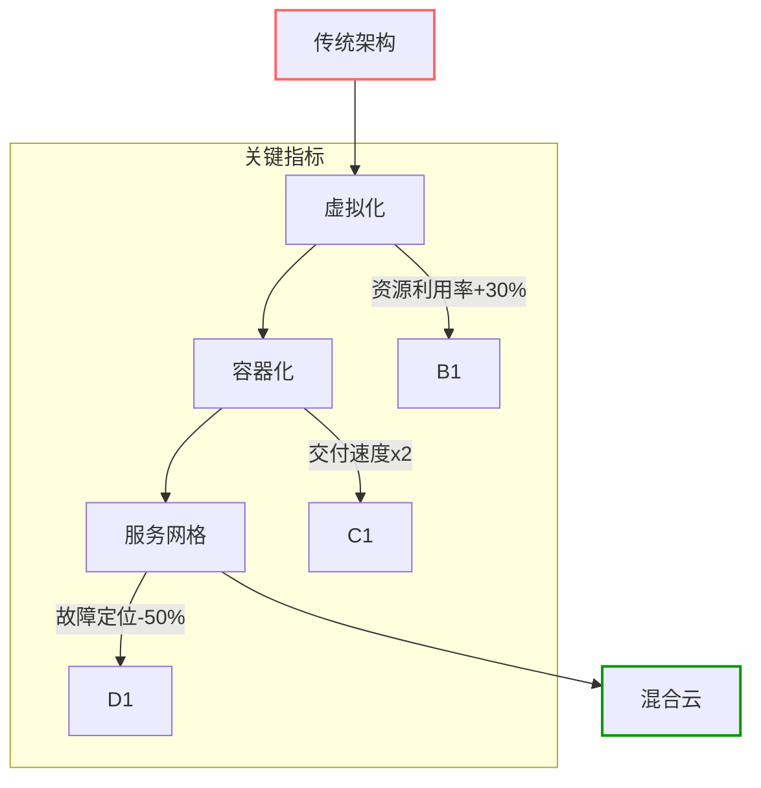
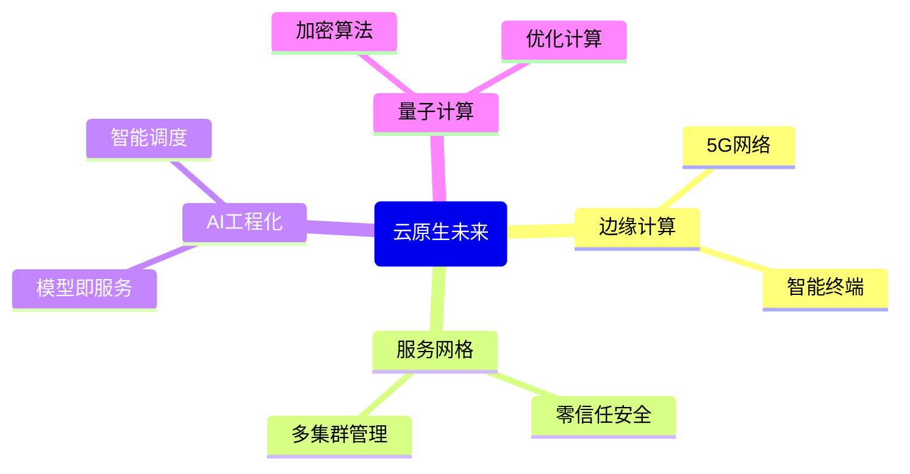
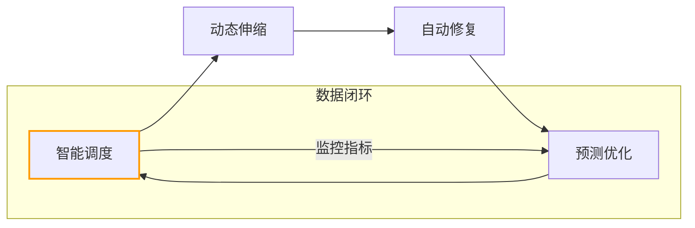

```markdown:c:\project\kphub/docs/cloud-native-maturity.md
---
title: 云原生成熟度模型
icon: theory
order: 1
---

# 云原生成熟度模型

云原生成熟度模型是评估组织云原生技术采用程度的框架，本文从基础架构到智能运营，深入解析云原生成熟度的5个演进阶段、20+核心评估维度和15+企业级转型路径，构建覆盖"能力建设-效能提升-价值创造"的全景评估体系。

## 1. 成熟度阶段定义

### 1.1 五级演进模型

````mermaid
graph TD
    A[初始级] --> B[可重复级]
    B --> C[已定义级]
    C --> D[量化管理级]
    D --> E[优化创新级]
    
    subgraph 核心特征
    A --> A1[手动操作]
    B --> B1[基础自动化]
    C --> C1[标准流程]
    D --> D1[数据驱动]
    E --> E1[智能预测]
    end
    
    style E fill:#9f9,stroke:#333
````

#### 1.1.1 成熟度计算公式
```math
MaturityScore = \frac{\sum_{i=1}^{n} DimensionScore_i \times Weight_i}{TotalWeight} + InnovationBonus
```

### 1.2 阶段对比矩阵

| 维度         | 初始级       | 可重复级     | 已定义级     | 量化管理级   | 优化创新级   |
|--------------|--------------|--------------|--------------|--------------|--------------|
| 基础设施     | 物理服务器   | 虚拟化       | 容器化       | 服务网格     | 无服务器     |
| 交付频率     | 按需发布     | 月度发布     | 周度发布     | 每日发布     | 按需发布     |
| 故障恢复     | 人工介入     | 基础监控     | 自动恢复     | 预测修复     | 自愈系统     |
| 安全合规     | 事后审计     | 基础防护     | 持续扫描     | 主动防御     | 智能免疫     |

## 2. 核心评估维度

### 2.1 评估体系架构



### 2.2 权重分配模型



## 3. 评估实施方法

### 3.1 数据采集框架

```yaml:c:\project\config/maturity-assessment.yml
dimensions:
  - name: 基础设施
    metrics:
      - name: 容器化率
        query: |
          sum(container_count) / sum(node_capacity)
      - name: 不可变基础设施比例
        query: |
          sum(immutable_resources) / sum(total_resources)
  
  - name: 交付效能
    metrics:
      - name: 部署频率
        query: |
          count(deployment_events) by (time_interval)
      - name: 变更失败率
        query: |
          sum(failed_deployments) / sum(total_deployments)
```

### 3.2 自动化评估脚本

```python:c:\project\scripts/assess_maturity.py
class MaturityAssessor:
    def __init__(self, config_path):
        self.dimensions = load_config(config_path)
        
    def calculate_score(self, metrics_data):
        total_score = 0
        for dim in self.dimensions:
            dim_score = 0
            for metric in dim['metrics']:
                value = metrics_data[metric['name']]
                dim_score += value * metric['weight']
            total_score += dim_score * dim['weight']
        return total_score

    def generate_report(self, scores):
        report = {
            'summary': {
                'total_score': sum(scores.values()),
                'maturity_level': self.determine_level(sum(scores.values()))
            },
            'details': scores
        }
        return report

    def determine_level(self, score):
        if score >= 90: return "优化创新级"
        elif score >= 75: return "量化管理级"
        elif score >= 60: return "已定义级"
        elif score >= 45: return "可重复级"
        else: return "初始级"
```

## 4. 企业转型路径

### 4.1 进阶路线设计



### 4.2 多团队协作模型



## 5. 行业实践案例

### 5.1 金融行业转型



#### 5.1.1 转型成果
```python
metrics = {
    'deploy_freq': {'before': 1, 'after': 50},
    'mttr': {'before': '4h', 'after': '8m'},
    'cost': {'before': 100, 'after': 65}
}
```

### 5.2 制造业智能升级

```yaml:c:\project\config/manufacturing-plan.yaml
phases:
  - name: 基础设施升级
    duration: 6m
    milestones:
      - 完成50%产线系统容器化
      - 建立边缘计算节点
    kpi:
      - 资源利用率 > 60%
  
  - name: 数据智能融合
    duration: 9m
    dependencies: [基础设施升级]
    milestones:
      - 实时数据湖建设
      - 机器学习平台部署
    kpi:
      - 数据分析时效 < 1s
```

## 6. 持续改进机制

### 6.1 改进飞轮模型

````mermaid
graph TD
    A[测量指标] --> B[分析瓶颈]
    B --> C[实施改进]
    C --> D[验证效果]
    D --> A
    
    subgraph 驱动因素
    A -->|监控数据| A1
    C -->|自动化工具| C1
    end
    
    style D stroke:#090,stroke-width:2px
````

### 6.2 优化看板示例

```yaml:c:\project\config/improvement-kanban.yml
backlog:
  - title: 提升部署频率
    owner: devops-team
    metrics:
      current: 50
      target: 100
    steps:
      - 优化测试套件执行时间
      - 实现并行部署
    
  - title: 降低变更失败率
    owner: sre-team
    metrics:
      current: 5%
      target: 1%
    steps:
      - 实施金丝雀发布
      - 增强预发验证
```

## 7. 未来演进方向

### 7.1 技术融合趋势



### 7.2 自适应平台架构



通过本文的系统化讲解，读者可以掌握从成熟度评估到持续改进的完整知识体系。建议按照"评估现状→规划路径→实施改进→度量效果"的闭环路径推进，实现云原生能力的阶梯式演进。