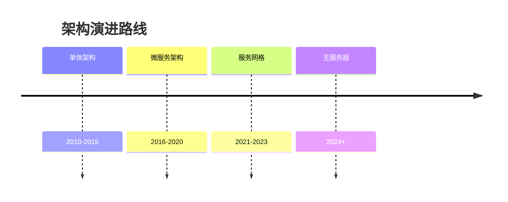
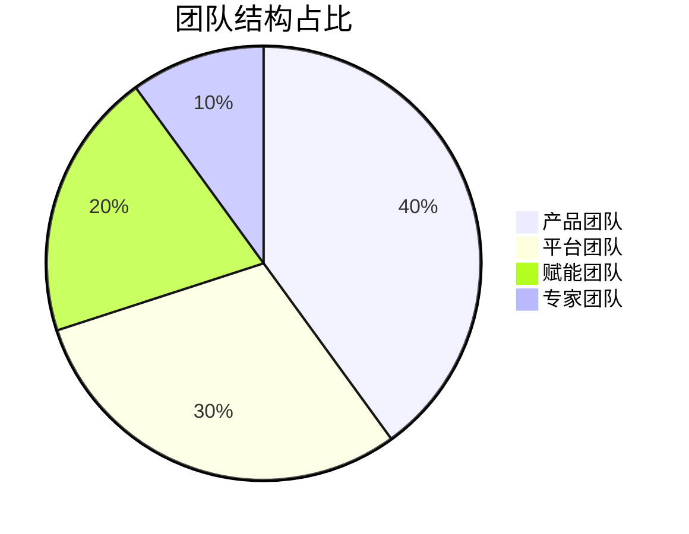
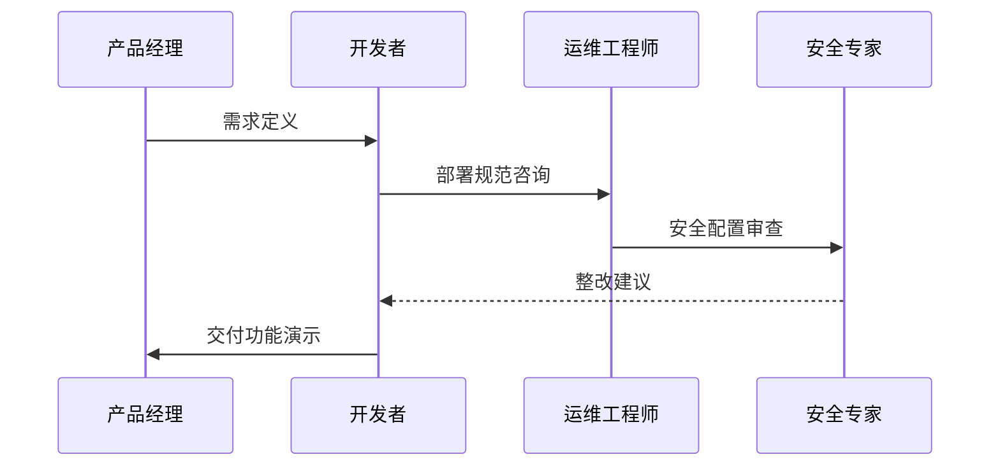
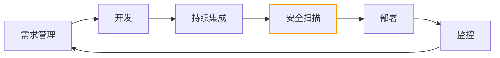
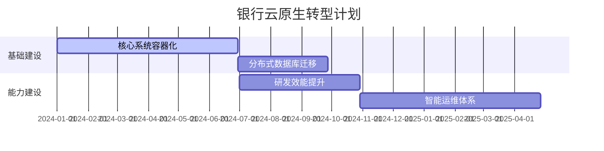
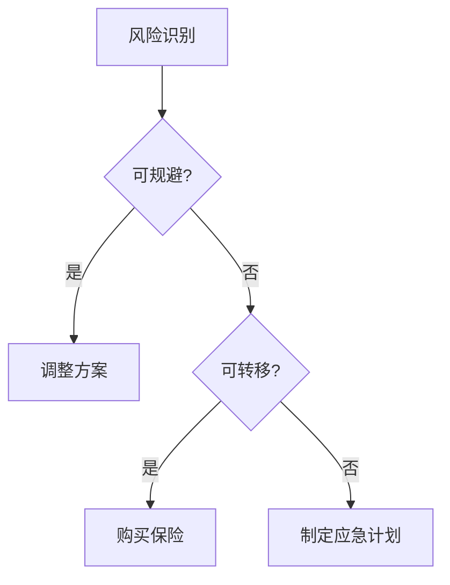
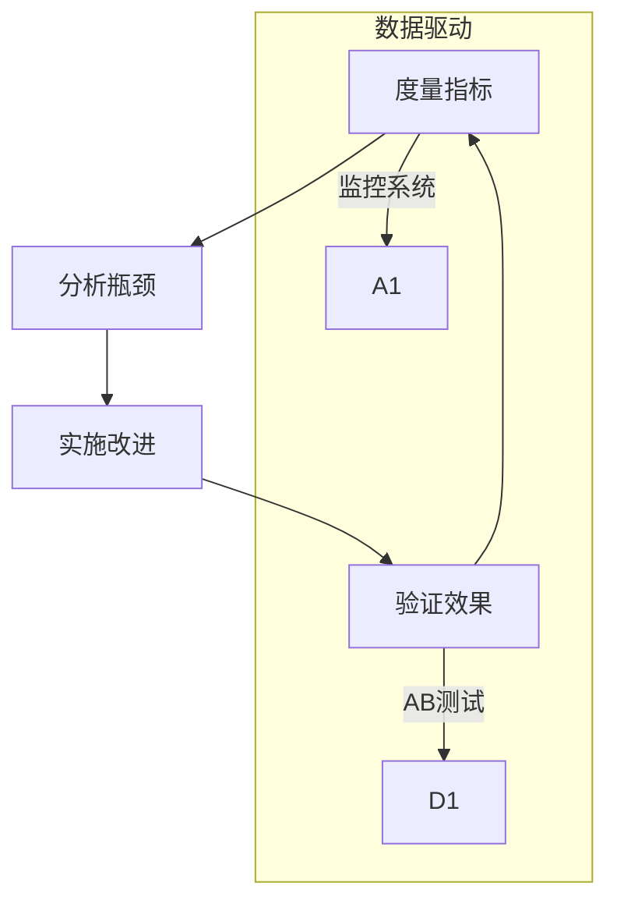

```markdown:c:\project\kphub/docs/cloud-native-transformation.md
---
title: 云原生转型策略
icon: theory
order: 2
---

# 云原生转型策略

云原生转型是一个复杂的技术和组织变革过程，本文从战略规划到落地实施，深入解析云原生转型的完整方法论体系，涵盖30+核心转型模式、20+企业级实践案例和15+效能提升路径，构建覆盖"技术-流程-组织-文化"四位一体的转型框架。

## 1. 战略规划体系

### 1.1 转型阶段模型

````mermaid
graph TD
    A[现状评估] --> B[目标定义]
    B --> C[路径规划]
    C --> D[试点实施]
    D --> E[规模推广]
    E --> F[持续优化]
    
    subgraph 关键产出
    A --> A1[成熟度报告]
    C --> C1[路线图]
    E --> E1[最佳实践]
    end
    
    style F fill:#9f9,stroke:#333
````

#### 1.1.1 转型ROI公式
```math
ROI = \frac{BusinessValue - (TechCost + OrgCost)}{Time} \times RiskFactor
```

### 1.2 转型投资矩阵

| 领域         | 短期投资(1Y)       | 中期投资(2-3Y)      | 长期投资(3Y+)      |
|--------------|--------------------|---------------------|--------------------|
| 基础设施     | 容器平台建设       | 服务网格部署        | 无服务器架构       |
| 研发效能     | CI/CD流水线       | 自动化测试平台      | AI辅助开发         |
| 组织能力     | DevOps培训         | 平台团队建设        | 产品工程文化       |
| 安全治理     | 基础安全加固       | 零信任架构          | 智能安全运营       |

## 2. 技术转型路径

### 2.1 架构演进路线



### 2.2 技术选型框架


#### 2.2.1 选型评分模型
```python
def evaluate_tool(requirements):
    score = 0
    # 技术匹配度
    score += sum(req['weight'] * req['match'] for req in requirements)
    # 社区活跃度
    score += math.log(github_stars) * 0.2
    # 团队熟悉度
    score -= (1 - team_familiarity) * 50
    return score
```

## 3. 组织能力建设

### 3.1 团队拓扑模型



### 3.2 跨职能协作



## 4. 流程改造实践

### 4.1 端到端交付流水线



### 4.2 自动化流水线配置

```yaml:c:\project\config\gitlab-ci.yml
stages:
  - build
  - test
  - security
  - deploy

build:
  stage: build
  script:
    - mvn clean package
  artifacts:
    paths:
      - target/*.jar

security-scan:
  stage: security
  image: owasp/zap2docker
  script:
    - zap-baseline.py -t $URL -r report.html

canary-deploy:
  stage: deploy
  environment: production
  script:
    - kubectl apply -f canary/
    - ./wait-for-rollout.sh
  only:
    - master
```

## 5. 文化转型路径

### 5.1 文化度量模型

```mermaid
radar-chart
    title 文化成熟度
    "失败容忍" : 85
    "持续学习" : 70
    "协作共享" : 90
    "客户导向" : 95
    "数据驱动" : 75
```

### 5.2 转型激励机制

```yaml:c:\project\config\transformation-kpi.yaml
metrics:
  - name: 部署频率
    target: 50次/天
    weight: 0.3
  - name: 变更失败率
    target: <1%
    weight: 0.2
  - name: 服务SLA
    target: 99.99%
    weight: 0.25
  - name: 技术债务
    target: 每周减少5%
    weight: 0.25
```

## 6. 企业级实践案例

### 6.1 金融行业转型



#### 6.1.1 转型成效
```python
metrics = {
    'transaction_volume': {'before': 1e6, 'after': 2.5e6},
    'cost_per_transaction': {'before': 0.15, 'after': 0.06},
    'incident_mttr': {'before': '4h', 'after': '8m'}
}
```

### 6.2 制造业智能升级

```yaml:c:\project\config\manufacturing-plan.yaml
transformation-phases:
  - name: 边缘计算升级
    duration: 6m
    targets:
      - 部署1000+边缘节点
      - 构建5G专网
    kpis:
      - 数据延迟 < 50ms
      
  - name: 数字孪生平台
    duration: 12m
    dependencies: [边缘计算升级]
    targets:
      - 关键设备100%数字化
      - 预测性维护覆盖率80%
```

## 7. 风险与应对

### 7.1 风险雷达图

```mermaid
radar-chart
    title 转型风险分布
    "技术债务" : 85
    "技能缺口" : 70
    "架构复杂度" : 60
    "组织阻力" : 45
    "合规风险" : 55
```

### 7.2 风险应对策略



## 8. 持续改进机制

### 8.1 改进飞轮模型



### 8.2 改进看板示例

```yaml:c:\project\config\improvement-kanban.yaml
backlog:
  - title: 流水线执行时间优化
    owner: devops
    metrics:
      current: 15min
      target: 8min
    steps:
      - 优化测试并行度
      - 使用缓存镜像
      
  - title: 生产事故复盘
    owner: sre
    status: done
    outcomes:
      - 新增3条监控规则
      - 完善回滚流程
```

通过本文的系统化讲解，读者可以掌握从战略规划到持续改进的完整转型方法论。建议按照"评估-规划-试点-推广-优化"的闭环路径推进，实现云原生能力的阶梯式演进。