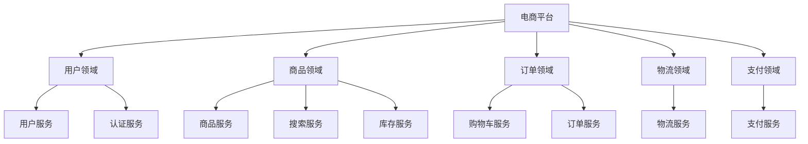
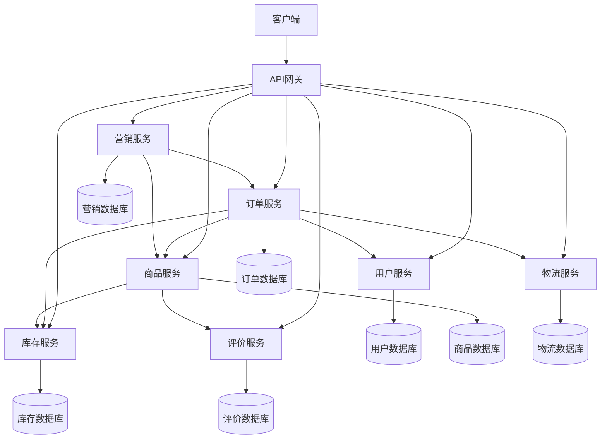

# 微服务拆分实战指南

微服务拆分是实现云原生架构的关键步骤，本文将详细介绍微服务拆分的原则、方法和实践技巧，帮助团队合理划分服务边界，构建松耦合、高内聚的微服务架构。

## 微服务拆分概述

微服务架构是一种将单体应用分解为一组小型服务的架构风格，每个服务运行在自己的进程中，服务之间通过轻量级通信机制（通常是HTTP API）进行通信。这些服务围绕业务能力构建，可以通过全自动部署机制独立部署，服务之间的集中管理最少，可以用不同的编程语言编写，使用不同的数据存储技术。

### 微服务架构的优势

1. **技术异构性**：不同服务可以使用不同的技术栈，选择最适合特定问题的技术
2. **弹性**：服务故障相对隔离，不会导致整个系统崩溃
3. **可扩展性**：可以针对需求高的服务单独扩展，而不是扩展整个应用
4. **部署灵活性**：服务可以独立部署，加快交付速度
5. **组织对齐**：微服务架构可以更好地与组织结构对齐，支持小型自主团队
6. **可组合性**：服务可以以不同方式组合，提供不同的功能
7. **可替代性**：单个服务可以相对容易地替换或重写

### 微服务架构的挑战

1. **分布式系统复杂性**：需要处理网络延迟、容错、消息序列化等问题
2. **服务边界定义**：合理划分服务边界是一项挑战
3. **数据一致性**：分布式事务管理复杂
4. **运维复杂性**：需要管理多个服务的部署、监控和故障排除
5. **测试复杂性**：端到端测试变得更加复杂
6. **服务间依赖**：服务间依赖管理和版本控制的挑战
7. **团队协作**：需要更高效的团队协作和沟通机制

## 微服务拆分原则

成功的微服务拆分需要遵循一系列原则，这些原则可以指导团队在拆分过程中做出合理的决策。

### 1. 单一职责原则

每个微服务应该只负责一个特定的业务功能或领域。这符合单一职责原则(SRP)，使服务更容易理解、开发和维护。

**示例**：在电商系统中，可以将用户管理、商品目录、订单处理、支付处理等作为独立的微服务。

**判断标准**：
- 服务是否有明确的业务边界？
- 服务的功能是否聚焦于解决特定领域问题？
- 服务的代码是否因为相同原因而变化？

### 2. 高内聚原则

微服务内部的组件应该紧密相关，共同完成特定功能。高内聚的服务更容易理解和维护。

**示例**：订单服务应包含订单创建、查询、修改、取消等与订单直接相关的功能，而不应包含用户认证或商品库存等功能。

**判断标准**：
- 服务内的组件是否紧密协作？
- 是否存在频繁一起变化的功能？
- 服务是否包含了不相关的功能？

### 3. 松耦合原则

微服务之间应该尽量减少依赖，通过定义良好的接口进行通信。松耦合的服务可以独立演化和部署。

**示例**：订单服务不应直接访问用户服务的数据库，而应通过API调用获取所需的用户信息。

**判断标准**：
- 服务之间是否通过标准化接口通信？
- 一个服务的变化是否会导致其他服务也需要变化？
- 服务是否可以独立部署和扩展？

### 4. 领域驱动设计原则

基于业务领域模型进行服务划分，确保服务边界与业务领域一致。

**示例**：在保险系统中，可以按照保单管理、理赔处理、客户管理等领域划分服务。

**判断标准**：
- 服务边界是否与业务领域一致？
- 是否定义了清晰的限界上下文(Bounded Context)？
- 服务是否使用统一语言(Ubiquitous Language)？

### 5. 数据自治原则

每个微服务应该拥有并管理自己的数据，避免多个服务共享数据库。

**示例**：用户服务管理用户数据库，订单服务管理订单数据库，而不是共享同一个数据库。

**判断标准**：
- 服务是否拥有自己的数据存储？
- 是否避免了跨服务的数据库访问？
- 数据变更是否只通过服务API进行？

### 6. 接口稳定原则

服务接口应该稳定，变更应该向后兼容，避免破坏依赖该服务的其他服务。

**示例**：API版本控制，新增字段而不是修改或删除现有字段。

**判断标准**：
- 是否实施了API版本控制策略？
- 接口变更是否向后兼容？
- 是否有明确的接口契约？

### 7. 服务自治原则

微服务应该能够独立开发、测试、部署和运行，减少对其他服务的运行时依赖。

**示例**：即使用户服务不可用，订单服务仍然可以提供基本功能，如查询已有订单。

**判断标准**：
- 服务是否可以独立部署？
- 一个服务故障是否会导致其他服务完全不可用？
- 是否实施了服务降级和熔断机制？

## 微服务拆分方法

微服务拆分可以采用多种方法，根据项目特点和团队情况选择合适的方法。

### 1. 领域驱动设计(DDD)方法

领域驱动设计是微服务拆分的主流方法，通过分析业务领域，识别限界上下文，从而确定服务边界。

#### DDD拆分步骤：

1. **领域分析**：与领域专家合作，理解业务领域
2. **识别子域**：将业务领域分解为核心子域、支撑子域和通用子域
3. **定义限界上下文**：确定模型的适用边界
4. **创建领域模型**：设计实体、值对象、聚合等领域对象
5. **确定服务边界**：基于限界上下文确定微服务边界

#### 示例：电商系统DDD拆分

```
核心子域：
- 商品目录管理
- 订单处理
- 支付处理

支撑子域：
- 用户管理
- 库存管理
- 物流管理

通用子域：
- 通知服务
- 评价系统
```

基于上述分析，可以初步确定以下微服务：

1. 商品服务（商品信息、分类、搜索）
2. 订单服务（订单创建、管理、状态跟踪）
3. 支付服务（支付处理、退款）
4. 用户服务（用户信息、认证、授权）
5. 库存服务（库存管理、库存预留）
6. 物流服务（配送管理、物流跟踪）
7. 通知服务（邮件、短信、推送）
8. 评价服务（商品评价、卖家评价）

### 2. 按业务能力拆分

根据业务能力和功能划分服务，每个服务对应一个或多个相关的业务能力。

#### 业务能力拆分步骤：

1. **识别业务能力**：列出系统需要支持的所有业务能力
2. **能力分组**：将相关的业务能力分组
3. **确定服务边界**：每个分组对应一个微服务

#### 示例：保险系统业务能力拆分

```
业务能力：
- 客户管理（客户信息、客户分析）
- 保单管理（保单创建、保单查询、保单变更）
- 理赔处理（理赔申请、理赔审核、理赔支付）
- 产品管理（产品定义、定价、上架下架）
- 渠道管理（渠道合作、佣金计算）
- 财务管理（账单、对账、结算）
```

基于上述分析，可以确定以下微服务：

1. 客户服务
2. 保单服务
3. 理赔服务
4. 产品服务
5. 渠道服务
6. 财务服务

### 3. 按子系统拆分

将现有单体应用按照子系统或模块进行拆分，适合已有清晰模块化结构的系统。

#### 子系统拆分步骤：

1. **识别现有子系统**：分析当前系统的模块结构
2. **评估子系统独立性**：评估各子系统的独立程度
3. **确定拆分顺序**：从最独立的子系统开始拆分
4. **实施拆分**：逐步将子系统转变为独立服务

#### 示例：CRM系统子系统拆分

```
现有子系统：
- 客户管理子系统
- 销售管理子系统
- 市场活动子系统
- 服务支持子系统
- 报表分析子系统
```

基于上述分析，可以确定以下微服务：

1. 客户服务
2. 销售服务
3. 市场活动服务
4. 服务支持服务
5. 报表分析服务

### 4. 按数据模型拆分

分析系统的数据模型，根据数据之间的关系和访问模式确定服务边界。

#### 数据模型拆分步骤：

1. **分析数据模型**：理解实体之间的关系
2. **识别数据聚类**：找出经常一起访问的数据
3. **确定数据所有权**：确定哪个服务负责哪些数据
4. **设计服务接口**：定义服务间数据访问接口

#### 示例：医疗系统数据模型拆分

```
主要数据实体：
- 患者（基本信息、病史）
- 医生（基本信息、专业、排班）
- 预约（患者、医生、时间、状态）
- 诊断（患者、医生、诊断结果）
- 处方（患者、医生、药品、用量）
- 药品（名称、规格、库存）
- 收费（患者、项目、金额）
```

基于上述分析，可以确定以下微服务：

1. 患者服务（管理患者信息）
2. 医生服务（管理医生信息和排班）
3. 预约服务（管理预约流程）
4. 诊断服务（管理诊断记录）
5. 处方服务（管理处方和药品）
6. 收费服务（管理收费项目和账单）

## 微服务拆分实战步骤

微服务拆分是一个渐进式过程，需要系统规划和分步实施。以下是微服务拆分的实战步骤：

### 1. 系统分析与评估

在开始拆分之前，需要全面分析现有系统，评估拆分的可行性和价值。

#### 分析内容：

1. **业务流程分析**：梳理核心业务流程和用例
2. **系统架构分析**：了解当前系统架构和技术栈
3. **代码结构分析**：评估代码模块化程度和质量
4. **数据模型分析**：理解数据实体和关系
5. **团队能力评估**：评估团队微服务开发和运维能力

#### 示例：系统分析报告

```
系统名称：电商平台
当前架构：单体应用（Java + Spring + MySQL）
主要模块：
- 用户管理（注册、登录、个人信息）
- 商品管理（商品信息、分类、搜索）
- 订单管理（购物车、下单、支付）
- 库存管理（库存查询、库存更新）
- 物流管理（配送信息、物流跟踪）

数据量：
- 用户：100万+
- 商品：50万+
- 订单：每日5000+

性能瓶颈：
- 商品搜索响应慢
- 订单处理高峰期延迟高
- 数据库连接数不足

拆分价值：
- 提高系统弹性和可扩展性
- 解决性能瓶颈
- 支持业务快速迭代
```

### 2. 服务边界识别

基于前面的分析，识别潜在的服务边界，确定初步的服务划分方案。

#### 识别方法：

1. **业务能力分析**：列出系统支持的业务能力
2. **领域模型分析**：识别核心领域概念和限界上下文
3. **数据依赖分析**：分析数据实体之间的依赖关系
4. **团队结构考虑**：考虑团队组织结构和专业领域

#### 示例：服务边界识别



### 3. 依赖关系分析

分析服务之间的依赖关系，识别潜在的耦合点和数据一致性需求。

#### 分析内容：

1. **服务间调用关系**：识别服务之间的API调用
2. **数据依赖关系**：识别服务间的数据依赖
3. **事务边界**：识别跨服务事务需求
4. **共享资源**：识别服务间共享的资源

#### 示例：依赖关系矩阵

| 服务 | 用户服务 | 商品服务 | 订单服务 | 支付服务 | 物流服务 |
|------|---------|---------|---------|---------|---------|
| 用户服务 | - | 无 | 无 | 无 | 无 |
| 商品服务 | 无 | - | 无 | 无 | 无 |
| 订单服务 | 用户信息 | 商品信息 | - | 支付状态 | 物流状态 |
| 支付服务 | 用户信息 | 无 | 订单信息 | - | 无 |
| 物流服务 | 用户地址 | 无 | 订单信息 | 无 | - |

### 4. 拆分策略制定

基于前面的分析，制定详细的拆分策略，包括拆分顺序、技术选型和数据迁移方案。

#### 策略内容：

1. **拆分优先级**：确定服务拆分的先后顺序
2. **技术栈选择**：为每个服务选择适合的技术栈
3. **数据迁移策略**：规划数据如何从单体迁移到微服务
4. **接口设计原则**：确定服务间通信的标准和协议
5. **部署策略**：规划服务的部署和运维方案

#### 示例：拆分策略

```
拆分优先级：
1. 商品服务（性能瓶颈，相对独立）
2. 用户服务（基础服务，被多个服务依赖）
3. 订单服务（核心业务，复杂度高）
4. 支付服务（涉及外部系统集成）
5. 物流服务（依赖其他服务较多）

技术栈选择：
- 商品服务：Spring Boot + Elasticsearch（优化搜索性能）
- 用户服务：Spring Boot + MySQL + Redis（高性能用户认证）
- 订单服务：Spring Boot + MySQL + Kafka（异步处理订单事件）
- 支付服务：Spring Boot + MySQL（事务一致性要求高）
- 物流服务：Spring Boot + MongoDB（灵活存储物流信息）

服务通信：
- 同步通信：REST API（服务间直接调用）
- 异步通信：Kafka（事件驱动，解耦服务）

数据迁移：
- 阶段性迁移，先复制数据，逐步切换流量
- 使用双写模式确保数据一致性
```

### 5. 服务接口设计

为每个微服务设计清晰、稳定的API接口，确保服务间通信高效可靠。

#### 设计内容：

1. **API规范**：定义API设计标准和规范
2. **接口定义**：详细定义每个服务的接口
3. **错误处理**：规范化错误响应格式
4. **版本控制**：制定API版本控制策略
5. **文档生成**：自动生成API文档

#### 示例：用户服务API设计

```yaml
# OpenAPI规范示例
openapi: 3.0.0
info:
  title: 用户服务API
  version: 1.0.0
  description: 提供用户管理相关功能
paths:
  /users:
    get:
      summary: 获取用户列表
      parameters:
        - name: page
          in: query
          schema:
            type: integer
        - name: size
          in: query
          schema:
            type: integer
      responses:
        '200':
          description: 成功返回用户列表
          content:
            application/json:
              schema:
                type: array
                items:
                  $ref: '#/components/schemas/User'
    post:
      summary: 创建新用户
      requestBody:
        content:
          application/json:
            schema:
              $ref: '#/components/schemas/UserCreate'
      responses:
        '201':
          description: 用户创建成功
          content:
            application/json:
              schema:
                $ref: '#/components/schemas/User'
  /users/{id}:
    get:
      summary: 获取用户详情
      parameters:
        - name: id
          in: path
          required: true
          schema:
            type: string
      responses:
        '200':
          description: 成功返回用户详情
          content:
            application/json:
              schema:
                $ref: '#/components/schemas/User'
components:
  schemas:
    User:
      type: object
      properties:
        id:
          type: string
        username:
          type: string
        email:
          type: string
        createdAt:
          type: string
          format: date-time
    UserCreate:
      type: object
      required:
        - username
        - email
        - password
      properties:
        username:
          type: string
        email:
          type: string
        password:
          type: string
```

### 6. 数据拆分与迁移

设计和实施数据拆分方案，确保数据安全迁移到微服务架构。

#### 拆分策略：

1. **数据所有权确定**：明确每个服务负责的数据
2. **数据模型设计**：为每个服务设计独立的数据模型
3. **数据同步机制**：设计服务间数据同步方案
4. **数据迁移工具**：开发数据迁移和验证工具
5. **回滚机制**：设计数据迁移失败的回滚方案

#### 示例：订单服务数据迁移

```java
// 数据迁移工具示例代码
public class OrderDataMigrationTool {
    
    private final JdbcTemplate sourceJdbcTemplate;
    private final JdbcTemplate targetJdbcTemplate;
    private final KafkaTemplate<String, OrderEvent> kafkaTemplate;
    
    public void migrateOrders(Date startDate, Date endDate) {
        // 1. 查询源数据库中的订单
        List<Order> orders = sourceJdbcTemplate.query(
            "SELECT * FROM orders WHERE created_at BETWEEN ? AND ?",
            new Object[]{startDate, endDate},
            new OrderRowMapper()
        );
        
        // 2. 将订单数据写入目标数据库
        for (Order order : orders) {
            targetJdbcTemplate.update(
                "INSERT INTO orders (id, user_id, total_amount, status, created_at) VALUES (?, ?, ?, ?, ?)",
                order.getId(), order.getUserId(), order.getTotalAmount(), order.getStatus(), order.getCreatedAt()
            );
            
            // 3. 迁移订单项
            List<OrderItem> items = sourceJdbcTemplate.query(
                "SELECT * FROM order_items WHERE order_id = ?",
                new Object[]{order.getId()},
                new OrderItemRowMapper()
            );
            
            for (OrderItem item : items) {
                targetJdbcTemplate.update(
                    "INSERT INTO order_items (id, order_id, product_id, quantity, price) VALUES (?, ?, ?, ?, ?)",
                    item.getId(), item.getOrderId(), item.getProductId(), item.getQuantity(), item.getPrice()
                );
            }
            
            // 4. 发送订单迁移事件
            kafkaTemplate.send("order-migration", order.getId(), new OrderMigratedEvent(order.getId()));
        }
    }
    
    // 数据验证
    public boolean validateMigration(String orderId) {
        Order sourceOrder = sourceJdbcTemplate.queryForObject(
            "SELECT * FROM orders WHERE id = ?",
            new Object[]{orderId},
            new OrderRowMapper()
        );
        
        Order targetOrder = targetJdbcTemplate.queryForObject(
            "SELECT * FROM orders WHERE id = ?",
            new Object[]{orderId},
            new OrderRowMapper()
        );
        
        return sourceOrder.equals(targetOrder);
    }
}
```

### 7. 服务实现与测试

实现微服务功能，并进行全面测试，确保服务质量。

#### 实现内容：

1. **服务框架搭建**：建立微服务基础框架
2. **业务逻辑实现**：实现服务核心功能
3. **数据访问层**：实现数据持久化
4. **单元测试**：编写单元测试确保代码质量
5. **集成测试**：测试服务间交互
6. **性能测试**：验证服务性能和扩展性

#### 示例：商品服务实现

```java
// 商品服务实现示例
@Service
public class ProductServiceImpl implements ProductService {
    
    private final ProductRepository productRepository;
    private final ProductSearchRepository searchRepository;
    private final KafkaTemplate<String, ProductEvent> kafkaTemplate;
    
    @Autowired
    public ProductServiceImpl(
            ProductRepository productRepository,
            ProductSearchRepository searchRepository,
            KafkaTemplate<String, ProductEvent> kafkaTemplate) {
        this.productRepository = productRepository;
        this.searchRepository = searchRepository;
        this.kafkaTemplate = kafkaTemplate;
    }
    
    @Override
    @Transactional
    public Product createProduct(ProductCreateRequest request) {
        // 创建商品实体
        Product product = new Product();
        product.setName(request.getName());
        product.setDescription(request.getDescription());
        product.setPrice(request.getPrice());
        product.setCategory(request.getCategory());
        product.setStatus(ProductStatus.DRAFT);
        product.setCreatedAt(LocalDateTime.now());
        
        // 保存到数据库
        Product savedProduct = productRepository.save(product);
        
        // 索引到搜索引擎
        searchRepository.index(savedProduct);
        
        // 发布商品创建事件
        kafkaTemplate.send("product-events", savedProduct.getId(), 
                new ProductCreatedEvent(savedProduct.getId()));
        
        return savedProduct;
    }
    
    @Override
    public Page<Product> searchProducts(ProductSearchRequest request) {
        // 构建搜索条件
        SearchCriteria criteria = new SearchCriteria();
        criteria.setKeyword(request.getKeyword());
        criteria.setCategory(request.getCategory());
        criteria.setMinPrice(request.getMinPrice());
        criteria.setMaxPrice(request.getMaxPrice());
        
        // 执行搜索
        return searchRepository.search(criteria, request.getPage(), request.getSize());
    }
    
    @Override
    @Transactional
    public Product updateProduct(String id, ProductUpdateRequest request) {
        // 查找现有商品
        Product product = productRepository.findById(id)
                .orElseThrow(() -> new ProductNotFoundException(id));
        
        // 更新商品信息
        if (request.getName() != null) {
            product.setName(request.getName());
        }
        if (request.getDescription() != null) {
            product.setDescription(request.getDescription());
        }
        if (request.getPrice() != null) {
            product.setPrice(request.getPrice());
        }
        product.setUpdatedAt(LocalDateTime.now());
        
        // 保存更新
        Product updatedProduct = productRepository.save(product);
        
        // 更新搜索索引
        searchRepository.update(updatedProduct);
        
        // 发布商品更新事件
        kafkaTemplate.send("product-events", updatedProduct.getId(), 
                new ProductUpdatedEvent(updatedProduct.getId()));
        
        return updatedProduct;
    }
}
```

#### 测试示例

```java
// 商品服务单元测试示例
@RunWith(MockitoJUnitRunner.class)
public class ProductServiceTest {
    
    @Mock
    private ProductRepository productRepository;
    
    @Mock
    private ProductSearchRepository searchRepository;
    
    @Mock
    private KafkaTemplate<String, ProductEvent> kafkaTemplate;
    
    @InjectMocks
    private ProductServiceImpl productService;
    
    @Test
    public void testCreateProduct() {
        // 准备测试数据
        ProductCreateRequest request = new ProductCreateRequest();
        request.setName("测试商品");
        request.setDescription("这是一个测试商品");
        request.setPrice(new BigDecimal("99.99"));
        request.setCategory("测试分类");
        
        Product savedProduct = new Product();
        savedProduct.setId("prod-001");
        savedProduct.setName(request.getName());
        savedProduct.setDescription(request.getDescription());
        savedProduct.setPrice(request.getPrice());
        savedProduct.setCategory(request.getCategory());
        savedProduct.setStatus(ProductStatus.DRAFT);
        
        // 设置Mock行为
        when(productRepository.save(any(Product.class))).thenReturn(savedProduct);
        
        // 执行测试
        Product result = productService.createProduct(request);
        
        // 验证结果
        assertNotNull(result);
        assertEquals("测试商品", result.getName());
        assertEquals("这是一个测试商品", result.getDescription());
        assertEquals(0, new BigDecimal("99.99").compareTo(result.getPrice()));
        assertEquals("测试分类", result.getCategory());
        assertEquals(ProductStatus.DRAFT, result.getStatus());
        
        // 验证交
让我继续完成微服务拆分实战指南的内容：

```java
// 商品服务单元测试示例（续）
        // 验证交互
        verify(productRepository).save(any(Product.class));
        verify(searchRepository).index(savedProduct);
        verify(kafkaTemplate).send(eq("product-events"), eq(savedProduct.getId()), any(ProductCreatedEvent.class));
    }
    
    @Test
    public void testSearchProducts() {
        // 准备测试数据
        ProductSearchRequest request = new ProductSearchRequest();
        request.setKeyword("测试");
        request.setCategory("电子产品");
        request.setPage(0);
        request.setSize(10);
        
        List<Product> products = Arrays.asList(
            createProduct("prod-001", "测试手机", "电子产品", new BigDecimal("1999")),
            createProduct("prod-002", "测试平板", "电子产品", new BigDecimal("2999"))
        );
        Page<Product> productPage = new PageImpl<>(products);
        
        // 设置Mock行为
        when(searchRepository.search(any(SearchCriteria.class), eq(0), eq(10))).thenReturn(productPage);
        
        // 执行测试
        Page<Product> result = productService.searchProducts(request);
        
        // 验证结果
        assertNotNull(result);
        assertEquals(2, result.getTotalElements());
        assertEquals("测试手机", result.getContent().get(0).getName());
        assertEquals("测试平板", result.getContent().get(1).getName());
        
        // 验证交互
        verify(searchRepository).search(any(SearchCriteria.class), eq(0), eq(10));
    }
    
    private Product createProduct(String id, String name, String category, BigDecimal price) {
        Product product = new Product();
        product.setId(id);
        product.setName(name);
        product.setCategory(category);
        product.setPrice(price);
        return product;
    }
}
```

### 8. 服务部署与运维

设计和实施微服务的部署和运维方案，确保服务高可用和可扩展。

#### 部署内容：

1. **容器化**：将服务打包为容器镜像
2. **编排平台**：使用Kubernetes等平台管理服务
3. **CI/CD流水线**：实现自动化构建和部署
4. **服务发现**：实现服务注册和发现机制
5. **监控告警**：建立服务监控和告警体系

#### 示例：商品服务部署配置

```yaml
# Dockerfile示例
FROM openjdk:11-jre-slim

WORKDIR /app

COPY target/product-service-1.0.0.jar app.jar

EXPOSE 8080

ENTRYPOINT ["java", "-jar", "app.jar"]
```

```yaml
# Kubernetes部署配置
apiVersion: apps/v1
kind: Deployment
metadata:
  name: product-service
  labels:
    app: product-service
spec:
  replicas: 3
  selector:
    matchLabels:
      app: product-service
  template:
    metadata:
      labels:
        app: product-service
    spec:
      containers:
      - name: product-service
        image: registry.example.com/product-service:1.0.0
        ports:
        - containerPort: 8080
        env:
        - name: SPRING_PROFILES_ACTIVE
          value: "prod"
        - name: DB_HOST
          valueFrom:
            configMapKeyRef:
              name: product-service-config
              key: db.host
        - name: DB_PASSWORD
          valueFrom:
            secretKeyRef:
              name: product-service-secrets
              key: db.password
        resources:
          requests:
            memory: "512Mi"
            cpu: "500m"
          limits:
            memory: "1Gi"
            cpu: "1000m"
        livenessProbe:
          httpGet:
            path: /actuator/health/liveness
            port: 8080
          initialDelaySeconds: 60
          periodSeconds: 15
        readinessProbe:
          httpGet:
            path: /actuator/health/readiness
            port: 8080
          initialDelaySeconds: 30
          periodSeconds: 10
---
apiVersion: v1
kind: Service
metadata:
  name: product-service
spec:
  selector:
    app: product-service
  ports:
  - port: 80
    targetPort: 8080
  type: ClusterIP
```

```yaml
# CI/CD流水线配置 (GitLab CI)
stages:
  - build
  - test
  - package
  - deploy

variables:
  DOCKER_REGISTRY: registry.example.com
  IMAGE_NAME: product-service
  IMAGE_TAG: $CI_COMMIT_SHA

build:
  stage: build
  image: maven:3.8-openjdk-11
  script:
    - mvn clean compile
  cache:
    paths:
      - .m2/repository

test:
  stage: test
  image: maven:3.8-openjdk-11
  script:
    - mvn test
  cache:
    paths:
      - .m2/repository

package:
  stage: package
  image: maven:3.8-openjdk-11
  script:
    - mvn package -DskipTests
    - docker build -t $DOCKER_REGISTRY/$IMAGE_NAME:$IMAGE_TAG .
    - docker push $DOCKER_REGISTRY/$IMAGE_NAME:$IMAGE_TAG
  cache:
    paths:
      - .m2/repository

deploy:
  stage: deploy
  image: bitnami/kubectl:latest
  script:
    - kubectl set image deployment/product-service product-service=$DOCKER_REGISTRY/$IMAGE_NAME:$IMAGE_TAG
    - kubectl rollout status deployment/product-service
  only:
    - master
```

### 9. 服务治理与优化

建立服务治理机制，持续优化微服务架构。

#### 治理内容：

1. **服务注册中心**：管理服务实例和位置
2. **配置中心**：集中管理服务配置
3. **API网关**：统一服务入口和流量管理
4. **熔断与限流**：提高系统弹性
5. **分布式追踪**：监控服务调用链路
6. **性能优化**：持续优化服务性能

#### 示例：服务治理配置

```yaml
# Spring Cloud配置示例
spring:
  application:
    name: product-service
  cloud:
    # 服务注册
    consul:
      host: consul-server
      port: 8500
      discovery:
        instanceId: ${spring.application.name}:${random.uuid}
        healthCheckPath: /actuator/health
        healthCheckInterval: 15s
    # 配置中心
    config:
      uri: http://config-server:8888
      fail-fast: true
      retry:
        max-attempts: 6
        initial-interval: 1000
        max-interval: 2000
        multiplier: 1.1

# 熔断器配置
resilience4j:
  circuitbreaker:
    instances:
      inventoryService:
        registerHealthIndicator: true
        slidingWindowSize: 10
        minimumNumberOfCalls: 5
        permittedNumberOfCallsInHalfOpenState: 3
        automaticTransitionFromOpenToHalfOpenEnabled: true
        waitDurationInOpenState: 5s
        failureRateThreshold: 50
        eventConsumerBufferSize: 10
  ratelimiter:
    instances:
      default:
        limitForPeriod: 100
        limitRefreshPeriod: 1s
        timeoutDuration: 0s

# 分布式追踪配置
management:
  tracing:
    sampling:
      probability: 1.0
  zipkin:
    tracing:
      endpoint: http://zipkin:9411/api/v2/spans
```

## 微服务拆分常见问题与解决方案

在微服务拆分过程中，团队通常会遇到一系列挑战，以下是常见问题及其解决方案：

### 1. 服务边界划分问题

**问题**：如何确定合适的服务边界，避免服务过大或过小？

**解决方案**：

1. **遵循领域驱动设计**：基于业务领域和限界上下文划分服务
2. **考虑团队结构**：服务边界应与团队结构相匹配
3. **渐进式拆分**：从大服务开始，逐步细化
4. **关注数据内聚性**：经常一起变化的数据应该在同一个服务中
5. **避免过度拆分**：服务不应该过小，否则会增加系统复杂性

**示例**：电商系统中，最初可能将订单管理作为一个服务，随着业务复杂度增加，可能需要进一步拆分为订单处理服务、支付服务和物流服务。

### 2. 分布式事务管理

**问题**：微服务架构中，业务操作可能跨多个服务，如何保证数据一致性？

**解决方案**：

1. **领域事件**：使用事件驱动架构实现最终一致性
2. **Saga模式**：将分布式事务拆分为一系列本地事务
3. **TCC模式**：Try-Confirm-Cancel模式实现两阶段提交
4. **事件溯源**：记录状态变更事件而非最终状态
5. **补偿机制**：实现失败操作的回滚和补偿

**示例代码**：Saga模式实现

```java
// 订单服务中的Saga协调器
@Service
public class OrderSagaCoordinator {
    
    private final KafkaTemplate<String, OrderEvent> kafkaTemplate;
    private final OrderRepository orderRepository;
    
    @Autowired
    public OrderSagaCoordinator(
            KafkaTemplate<String, OrderEvent> kafkaTemplate,
            OrderRepository orderRepository) {
        this.kafkaTemplate = kafkaTemplate;
        this.orderRepository = orderRepository;
    }
    
    @Transactional
    public void createOrder(OrderCreateRequest request) {
        // 1. 创建订单（本地事务）
        Order order = new Order();
        order.setUserId(request.getUserId());
        order.setItems(request.getItems());
        order.setTotalAmount(calculateTotal(request.getItems()));
        order.setStatus(OrderStatus.PENDING);
        
        Order savedOrder = orderRepository.save(order);
        
        // 2. 发布订单创建事件，触发库存检查
        kafkaTemplate.send("order-events", savedOrder.getId(), 
                new OrderCreatedEvent(savedOrder.getId(), savedOrder.getItems()));
    }
    
    // 3. 处理库存检查结果
    @KafkaListener(topics = "inventory-events")
    public void handleInventoryEvent(InventoryEvent event) {
        if (event instanceof InventoryReservedEvent) {
            // 库存预留成功，发起支付
            Order order = orderRepository.findById(event.getOrderId())
                    .orElseThrow(() -> new OrderNotFoundException(event.getOrderId()));
            
            order.setStatus(OrderStatus.INVENTORY_RESERVED);
            orderRepository.save(order);
            
            // 发布支付请求事件
            kafkaTemplate.send("order-events", order.getId(), 
                    new PaymentRequestedEvent(order.getId(), order.getUserId(), order.getTotalAmount()));
            
        } else if (event instanceof InventoryReservationFailedEvent) {
            // 库存预留失败，取消订单
            Order order = orderRepository.findById(event.getOrderId())
                    .orElseThrow(() -> new OrderNotFoundException(event.getOrderId()));
            
            order.setStatus(OrderStatus.CANCELLED);
            order.setReason("库存不足");
            orderRepository.save(order);
        }
    }
    
    // 4. 处理支付结果
    @KafkaListener(topics = "payment-events")
    public void handlePaymentEvent(PaymentEvent event) {
        if (event instanceof PaymentSucceededEvent) {
            // 支付成功，确认订单
            Order order = orderRepository.findById(event.getOrderId())
                    .orElseThrow(() -> new OrderNotFoundException(event.getOrderId()));
            
            order.setStatus(OrderStatus.PAID);
            orderRepository.save(order);
            
            // 发布订单确认事件，触发物流处理
            kafkaTemplate.send("order-events", order.getId(), 
                    new OrderConfirmedEvent(order.getId()));
            
        } else if (event instanceof PaymentFailedEvent) {
            // 支付失败，取消订单并释放库存
            Order order = orderRepository.findById(event.getOrderId())
                    .orElseThrow(() -> new OrderNotFoundException(event.getOrderId()));
            
            order.setStatus(OrderStatus.CANCELLED);
            order.setReason("支付失败");
            orderRepository.save(order);
            
            // 发布库存释放事件
            kafkaTemplate.send("order-events", order.getId(), 
                    new InventoryReleaseEvent(order.getId(), order.getItems()));
        }
    }
    
    private BigDecimal calculateTotal(List<OrderItem> items) {
        return items.stream()
                .map(item -> item.getPrice().multiply(new BigDecimal(item.getQuantity())))
                .reduce(BigDecimal.ZERO, BigDecimal::add);
    }
}
```

### 3. 服务间通信问题

**问题**：微服务间如何高效、可靠地通信？

**解决方案**：

1. **同步通信**：REST API、gRPC等
2. **异步通信**：消息队列、事件总线
3. **服务网格**：使用Istio等服务网格技术管理服务通信
4. **API网关**：统一服务入口，处理跨服务请求
5. **客户端负载均衡**：在客户端实现负载均衡

**示例**：服务间通信模式

```java
// 同步通信示例（使用Feign客户端）
@FeignClient(name = "user-service")
public interface UserServiceClient {
    
    @GetMapping("/users/{id}")
    UserDto getUserById(@PathVariable("id") String id);
    
    @GetMapping("/users")
    Page<UserDto> getUsers(@RequestParam("page") int page, @RequestParam("size") int size);
}

// 异步通信示例（使用Kafka）
@Service
public class OrderEventPublisher {
    
    private final KafkaTemplate<String, OrderEvent> kafkaTemplate;
    
    @Autowired
    public OrderEventPublisher(KafkaTemplate<String, OrderEvent> kafkaTemplate) {
        this.kafkaTemplate = kafkaTemplate;
    }
    
    public void publishOrderCreatedEvent(Order order) {
        OrderCreatedEvent event = new OrderCreatedEvent(
                order.getId(),
                order.getUserId(),
                order.getItems(),
                order.getTotalAmount(),
                order.getCreatedAt()
        );
        
        kafkaTemplate.send("order-events", order.getId(), event)
                .addCallback(
                        result -> log.info("Order created event published: {}", order.getId()),
                        ex -> log.error("Failed to publish order created event: {}", ex.getMessage())
                );
    }
}
```

### 4. 服务依赖管理

**问题**：微服务之间存在依赖关系，如何管理这些依赖以避免级联故障？

**解决方案**：

1. **熔断器模式**：防止故障级联传播
2. **超时控制**：设置合理的超时时间
3. **重试机制**：对临时故障进行重试
4. **降级策略**：提供备选方案或简化功能
5. **依赖隔离**：使用线程池隔离不同依赖

**示例**：熔断器实现

```java
// 使用Resilience4j实现熔断器
@Service
public class ProductService {
    
    private final ProductRepository productRepository;
    private final InventoryServiceClient inventoryClient;
    private final CircuitBreakerRegistry circuitBreakerRegistry;
    
    @Autowired
    public ProductService(
            ProductRepository productRepository,
            InventoryServiceClient inventoryClient,
            CircuitBreakerRegistry circuitBreakerRegistry) {
        this.productRepository = productRepository;
        this.inventoryClient = inventoryClient;
        this.circuitBreakerRegistry = circuitBreakerRegistry;
    }
    
    public ProductWithInventory getProductWithInventory(String productId) {
        // 获取商品信息
        Product product = productRepository.findById(productId)
                .orElseThrow(() -> new ProductNotFoundException(productId));
        
        // 使用熔断器调用库存服务
        CircuitBreaker circuitBreaker = circuitBreakerRegistry.circuitBreaker("inventoryService");
        
        // 定义熔断器保护的函数
        Supplier<InventoryDto> inventorySupplier = CircuitBreaker.decorateSupplier(
                circuitBreaker,
                () -> inventoryClient.getInventory(productId)
        );
        
        // 定义降级策略
        Function<Throwable, InventoryDto> fallbackFunction = throwable -> {
            log.warn("Fallback for inventory check: {}", throwable.getMessage());
            return new InventoryDto(productId, 0, false);
        };
        
        // 执行调用并应用降级策略
        InventoryDto inventory = Try.ofSupplier(inventorySupplier)
                .recover(fallbackFunction)
                .get();
        
        // 组合结果
        return new ProductWithInventory(product, inventory);
    }
}
```

### 5. 数据一致性问题

**问题**：微服务架构中，数据分散在不同服务中，如何保证数据一致性和查询效率？

**解决方案**：

1. **CQRS模式**：命令查询职责分离
2. **事件溯源**：通过事件重建状态
3. **数据复制**：在需要的服务中复制数据
4. **最终一致性**：接受短暂的数据不一致
5. **分布式缓存**：提高查询效率

**示例**：CQRS模式实现

```java
// 命令服务 - 处理写操作
@Service
public class OrderCommandService {
    
    private final OrderRepository orderRepository;
    private final KafkaTemplate<String, OrderEvent> kafkaTemplate;
    
    @Autowired
    public OrderCommandService(
            OrderRepository orderRepository,
            KafkaTemplate<String, OrderEvent> kafkaTemplate) {
        this.orderRepository = orderRepository;
        this.kafkaTemplate = kafkaTemplate;
    }
    
    @Transactional
    public Order createOrder(OrderCreateCommand command) {
        // 创建订单
        Order order = new Order();
        order.setUserId(command.getUserId());
        order.setItems(command.getItems());
        order.setTotalAmount(calculateTotal(command.getItems()));
        order.setStatus(OrderStatus.PENDING);
        order.setCreatedAt(LocalDateTime.now());
        
        // 保存订单
        Order savedOrder = orderRepository.save(order);
        
        // 发布事件
        OrderCreatedEvent event = new OrderCreatedEvent(
                savedOrder.getId(),
                savedOrder.getUserId(),
                savedOrder.getItems(),
                savedOrder.getTotalAmount(),
                savedOrder.getCreatedAt()
        );
        kafkaTemplate.send("order-events", savedOrder.getId(), event);
        
        return savedOrder;
    }
}

// 查询服务 - 处理读操作
@Service
public class OrderQueryService {
    
    private final OrderReadRepository orderReadRepository;
    
    @Autowired
    public OrderQueryService(OrderReadRepository orderReadRepository) {
        this.orderReadRepository = orderReadRepository;
    }
    
    public OrderView getOrderById(String orderId) {
        return orderReadRepository.findById(orderId)
                .orElseThrow(() -> new OrderNotFoundException(orderId));
    }
    
    public Page<OrderSummary> getUserOrders(String userId, int page, int size) {
        return orderReadRepository.findByUserId(userId, PageRequest.of(page, size));
    }
    
    public Page<OrderSummary> searchOrders(OrderSearchCriteria criteria, int page, int size) {
        return orderReadRepository.search(criteria, PageRequest.of(page, size));
    }
}

// 事件处理器 - 更新查询视图
@Service
public class OrderEventHandler {
    
    private final OrderReadRepository orderReadRepository;
    
    @Autowired
    public OrderEventHandler(OrderReadRepository orderReadRepository) {
        this.orderReadRepository = orderReadRepository;
    }
    
    @KafkaListener(topics = "order-events")
    public void handleOrderEvent(OrderEvent event) {
        if (event instanceof OrderCreatedEvent) {
            handleOrderCreated((OrderCreatedEvent) event);
        } else if (event instanceof OrderStatusChangedEvent) {
            handleOrderStatusChanged((OrderStatusChangedEvent) event);
        }
    }
    
    private void handleOrderCreated(OrderCreatedEvent event) {
        OrderView orderView = new OrderView();
        orderView.setId(event.getOrderId());
        orderView.setUserId(event.getUserId());
        orderView.setItems(event.getItems());
        orderView.setTotalAmount(event.getTotalAmount());
        orderView.setStatus(OrderStatus.PENDING);
        orderView.setCreatedAt(event.getCreatedAt());
        
        orderReadRepository.save(orderView);
    }
    
    private void handleOrderStatusChanged(OrderStatusChangedEvent event) {
        orderReadRepository.findById(event.getOrderId())
                .ifPresent(orderView -> {
                    orderView.setStatus(event.getNewStatus());
                    orderView.setUpdatedAt(event.getTimestamp());
                    orderReadRepository.save(orderView);
                });
    }
}
```

## 微服务拆分案例分析

以下是一个完整的微服务拆分案例，展示了从单体应用到微服务架构的转变过程。

### 案例背景

某电商平台最初是一个单体应用，随着业务增长，系统变得越来越复杂，开发效率下降，部署周期延长，系统扩展性受限。团队决定将系统拆分为微服务架构，以提高开发效率和系统弹性。

### 拆分前的系统架构

单体应用包含以下主要模块：

1. 用户管理：用户注册、登录、个人信息管理
2. 商品管理：商品信息、分类、搜索
3. 订单管理：购物车、下单、支付
4. 库存管理：库存查询、库存更新
5. 物流管理：配送信息、物流跟踪
6. 评价管理：商品评价、卖家评价
7. 营销管理：促销活动、优惠券

### 拆分策略

团队采用领域驱动设计方法，结合业务能力分析，制定了以下拆分策略：

1. **识别核心领域**：商品、订单、用户是核心业务领域
2. **确定拆分优先级**：从商品服务开始，逐步拆分其他服务
3. **采用增量拆分**：保留单体应用，逐步将功能迁移到微服务
4. **实施数据隔离**：为每个服务创建独立的数据库
5. **建立服务网关**：统一服务入口，简化客户端访问

### 拆分后的系统架构



### 拆分实施过程

#### 第一阶段：商品服务拆分

1. **服务边界定义**：商品信息管理、分类管理、商品搜索
2. **数据模型设计**：
   ```
   商品表(products)：id, name, description, price, category_id, status, created_at, updated_at
   分类表(categories)：id, name, parent_id, level, sort_order
   商品属性表(product_attributes)：id, product_id, attribute_name, attribute_value
   商品图片表(product_images)：id, product_id, image_url, sort_order
   ```
3. **API设计**：
   ```
   GET /products - 获取商品列表
   GET /products/{id} - 获取商品详情
   POST /products - 创建商品
   PUT /products/{id} - 更新商品
   DELETE /products/{id} - 删除商品
   GET /categories - 获取分类列表
   GET /products/search - 搜索商品
   ```
4. **服务实现**：使用Spring Boot实现商品服务
5. **数据迁移**：从单体应用数据库迁移商品相关数据
6. **服务集成**：通过API网关将商品服务与单体应用集成

#### 第二阶段：用户服务拆分

1. **服务边界定义**：用户注册、登录、个人信息管理、认证授权
2. **数据模型设计**：
   ```
   用户表(users)：id, username, email, password_hash, status, created_at, updated_at
   用户详情表(user_profiles)：id, user_id, real_name, gender, birthday, avatar_url
   地址表(addresses)：id, user_id, province, city, district, detail, is_default
   ```
3. **API设计**：
   ```
   POST /users/register - 用户注册
   POST /users/login - 用户登录
   GET /users/{id} - 获取用户信息
   PUT /users/{id} - 更新用户信息
   GET /users/{id}/addresses - 获取用户地址
   POST /users/{id}/addresses - 添加用户地址
   ```
4. **认证授权**：实现JWT认证机制
5. **数据迁移**：从单体应用数据库迁移用户相关数据
6. **服务集成**：通过API网关集成用户服务

#### 第三阶段：订单服务拆分

1. **服务边界定义**：购物车管理、订单创建、订单管理、支付集成
2. **数据模型设计**：
   ```
   购物车表(carts)：id, user_id, created_at
   购物车项表(cart_items)：id, cart_id, product_id, quantity, price
   订单表(orders)：id, user_id, total_amount, status, payment_method, created_at, updated_at
   订单项表(order_items)：id, order_id, product_id, product_name, quantity, price
   支付表(payments)：id, order_id, payment_method, amount, status, transaction_id, created_at
   ```
3. **API设计**：
   ```
   GET /carts/{id} - 获取购物车
   POST /carts/{id}/items - 添加购物车项
   DELETE /carts/{id}/items/{itemId} - 删除购物车项
   POST /orders - 创建订单
   GET /orders/{id} - 获取订单详情
   GET /users/{id}/orders - 获取用户订单列表
   POST /orders/{id}/payments - 创建支付
   ```
4. **服务间通信**：实现与用户服务、商品服务的通信
5. **事务管理**：实现Saga模式处理分布式事务
6. **数据迁移**：从单体应用数据库迁移订单相关数据

#### 第四阶段：其他服务拆分

按照类似的方法，逐步拆分库存服务、物流服务、评价服务和营销服务。

### 拆分成果

微服务拆分完成后，系统获得了以下改进：

1. **开发效率提升**：各团队可以独立开发和部署服务
2. **系统弹性增强**：服务故障隔离，不会影响整个系统
3. **扩展性提高**：可以根据负载情况单独扩展特定服务
4. **技术栈灵活性**：不同服务可以使用不同的技术栈
5. **部署频率提高**：从每月发布一次到每天多次发布
6. **系统性
让我继续完成微服务拆分实战指南的内容：

## 微服务拆分案例分析（续）

### 拆分成果（续）

5. **部署频率提高**：从每月发布一次到每天多次发布
6. **系统性能提升**：关键服务可以单独优化和扩展
7. **团队自主性增强**：团队可以更自主地做技术决策
8. **故障隔离**：单个服务故障不会导致整个系统不可用

### 拆分过程中的挑战与解决方案

在拆分过程中，团队遇到了以下挑战并采取了相应的解决方案：

#### 1. 数据迁移挑战

**挑战**：如何在不影响业务的情况下将数据从单体应用迁移到微服务。

**解决方案**：
- 采用双写模式：新数据同时写入单体数据库和微服务数据库
- 增量数据同步：使用CDC（变更数据捕获）工具同步历史数据
- 数据验证机制：确保数据迁移的准确性
- 灰度切换：逐步将流量从单体应用切换到微服务

**实施细节**：
```java
// 双写实现示例
@Service
public class ProductDualWriteService {
    
    private final MonolithProductRepository monolithRepo;
    private final MicroserviceProductRepository microserviceRepo;
    
    @Autowired
    public ProductDualWriteService(
            MonolithProductRepository monolithRepo,
            MicroserviceProductRepository microserviceRepo) {
        this.monolithRepo = monolithRepo;
        this.microserviceRepo = microserviceRepo;
    }
    
    @Transactional
    public Product createProduct(ProductCreateRequest request) {
        // 写入单体应用数据库
        MonolithProduct monolithProduct = new MonolithProduct();
        monolithProduct.setName(request.getName());
        monolithProduct.setDescription(request.getDescription());
        monolithProduct.setPrice(request.getPrice());
        monolithProduct.setCategoryId(request.getCategoryId());
        MonolithProduct savedMonolithProduct = monolithRepo.save(monolithProduct);
        
        // 写入微服务数据库
        MicroserviceProduct microserviceProduct = new MicroserviceProduct();
        microserviceProduct.setId(savedMonolithProduct.getId()); // 保持ID一致
        microserviceProduct.setName(request.getName());
        microserviceProduct.setDescription(request.getDescription());
        microserviceProduct.setPrice(request.getPrice());
        microserviceProduct.setCategoryId(request.getCategoryId());
        MicroserviceProduct savedMicroserviceProduct = microserviceRepo.save(microserviceProduct);
        
        // 返回统一的业务对象
        return mapToBusinessObject(savedMicroserviceProduct);
    }
    
    // 数据验证方法
    public boolean validateProduct(String productId) {
        Optional<MonolithProduct> monolithProduct = monolithRepo.findById(productId);
        Optional<MicroserviceProduct> microserviceProduct = microserviceRepo.findById(productId);
        
        if (monolithProduct.isPresent() && microserviceProduct.isPresent()) {
            MonolithProduct mp = monolithProduct.get();
            MicroserviceProduct msp = microserviceProduct.get();
            
            return mp.getName().equals(msp.getName()) &&
                   mp.getPrice().equals(msp.getPrice()) &&
                   mp.getCategoryId().equals(msp.getCategoryId());
        }
        
        return false;
    }
}
```

#### 2. 服务依赖管理挑战

**挑战**：微服务之间存在复杂的依赖关系，如何管理这些依赖以避免紧耦合。

**解决方案**：
- 实施API网关：统一服务入口，处理跨服务请求
- 服务注册与发现：动态管理服务实例
- 异步通信：使用消息队列减少服务间直接依赖
- 服务契约测试：确保服务接口兼容性
- 熔断器模式：防止故障级联传播

**实施细节**：
```yaml
# API网关配置示例 (Spring Cloud Gateway)
spring:
  cloud:
    gateway:
      routes:
        - id: product-service
          uri: lb://product-service
          predicates:
            - Path=/api/products/**
          filters:
            - StripPrefix=1
            - name: CircuitBreaker
              args:
                name: productServiceCircuitBreaker
                fallbackUri: forward:/fallback/products
        
        - id: user-service
          uri: lb://user-service
          predicates:
            - Path=/api/users/**
          filters:
            - StripPrefix=1
            - name: CircuitBreaker
              args:
                name: userServiceCircuitBreaker
                fallbackUri: forward:/fallback/users
        
        - id: order-service
          uri: lb://order-service
          predicates:
            - Path=/api/orders/**
          filters:
            - StripPrefix=1
            - name: CircuitBreaker
              args:
                name: orderServiceCircuitBreaker
                fallbackUri: forward:/fallback/orders
```

#### 3. 分布式事务挑战

**挑战**：微服务架构中，业务操作可能跨多个服务，如何保证数据一致性。

**解决方案**：
- 采用Saga模式：将分布式事务拆分为一系列本地事务
- 事件溯源：记录状态变更事件而非最终状态
- 最终一致性：接受短暂的数据不一致，通过补偿机制实现最终一致
- 业务流程重新设计：减少跨服务事务需求

**实施细节**：
```java
// 订单创建Saga实现
@Service
public class OrderSagaService {
    
    private final OrderRepository orderRepository;
    private final KafkaTemplate<String, OrderEvent> kafkaTemplate;
    
    @Autowired
    public OrderSagaService(
            OrderRepository orderRepository,
            KafkaTemplate<String, OrderEvent> kafkaTemplate) {
        this.orderRepository = orderRepository;
        this.kafkaTemplate = kafkaTemplate;
    }
    
    // 1. 创建订单 - Saga启动
    @Transactional
    public Order createOrder(OrderCreateRequest request) {
        // 创建订单（本地事务）
        Order order = new Order();
        order.setUserId(request.getUserId());
        order.setItems(request.getItems());
        order.setTotalAmount(calculateTotal(request.getItems()));
        order.setStatus(OrderStatus.PENDING);
        
        Order savedOrder = orderRepository.save(order);
        
        // 发布订单创建事件，触发库存检查
        OrderCreatedEvent event = new OrderCreatedEvent(
                savedOrder.getId(),
                savedOrder.getUserId(),
                savedOrder.getItems()
        );
        kafkaTemplate.send("order-events", savedOrder.getId(), event);
        
        return savedOrder;
    }
    
    // 2. 处理库存检查结果
    @KafkaListener(topics = "inventory-events")
    public void handleInventoryEvent(InventoryEvent event) {
        if (event instanceof InventoryReservedEvent) {
            // 库存预留成功，继续处理
            processPayment(event.getOrderId());
        } else if (event instanceof InventoryReservationFailedEvent) {
            // 库存预留失败，取消订单
            cancelOrder(event.getOrderId(), "库存不足");
        }
    }
    
    // 3. 处理支付
    private void processPayment(String orderId) {
        Order order = orderRepository.findById(orderId)
                .orElseThrow(() -> new OrderNotFoundException(orderId));
        
        // 更新订单状态
        order.setStatus(OrderStatus.INVENTORY_RESERVED);
        orderRepository.save(order);
        
        // 发布支付请求事件
        PaymentRequestedEvent event = new PaymentRequestedEvent(
                order.getId(),
                order.getUserId(),
                order.getTotalAmount()
        );
        kafkaTemplate.send("order-events", order.getId(), event);
    }
    
    // 4. 处理支付结果
    @KafkaListener(topics = "payment-events")
    public void handlePaymentEvent(PaymentEvent event) {
        if (event instanceof PaymentSucceededEvent) {
            // 支付成功，完成订单
            completeOrder(event.getOrderId());
        } else if (event instanceof PaymentFailedEvent) {
            // 支付失败，取消订单并释放库存
            cancelOrderAndReleaseInventory(event.getOrderId(), "支付失败");
        }
    }
    
    // 5. 完成订单
    private void completeOrder(String orderId) {
        Order order = orderRepository.findById(orderId)
                .orElseThrow(() -> new OrderNotFoundException(orderId));
        
        // 更新订单状态
        order.setStatus(OrderStatus.PAID);
        orderRepository.save(order);
        
        // 发布订单完成事件，触发物流处理
        OrderCompletedEvent event = new OrderCompletedEvent(order.getId());
        kafkaTemplate.send("order-events", order.getId(), event);
    }
    
    // 6. 取消订单
    private void cancelOrder(String orderId, String reason) {
        Order order = orderRepository.findById(orderId)
                .orElseThrow(() -> new OrderNotFoundException(orderId));
        
        // 更新订单状态
        order.setStatus(OrderStatus.CANCELLED);
        order.setReason(reason);
        orderRepository.save(order);
        
        // 发布订单取消事件
        OrderCancelledEvent event = new OrderCancelledEvent(order.getId(), reason);
        kafkaTemplate.send("order-events", order.getId(), event);
    }
    
    // 7. 取消订单并释放库存
    private void cancelOrderAndReleaseInventory(String orderId, String reason) {
        Order order = orderRepository.findById(orderId)
                .orElseThrow(() -> new OrderNotFoundException(orderId));
        
        // 更新订单状态
        order.setStatus(OrderStatus.CANCELLED);
        order.setReason(reason);
        orderRepository.save(order);
        
        // 发布库存释放事件
        InventoryReleaseEvent event = new InventoryReleaseEvent(order.getId(), order.getItems());
        kafkaTemplate.send("inventory-events", order.getId(), event);
    }
}
```

#### 4. 服务治理挑战

**挑战**：随着微服务数量增加，如何有效管理和监控这些服务。

**解决方案**：
- 实施服务注册与发现：使用Consul、Eureka等工具
- 集中式配置管理：使用Spring Cloud Config等配置中心
- 分布式追踪：使用Zipkin、Jaeger等工具跟踪请求链路
- 集中式日志管理：使用ELK栈收集和分析日志
- 监控告警系统：使用Prometheus、Grafana等工具监控服务健康状态

**实施细节**：
```yaml
# 服务注册配置示例 (Spring Cloud Consul)
spring:
  cloud:
    consul:
      host: consul-server
      port: 8500
      discovery:
        instanceId: ${spring.application.name}:${random.uuid}
        healthCheckPath: /actuator/health
        healthCheckInterval: 15s

# 分布式追踪配置示例 (Spring Cloud Sleuth + Zipkin)
spring:
  sleuth:
    sampler:
      probability: 1.0
  zipkin:
    base-url: http://zipkin-server:9411
```

## 微服务拆分最佳实践

基于上述案例分析和实践经验，总结出以下微服务拆分最佳实践：

### 1. 拆分策略最佳实践

1. **从业务边界出发**：基于业务领域和能力划分服务，而非技术层面
2. **渐进式拆分**：采用增量方式拆分，避免大爆炸式重构
3. **先易后难**：从相对独立的服务开始拆分，积累经验后再拆分复杂服务
4. **考虑团队结构**：服务边界应与团队结构相匹配，遵循康威定律
5. **关注数据内聚性**：经常一起变化的数据应该在同一个服务中

### 2. 服务设计最佳实践

1. **API优先设计**：先设计API接口，再实现服务
2. **接口稳定性**：服务接口应该稳定，变更应该向后兼容
3. **隐藏内部实现**：服务只暴露必要的接口，隐藏内部实现细节
4. **异步通信优先**：优先考虑异步通信方式，减少服务间耦合
5. **服务自治**：服务应该能够独立开发、测试、部署和运行

### 3. 数据管理最佳实践

1. **数据所有权明确**：每个服务应该拥有并管理自己的数据
2. **避免数据库共享**：不同服务不应共享数据库
3. **数据复制策略**：为查询需求适当复制数据，接受最终一致性
4. **事件溯源考虑**：考虑使用事件溯源模式管理关键业务数据
5. **数据迁移计划**：制定详细的数据迁移和验证计划

### 4. 技术架构最佳实践

1. **统一服务框架**：使用统一的服务框架和开发规范
2. **服务网关**：实施API网关统一服务入口
3. **服务注册与发现**：使用服务注册中心动态管理服务实例
4. **配置中心**：使用配置中心集中管理服务配置
5. **容器化部署**：使用容器和编排平台部署服务

### 5. 运维管理最佳实践

1. **自动化部署**：实施CI/CD流水线自动化构建和部署
2. **监控体系**：建立全面的服务监控和告警体系
3. **日志管理**：实施集中式日志收集和分析
4. **分布式追踪**：实施请求链路追踪，便于问题排查
5. **灾备策略**：制定服务灾备和恢复策略

### 6. 团队协作最佳实践

1. **服务所有权**：明确每个服务的所有团队
2. **接口契约**：团队间通过明确的接口契约协作
3. **知识共享**：建立知识共享机制，避免知识孤岛
4. **跨团队协作**：建立有效的跨团队协作机制
5. **DevOps文化**：培养DevOps文化，打破开发和运维壁垒

## 微服务拆分工具与框架

在微服务拆分过程中，可以利用各种工具和框架提高效率和质量：

### 1. 服务框架

1. **Spring Boot/Spring Cloud**：Java生态系统中最流行的微服务框架
2. **Node.js/Express**：轻量级JavaScript服务框架
3. **Go Kit**：Go语言微服务工具包
4. **ASP.NET Core**：.NET平台微服务框架
5. **Django/Flask**：Python Web框架

### 2. 服务通信

1. **REST API**：基于HTTP的同步通信
2. **gRPC**：高性能RPC框架
3. **GraphQL**：灵活的API查询语言
4. **Kafka**：分布式事件流平台
5. **RabbitMQ**：可靠的消息队列

### 3. 服务治理

1. **Consul/Eureka**：服务注册与发现
2. **Spring Cloud Config**：配置中心
3. **Resilience4j/Hystrix**：熔断器实现
4. **Zipkin/Jaeger**：分布式追踪
5. **Prometheus/Grafana**：监控与可视化

### 4. 数据管理

1. **Liquibase/Flyway**：数据库版本控制
2. **Debezium**：变更数据捕获(CDC)工具
3. **MongoDB/Cassandra**：NoSQL数据库
4. **Redis/Memcached**：分布式缓存
5. **Elasticsearch**：搜索引擎

### 5. 部署与运维

1. **Docker**：容器化工具
2. **Kubernetes**：容器编排平台
3. **Jenkins/GitLab CI**：CI/CD工具
4. **ELK Stack**：日志收集与分析
5. **Terraform/Ansible**：基础设施即代码工具

## 微服务拆分路线图

成功的微服务拆分需要一个清晰的路线图，以下是一个分阶段的微服务拆分路线图：

### 第一阶段：准备与评估（1-2个月）

1. **系统分析**：
   - 梳理业务流程和领域模型
   - 分析系统架构和技术栈
   - 识别系统瓶颈和痛点

2. **团队准备**：
   - 微服务架构培训
   - DevOps实践培训
   - 组建专项迁移团队

3. **技术选型**：
   - 选择服务框架和技术栈
   - 确定服务通信方式
   - 选择服务治理工具

4. **拆分规划**：
   - 初步识别服务边界
   - 制定拆分优先级
   - 设计目标架构

### 第二阶段：基础设施搭建（1-2个月）

1. **服务治理平台**：
   - 搭建服务注册中心
   - 配置中心部署
   - API网关实施

2. **CI/CD流水线**：
   - 代码仓库规划
   - 自动化构建配置
   - 自动化测试实施
   - 自动化部署配置

3. **监控与日志**：
   - 监控系统部署
   - 日志收集系统搭建
   - 分布式追踪实施

4. **容器平台**：
   - Docker环境搭建
   - Kubernetes集群部署
   - 容器镜像仓库配置

### 第三阶段：试点服务拆分（2-3个月）

1. **选择试点服务**：
   - 业务相对独立
   - 技术复杂度适中
   - 团队技能匹配

2. **服务设计与实现**：
   - API设计
   - 数据模型设计
   - 服务实现
   - 单元测试和集成测试

3. **数据迁移**：
   - 数据模型转换
   - 历史数据迁移
   - 数据一致性验证

4. **试点上线**：
   - 灰度发布
   - 性能监控
   - 问题修复
   - 经验总结

### 第四阶段：规模化拆分（6-12个月）

1. **分批拆分**：
   - 按优先级分批拆分服务
   - 每批次完成后总结经验
   - 持续优化拆分方法

2. **重构单体应用**：
   - 逐步移除已拆分功能
   - 重构剩余代码
   - 优化单体与微服务的集成

3. **服务优化**：
   - 性能优化
   - 弹性提升
   - 安全加固

4. **团队调整**：
   - 按服务调整团队结构
   - 明确服务所有权
   - 优化协作流程

### 第五阶段：持续演进（持续进行）

1. **架构优化**：
   - 服务边界调整
   - 服务合并或拆分
   - 技术栈更新

2. **平台升级**：
   - 服务治理平台升级
   - 容器平台升级
   - 监控系统增强

3. **自动化提升**：
   - 自动化测试覆盖率提升
   - 自动化运维能力增强
   - 自动化安全检测实施

4. **文化转型**：
   - DevOps文化深化
   - 持续学习机制建立
   - 创新实践推广

## 总结

微服务拆分是一个复杂而漫长的过程，需要技术、组织和文化多方面的变革。成功的微服务拆分不仅仅是技术架构的转变，更是开发模式、组织结构和企业文化的全面升级。

通过遵循本文提出的原则、方法和最佳实践，团队可以降低微服务拆分的风险，提高拆分效率，构建松耦合、高内聚、可扩展的微服务架构，为业务创新和快速响应市场变化提供坚实的技术基础。

微服务拆分不是目的，而是手段。最终目标是构建能够支持业务快速迭代、灵活应对变化的技术架构，提升企业的数字化竞争力。在拆分过程中，应始终关注业务价值，避免技术导向的过度拆分，确保微服务架构真正服务于业务目标。