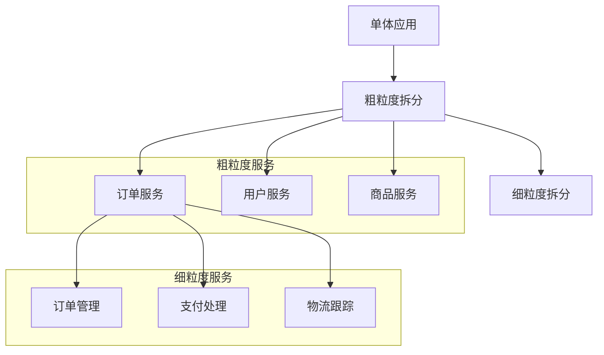

# 云原生应用性能优化

云原生环境下的性能优化有其独特的挑战和方法，本文将详细介绍容器化应用、微服务架构和Kubernetes环境中的性能优化策略和实践技巧，提升应用响应速度和资源利用率。

## 云原生性能优化概述

云原生应用是指专门为云计算环境设计和构建的应用程序，它们通常采用微服务架构、容器化部署，并通过自动化工具进行管理。在云原生环境中，性能优化面临着与传统应用不同的挑战和机遇。

### 云原生性能优化的特点

1. **分布式系统复杂性**：云原生应用通常是分布式的，性能问题可能出现在多个服务之间的交互中
2. **资源动态分配**：云环境中的资源是动态分配的，需要考虑资源弹性和效率
3. **容器化开销**：容器虽然轻量，但仍有一定的性能开销需要优化
4. **网络通信开销**：微服务间的网络通信成为性能瓶颈的重要因素
5. **多维度监控需求**：需要从应用、容器、节点等多个维度进行监控和优化

### 性能优化的关键指标

在云原生环境中，我们需要关注以下关键性能指标：

1. **响应时间**：服务响应请求所需的时间
2. **吞吐量**：系统在单位时间内能处理的请求数量
3. **资源利用率**：CPU、内存、网络等资源的使用效率
4. **延迟**：请求在系统中传输和处理的时间
5. **错误率**：系统产生错误的比率
6. **可扩展性**：系统处理负载增加的能力
7. **弹性**：系统从故障中恢复的能力

## 应用层性能优化

应用层是性能优化的第一道防线，良好的代码和架构设计是高性能云原生应用的基础。

### 代码级优化

#### 1. 异步编程模型

在云原生应用中，采用异步编程模型可以显著提高应用性能和资源利用率。

```java
// 同步调用示例
public Order processOrder(OrderRequest request) {
    User user = userService.getUser(request.getUserId());  // 阻塞调用
    Product product = productService.getProduct(request.getProductId());  // 阻塞调用
    Inventory inventory = inventoryService.checkInventory(request.getProductId());  // 阻塞调用
    
    // 处理订单逻辑
    Order order = createOrder(user, product, inventory);
    return order;
}

// 异步调用示例
public CompletableFuture<Order> processOrderAsync(OrderRequest request) {
    CompletableFuture<User> userFuture = 
        CompletableFuture.supplyAsync(() -> userService.getUser(request.getUserId()));
    
    CompletableFuture<Product> productFuture = 
        CompletableFuture.supplyAsync(() -> productService.getProduct(request.getProductId()));
    
    CompletableFuture<Inventory> inventoryFuture = 
        CompletableFuture.supplyAsync(() -> inventoryService.checkInventory(request.getProductId()));
    
    return CompletableFuture.allOf(userFuture, productFuture, inventoryFuture)
        .thenApply(v -> createOrder(
            userFuture.join(), 
            productFuture.join(), 
            inventoryFuture.join()
        ));
}
```

异步编程的优势：
- 提高资源利用率，减少线程阻塞
- 并行处理独立任务，减少总体响应时间
- 提高系统吞吐量，处理更多并发请求

#### 2. 缓存策略优化

在云原生环境中，合理使用多级缓存可以显著提升性能。

```java
@Service
public class ProductServiceImpl implements ProductService {
    
    private final ProductRepository productRepository;
    private final RedisTemplate<String, Product> redisTemplate;
    private final LoadingCache<String, Product> localCache;
    
    public ProductServiceImpl(ProductRepository productRepository, RedisTemplate<String, Product> redisTemplate) {
        this.productRepository = productRepository;
        this.redisTemplate = redisTemplate;
        
        // 本地缓存配置
        this.localCache = CacheBuilder.newBuilder()
            .maximumSize(1000)  // 最大缓存条目数
            .expireAfterWrite(1, TimeUnit.MINUTES)  // 写入后过期时间
            .build(new CacheLoader<String, Product>() {
                @Override
                public Product load(String productId) {
                    // 从Redis加载，如果Redis没有则从数据库加载
                    return loadFromRedisOrDatabase(productId);
                }
            });
    }
    
    @Override
    public Product getProduct(String productId) {
        try {
            // 先从本地缓存获取
            return localCache.get(productId);
        } catch (ExecutionException e) {
            // 缓存加载失败，直接从数据库获取
            return productRepository.findById(productId)
                .orElseThrow(() -> new ProductNotFoundException(productId));
        }
    }
    
    private Product loadFromRedisOrDatabase(String productId) {
        // 从Redis获取
        Product product = redisTemplate.opsForValue().get("product:" + productId);
        if (product != null) {
            return product;
        }
        
        // Redis没有，从数据库获取
        product = productRepository.findById(productId)
            .orElseThrow(() -> new ProductNotFoundException(productId));
        
        // 存入Redis
        redisTemplate.opsForValue().set("product:" + productId, product, 10, TimeUnit.MINUTES);
        
        return product;
    }
    
    // 缓存更新方法
    @Override
    public void updateProduct(Product product) {
        // 更新数据库
        productRepository.save(product);
        
        // 更新Redis缓存
        redisTemplate.opsForValue().set("product:" + product.getId(), product, 10, TimeUnit.MINUTES);
        
        // 清除本地缓存
        localCache.invalidate(product.getId());
    }
}
```

缓存策略优化要点：
- 使用多级缓存（本地缓存、分布式缓存、CDN等）
- 合理设置缓存过期时间和更新策略
- 实施缓存预热和缓存穿透防护
- 使用缓存一致性策略（如Cache-Aside、Write-Through等）

#### 3. 数据库访问优化

优化数据库访问是提升云原生应用性能的关键环节。

```java
// 批量操作优化示例
@Service
public class OrderBatchProcessor {
    
    private final JdbcTemplate jdbcTemplate;
    
    @Autowired
    public OrderBatchProcessor(JdbcTemplate jdbcTemplate) {
        this.jdbcTemplate = jdbcTemplate;
    }
    
    // 批量插入订单
    @Transactional
    public void batchInsertOrders(List<Order> orders) {
        jdbcTemplate.batchUpdate(
            "INSERT INTO orders (id, user_id, total_amount, status, created_at) VALUES (?, ?, ?, ?, ?)",
            new BatchPreparedStatementSetter() {
                @Override
                public void setValues(PreparedStatement ps, int i) throws SQLException {
                    Order order = orders.get(i);
                    ps.setString(1, order.getId());
                    ps.setString(2, order.getUserId());
                    ps.setBigDecimal(3, order.getTotalAmount());
                    ps.setString(4, order.getStatus().name());
                    ps.setTimestamp(5, Timestamp.valueOf(order.getCreatedAt()));
                }
                
                @Override
                public int getBatchSize() {
                    return orders.size();
                }
            }
        );
    }
    
    // 使用分页查询
    public Page<Order> getOrdersByUserId(String userId, int page, int size) {
        // 计算总数
        Integer total = jdbcTemplate.queryForObject(
            "SELECT COUNT(*) FROM orders WHERE user_id = ?",
            Integer.class,
            userId
        );
        
        // 分页查询
        List<Order> orders = jdbcTemplate.query(
            "SELECT * FROM orders WHERE user_id = ? ORDER BY created_at DESC LIMIT ? OFFSET ?",
            new Object[]{userId, size, page * size},
            new OrderRowMapper()
        );
        
        return new PageImpl<>(orders, PageRequest.of(page, size), total != null ? total : 0);
    }
}
```

数据库访问优化要点：
- 使用连接池管理数据库连接
- 实施批量操作减少数据库交互次数
- 优化SQL查询，添加适当索引
- 实施数据分区和分表策略
- 使用读写分离和数据库复制提高并发处理能力

### 微服务架构优化

#### 1. 服务粒度设计

合理的服务粒度设计是微服务性能的基础。



服务粒度优化原则：
- 根据业务领域和团队结构确定服务边界
- 避免过度拆分导致的网络开销增加
- 考虑服务间的数据一致性需求
- 平衡服务自治和通信开销

#### 2. API设计优化

良好的API设计可以减少网络传输量，提高服务响应速度。

```java
// 优化前：返回完整用户信息
@GetMapping("/users/{id}")
public UserDto getUserById(@PathVariable String id) {
    User user = userService.getUserById(id);
    return userMapper.toDto(user);  // 包含所有用户字段
}

// 优化后：根据需求返回不同粒度的用户信息
@GetMapping("/users/{id}")
public UserDto getUserById(
        @PathVariable String id,
        @RequestParam(required = false) Set<String> fields) {
    
    User user = userService.getUserById(id);
    
    // 根据请求字段过滤返回数据
    if (fields != null && !fields.isEmpty()) {
        return userMapper.toDtoWithFields(user, fields);
    }
    
    // 默认返回基本信息
    return userMapper.toBasicDto(user);
}
```

API设计优化要点：
- 支持字段过滤，只返回客户端需要的数据
- 实施分页、排序和过滤机制
- 使用批量API减少请求次数
- 采用合适的序列化格式（如Protocol Buffers、JSON等）
- 实施API版本控制，支持平滑升级

#### 3. 服务通信优化

在微服务架构中，服务间通信的效率直接影响整体性能。

```java
// 使用gRPC进行高效服务间通信
@GrpcService
public class ProductGrpcService extends ProductServiceGrpc.ProductServiceImplBase {
    
    private final ProductService productService;
    
    @Autowired
    public ProductGrpcService(ProductService productService) {
        this.productService = productService;
    }
    
    @Override
    public void getProduct(GetProductRequest request, StreamObserver<ProductResponse> responseObserver) {
        try {
            Product product = productService.getProduct(request.getProductId());
            
            ProductResponse response = ProductResponse.newBuilder()
                .setId(product.getId())
                .setName(product.getName())
                .setPrice(product.getPrice().doubleValue())
                .setDescription(product.getDescription())
                .build();
            
            responseObserver.onNext(response);
            responseObserver.onCompleted();
        } catch (Exception e) {
            responseObserver.onError(Status.INTERNAL
                .withDescription("Error retrieving product: " + e.getMessage())
                .asRuntimeException());
        }
    }
}
```

服务通信优化策略：
- 选择合适的通信协议（REST、gRPC、GraphQL等）
- 实施请求合并和批处理
- 使用异步通信减少阻塞
- 实施服务发现和客户端负载均衡
- 使用断路器模式防止级联故障

## 容器优化

容器是云原生应用的基本运行单元，优化容器配置和构建过程可以显著提升应用性能。

### 容器镜像优化

#### 1. 镜像大小优化

精简的容器镜像可以加快部署速度，减少资源占用。

```dockerfile
# 优化前：单阶段构建
FROM openjdk:11
WORKDIR /app
COPY target/myapp.jar app.jar
EXPOSE 8080
ENTRYPOINT ["java", "-jar", "app.jar"]

# 优化后：多阶段构建
# 构建阶段
FROM maven:3.8-openjdk-11 AS build
WORKDIR /app
COPY pom.xml .
# 缓存Maven依赖
RUN mvn dependency:go-offline
COPY src ./src
RUN mvn package -DskipTests

# 运行阶段
FROM openjdk:11-jre-slim
WORKDIR /app
COPY --from=build /app/target/myapp.jar app.jar
EXPOSE 8080
ENTRYPOINT ["java", "-jar", "app.jar"]
```

镜像优化技巧：
- 使用多阶段构建分离构建环境和运行环境
- 选择精简的基础镜像（如alpine或slim版本）
- 合并RUN指令减少镜像层数
- 清理构建缓存和临时文件
- 使用.dockerignore排除不必要的文件

#### 2. 镜像分层优化

合理的镜像分层可以提高构建效率和镜像复用率。

```dockerfile
# 基础层：很少变化
FROM openjdk:11-jre-slim AS base
WORKDIR /app
RUN apt-get update && apt-get install -y --no-install-recommends \
    curl \
    && rm -rf /var/lib/apt/lists/*

# 依赖层：依赖变化时更新
FROM base AS dependencies
COPY pom.xml .
RUN mvn dependency:go-offline

# 构建层：代码变化时更新
FROM dependencies AS build
COPY src ./src
RUN mvn package -DskipTests

# 最终镜像
FROM base
COPY --from=build /app/target/myapp.jar app.jar
EXPOSE 8080
ENTRYPOINT ["java", "-jar", "app.jar"]
```

分层优化原则：
- 将变化频率不同的内容放在不同层
- 将不变的基础层放在最底部
- 将经常变化的应用代码放在最上层
- 利用构建缓存加速镜像构建过程

### 容器运行时优化

#### 1. JVM优化

对于Java应用，JVM配置对容器性能有重要影响。

```dockerfile
FROM openjdk:11-jre-slim
WORKDIR /app
COPY target/myapp.jar app.jar
EXPOSE 8080

# JVM优化参数
ENV JAVA_OPTS="\
-XX:+UseContainerSupport \
-XX:MaxRAMPercentage=75.0 \
-XX:InitialRAMPercentage=50.0 \
-XX:+UseG1GC \
-XX:MaxGCPauseMillis=200 \
-XX:+UseStringDeduplication \
-XX:+DisableExplicitGC \
-Djava.security.egd=file:/dev/./urandom \
-Duser.timezone=UTC"

ENTRYPOINT exec java $JAVA_OPTS -jar app.jar
```

JVM优化要点：
- 启用容器感知（UseContainerSupport）
- 使用百分比设置内存限制（MaxRAMPercentage）
- 选择合适的垃圾收集器（如G1GC）
- 优化GC参数减少停顿时间
- 启用字符串去重减少内存占用
- 使用非阻塞熵源提高启动速度

#### 2. 资源限制优化

合理的资源限制可以提高容器的资源利用率和稳定性。

```yaml
apiVersion: apps/v1
kind: Deployment
metadata:
  name: myapp
spec:
  replicas: 3
  selector:
    matchLabels:
      app: myapp
  template:
    metadata:
      labels:
        app: myapp
    spec:
      containers:
      - name: myapp
        image: myapp:1.0.0
        resources:
          requests:
            memory: "512Mi"
            cpu: "500m"
          limits:
            memory: "1Gi"
            cpu: "1000m"
        env:
        - name: JAVA_OPTS
          value: "-XX:+UseContainerSupport -XX:MaxRAMPercentage=75.0"
```

资源限制优化原则：
- 设置合理的资源请求（requests）和限制（limits）
- 避免资源请求和限制差距过大
- 根据应用实际需求调整资源配置
- 考虑节点资源情况，避免资源碎片化
- 使用资源配额控制命名空间资源使用

#### 3. 启动优化

优化容器启动过程可以减少服务可用时间，提高系统弹性。

```java
// Spring Boot应用启动优化示例
@SpringBootApplication
public class MyApplication {
    
    public static void main(String[] args) {
        SpringApplication app = new SpringApplication(MyApplication.class);
        
        // 禁用不必要的自动配置
        app.setDefaultProperties(Collections.singletonMap(
            "spring.autoconfigure.exclude", 
            "org.springframework.boot.autoconfigure.jdbc.DataSourceAutoConfiguration," +
            "org.springframework.boot.autoconfigure.security.servlet.SecurityAutoConfiguration"
        ));
        
        // 使用懒加载
        app.setLazyInitialization(true);
        
        app.run(args);
    }
}
```

```yaml
# Kubernetes启动配置
apiVersion: apps/v1
kind: Deployment
metadata:
  name: myapp
spec:
  template:
    spec:
      containers:
      - name: myapp
        image: myapp:1.0.0
        startupProbe:
          httpGet:
            path: /actuator/health
            port: 8080
          failureThreshold: 30
          periodSeconds: 10
        readinessProbe:
          httpGet:
            path: /actuator/health/readiness
            port: 8080
          initialDelaySeconds: 5
          periodSeconds: 5
        lifecycle:
          preStop:
            exec:
              command: ["sh", "-c", "sleep 10"]
```

启动优化技巧：
- 实施懒加载，推迟非核心组件初始化
- 优化依赖注入，减少启动时扫描范围
- 使用AOT（Ahead-of-Time）编译加速启动
- 配置合理的健康检查和就绪探针
- 实施优雅关闭，确保请求处理完成

## Kubernetes环境优化

Kubernetes作为云原生应用的主要编排平台，其配置优化对应用性能有重要影响。

### Pod配置优化

#### 1. Pod资源配置

合理的Pod资源配置是性能优化的基础。

```yaml
apiVersion: apps/v1
kind: Deployment
metadata:
  name: myapp
spec:
  replicas: 3
  template:
    spec:
      containers:
      - name: myapp
        image: myapp:1.0.0
        resources:
          requests:
            memory: "512Mi"
            cpu: "500m"
          limits:
            memory: "1Gi"
            cpu: "1000m"
        env:
        - name: JAVA_OPTS
          value: "-XX:+UseContainerSupport -XX:MaxRAMPercentage=75.0"
      # 设置拓扑分布约束
      topologySpreadConstraints:
      - maxSkew: 1
        topologyKey: kubernetes.io/hostname
        whenUnsatisfiable: DoNotSchedule
        labelSelector:
          matchLabels:
            app: myapp
```

Pod资源配置优化要点：
- 根据应用实际需求设置资源请求和限制
- 使用拓扑分布约束确保Pod均匀分布
- 考虑节点亲和性和反亲和性策略
- 使用Pod优先级和抢占机制
- 设置合理的QoS等级（Guaranteed、Burstable、BestEffort）

#### 2. 健康检查优化

合理的健康检查配置可以提高系统可用性和稳定性。

```yaml
apiVersion: apps/v1
kind: Deployment
metadata:
  name: myapp
spec:
  template:
    spec:
      containers:
      - name: myapp
        image: myapp:1.0.0
        # 启动探针：检测应用是否启动完成
        startupProbe:
          httpGet:
            path: /actuator/health
            port: 8080
          failureThreshold: 30  # 允许30次失败
          periodSeconds: 10     # 每10秒检查一次
        
        # 就绪探针：检测应用是否可以接收流量
        readinessProbe:
          httpGet:
            path: /actuator/health/readiness
            port: 8080
          initialDelaySeconds: 5  # 容器启动后5秒开始检查
          periodSeconds: 5        # 每5秒检查一次
          timeoutSeconds: 3       # 探测超时时间
          successThreshold: 1     # 成功阈值
          failureThreshold: 3     # 失败阈值
        
        # 存活探针：检测应用是否需要重启
        livenessProbe:
          httpGet:
            path: /actuator/health/liveness
            port: 8080
          initialDelaySeconds: 60  # 容器启动后60秒开始检查
          periodSeconds: 15        # 每15秒检查一次
          timeoutSeconds: 5        # 探测超时时间
          failureThreshold: 3      # 失败阈值
```

健康检查优化原则：
- 区分启动探针、就绪探针和存活探针的职责
- 设置合理的检查间隔和超时时间
- 实现轻量级健康检查端点，避免重操作
- 根据应用特性调整失败阈值
- 考虑使用TCP或命令探针替代HTTP探针

#### 3. 亲和性和反亲和性

使用亲和性和反亲和性策略可以优化Pod的分布，提高性能和可用性。

```yaml
apiVersion: apps/v1
kind: Deployment
metadata:
  name: myapp
spec:
  template:
    spec:
      # 节点亲和性：将Pod调度到特定节点
      affinity:
        nodeAffinity:
          requiredDuringSchedulingIgnoredDuringExecution:
            nodeSelectorTerms:
            - matchExpressions:
              - key: kubernetes.io/instance-type
                operator: In
                values:
                - c5.xlarge
                - c5.2xlarge
          preferredDuringSchedulingIgnoredDuringExecution:
          - weight: 1
            preference:
              matchExpressions:
              - key: topology.kubernetes.io/zone
                operator: In
                values:
                - us-east-1a
                - us-east-1b
        
        # Pod亲和性：将相关Pod调度到同一节点或区域
        podAffinity:
          preferredDuringSchedulingIgnoredDuringExecution:
          - weight: 100
            podAffinityTerm:
              labelSelector:
                matchExpressions:
                - key: app
                  operator: In
                  values:
                  - cache
              topologyKey: kubernetes.io/hostname
        
        # Pod反亲和性：将相同Pod分散到不同节点
        podAntiAffinity:
          requiredDuringSchedulingIgnoredDuringExecution:
          - labelSelector:
              matchExpressions:
              - key: app
                operator: In
                values:
                - myapp
            topologyKey: kubernetes.io/hostname
```

亲和性策略优化要点：
- 使用节点亲和性将Pod调度到合适的节点
- 使用Pod亲和性将相关服务部署在一起减少网络延迟
- 使用Pod反亲和性提高可用性和故障隔离
- 合理设置拓扑键（topologyKey）控制亲和性范围
- 区分硬性要求（required）和软性偏好（preferred）

### 网络优化

#### 1. 服务网格优化

服务网格可以提供高级流量管理和网络优化能力。

```yaml
# Istio VirtualService配置示例
apiVersion: networking.istio.io/v1alpha3
kind: VirtualService
metadata:
  name: myapp
spec:
  hosts:
  - myapp
  http:
  - route:
    - destination:
        host: myapp
        subset: v1
      weight: 90
    - destination:
        host: myapp
        subset: v2
      weight: 10
    retries:
      attempts: 3
      perTryTimeout: 2s
    timeout: 5s
    
# Istio DestinationRule配置示例
apiVersion: networking.istio.io/v1alpha3
kind: DestinationRule
metadata:
  name: myapp
spec:
  host: myapp
  trafficPolicy:
    connectionPool:
      tcp:
        maxConnections: 100
        connectTimeout: 30ms
      http:
        http1MaxPendingRequests: 100
        maxRequestsPerConnection: 10
    outlierDetection:
      consecutiveErrors: 5
      interval: 30s
      baseEjectionTime: 30s
  subsets:
  - name: v1
    labels:
      version: v1
  - name: v2
    labels:
      version: v2
```

服务网格优化策略：
- 配置连接池管理连接数量和生命周期
- 实施重试策略处理临时故障
- 配置超时控制防止长时间阻塞
- 实施熔断机制防止级联故障
- 使用流量分流进行灰度发布和A/B测试

#### 2. 网络策略优化

网络策略可以控制Pod间的网络流量，提高安全性和性能。

```yaml
# 网络策略示例
apiVersion: networking.k8s.io/v1
kind: NetworkPolicy
metadata:
  name: api-allow
spec:
  podSelector:
    matchLabels:
      app: api
  ingress:
  - from:
    - podSelector:
        matchLabels:
          app: frontend
    ports:
    - protocol: TCP
      port: 8080
  - from:
    - namespaceSelector:
        matchLabels:
          name: monitoring
    ports:
    - protocol: TCP
      port: 9090
  egress:
  - to:
    - podSelector:
        matchLabels:
          app: database
    ports:
    - protocol: TCP
      port: 5432
```

网络策略优化要点：
- 实施最小权限原则，只允许必要的网络连接
- 使用命名空间隔离不同环境和应用
- 限制出站流量减少不必要的网络通信
- 配置流量监控和分析
- 考虑使用CNI插件提供的高级网络功能

### 存储优化

#### 1. 存储类选择

选择合适的存储类可以提高I/O性能和可靠性。

```yaml
# 存储类定义示例
apiVersion: storage.k8s.io/v1
kind: StorageClass
metadata:
  name: fast-ssd
provisioner: kubernetes.io/aws-ebs
parameters:
  type: gp3
  iopsPerGB: "10"
  throughput: "125"
  fsType: ext4
reclaimPolicy:
让我继续完成云原生应用性能优化的内容：

#### 1. 存储类选择（续）

```yaml
# 存储类定义示例
apiVersion: storage.k8s.io/v1
kind: StorageClass
metadata:
  name: fast-ssd
provisioner: kubernetes.io/aws-ebs
parameters:
  type: gp3
  iopsPerGB: "10"
  throughput: "125"
  fsType: ext4
reclaimPolicy: Retain
allowVolumeExpansion: true
```

存储类选择原则：
- 根据应用I/O特性选择合适的存储类型
- 考虑IOPS和吞吐量需求
- 评估成本和性能的平衡
- 考虑数据持久性和备份需求
- 选择支持动态扩容的存储类

#### 2. 持久卷配置

合理的持久卷配置可以提高存储性能和可靠性。

```yaml
# PVC配置示例
apiVersion: v1
kind: PersistentVolumeClaim
metadata:
  name: database-data
spec:
  accessModes:
    - ReadWriteOnce
  storageClassName: fast-ssd
  resources:
    requests:
      storage: 100Gi
  volumeMode: Filesystem

# 在Pod中使用PVC
apiVersion: apps/v1
kind: StatefulSet
metadata:
  name: postgres
spec:
  serviceName: postgres
  replicas: 3
  template:
    spec:
      containers:
      - name: postgres
        image: postgres:13
        volumeMounts:
        - name: data
          mountPath: /var/lib/postgresql/data
          subPath: postgres
        resources:
          requests:
            memory: "2Gi"
            cpu: "1000m"
          limits:
            memory: "4Gi"
            cpu: "2000m"
      volumes:
      - name: data
        persistentVolumeClaim:
          claimName: database-data
```

持久卷配置优化要点：
- 选择合适的访问模式（ReadWriteOnce、ReadOnlyMany、ReadWriteMany）
- 使用subPath避免数据目录权限问题
- 为不同类型的数据使用不同的存储类
- 考虑使用本地存储提高I/O性能
- 实施数据备份和恢复策略

#### 3. 临时存储优化

合理使用临时存储可以提高应用性能并减少持久存储开销。

```yaml
# 使用emptyDir的示例
apiVersion: apps/v1
kind: Deployment
metadata:
  name: cache-server
spec:
  template:
    spec:
      containers:
      - name: redis
        image: redis:6
        volumeMounts:
        - name: cache-data
          mountPath: /data
        resources:
          requests:
            memory: "1Gi"
            cpu: "500m"
          limits:
            memory: "2Gi"
            cpu: "1000m"
      volumes:
      - name: cache-data
        emptyDir:
          medium: Memory
          sizeLimit: 1Gi
```

临时存储优化策略：
- 使用emptyDir存储临时数据和缓存
- 考虑使用Memory作为emptyDir的medium提高性能
- 设置合理的sizeLimit避免节点资源耗尽
- 使用initContainers预热缓存数据
- 实施数据压缩减少存储需求

## 监控与性能分析

有效的监控和性能分析是持续优化云原生应用的基础。

### 多维度监控

#### 1. 应用层监控

监控应用内部性能指标，识别性能瓶颈。

```java
// Spring Boot应用监控配置
@Configuration
public class MonitoringConfig {
    
    @Bean
    public TimedAspect timedAspect(MeterRegistry registry) {
        return new TimedAspect(registry);
    }
    
    @Bean
    public MeterRegistryCustomizer<MeterRegistry> metricsCommonTags() {
        return registry -> registry.config().commonTags("application", "myapp");
    }
}

// 使用注解添加监控指标
@RestController
@RequestMapping("/api/products")
public class ProductController {
    
    private final ProductService productService;
    
    @Autowired
    public ProductController(ProductService productService) {
        this.productService = productService;
    }
    
    @Timed(value = "product.getById", percentiles = {0.5, 0.95, 0.99})
    @GetMapping("/{id}")
    public ResponseEntity<ProductDto> getProductById(@PathVariable String id) {
        Product product = productService.getProduct(id);
        return ResponseEntity.ok(mapToDto(product));
    }
    
    @Timed(value = "product.search", percentiles = {0.5, 0.95, 0.99})
    @GetMapping
    public ResponseEntity<Page<ProductDto>> searchProducts(
            @RequestParam(required = false) String keyword,
            @RequestParam(defaultValue = "0") int page,
            @RequestParam(defaultValue = "20") int size) {
        
        Page<Product> products = productService.searchProducts(keyword, page, size);
        return ResponseEntity.ok(mapToPage(products));
    }
}
```

应用监控要点：
- 监控关键业务指标（如订单量、转化率等）
- 监控API响应时间和错误率
- 监控数据库查询性能
- 监控缓存命中率和效率
- 监控外部服务调用性能

#### 2. 容器和节点监控

监控容器和节点资源使用情况，识别资源瓶颈。

```yaml
# Prometheus ServiceMonitor配置
apiVersion: monitoring.coreos.com/v1
kind: ServiceMonitor
metadata:
  name: myapp
  namespace: monitoring
spec:
  selector:
    matchLabels:
      app: myapp
  endpoints:
  - port: metrics
    interval: 15s
    path: /actuator/prometheus
  namespaceSelector:
    matchNames:
    - default
```

容器和节点监控要点：
- 监控CPU、内存、磁盘和网络使用率
- 监控容器重启次数和OOM事件
- 监控节点负载和资源分配情况
- 监控网络流量和延迟
- 监控存储I/O性能

### 性能分析工具

#### 1. 分布式追踪

使用分布式追踪工具分析请求链路和服务依赖。

```java
// Spring Cloud Sleuth配置
@SpringBootApplication
@EnableDiscoveryClient
public class MyApplication {
    
    public static void main(String[] args) {
        SpringApplication.run(MyApplication.class, args);
    }
    
    @Bean
    public Sampler defaultSampler() {
        return Sampler.ALWAYS_SAMPLE;
    }
    
    @Bean
    public RestTemplate restTemplate() {
        return new RestTemplate();
    }
}
```

分布式追踪最佳实践：
- 在所有微服务中集成追踪工具
- 传播追踪上下文（TraceID、SpanID等）
- 添加自定义标签和注释增强可观测性
- 关注长耗时操作和异常路径
- 定期分析追踪数据识别优化机会

#### 2. 性能剖析

使用性能剖析工具分析应用内部性能瓶颈。

```yaml
# 使用jib-maven-plugin构建支持JFR的容器镜像
<plugin>
    <groupId>com.google.cloud.tools</groupId>
    <artifactId>jib-maven-plugin</artifactId>
    <version>3.2.1</version>
    <configuration>
        <from>
            <image>openjdk:11-jre-slim</image>
        </from>
        <to>
            <image>registry.example.com/myapp</image>
            <tags>
                <tag>latest</tag>
                <tag>${project.version}</tag>
            </tags>
        </to>
        <container>
            <jvmFlags>
                <jvmFlag>-XX:+FlightRecorder</jvmFlag>
                <jvmFlag>-XX:StartFlightRecording=duration=60s,filename=/tmp/recording.jfr</jvmFlag>
            </jvmFlags>
            <ports>
                <port>8080</port>
            </ports>
        </container>
    </configuration>
</plugin>
```

性能剖析最佳实践：
- 在非生产环境进行全面剖析
- 在生产环境使用低开销采样剖析
- 关注CPU热点、内存分配和锁竞争
- 分析GC行为和内存使用模式
- 使用火焰图可视化性能瓶颈

## 性能优化案例分析

以下是几个云原生应用性能优化的实际案例，展示了不同场景下的优化策略和效果。

### 案例一：微服务API性能优化

**问题描述**：某电商平台的商品服务在高流量时段响应缓慢，影响用户体验。

**优化措施**：

1. **API响应优化**：
   - 实施字段过滤，只返回客户端需要的数据
   - 添加分页和批量API减少请求次数
   - 使用Protocol Buffers替代JSON序列化

2. **缓存策略优化**：
   - 实施多级缓存（本地缓存+Redis）
   - 对热门商品实施主动缓存预热
   - 实施缓存穿透和缓存雪崩防护

3. **数据库优化**：
   - 优化SQL查询，添加适当索引
   - 实施读写分离，分担数据库负载
   - 使用连接池管理数据库连接

4. **容器资源优化**：
   - 调整JVM参数适应容器环境
   - 增加资源限制，提高QoS等级
   - 优化Pod分布，提高资源利用率

**优化效果**：
- API平均响应时间从200ms降至50ms
- 系统吞吐量提升300%
- 数据库负载降低50%
- 服务稳定性显著提高，错误率降低90%

### 案例二：消息处理服务优化

**问题描述**：某物流平台的消息处理服务在峰值时段处理延迟高，影响实时物流跟踪。

**优化措施**：

1. **消息处理架构优化**：
   - 从单线程处理改为多线程并行处理
   - 实施消息分区，提高并行度
   - 使用批量处理减少I/O操作

2. **资源配置优化**：
   - 增加Pod副本数，提高处理能力
   - 调整CPU和内存配置，匹配工作负载
   - 使用HPA自动扩缩容应对流量波动

3. **存储优化**：
   - 使用SSD存储提高I/O性能
   - 实施数据压缩减少存储和网络开销
   - 优化数据结构减少存储需求

4. **监控和告警优化**：
   - 添加消息处理延迟监控
   - 设置多级告警阈值
   - 实施自动化故障恢复机制

**优化效果**：
- 消息处理延迟从秒级降至毫秒级
- 系统可处理的消息量提升500%
- 资源利用率提高60%
- 系统可靠性显著提升，无需人工干预

### 案例三：数据分析服务优化

**问题描述**：某金融平台的实时数据分析服务内存使用高，频繁发生OOM导致服务不稳定。

**优化措施**：

1. **内存使用优化**：
   - 优化数据结构减少内存占用
   - 实施数据分片处理大数据集
   - 使用流式处理替代全量加载

2. **JVM优化**：
   - 调整垃圾收集器和参数
   - 实施内存泄漏检测和修复
   - 优化对象生命周期管理

3. **容器配置优化**：
   - 调整内存限制和请求
   - 实施优雅关闭机制
   - 添加内存使用监控和预警

4. **算法优化**：
   - 重构计算密集型算法
   - 实施增量计算减少重复工作
   - 使用近似算法提高效率

**优化效果**：
- 内存使用降低40%
- OOM事件完全消除
- 计算性能提升30%
- 服务可用性从99.9%提升至99.99%

## 性能优化最佳实践总结

基于上述内容，总结出云原生应用性能优化的最佳实践：

### 1. 设计阶段最佳实践

- **服务粒度设计**：平衡服务自治和通信开销
- **API设计**：支持字段过滤、分页和批量操作
- **数据模型设计**：考虑查询模式和访问频率
- **缓存策略设计**：规划多级缓存和一致性策略
- **容错设计**：实施熔断、重试和降级机制

### 2. 开发阶段最佳实践

- **代码优化**：使用异步编程、连接池和资源复用
- **依赖管理**：减少和优化外部依赖
- **测试驱动**：编写性能测试和基准测试
- **代码审查**：关注性能影响的代码变更
- **持续集成**：在CI流程中包含性能测试

### 3. 部署阶段最佳实践

- **容器优化**：精简镜像、优化分层和构建过程
- **资源配置**：根据应用特性设置资源请求和限制
- **Pod分布**：使用亲和性和反亲和性策略优化分布
- **网络配置**：优化服务通信和网络策略
- **存储选择**：根据I/O特性选择合适的存储类

### 4. 运维阶段最佳实践

- **监控体系**：建立多维度监控和告警机制
- **性能分析**：定期进行性能剖析和瓶颈分析
- **容量规划**：根据业务增长预测资源需求
- **自动扩缩容**：实施HPA和VPA自动调整资源
- **持续优化**：建立性能优化的闭环流程

### 5. 文化和流程最佳实践

- **性能意识**：培养团队的性能优化意识
- **知识共享**：建立性能优化知识库和最佳实践
- **责任明确**：明确性能目标和责任人
- **奖励机制**：鼓励和奖励性能优化成果
- **持续学习**：跟踪技术发展和新的优化方法

## 结论

云原生应用性能优化是一个持续的过程，需要从应用设计、开发、部署到运维的全生命周期考虑。通过本文介绍的优化策略和最佳实践，可以显著提升云原生应用的性能、可靠性和资源利用率。

性能优化不是一次性工作，而是需要建立持续优化的文化和机制。随着业务的发展和技术的演进，性能优化策略也需要不断调整和完善。通过建立完善的监控体系、性能分析工具和优化流程，可以及时发现和解决性能问题，确保云原生应用始终保持高性能和高可用性。

最后，性能优化需要平衡多种因素，包括开发效率、维护成本、资源开销和业务需求。在追求极致性能的同时，也需要考虑投入产出比，选择最适合业务需求的优化策略。