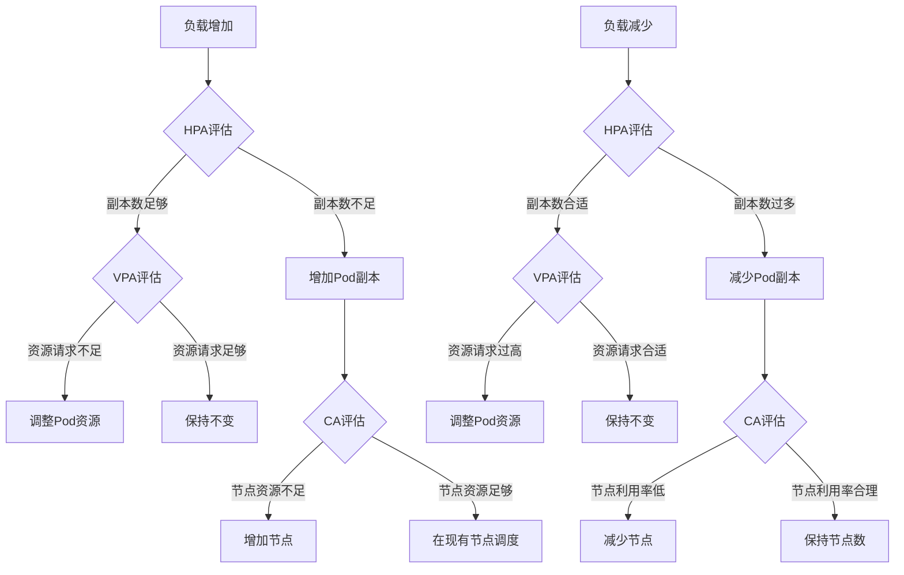
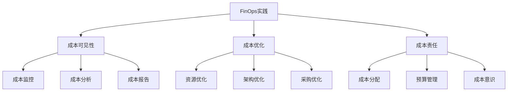
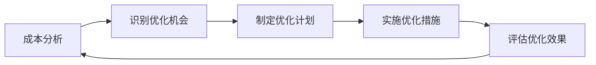

# 云原生环境成本优化

控制和优化云原生环境的成本是企业关注的重点，本文将详细介绍资源规划、自动扩缩容、成本监控和优化策略，帮助组织在保证性能的同时降低运营成本。

## 云原生成本优化概述

云原生技术的兴起为企业带来了前所未有的灵活性和可扩展性，但同时也带来了成本管理的新挑战。在传统数据中心环境中，硬件成本是一次性投入，而在云环境中，资源使用是按需付费的，这要求企业对资源使用进行精细化管理。

### 云原生成本的构成

云原生环境的成本主要包括以下几个方面：

1. **计算资源成本**：容器、Pod、节点等计算资源的使用费用
2. **存储成本**：持久卷、对象存储等存储资源的使用费用
3. **网络成本**：数据传输、负载均衡、API调用等网络资源的使用费用
4. **管理成本**：Kubernetes集群、服务网格等管理组件的使用费用
5. **人力成本**：维护和管理云原生环境所需的人力投入
6. **许可证成本**：商业软件和工具的许可证费用

### 成本优化的挑战

在云原生环境中进行成本优化面临以下挑战：

1. **资源碎片化**：容器化环境中资源分配更加细粒度，导致资源碎片化
2. **动态变化**：工作负载和资源需求不断变化，难以进行静态规划
3. **多维度成本**：需要同时考虑计算、存储、网络等多个维度的成本
4. **可见性不足**：缺乏对资源使用和成本的全面可见性
5. **性能与成本平衡**：需要在保证性能和可靠性的同时控制成本
6. **组织协作**：需要开发、运维、财务等多个部门的协作

### 成本优化的原则

有效的云原生成本优化应遵循以下原则：

1. **按需分配**：根据实际需求分配资源，避免过度配置
2. **资源共享**：最大化资源共享，提高资源利用率
3. **自动化管理**：通过自动化工具管理资源，减少人工干预
4. **持续监控**：持续监控资源使用和成本，及时发现优化机会
5. **全生命周期管理**：从设计到运维的全生命周期考虑成本优化
6. **平衡取舍**：在成本、性能、可靠性之间找到平衡点

## 资源规划与配置优化

合理的资源规划和配置是控制云原生环境成本的基础。

### 资源需求评估

在部署应用前，应进行详细的资源需求评估，避免资源浪费。

#### 1. 负载测试与分析

通过负载测试了解应用在不同负载下的资源消耗情况。

```bash
# 使用k6进行负载测试
k6 run --vus 100 --duration 30s load-test.js

# 使用Prometheus查询CPU使用率
curl -G "http://prometheus:9090/api/v1/query" --data-urlencode 'query=sum(rate(container_cpu_usage_seconds_total{pod=~"myapp-.*"}[5m])) by (pod)'

# 使用Prometheus查询内存使用率
curl -G "http://prometheus:9090/api/v1/query" --data-urlencode 'query=sum(container_memory_working_set_bytes{pod=~"myapp-.*"}) by (pod)'
```

负载测试应关注以下方面：
- 不同并发用户数下的资源消耗
- 峰值负载下的资源需求
- 资源使用的增长趋势
- 不同组件的资源消耗比例

#### 2. 历史数据分析

对于已运行的应用，可以分析历史监控数据来优化资源配置。

```yaml
# Prometheus查询示例 - 获取过去7天的CPU使用率百分位数
query: |
  quantile_over_time(0.95, sum(rate(container_cpu_usage_seconds_total{pod=~"myapp-.*"}[5m])) by (pod)[7d:5m])
```

历史数据分析应关注：
- 资源使用的峰谷分布
- 周期性变化模式
- 异常使用情况
- 长期增长趋势

#### 3. 资源建模

基于测试和历史数据，建立资源需求模型，预测未来资源需求。

```python
# 简化的资源预测模型示例
import pandas as pd
import numpy as np
from statsmodels.tsa.arima.model import ARIMA

# 加载历史CPU使用数据
data = pd.read_csv('cpu_usage.csv', parse_dates=['timestamp'], index_col='timestamp')

# 建立ARIMA模型
model = ARIMA(data['cpu_usage'], order=(5,1,0))
model_fit = model.fit()

# 预测未来7天的CPU使用
forecast = model_fit.forecast(steps=7*24*12)  # 假设数据点为5分钟一个
```

资源建模应考虑：
- 业务增长预期
- 季节性变化
- 特殊事件影响
- 不同场景的资源需求

### 资源请求与限制优化

在Kubernetes环境中，合理设置资源请求(requests)和限制(limits)是控制成本的关键。

#### 1. 资源请求设置

资源请求决定了Pod调度和资源保证，应基于应用的基本需求设置。

```yaml
apiVersion: apps/v1
kind: Deployment
metadata:
  name: myapp
spec:
  template:
    spec:
      containers:
      - name: myapp
        image: myapp:1.0
        resources:
          requests:
            memory: "256Mi"
            cpu: "100m"
```

资源请求设置原则：
- 设置为应用正常运行所需的最小资源
- 考虑应用启动阶段的资源需求
- 为不同环境(开发、测试、生产)设置不同的请求值
- 定期根据实际使用情况调整请求值

#### 2. 资源限制设置

资源限制控制应用的最大资源使用，防止单个应用消耗过多资源。

```yaml
apiVersion: apps/v1
kind: Deployment
metadata:
  name: myapp
spec:
  template:
    spec:
      containers:
      - name: myapp
        image: myapp:1.0
        resources:
          requests:
            memory: "256Mi"
            cpu: "100m"
          limits:
            memory: "512Mi"
            cpu: "200m"
```

资源限制设置原则：
- 设置为应用峰值负载下的资源需求
- 避免内存限制过低导致OOM
- CPU限制可以设置得比请求高一些，利用CPU的可压缩特性
- 考虑节点资源情况，避免过高的限制导致资源浪费

#### 3. 资源比例优化

请求与限制的比例关系影响资源利用效率和应用稳定性。

```yaml
# 不同类型应用的资源配置示例

# CPU密集型应用 - 请求和限制接近
apiVersion: apps/v1
kind: Deployment
metadata:
  name: cpu-intensive-app
spec:
  template:
    spec:
      containers:
      - name: app
        resources:
          requests:
            cpu: "1000m"
            memory: "512Mi"
          limits:
            cpu: "1200m"
            memory: "768Mi"

# 内存密集型应用 - 内存请求和限制接近
apiVersion: apps/v1
kind: Deployment
metadata:
  name: memory-intensive-app
spec:
  template:
    spec:
      containers:
      - name: app
        resources:
          requests:
            cpu: "500m"
            memory: "2Gi"
          limits:
            cpu: "1000m"
            memory: "2.2Gi"

# 突发型应用 - 限制远高于请求
apiVersion: apps/v1
kind: Deployment
metadata:
  name: bursty-app
spec:
  template:
    spec:
      containers:
      - name: app
        resources:
          requests:
            cpu: "100m"
            memory: "256Mi"
          limits:
            cpu: "500m"
            memory: "1Gi"
```

资源比例优化原则：
- CPU密集型应用：请求和限制设置接近，确保稳定性
- 内存密集型应用：内存请求和限制设置接近，避免OOM
- 突发型应用：限制可以设置为请求的2-5倍，利用资源弹性
- 批处理作业：可以设置较低的请求和较高的限制，提高资源利用率

### 命名空间资源配额

使用资源配额控制命名空间级别的资源使用，防止单个团队或应用过度消耗资源。

```yaml
# 命名空间资源配额示例
apiVersion: v1
kind: ResourceQuota
metadata:
  name: team-quota
  namespace: team-a
spec:
  hard:
    requests.cpu: "10"
    requests.memory: 20Gi
    limits.cpu: "20"
    limits.memory: 40Gi
    pods: "50"
    services: "10"
    persistentvolumeclaims: "20"
    
# 限制Pod资源的LimitRange示例
apiVersion: v1
kind: LimitRange
metadata:
  name: default-limits
  namespace: team-a
spec:
  limits:
  - default:
      memory: 512Mi
      cpu: 500m
    defaultRequest:
      memory: 256Mi
      cpu: 100m
    type: Container
```

资源配额管理策略：
- 根据团队规模和业务重要性分配资源配额
- 设置默认的资源请求和限制
- 定期审查和调整配额使用情况
- 实施资源使用报告和成本分摊机制

### 节点选择与亲和性

通过节点选择和亲和性策略，将工作负载部署到成本最优的节点上。

```yaml
# 使用节点选择器部署到特定节点
apiVersion: apps/v1
kind: Deployment
metadata:
  name: cost-optimized-app
spec:
  template:
    spec:
      nodeSelector:
        node-type: spot-instance
      containers:
      - name: app
        image: myapp:1.0

# 使用节点亲和性部署到特定区域的节点
apiVersion: apps/v1
kind: Deployment
metadata:
  name: region-optimized-app
spec:
  template:
    spec:
      affinity:
        nodeAffinity:
          requiredDuringSchedulingIgnoredDuringExecution:
            nodeSelectorTerms:
            - matchExpressions:
              - key: topology.kubernetes.io/region
                operator: In
                values:
                - us-east-1
                - us-east-2
      containers:
      - name: app
        image: myapp:1.0
```

节点选择优化策略：
- 使用竞价实例(Spot Instances)部署非关键工作负载
- 根据区域价格差异选择部署区域
- 使用预留实例(Reserved Instances)部署稳定工作负载
- 混合使用不同类型的节点，优化成本和性能平衡

## 自动扩缩容策略

自动扩缩容是云原生环境中控制成本的重要手段，可以根据实际负载自动调整资源。

### 水平Pod自动扩缩容(HPA)

HPA根据CPU、内存使用率或自定义指标自动调整Pod副本数。

```yaml
# 基于CPU使用率的HPA
apiVersion: autoscaling/v2
kind: HorizontalPodAutoscaler
metadata:
  name: myapp-hpa
spec:
  scaleTargetRef:
    apiVersion: apps/v1
    kind: Deployment
    name: myapp
  minReplicas: 2
  maxReplicas: 10
  metrics:
  - type: Resource
    resource:
      name: cpu
      target:
        type: Utilization
        averageUtilization: 70

# 基于自定义指标的HPA
apiVersion: autoscaling/v2
kind: HorizontalPodAutoscaler
metadata:
  name: myapp-hpa-custom
spec:
  scaleTargetRef:
    apiVersion: apps/v1
    kind: Deployment
    name: myapp
  minReplicas: 2
  maxReplicas: 10
  metrics:
  - type: Pods
    pods:
      metric:
        name: requests_per_second
      target:
        type: AverageValue
        averageValue: 1000
```

HPA优化策略：
- 设置合理的目标利用率（通常为70-80%）
- 配置适当的最小和最大副本数
- 使用多个指标综合判断扩缩容决策
- 设置冷却时间，避免频繁扩缩容
- 定期测试和调整扩缩容策略

### 垂直Pod自动扩缩容(VPA)

VPA自动调整Pod的CPU和内存请求，优化资源分配。

```yaml
# VPA配置示例
apiVersion: autoscaling.k8s.io/v1
kind: VerticalPodAutoscaler
metadata:
  name: myapp-vpa
spec:
  targetRef:
    apiVersion: apps/v1
    kind: Deployment
    name: myapp
  updatePolicy:
    updateMode: Auto
  resourcePolicy:
    containerPolicies:
    - containerName: '*'
      minAllowed:
        cpu: 50m
        memory: 100Mi
      maxAllowed:
        cpu: 1000m
        memory: 1Gi
      controlledResources: ["cpu", "memory"]
```

VPA优化策略：
- 初始阶段使用推荐模式(updateMode: "Off")收集建议
- 设置最小和最大资源限制，防止过度调整
- 对稳定工作负载使用自动模式(updateMode: "Auto")
- 对关键应用使用初始化模式(updateMode: "Initial")
- 定期审查VPA建议，调整资源策略

### 集群自动扩缩容(CA)

CA根据Pod调度需求自动调整集群节点数量。

```yaml
# AWS EKS集群自动扩缩容配置示例
apiVersion: v1
kind: ConfigMap
metadata:
  name: cluster-autoscaler-config
  namespace: kube-system
data:
  config.yaml: |
    ---
    autoDiscovery:
      clusterName: my-eks-cluster
    awsRegion: us-west-2
    newPodScaleUpDelay: 0
    scaleDownUnneededTime: 10m
    scaleDownUnreadyTime: 20m
    scaleDownUtilizationThreshold: 0.5
    skipNodesWithLocalStorage: false
    skipNodesWithSystemPods: true
    balanceSimilarNodeGroups: true
    expander: least-waste
```

CA优化策略：
- 设置合理的扩缩容阈值和冷却时间
- 使用节点组自动发现简化配置
- 配置节点组优先级，优先使用成本较低的节点
- 启用平衡节点组功能，均衡资源使用
- 选择合适的扩展策略（如least-waste、random、price等）

### 混合扩缩容策略

结合HPA、VPA和CA实现多维度的自动扩缩容，优化资源使用和成本。



混合扩缩容最佳实践：
- HPA负责处理短期负载波动
- VPA负责优化长期资源分配
- CA负责管理整体集群容量
- 设置不同的扩缩容时间窗口，避免冲突
- 定期审查和调整各层扩缩容策略

### 定时扩缩容

对于具有可预测负载模式的应用，可以实施定时扩缩容策略。

```yaml
# Kubernetes CronJob实现定时扩缩容
apiVersion: batch/v1
kind: CronJob
metadata:
  name: scale-up-morning
spec:
  schedule: "0 8 * * 1-5"  # 工作日早上8点
  jobTemplate:
    spec:
      template:
        spec:
          containers:
          - name: kubectl
            image: bitnami/kubectl
            command:
            - /bin/sh
            - -c
            - kubectl scale deployment myapp --replicas=10
          restartPolicy: OnFailure

---
apiVersion: batch/v1
kind: CronJob
metadata:
  name: scale-down-evening
spec:
  schedule: "0 20 * * 1-5"  # 工作日晚上8点
  jobTemplate:
    spec:
      template:
        spec:
          containers:
          - name: kubectl
            image: bitnami/kubectl
            command:
            - /bin/sh
            - -c
            - kubectl scale deployment myapp --replicas=2
          restartPolicy: OnFailure
```

定时扩缩容策略：
- 根据业务高峰期设置扩容时间
- 在非工作时间自动缩容
- 结合HPA处理预期外的负载波动
- 为特殊事件（如促销活动）设置临时扩容计划
- 考虑不同时区的用户访问模式

## 存储成本优化

存储成本是云原生环境中的重要成本组成部分，需要特别关注。

### 存储类选择

选择合适的存储类可以显著影响存储成本。

```yaml
# 标准SSD存储类
apiVersion: storage.k8s.io/v1
kind: StorageClass
metadata:
  name: standard-ssd
provisioner: kubernetes.io/aws-ebs
parameters:
  type: gp3
  iopsPerGB: "3"
  encrypted: "true"
reclaimPolicy: Delete
allowVolumeExpansion: true

# 低成本HDD存储类
apiVersion: storage.k8s.io/v1
kind: StorageClass
metadata:
  name: economy-hdd
provisioner: kubernetes.io/aws-ebs
parameters:
  type: st1
  encrypted: "true"
reclaimPolicy: Delete
allowVolumeExpansion: true

# 使用特定存储类的PVC
apiVersion: v1
kind: PersistentVolumeClaim
metadata:
  name: data-storage
spec:
  accessModes:
    - ReadWriteOnce
  storageClassName: economy-hdd
  resources:
    requests:
      storage: 100Gi
```

存储类选择策略：
- 高性能应用使用SSD存储
- 归档和日志数据使用HDD存储
- 临时数据使用本地存储或emptyDir
- 考虑使用区域性存储降低成本
- 评估不同云提供商的存储价格差异

### 存储生命周期管理

实施存储生命周期管理，自动迁移不常用数据到低成本存储。

```yaml
# 使用Kubernetes CronJob实现数据归档
apiVersion: batch/v1
kind: CronJob
metadata:
  name: data-archiver
spec:
  schedule: "0 1 * * 0"  # 每周日凌晨1点
  jobTemplate:
    spec:
      template:
        spec:
          containers:
          - name: archiver
            image: data-archiver:1.0
            env:
            - name: SOURCE_PATH
              value: /data/active
            - name: TARGET_PATH
              value: /data/archive
            - name: ARCHIVE_DAYS
              value: "30"
            volumeMounts:
            - name: active-data
              mountPath: /data/active
            - name: archive-data
              mountPath: /data/archive
          volumes:
          - name: active-data
            persistentVolumeClaim:
              claimName: active-data-pvc
          - name: archive-data
            persistentVolumeClaim:
              claimName: archive-data-pvc
          restartPolicy: OnFailure
```

存储生命周期管理策略：
- 定期识别和归档不活跃数据
- 使用多级存储策略（热/温/冷存储）
- 实施数据压缩减少存储需求
- 设置自动过期和删除策略
- 使用对象存储替代文件存储降低成本

### 存储资源回收

及时回收未使用的存储资源，避免不必要的成本。

```yaml
# 设置PV回收策略
apiVersion: v1
kind: PersistentVolume
metadata:
  name: data-pv
spec:
  capacity:
    storage: 100Gi
  accessModes:
    - ReadWriteOnce
  persistentVolumeReclaimPolicy: Delete
  storageClassName: standard-ssd
  awsElasticBlockStore:
    volumeID: vol-12345
    fsType: ext4

# 使用Kubernetes Job清理未使用的PVC
apiVersion: batch/v1
kind: Job
metadata:
  name: pvc-cleanup
spec:
  template:
    spec:
      containers:
      - name: kubectl
        image: bitnami/kubectl
        command:
        - /bin/sh
        - -c
        - |
          kubectl get pvc --all-namespaces -o json | jq -r '.items[] | select(.status.phase=="Released") | .metadata.namespace + " " + .metadata.name' | while read ns pvc; do
            kubectl delete pvc $pvc -n $ns
          done
      restartPolicy: OnFailure
```

存储资源回收策略：
- 设置适当的PV回收策略（Delete或Retain）
- 定期审查和清理未使用的PVC
- 使用存储配额限制命名空间存储使用
- 实施存储使用监控和告警
- 考虑使用动态存储供应减少浪费

### 数据压缩和重复数据删除

使用数据压缩和重复数据删除技术减少存储需求。

```yaml
# 使用压缩的ConfigMap存储配置数据
apiVersion: v1
kind: ConfigMap
metadata:
  name: compressed-config
data:
  config.json.gz: |
    H4sIAAAAAAAAA6tWyk0tLk5MT0XiKSXlJUr1YJq1OLXIKzEvO1UJABr9UichAAAA

# 在应用中解压数据
apiVersion: apps/v1
kind: Deployment
metadata:
  name: app-with-compressed-config
spec:
  template:
    spec:
      containers:
      - name: app
        image: myapp:1.0
        command:
        - /bin/sh
        - -c
        - |
          mkdir -p /config
          base64 -d /compressed-config/config.json.gz | gunzip > /config/config.json
          ./start-app.sh
        volumeMounts:
        - name: compressed-config
          mountPath: /compressed-config
      volumes:
      - name: compressed-config
        configMap:
          name: compressed-config
```

数据优化策略：
- 在应用层实施数据压缩
- 使用支持重复数据删除的存储系统
- 优化数据格式和结构减少存储需求
- 实施数据分层存储策略
- 定期进行存储使用分析和优化

## 网络成本优化

在云环境中，网络传输成本也是一个重要的成本因素，特别是跨区域和跨云传输。

### 网络流量优化

优化网络流量可以显著降低数据传输成本。

```yaml
# 使用本地缓存减少网络请求
apiVersion: apps/v1
kind: Deployment
metadata:
  name: app-with-cache
spec:
  template:
    spec:
      containers:
      - name: app
        image: myapp:1.0
        env:
        - name: CACHE_ENABLED
          value: "true"
        - name: CACHE_TTL
          value: "3600"
        volumeMounts:
        - name: cache-volume
          mountPath: /cache
      volumes:
      - name: cache-volume
        emptyDir: {}

# 使用Service Topology路由流量到同一区域
apiVersion: v1
kind: Service
metadata:
  name: myapp-service
spec:
  selector:
    app: myapp
  ports:
  - port: 80
    targetPort: 8080
  topologyKeys:
  - "kubernetes.io/hostname"
  - "topology.kubernetes.io/zone"
  - "topology.kubernetes.io/region"
  - "*"
```

网络流量优化策略：
- 使用CDN分发静态内容
- 实施数据压缩减少传输量
- 优化API设计，减少不必要的数据传输
- 使用批处理API减少请求次数
- 实施本地缓存减少重复请求

### 跨区域通信优化

优化跨区域通信可以显著降低网络成本。

```yaml
# 使用区域亲和性部署应用
apiVersion: apps/v1
kind: Deployment
metadata:
  name: region-aware-app
spec:
  template:
    spec:
      affinity:
        podAffinity:
          preferredDuringSchedulingIgnoredDuringExecution:
          - weight: 100
            podAffinityTerm:
              labelSelector:
                matchExpressions:
                - key: app
                  operator: In
                  values:
                  - database
              topologyKey: topology.kubernetes.io/zone
      containers:
      - name: app
        image: myapp:1.0
```

跨区域通信优化策略：
- 将相关服务部署在同一区域
- 使用区域级缓存减少跨区域请求
- 实施数据复制，在每个区域保留数据副本
- 批量处理跨区域数据传输
- 使用异步通信减少实时跨区域请求

### 出站流量控制

控制出站流量可以减少不必要的数据传输成本。

```yaml
# 使用NetworkPolicy限制出站流量
apiVersion: networking.k8s.io/v1
kind: NetworkPolicy
metadata:
  name: limit-egress
spec:
  podSelector:
    matchLabels:
      app: myapp
  policyTypes:
  - Egress
  egress:
  - to:
    - podSelector:
        matchLabels:
          app: database
    ports:
    - protocol: TCP
      port: 5432
  - to:
    - podSelector:
        matchLabels:
          app: cache
    ports:
    - protocol: TCP
      port: 6379
  - to:
    - namespaceSelector:
        matchLabels:
          name: monitoring
```

出站流量控制策略：
- 限制不必要的外部API调用
- 使用内部服务替代外部服务
- 实施流量监控和告警
- 优化日志和监控数据传输
- 使用VPC端点访问云服务，避免公网流量

## 成本监控与分
让我继续完成云原生环境成本优化的内容：

## 成本监控与分析

有效的成本监控和分析是优化云原生环境成本的基础，可以帮助识别成本热点和优化机会。

### 成本可视化工具

使用专门的成本可视化工具可以提供全面的成本洞察。

#### 1. Kubernetes成本分析工具

Kubecost、OpenCost等工具可以提供Kubernetes环境的详细成本分析。

```yaml
# Kubecost Helm安装配置示例
apiVersion: helm.cattle.io/v1
kind: HelmChart
metadata:
  name: kubecost
  namespace: kube-system
spec:
  chart: cost-analyzer
  repo: https://kubecost.github.io/cost-analyzer/
  targetNamespace: kubecost
  valuesContent: |-
    kubecostToken: ""
    prometheus:
      server:
        persistentVolume:
          size: 32Gi
    grafana:
      sidecar:
        dashboards:
          enabled: true
    serviceMonitor:
      enabled: true
```

成本分析工具的主要功能：
- 按命名空间、部署、服务等维度分析成本
- 提供历史成本趋势和预测
- 识别资源浪费和优化机会
- 生成成本报告和优化建议
- 设置成本告警和预算控制

#### 2. 云提供商成本工具

各大云提供商都提供了成本管理和优化工具。

```bash
# 使用AWS CLI获取成本和使用情况报告
aws ce get-cost-and-usage \
  --time-period Start=2023-01-01,End=2023-01-31 \
  --granularity MONTHLY \
  --metrics "BlendedCost" "UsageQuantity" \
  --group-by Type=DIMENSION,Key=SERVICE

# 使用Azure CLI获取成本分析
az consumption usage list \
  --start-date 2023-01-01 \
  --end-date 2023-01-31 \
  --query "[].{Service:consumedService, Cost:pretaxCost, Currency:currency}"
```

云提供商成本工具的主要功能：
- 提供详细的账单和使用情况报告
- 按服务、区域、标签等维度分析成本
- 提供成本异常检测和告警
- 生成成本优化建议
- 支持成本预测和预算管理

### 资源标记与成本分配

通过资源标记实现精确的成本分配和责任划分。

#### 1. 标签策略设计

设计全面的标签策略，支持多维度成本分析。

```yaml
# Kubernetes资源标签示例
apiVersion: apps/v1
kind: Deployment
metadata:
  name: myapp
  labels:
    app: myapp
    environment: production
    department: engineering
    team: backend
    cost-center: cc-123456
    project: customer-portal
spec:
  template:
    metadata:
      labels:
        app: myapp
        environment: production
        department: engineering
        team: backend
        cost-center: cc-123456
        project: customer-portal
```

标签策略最佳实践：
- 定义强制性标签（如团队、环境、成本中心）
- 使用一致的命名约定
- 自动化标签应用过程
- 定期审查和更新标签
- 结合RBAC控制标签管理权限

#### 2. 成本分配与回收

基于标签实施成本分配和回收机制。

```python
# 使用Python脚本生成基于标签的成本报告
import pandas as pd
import matplotlib.pyplot as plt

# 加载成本数据
cost_data = pd.read_csv('kubernetes_costs.csv')

# 按团队分组计算成本
team_costs = cost_data.groupby('team')['cost'].sum().sort_values(ascending=False)

# 生成成本报告
plt.figure(figsize=(12, 6))
team_costs.plot(kind='bar')
plt.title('Monthly Kubernetes Costs by Team')
plt.xlabel('Team')
plt.ylabel('Cost (USD)')
plt.tight_layout()
plt.savefig('team_costs.png')

# 生成CSV报告
team_costs.to_csv('team_costs_report.csv')
```

成本分配最佳实践：
- 实施按使用量的成本分配模型
- 定期生成团队和项目级别的成本报告
- 设置成本预算和告警
- 实施成本超支审批流程
- 将成本意识纳入团队绩效评估

### 成本异常检测

实施成本异常检测机制，及时发现和处理成本异常。

```yaml
# Prometheus告警规则示例
apiVersion: monitoring.coreos.com/v1
kind: PrometheusRule
metadata:
  name: cost-alerts
  namespace: monitoring
spec:
  groups:
  - name: cost.rules
    rules:
    - alert: HighCPUCost
      expr: sum(rate(container_cpu_usage_seconds_total[1d])) by (namespace) > 10
      for: 1d
      labels:
        severity: warning
        team: "{{ $labels.namespace }}"
      annotations:
        summary: "High CPU cost detected in namespace {{ $labels.namespace }}"
        description: "The namespace {{ $labels.namespace }} has consumed more than 10 CPU cores on average over the last day, which may lead to high costs."
        
    - alert: UnusedPersistentVolumes
      expr: kubelet_volume_stats_used_bytes / kubelet_volume_stats_capacity_bytes < 0.1
      for: 7d
      labels:
        severity: info
        team: "{{ $labels.namespace }}"
      annotations:
        summary: "Low utilization PV detected in namespace {{ $labels.namespace }}"
        description: "The PV {{ $labels.persistentvolumeclaim }} in namespace {{ $labels.namespace }} has less than 10% utilization for 7 days. Consider resizing or removing it to save costs."
```

成本异常检测策略：
- 设置基于历史数据的成本基线
- 监控成本突增和异常使用模式
- 实施多级别告警（信息、警告、严重）
- 建立成本异常响应流程
- 定期审查和调整告警阈值

### 成本优化建议

基于监控数据生成成本优化建议，指导优化行动。

```yaml
# 使用Kubernetes CronJob定期生成优化建议
apiVersion: batch/v1
kind: CronJob
metadata:
  name: cost-optimization-report
spec:
  schedule: "0 1 * * 1"  # 每周一凌晨1点
  jobTemplate:
    spec:
      template:
        spec:
          containers:
          - name: cost-analyzer
            image: cost-analyzer:1.0
            env:
            - name: PROMETHEUS_URL
              value: "http://prometheus.monitoring:9090"
            - name: REPORT_RECIPIENTS
              value: "team-leads@example.com"
            - name: LOOKBACK_DAYS
              value: "30"
          restartPolicy: OnFailure
```

成本优化建议类型：
- 资源请求和限制调整建议
- 未使用资源清理建议
- 自动扩缩容配置优化建议
- 存储类和配置优化建议
- 预留实例和承诺使用折扣建议

## 成本优化策略

除了基础的资源优化外，还可以采用多种策略进一步降低云原生环境的成本。

### 竞价实例和Spot容器

使用竞价实例(Spot Instances)和Spot容器可以显著降低计算成本。

```yaml
# 使用AWS Spot实例的节点组配置
apiVersion: eksctl.io/v1alpha5
kind: ClusterConfig
metadata:
  name: my-cluster
  region: us-west-2
nodeGroups:
  - name: spot-ng
    instanceType: mixed
    minSize: 2
    maxSize: 10
    desiredCapacity: 2
    instancesDistribution:
      maxPrice: 0.1
      instanceTypes: ["c5.large", "c5a.large", "c5d.large"]
      onDemandBaseCapacity: 0
      onDemandPercentageAboveBaseCapacity: 0
      spotInstancePools: 3
    labels:
      lifecycle: spot
    taints:
      spot: "true:PreferNoSchedule"

# 使用容忍度部署到Spot节点
apiVersion: apps/v1
kind: Deployment
metadata:
  name: spot-workload
spec:
  template:
    spec:
      tolerations:
      - key: "spot"
        operator: "Equal"
        value: "true"
        effect: "PreferNoSchedule"
      nodeSelector:
        lifecycle: spot
      containers:
      - name: app
        image: myapp:1.0
```

Spot实例最佳实践：
- 将无状态和容错应用部署到Spot实例
- 实施多区域Spot策略，分散风险
- 设置合理的最高价格限制
- 使用自动扩缩容应对实例回收
- 实施优雅终止处理，响应终止通知

### 预留实例和承诺使用折扣

对于稳定的工作负载，使用预留实例(Reserved Instances)或承诺使用折扣(Committed Use Discounts)可以降低成本。

```yaml
# 使用节点选择器将稳定工作负载部署到预留实例
apiVersion: apps/v1
kind: Deployment
metadata:
  name: stable-workload
spec:
  template:
    spec:
      nodeSelector:
        node-type: reserved-instance
      containers:
      - name: app
        image: myapp:1.0
        resources:
          requests:
            cpu: "1"
            memory: "2Gi"
          limits:
            cpu: "1"
            memory: "2Gi"
```

预留实例策略：
- 分析历史使用模式，识别稳定工作负载
- 选择合适的预留期限（1年或3年）
- 考虑使用可转换预留实例增加灵活性
- 实施预留实例使用率监控
- 定期审查和优化预留实例组合

### 自动关停非生产环境

在非工作时间自动关停非生产环境，减少不必要的资源消耗。

```yaml
# 使用Kubernetes CronJob实现环境自动关停和启动
apiVersion: batch/v1
kind: CronJob
metadata:
  name: dev-env-stop
spec:
  schedule: "0 20 * * 1-5"  # 工作日晚上8点
  jobTemplate:
    spec:
      template:
        spec:
          containers:
          - name: kubectl
            image: bitnami/kubectl
            command:
            - /bin/sh
            - -c
            - |
              kubectl scale deployment --all --replicas=0 -n dev
          restartPolicy: OnFailure

---
apiVersion: batch/v1
kind: CronJob
metadata:
  name: dev-env-start
spec:
  schedule: "0 8 * * 1-5"  # 工作日早上8点
  jobTemplate:
    spec:
      template:
        spec:
          containers:
          - name: kubectl
            image: bitnami/kubectl
            command:
            - /bin/sh
            - -c
            - |
              kubectl scale deployment --all --replicas=1 -n dev
          restartPolicy: OnFailure
```

自动关停策略：
- 识别可以安全关停的非生产环境
- 设置工作时间和非工作时间的调度规则
- 实施优雅关停和启动流程
- 提供手动覆盖机制，应对特殊情况
- 监控关停和启动过程，确保可靠性

### 资源回收与重用

实施资源回收和重用机制，减少资源浪费。

```yaml
# 使用Kubernetes Job清理未使用的资源
apiVersion: batch/v1
kind: Job
metadata:
  name: resource-cleanup
spec:
  template:
    spec:
      containers:
      - name: cleanup
        image: resource-cleaner:1.0
        env:
        - name: CLEANUP_TARGETS
          value: "unused-pvc,completed-jobs,failed-pods"
        - name: DRY_RUN
          value: "false"
        - name: RETENTION_DAYS
          value: "7"
      restartPolicy: OnFailure
```

资源回收最佳实践：
- 定期清理完成的Job和失败的Pod
- 回收未使用的PVC和存储资源
- 清理过期的ConfigMap和Secret
- 删除未使用的镜像和容器
- 实施资源生命周期管理策略

### 多云和混合云策略

利用多云和混合云策略，优化不同云提供商之间的成本差异。

```yaml
# 使用Kubernetes Federation部署跨云应用
apiVersion: types.kubefed.io/v1beta1
kind: FederatedDeployment
metadata:
  name: multi-cloud-app
  namespace: test
spec:
  template:
    metadata:
      labels:
        app: multi-cloud-app
    spec:
      replicas: 3
      selector:
        matchLabels:
          app: multi-cloud-app
      template:
        metadata:
          labels:
            app: multi-cloud-app
        spec:
          containers:
          - name: app
            image: myapp:1.0
  placement:
    clusters:
    - name: aws-cluster
    - name: azure-cluster
  overrides:
  - clusterName: aws-cluster
    clusterOverrides:
    - path: "/spec/replicas"
      value: 2
  - clusterName: azure-cluster
    clusterOverrides:
    - path: "/spec/replicas"
      value: 1
```

多云策略最佳实践：
- 分析不同云提供商的价格模型和优势
- 将工作负载部署到成本最优的云平台
- 使用云中立的工具和框架，减少迁移成本
- 实施跨云监控和成本分析
- 定期评估和调整多云策略

## 组织与文化

成本优化不仅仅是技术问题，还需要组织和文化层面的支持。

### FinOps实践

实施FinOps(财务运营)实践，将财务责任融入技术决策。



FinOps最佳实践：
- 建立跨职能FinOps团队，包括技术、运营和财务人员
- 实施成本透明机制，让所有团队了解其资源使用成本
- 建立成本责任制，将成本目标纳入团队KPI
- 提供成本优化培训和工具
- 定期举行成本优化审查会议

### 成本意识文化

培养组织内的成本意识文化，鼓励每个人参与成本优化。

```yaml
# 成本意识培训计划示例
apiVersion: v1
kind: ConfigMap
metadata:
  name: cost-awareness-training
data:
  training-plan: |
    # 云原生成本意识培训计划
    
    ## 目标
    - 提高团队对云资源成本的认识
    - 培养成本优化思维
    - 掌握基本的成本优化技能
    
    ## 培训内容
    1. 云计费模型基础
    2. Kubernetes资源管理与成本关系
    3. 常见的成本优化策略
    4. 成本监控和分析工具使用
    5. 实际案例分析
    
    ## 培训形式
    - 每月一次的成本优化工作坊
    - 在线学习资源
    - 成本优化挑战赛
    
    ## 评估方式
    - 成本优化项目实践
    - 团队成本降低目标达成情况
```

成本意识文化建设策略：
- 领导层示范和强调成本优化的重要性
- 将成本优化纳入技术决策过程
- 建立成本优化激励机制
- 分享成本优化成功案例
- 定期举办成本优化黑客马拉松活动

### 成本优化流程

建立系统化的成本优化流程，确保持续改进。



成本优化流程最佳实践：
- 建立定期的成本审查机制
- 设置明确的成本优化目标和KPI
- 实施成本优化变更管理流程
- 建立成本优化知识库和最佳实践
- 持续改进成本优化流程和方法

## 案例研究

以下是几个云原生环境成本优化的实际案例，展示了不同场景下的优化策略和效果。

### 案例一：电商平台的季节性工作负载优化

**背景**：某电商平台面临明显的季节性流量波动，在促销季流量是平时的5-10倍。

**挑战**：
- 需要为峰值流量预留足够资源，导致平时资源利用率低
- 促销季快速扩容和缩容的需求
- 不同服务的扩展需求不同

**优化措施**：
1. **实施多层自动扩缩容**：
   - 使用HPA根据实时流量自动调整Pod数量
   - 使用CA自动调整节点池大小
   - 为不同服务设置不同的扩缩容策略

2. **混合使用预留实例和Spot实例**：
   - 基础容量使用预留实例，获取长期折扣
   - 峰值容量使用Spot实例，降低成本
   - 实施优雅处理机制，应对Spot实例回收

3. **服务优先级和资源配额**：
   - 为关键服务设置高优先级，确保资源保障
   - 为非关键服务设置资源上限，防止资源争抢
   - 实施命名空间级别的资源配额管理

**优化效果**：
- 计算资源成本降低45%
- 资源利用率提高60%
- 系统可以自动应对10倍流量增长
- 促销季服务稳定性显著提升

### 案例二：SaaS平台的多租户成本优化

**背景**：某SaaS平台服务数百个企业客户，每个客户的使用模式和资源需求各不相同。

**挑战**：
- 需要为每个租户提供资源隔离
- 不同租户的资源使用效率差异大
- 难以精确分配和追踪每个租户的成本

**优化措施**：
1. **租户级资源隔离与共享**：
   - 使用命名空间隔离不同租户
   - 共享基础设施组件，如监控、日志等
   - 为高级租户提供专用资源选项

2. **基于使用量的资源分配**：
   - 分析每个租户的实际使用模式
   - 根据使用模式动态调整资源分配
   - 实施租户级别的资源限制

3. **精细化成本分析与分配**：
   - 使用标签跟踪每个租户的资源使用
   - 实施租户级别的成本报告
   - 根据实际使用量进行成本分配

**优化效果**：
- 整体基础设施成本降低35%
- 租户资源利用率提高50%
- 实现精确到租户的成本分析
- 支持基于使用量的定价模型

### 案例三：金融服务的合规与成本平衡

**背景**：某金融服务公司需要在满足严格的合规要求的同时控制云成本。

**挑战**：
- 需要满足数据驻留和安全合规要求
- 高可用性和灾备需求增加成本
- 审计和日志保留要求导致存储成本高

**优化措施**：
1. **合规优先的多区域策略**：
   - 在合规区域使用预留实例部署核心服务
   - 在非核心区域使用Spot实例部署辅助服务
   - 实施数据分级存储策略，根据敏感度选择存储位置

2. **存储生命周期优化**：
   - 实施数据分层存储策略
   - 自动归档不常访问的审计日志
   - 使用压缩和重复数据删除减少存储需求

3. **合规自动化**：
   - 自动化合规检查和报告生成
   - 使用策略即代码(Policy as Code)确保资源配置合规
   - 实施自动化灾备演练，减少人工成本

**优化效果**：
- 在满足所有合规要求的同时，成本降低25%
- 存储成本降低40%
- 合规报告生成时间从数天减少到数小时
- 运维人力成本降低30%

## 结论

云原生环境的成本优化是一个持续的过程，需要技术、组织和文化多方面的协同努力。通过本文介绍的资源规划、自动扩缩容、成本监控和优化策略，组织可以在保证性能和可靠性的同时显著降低云原生环境的运营成本。

成本优化不应该以牺牲性能、可靠性或安全性为代价。相反，良好的成本优化实践可以与这些目标相辅相成，通过消除浪费、提高效率和优化资源使用，同时提升系统的整体质量。

最后，成本优化是一个持续改进的过程，随着云技术和业务需求的不断发展，组织需要定期审查和调整其成本优化策略，确保始终保持最佳的成本效益比。通过建立成本意识文化和系统化的优化流程，组织可以将成本优化融入日常运营，实现长期的成本效益。