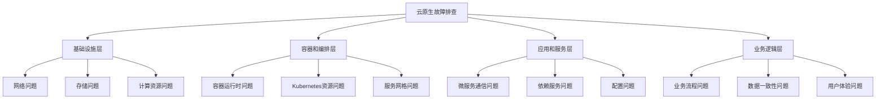
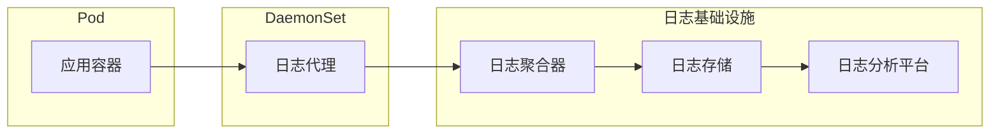
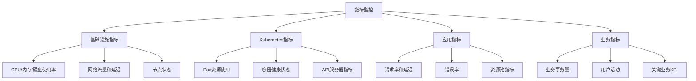
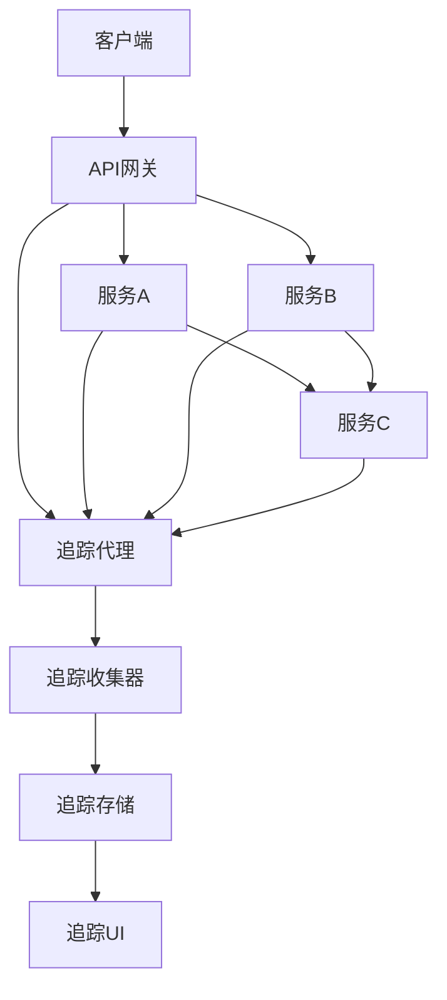
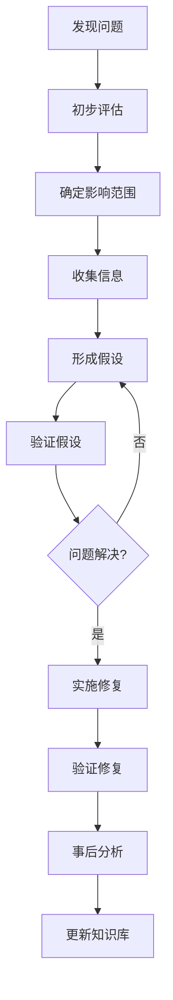

# 云原生应用故障排查

云原生环境中的故障排查具有分布式、动态性等特点，本文将详细介绍云原生应用故障排查的方法、工具和最佳实践，包括日志分析、监控告警、分布式追踪等技术的应用。

## 云原生故障排查概述

云原生应用是基于容器、微服务和动态编排等技术构建的应用程序，这些特性在带来灵活性和可扩展性的同时，也使得故障排查变得更加复杂。相比传统单体应用，云原生应用的故障排查面临以下独特挑战：

### 云原生环境的特点与挑战

1. **分布式复杂性**：应用被拆分为多个微服务，故障可能发生在任何服务或服务之间的交互中
2. **动态性**：容器和Pod可能随时创建或销毁，导致故障现场难以保留
3. **多层次依赖**：从基础设施到应用层的多层依赖关系增加了故障定位的难度
4. **环境一致性**：开发、测试和生产环境的差异可能导致难以重现的问题
5. **可观测性挑战**：需要跨多个服务和组件收集和关联数据

### 故障排查的基本原则

在云原生环境中进行有效的故障排查，应遵循以下基本原则：

1. **全面的可观测性**：构建包括日志、指标和追踪在内的完整可观测性体系
2. **系统化方法**：采用结构化的故障排查流程，避免盲目尝试
3. **根因分析**：不仅解决表面症状，更要找出并解决根本原因
4. **自动化优先**：尽可能自动化故障检测、分析和修复流程
5. **持续改进**：从每次故障中学习，不断完善系统和排查流程

### 故障排查的层次结构

云原生应用的故障排查可以分为以下几个层次：



每个层次都需要特定的工具和方法进行排查，本文将详细介绍各层次的故障排查技术和最佳实践。

## 构建可观测性体系

可观测性是云原生故障排查的基础，它包括三个核心支柱：日志、指标和追踪。

### 日志收集与分析

日志是故障排查的基本工具，在云原生环境中需要集中收集和分析分布在各个服务中的日志。

#### 1. 日志收集架构

在Kubernetes环境中，常见的日志收集架构如下：



常见的日志收集组合包括：
- EFK (Elasticsearch, Fluentd, Kibana)
- ELK (Elasticsearch, Logstash, Kibana)
- PLG (Promtail, Loki, Grafana)

#### 2. 结构化日志实践

结构化日志使日志分析更加高效，以下是Java应用中使用SLF4J和Logback实现结构化日志的示例：

```java
import org.slf4j.Logger;
import org.slf4j.LoggerFactory;
import net.logstash.logback.argument.StructuredArguments;

public class OrderService {
    private static final Logger logger = LoggerFactory.getLogger(OrderService.class);
    
    public void processOrder(Order order) {
        logger.info("Processing order", 
            StructuredArguments.keyValue("orderId", order.getId()),
            StructuredArguments.keyValue("customerId", order.getCustomerId()),
            StructuredArguments.keyValue("amount", order.getAmount())
        );
        
        try {
            // 处理订单逻辑
            paymentService.processPayment(order);
            inventoryService.updateInventory(order);
            
            logger.info("Order processed successfully", 
                StructuredArguments.keyValue("orderId", order.getId()),
                StructuredArguments.keyValue("status", "COMPLETED")
            );
        } catch (PaymentException e) {
            logger.error("Payment processing failed", 
                StructuredArguments.keyValue("orderId", order.getId()),
                StructuredArguments.keyValue("errorCode", e.getErrorCode()),
                StructuredArguments.keyValue("errorMessage", e.getMessage())
            );
            throw e;
        }
    }
}
```

对应的Logback配置：

```xml
<configuration>
  <appender name="JSON" class="ch.qos.logback.core.ConsoleAppender">
    <encoder class="net.logstash.logback.encoder.LogstashEncoder">
      <includeMdcKeyName>traceId</includeMdcKeyName>
      <includeMdcKeyName>spanId</includeMdcKeyName>
      <includeMdcKeyName>userId</includeMdcKeyName>
      <fieldNames>
        <timestamp>timestamp</timestamp>
        <message>message</message>
        <logger>logger</logger>
        <thread>thread</thread>
        <level>level</level>
      </fieldNames>
    </encoder>
  </appender>
  
  <root level="INFO">
    <appender-ref ref="JSON" />
  </root>
</configuration>
```

#### 3. 日志查询与分析技术

有效的日志查询和分析是快速定位问题的关键。以Elasticsearch为例，以下是一些常用的查询技术：

```json
// 按时间范围和错误级别查询
GET /app-logs/_search
{
  "query": {
    "bool": {
      "must": [
        { "match": { "level": "ERROR" } },
        { "range": { "timestamp": { "gte": "now-1h", "lte": "now" } } }
      ]
    }
  },
  "sort": [
    { "timestamp": { "order": "desc" } }
  ]
}

// 按特定服务和错误消息模式查询
GET /app-logs/_search
{
  "query": {
    "bool": {
      "must": [
        { "match": { "service": "order-service" } },
        { "wildcard": { "message": "*connection*timeout*" } }
      ]
    }
  }
}

// 聚合分析错误分布
GET /app-logs/_search
{
  "size": 0,
  "query": {
    "match": { "level": "ERROR" }
  },
  "aggs": {
    "errors_by_service": {
      "terms": { "field": "service.keyword" },
      "aggs": {
        "errors_by_type": {
          "terms": { "field": "errorCode.keyword" }
        }
      }
    }
  }
}
```

### 指标监控系统

指标监控提供系统和应用的实时状态数据，是发现和诊断问题的重要工具。

#### 1. 多层次指标收集

云原生环境中的指标监控应覆盖多个层次：



#### 2. Prometheus监控配置

Prometheus是云原生环境中最常用的监控系统，以下是一个基本的配置示例：

```yaml
# prometheus.yml
global:
  scrape_interval: 15s
  evaluation_interval: 15s

rule_files:
  - "alert_rules.yml"

scrape_configs:
  # Kubernetes API服务器
  - job_name: 'kubernetes-apiservers'
    kubernetes_sd_configs:
    - role: endpoints
    scheme: https
    tls_config:
      ca_file: /var/run/secrets/kubernetes.io/serviceaccount/ca.crt
    bearer_token_file: /var/run/secrets/kubernetes.io/serviceaccount/token
    relabel_configs:
    - source_labels: [__meta_kubernetes_namespace, __meta_kubernetes_service_name, __meta_kubernetes_endpoint_port_name]
      action: keep
      regex: default;kubernetes;https

  # Kubernetes节点
  - job_name: 'kubernetes-nodes'
    kubernetes_sd_configs:
    - role: node
    scheme: https
    tls_config:
      ca_file: /var/run/secrets/kubernetes.io/serviceaccount/ca.crt
    bearer_token_file: /var/run/secrets/kubernetes.io/serviceaccount/token
    relabel_configs:
    - action: labelmap
      regex: __meta_kubernetes_node_label_(.+)

  # Kubernetes Pod
  - job_name: 'kubernetes-pods'
    kubernetes_sd_configs:
    - role: pod
    relabel_configs:
    - source_labels: [__meta_kubernetes_pod_annotation_prometheus_io_scrape]
      action: keep
      regex: true
    - source_labels: [__meta_kubernetes_pod_annotation_prometheus_io_path]
      action: replace
      target_label: __metrics_path__
      regex: (.+)
    - source_labels: [__address__, __meta_kubernetes_pod_annotation_prometheus_io_port]
      action: replace
      regex: ([^:]+)(?::\d+)?;(\d+)
      replacement: $1:$2
      target_label: __address__
    - action: labelmap
      regex: __meta_kubernetes_pod_label_(.+)
    - source_labels: [__meta_kubernetes_namespace]
      action: replace
      target_label: kubernetes_namespace
    - source_labels: [__meta_kubernetes_pod_name]
      action: replace
      target_label: kubernetes_pod_name
```

#### 3. 应用指标暴露

应用应该暴露自定义指标以便监控系统收集。以Spring Boot应用为例：

```java
import io.micrometer.core.instrument.Counter;
import io.micrometer.core.instrument.MeterRegistry;
import io.micrometer.core.instrument.Timer;
import org.springframework.stereotype.Service;

@Service
public class OrderServiceWithMetrics {
    private final OrderRepository orderRepository;
    private final Counter orderCounter;
    private final Counter failedOrderCounter;
    private final Timer orderProcessingTimer;
    
    public OrderServiceWithMetrics(OrderRepository orderRepository, MeterRegistry registry) {
        this.orderRepository = orderRepository;
        
        // 定义计数器和计时器
        this.orderCounter = Counter.builder("orders.processed")
            .description("Total number of processed orders")
            .register(registry);
            
        this.failedOrderCounter = Counter.builder("orders.failed")
            .description("Total number of failed orders")
            .register(registry);
            
        this.orderProcessingTimer = Timer.builder("orders.processing.time")
            .description("Order processing time")
            .register(registry);
    }
    
    public void processOrder(Order order) {
        // 记录处理时间
        orderProcessingTimer.record(() -> {
            try {
                // 处理订单逻辑
                paymentService.processPayment(order);
                inventoryService.updateInventory(order);
                orderRepository.save(order);
                
                // 增加成功计数
                orderCounter.increment();
            } catch (Exception e) {
                // 增加失败计数
                failedOrderCounter.increment();
                throw e;
            }
        });
    }
}
```

对应的Spring Boot配置：

```yaml
# application.yml
management:
  endpoints:
    web:
      exposure:
        include: health,info,prometheus
  metrics:
    export:
      prometheus:
        enabled: true
    tags:
      application: ${spring.application.name}
      environment: ${spring.profiles.active:default}
```

### 分布式追踪

分布式追踪可以跟踪请求在微服务架构中的完整路径，是定位跨服务问题的关键工具。

#### 1. 追踪系统架构

典型的分布式追踪系统架构如下：



#### 2. OpenTelemetry集成

OpenTelemetry是云原生可观测性的标准，以下是在Java应用中集成OpenTelemetry的示例：

```java
// 配置OpenTelemetry
OpenTelemetrySdk openTelemetry = OpenTelemetrySdk.builder()
    .setTracerProvider(
        SdkTracerProvider.builder()
            .addSpanProcessor(BatchSpanProcessor.builder(
                OtlpGrpcSpanExporter.builder()
                    .setEndpoint("http://otel-collector:4317")
                    .build())
                .build())
            .build())
    .build();

// 创建Tracer
Tracer tracer = openTelemetry.getTracer("com.example.OrderService");

// 在方法中使用追踪
public void processOrder(Order order) {
    // 创建Span
    Span span = tracer.spanBuilder("processOrder")
        .setAttribute("orderId", order.getId())
        .setAttribute("customerId", order.getCustomerId())
        .setAttribute("amount", order.getAmount().doubleValue())
        .startSpan();
        
    // 将Span上下文设置为当前上下文
    try (Scope scope = span.makeCurrent()) {
        // 处理订单逻辑
        paymentResult = paymentService.processPayment(order);
        inventoryResult = inventoryService.updateInventory(order);
        
        // 添加事件
        span.addEvent("Payment processed", Attributes.of(
            AttributeKey.stringKey("paymentId"), paymentResult.getPaymentId(),
            AttributeKey.stringKey("status"), paymentResult.getStatus()
        ));
        
        span.addEvent("Inventory updated", Attributes.of(
            AttributeKey.stringKey("inventoryStatus"), inventoryResult.getStatus()
        ));
        
    } catch (Exception e) {
        // 记录错误
        span.recordException(e);
        span.setStatus(StatusCode.ERROR, e.getMessage());
        throw e;
    } finally {
        // 结束Span
        span.end();
    }
}
```

OpenTelemetry Collector配置：

```yaml
# otel-collector-config.yaml
receivers:
  otlp:
    protocols:
      grpc:
        endpoint: 0.0.0.0:4317
      http:
        endpoint: 0.0.0.0:4318

processors:
  batch:
    timeout: 1s
    send_batch_size: 1024

exporters:
  jaeger:
    endpoint: jaeger-collector:14250
    tls:
      insecure: true
  prometheus:
    endpoint: 0.0.0.0:8889
    namespace: otel
  logging:
    loglevel: debug

service:
  pipelines:
    traces:
      receivers: [otlp]
      processors: [batch]
      exporters: [jaeger, logging]
    metrics:
      receivers: [otlp]
      processors: [batch]
      exporters: [prometheus, logging]
```

#### 3. 追踪分析技术

有效的追踪分析可以快速定位性能瓶颈和错误。以下是一些常用的分析技术：

1. **关键路径分析**：识别请求处理中的关键路径和瓶颈
2. **异常路径分析**：比较正常和异常请求的追踪数据，找出差异
3. **服务依赖分析**：分析服务间的调用关系和依赖程度
4. **延迟分布分析**：分析不同服务和操作的延迟分布
5. **错误传播分析**：分析错误如何在服务间传播

## 常见故障排查方法

云原生环境中的故障排查需要系统化的方法和工具，以下介绍几种常见的故障排查方法。

### 基础设施层故障排查

基础设施层的问题通常会影响多个服务，需要优先排查。

#### 1. 网络连通性问题

网络问题是云原生环境中最常见的故障之一。

```bash
# 检查Pod网络连通性
kubectl exec -it <pod-name> -- ping <target-ip>
kubectl exec -it <pod-name> -- curl -v <service-url>

# 检查DNS解析
kubectl exec -it <pod-name> -- nslookup <service-name>

# 检查网络策略
kubectl get networkpolicies -A
kubectl describe networkpolicy <policy-name> -n <namespace>

# 使用网络工具Pod进行诊断
kubectl run network-tools --rm -it --image=nicolaka/netshoot -- /bin/bash
```

网络问题排查清单：
1. 检查Pod和Service的IP地址和DNS解析
2. 验证网络策略是否正确配置
3. 检查服务端口和目标端口是否匹配
4. 验证集群内部和外部的网络连通性
5. 检查CNI插件的健康状态

#### 2. 存储问题

存储问题可能导致应用无法读写数据或性能下降。

```bash
# 检查PV和PVC状态
kubectl get pv,pvc -A
kubectl describe pv <pv-name>
kubectl describe pvc <pvc-name> -n <namespace>

# 检查Pod中的存储挂载
kubectl exec -it <pod-name> -- df -h
kubectl exec -it <pod-name> -- ls -la <mount-path>

# 检查存储类
kubectl get storageclass
kubectl describe storageclass <storageclass-name>
```

存储问题排查清单：
1. 验证PV和PVC的状态是否为Bound
2. 检查存储容量是否已满
3. 验证访问模式(AccessMode)是否正确
4. 检查存储提供者的健康状态
5. 验证Pod是否有正确的存储挂载权限

#### 3. 节点资源问题

节点资源不足或不均衡可能导致Pod调度失败或性能下降。

```bash
# 检查节点状态和资源使用情况
kubectl get nodes
kubectl describe node <node-name>
kubectl top node

# 检查Pod资源使用情况
kubectl top pod -A
kubectl describe pod <pod-name> -n <namespace>

# 检查资源配额
kubectl get resourcequota -A
kubectl describe resourcequota <quota-name> -n <namespace>
```

节点资源问题排查清单：
1. 检查节点CPU和内存使用率
2. 验证节点是否有污点(Taint)影响Pod调度
3. 检查节点磁盘空间是否充足
4. 验证资源配额是否合理设置
5. 检查Pod的资源请求和限制是否合理

### 容器和编排层故障排查

容器和Kubernetes编排层的问题通常与容器生命周期和资源管理相关。

#### 1. Pod启动和运行问题

Pod无法启动或频繁重启是常见的容器层问题。

```bash
# 检查Pod状态
kubectl get pods -n <namespace>
kubectl describe pod <pod-name> -n <namespace>

# 查看Pod日志
kubectl logs <pod-name> -n <namespace>
kubectl logs <pod-name> -n <namespace> --previous  # 查看上一个容器的日志

# 检查Pod事件
kubectl get events -n <namespace> --sort-by='.lastTimestamp'

# 检查容器内部状态
kubectl exec -it <pod-name> -n <namespace> -- /bin/sh
```

Pod问题排查清单：
1. 检查Pod状态和阶段(Phase)
2. 分析容器重启原因和次数
3. 检查容器镜像是否存在且可拉取
4. 验证容器启动命令和参数是否正确
5. 检查容器健康检查(Liveness/Readiness Probe)配置

以下是常见的Pod状态问题及解决方法：

| 状态 | 可能原因 | 排查方法 |
|------|---------|---------|
| Pending | 资源不足、PVC未绑定、节点选择器不匹配 | 检查节点资源、PVC状态、节点选择器和亲和性规则 |
| ImagePullBackOff | 镜像不存在、仓库认证失败 | 验证镜像名称和标签、检查镜像仓库凭证 |
| CrashLoopBackOff | 应用启动失败、健康检查失败 | 查看容器日志、检查启动命令、调整健康检查参数 |
| Error | 容器运行时错误 | 查看容器日志和事件、检查容器运行时配置 |
| Terminating | Pod删除过程中 | 检查是否有finalizer阻止删除、强制删除Pod |

#### 2. 服务发现和负载均衡问题

服务发现和负载均衡问题可能导致服务间无法通信。

```bash
# 检查Service配置
kubectl get svc -n <namespace>
kubectl describe svc <service-name> -n <namespace>

# 检查Endpoints
kubectl get endpoints <service-name> -n <namespace>

# 检查Pod标签是否匹配Service选择器
kubectl get pods -n <namespace> -l <selector-key>=<selector-value>

# 测试服务连通性
kubectl run curl --image=curlimages/curl -it --rm -- curl <service-name>.<namespace>.svc.cluster.local
```

服务发现问题排查清单：
1. 验证Service选择器与Pod标签是否匹配
2. 检查Service端口配置是否正确
3. 验证Endpoints是否包含健康的Pod IP
4. 检查DNS解析是否正常
5. 验证服务网格(如Istio)配置是否正确

#### 3. 配置和密钥问题

配置错误或密钥问题可能导致应用无法正常启动或运行。

```bash
# 检查ConfigMap
kubectl get configmap -n <namespace>
kubectl describe configmap <configmap-name> -n <namespace>

# 检查Secret
kubectl get secret -n <namespace>
kubectl describe secret <secret-name> -n <namespace>

# 验证Pod中的环境变量
kubectl exec -it <pod-name> -n <namespace> -- env

# 检查挂载的配置文件
kubectl exec -it <pod-name> -n <namespace> -- cat /path/to/config/file
```

配置问题排查清单：
1. 验证ConfigMap和Secret是否存在且内容正确
2. 检查Pod是否正确引用ConfigMap和Secret
3. 验证环境变量是否正确设置
4. 检查配置文件挂载路径是否正确
5. 验证配置格式是否符合应用要求

### 应用和服务层故障排查

应用和服务层的问题通常与业务逻辑、依赖服务和资源使用相关。

#### 1. 服务性能问题

服务性能下降可能由多种因素导致，需要综合分析。

```bash
# 检查服务响应时间
curl -w "\nTime: %{time_total}s\n" <service-url>

# 使用hey进行负载测试
hey -n 1000 -c 100 <service-url>

# 分析应用性能指标
kubectl port-forward svc/prometheus 9090:9090 -n monitoring
# 然后在Prometheus UI中查询相关指标

# 检查JVM性能(Java应用)
kubectl exec -it <pod-name> -n <namespace> -- jstat -gcutil 1 10
```

性能问题排查清单：
1. 分析请求延迟和吞吐量指标
2. 检查CPU和内存使用情况
3. 分析数据库查询性能
4. 检查外部依赖服务的响应时间
5. 分析垃圾收集和内存分配模式

#### 2. 依赖服务问题

微服务架构中，依赖服务的问题可能级联影响多个服务。

```bash
# 检查依赖服务健康状态
curl <dependency-service-url>/health

# 模拟依赖服务故障
kubectl patch deployment <dependency-service> -n <namespace> -p '{"spec":{"replicas":0}}'

# 检查断路器状态(使用Actuator端点)
curl <service-url>/actuator/circuitbreakers

# 分析服务调用链
# 在Jaeger或Zipkin UI中查询相关追踪
```

依赖服务问题排查清单：
1. 验证所有依赖服务是否可用
2. 检查服务间通信的超时设置
3. 验证断路器和重试机制是否正常工作
4. 分析服务调用链中的错误和延迟
5. 检查服务版本兼容性

#### 3. 资源泄漏问题

资源泄漏(如内存泄漏、连接泄漏)可能导致服务逐渐变慢或崩溃。

```bash
# 监控内存使用趋势
kubectl top pod <pod-name> -n <namespace> --containers

# 获取JVM堆转储(Java应用)
kubectl exec -it <pod-name> -n <namespace> -- jmap -dump:format=b,file=/tmp/heap.bin 1
kubectl cp <pod-name>:/tmp/heap.bin ./heap.bin -n <namespace>

# 检查连接状态
kubectl exec -it <pod-name> -n <namespace> -- netstat -an | grep ESTABLISHED | wc -l

# 检查文件描述符使用情况
kubectl exec -it <pod-name> -n <namespace> -- ls -la /proc/1/fd | wc -l
```

资源泄漏排查清单：
1. 监控内存使用随时间的变化趋势
2. 分析堆转储找出可能的内存泄漏
3. 检查数据库连接池和HTTP连接池配置
4. 验证资源是否在异常情况下正确释放
5. 检查临时文件和日志文件的清理机制

## 高级故障排查技术

除了基本的故障排查方法外，云原生环境中还需要一些高级技术来处理复杂问题。

### 混沌工程实践

混沌工程通过主动注入故障来验证系统的弹性和发现潜在问题。

```yaml
# 使用Chaos Mesh注入Pod故障
apiVersion: chaos-mesh.org/v1alpha1
kind: PodChaos
metadata:
  name: pod-failure-example
  namespace: chaos-testing
spec:
  action: pod-failure
  mode: one
  selector:
    namespaces:
      - default
让我继续完成云原生应用故障排查的内容：

### 混沌工程实践（续）

```yaml
# 使用Chaos Mesh注入Pod故障
apiVersion: chaos-mesh.org/v1alpha1
kind: PodChaos
metadata:
  name: pod-failure-example
  namespace: chaos-testing
spec:
  action: pod-failure
  mode: one
  selector:
    namespaces:
      - default
    labelSelectors:
      "app": "payment-service"
  duration: "30s"
  scheduler:
    cron: "@every 10m"
```

混沌工程实践的关键步骤：

1. **定义稳态假设**：明确定义系统在正常状态下的行为表现
2. **设计实验**：设计能够验证稳态假设的故障注入实验
3. **控制爆炸半径**：限制实验影响范围，避免造成严重生产事故
4. **持续运行**：将混沌实验集成到CI/CD流程中定期执行
5. **分析结果**：分析实验结果，发现系统弱点并改进

常见的混沌实验类型：

| 实验类型 | 目的 | 工具示例 |
|---------|------|---------|
| 网络延迟和丢包 | 验证服务间通信的弹性 | Chaos Mesh, Toxiproxy |
| 服务中断 | 验证服务依赖和降级机制 | Chaos Monkey, Gremlin |
| 资源压力 | 验证系统在资源受限情况下的行为 | CPU/内存压力测试 |
| 时钟偏移 | 验证系统对时间敏感性的处理 | Chaos Mesh时钟偏移 |
| 磁盘故障 | 验证存储故障处理能力 | I/O故障注入 |

### 调试容器和Sidecar模式

在不修改原始应用的情况下，可以使用调试容器和Sidecar模式进行故障排查。

```yaml
# 向现有Pod添加临时调试容器
kubectl debug -it <pod-name> --image=nicolaka/netshoot --target=<container-name>

# 使用Ephemeral Container进行调试
kubectl alpha debug <pod-name> -c debugger --image=busybox

# 部署带调试Sidecar的应用
apiVersion: apps/v1
kind: Deployment
metadata:
  name: app-with-debug-sidecar
spec:
  replicas: 1
  selector:
    matchLabels:
      app: myapp
  template:
    metadata:
      labels:
        app: myapp
    spec:
      containers:
      - name: main-app
        image: myapp:1.0
        volumeMounts:
        - name: shared-data
          mountPath: /app/logs
      - name: debug-sidecar
        image: nicolaka/netshoot
        command: ["sleep", "infinity"]
        volumeMounts:
        - name: shared-data
          mountPath: /logs
      volumes:
      - name: shared-data
        emptyDir: {}
```

调试容器的使用场景：

1. **网络诊断**：使用网络工具容器诊断网络连接问题
2. **日志分析**：使用日志分析工具容器处理应用日志
3. **性能分析**：使用性能分析工具容器收集性能数据
4. **文件系统检查**：检查共享卷和文件系统问题
5. **进程监控**：监控应用进程和资源使用情况

### 服务网格调试技术

服务网格(如Istio)提供了强大的流量控制和可观测性功能，可用于故障排查。

```yaml
# 使用Istio故障注入
apiVersion: networking.istio.io/v1alpha3
kind: VirtualService
metadata:
  name: ratings-fault
spec:
  hosts:
  - ratings
  http:
  - fault:
      delay:
        percentage:
          value: 50
        fixedDelay: 5s
      abort:
        percentage:
          value: 10
        httpStatus: 500
    route:
    - destination:
        host: ratings
        subset: v1

# 配置请求重试
apiVersion: networking.istio.io/v1alpha3
kind: VirtualService
metadata:
  name: ratings-retry
spec:
  hosts:
  - ratings
  http:
  - route:
    - destination:
        host: ratings
        subset: v1
    retries:
      attempts: 3
      perTryTimeout: 2s
      retryOn: gateway-error,connect-failure,refused-stream
```

服务网格调试技术包括：

1. **流量镜像**：将生产流量复制到测试服务进行分析
2. **请求追踪**：详细跟踪请求在服务网格中的路径
3. **流量转移**：逐步将流量从有问题的版本转移到新版本
4. **断路器配置**：防止级联故障扩散
5. **访问日志增强**：配置详细的访问日志以便分析

### 远程调试技术

在某些情况下，需要对运行中的容器进行远程调试。

```yaml
# Java应用远程调试配置
apiVersion: apps/v1
kind: Deployment
metadata:
  name: java-app-debug
spec:
  template:
    spec:
      containers:
      - name: java-app
        image: myapp:1.0
        ports:
        - containerPort: 8080
        - containerPort: 5005
          name: debug
        env:
        - name: JAVA_TOOL_OPTIONS
          value: "-agentlib:jdwp=transport=dt_socket,server=y,suspend=n,address=*:5005"
        readinessProbe:
          httpGet:
            path: /actuator/health
            port: 8080
          initialDelaySeconds: 30
          periodSeconds: 10

# 创建调试端口转发
kubectl port-forward <pod-name> 5005:5005
```

远程调试最佳实践：

1. **限制使用范围**：仅在非生产环境或受控的生产环境中使用
2. **设置超时机制**：避免调试会话长时间挂起
3. **控制访问权限**：限制谁可以进行远程调试
4. **使用安全连接**：确保调试连接是加密的
5. **记录调试活动**：记录所有调试活动以便审计

## 自动化故障排查

随着系统规模的增长，手动故障排查变得越来越困难，需要引入自动化故障排查机制。

### 自动诊断系统

自动诊断系统可以收集和分析数据，自动识别常见问题。

```yaml
# Prometheus告警规则示例
apiVersion: monitoring.coreos.com/v1
kind: PrometheusRule
metadata:
  name: auto-diagnosis
  namespace: monitoring
spec:
  groups:
  - name: auto-diagnosis.rules
    rules:
    - alert: PodRestartingFrequently
      expr: increase(kube_pod_container_status_restarts_total[1h]) > 5
      for: 10m
      labels:
        severity: warning
        auto_diagnosis: "true"
      annotations:
        summary: "Pod {{ $labels.pod }} in namespace {{ $labels.namespace }} is restarting frequently"
        description: "Pod has restarted {{ $value }} times in the last hour. Check logs and events."
        diagnosis_steps: "1. Check pod logs: kubectl logs {{ $labels.pod }} -n {{ $labels.namespace }}\n2. Check pod events: kubectl describe pod {{ $labels.pod }} -n {{ $labels.namespace }}"
        
    - alert: HighErrorRate
      expr: sum(rate(http_requests_total{status=~"5.."}[5m])) / sum(rate(http_requests_total[5m])) > 0.05
      for: 5m
      labels:
        severity: warning
        auto_diagnosis: "true"
      annotations:
        summary: "High error rate detected for service {{ $labels.service }}"
        description: "Service has a {{ $value | humanizePercentage }} error rate over the last 5 minutes."
        diagnosis_steps: "1. Check service logs\n2. Check dependent services\n3. Verify recent deployments"
```

自动诊断系统的关键组件：

1. **数据收集**：从各种来源收集诊断数据
2. **模式识别**：识别已知的故障模式
3. **根因分析**：自动推断可能的根本原因
4. **修复建议**：提供可能的修复步骤
5. **知识库集成**：利用过去的故障案例进行学习

### 自愈系统

自愈系统可以自动检测和修复某些类型的故障，减少人工干预。

```yaml
# Kubernetes Operator实现自愈逻辑
apiVersion: apps/v1
kind: Deployment
metadata:
  name: self-healing-operator
spec:
  replicas: 1
  selector:
    matchLabels:
      app: self-healing-operator
  template:
    metadata:
      labels:
        app: self-healing-operator
    spec:
      serviceAccountName: self-healing-operator
      containers:
      - name: operator
        image: self-healing-operator:1.0
        env:
        - name: WATCH_NAMESPACE
          valueFrom:
            fieldRef:
              fieldPath: metadata.namespace
        - name: OPERATOR_NAME
          value: "self-healing-operator"

# 自愈规则配置
apiVersion: selfhealing.example.com/v1
kind: HealingRule
metadata:
  name: restart-on-oom
spec:
  selector:
    matchLabels:
      app: critical-service
  triggers:
  - type: OOMKilled
    count: 3
    period: 10m
  actions:
  - type: RestartPod
  - type: IncreaseMemoryLimit
    value: "20%"
  - type: NotifyTeam
    team: platform
```

自愈系统的常见功能：

1. **自动重启**：检测到容器崩溃时自动重启
2. **资源调整**：根据使用情况自动调整资源限制
3. **流量转移**：从故障实例自动转移流量
4. **配置回滚**：检测到配置问题时自动回滚
5. **依赖服务切换**：在依赖服务故障时切换到备用服务

### 故障预测

通过机器学习和趋势分析，预测可能发生的故障并提前采取行动。

```python
# 使用Python和Prometheus API进行故障预测
import requests
import pandas as pd
import numpy as np
from sklearn.ensemble import IsolationForest
from datetime import datetime, timedelta

# 获取Prometheus指标数据
def get_metric_data(query, start_time, end_time, step='1m'):
    response = requests.get(
        'http://prometheus:9090/api/v1/query_range',
        params={
            'query': query,
            'start': start_time.isoformat(),
            'end': end_time.isoformat(),
            'step': step
        }
    )
    results = response.json()['data']['result']
    
    # 转换为DataFrame
    dfs = []
    for result in results:
        df = pd.DataFrame(result['values'], columns=['timestamp', 'value'])
        df['timestamp'] = pd.to_datetime(df['timestamp'], unit='s')
        df['value'] = df['value'].astype(float)
        for k, v in result['metric'].items():
            df[k] = v
        dfs.append(df)
    
    return pd.concat(dfs) if dfs else pd.DataFrame()

# 获取过去24小时的数据
end_time = datetime.now()
start_time = end_time - timedelta(hours=24)

# 获取CPU、内存和错误率指标
cpu_data = get_metric_data('sum(rate(container_cpu_usage_seconds_total[5m])) by (pod)', start_time, end_time)
memory_data = get_metric_data('sum(container_memory_working_set_bytes) by (pod)', start_time, end_time)
error_data = get_metric_data('sum(rate(http_requests_total{status=~"5.."}[5m])) by (service)', start_time, end_time)

# 合并数据集
# ... 数据预处理代码 ...

# 使用异常检测算法
model = IsolationForest(contamination=0.05)
model.fit(features)
anomaly_scores = model.decision_function(features)

# 预测未来异常
# ... 预测代码 ...

# 发送告警
# ... 告警代码 ...
```

故障预测的关键技术：

1. **时间序列分析**：分析指标随时间的变化趋势
2. **异常检测算法**：识别异常的系统行为模式
3. **相关性分析**：分析不同指标间的相关关系
4. **预测模型**：预测未来的系统状态和可能的故障
5. **早期预警**：在故障发生前提供预警

## 故障排查最佳实践

基于云原生环境的特点，以下是一些故障排查的最佳实践。

### 结构化故障排查流程

建立结构化的故障排查流程可以提高效率和一致性。



结构化故障排查流程的关键步骤：

1. **初步评估**：快速确定问题的严重性和优先级
2. **确定影响范围**：识别受影响的用户、服务和功能
3. **收集信息**：收集日志、指标、事件和用户报告
4. **形成假设**：基于收集的信息提出可能的原因
5. **验证假设**：通过测试验证每个假设
6. **实施修复**：应用解决方案并验证效果
7. **事后分析**：分析根本原因并制定预防措施

### 故障演练

定期进行故障演练可以提高团队应对真实故障的能力。

```yaml
# 故障演练计划示例
apiVersion: v1
kind: ConfigMap
metadata:
  name: disaster-recovery-drill
data:
  drill-plan: |
    # 数据库故障恢复演练
    
    ## 目标
    验证团队在主数据库故障时的恢复能力
    
    ## 前提条件
    1. 备份数据库已配置并同步
    2. 故障转移机制已实施
    3. 监控和告警系统已就位
    
    ## 演练步骤
    1. 通知相关团队演练开始
    2. 模拟主数据库故障（关闭主数据库Pod）
    3. 验证监控系统是否正确触发告警
    4. 执行故障转移流程
    5. 验证应用是否成功连接到备份数据库
    6. 验证数据一致性
    7. 恢复主数据库并切换回来
    
    ## 成功标准
    1. 告警在5分钟内触发
    2. 故障转移在10分钟内完成
    3. 数据一致性100%保持
    4. 用户体验中断不超过2分钟
```

故障演练的最佳实践：

1. **从简单开始**：先进行简单的故障演练，逐步增加复杂性
2. **定义明确目标**：每次演练都有明确的学习目标
3. **创建安全环境**：确保演练不会影响实际用户
4. **记录和分析**：详细记录演练过程和结果
5. **持续改进**：根据演练结果改进系统和流程

### 故障知识库

建立故障知识库可以加速故障排查和解决过程。

```markdown
# 故障案例：服务连接超时

## 症状
- 服务A无法连接到服务B
- 日志显示连接超时错误
- 监控显示高延迟

## 可能原因
1. 网络策略配置错误
2. 服务B实例不足
3. 服务B资源不足
4. DNS解析问题
5. 防火墙规则阻止

## 诊断步骤
1. 检查服务B的Pod状态和日志
   ```bash
   kubectl get pods -l app=service-b
   kubectl logs -l app=service-b
   ```

2. 检查网络策略
   ```bash
   kubectl get networkpolicies
   kubectl describe networkpolicy <policy-name>
   ```

3. 检查DNS解析
   ```bash
   kubectl exec -it <pod-name> -- nslookup service-b
   ```

4. 检查服务B的资源使用情况
   ```bash
   kubectl top pod -l app=service-b
   ```

## 解决方案
- 如果是网络策略问题：更新网络策略允许服务A访问服务B
- 如果是资源不足：增加服务B的资源限制或副本数
- 如果是DNS问题：检查CoreDNS配置和服务定义

## 预防措施
1. 实施服务连接健康检查
2. 配置适当的超时和重试策略
3. 设置资源使用告警
4. 定期审查网络策略
```

故障知识库的关键要素：

1. **详细症状描述**：包括错误消息、日志和监控数据
2. **可能原因列表**：按可能性排序的原因列表
3. **诊断步骤**：详细的排查步骤和命令
4. **解决方案**：针对不同原因的解决方案
5. **预防措施**：防止类似问题再次发生的措施

### 团队协作与沟通

有效的团队协作和沟通对于快速解决复杂故障至关重要。

```yaml
# 故障响应角色和责任
apiVersion: v1
kind: ConfigMap
metadata:
  name: incident-response-roles
data:
  roles: |
    # 故障响应角色和责任
    
    ## 故障指挥官
    - 协调整体故障响应
    - 做出关键决策
    - 确保团队专注于解决问题
    
    ## 技术负责人
    - 领导技术调查
    - 提出解决方案
    - 协调技术资源
    
    ## 通信负责人
    - 向利益相关者提供更新
    - 管理内部和外部沟通
    - 准备事后报告
    
    ## 运维支持
    - 执行必要的操作
    - 收集诊断信息
    - 实施临时解决方案
    
    ## 业务代表
    - 评估业务影响
    - 提供业务优先级
    - 验证业务功能恢复
```

团队协作最佳实践：

1. **明确角色和责任**：定义每个人在故障响应中的角色
2. **建立沟通渠道**：使用专门的沟通渠道进行故障协调
3. **定期状态更新**：提供简洁明了的状态更新
4. **决策透明**：记录关键决策及其理由
5. **知识共享**：确保关键信息在团队中共享

## 案例研究

以下是几个云原生环境中常见故障的案例研究，展示了实际的排查和解决过程。

### 案例一：微服务通信故障

**问题描述**：电子商务平台的订单服务无法与支付服务通信，导致用户无法完成订单。

**症状**：
- 订单服务日志显示连接支付服务超时
- 监控显示支付服务的成功率下降到0%
- 用户报告结账过程中出现错误

**排查过程**：

1. **检查支付服务状态**
```bash
kubectl get pods -n payment-system
```
发现支付服务的Pod正在运行，但就绪探针失败。

2. **查看支付服务日志**
```bash
kubectl logs -l app=payment-service -n payment-system
```
日志显示数据库连接错误。

3. **检查数据库状态**
```bash
kubectl get pods -n database-system
kubectl describe pod payment-db-0 -n database-system
```
发现数据库Pod处于Running状态，但存在资源压力。

4. **检查数据库指标**
```bash
kubectl top pod payment-db-0 -n database-system
```
发现数据库CPU使用率接近100%，内存使用率高。

5. **分析数据库查询**
通过连接到数据库，发现大量慢查询正在执行。

**根本原因**：最近部署的新功能引入了一个低效的数据库查询，导致数据库过载，进而影响支付服务。

**解决方案**：
1. 优化数据库查询，添加适当的索引
2. 增加数据库资源配置
3. 实施查询缓存减轻数据库负载
4. 添加断路器防止级联故障

**预防措施**：
1. 在部署前进行性能测试
2. 添加数据库性能监控和告警
3. 实施代码审查流程，关注数据库查询效率
4. 使用蓝绿部署策略，便于快速回滚

### 案例二：内存泄漏导致服务不稳定

**问题描述**：用户认证服务在运行几天后开始变得不稳定，最终导致OOM被杀。

**症状**：
- 服务定期重启，日志显示OOMKilled
- 内存使用量随时间稳步增长
- 服务响应时间逐渐增加

**排查过程**：

1. **分析Pod重启模式**
```bash
kubectl get pods -n auth-system --sort-by='.status.containerStatuses[0].restartCount'
```
发现某些Pod重启次数明显高于其他Pod。

2. **检查内存使用趋势**
使用Prometheus查询内存使用趋势：
```
container_memory_working_set_bytes{namespace="auth-system", container="auth-service"}
```
确认内存使用呈线性增长。

3. **获取堆转储**
```bash
kubectl exec -it auth-service-pod-name -n auth-system -- jmap -dump:format=b,file=/tmp/heap.bin 1
kubectl cp auth-service-pod-name:/tmp/heap.bin ./heap.bin -n auth-system
```

4. **分析堆转储**
使用MAT(Memory Analyzer Tool)分析堆转储，发现大量的`UserSession`对象未被释放。

5. **代码审查**
审查会话管理代码，发现会话过期后没有正确从内存中移除。

**根本原因**：会话管理代码中的逻辑错误导致过期会话未被垃圾收集，造成内存泄漏。

**解决方案**：
1. 修复会话管理代码，确保过期会话被正确清理
2. 实施会话超时机制
3. 添加定期清理任务，强制回收过期会话
4. 部署修复版本并验证内存使用稳定

**预防措施**：
1. 添加内存使用监控和告警
2. 实施定期压力测试和内存分析
3. 使用内存分析工具作为CI/CD流程的一部分
4. 实施资源限制和自动扩缩容

### 案例三：网络策略导致服务隔离

**问题描述**：新部署的安全策略后，前端应用无法连接到API服务，导致功能失效。

**症状**：
- 前端控制台显示API请求失败
- API服务日志没有收到请求
- 网络监控显示连接被拒绝

**排查过程**：

1. **验证服务可用性**
```bash
kubectl get pods -n frontend-system
kubectl get pods -n api-system
```
确认两个服务的Pod都在正常运行。

2. **检查服务连通性**
```bash
kubectl exec -it frontend-pod-name -n frontend-system -- curl api-service.api-system.svc.cluster.local
```
请求超时，无法连接。

3. **检查网络策略**
```bash
kubectl get networkpolicies -A
kubectl describe networkpolicy -n api-system
```
发现新部署的网络策略限制了对API服务的访问。

4. **分析网络策略配置**
```yaml
apiVersion: networking.k8s.io/v1
kind: NetworkPolicy
metadata:
  name: api-access
  namespace: api-system
spec:
  podSelector:
    matchLabels:
      app: api-service
  ingress:
  - from:
    - namespaceSelector:
        matchLabels:
          name: backend-system
    ports:
    - protocol: TCP
      port: 8080
```
策略只允许来自`backend-system`命名空间的访问，而前端在`frontend-system`命名空间。

**根本原因**：网络策略配置错误，没有包含前端命名空间的访问权限。

**解决方案**：
1. 更新网络策略，添加前端命名空间的访问权限
```yaml
apiVersion: networking.k8s.io/v1
kind: NetworkPolicy
metadata:
  name: api-access
  namespace: api-system
spec:
  podSelector:
    matchLabels:
      app: api-service
  ingress:
  - from:
    - namespaceSelector:
        matchLabels:
          name: backend-system
    - namespaceSelector:
        matchLabels:
          name: frontend-system
    ports:
    - protocol: TCP
      port: 8080
```
2. 应用更新的网络策略并验证连接

**预防措施**：
1. 实施网络策略变更的审查流程
2. 在应用网络策略前进行连通性测试
3. 使用网络策略模拟器验证策略效果
4. 建立网络策略文档和最佳实践

## 结论

云原生应用故障排查是一项复杂但系统化的工作，需要综合运用多种技术和工具。通过建立完善的可观测性体系、采用结构化的排查流程、实施自动化诊断和修复机制，以及持续学习和改进，可以有效应对云原生环境中的各种故障挑战。

随着云原生技术的不断发展，故障排查技术和工具也在不断演进。团队应该保持学习新技术和最佳实践，不断完善故障排查能力，确保云原生应用的稳定性和可靠性。

最后，故障不仅是挑战，也是学习和改进的机会。通过每次故障的分析和总结，可以不断优化系统设计、改进运维流程、提高团队能力，最终构建更加健壮和可靠的云原生应用。