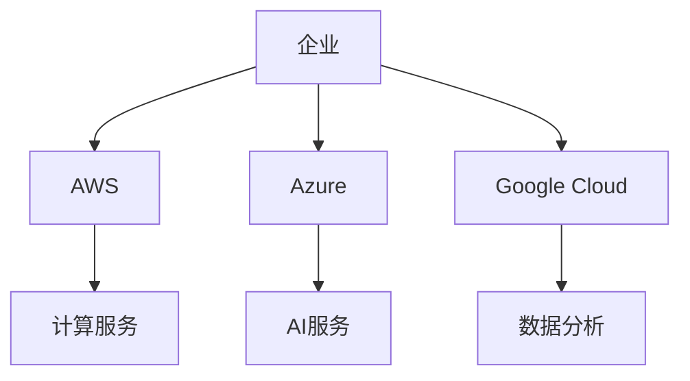
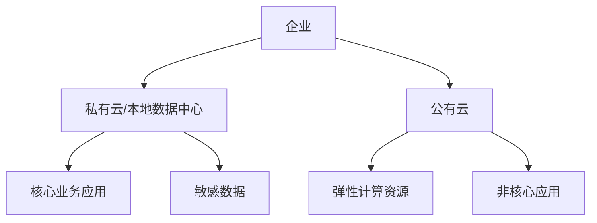
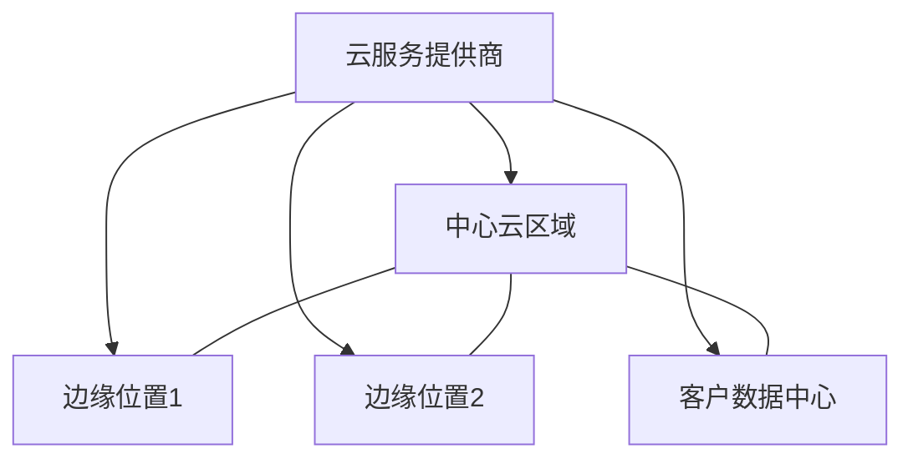
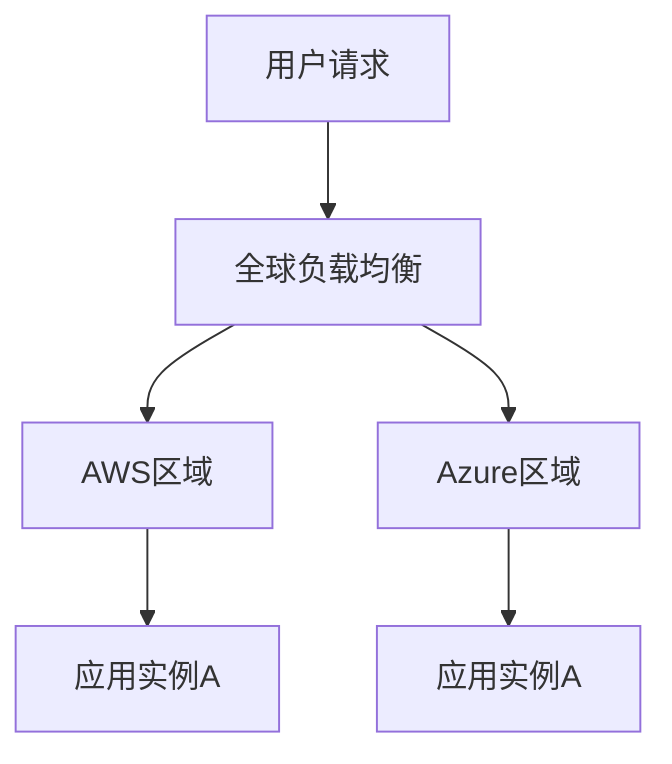
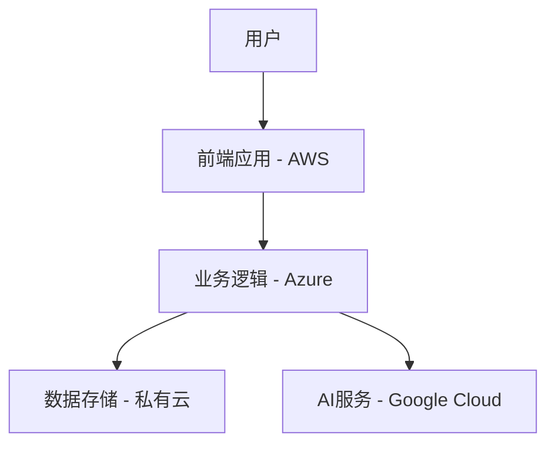
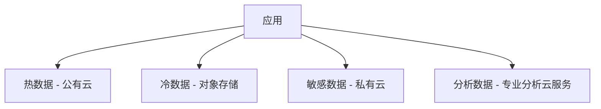
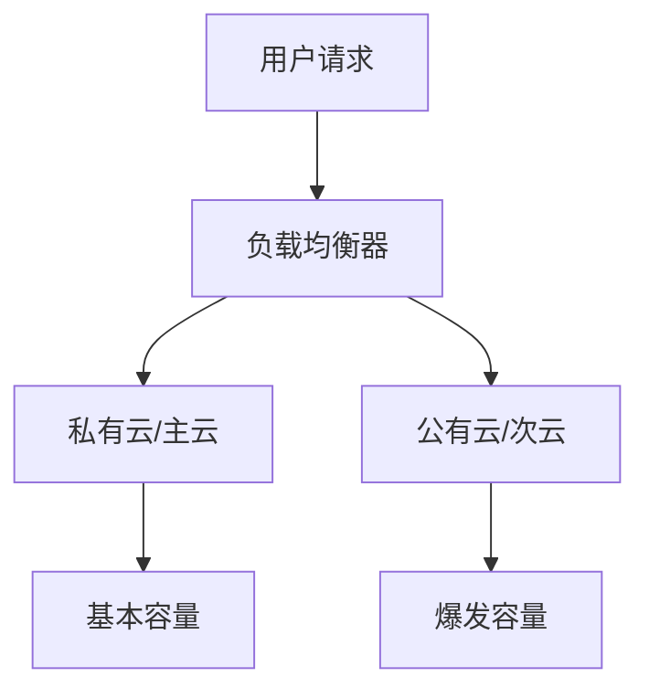
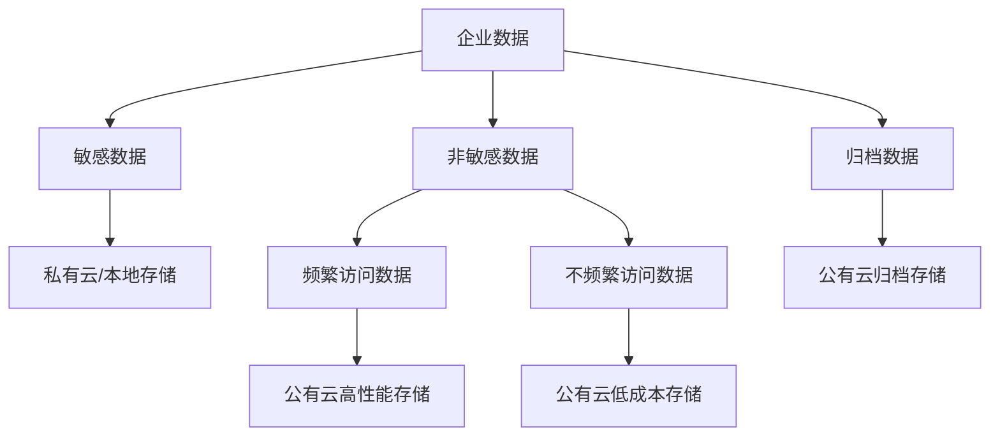

# 多云与混合云策略

多云和混合云策略能够帮助企业避免厂商锁定并优化资源配置，本文将详细介绍多云架构设计、云间互通、统一管理和数据同步等关键技术，以及多云环境下的最佳实践。

## 多云与混合云概述

在当今复杂多变的IT环境中，企业越来越倾向于采用多云和混合云策略，以满足不同的业务需求并降低风险。在深入探讨具体实施策略之前，我们需要明确理解这些概念及其带来的价值。

### 核心概念定义

#### 多云(Multi-Cloud)

多云是指企业同时使用来自两个或多个公有云服务提供商的云服务。例如，一个企业可能同时使用AWS的计算服务、Azure的AI服务和Google Cloud的数据分析服务。



#### 混合云(Hybrid Cloud)

混合云是指将私有云(或本地数据中心)与一个或多个公有云服务结合使用的云部署模型。例如，企业可能在私有云中运行核心业务应用，同时使用公有云进行弹性扩展和非核心应用。



#### 分布式云(Distributed Cloud)

分布式云是公有云的延伸，将云服务分布在不同的物理位置，但仍由原始公有云提供商管理。这种模式可以满足数据主权和低延迟需求。



### 采用多云与混合云的驱动因素

企业选择多云和混合云策略的原因多种多样，主要包括：

1. **避免厂商锁定**：减少对单一云服务提供商的依赖，增强议价能力
2. **优化成本**：根据不同云服务提供商的价格模型选择最具成本效益的服务
3. **利用最佳服务**：选择每个云服务提供商的优势服务，构建最佳解决方案
4. **地理分布需求**：满足不同地区的数据主权和合规要求
5. **业务连续性**：通过多云部署提高系统可用性和灾难恢复能力
6. **并购整合**：整合并购企业的不同云环境
7. **渐进式云迁移**：支持从本地环境到云环境的平滑过渡

### 多云与混合云的优势与挑战

#### 优势

1. **灵活性与选择自由**：可以根据业务需求选择最合适的云服务
2. **成本优化**：可以利用不同云服务提供商的定价优势
3. **避免厂商锁定**：减少对单一云服务提供商的依赖
4. **地理覆盖**：可以选择在不同地区有优势的云服务提供商
5. **风险分散**：减少单点故障风险
6. **合规性**：可以根据不同地区的法规要求选择合适的部署模式

#### 挑战

1. **复杂性增加**：管理多个云环境增加了操作复杂性
2. **技能要求**：需要团队掌握多种云平台的技能
3. **安全管理**：需要在多个环境中维护一致的安全策略
4. **数据一致性**：确保跨云环境的数据同步和一致性
5. **网络连接**：需要可靠的云间网络连接
6. **成本管理**：跨云环境的成本可视化和优化更加复杂
7. **治理挑战**：确保跨云环境的一致性治理和合规性

## 多云架构设计

设计有效的多云架构需要考虑应用特性、数据需求、安全要求和运维能力等多个因素。本节将介绍多云架构的常见模式和设计原则。

### 多云架构模式

#### 1. 水平分割模式

将相同功能的应用部署在多个云上，通过负载均衡或DNS路由将流量分配到不同云环境。



**适用场景**：
- 需要全球分布式部署的应用
- 对高可用性有严格要求的系统
- 需要灾难恢复能力的关键业务

**实现示例**：使用AWS Route 53和Azure Traffic Manager实现跨云负载均衡

```yaml
# AWS Route 53配置示例
AWSTemplateFormatVersion: '2010-09-09'
Resources:
  MultiCloudDNS:
    Type: 'AWS::Route53::HealthCheck'
    Properties:
      HealthCheckConfig:
        Port: 80
        Type: HTTP
        ResourcePath: '/health'
        FullyQualifiedDomainName: 'app.azure-region.example.com'
        RequestInterval: 30
        FailureThreshold: 3
  
  DNSRecord:
    Type: 'AWS::Route53::RecordSet'
    Properties:
      HostedZoneId: 'Z1PA6795UKMFR9'
      Name: 'app.example.com'
      Type: 'A'
      SetIdentifier: 'Primary'
      Weight: 50
      AliasTarget:
        HostedZoneId: 'Z2FDTNDATAQYW2'
        DNSName: 'app.aws-region.example.com'
      HealthCheckId: !Ref MultiCloudDNS
```

#### 2. 垂直分割模式

根据应用功能或服务特性将不同组件部署在不同的云环境中。



**适用场景**：
- 利用不同云服务提供商的特定优势
- 满足不同组件的特定需求(性能、合规性等)
- 渐进式云迁移

**实现示例**：跨云微服务架构

```yaml
# Kubernetes部署配置示例
apiVersion: apps/v1
kind: Deployment
metadata:
  name: frontend-service
  labels:
    app: frontend
    cloud: aws
spec:
  replicas: 3
  selector:
    matchLabels:
      app: frontend
  template:
    metadata:
      labels:
        app: frontend
    spec:
      containers:
      - name: frontend
        image: example/frontend:v1
        ports:
        - containerPort: 80
        env:
        - name: BACKEND_URL
          value: "https://api.azure.example.com"
---
# 在Azure上部署的后端服务
apiVersion: apps/v1
kind: Deployment
metadata:
  name: backend-service
  labels:
    app: backend
    cloud: azure
spec:
  replicas: 3
  selector:
    matchLabels:
      app: backend
  template:
    metadata:
      labels:
        app: backend
    spec:
      containers:
      - name: backend
        image: example/backend:v1
        ports:
        - containerPort: 8080
        env:
        - name: DATABASE_URL
          valueFrom:
            secretKeyRef:
              name: db-credentials
              key: url
        - name: AI_SERVICE_URL
          value: "https://ai.google.example.com"
```

#### 3. 数据分割模式

根据数据特性、合规要求或访问模式将数据分布在不同的云环境中。



**适用场景**：
- 数据主权和合规性要求
- 数据访问模式多样化
- 成本优化需求

**实现示例**：跨云数据分层存储

```java
// 数据访问层示例代码
public class DataAccessService {
    
    private final HotDataRepository hotDataRepo;  // 公有云
    private final ColdDataRepository coldDataRepo; // 对象存储
    private final SensitiveDataRepository sensitiveDataRepo; // 私有云
    private final AnalyticsDataRepository analyticsDataRepo; // 分析云服务
    
    public DataAccessService(
            HotDataRepository hotDataRepo,
            ColdDataRepository coldDataRepo,
            SensitiveDataRepository sensitiveDataRepo,
            AnalyticsDataRepository analyticsDataRepo) {
        this.hotDataRepo = hotDataRepo;
        this.coldDataRepo = coldDataRepo;
        this.sensitiveDataRepo = sensitiveDataRepo;
        this.analyticsDataRepo = analyticsDataRepo;
    }
    
    public Data getData(String id, DataType type) {
        switch (type) {
            case HOT:
                return hotDataRepo.findById(id);
            case COLD:
                return coldDataRepo.findById(id);
            case SENSITIVE:
                return sensitiveDataRepo.findById(id);
            case ANALYTICS:
                return analyticsDataRepo.findById(id);
            default:
                throw new IllegalArgumentException("Unknown data type: " + type);
        }
    }
    
    public void storeData(Data data) {
        DataType type = classifyData(data);
        switch (type) {
            case HOT:
                hotDataRepo.save(data);
                break;
            case COLD:
                coldDataRepo.save(data);
                break;
            case SENSITIVE:
                sensitiveDataRepo.save(data);
                break;
            case ANALYTICS:
                analyticsDataRepo.save(data);
                analyticsDataRepo.triggerAnalysis(data);
                break;
        }
    }
    
    private DataType classifyData(Data data) {
        // 根据数据特性分类
        if (data.containsSensitiveInfo()) {
            return DataType.SENSITIVE;
        } else if (data.isFrequentlyAccessed()) {
            return DataType.HOT;
        } else if (data.isForAnalytics()) {
            return DataType.ANALYTICS;
        } else {
            return DataType.COLD;
        }
    }
}
```

#### 4. 云爆发模式(Cloud Bursting)

基本工作负载在私有云或主要公有云上运行，峰值负载自动扩展到其他云环境。



**适用场景**：
- 处理季节性或不可预测的流量峰值
- 成本优化(只在需要时使用额外资源)
- 渐进式云迁移

**实现示例**：使用Kubernetes Federation实现跨云爆发

```yaml
# Kubernetes Federation配置示例
apiVersion: types.kubefed.io/v1beta1
kind: FederatedDeployment
metadata:
  name: cloud-burst-app
  namespace: default
spec:
  template:
    metadata:
      labels:
        app: cloud-burst-app
    spec:
      replicas: 3
      selector:
        matchLabels:
          app: cloud-burst-app
      template:
        metadata:
          labels:
            app: cloud-burst-app
        spec:
          containers:
          - name: nginx
            image: nginx:1.17
  placement:
    clusters:
    - name: primary-cluster  # 私有云或主云
  overrides:
  - clusterName: burst-cluster  # 公有云或次云
    clusterOverrides:
    - path: "/spec/replicas"
      value: 0  # 初始设置为0，在需要时扩展
---
# 自动扩展策略
apiVersion: autoscaling/v2beta2
kind: HorizontalPodAutoscaler
metadata:
  name: primary-hpa
spec:
  scaleTargetRef:
    apiVersion: apps/v1
    kind: Deployment
    name: cloud-burst-app
  minReplicas: 3
  maxReplicas: 10
  metrics:
  - type: Resource
    resource:
      name: cpu
      target:
        type: Utilization
        averageUtilization: 80
  behavior:
    scaleUp:
      stabilizationWindowSeconds: 60
      policies:
      - type: Percent
        value: 100
        periodSeconds: 15
    scaleDown:
      stabilizationWindowSeconds: 300
```

### 多云设计原则

设计有效的多云架构需要遵循以下关键原则：

#### 1. 云中立性(Cloud Neutrality)

设计应用时应尽量减少对特定云服务提供商专有服务的依赖，以便于跨云迁移和部署。

**实现策略**：
- 使用开源和标准化技术(如Kubernetes、Terraform)
- 采用抽象层隔离云服务提供商特定API
- 使用兼容多云的服务和工具

**代码示例**：使用抽象层隔离存储服务

```java
// 存储服务抽象接口
public interface StorageService {
    void uploadFile(String bucketName, String key, InputStream data);
    InputStream downloadFile(String bucketName, String key);
    void deleteFile(String bucketName, String key);
    List<String> listFiles(String bucketName, String prefix);
}

// AWS S3实现
public class S3StorageService implements StorageService {
    private final AmazonS3 s3Client;
    
    public S3StorageService(AmazonS3 s3Client) {
        this.s3Client = s3Client;
    }
    
    @Override
    public void uploadFile(String bucketName, String key, InputStream data) {
        s3Client.putObject(bucketName, key, data, new ObjectMetadata());
    }
    
    // 其他方法实现...
}

// Azure Blob Storage实现
public class AzureBlobStorageService implements StorageService {
    private final BlobServiceClient blobServiceClient;
    
    public AzureBlobStorageService(BlobServiceClient blobServiceClient) {
        this.blobServiceClient = blobServiceClient;
    }
    
    @Override
    public void uploadFile(String containerName, String blobName, InputStream data) {
        BlobContainerClient containerClient = blobServiceClient.getBlobContainerClient(containerName);
        BlobClient blobClient = containerClient.getBlobClient(blobName);
        blobClient.upload(data, data.available());
    }
    
    // 其他方法实现...
}
```

#### 2. 松耦合架构

采用松耦合的架构设计，使系统组件能够独立部署和扩展，减少跨云依赖。

**实现策略**：
- 采用微服务架构
- 使用异步通信模式
- 实现服务发现机制
- 设计容错和降级机制

**代码示例**：使用消息队列实现跨云通信

```java
// 消息生产者(云A)
@Service
public class OrderService {
    private final MessageBroker messageBroker;
    
    public OrderService(MessageBroker messageBroker) {
        this.messageBroker = messageBroker;
    }
    
    public void processOrder(Order order) {
        // 处理订单逻辑
        // ...
        
        // 发送消息到另一个云环境
        OrderProcessedEvent event = new OrderProcessedEvent(order.getId(), order.getStatus());
        messageBroker.send("order-events", event);
    }
}

// 消息消费者(云B)
@Service
public class InventoryService {
    private final InventoryRepository repository;
    
    public InventoryService(InventoryRepository repository) {
        this.repository = repository;
    }
    
    @MessageListener(topic = "order-events")
    public void handleOrderProcessed(OrderProcessedEvent event) {
        if (event.getStatus() == OrderStatus.CONFIRMED) {
            // 更新库存
            repository.updateInventory(event.getOrderId());
        }
    }
}
```

#### 3. 数据主权与本地化

根据数据主权和合规要求设计数据存储和处理策略。

**实现策略**：
- 根据地理位置和法规要求分布数据
- 实施数据分类和治理策略
- 使用加密和访问控制保护数据
- 实现数据生命周期管理

**配置示例**：使用Terraform配置地区特定的数据存储

```hcl
# 欧盟地区数据存储(GDPR合规)
module "eu_data_storage" {
  source = "./modules/compliant-storage"
  
  providers = {
    aws = aws.eu-central-1
  }
  
  region = "eu-central-1"
  data_classification = "personal"
  encryption_enabled = true
  retention_period = 90  # 天
  
  tags = {
    Environment = "Production"
    DataRegion = "EU"
    Compliance = "GDPR"
  }
}

# 美国地区数据存储
module "us_data_storage" {
  source = "./modules/compliant-storage"
  
  providers = {
    aws = aws.us-east-1
  }
  
  region = "us-east-1"
  data_classification = "business"
  encryption_enabled = true
  retention_period = 365  # 天
  
  tags = {
    Environment = "Production"
    DataRegion = "US"
    Compliance = "CCPA"
  }
}
```

#### 4. 弹性与容错设计

设计系统时考虑云服务中断和跨云连接问题，确保系统具有足够的弹性。

**实现策略**：
- 实施断路器模式
- 设计降级机制
- 使用异步通信和消息队列
- 实现跨云备份和恢复机制

**代码示例**：使用断路器模式处理跨云服务调用

```java
// 使用Resilience4j实现断路器
@Service
public class ResilientPaymentService {
    private final PaymentGateway paymentGateway;
    private final CircuitBreaker circuitBreaker;
    
    public ResilientPaymentService(PaymentGateway paymentGateway, CircuitBreakerRegistry registry) {
        this.paymentGateway = paymentGateway;
        this.circuitBreaker = registry.circuitBreaker("paymentService");
    }
    
    public PaymentResult processPayment(Payment payment) {
        return circuitBreaker.executeSupplier(() -> paymentGateway.process(payment));
    }
    
    // 降级方法
    private PaymentResult fallbackPayment(Payment payment, Exception ex) {
        if (payment.isEligibleForOfflineProcessing()) {
            // 将支付请求保存到队列中，稍后处理
            return new PaymentResult(PaymentStatus.PENDING, "Payment queued for later processing");
        } else {
            return new PaymentResult(PaymentStatus.FAILED, "Payment service unavailable");
        }
    }
}

// 断路器配置
@Configuration
public class ResilienceConfig {
    @Bean
    public CircuitBreakerRegistry circuitBreakerRegistry() {
        CircuitBreakerConfig config = CircuitBreakerConfig.custom()
            .failureRateThreshold(50)
            .waitDurationInOpenState(Duration.ofSeconds(60))
            .permittedNumberOfCallsInHalfOpenState(10)
            .slidingWindowSize(100)
            .build();
        
        return CircuitBreakerRegistry.of(config);
    }
}
```

#### 5. 可观测性设计

在多云环境中实施全面的可观测性策略，确保能够监控和排查跨云问题。

**实现策略**：
- 实施分布式追踪
- 集中化日志管理
- 统一监控和告警
- 建立端到端性能监控

**配置示例**：使用OpenTelemetry实现跨云追踪

```yaml
# OpenTelemetry Collector配置
receivers:
  otlp:
    protocols:
      grpc:
        endpoint: 0.0.0.0:4317
      http:
        endpoint: 0.0.0.0:4318

processors:
  batch:
    timeout: 1s
    send_batch_size: 1024
  resource:
    attributes:
    - key: cloud.provider
      value: ${CLOUD_PROVIDER}
      action: upsert
    - key: deployment.environment
      value: ${ENVIRONMENT}
      action: upsert

exporters:
  jaeger:
    endpoint: jaeger-collector:14250
    tls:
      insecure: true
  prometheus:
    endpoint: 0.0.0.0:8889
  logging:
    loglevel: debug

service:
  pipelines:
    traces:
      receivers: [otlp]
      processors: [batch, resource]
      exporters: [jaeger, logging]
    metrics:
      receivers: [otlp]
      processors: [batch, resource]
      exporters: [prometheus, logging]
```

## 云间互通与网络设计

在多云和混合云环境中，云间的网络连接是关键基础设施，直接影响应用性能、可用性和安全性。本节将介绍云间互通的关键技术和网络设计最佳实践。

### 云间连接技术

#### 1. 专用网络连接

使用云服务提供商提供的专用网络服务建立云环境之间的私有连接。

**主要技术**：
- AWS Direct Connect
- Azure ExpressRoute
- Google Cloud Interconnect
- 跨云专用连接服务(如Megaport、Equinix)

**配置示例**：使用Terraform配置AWS与Azure之间的专用连接

```hcl
# AWS侧配置
resource "aws_dx_gateway" "multicloud_dx_gateway" {
  name            = "multicloud-dx-gateway"
  amazon_side_asn = 64512
}

resource "aws_dx_connection" "azure_connection" {
  name      = "azure-connection"
  bandwidth = "1Gbps"
  location  = "EqDC2"
}

resource "aws_dx_gateway_association" "dx_gateway_association" {
  dx_gateway_id         = aws_dx_gateway.multicloud_dx_gateway.id
  associated_gateway_id = aws_vpn_gateway.vpn_gateway.id
}

# Azure侧配置
resource "azurerm_express_route_circuit" "aws_express_route" {
  name                  = "aws-expressroute"
  resource_group_name   = azurerm_resource_group.multicloud_network.name
  location              = azurerm_resource_group.multicloud_network.location
  service_provider_name = "Equinix"
  peering_location      = "Washington DC"
  bandwidth_in_mbps     = 1000
  
  sku {
    tier   = "Premium"
    family = "MeteredData"
  }
}
```

#### 2. VPN连接

使用VPN技术建立云环境之间的加密隧道。

**主要技术**：
- 站点到站点VPN(Site-to-Site VPN)
- 软件定义WAN(SD-WAN)
- 多云VPN解决方案

**配置示例**：使用Terraform配置AWS与GCP之间的VPN连接

```hcl
# AWS侧配置
resource "aws_vpn_gateway" "vpn_gateway" {
  vpc_id = aws_vpc.main.id
  
  tags = {
    Name = "multicloud-vpn-gateway"
  }
}

resource "aws_customer_gateway" "gcp_gateway" {
  bgp_asn    = 65000
  ip_address = google_compute_address.vpn_static_ip.address
  type       = "ipsec.1"
  
  tags = {
    Name = "gcp-customer-gateway"
  }
}

resource "aws_vpn_connection" "gcp_vpn" {
  vpn_gateway_id      = aws_vpn_gateway.vpn_gateway.id
  customer_gateway_id = aws_customer_gateway.gcp_gateway.id
  type                = "ipsec.1"
  static_routes_only  = true
  
  tags = {
    Name = "aws-to-gcp-vpn"
  }
}

# GCP侧配置
resource "google_compute_address" "vpn_static_ip" {
  name = "vpn-static-ip"
}

resource "google_compute_vpn_gateway" "aws_gateway" {
  name    = "aws-vpn-gateway"
  network = google_compute_network.main.self_link
}

resource "google_compute_vpn_tunnel" "aws_tunnel" {
  name               = "aws-tunnel"
  peer_ip            = aws_vpn_connection.gcp_vpn.tunnel1_address
  shared_secret      = aws_vpn_connection.gcp_vpn.tunnel1_preshared_key
  target_vpn_gateway = google_compute_vpn_gateway.aws_gateway.self_link
  
  local_traffic_selector  = ["0.0.0.0/0"]
  remote_traffic_selector = ["0.0.0.0/0"]
}
```

#### 3. 服务网格扩展

扩展服务网格以跨云环境提供统一的服务发现、流量管理和安全策略。

**主要技术**：
- Istio多集群部署
- Linkerd多集群连接
- Consul Connect跨数据中心

**配置示例**：Istio多集群配置

```yaml
# 集群1配置(AWS)
apiVersion: install.istio.io/v1alpha1
kind: IstioOperator
metadata:
  name: istio-control-plane
spec:
  profile: default
  values:
    global:
      meshID: multi-cloud-mesh
      multiCluster:
        clusterName: aws-cluster
      network: network1
  components:
    pilot:
      k8s:
        env:
        - name: PILOT_ENABLE_K8S_SELECT_WORKLOAD_ENTRIES
          value: "true"

# 集群2配置(Azure)
apiVersion: install.istio.io/v1alpha1
kind: IstioOperator
metadata:
  name: istio-control-plane
spec:
  profile: default
  values:
    global:
      meshID: multi-cloud-mesh
      multiCluster:
        clusterName: azure-cluster
      network: network2
  components:
    pilot:
      k8s:
        env:
        - name: PILOT_ENABLE_K8S_SELECT_WORKLOAD_ENTRIES
          value: "true"

# 服务入口配置(从AWS访问Azure服务)
apiVersion: networking.istio.io/v1beta1
kind: ServiceEntry
metadata:
  name: azure-ratings-service
spec:
  hosts:
  - ratings.azure-services.global
  location: MESH_INTERNAL
  ports:
  - number: 80
    name: http
    protocol: HTTP
  resolution: DNS
  addresses:
  - 240.0.0.1
  endpoints:
  - address: ratings.azure-namespace.svc.cluster.local
    network: network2
    ports:
      http: 80
```

#### 4. API网关与边缘服务

使用API网关和边缘服务管理跨云API调用和流量路由。

**主要技术**：
- Kong API网关
- AWS API Gateway
- Azure API Management
- Apigee
- Traefik

**配置示例**：使用Kong配置跨云API路由

```yaml
# Kong配置
_format_version: "2.1"
_transform: true

services:
- name: aws-payment-service
  url: https://payment-service.aws-cluster.example.com
  routes:
  - name: payment-route
    paths:
    - /api/payments
    
- name: azure-order-service
  url
让我继续完成多云与混合云策略的内容：

**配置示例**：使用Kong配置跨云API路由

```yaml
# Kong配置
_format_version: "2.1"
_transform: true

services:
- name: aws-payment-service
  url: https://payment-service.aws-cluster.example.com
  routes:
  - name: payment-route
    paths:
    - /api/payments
    
- name: azure-order-service
  url: https://order-service.azure-cluster.example.com
  routes:
  - name: order-route
    paths:
    - /api/orders
    
- name: gcp-inventory-service
  url: https://inventory-service.gcp-cluster.example.com
  routes:
  - name: inventory-route
    paths:
    - /api/inventory

plugins:
- name: rate-limiting
  service: aws-payment-service
  config:
    minute: 60
    policy: local

- name: cors
  service: azure-order-service
  config:
    origins:
    - "*"
    methods:
    - GET
    - POST
    - PUT
    headers:
    - Authorization
    - Content-Type
    max_age: 3600

- name: prometheus
  config:
    status_code_metrics: true
    latency_metrics: true
    upstream_health_metrics: true
```

### 多云网络设计最佳实践

设计多云网络时需要考虑性能、安全性、可靠性和成本等多个因素。

#### 1. 网络地址规划

在多云环境中进行全面的网络地址规划，避免地址冲突和路由问题。

**最佳实践**：
- 为每个云环境分配不重叠的IP地址范围
- 使用一致的CIDR块大小和分配策略
- 预留足够的地址空间用于未来扩展
- 记录和维护网络地址分配文档

**配置示例**：多云网络地址规划

```hcl
# AWS VPC配置
resource "aws_vpc" "aws_vpc" {
  cidr_block = "10.0.0.0/16"
  
  tags = {
    Name = "aws-vpc"
    Environment = "Production"
  }
}

resource "aws_subnet" "aws_subnet_app" {
  vpc_id     = aws_vpc.aws_vpc.id
  cidr_block = "10.0.1.0/24"
  
  tags = {
    Name = "aws-subnet-app"
    Tier = "Application"
  }
}

resource "aws_subnet" "aws_subnet_data" {
  vpc_id     = aws_vpc.aws_vpc.id
  cidr_block = "10.0.2.0/24"
  
  tags = {
    Name = "aws-subnet-data"
    Tier = "Data"
  }
}

# Azure VNet配置
resource "azurerm_virtual_network" "azure_vnet" {
  name                = "azure-vnet"
  resource_group_name = azurerm_resource_group.main.name
  location            = azurerm_resource_group.main.location
  address_space       = ["10.1.0.0/16"]
}

resource "azurerm_subnet" "azure_subnet_app" {
  name                 = "azure-subnet-app"
  resource_group_name  = azurerm_resource_group.main.name
  virtual_network_name = azurerm_virtual_network.azure_vnet.name
  address_prefixes     = ["10.1.1.0/24"]
}

resource "azurerm_subnet" "azure_subnet_data" {
  name                 = "azure-subnet-data"
  resource_group_name  = azurerm_resource_group.main.name
  virtual_network_name = azurerm_virtual_network.azure_vnet.name
  address_prefixes     = ["10.1.2.0/24"]
}

# GCP VPC配置
resource "google_compute_network" "gcp_vpc" {
  name                    = "gcp-vpc"
  auto_create_subnetworks = false
}

resource "google_compute_subnetwork" "gcp_subnet_app" {
  name          = "gcp-subnet-app"
  ip_cidr_range = "10.2.1.0/24"
  region        = "us-central1"
  network       = google_compute_network.gcp_vpc.id
}

resource "google_compute_subnetwork" "gcp_subnet_data" {
  name          = "gcp-subnet-data"
  ip_cidr_range = "10.2.2.0/24"
  region        = "us-central1"
  network       = google_compute_network.gcp_vpc.id
}
```

#### 2. 流量优化

优化跨云流量路由，减少延迟和成本。

**最佳实践**：
- 使用内容分发网络(CDN)加速静态内容
- 实施智能DNS路由，将用户引导到最近的云环境
- 优化应用架构，减少跨云通信
- 使用缓存减少重复数据传输

**配置示例**：使用AWS Global Accelerator优化全球流量

```hcl
resource "aws_globalaccelerator_accelerator" "multi_cloud_accelerator" {
  name            = "MultiCloudAccelerator"
  ip_address_type = "IPV4"
  enabled         = true
  
  attributes {
    flow_logs_enabled   = true
    flow_logs_s3_bucket = aws_s3_bucket.flow_logs.bucket
    flow_logs_s3_prefix = "flow-logs/"
  }
}

resource "aws_globalaccelerator_listener" "http_listener" {
  accelerator_arn = aws_globalaccelerator_accelerator.multi_cloud_accelerator.id
  client_affinity = "SOURCE_IP"
  protocol        = "TCP"
  
  port_range {
    from_port = 80
    to_port   = 80
  }
}

resource "aws_globalaccelerator_endpoint_group" "aws_endpoints" {
  listener_arn = aws_globalaccelerator_listener.http_listener.id
  
  endpoint_configuration {
    endpoint_id = aws_lb.aws_alb.arn
    weight      = 100
  }
  
  traffic_dial_percentage = 50
}

resource "aws_globalaccelerator_endpoint_group" "azure_endpoints" {
  listener_arn = aws_globalaccelerator_listener.http_listener.id
  
  endpoint_configuration {
    endpoint_id = aws_instance.azure_endpoint_proxy.id
    weight      = 100
  }
  
  traffic_dial_percentage = 50
}
```

#### 3. 安全与合规

实施全面的网络安全策略，保护跨云通信。

**最佳实践**：
- 加密所有跨云通信
- 实施最小权限原则
- 使用网络分段和微分段
- 部署统一的安全监控和威胁检测
- 定期进行安全审计和合规检查

**配置示例**：使用AWS Network Firewall保护跨云流量

```hcl
resource "aws_networkfirewall_firewall_policy" "multi_cloud_policy" {
  name = "multi-cloud-policy"
  
  firewall_policy {
    stateless_default_actions          = ["aws:forward_to_sfe"]
    stateless_fragment_default_actions = ["aws:forward_to_sfe"]
    
    stateful_rule_group_reference {
      resource_arn = aws_networkfirewall_rule_group.cross_cloud_traffic.arn
    }
  }
}

resource "aws_networkfirewall_rule_group" "cross_cloud_traffic" {
  capacity = 100
  name     = "cross-cloud-traffic"
  type     = "STATEFUL"
  
  rule_group {
    rules_source {
      rules_string = <<EOF
      # 允许到Azure的流量
      pass tcp any any -> 10.1.0.0/16 any (msg:"Allow traffic to Azure VNet";)
      
      # 允许到GCP的流量
      pass tcp any any -> 10.2.0.0/16 any (msg:"Allow traffic to GCP VPC";)
      
      # 阻止到其他云的未授权流量
      drop tcp any any -> any any (msg:"Block unauthorized cross-cloud traffic";)
      EOF
    }
  }
}

resource "aws_networkfirewall_firewall" "multi_cloud_firewall" {
  name                = "multi-cloud-firewall"
  firewall_policy_arn = aws_networkfirewall_firewall_policy.multi_cloud_policy.arn
  vpc_id              = aws_vpc.aws_vpc.id
  
  subnet_mapping {
    subnet_id = aws_subnet.firewall_subnet.id
  }
}
```

#### 4. 高可用性设计

设计具有冗余和故障转移能力的多云网络。

**最佳实践**：
- 使用多个云间连接提供冗余
- 实施自动故障检测和恢复机制
- 设计区域性故障隔离
- 定期测试故障转移流程

**配置示例**：使用BGP实现多路径和故障转移

```hcl
# AWS Transit Gateway配置
resource "aws_ec2_transit_gateway" "tgw" {
  description = "Multi-Cloud Transit Gateway"
  
  default_route_table_association = "enable"
  default_route_table_propagation = "enable"
  
  tags = {
    Name = "multi-cloud-tgw"
  }
}

resource "aws_ec2_transit_gateway_vpc_attachment" "vpc_attachment" {
  subnet_ids         = [aws_subnet.tgw_subnet_1.id, aws_subnet.tgw_subnet_2.id]
  transit_gateway_id = aws_ec2_transit_gateway.tgw.id
  vpc_id             = aws_vpc.aws_vpc.id
  
  tags = {
    Name = "tgw-vpc-attachment"
  }
}

# 主VPN连接
resource "aws_vpn_connection" "primary_vpn" {
  customer_gateway_id = aws_customer_gateway.azure_gateway_primary.id
  transit_gateway_id  = aws_ec2_transit_gateway.tgw.id
  type                = "ipsec.1"
  
  static_routes_only = false
  
  tags = {
    Name = "primary-azure-vpn"
  }
}

# 备份VPN连接
resource "aws_vpn_connection" "backup_vpn" {
  customer_gateway_id = aws_customer_gateway.azure_gateway_backup.id
  transit_gateway_id  = aws_ec2_transit_gateway.tgw.id
  type                = "ipsec.1"
  
  static_routes_only = false
  
  tags = {
    Name = "backup-azure-vpn"
  }
}

# BGP配置
resource "aws_vpn_connection_route" "azure_route" {
  destination_cidr_block = "10.1.0.0/16"
  vpn_connection_id      = aws_vpn_connection.primary_vpn.id
}

resource "aws_ec2_transit_gateway_route" "default_route" {
  destination_cidr_block         = "0.0.0.0/0"
  transit_gateway_attachment_id  = aws_ec2_transit_gateway_vpc_attachment.vpc_attachment.id
  transit_gateway_route_table_id = aws_ec2_transit_gateway.tgw.association_default_route_table_id
}
```

## 统一管理与运维

在多云环境中，统一的管理和运维是降低复杂性和提高效率的关键。本节将介绍多云环境中的统一管理工具、自动化策略和最佳实践。

### 多云管理平台

#### 1. 基础设施即代码(IaC)工具

使用IaC工具统一管理多云基础设施。

**主要工具**：
- Terraform
- Pulumi
- AWS CloudFormation
- Azure Resource Manager
- Google Cloud Deployment Manager

**配置示例**：使用Terraform管理多云资源

```hcl
# 定义多云提供商
provider "aws" {
  region = "us-west-2"
  alias  = "west"
}

provider "aws" {
  region = "us-east-1"
  alias  = "east"
}

provider "azurerm" {
  features {}
}

provider "google" {
  project = "my-gcp-project"
  region  = "us-central1"
}

# 创建AWS资源
module "aws_infrastructure" {
  source = "./modules/aws-infrastructure"
  
  providers = {
    aws = aws.west
  }
  
  vpc_cidr        = "10.0.0.0/16"
  environment     = "production"
  instance_type   = "t3.medium"
  instance_count  = 3
}

# 创建Azure资源
module "azure_infrastructure" {
  source = "./modules/azure-infrastructure"
  
  resource_group_name = "production-rg"
  location            = "West Europe"
  vnet_address_space  = ["10.1.0.0/16"]
  environment         = "production"
  vm_size             = "Standard_D2s_v3"
  vm_count            = 2
}

# 创建GCP资源
module "gcp_infrastructure" {
  source = "./modules/gcp-infrastructure"
  
  network_name    = "production-vpc"
  subnetwork_cidr = "10.2.0.0/16"
  environment     = "production"
  machine_type    = "n1-standard-2"
  instance_count  = 2
}

# 输出关键信息
output "aws_load_balancer_dns" {
  value = module.aws_infrastructure.load_balancer_dns
}

output "azure_load_balancer_ip" {
  value = module.azure_infrastructure.load_balancer_ip
}

output "gcp_load_balancer_ip" {
  value = module.gcp_infrastructure.load_balancer_ip
}
```

#### 2. 容器编排平台

使用Kubernetes作为跨云容器编排平台。

**主要工具**：
- Kubernetes
- Kubernetes Federation
- Rancher
- OpenShift
- Google Anthos

**配置示例**：使用Kubernetes Federation管理多云Kubernetes集群

```yaml
# 联邦集群配置
apiVersion: core.kubefed.io/v1beta1
kind: KubeFedConfig
metadata:
  name: kubefed
  namespace: kube-federation-system
spec:
  featureGates:
  - name: PushReconciler
    configuration: "Enabled"
  - name: SchedulerPreferences
    configuration: "Enabled"
  - name: CrossClusterServiceDiscovery
    configuration: "Enabled"
  - name: FederatedIngress
    configuration: "Enabled"

---
# 注册AWS集群
apiVersion: core.kubefed.io/v1beta1
kind: KubeFedCluster
metadata:
  name: aws-cluster
  namespace: kube-federation-system
spec:
  apiEndpoint: https://kubernetes.aws-region.example.com
  caBundle: <base64-encoded-ca-cert>
  secretRef:
    name: aws-cluster-secret

---
# 注册Azure集群
apiVersion: core.kubefed.io/v1beta1
kind: KubeFedCluster
metadata:
  name: azure-cluster
  namespace: kube-federation-system
spec:
  apiEndpoint: https://kubernetes.azure-region.example.com
  caBundle: <base64-encoded-ca-cert>
  secretRef:
    name: azure-cluster-secret

---
# 联邦部署示例
apiVersion: types.kubefed.io/v1beta1
kind: FederatedDeployment
metadata:
  name: nginx
  namespace: test
spec:
  template:
    metadata:
      labels:
        app: nginx
    spec:
      replicas: 3
      selector:
        matchLabels:
          app: nginx
      template:
        metadata:
          labels:
            app: nginx
        spec:
          containers:
          - image: nginx:1.17
            name: nginx
  placement:
    clusters:
    - name: aws-cluster
    - name: azure-cluster
  overrides:
  - clusterName: aws-cluster
    clusterOverrides:
    - path: "/spec/replicas"
      value: 2
  - clusterName: azure-cluster
    clusterOverrides:
    - path: "/spec/replicas"
      value: 1
```

#### 3. 云管理平台

使用统一的云管理平台监控和管理多云资源。

**主要工具**：
- VMware vRealize
- CloudHealth
- Flexera
- Morpheus
- Scalr

**功能特点**：
- 资源发现和清单管理
- 成本分析和优化
- 合规性监控
- 自动化和编排
- 性能监控和报告

### 多云自动化策略

#### 1. CI/CD流水线

实施跨云CI/CD流水线，实现一致的应用部署。

**主要工具**：
- Jenkins
- GitLab CI/CD
- GitHub Actions
- CircleCI
- Spinnaker

**配置示例**：使用GitHub Actions部署到多云环境

```yaml
# .github/workflows/multi-cloud-deploy.yml
name: Multi-Cloud Deployment

on:
  push:
    branches: [ main ]

jobs:
  build:
    runs-on: ubuntu-latest
    steps:
    - uses: actions/checkout@v2
    
    - name: Set up Docker Buildx
      uses: docker/setup-buildx-action@v1
    
    - name: Login to DockerHub
      uses: docker/login-action@v1
      with:
        username: ${{ secrets.DOCKERHUB_USERNAME }}
        password: ${{ secrets.DOCKERHUB_TOKEN }}
    
    - name: Build and push
      uses: docker/build-push-action@v2
      with:
        context: .
        push: true
        tags: myorg/myapp:${{ github.sha }}
  
  deploy-aws:
    needs: build
    runs-on: ubuntu-latest
    steps:
    - uses: actions/checkout@v2
    
    - name: Configure AWS credentials
      uses: aws-actions/configure-aws-credentials@v1
      with:
        aws-access-key-id: ${{ secrets.AWS_ACCESS_KEY_ID }}
        aws-secret-access-key: ${{ secrets.AWS_SECRET_ACCESS_KEY }}
        aws-region: us-west-2
    
    - name: Update kubeconfig
      run: aws eks update-kubeconfig --name production-cluster --region us-west-2
    
    - name: Deploy to AWS EKS
      run: |
        kubectl set image deployment/myapp container=myorg/myapp:${{ github.sha }} --namespace production
        kubectl rollout status deployment/myapp --namespace production
  
  deploy-azure:
    needs: build
    runs-on: ubuntu-latest
    steps:
    - uses: actions/checkout@v2
    
    - name: Azure Login
      uses: azure/login@v1
      with:
        creds: ${{ secrets.AZURE_CREDENTIALS }}
    
    - name: Set AKS context
      uses: azure/aks-set-context@v1
      with:
        creds: ${{ secrets.AZURE_CREDENTIALS }}
        resource-group: production-rg
        cluster-name: production-aks
    
    - name: Deploy to Azure AKS
      run: |
        kubectl set image deployment/myapp container=myorg/myapp:${{ github.sha }} --namespace production
        kubectl rollout status deployment/myapp --namespace production
```

#### 2. 配置管理

使用配置管理工具确保多云环境中的一致性配置。

**主要工具**：
- Ansible
- Chef
- Puppet
- SaltStack

**配置示例**：使用Ansible管理多云环境配置

```yaml
# inventory.yml
all:
  children:
    aws:
      hosts:
        aws-web-1:
          ansible_host: 10.0.1.10
        aws-web-2:
          ansible_host: 10.0.1.11
      vars:
        ansible_user: ec2-user
        ansible_ssh_private_key_file: ~/.ssh/aws-key.pem
        cloud_provider: aws
        
    azure:
      hosts:
        azure-web-1:
          ansible_host: 10.1.1.10
        azure-web-2:
          ansible_host: 10.1.1.11
      vars:
        ansible_user: azureuser
        ansible_ssh_private_key_file: ~/.ssh/azure-key.pem
        cloud_provider: azure

# playbook.yml
---
- name: Configure web servers across clouds
  hosts: all
  become: yes
  
  tasks:
    - name: Install common packages
      package:
        name:
          - nginx
          - python3
          - vim
        state: present
      
    - name: Configure nginx
      template:
        src: templates/nginx.conf.j2
        dest: /etc/nginx/nginx.conf
      notify: restart nginx
      
    - name: Configure cloud-specific settings
      include_tasks: "tasks/{{ cloud_provider }}.yml"
      
    - name: Start and enable nginx
      service:
        name: nginx
        state: started
        enabled: yes
        
  handlers:
    - name: restart nginx
      service:
        name: nginx
        state: restarted
```

#### 3. 策略即代码

使用策略即代码(Policy as Code)确保多云环境中的一致性合规性。

**主要工具**：
- Open Policy Agent (OPA)
- HashiCorp Sentinel
- AWS Config
- Azure Policy

**配置示例**：使用OPA Gatekeeper强制执行多云Kubernetes策略

```yaml
# 要求所有容器都有资源限制
apiVersion: templates.gatekeeper.sh/v1beta1
kind: ConstraintTemplate
metadata:
  name: k8srequiredresources
spec:
  crd:
    spec:
      names:
        kind: K8sRequiredResources
  targets:
    - target: admission.k8s.gatekeeper.sh
      rego: |
        package k8srequiredresources
        
        violation[{"msg": msg}] {
          container := input.review.object.spec.containers[_]
          not container.resources.limits
          msg := sprintf("Container %v must specify resources limits", [container.name])
        }
        
        violation[{"msg": msg}] {
          container := input.review.object.spec.containers[_]
          not container.resources.requests
          msg := sprintf("Container %v must specify resources requests", [container.name])
        }

---
# 应用策略
apiVersion: constraints.gatekeeper.sh/v1beta1
kind: K8sRequiredResources
metadata:
  name: require-resources
spec:
  match:
    kinds:
      - apiGroups: [""]
        kinds: ["Pod"]
    namespaces:
      - "production"
      - "staging"
```

### 多云监控与可观测性

#### 1. 统一监控系统

实施跨云统一监控系统，提供全面的可见性。

**主要工具**：
- Prometheus + Grafana
- Datadog
- New Relic
- Dynatrace
- Splunk

**配置示例**：使用Prometheus监控多云环境

```yaml
# prometheus.yml
global:
  scrape_interval: 15s
  evaluation_interval: 15s

scrape_configs:
  - job_name: 'aws-nodes'
    ec2_sd_configs:
      - region: us-west-2
        access_key: ${AWS_ACCESS_KEY}
        secret_key: ${AWS_SECRET_KEY}
        port: 9100
    relabel_configs:
      - source_labels: [__meta_ec2_tag_Name]
        target_label: instance
      - source_labels: [__meta_ec2_tag_Environment]
        target_label: environment
      - source_labels: [__meta_ec2_availability_zone]
        target_label: zone
      - source_labels: [__meta_ec2_instance_type]
        target_label: instance_type
      - target_label: cloud
        replacement: aws
  
  - job_name: 'azure-nodes'
    azure_sd_configs:
      - subscription_id: ${AZURE_SUBSCRIPTION_ID}
        tenant_id: ${AZURE_TENANT_ID}
        client_id: ${AZURE_CLIENT_ID}
        client_secret: ${AZURE_CLIENT_SECRET}
        port: 9100
    relabel_configs:
      - source_labels: [__meta_azure_machine_name]
        target_label: instance
      - source_labels: [__meta_azure_machine_location]
        target_label: region
      - source_labels: [__meta_azure_machine_tag_environment]
        target_label: environment
      - target_label: cloud
        replacement: azure
```

#### 2. 分布式追踪

实施跨云分布式追踪，跟踪请求在多云环境中的流动。

**主要工具**：
- Jaeger
- Zipkin
- OpenTelemetry
- AWS X-Ray
- Azure Application Insights

**配置示例**：使用OpenTelemetry实现跨云追踪

```yaml
# otel-collector-config.yaml
receivers:
  otlp:
    protocols:
      grpc:
        endpoint: 0.0.0.0:4317
      http:
        endpoint: 0.0.0.0:4318

processors:
  batch:
    timeout: 1s
  resource:
    attributes:
      - key: cloud.provider
        value: ${CLOUD_PROVIDER}
        action: upsert
      - key: deployment.environment
        value: ${ENVIRONMENT}
        action: upsert

exporters:
  jaeger:
    endpoint: jaeger-collector:14250
    tls:
      insecure: true
  logging:
    loglevel: debug

service:
  pipelines:
    traces:
      receivers: [otlp]
      processors: [batch, resource]
      exporters: [jaeger, logging]
```

#### 3. 日志管理

实施集中式日志管理，收集和分析多云环境中的日志。

**主要工具**：
- ELK Stack (Elasticsearch, Logstash, Kibana)
- Fluentd
- Loki
- Graylog
- Splunk

**配置示例**：使用Fluentd收集多云日志

```yaml
# fluentd-configmap.yaml
apiVersion: v1
kind: ConfigMap
metadata:
  name: fluentd-config
  namespace: logging
data:
  fluent.conf: |
    <source>
      @type tail
      path /var/log/containers/*.log
      pos_file /var/log/fluentd-containers.log.pos
      tag kubernetes.*
      read_from_head true
      <parse>
        @type json
        time_format %Y-%m-%dT%H:%M:%S.%NZ
      </parse>
    </source>
    
    <filter kubernetes.**>
      @type kubernetes_metadata
      kubernetes_url https://kubernetes.default.svc
      bearer_token_file /var/run/secrets/kubernetes.io/serviceaccount/token
      ca_file /var/run/secrets/kubernetes.io/serviceaccount/ca.crt
    </filter>
    
    <filter kubernetes.**>
      @type record_transformer
      <record>
        cloud_provider ${ENV['CLOUD_PROVIDER']}
        cluster_name ${ENV['CLUSTER_NAME']}
        region ${ENV['REGION']}
      </record>
    </filter>
    
    <match kubernetes.**>
      @type elasticsearch
      host elasticsearch
      port 9200
      logstash_format true
      logstash_prefix k8s-${ENV['CLOUD_PROVIDER']}
      <buffer>
        @type file
        path /var/log/fluentd-buffers/kubernetes.system.buffer
        flush_mode interval
        retry_type exponential_backoff
        flush_thread_count 2
        flush_interval 5s
        retry_forever
        retry_max_interval 30
        chunk_limit_size 2M
        queue_limit_length 8
        overflow_action block
      </buffer>
    </match>
```

## 数据管理与同步

在多云环境中，数据管理和同步是确保应用正常运行和数据一致性的关键。本节将介绍多云数据管理的策略和技术。

### 多云数据存储策略

#### 1. 数据分类与放置

根据数据特性和访问模式选择最合适的存储位置。

**分类标准**：
- 数据敏感性和合规要求
- 访问频率和模式
- 性能要求
- 成本考虑
- 地理位置需求

**策略示例**：



**实现示例**：使用Terraform配置多云存储

```hcl
# AWS S3存储(非敏感数据)
resource "aws_s3_bucket" "public_data" {
  bucket = "company-public-data"
  acl    = "private"  # 尽管名为public_data，仍应使用private ACL
  
  versioning {
    enabled = true
  }
  
  lifecycle_rule {
    id      = "archive-rule"
    enabled = true
    
    transition {
      days          = 30
      storage_class = "STANDARD_IA"
    }
    
    transition {
      days          = 90
      storage_class = "GLACIER"
    }
  }
  
  tags = {
    Name
让我继续完成多云与混合云策略的内容：

### 多云数据存储策略（续）

**实现示例**：使用Terraform配置多云存储

```hcl
# AWS S3存储(非敏感数据)
resource "aws_s3_bucket" "public_data" {
  bucket = "company-public-data"
  acl    = "private"  # 尽管名为public_data，仍应使用private ACL
  
  versioning {
    enabled = true
  }
  
  lifecycle_rule {
    id      = "archive-rule"
    enabled = true
    
    transition {
      days          = 30
      storage_class = "STANDARD_IA"
    }
    
    transition {
      days          = 90
      storage_class = "GLACIER"
    }
  }
  
  tags = {
    Name        = "Public Data"
    Environment = "Production"
    DataType    = "Non-Sensitive"
  }
}

# Azure Blob存储(频繁访问数据)
resource "azurerm_storage_account" "hot_data" {
  name                     = "companyhottier"
  resource_group_name      = azurerm_resource_group.main.name
  location                 = azurerm_resource_group.main.location
  account_tier             = "Standard"
  account_replication_type = "GRS"
  
  tags = {
    Name        = "Hot Data"
    Environment = "Production"
    DataType    = "Frequent Access"
  }
}

resource "azurerm_storage_container" "hot_data" {
  name                  = "hot-data"
  storage_account_name  = azurerm_storage_account.hot_data.name
  container_access_type = "private"
}

# 私有云存储(敏感数据)
# 这通常通过其他工具如VMware或OpenStack管理
```

#### 2. 数据一致性模型

根据应用需求选择适当的数据一致性模型。

**常见模型**：
- 强一致性：所有读操作都能看到最新写入的数据
- 最终一致性：系统保证在没有新更新的情况下，最终所有访问都会返回最后更新的值
- 因果一致性：保证因果相关的操作按照正确的顺序被观察到
- 会话一致性：在同一会话中的操作保持一致性

**实现示例**：使用Cassandra实现多云数据库的最终一致性

```yaml
# cassandra-config.yaml
apiVersion: v1
kind: ConfigMap
metadata:
  name: cassandra-config
data:
  cassandra.yaml: |
    cluster_name: 'MultiCloudCluster'
    num_tokens: 256
    seed_provider:
      - class_name: org.apache.cassandra.locator.SimpleSeedProvider
        parameters:
          - seeds: "cassandra-0.cassandra.aws-region.svc.cluster.local,cassandra-0.cassandra.azure-region.svc.cluster.local"
    
    endpoint_snitch: GossipingPropertyFileSnitch
    
    # 多数据中心配置
    dc_suffix: 
      aws: "AWS"
      azure: "Azure"
    
    # 一致性级别配置
    write_consistency_level: LOCAL_QUORUM
    read_consistency_level: LOCAL_QUORUM
    
    # 复制策略
    replication_factor: 
      aws: 3
      azure: 3
```

#### 3. 数据生命周期管理

实施跨云数据生命周期管理策略。

**关键阶段**：
- 数据创建和摄取
- 数据处理和转换
- 数据存储和保留
- 数据归档
- 数据删除和销毁

**实现示例**：使用AWS S3生命周期策略和Azure Blob存储策略

```hcl
# AWS S3生命周期策略
resource "aws_s3_bucket" "data_lifecycle" {
  bucket = "company-data-lifecycle"
  
  lifecycle_rule {
    id      = "log-lifecycle"
    enabled = true
    prefix  = "logs/"
    
    transition {
      days          = 30
      storage_class = "STANDARD_IA"
    }
    
    transition {
      days          = 90
      storage_class = "GLACIER"
    }
    
    expiration {
      days = 365
    }
  }
  
  lifecycle_rule {
    id      = "reports-lifecycle"
    enabled = true
    prefix  = "reports/"
    
    transition {
      days          = 60
      storage_class = "GLACIER"
    }
    
    expiration {
      days = 730
    }
  }
}

# Azure Blob存储生命周期策略
resource "azurerm_storage_management_policy" "lifecycle" {
  storage_account_id = azurerm_storage_account.data_lifecycle.id
  
  rule {
    name    = "logRule"
    enabled = true
    filters {
      prefix_match = ["logs/"]
      blob_types   = ["blockBlob"]
    }
    actions {
      base_blob {
        tier_to_cool_after_days_since_modification_greater_than    = 30
        tier_to_archive_after_days_since_modification_greater_than = 90
        delete_after_days_since_modification_greater_than          = 365
      }
    }
  }
  
  rule {
    name    = "reportsRule"
    enabled = true
    filters {
      prefix_match = ["reports/"]
      blob_types   = ["blockBlob"]
    }
    actions {
      base_blob {
        tier_to_archive_after_days_since_modification_greater_than = 60
        delete_after_days_since_modification_greater_than          = 730
      }
    }
  }
}
```

### 数据同步与复制技术

#### 1. 数据库复制

实施跨云数据库复制，确保数据一致性和高可用性。

**常见技术**：
- 主从复制
- 多主复制
- 分布式数据库
- 变更数据捕获(CDC)

**实现示例**：使用PostgreSQL逻辑复制跨云同步数据

```yaml
# 主数据库配置(AWS)
apiVersion: v1
kind: ConfigMap
metadata:
  name: postgres-primary-config
  namespace: database
data:
  postgresql.conf: |
    wal_level = logical
    max_replication_slots = 10
    max_wal_senders = 10
  
  setup-replication.sql: |
    CREATE PUBLICATION aws_publication FOR ALL TABLES;
    SELECT pg_create_logical_replication_slot('azure_subscription', 'pgoutput');

---
# 从数据库配置(Azure)
apiVersion: v1
kind: ConfigMap
metadata:
  name: postgres-replica-config
  namespace: database
data:
  postgresql.conf: |
    wal_level = logical
    max_replication_slots = 10
    max_wal_senders = 10
  
  setup-subscription.sql: |
    CREATE SUBSCRIPTION azure_subscription 
    CONNECTION 'host=postgres-primary.aws-region.svc.cluster.local port=5432 user=replicator password=secret dbname=mydb' 
    PUBLICATION aws_publication;
```

#### 2. 对象存储同步

实施跨云对象存储同步，确保文件和对象的一致性。

**常见技术**：
- 对象存储复制
- 文件同步工具
- 内容分发网络(CDN)

**实现示例**：使用Rclone同步AWS S3和Azure Blob存储

```yaml
# Rclone配置
apiVersion: v1
kind: ConfigMap
metadata:
  name: rclone-config
  namespace: storage-sync
data:
  rclone.conf: |
    [aws-s3]
    type = s3
    provider = AWS
    env_auth = true
    region = us-west-2
    
    [azure-blob]
    type = azureblob
    account = companystorage
    key = ${AZURE_STORAGE_KEY}
  
  sync-script.sh: |
    #!/bin/bash
    # 从AWS S3同步到Azure Blob
    rclone sync aws-s3:company-bucket/data azure-blob:data-container/aws-data --transfers=32 --checkers=16
    
    # 从Azure Blob同步到AWS S3
    rclone sync azure-blob:data-container/azure-data aws-s3:company-bucket/azure-data --transfers=32 --checkers=16

---
# Kubernetes CronJob执行同步
apiVersion: batch/v1beta1
kind: CronJob
metadata:
  name: storage-sync
  namespace: storage-sync
spec:
  schedule: "0 */6 * * *"  # 每6小时执行一次
  jobTemplate:
    spec:
      template:
        spec:
          containers:
          - name: rclone
            image: rclone/rclone
            command: ["/bin/sh", "/config/sync-script.sh"]
            volumeMounts:
            - name: config
              mountPath: /config
            env:
            - name: AZURE_STORAGE_KEY
              valueFrom:
                secretKeyRef:
                  name: azure-storage-secret
                  key: storage-key
          volumes:
          - name: config
            configMap:
              name: rclone-config
          restartPolicy: OnFailure
```

#### 3. 消息队列和事件驱动架构

使用消息队列和事件驱动架构实现跨云数据同步。

**常见技术**：
- Apache Kafka
- RabbitMQ
- AWS SNS/SQS
- Azure Event Hubs
- Google Pub/Sub

**实现示例**：使用Kafka实现跨云事件同步

```yaml
# Kafka配置
apiVersion: kafka.strimzi.io/v1beta2
kind: Kafka
metadata:
  name: multi-cloud-kafka
  namespace: messaging
spec:
  kafka:
    version: 3.2.0
    replicas: 3
    listeners:
      - name: plain
        port: 9092
        type: internal
        tls: false
      - name: tls
        port: 9093
        type: internal
        tls: true
      - name: external
        port: 9094
        type: loadbalancer
        tls: true
    config:
      offsets.topic.replication.factor: 3
      transaction.state.log.replication.factor: 3
      transaction.state.log.min.isr: 2
      default.replication.factor: 3
      min.insync.replicas: 2
    storage:
      type: jbod
      volumes:
      - id: 0
        type: persistent-claim
        size: 100Gi
        deleteClaim: false
  zookeeper:
    replicas: 3
    storage:
      type: persistent-claim
      size: 10Gi
      deleteClaim: false
  entityOperator:
    topicOperator: {}
    userOperator: {}

---
# 跨云MirrorMaker2配置
apiVersion: kafka.strimzi.io/v1beta2
kind: KafkaMirrorMaker2
metadata:
  name: cross-cloud-mirror
  namespace: messaging
spec:
  version: 3.2.0
  replicas: 2
  connectCluster: "aws-cluster"
  clusters:
  - alias: "aws-cluster"
    bootstrapServers: "multi-cloud-kafka-kafka-bootstrap.messaging.svc.cluster.local:9092"
    tls:
      trustedCertificates:
        - secretName: aws-kafka-cluster-ca-cert
          certificate: ca.crt
  - alias: "azure-cluster"
    bootstrapServers: "azure-kafka-bootstrap.azure-region.example.com:9094"
    tls:
      trustedCertificates:
        - secretName: azure-kafka-cluster-ca-cert
          certificate: ca.crt
    authentication:
      type: tls
      certificateAndKey:
        secretName: azure-kafka-client-cert
        certificate: user.crt
        key: user.key
  mirrors:
  - sourceCluster: "aws-cluster"
    targetCluster: "azure-cluster"
    sourceConnector:
      config:
        replication.factor: 3
        offset-syncs.topic.replication.factor: 3
        sync.topic.acls.enabled: "true"
    heartbeatConnector:
      config:
        heartbeats.topic.replication.factor: 3
    checkpointConnector:
      config:
        checkpoints.topic.replication.factor: 3
    topicsPattern: ".*"
    groupsPattern: ".*"
```

#### 4. 数据迁移工具

使用专业数据迁移工具在云环境之间迁移数据。

**常见工具**：
- AWS Database Migration Service
- Azure Database Migration Service
- Google Database Migration Service
- Striim
- Talend

**实现示例**：使用AWS DMS迁移数据库到Azure

```hcl
# AWS DMS配置
resource "aws_dms_replication_instance" "example" {
  replication_instance_id     = "cross-cloud-migration"
  replication_instance_class  = "dms.t3.medium"
  allocated_storage           = 50
  multi_az                    = true
  publicly_accessible         = false
  vpc_security_group_ids      = [aws_security_group.dms.id]
  replication_subnet_group_id = aws_dms_replication_subnet_group.example.id
  
  tags = {
    Name = "CrossCloudMigration"
  }
}

resource "aws_dms_endpoint" "source" {
  endpoint_id   = "source-endpoint"
  endpoint_type = "source"
  engine_name   = "postgres"
  
  server_name   = "source-db.example.com"
  port          = 5432
  database_name = "sourcedb"
  username      = "username"
  password      = "password"
  
  ssl_mode      = "require"
  
  tags = {
    Name = "SourceEndpoint"
  }
}

resource "aws_dms_endpoint" "target" {
  endpoint_id   = "target-endpoint"
  endpoint_type = "target"
  engine_name   = "azure-postgresql"
  
  server_name   = "target-db.postgres.database.azure.com"
  port          = 5432
  database_name = "targetdb"
  username      = "username@target-db"
  password      = "password"
  
  ssl_mode      = "require"
  
  tags = {
    Name = "TargetEndpoint"
  }
}

resource "aws_dms_replication_task" "example" {
  replication_task_id       = "cross-cloud-task"
  migration_type            = "full-load-and-cdc"
  replication_instance_arn  = aws_dms_replication_instance.example.replication_instance_arn
  source_endpoint_arn       = aws_dms_endpoint.source.endpoint_arn
  target_endpoint_arn       = aws_dms_endpoint.target.endpoint_arn
  
  table_mappings            = jsonencode({
    rules = [{
      rule-type = "selection"
      rule-id = "1"
      rule-name = "1"
      object-locator = {
        schema-name = "%"
        table-name = "%"
      }
      rule-action = "include"
    }]
  })
  
  replication_task_settings = jsonencode({
    TargetMetadata = {
      TargetSchema = ""
      SupportLobs = true
      FullLobMode = false
      LobChunkSize = 64
      LimitedSizeLobMode = true
      LobMaxSize = 32
    }
    FullLoadSettings = {
      FullLoadEnabled = true
      ApplyChangesEnabled = true
      TargetTablePrepMode = "DROP_AND_CREATE"
      CreatePkAfterFullLoad = true
      StopTaskCachedChangesApplied = false
      StopTaskCachedChangesNotApplied = false
      MaxFullLoadSubTasks = 8
      TransactionConsistencyTimeout = 600
      CommitRate = 10000
    }
    Logging = {
      EnableLogging = true
      LogComponents = [{
        Id = "TRANSFORMATION"
        Severity = "LOGGER_SEVERITY_DEFAULT"
      }]
    }
  })
  
  tags = {
    Name = "CrossCloudReplicationTask"
  }
}
```

### 数据安全与合规

#### 1. 加密策略

实施全面的跨云数据加密策略。

**加密类型**：
- 传输中加密(TLS/SSL)
- 静态数据加密
- 客户端加密
- 密钥管理

**实现示例**：使用AWS KMS和Azure Key Vault管理加密密钥

```hcl
# AWS KMS配置
resource "aws_kms_key" "multi_cloud_key" {
  description             = "Multi-Cloud Encryption Key"
  deletion_window_in_days = 30
  enable_key_rotation     = true
  
  policy = jsonencode({
    Version = "2012-10-17"
    Statement = [
      {
        Sid    = "Enable IAM User Permissions"
        Effect = "Allow"
        Principal = {
          AWS = "arn:aws:iam::${data.aws_caller_identity.current.account_id}:root"
        }
        Action   = "kms:*"
        Resource = "*"
      }
    ]
  })
  
  tags = {
    Name = "MultiCloudKey"
  }
}

resource "aws_kms_alias" "multi_cloud_key" {
  name          = "alias/multi-cloud-key"
  target_key_id = aws_kms_key.multi_cloud_key.key_id
}

# Azure Key Vault配置
resource "azurerm_key_vault" "multi_cloud_vault" {
  name                        = "multicloudvault"
  location                    = azurerm_resource_group.main.location
  resource_group_name         = azurerm_resource_group.main.name
  enabled_for_disk_encryption = true
  tenant_id                   = data.azurerm_client_config.current.tenant_id
  soft_delete_retention_days  = 7
  purge_protection_enabled    = true
  
  sku_name = "standard"
  
  access_policy {
    tenant_id = data.azurerm_client_config.current.tenant_id
    object_id = data.azurerm_client_config.current.object_id
    
    key_permissions = [
      "Get", "List", "Create", "Delete", "Update", "Import", "Backup", "Restore", "Recover"
    ]
    
    secret_permissions = [
      "Get", "List", "Set", "Delete", "Backup", "Restore", "Recover"
    ]
  }
}

resource "azurerm_key_vault_key" "multi_cloud_key" {
  name         = "multi-cloud-key"
  key_vault_id = azurerm_key_vault.multi_cloud_vault.id
  key_type     = "RSA"
  key_size     = 2048
  
  key_opts = [
    "decrypt", "encrypt", "sign", "verify", "wrapKey", "unwrapKey"
  ]
  
  rotation_policy {
    automatic {
      time_before_expiry = "P30D"
    }
    
    expire_after         = "P90D"
    notify_before_expiry = "P29D"
  }
}
```

#### 2. 数据主权与合规

确保数据存储和处理符合各地区的法规要求。

**关键法规**：
- GDPR(欧盟)
- CCPA(加州)
- HIPAA(美国医疗)
- PIPEDA(加拿大)
- 网络安全法(中国)

**实现策略**：
- 数据分类和标记
- 地理位置感知的数据存储
- 数据访问控制
- 数据处理审计
- 数据留存和删除策略

**配置示例**：基于地区的数据存储策略

```hcl
# 欧盟地区数据存储(GDPR合规)
module "eu_data_storage" {
  source = "./modules/compliant-storage"
  
  providers = {
    aws = aws.eu-central-1
  }
  
  region = "eu-central-1"
  data_classification = "personal"
  encryption_enabled = true
  retention_period = 90  # 天
  
  tags = {
    Environment = "Production"
    DataRegion = "EU"
    Compliance = "GDPR"
  }
}

# 美国地区数据存储
module "us_data_storage" {
  source = "./modules/compliant-storage"
  
  providers = {
    aws = aws.us-east-1
  }
  
  region = "us-east-1"
  data_classification = "business"
  encryption_enabled = true
  retention_period = 365  # 天
  
  tags = {
    Environment = "Production"
    DataRegion = "US"
    Compliance = "CCPA"
  }
}

# 中国地区数据存储
module "cn_data_storage" {
  source = "./modules/compliant-storage"
  
  providers = {
    alicloud = alicloud.cn-beijing
  }
  
  region = "cn-beijing"
  data_classification = "regulated"
  encryption_enabled = true
  retention_period = 180  # 天
  
  tags = {
    Environment = "Production"
    DataRegion = "China"
    Compliance = "CyberSecurityLaw"
  }
}
```

## 多云成本管理

在多云环境中，成本管理变得更加复杂，需要特别关注。本节将介绍多云成本管理的策略和最佳实践。

### 成本可视化与分析

#### 1. 统一成本管理平台

使用统一的成本管理平台监控和分析多云环境的成本。

**主要工具**：
- CloudHealth
- Cloudability
- AWS Cost Explorer + Azure Cost Management
- Flexera
- Apptio

**关键功能**：
- 跨云成本聚合
- 成本分配和标记
- 趋势分析
- 预算管理
- 异常检测

#### 2. 标记策略

实施一致的资源标记策略，便于成本分配和分析。

**标记维度**：
- 业务单位
- 项目/产品
- 环境(开发、测试、生产)
- 应用/服务
- 成本中心

**实现示例**：使用Terraform实施一致的标记策略

```hcl
# 定义通用标签
locals {
  common_tags = {
    Environment   = var.environment
    Project       = var.project_name
    BusinessUnit  = var.business_unit
    CostCenter    = var.cost_center
    ManagedBy     = "Terraform"
  }
}

# AWS资源标记
resource "aws_instance" "example" {
  ami           = var.aws_ami_id
  instance_type = var.instance_type
  
  tags = merge(
    local.common_tags,
    {
      Name = "aws-instance"
      Cloud = "AWS"
    }
  )
}

# Azure资源标记
resource "azurerm_virtual_machine" "example" {
  name                  = "azure-vm"
  location              = azurerm_resource_group.example.location
  resource_group_name   = azurerm_resource_group.example.name
  vm_size               = var.vm_size
  
  tags = merge(
    local.common_tags,
    {
      Name = "azure-instance"
      Cloud = "Azure"
    }
  )
}

# GCP资源标记
resource "google_compute_instance" "example" {
  name         = "gcp-instance"
  machine_type = var.machine_type
  zone         = var.zone
  
  labels = {
    environment   = var.environment
    project       = var.project_name
    business_unit = var.business_unit
    cost_center   = var.cost_center
    managed_by    = "terraform"
    cloud         = "gcp"
  }
}
```

### 成本优化策略

#### 1. 资源优化

优化各云环境中的资源使用，减少浪费。

**优化策略**：
- 资源大小调整
- 自动扩缩容
- 预留实例/承诺使用折扣
- 闲置资源识别和回收
- 开发/测试环境调度

**实现示例**：使用AWS Instance Scheduler和Azure自动关机

```hcl
# AWS Lambda调度器
resource "aws_lambda_function" "instance_scheduler" {
  filename      = "instance_scheduler.zip"
  function_name = "instance-scheduler"
  role          = aws_iam_role.scheduler_role.arn
  handler       = "index.handler"
  runtime       = "python3.9"
  timeout       = 300
  
  environment {
    variables = {
      SCHEDULE = "weekdays=mon-fri,start=8:00,stop=20:00,timezone=UTC"
      TAG_KEY  = "AutoShutdown"
      TAG_VALUE = "true"
    }
  }
}

resource "aws_cloudwatch_event_rule" "scheduler_rule" {
  name                = "instance-scheduler-rule"
  description         = "Trigger instance scheduler"
  schedule_expression = "cron(0 * * * ? *)"  # 每小时触发
}

resource "aws_cloudwatch_event_target" "scheduler_target" {
  rule      = aws_cloudwatch_event_rule.scheduler_rule.name
  target_id = "instance-scheduler"
  arn       = aws_lambda_function.instance_scheduler.arn
}

# Azure自动关机
resource "azurerm_dev_test_schedule" "workday_schedule" {
  name                = "workday-schedule"
  location            = azurerm_resource_group.example.location
  resource_group_name = azurerm_resource_group.example.name
  
  daily_recurrence {
    time = "2000"  # 20:00 UTC
  }
  
  time_zone = "UTC"
  
  notification_settings {
    enabled         = true
    time_in_minutes = 30
    webhook_url     = "https://example.com/webhook"
    email {
      recipient     = "admin@example.com"
    }
  }
  
  tags = {
    Environment = "Development"
  }
}

resource "azurerm_dev_test_schedule" "weekend_schedule" {
  name                = "weekend-schedule"
  location            = azurerm_resource_group.example.location
  resource_group_name = azurerm_resource_group.example.name
  
  weekly_recurrence {
    time      = "1800"  # 18:00 UTC
    week_days = ["Friday"]
  }
  
  time_zone = "UTC"
  
  notification_settings {
    enabled         = true
    time_in_minutes = 30
    webhook_url     = "https://example.com/webhook"
    email {
      recipient     = "admin@example.com"
    }
  }
  
  tags = {
    Environment = "Development"
  }
}
```

#### 2. 多云套利

利用不同云服务提供商的定价差异优化成本。

**套利策略**：
- 基于成本选择云服务提供商
- 利用现货实例/低优先级VM
- 根据定价变化动态迁移工作负载
- 利用区域性价格差异

**实现示例**：使用Spot Fleet和低优先级VM

```hcl
# AWS Spot Fleet
resource "aws_spot_fleet_request" "example" {
  iam_fleet_role      = aws_iam_role.spot_fleet_role.arn
  target_capacity     = 10
  allocation_strategy = "diversified"
  
  launch_specification {
    instance_type     = "c5.large"
    ami               = var.aws_ami_id
    subnet_id         = aws_subnet.example.id
    weighted_capacity = 1
    
    tags = {
      Name = "spot-instance-c5-large"
    }
  }
  
  launch_specification {
    instance_type     = "m5.large"
    ami               = var.aws_ami_id
    subnet_id         = aws_subnet.example.id
    weighted_capacity = 1
    
    tags = {
      Name = "spot-instance-m5-large"
    }
  }
}

# Azure低优先级VM Scale Set
resource "azurerm_linux_virtual_machine_scale_set" "example" {
  name                = "low-priority-vmss"
  resource_group_name = azurerm_resource_group.example.name
  location            = azurerm_resource_group.example.location
  sku                 = "Standard_D2s_v3"
  instances           = 5
  priority            = "Spot"
  eviction_policy     = "Deallocate"
  max_bid_price       = 0.05
  
  source_image_reference {
    publisher = "Canonical"
    offer     = "UbuntuServer"
    sku       = "18.04-LTS"
    version   = "latest"
  }
  
  os_disk {
    storage_account_type = "Standard_LRS"
    caching              = "ReadWrite"
  }
  
  network_interface {
    name    = "example"
    primary = true
    
    ip_configuration {
      name      = "internal"
      primary   = true
      subnet_id = azurerm_subnet.example.id
    }
  }
  
  tags = {
    Environment = "Production"
    Priority    = "Low"
  }
}
```

#### 3. 预算和成本控制

实施预算和成本控制机制，防止成本超支。

**控制机制**：
- 预算设置和告警
- 成本异常检测
- 资源配额和限制
- 自动化成本控
让我继续完成多云与混合云策略的内容：

#### 3. 预算和成本控制（续）

实施预算和成本控制机制，防止成本超支。

**控制机制**：
- 预算设置和告警
- 成本异常检测
- 资源配额和限制
- 自动化成本控制
- 审批流程

**实现示例**：使用AWS预算和Azure成本管理

```hcl
# AWS预算配置
resource "aws_budgets_budget" "monthly" {
  name              = "monthly-budget"
  budget_type       = "COST"
  limit_amount      = "1000"
  limit_unit        = "USD"
  time_unit         = "MONTHLY"
  time_period_start = "2023-01-01_00:00"
  
  notification {
    comparison_operator        = "GREATER_THAN"
    threshold                  = 80
    threshold_type             = "PERCENTAGE"
    notification_type          = "ACTUAL"
    subscriber_email_addresses = ["admin@example.com"]
  }
  
  notification {
    comparison_operator        = "GREATER_THAN"
    threshold                  = 100
    threshold_type             = "PERCENTAGE"
    notification_type          = "FORECASTED"
    subscriber_email_addresses = ["admin@example.com", "finance@example.com"]
  }
  
  cost_filters = {
    "TagKeyValue" = "user:Environment$Production"
  }
}

# Azure成本管理预算
resource "azurerm_consumption_budget_resource_group" "example" {
  name              = "monthly-budget"
  resource_group_id = azurerm_resource_group.example.id
  
  amount     = 1000
  time_grain = "Monthly"
  
  time_period {
    start_date = "2023-01-01T00:00:00Z"
  }
  
  notification {
    enabled   = true
    threshold = 80.0
    operator  = "EqualTo"
    
    contact_emails = [
      "admin@example.com",
    ]
  }
  
  notification {
    enabled   = true
    threshold = 100.0
    operator  = "GreaterThan"
    
    contact_emails = [
      "admin@example.com",
      "finance@example.com",
    ]
  }
  
  filter {
    tag {
      name = "Environment"
      values = ["Production"]
    }
  }
}
```

## 多云灾难恢复与业务连续性

多云环境为灾难恢复和业务连续性提供了新的可能性和挑战。本节将介绍多云灾难恢复策略和最佳实践。

### 多云灾难恢复策略

#### 1. 跨云备份

实施跨云备份策略，确保数据安全和可恢复性。

**备份策略**：
- 定期备份关键数据
- 跨云存储备份
- 加密备份数据
- 定期测试恢复流程

**实现示例**：使用Velero备份Kubernetes资源

```yaml
# Velero配置
apiVersion: velero.io/v1
kind: BackupStorageLocation
metadata:
  name: aws-backup-location
  namespace: velero
spec:
  provider: aws
  objectStorage:
    bucket: backup-bucket
    prefix: aws-cluster
  config:
    region: us-west-2

---
apiVersion: velero.io/v1
kind: BackupStorageLocation
metadata:
  name: azure-backup-location
  namespace: velero
spec:
  provider: azure
  objectStorage:
    bucket: backup-container
    prefix: azure-cluster
  config:
    resourceGroup: backup-rg
    storageAccount: backupstorageaccount

---
apiVersion: velero.io/v1
kind: Schedule
metadata:
  name: daily-backup
  namespace: velero
spec:
  schedule: "0 0 * * *"  # 每天午夜执行
  template:
    includedNamespaces:
    - production
    - database
    excludedResources:
    - pods
    includeClusterResources: true
    storageLocation: aws-backup-location
    volumeSnapshotLocations:
    - aws-snapshot-location
    ttl: 720h  # 30天
```

#### 2. 多云故障转移

设计多云故障转移策略，确保在主要云环境故障时能够快速切换到备用环境。

**故障转移模式**：
- 热备用(Hot Standby)：备用环境始终运行，可以立即接管
- 温备用(Warm Standby)：备用环境部分运行，需要一定时间扩展
- 冷备用(Cold Standby)：备用环境不运行，需要从备份恢复

**实现示例**：使用Route 53和Azure Traffic Manager实现多云故障转移

```hcl
# AWS Route 53配置
resource "aws_route53_health_check" "primary" {
  fqdn              = "primary.example.com"
  port              = 443
  type              = "HTTPS"
  resource_path     = "/health"
  failure_threshold = 3
  request_interval  = 30
  
  tags = {
    Name = "primary-health-check"
  }
}

resource "aws_route53_record" "www" {
  zone_id = aws_route53_zone.example.zone_id
  name    = "www.example.com"
  type    = "CNAME"
  
  failover_routing_policy {
    type = "PRIMARY"
  }
  
  health_check_id = aws_route53_health_check.primary.id
  set_identifier  = "primary"
  ttl             = 60
  records         = ["primary.example.com"]
}

resource "aws_route53_record" "www_secondary" {
  zone_id = aws_route53_zone.example.zone_id
  name    = "www.example.com"
  type    = "CNAME"
  
  failover_routing_policy {
    type = "SECONDARY"
  }
  
  set_identifier = "secondary"
  ttl            = 60
  records        = ["secondary.example.com"]
}

# Azure Traffic Manager配置
resource "azurerm_traffic_manager_profile" "example" {
  name                   = "multi-cloud-tm"
  resource_group_name    = azurerm_resource_group.example.name
  traffic_routing_method = "Priority"
  
  dns_config {
    relative_name = "multi-cloud-app"
    ttl           = 60
  }
  
  monitor_config {
    protocol                     = "HTTPS"
    port                         = 443
    path                         = "/health"
    interval_in_seconds          = 30
    timeout_in_seconds           = 10
    tolerated_number_of_failures = 3
  }
}

resource "azurerm_traffic_manager_endpoint" "aws" {
  name                = "aws-endpoint"
  resource_group_name = azurerm_resource_group.example.name
  profile_name        = azurerm_traffic_manager_profile.example.name
  type                = "externalEndpoints"
  target              = "primary.example.com"
  priority            = 1
}

resource "azurerm_traffic_manager_endpoint" "azure" {
  name                = "azure-endpoint"
  resource_group_name = azurerm_resource_group.example.name
  profile_name        = azurerm_traffic_manager_profile.example.name
  type                = "externalEndpoints"
  target              = "secondary.example.com"
  priority            = 2
}
```

#### 3. 多云复制

实施跨云数据和应用复制，确保数据一致性和快速恢复。

**复制技术**：
- 数据库复制
- 存储复制
- 应用状态复制
- 配置复制

**实现示例**：使用PostgreSQL逻辑复制实现跨云数据库复制

```yaml
# 主数据库配置(AWS)
apiVersion: v1
kind: ConfigMap
metadata:
  name: postgres-primary-config
  namespace: database
data:
  postgresql.conf: |
    wal_level = logical
    max_replication_slots = 10
    max_wal_senders = 10
  
  setup-replication.sql: |
    CREATE PUBLICATION aws_publication FOR ALL TABLES;
    SELECT pg_create_logical_replication_slot('azure_subscription', 'pgoutput');

---
# 从数据库配置(Azure)
apiVersion: v1
kind: ConfigMap
metadata:
  name: postgres-replica-config
  namespace: database
data:
  postgresql.conf: |
    wal_level = logical
    max_replication_slots = 10
    max_wal_senders = 10
  
  setup-subscription.sql: |
    CREATE SUBSCRIPTION azure_subscription 
    CONNECTION 'host=postgres-primary.aws-region.svc.cluster.local port=5432 user=replicator password=secret dbname=mydb' 
    PUBLICATION aws_publication;
```

### 业务连续性计划

#### 1. 多云RTO和RPO

为多云环境定义恢复时间目标(RTO)和恢复点目标(RPO)。

**关键考虑因素**：
- 业务关键性
- 数据变化率
- 跨云网络性能
- 成本约束
- 合规要求

**示例RTO/RPO矩阵**：

| 应用类型 | RTO | RPO | 故障转移策略 |
|---------|-----|-----|------------|
| 关键业务应用 | < 15分钟 | < 5分钟 | 热备用 |
| 重要业务应用 | < 1小时 | < 1小时 | 温备用 |
| 非关键应用 | < 24小时 | < 24小时 | 冷备用 |

#### 2. 多云演练和测试

定期进行多云灾难恢复演练和测试，确保恢复流程有效。

**测试类型**：
- 桌面演练
- 功能测试
- 完整故障转移测试
- 混沌工程测试

**实现示例**：使用Chaos Mesh进行多云混沌测试

```yaml
# Chaos Mesh配置
apiVersion: chaos-mesh.org/v1alpha1
kind: NetworkChaos
metadata:
  name: cloud-partition
  namespace: chaos-testing
spec:
  action: partition
  mode: all
  selector:
    namespaces:
      - production
    labelSelectors:
      "cloud": "aws"
  direction: to
  target:
    selector:
      namespaces:
        - production
      labelSelectors:
        "cloud": "azure"
  duration: "10m"

---
apiVersion: chaos-mesh.org/v1alpha1
kind: Schedule
metadata:
  name: monthly-dr-test
  namespace: chaos-testing
spec:
  schedule: "0 0 1 * *"  # 每月1日执行
  historyLimit: 3
  concurrencyPolicy: Forbid
  startingDeadlineSeconds: 60
  templateType: NetworkChaos
  networkChaos:
    action: partition
    mode: all
    selector:
      namespaces:
        - production
      labelSelectors:
        "cloud": "aws"
    direction: to
    target:
      selector:
        namespaces:
          - production
        labelSelectors:
          "cloud": "azure"
    duration: "30m"
```

## 多云环境下的最佳实践

在多云环境中工作需要遵循一系列最佳实践，以确保系统的可靠性、安全性和成本效益。本节将总结多云环境下的关键最佳实践。

### 架构最佳实践

1. **设计云中立架构**：尽量减少对特定云服务提供商专有服务的依赖，使用开源和标准化技术。

2. **采用微服务架构**：将应用拆分为松耦合的微服务，便于跨云部署和迁移。

3. **实施API抽象层**：创建抽象层隔离云服务提供商特定API，减少迁移成本。

4. **设计弹性系统**：假设组件会失败，设计能够优雅降级的系统。

5. **优化数据流**：减少跨云数据传输，将相关服务和数据放在同一云环境。

### 运维最佳实践

1. **自动化优先**：尽可能自动化多云环境中的部署、配置和管理任务。

2. **统一监控和告警**：实施跨云统一的监控和告警系统，提供全面可见性。

3. **实施GitOps**：使用Git作为单一事实来源，管理基础设施和应用配置。

4. **标准化操作流程**：制定标准化的操作流程，确保跨云一致性。

5. **持续测试和验证**：定期测试灾难恢复和故障转移流程。

### 安全最佳实践

1. **统一身份管理**：实施跨云统一的身份和访问管理。

2. **最小权限原则**：为用户和服务分配最小必要权限。

3. **加密所有数据**：加密传输中和静态数据，使用强密钥管理。

4. **统一安全监控**：实施跨云统一的安全监控和威胁检测。

5. **自动化合规检查**：使用自动化工具定期检查合规性。

### 成本最佳实践

1. **实施标记策略**：使用一致的资源标记，便于成本分配和分析。

2. **定期成本审查**：定期审查云支出，识别优化机会。

3. **使用预留实例和承诺使用折扣**：对稳定工作负载使用预留实例或承诺使用折扣。

4. **自动化资源优化**：自动识别和回收闲置资源。

5. **设置预算和告警**：设置预算和成本告警，防止意外支出。

## 多云战略的未来趋势

随着技术的发展，多云战略也在不断演进。本节将探讨多云环境的未来趋势。

### 1. 多云管理平台的发展

随着多云环境的普及，专门的多云管理平台将变得更加成熟和智能。这些平台将提供更深入的洞察、自动化建议和智能优化功能。

### 2. 边缘计算与多云融合

随着边缘计算的兴起，多云战略将扩展到包括边缘节点，形成从中心到边缘的分布式计算架构。

### 3. AI驱动的多云优化

人工智能将在多云环境中发挥越来越重要的作用，从自动化资源分配到预测性维护和安全威胁检测。

### 4. 多云原生服务

云服务提供商将开发更多专门为多云环境设计的服务，简化跨云集成和管理。

### 5. 标准化和互操作性提升

行业标准和开源技术将继续发展，提高不同云环境之间的互操作性和兼容性。

## 结论

多云和混合云策略为企业提供了灵活性、弹性和优化的机会，但也带来了复杂性和挑战。通过精心设计的架构、统一的管理工具、有效的数据同步策略和全面的安全措施，企业可以充分利用多云环境的优势，同时降低风险和复杂性。

随着技术的不断发展和成熟，多云环境将变得更加智能、自动化和无缝集成，为企业数字化转型提供强大支持。企业应该根据自身业务需求和技术能力，制定适合的多云战略，并持续优化和调整，以适应不断变化的业务和技术环境。