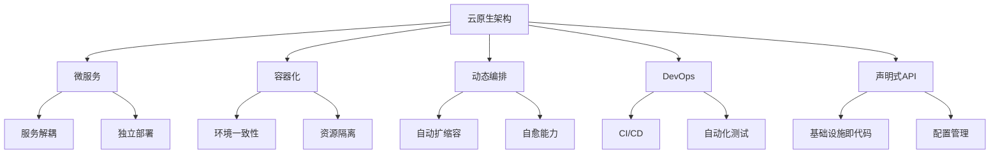
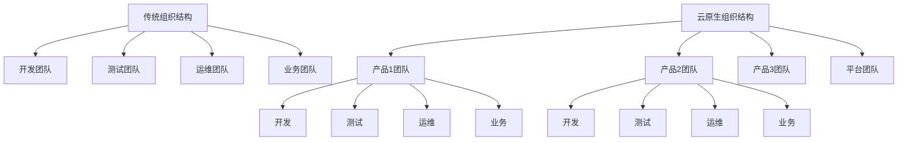

# 大型企业云原生转型

本文通过多个真实案例，详细分析大型企业云原生转型的策略、路径和成果，包括技术选型、组织变革、挑战应对和经验总结，为企业云原生转型提供参考。

## 云原生转型概述

云原生是一种构建和运行应用程序的方法，它充分利用云计算模型的优势。对于大型企业而言，云原生转型不仅是技术架构的变革，更是业务模式、组织结构和企业文化的全方位转变。

### 云原生的核心理念

云原生架构的核心理念包括：

1. **微服务架构**：将应用程序拆分为松耦合的小型服务，每个服务专注于完成特定功能
2. **容器化**：使用容器技术封装应用及其依赖，实现环境一致性和资源隔离
3. **动态编排**：通过自动化工具管理容器的部署、扩展和生命周期
4. **DevOps实践**：打破开发和运维之间的壁垒，实现持续集成和持续交付
5. **声明式API**：通过声明式配置定义系统行为，而非命令式指令



### 大型企业转型的必要性

大型企业面临着数字化转型的压力，云原生转型已成为必然选择，主要原因包括：

1. **业务敏捷性需求**：市场变化加速，企业需要更快地响应变化和创新
2. **技术债务积累**：传统系统维护成本高，难以适应新需求
3. **资源利用效率**：传统架构资源利用率低，成本高昂
4. **人才吸引力**：现代技术栈有助于吸引和保留顶尖技术人才
5. **竞争压力**：初创企业和数字原生企业带来的竞争压力

### 转型的挑战与风险

大型企业云原生转型面临的主要挑战包括：

1. **遗留系统复杂性**：大量复杂的遗留系统难以直接迁移
2. **组织惯性**：既有的组织结构和工作方式阻碍变革
3. **技能缺口**：云原生技术需要全新的技能集
4. **安全合规考量**：新架构带来新的安全挑战
5. **投资回报不确定性**：转型投入大，短期ROI难以量化

## 案例一：金融巨头的云原生之旅

### 背景与挑战

某全球金融服务巨头拥有超过150年的历史，管理着数万亿美元的资产。该企业面临以下挑战：

1. **系统老旧**：核心银行系统基于大型机，部分代码有30多年历史
2. **创新缓慢**：新功能上线周期长达6-9个月
3. **成本高昂**：IT运维成本占总预算的70%以上
4. **竞争压力**：金融科技公司带来的市场冲击
5. **监管要求**：严格的合规和安全要求

### 转型策略与路径

该金融机构采用了分阶段、渐进式的转型策略：

#### 第一阶段：基础设施现代化（18个月）

1. **私有云平台建设**：构建基于OpenStack的私有云平台
2. **容器平台部署**：引入Kubernetes作为容器编排平台
3. **DevOps工具链建设**：建立CI/CD流水线和自动化测试框架
4. **安全框架升级**：实施适应云环境的安全控制和监控

```yaml
# Kubernetes安全策略示例
apiVersion: policy/v1beta1
kind: PodSecurityPolicy
metadata:
  name: financial-restricted
spec:
  privileged: false
  allowPrivilegeEscalation: false
  requiredDropCapabilities:
    - ALL
  volumes:
    - 'configMap'
    - 'emptyDir'
    - 'projected'
    - 'secret'
    - 'downwardAPI'
    - 'persistentVolumeClaim'
  hostNetwork: false
  hostIPC: false
  hostPID: false
  runAsUser:
    rule: 'MustRunAsNonRoot'
  seLinux:
    rule: 'RunAsAny'
  supplementalGroups:
    rule: 'MustRunAs'
    ranges:
      - min: 1
        max: 65535
  fsGroup:
    rule: 'MustRunAs'
    ranges:
      - min: 1
        max: 65535
  readOnlyRootFilesystem: true
```

#### 第二阶段：应用现代化（24个月）

1. **应用评估与分类**：对现有应用进行评估，确定现代化路径
   - 保留并包装（Retain & Wrap）
   - 重构（Refactor）
   - 重写（Rewrite）
   - 替换（Replace）

2. **微服务转型**：将单体应用拆分为微服务
   - 领域驱动设计（DDD）指导服务边界划分
   - 构建服务网格实现服务间通信
   - 实施API网关管理服务访问

3. **数据架构转型**：
   - 引入事件驱动架构
   - 实施CQRS模式分离读写操作
   - 构建数据湖实现数据整合

```java
// 微服务示例：支付处理服务
@Service
public class PaymentProcessingService {
    
    private final TransactionRepository transactionRepository;
    private final EventPublisher eventPublisher;
    
    @Autowired
    public PaymentProcessingService(
            TransactionRepository transactionRepository,
            EventPublisher eventPublisher) {
        this.transactionRepository = transactionRepository;
        this.eventPublisher = eventPublisher;
    }
    
    @Transactional
    public PaymentResult processPayment(Payment payment) {
        // 验证支付信息
        validatePayment(payment);
        
        // 处理支付
        Transaction transaction = new Transaction();
        transaction.setAmount(payment.getAmount());
        transaction.setSourceAccount(payment.getSourceAccount());
        transaction.setTargetAccount(payment.getTargetAccount());
        transaction.setTimestamp(Instant.now());
        transaction.setStatus(TransactionStatus.PENDING);
        
        // 保存交易记录
        Transaction savedTransaction = transactionRepository.save(transaction);
        
        // 发布事件
        PaymentProcessedEvent event = new PaymentProcessedEvent(
                savedTransaction.getId(),
                savedTransaction.getAmount(),
                savedTransaction.getSourceAccount(),
                savedTransaction.getTargetAccount()
        );
        eventPublisher.publish("payment.processed", event);
        
        return new PaymentResult(savedTransaction.getId(), TransactionStatus.PENDING);
    }
    
    private void validatePayment(Payment payment) {
        // 支付验证逻辑
    }
}
```

#### 第三阶段：组织与文化转型（持续进行）

1. **组织结构调整**：
   - 从功能型组织转向产品型组织
   - 组建跨职能团队（开发、测试、运维、业务）
   - 建立平台团队支持业务团队

2. **人才培养与引进**：
   - 大规模云原生技术培训计划
   - 引入云原生领域专家
   - 建立内部技术社区

3. **工作方式变革**：
   - 采用敏捷开发方法
   - 实施DevOps实践
   - 建立内部开源文化



### 转型成果与经验

经过三年的转型，该金融机构取得了显著成果：

1. **业务敏捷性提升**：新功能上线周期从6-9个月缩短至2-4周
2. **运营成本降低**：IT运维成本降低30%
3. **系统可靠性提高**：系统可用性从99.9%提升至99.99%
4. **创新能力增强**：推出多项创新金融产品，吸引新客户

关键经验总结：

1. **高层支持至关重要**：CEO和董事会的全力支持是成功的关键
2. **安全合规先行**：将安全和合规要求融入转型的每个环节
3. **渐进式转型**：采用增量方式，而非大爆炸式转型
4. **人才是核心**：投资于人才培养和文化建设
5. **平台思维**：构建内部开发平台，降低云原生应用开发门槛

## 案例二：零售巨头的全渠道云原生转型

### 背景与挑战

某全球零售巨头拥有数千家实体店和大型电商平台，面临以下挑战：

1. **全渠道整合难题**：线上线下渠道割裂，客户体验不一致
2. **季节性流量波动**：节假日流量暴增，系统难以应对
3. **数据孤岛**：各系统数据分散，难以获得统一客户视图
4. **创新速度慢**：传统IT架构制约新功能快速上线
5. **成本压力**：电商竞争激烈，成本控制至关重要

### 转型策略与路径

该零售巨头采用了"云优先"策略，全面拥抱公有云：

#### 第一阶段：电商平台云原生重构（12个月）

1. **微服务架构设计**：
   - 将单体电商平台拆分为30多个微服务
   - 采用DDD方法定义服务边界
   - 实施API优先设计方法

2. **容器化与编排**：
   - 所有服务容器化部署
   - 使用AWS EKS作为Kubernetes管理服务
   - 实施基础设施即代码（IaC）

```terraform
# Terraform配置示例：电商平台基础设施
provider "aws" {
  region = "us-west-2"
}

module "vpc" {
  source = "terraform-aws-modules/vpc/aws"
  
  name = "retail-vpc"
  cidr = "10.0.0.0/16"
  
  azs             = ["us-west-2a", "us-west-2b", "us-west-2c"]
  private_subnets = ["10.0.1.0/24", "10.0.2.0/24", "10.0.3.0/24"]
  public_subnets  = ["10.0.101.0/24", "10.0.102.0/24", "10.0.103.0/24"]
  
  enable_nat_gateway = true
  single_nat_gateway = false
  
  tags = {
    Environment = "production"
    Project     = "retail-platform"
  }
}

module "eks" {
  source = "terraform-aws-modules/eks/aws"
  
  cluster_name    = "retail-eks-cluster"
  cluster_version = "1.21"
  
  vpc_id  = module.vpc.vpc_id
  subnets = module.vpc.private_subnets
  
  node_groups = {
    application = {
      desired_capacity = 3
      max_capacity     = 10
      min_capacity     = 3
      
      instance_types = ["m5.large"]
      k8s_labels = {
        Environment = "production"
        NodeType    = "application"
      }
    }
    
    batch = {
      desired_capacity = 2
      max_capacity     = 8
      min_capacity     = 2
      
      instance_types = ["c5.large"]
      k8s_labels = {
        Environment = "production"
        NodeType    = "batch"
      }
    }
  }
}
```

3. **自动扩缩容设计**：
   - 实施水平Pod自动扩缩容（HPA）
   - 配置集群自动扩缩容（CA）
   - 设计弹性数据库服务

```yaml
# Kubernetes HPA配置示例
apiVersion: autoscaling/v2beta2
kind: HorizontalPodAutoscaler
metadata:
  name: product-service
  namespace: retail
spec:
  scaleTargetRef:
    apiVersion: apps/v1
    kind: Deployment
    name: product-service
  minReplicas: 3
  maxReplicas: 50
  metrics:
  - type: Resource
    resource:
      name: cpu
      target:
        type: Utilization
        averageUtilization: 70
  - type: Resource
    resource:
      name: memory
      target:
        type: Utilization
        averageUtilization: 80
  behavior:
    scaleUp:
      stabilizationWindowSeconds: 60
      policies:
      - type: Percent
        value: 100
        periodSeconds: 15
    scaleDown:
      stabilizationWindowSeconds: 300
      policies:
      - type: Percent
        value: 10
        periodSeconds: 60
```

#### 第二阶段：全渠道整合（18个月）

1. **统一API层构建**：
   - 设计全渠道API网关
   - 实施GraphQL统一查询接口
   - 构建事件驱动架构连接各渠道

```graphql
# GraphQL Schema示例：统一产品和库存查询
type Product {
  id: ID!
  name: String!
  description: String
  price: Float!
  images: [String]
  categories: [Category]
  inventory: InventoryInfo
}

type Category {
  id: ID!
  name: String!
  products(first: Int, after: String): ProductConnection
}

type InventoryInfo {
  available: Int!
  stores: [StoreInventory]
}

type StoreInventory {
  storeId: ID!
  storeName: String!
  available: Int!
  reserved: Int
  estimatedRestockDate: String
}

type ProductConnection {
  edges: [ProductEdge]
  pageInfo: PageInfo!
}

type ProductEdge {
  node: Product!
  cursor: String!
}

type PageInfo {
  hasNextPage: Boolean!
  endCursor: String
}

type Query {
  product(id: ID!): Product
  products(
    category: ID, 
    search: String, 
    first: Int, 
    after: String
  ): ProductConnection
  
  store(id: ID!): Store
  stores(
    near: GeoCoordinates, 
    radius: Float, 
    first: Int, 
    after: String
  ): StoreConnection
}

input GeoCoordinates {
  latitude: Float!
  longitude: Float!
}
```

2. **数据平台构建**：
   - 实施实时数据流处理平台
   - 构建客户数据平台（CDP）
   - 部署机器学习推荐引擎

```python
# Apache Flink实时数据处理示例
from pyflink.datastream import StreamExecutionEnvironment
from pyflink.table import StreamTableEnvironment, EnvironmentSettings

# 创建流处理环境
env = StreamExecutionEnvironment.get_execution_environment()
env_settings = EnvironmentSettings.Builder().build()
table_env = StreamTableEnvironment.create(env, environment_settings=env_settings)

# 定义Kafka源
table_env.execute_sql("""
CREATE TABLE order_events (
    order_id STRING,
    user_id STRING,
    product_id STRING,
    quantity INT,
    price DECIMAL(10, 2),
    store_id STRING,
    channel STRING,
    event_time TIMESTAMP(3),
    WATERMARK FOR event_time AS event_time - INTERVAL '5' SECOND
) WITH (
    'connector' = 'kafka',
    'topic' = 'retail-orders',
    'properties.bootstrap.servers' = 'kafka:9092',
    'properties.group.id' = 'retail-analytics',
    'format' = 'json',
    'scan.startup.mode' = 'latest-offset'
)
""")

# 定义实时分析查询
table_env.execute_sql("""
CREATE TABLE sales_by_channel (
    window_start TIMESTAMP(3),
    window_end TIMESTAMP(3),
    channel STRING,
    total_sales DECIMAL(10, 2),
    order_count BIGINT
) WITH (
    'connector' = 'elasticsearch-7',
    'hosts' = 'http://elasticsearch:9200',
    'index' = 'retail-sales-by-channel'
)
""")

# 执行窗口聚合
table_env.execute_sql("""
INSERT INTO sales_by_channel
SELECT 
    TUMBLE_START(event_time, INTERVAL '1' MINUTE) AS window_start,
    TUMBLE_END(event_time, INTERVAL '1' MINUTE) AS window_end,
    channel,
    SUM(price * quantity) AS total_sales,
    COUNT(DISTINCT order_id) AS order_count
FROM order_events
GROUP BY TUMBLE(event_time, INTERVAL '1' MINUTE), channel
""")
```

3. **全渠道库存管理**：
   - 构建实时库存服务
   - 实施店内取货（BOPIS）系统
   - 开发全渠道订单管理系统

#### 第三阶段：智能零售体验（持续进行）

1. **个性化体验平台**：
   - 基于机器学习的实时推荐系统
   - 全渠道个性化营销自动化
   - 客户旅程编排平台

2. **智能门店技术**：
   - 基于IoT的智能货架系统
   - 计算机视觉商品识别
   - 移动支付和自助结账系统

3. **预测分析平台**：
   - 需求预测系统
   - 智能补货系统
   - 价格优化引擎

### 转型成果与经验

经过三年的云原生转型，该零售巨头取得了显著成果：

1. **全渠道销售增长**：线上线下融合销售增长25%
2. **系统弹性提升**：黑色星期五流量峰值轻松应对，零宕机
3. **运营效率提高**：库存周转率提升15%，减少库存积压
4. **创新速度加快**：新功能上线周期从月级缩短至天级
5. **成本优化**：IT运营成本降低40%，资源利用率提高

关键经验总结：

1. **客户体验驱动**：以客户体验为核心驱动转型
2. **数据价值释放**：打通数据孤岛，释放数据价值
3. **弹性优先设计**：为流量波动设计系统架构
4. **全面自动化**：从CI/CD到基础设施管理全面自动化
5. **混合团队模式**：业务和技术紧密协作的团队模式

## 案例三：制造业巨头的工业4.0云原生之路

### 背景与挑战

某全球制造业巨头拥有数十家工厂和复杂的供应链网络，面临以下挑战：

1. **数字化转型压力**：工业4.0浪潮下的转型需求
2. **生产效率瓶颈**：传统生产系统效率提升空间有限
3. **供应链复杂性**：全球供应链管理复杂且缺乏可见性
4. **设备互联互通**：大量异构设备和系统难以集成
5. **数据价值未释放**：海量生产数据未被充分利用

### 转型策略与路径

该制造业巨头采用了"边缘+云"的混合架构策略：

#### 第一阶段：工业物联网平台构建（18个月）

1. **边缘计算基础设施**：
   - 在工厂部署边缘计算节点
   - 实施工业协议网关
   - 构建边缘Kubernetes集群

```yaml
# 边缘Kubernetes配置示例
apiVersion: apps/v1
kind: DaemonSet
metadata:
  name: edge-agent
  namespace: manufacturing
spec:
  selector:
    matchLabels:
      app: edge-agent
  template:
    metadata:
      labels:
        app: edge-agent
    spec:
      containers:
      - name: edge-agent
        image: manufacturing/edge-agent:v1.2
        resources:
          limits:
            cpu: 500m
            memory: 512Mi
          requests:
            cpu: 200m
            memory: 256Mi
        volumeMounts:
        - name: device-data
          mountPath: /var/run/manufacturing
        securityContext:
          privileged: true
        env:
        - name: NODE_ID
          valueFrom:
            fieldRef:
              fieldPath: spec.nodeName
        - name: FACTORY_ID
          value: "$(FACTORY_ID)"
      volumes:
      - name: device-data
        hostPath:
          path: /var/run/manufacturing
```

2. **设备连接与数据采集**：
   - 开发设备连接适配器
   - 实施时序数据库存储
   - 构建数据预处理管道

```python
# 工业设备数据采集示例
import time
import pymodbus
from pymodbus.client.sync import ModbusTcpClient
from influxdb import InfluxDBClient

# 连接Modbus设备
modbus_client = ModbusTcpClient('192.168.1.100', port=502)
modbus_client.connect()

# 连接InfluxDB
influx_client = InfluxDBClient('influxdb.manufacturing', 8086, 'admin', 'password', 'production_metrics')

# 数据采集循环
try:
    while True:
        # 读取设备数据
        response = modbus_client.read_holding_registers(0, 10, unit=1)
        
        if not response.isError():
            # 提取关键指标
            temperature = response.registers[0] / 10.0
            pressure = response.registers[1]
            speed = response.registers[2]
            status_code = response.registers[3]
            
            # 准备数据点
            data_point = [
                {
                    "measurement": "machine_metrics",
                    "tags": {
                        "machine_id": "press_01",
                        "factory": "shanghai_plant",
                        "line": "assembly_a"
                    },
                    "time": time.time_ns(),
                    "fields": {
                        "temperature": temperature,
                        "pressure": pressure,
                        "speed": speed,
                        "status_code": status_code
                    }
                }
            ]
            
            # 写入InfluxDB
            influx_client.write_points(data_point)
            
        time.sleep(1)
except KeyboardInterrupt:
    pass
finally:
    modbus_client.close()
```

3. **云端IoT平台**：
   - 部署云原生IoT核心服务
   - 实施设备管理和配置系统
   - 构建实时监控和告警平台

#### 第二阶段：智能制造应用开发（24个月）

1. **生产优化应用**：
   - 开发预测性维护系统
   - 实施质量控制分析平台
   - 构建生产调度优化系统

```python
# 预测性维护机器学习模型示例
import pandas as pd
import numpy as np
from sklearn.ensemble import RandomForestClassifier
from sklearn.model_selection import train_test_split
from sklearn.metrics import classification_report

# 加载历史设备数据
data = pd.read_csv('machine_history.csv')

# 特征工程
features = ['temperature', 'pressure', 'vibration', 'noise', 'runtime_hours', 
            'maintenance_count', 'age_months']
X = data[features]
y = data['failure_within_24h']  # 目标变量：24小时内是否发生故障

# 分割训练集和测试集
X_train, X_test, y_train, y_test = train_test_split(X, y, test_size=0.2, random_state=42)

# 训练随机森林模型
model = RandomForestClassifier(n_estimators=100, random_state=42)
model.fit(X_train, y_train)

# 评估模型
y_pred = model.predict(X_test)
print(classification_report(y_test, y_pred))

# 特征重要性
feature_importance = pd.DataFrame({
    'feature': features,
    'importance': model.feature_importances_
}).sort_values('importance', ascending=False)

print("Feature Importance:")
print(feature_importance)

# 保存模型
import joblib
joblib.dump(model, 'predictive_maintenance_model.pkl')
```

2. **供应链可视化平台**：
   - 开发端到端供应链追踪系统
   - 实施库存优化平台
   - 构建供应商协作门户

3. **数字孪生系统**：
   - 构建工厂数字孪生平台
   - 开发生产线模拟系统
   - 实施产品生命周期管理集成

#### 第三阶段：AI驱动的智能决策（持续进行）

1. **高级分析平台**：
   - 部署机器学习模型训练平台
   - 实施AI模型部署和监控系统
   - 构建自动化决策支持系统

2. **自主工厂系统**：
   - 开发自适应生产控制系统
   - 实施机器人流程自动化
   - 构建自主物流系统

3. **知识图谱与专家系统**：
   - 构建制造领域知识图谱
   - 开发专家系统捕获经验知识
   - 实施智能辅助决策系统

### 转型成果与经验

经过四年的云原生转型，该制造业巨头取得了显著成果：

1. **生产效率提升**：整体设备效率(OEE)提高18%
2. **维护成本降低**：预测性维护减少计划外停机时间30%
3. **供应链优化**：库存水平降低25%，同时提高交付准时率
4. **质量改进**：产品缺陷率降低40%
5. **能源效率**：工厂能耗降低15%

关键经验总结：

1. **边缘计算至关重要**：在制造环境中，边缘计算与云计算同等重要
2. **数据质量是基础**：确保数据质量是AI和高级分析的前提
3. **人机协作**：技术应增强而非替代工人能力
4. **标准化先行**：数据和接口标准化是成功的关键
5. **渐进式转型**：从小规模试点开始，逐步扩展

## 案例四：医疗机构的云原生数字化转型

### 背景与挑战

某大型医疗机构网络拥有数十家医院和数百家诊所，面临以下挑战：

1. **系统割裂**：多个独立系统难以集成，医疗数据分散
2. **患者体验不佳**：预约、就诊、随访等流程繁琐
3
让我继续完成大型企业云原生转型的内容：

## 案例四：医疗机构的云原生数字化转型

### 背景与挑战

某大型医疗机构网络拥有数十家医院和数百家诊所，面临以下挑战：

1. **系统割裂**：多个独立系统难以集成，医疗数据分散
2. **患者体验不佳**：预约、就诊、随访等流程繁琐
3. **医疗质量差异**：不同机构间医疗质量和流程标准化程度低
4. **成本压力**：医疗成本持续上升，IT系统维护成本高
5. **合规要求**：严格的医疗数据隐私和安全法规要求

### 转型策略与路径

该医疗机构采用了"患者为中心"的云原生转型策略：

#### 第一阶段：医疗数据平台构建（18个月）

1. **统一数据模型设计**：
   - 构建FHIR（Fast Healthcare Interoperability Resources）标准数据模型
   - 实施医疗术语标准化（SNOMED CT、LOINC、ICD-10）
   - 设计患者360度视图数据架构

```json
// FHIR患者资源示例
{
  "resourceType": "Patient",
  "id": "patient-12345",
  "meta": {
    "versionId": "1",
    "lastUpdated": "2023-05-15T09:30:00Z"
  },
  "identifier": [
    {
      "use": "official",
      "system": "http://hospital.example.org/identifiers/patients",
      "value": "12345"
    },
    {
      "use": "secondary",
      "system": "http://national-id.example.org/identifiers",
      "value": "987654321X"
    }
  ],
  "active": true,
  "name": [
    {
      "use": "official",
      "family": "张",
      "given": ["伟"]
    }
  ],
  "telecom": [
    {
      "system": "phone",
      "value": "+86 13812345678",
      "use": "mobile"
    },
    {
      "system": "email",
      "value": "zhang.wei@example.com"
    }
  ],
  "gender": "male",
  "birthDate": "1980-07-22",
  "address": [
    {
      "use": "home",
      "line": ["南京路123号"],
      "city": "上海",
      "postalCode": "200001",
      "country": "中国"
    }
  ],
  "contact": [
    {
      "relationship": [
        {
          "coding": [
            {
              "system": "http://terminology.hl7.org/CodeSystem/v2-0131",
              "code": "C",
              "display": "Emergency Contact"
            }
          ]
        }
      ],
      "name": {
        "family": "李",
        "given": ["娜"]
      },
      "telecom": [
        {
          "system": "phone",
          "value": "+86 13987654321"
        }
      ]
    }
  ]
}
```

2. **数据集成平台**：
   - 构建基于API的集成架构
   - 实施事件驱动的数据同步
   - 开发遗留系统适配器

```yaml
# 医疗数据集成流水线配置
apiVersion: camel.apache.org/v1
kind: Integration
metadata:
  name: ehr-integration
  namespace: healthcare
spec:
  flows:
    - from:
        uri: "timer:ehr-sync"
        parameters:
          period: "300000" # 5分钟同步一次
        steps:
          - log:
              message: "开始EHR数据同步"
          - to: "direct:fetch-legacy-data"
    
    - from:
        uri: "direct:fetch-legacy-data"
        steps:
          - setHeader:
              name: "Authorization"
              simple: "Bearer {{ehr.api.token}}"
          - setHeader:
              name: "Content-Type"
              constant: "application/json"
          - to: "http://legacy-ehr-system/api/patients?updatedSince=${header.lastSyncTime}"
          - unmarshal:
              json: {}
          - split:
              jsonpath: "$.patients"
              steps:
                - to: "direct:transform-patient"
    
    - from:
        uri: "direct:transform-patient"
        steps:
          - bean:
              ref: "patientTransformer"
              method: "toFhir"
          - marshal:
              json: {}
          - to: "http://fhir-server/fhir/Patient"
          - choice:
              when:
                - simple: "${header.CamelHttpResponseCode} == 200 || ${header.CamelHttpResponseCode} == 201"
                  steps:
                    - log:
                        message: "成功同步患者数据: ${body.id}"
              otherwise:
                steps:
                  - log:
                      message: "同步患者数据失败: ${body}"
                      loggingLevel: ERROR
                  - to: "kafka:healthcare.sync.errors"
```

3. **安全与合规框架**：
   - 实施细粒度访问控制
   - 构建数据加密和脱敏系统
   - 开发审计和合规报告平台

```java
// 医疗数据访问控制服务
@Service
public class MedicalDataAccessService {
    
    private final AccessPolicyRepository policyRepository;
    private final AuditLogService auditLogService;
    
    @Autowired
    public MedicalDataAccessService(
            AccessPolicyRepository policyRepository,
            AuditLogService auditLogService) {
        this.policyRepository = policyRepository;
        this.auditLogService = auditLogService;
    }
    
    public Optional<PatientData> getPatientData(
            String patientId, 
            String requesterId, 
            String requesterRole,
            String purpose) {
        
        // 检查访问权限
        boolean hasAccess = checkAccess(patientId, requesterId, requesterRole, purpose);
        
        // 记录访问审计
        auditLogService.logAccess(
            new AccessAuditEvent(
                UUID.randomUUID().toString(),
                requesterId,
                requesterRole,
                "READ",
                "PatientData",
                patientId,
                purpose,
                hasAccess,
                Instant.now()
            )
        );
        
        if (!hasAccess) {
            return Optional.empty();
        }
        
        // 获取患者数据
        PatientData data = patientDataRepository.findById(patientId)
            .orElseThrow(() -> new EntityNotFoundException("Patient data not found"));
        
        // 根据角色和目的进行数据脱敏
        PatientData redactedData = applyDataRedaction(data, requesterRole, purpose);
        
        return Optional.of(redactedData);
    }
    
    private boolean checkAccess(
            String patientId, 
            String requesterId, 
            String requesterRole,
            String purpose) {
        
        // 检查是否是患者本人
        if (requesterId.equals(patientId)) {
            return true;
        }
        
        // 检查治疗关系
        boolean hasTreatmentRelationship = 
            treatmentRelationshipService.checkRelationship(patientId, requesterId);
        
        // 获取适用的访问策略
        List<AccessPolicy> policies = policyRepository.findByRoleAndPurpose(requesterRole, purpose);
        
        // 应用访问策略规则
        return policies.stream()
            .anyMatch(policy -> 
                policy.isApplicable(patientId, requesterId, hasTreatmentRelationship));
    }
    
    private PatientData applyDataRedaction(
            PatientData data, 
            String requesterRole, 
            String purpose) {
        
        // 根据角色和目的应用不同的数据脱敏规则
        RedactionPolicy redactionPolicy = 
            redactionPolicyService.getPolicy(requesterRole, purpose);
        
        return redactionPolicy.apply(data);
    }
}
```

#### 第二阶段：患者体验平台开发（12个月）

1. **全渠道患者门户**：
   - 开发移动应用和网页门户
   - 实施预约和远程医疗系统
   - 构建患者健康记录访问平台

2. **医疗服务编排**：
   - 设计患者旅程编排系统
   - 实施临床路径自动化
   - 开发医患沟通平台

```typescript
// 患者旅程编排服务
import { Injectable } from '@angular/core';
import { HttpClient } from '@angular/common/http';
import { Observable, of, throwError } from 'rxjs';
import { catchError, map, switchMap } from 'rxjs/operators';

@Injectable({
  providedIn: 'root'
})
export class PatientJourneyService {
  
  constructor(private http: HttpClient) {}
  
  // 创建新的患者旅程
  createJourney(patientId: string, condition: string): Observable<Journey> {
    return this.http.post<Journey>('/api/journeys', {
      patientId,
      condition,
      startDate: new Date().toISOString()
    }).pipe(
      catchError(error => {
        console.error('创建患者旅程失败', error);
        return throwError('无法创建患者旅程，请稍后再试');
      })
    );
  }
  
  // 获取推荐的临床路径
  getRecommendedPathway(journeyId: string): Observable<ClinicalPathway> {
    return this.http.get<ClinicalPathway>(`/api/journeys/${journeyId}/recommended-pathway`)
      .pipe(
        catchError(error => {
          console.error('获取推荐临床路径失败', error);
          return throwError('无法获取推荐临床路径');
        })
      );
  }
  
  // 安排下一步
  scheduleNextStep(journeyId: string, stepId: string): Observable<Appointment> {
    return this.http.post<Appointment>(`/api/journeys/${journeyId}/steps/${stepId}/schedule`, {})
      .pipe(
        catchError(error => {
          console.error('安排下一步失败', error);
          return throwError('无法安排下一步，请稍后再试');
        })
      );
  }
  
  // 完成步骤并获取下一步
  completeStep(journeyId: string, stepId: string, outcome: any): Observable<JourneyStep> {
    return this.http.post(`/api/journeys/${journeyId}/steps/${stepId}/complete`, { outcome })
      .pipe(
        switchMap(() => this.getNextStep(journeyId)),
        catchError(error => {
          console.error('完成步骤失败', error);
          return throwError('无法完成当前步骤，请稍后再试');
        })
      );
  }
  
  // 获取下一步
  getNextStep(journeyId: string): Observable<JourneyStep> {
    return this.http.get<JourneyStep>(`/api/journeys/${journeyId}/next-step`)
      .pipe(
        catchError(error => {
          console.error('获取下一步失败', error);
          return throwError('无法获取下一步');
        })
      );
  }
  
  // 获取患者旅程概览
  getJourneyOverview(journeyId: string): Observable<JourneyOverview> {
    return this.http.get<JourneyOverview>(`/api/journeys/${journeyId}/overview`)
      .pipe(
        catchError(error => {
          console.error('获取旅程概览失败', error);
          return throwError('无法获取旅程概览');
        })
      );
  }
}

// 数据模型
interface Journey {
  id: string;
  patientId: string;
  condition: string;
  startDate: string;
  status: 'active' | 'completed' | 'cancelled';
  currentStepId?: string;
}

interface JourneyStep {
  id: string;
  journeyId: string;
  type: 'appointment' | 'test' | 'procedure' | 'medication' | 'education';
  name: string;
  description: string;
  status: 'pending' | 'scheduled' | 'completed' | 'skipped';
  scheduledDate?: string;
  completedDate?: string;
  outcome?: any;
  nextStepIds?: string[];
}

interface ClinicalPathway {
  id: string;
  name: string;
  condition: string;
  steps: JourneyStep[];
  decisionPoints: DecisionPoint[];
}

interface DecisionPoint {
  id: string;
  stepId: string;
  condition: string;
  nextStepId: string;
}

interface Appointment {
  id: string;
  journeyStepId: string;
  providerId: string;
  providerName: string;
  date: string;
  location: string;
  status: 'scheduled' | 'completed' | 'cancelled';
}

interface JourneyOverview {
  journey: Journey;
  completedSteps: JourneyStep[];
  currentStep?: JourneyStep;
  upcomingSteps: JourneyStep[];
  progress: number;
}
```

3. **健康管理平台**：
   - 开发慢性病管理应用
   - 实施健康数据集成（可穿戴设备、家庭监测）
   - 构建个性化健康建议系统

#### 第三阶段：智能医疗平台（持续进行）

1. **临床决策支持系统**：
   - 开发基于证据的治疗建议系统
   - 实施药物相互作用检查
   - 构建风险预测模型

```python
# 临床决策支持系统 - 糖尿病风险预测模型
import pandas as pd
import numpy as np
from sklearn.ensemble import GradientBoostingClassifier
from sklearn.model_selection import train_test_split, GridSearchCV
from sklearn.metrics import roc_auc_score, confusion_matrix, classification_report
from sklearn.preprocessing import StandardScaler
import joblib

# 加载糖尿病数据集
data = pd.read_csv('diabetes_dataset.csv')

# 特征工程
features = ['age', 'gender', 'bmi', 'blood_pressure', 'fasting_glucose', 
            'hba1c', 'family_history', 'physical_activity', 'smoking_status']
X = data[features]
y = data['diabetes_diagnosis']  # 目标变量：是否诊断为糖尿病

# 处理分类特征
X = pd.get_dummies(X, columns=['gender', 'family_history', 'smoking_status'])

# 分割训练集和测试集
X_train, X_test, y_train, y_test = train_test_split(X, y, test_size=0.2, random_state=42)

# 特征标准化
scaler = StandardScaler()
X_train_scaled = scaler.fit_transform(X_train)
X_test_scaled = scaler.transform(X_test)

# 定义参数网格
param_grid = {
    'n_estimators': [100, 200, 300],
    'learning_rate': [0.01, 0.05, 0.1],
    'max_depth': [3, 4, 5],
    'min_samples_split': [2, 5, 10],
    'subsample': [0.8, 0.9, 1.0]
}

# 网格搜索最佳参数
grid_search = GridSearchCV(
    GradientBoostingClassifier(random_state=42),
    param_grid=param_grid,
    cv=5,
    scoring='roc_auc',
    n_jobs=-1
)

grid_search.fit(X_train_scaled, y_train)
print(f"最佳参数: {grid_search.best_params_}")

# 使用最佳参数训练模型
best_model = grid_search.best_estimator_
best_model.fit(X_train_scaled, y_train)

# 评估模型
y_pred_proba = best_model.predict_proba(X_test_scaled)[:, 1]
y_pred = best_model.predict(X_test_scaled)

print(f"ROC AUC: {roc_auc_score(y_test, y_pred_proba)}")
print(f"混淆矩阵:\n{confusion_matrix(y_test, y_pred)}")
print(f"分类报告:\n{classification_report(y_test, y_pred)}")

# 特征重要性
feature_importance = pd.DataFrame({
    'feature': X.columns,
    'importance': best_model.feature_importances_
}).sort_values('importance', ascending=False)

print("特征重要性:")
print(feature_importance.head(10))

# 保存模型和预处理器
joblib.dump(best_model, 'diabetes_risk_model.pkl')
joblib.dump(scaler, 'diabetes_risk_scaler.pkl')
```

2. **医学影像AI平台**：
   - 开发医学影像分析系统
   - 实施放射科工作流优化
   - 构建多模态医学影像融合平台

3. **人口健康管理**：
   - 开发人口健康分析平台
   - 实施风险分层和干预系统
   - 构建社区健康管理平台

### 转型成果与经验

经过三年的云原生转型，该医疗机构网络取得了显著成果：

1. **患者体验提升**：患者满意度提高35%
2. **医疗质量改善**：可预防并发症减少25%
3. **运营效率提高**：医生文档工作时间减少40%
4. **成本优化**：每位患者的总体医疗成本降低15%
5. **数据驱动决策**：基于数据的临床决策提高30%

关键经验总结：

1. **患者为中心**：以患者体验为核心驱动转型
2. **隐私与安全优先**：将隐私保护和安全融入设计的每个环节
3. **临床参与至关重要**：确保医生和护士全程参与转型过程
4. **渐进式转型**：从小规模试点开始，逐步扩展
5. **标准化与互操作性**：采用医疗行业标准确保系统互操作性

## 云原生转型的关键成功因素

通过分析上述案例，我们可以总结出大型企业云原生转型的关键成功因素：

### 1. 领导力与战略

成功的云原生转型需要强有力的领导支持和清晰的战略：

- **高层承诺**：CEO和高管团队的全力支持
- **明确愿景**：清晰的转型愿景和目标
- **战略路线图**：分阶段的转型计划
- **资源投入**：充足的资金和人力资源支持
- **变革管理**：有效的组织变革管理

### 2. 技术架构与实践

适当的技术选择和实践对转型成功至关重要：

- **微服务架构**：合理的服务拆分和边界定义
- **容器化标准**：统一的容器化标准和最佳实践
- **云平台选择**：适合业务需求的云平台（公有云、私有云或混合云）
- **DevOps实践**：自动化的CI/CD流水线和测试
- **可观测性**：全面的监控、日志和追踪系统

### 3. 组织与文化

组织结构和文化变革是云原生转型的核心：

- **跨职能团队**：打破传统部门壁垒，组建产品导向的跨职能团队
- **DevOps文化**：培养开发和运维协作的文化
- **持续学习**：建立学习型组织，鼓励实验和创新
- **授权决策**：下放决策权，赋能团队自主决策
- **绩效指标调整**：调整KPI以支持云原生实践

### 4. 人才与技能

人才是云原生转型的关键资源：

- **技能培养**：系统性的云原生技术培训
- **人才引进**：引入云原生领域专家
- **知识共享**：建立内部知识共享平台
- **社区参与**：鼓励参与开源社区和技术会议
- **职业发展路径**：为技术人员提供清晰的职业发展路径

### 5. 渐进式转型

大型企业应采用渐进式而非大爆炸式的转型：

- **试点项目**：从小规模、低风险项目开始
- **快速迭代**：采用敏捷方法，快速迭代和学习
- **价值驱动**：优先转型能带来明显业务价值的领域
- **持续评估**：定期评估转型进展和成效
- **调整策略**：根据反馈和经验调整转型策略

## 云原生转型常见陷阱与规避策略

### 1. 技术驱动而非业务驱动

**陷阱**：过于关注技术而忽视业务需求和价值。

**规避策略**：
- 明确每个转型项目的业务目标和价值
- 建立业务和技术团队的紧密协作
- 使用价值流映射识别真正的业务痛点
- 建立业务导向的成功指标

### 2. 忽视组织和文化变革

**陷阱**：仅关注技术变革，忽视必要的组织结构和文化变革。

**规避策略**：
- 将组织变革作为转型计划的核心部分
- 投入资源进行变革管理和文化建设
- 识别和应对组织阻力
- 培养和奖励新的工作方式

### 3. 安全与合规滞后

**陷阱**：安全和合规考虑滞后于技术实施。

**规避策略**：
- 将安全和合规要求融入设计阶段
- 采用"安全即代码"和"合规即代码"方法
- 建立自动化的安全测试和合规检查
- 与安全和合规团队紧密协作

### 4. 技能缺口与人才流失

**陷阱**：低估所需技能转变，导致人才缺口或流失。

**规避策略**：
- 提前评估技能需求和差距
- 制定全面的培训和技能发展计划
- 创造有吸引力的工作环境留住人才
- 考虑外部合作伙伴和咨询支持

### 5. 遗留系统整合不足

**陷阱**：忽视或低估与遗留系统整合的复杂性。

**规避策略**：
- 制定明确的遗留系统现代化策略
- 构建有效的系统集成层
- 采用渐进式迁移而非一次性替换
- 确保数据一致性和完整性

## 未来展望：云原生的演进趋势

随着技术和实践的不断发展，云原生领域正在经历新的演进：

### 1. 多云与混合云战略

企业越来越倾向于采用多云或混合云策略，以避免供应商锁定并优化成本和性能：

- **云中立架构**：设计不依赖特定云服务提供商的架构
- **多云管理平台**：统一管理多个云环境的工具和平台
- **一致性抽象层**：提供跨云一致性体验的抽象层

### 2. 无服务器架构与事件驱动

无服务器计算和事件驱动架构正成为云原生的重要组成部分：

- **函数即服务(FaaS)**：进一步细化的计算单元
- **事件网格**：复杂事件处理和路由系统
- **无服务器数据库**：按需扩展的数据存储服务

### 3. 服务网格与API管理

服务网格和API管理正在成为微服务架构的关键基础设施：

- **服务网格标准化**：服务网格技术的标准化和简化
- **多集群服务网格**：跨集群和多云的服务网格
- **API优先设计**：以API为中心的系统设计方法

### 4. AI驱动的云原生运维

人工智能正在改变云原生系统的运维方式：

- **AIOps**：AI驱动的运维自动化
- **自愈系统**：能够自动检测和修复问题的系统
- **预测性扩缩容**：基于预测而非反应的资源扩缩容

### 5. 可持续云计算

环境可持续性正成为云原生设计的重要考量：

- **能源效率优化**：优化代码和架构以减少能源消耗
- **碳足迹监控**：监控和报告云服务的碳排放
- **绿色算法**：设计环保的算法和计算模式

## 结论

大型企业的云原生转型是一个复杂而全面的变革过程，涉及技术、组织、文化和业务模式的多方面变革。通过本文分析的真实案例，我们可以看到，成功的云原生转型能够为企业带来显著的业务价值，包括提高敏捷性、降低成本、提升创新能力和改善客户体验。

然而，云原生转型并非一蹴而就，而是一个持续的旅程。企业需要制定清晰的战略、投入足够的资源、培养必要的技能、调整组织结构和文化，并采用渐进式的方法来实现转型目标。

随着技术的不断发展和实践的不断成熟，云原生领域将继续演进，为企业数字化转型提供更多可能性。大型企业需要保持开放的心态，持续学习和适应，才能在云原生时代保持竞争力和创新能力。