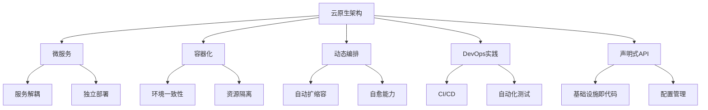
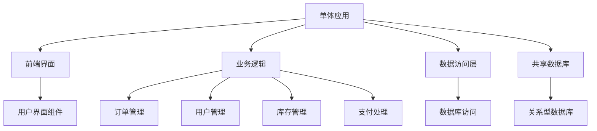
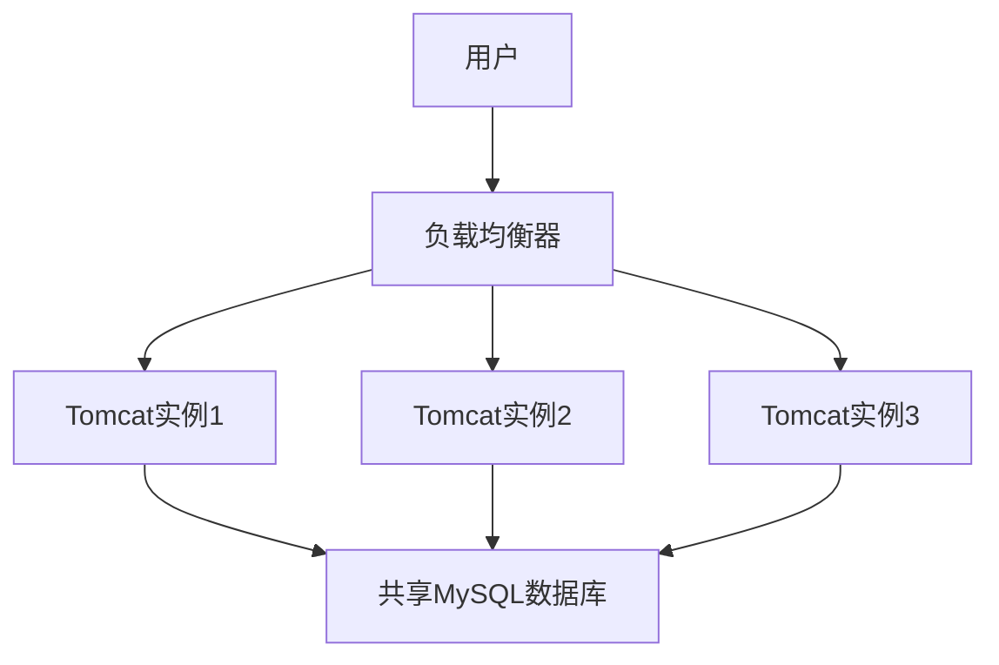
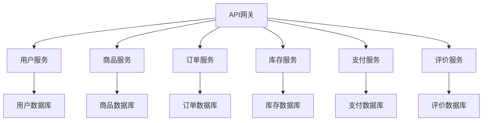
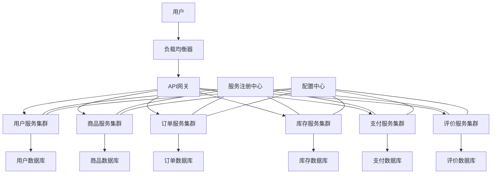
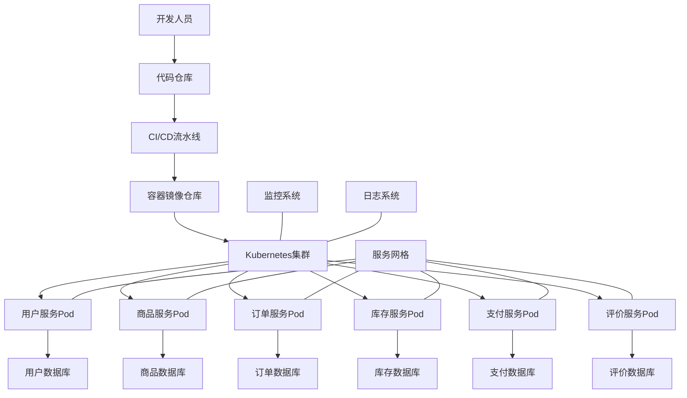

# 云原生架构演进历程

本文通过实际案例，详细介绍云原生架构的演进历程，从单体应用到微服务，再到云原生架构的转变过程，分析每个阶段的技术选择、架构变化和经验教训。

## 云原生架构概述

云原生架构是一种设计、构建和运行应用程序的方法，它充分利用云计算模型的优势。云原生应用程序从一开始就被设计为在云环境中运行，而不是传统的本地数据中心。这种架构方法使组织能够更快地构建和运行可扩展的应用程序，同时降低运营复杂性。

### 云原生的核心理念

云原生架构基于以下核心理念：

1. **微服务**：将应用程序拆分为小型、松耦合的服务，每个服务专注于完成特定功能
2. **容器化**：使用容器技术封装应用及其依赖，确保环境一致性和资源隔离
3. **动态编排**：通过自动化工具管理容器的部署、扩展和生命周期
4. **DevOps实践**：打破开发和运维之间的壁垒，实现持续集成和持续交付
5. **声明式API**：通过声明式配置定义系统行为，而非命令式指令



### 云原生的优势

云原生架构为企业带来了诸多优势：

1. **敏捷性**：快速开发、测试和部署新功能
2. **弹性**：系统能够自动扩展以应对负载变化
3. **可靠性**：通过自愈能力提高系统可用性
4. **可观测性**：全面的监控和日志记录
5. **成本效益**：按需使用资源，优化成本
6. **可移植性**：应用可以在不同云环境中运行

## 第一阶段：单体应用时代

在云原生架构演进的起点，大多数企业都采用单体应用架构。这种架构将所有功能模块打包在一个应用程序中，共享同一个数据库和资源。

### 单体架构的特点

单体应用架构具有以下特点：

1. **整体性**：所有功能模块在一个代码库中开发和部署
2. **共享资源**：所有模块共享同一个数据库和运行时环境
3. **简单性**：开发和部署流程相对简单
4. **紧耦合**：模块之间紧密耦合，相互依赖



### 案例分析：电子商务平台的单体架构

某电子商务公司最初采用单体架构构建其平台。该平台包含以下主要功能模块：

1. 用户管理（注册、登录、个人信息）
2. 商品管理（商品列表、详情、搜索）
3. 订单管理（购物车、下单、支付）
4. 库存管理（库存更新、预警）
5. 评价系统（用户评价、评分）

#### 技术栈选择

该电商平台的单体架构采用以下技术栈：

- **前端**：jQuery + Bootstrap
- **后端**：Spring MVC + Hibernate
- **数据库**：MySQL
- **服务器**：Tomcat
- **部署方式**：WAR包部署

```java
// 单体应用中的订单服务示例
@Service
public class OrderServiceImpl implements OrderService {
    
    @Autowired
    private OrderRepository orderRepository;
    
    @Autowired
    private ProductRepository productRepository;
    
    @Autowired
    private InventoryRepository inventoryRepository;
    
    @Autowired
    private PaymentService paymentService;
    
    @Autowired
    private NotificationService notificationService;
    
    @Transactional
    public Order createOrder(OrderRequest request) {
        // 验证商品是否存在
        Product product = productRepository.findById(request.getProductId())
            .orElseThrow(() -> new ProductNotFoundException("Product not found"));
        
        // 检查库存
        Inventory inventory = inventoryRepository.findByProductId(request.getProductId())
            .orElseThrow(() -> new InventoryNotFoundException("Inventory not found"));
        
        if (inventory.getQuantity() < request.getQuantity()) {
            throw new InsufficientInventoryException("Insufficient inventory");
        }
        
        // 创建订单
        Order order = new Order();
        order.setUserId(request.getUserId());
        order.setProductId(request.getProductId());
        order.setQuantity(request.getQuantity());
        order.setAmount(product.getPrice() * request.getQuantity());
        order.setStatus(OrderStatus.CREATED);
        order.setCreatedAt(new Date());
        
        Order savedOrder = orderRepository.save(order);
        
        // 更新库存
        inventory.setQuantity(inventory.getQuantity() - request.getQuantity());
        inventoryRepository.save(inventory);
        
        // 处理支付
        PaymentResult paymentResult = paymentService.processPayment(
            new PaymentRequest(savedOrder.getId(), savedOrder.getAmount()));
        
        if (paymentResult.isSuccess()) {
            savedOrder.setStatus(OrderStatus.PAID);
            savedOrder = orderRepository.save(savedOrder);
            
            // 发送通知
            notificationService.sendOrderConfirmation(savedOrder);
        } else {
            savedOrder.setStatus(OrderStatus.PAYMENT_FAILED);
            savedOrder = orderRepository.save(savedOrder);
        }
        
        return savedOrder;
    }
    
    // 其他订单相关方法...
}
```

#### 部署架构

单体应用的部署架构相对简单：

1. 开发人员将代码提交到版本控制系统
2. 构建服务器编译代码并打包成WAR文件
3. 运维人员将WAR文件部署到Tomcat服务器
4. 使用负载均衡器将流量分发到多个Tomcat实例
5. 所有实例共享同一个数据库



### 单体架构面临的挑战

随着业务的增长，单体架构开始面临以下挑战：

1. **扩展性问题**：整个应用必须作为一个整体进行扩展，无法针对高负载模块单独扩展
2. **开发效率下降**：随着代码库的增长，开发和测试变得越来越困难
3. **技术栈限制**：所有模块必须使用相同的技术栈，无法针对特定需求选择最合适的技术
4. **部署风险增加**：任何小改动都需要重新部署整个应用，增加了部署风险
5. **团队协作困难**：多个团队在同一代码库上工作，容易产生冲突

## 第二阶段：向微服务架构过渡

面对单体架构的局限性，该电商平台开始向微服务架构过渡。这一阶段的主要目标是将单体应用拆分为独立的服务，每个服务负责特定的业务功能。

### 微服务架构的特点

微服务架构具有以下特点：

1. **服务独立**：每个服务可以独立开发、部署和扩展
2. **领域驱动**：服务边界基于业务领域划分
3. **去中心化**：服务之间通过API通信，没有中心化的控制
4. **技术多样性**：不同服务可以使用不同的技术栈
5. **数据隔离**：每个服务管理自己的数据存储



### 服务拆分策略

该电商平台采用以下策略进行服务拆分：

1. **领域驱动设计(DDD)**：基于业务领域边界进行服务划分
2. **渐进式拆分**：从边缘服务开始，逐步向核心服务拆分
3. **数据库拆分**：将共享数据库拆分为服务专用数据库
4. **接口设计**：定义清晰的服务接口和契约

#### 服务拆分过程

1. **第一阶段**：拆分相对独立的服务
   - 评价服务：用户评价和评分功能
   - 支付服务：支付处理和集成第三方支付

2. **第二阶段**：拆分核心业务服务
   - 用户服务：用户注册、认证和个人信息管理
   - 商品服务：商品目录、搜索和详情
   - 订单服务：订单创建和管理
   - 库存服务：库存管理和更新

### 技术架构演进

随着向微服务架构的过渡，技术架构也发生了显著变化：

#### 服务开发框架

- **用户服务**：Spring Boot + Spring Data JPA
- **商品服务**：Spring Boot + Elasticsearch
- **订单服务**：Spring Boot + MyBatis
- **库存服务**：Spring Boot + Redis
- **支付服务**：Spring Boot + Spring Integration
- **评价服务**：Node.js + MongoDB

```java
// 微服务架构中的订单服务示例
@Service
public class OrderServiceImpl implements OrderService {
    
    private final OrderRepository orderRepository;
    private final ProductClient productClient;
    private final InventoryClient inventoryClient;
    private final PaymentClient paymentClient;
    private final NotificationClient notificationClient;
    
    @Autowired
    public OrderServiceImpl(
            OrderRepository orderRepository,
            ProductClient productClient,
            InventoryClient inventoryClient,
            PaymentClient paymentClient,
            NotificationClient notificationClient) {
        this.orderRepository = orderRepository;
        this.productClient = productClient;
        this.inventoryClient = inventoryClient;
        this.paymentClient = paymentClient;
        this.notificationClient = notificationClient;
    }
    
    @Transactional
    public Order createOrder(OrderRequest request) {
        // 调用商品服务获取商品信息
        ProductResponse product = productClient.getProduct(request.getProductId());
        if (product == null) {
            throw new ProductNotFoundException("Product not found");
        }
        
        // 调用库存服务检查库存
        InventoryResponse inventory = inventoryClient.checkInventory(request.getProductId());
        if (inventory == null || inventory.getQuantity() < request.getQuantity()) {
            throw new InsufficientInventoryException("Insufficient inventory");
        }
        
        // 创建订单
        Order order = new Order();
        order.setUserId(request.getUserId());
        order.setProductId(request.getProductId());
        order.setQuantity(request.getQuantity());
        order.setAmount(product.getPrice() * request.getQuantity());
        order.setStatus(OrderStatus.CREATED);
        order.setCreatedAt(new Date());
        
        Order savedOrder = orderRepository.save(order);
        
        // 调用库存服务更新库存
        inventoryClient.updateInventory(
            new InventoryUpdateRequest(request.getProductId(), request.getQuantity()));
        
        // 调用支付服务处理支付
        PaymentResponse paymentResponse = paymentClient.processPayment(
            new PaymentRequest(savedOrder.getId(), savedOrder.getAmount()));
        
        if (paymentResponse.isSuccess()) {
            savedOrder.setStatus(OrderStatus.PAID);
            savedOrder = orderRepository.save(savedOrder);
            
            // 调用通知服务发送通知
            notificationClient.sendOrderConfirmation(
                new NotificationRequest(savedOrder.getId(), savedOrder.getUserId()));
        } else {
            savedOrder.setStatus(OrderStatus.PAYMENT_FAILED);
            savedOrder = orderRepository.save(savedOrder);
        }
        
        return savedOrder;
    }
    
    // 其他订单相关方法...
}
```

#### 服务通信方式

1. **同步通信**：REST API和HTTP客户端
2. **异步通信**：消息队列（RabbitMQ）
3. **服务发现**：Netflix Eureka
4. **客户端负载均衡**：Netflix Ribbon
5. **断路器模式**：Netflix Hystrix

```java
// 使用Feign客户端进行服务间通信
@FeignClient(name = "product-service")
public interface ProductClient {
    
    @GetMapping("/api/products/{productId}")
    ProductResponse getProduct(@PathVariable("productId") String productId);
}

@FeignClient(name = "inventory-service")
public interface InventoryClient {
    
    @GetMapping("/api/inventory/{productId}")
    InventoryResponse checkInventory(@PathVariable("productId") String productId);
    
    @PostMapping("/api/inventory/update")
    void updateInventory(@RequestBody InventoryUpdateRequest request);
}
```

#### API网关

引入API网关作为服务的统一入口点：

1. **路由**：将请求路由到相应的微服务
2. **认证**：统一的认证和授权
3. **限流**：请求限流和熔断
4. **日志**：请求日志记录
5. **转换**：请求和响应格式转换

```yaml
# Spring Cloud Gateway配置示例
spring:
  cloud:
    gateway:
      routes:
        - id: user-service
          uri: lb://user-service
          predicates:
            - Path=/api/users/**
          filters:
            - StripPrefix=1
            - name: RequestRateLimiter
              args:
                redis-rate-limiter.replenishRate: 10
                redis-rate-limiter.burstCapacity: 20
        
        - id: product-service
          uri: lb://product-service
          predicates:
            - Path=/api/products/**
          filters:
            - StripPrefix=1
        
        - id: order-service
          uri: lb://order-service
          predicates:
            - Path=/api/orders/**
          filters:
            - StripPrefix=1
            - name: CircuitBreaker
              args:
                name: orderCircuitBreaker
                fallbackUri: forward:/fallback/orders
```

#### 部署架构

微服务架构的部署变得更加复杂：

1. 每个服务独立部署为JAR包
2. 使用虚拟机或物理服务器托管服务
3. 负载均衡器分发流量到服务实例
4. 服务注册中心管理服务实例
5. 配置中心管理服务配置



### 微服务架构面临的挑战

尽管微服务架构解决了单体应用的许多问题，但也带来了新的挑战：

1. **分布式系统复杂性**：服务间通信、数据一致性和事务管理变得复杂
2. **运维复杂性增加**：需要管理多个服务和数据库
3. **服务依赖管理**：服务之间的依赖关系需要仔细管理
4. **监控和调试困难**：跨服务的问题定位变得困难
5. **部署和配置管理**：多个服务的部署和配置需要自动化管理

## 第三阶段：云原生架构转型

为了解决微服务架构面临的挑战，该电商平台开始向云原生架构转型。这一阶段的主要目标是利用容器化、编排和云服务，提高系统的可扩展性、可靠性和运维效率。

### 云原生架构的核心组件

云原生架构引入了以下核心组件：

1. **容器化**：使用Docker容器封装应用和依赖
2. **容器编排**：使用Kubernetes管理容器的部署和生命周期
3. **服务网格**：使用Istio管理服务通信和流量控制
4. **持续集成/持续部署**：使用Jenkins、GitLab CI等实现自动化构建和部署
5. **可观测性**：使用Prometheus、Grafana和ELK堆栈实现监控和日志管理



### 容器化转型

容器化是云原生架构的基础，该电商平台采取以下步骤进行容器化转型：

1. **应用容器化**：将每个微服务打包为Docker容器
2. **容器镜像优化**：优化容器镜像大小和构建过程
3. **容器配置管理**：使用环境变量和配置映射管理容器配置
4. **容器健康检查**：实现容器健康检查和就绪探针

```dockerfile
# 微服务Dockerfile示例
FROM openjdk:11-jre-slim as builder
WORKDIR /app
COPY target/*.jar app.jar
RUN java -Djarmode=layertools -jar app.jar extract

FROM openjdk:11-jre-slim
WORKDIR /app
COPY --from=builder /app/dependencies/ ./
COPY --from=builder /app/spring-boot-loader/ ./
COPY --from=builder /app/snapshot-dependencies/ ./
COPY --from=builder /app/application/ ./

ENV JAVA_OPTS="-Xms512m -Xmx512m"
ENV SPRING_PROFILES_ACTIVE="prod"

EXPOSE 8080

HEALTHCHECK --interval=30s --timeout=3s --retries=3 \
  CMD curl -f http://localhost:8080/actuator/health || exit 1

ENTRYPOINT ["java", "org.springframework.boot.loader.JarLauncher"]
```

### Kubernetes编排

为了管理容器的部署和生命周期，该平台采用Kubernetes作为容器编排平台：

1. **部署管理**：使用Deployment管理服务实例
2. **服务发现**：使用Service实现服务发现
3. **配置管理**：使用ConfigMap和Secret管理配置
4. **自动扩缩容**：使用HPA实现自动扩缩容
5. **存储管理**：使用PersistentVolume管理持久化存储

```yaml
# Kubernetes部署配置示例
apiVersion: apps/v1
kind: Deployment
metadata:
  name: order-service
  namespace: ecommerce
spec:
  replicas: 3
  selector:
    matchLabels:
      app: order-service
  template:
    metadata:
      labels:
        app: order-service
    spec:
      containers:
      - name: order-service
        image: ecommerce/order-service:v1.2.3
        ports:
        - containerPort: 8080
        env:
        - name: SPRING_PROFILES_ACTIVE
          value: "prod"
        - name: SPRING_DATASOURCE_URL
          valueFrom:
            configMapKeyRef:
              name: order-service-config
              key: database-url
        - name: SPRING_DATASOURCE_USERNAME
          valueFrom:
            secretKeyRef:
              name: order-service-secrets
              key: database-username
        - name: SPRING_DATASOURCE_PASSWORD
          valueFrom:
            secretKeyRef:
              name: order-service-secrets
              key: database-password
        resources:
          requests:
            memory: "512Mi"
            cpu: "500m"
          limits:
            memory: "1Gi"
            cpu: "1000m"
        readinessProbe:
          httpGet:
            path: /actuator/health
            port: 8080
          initialDelaySeconds: 30
          periodSeconds: 10
        livenessProbe:
          httpGet:
            path: /actuator/health
            port: 8080
          initialDelaySeconds: 60
          periodSeconds: 15

---
apiVersion: v1
kind: Service
metadata:
  name: order-service
  namespace: ecommerce
spec:
  selector:
    app: order-service
  ports:
  - port: 80
    targetPort: 8080
  type: ClusterIP

---
apiVersion: autoscaling/v2beta2
kind: HorizontalPodAutoscaler
metadata:
  name: order-service
  namespace: ecommerce
spec:
  scaleTargetRef:
    apiVersion: apps/v1
    kind: Deployment
    name: order-service
  minReplicas: 3
  maxReplicas: 10
  metrics:
  - type: Resource
    resource:
      name: cpu
      target:
        type: Utilization
        averageUtilization: 70
  - type: Resource
    resource:
      name: memory
      target:
        type: Utilization
        averageUtilization: 80
```

### 服务网格

为了解决服务通信和流量管理的复杂性，该平台引入了Istio服务网格：

1. **流量管理**：细粒度的流量控制和路由
2. **安全通信**：服务间的mTLS加密通信
3. **策略执行**：访问控制和限流策略
4. **可观测性**：分布式追踪和监控

```yaml
# Istio虚拟服务配置示例
apiVersion: networking.istio.io/v1alpha3
kind: VirtualService
metadata:
  name: order-service
  namespace: ecommerce
spec:
  hosts:
  - order-service
  http:
  - route:
    - destination:
        host: order-service
        subset: v1
      weight: 90
    - destination:
        host: order-service
        subset: v2
      weight: 10
    retries:
      attempts: 3
      perTryTimeout: 2s
    timeout: 5s

---
apiVersion: networking.istio.io/v1alpha3
kind: DestinationRule
metadata:
  name: order-service
  namespace: ecommerce
spec:
  host: order-service
  trafficPolicy:
    connectionPool:
      tcp:
        maxConnections: 100
      http:
        http1MaxPendingRequests: 1024
        maxRequestsPerConnection: 10
    outlierDetection:
      consecutiveErrors: 5
      interval: 30s
      baseEjectionTime: 30s
  subsets:
  - name: v1
    labels:
      version: v1
  - name: v2
    labels:
      version: v2
```

### 持续集成和持续部署

为了提高开发和部署效率，该平台实施了完整的CI/CD流水线：

1. **代码提交**：开发人员将代码提交到Git仓库
2. **自动构建**：触发自动构建和单元测试
3. **容器构建**：构建Docker容器镜像
4. **自动部署**：将容器部署到Kubernetes集群
5. **自动测试**：执行集成测试和端到端测试

```yaml
# GitLab CI/CD配置示例
stages:
  - build
  - test
  - package
  - deploy

variables:
  MAVEN_OPTS: "-Dmaven.repo.local=.m2/repository"
  DOCKER_REGISTRY: "registry.example.com"

build:
  stage: build
  image: maven:3.8-openjdk-11
  script:
    - mvn clean compile
  cache:
    paths:
      - .m2/repository
      - target/

test:
  stage: test
  image: maven:3.8-openjdk-11
  script:
    - mvn test
  cache:
    paths:
      - .m2/repository
      - target/

package:
  stage: package
  image: maven:3.8-openjdk-11
  script:
    - mvn package -DskipTests
    - mkdir -p target/docker
    - cp target/*.jar target/docker/app.jar
    - cp Dockerfile target/docker/
    - cd target/docker
    - docker build -t ${DOCKER_REGISTRY}/order-service:${CI_COMMIT_SHORT_SHA} .
    - docker push ${DOCKER_REGISTRY}/order-service:${CI_COMMIT_SHORT_SHA}
  cache:
    paths:
      - .m2/repository
      - target/
  only:
    - main
    - tags

deploy:
  stage: deploy
  image: bitnami/kubectl:latest
  script:
    - kubectl set image deployment/order-service order-service=${DOCKER_REGISTRY}/order-service:${CI_COMMIT_SHORT_SHA} -n ecommerce
    - kubectl rollout status deployment/order-service -n ecommerce
  only:
    - main
    - tags
```

### 可观测性

为了提高系统的可观测性，该平台实施了全面的监控和日志管理：

1. **指标监控**：使用Prometheus收集和存储指标数据
2. **可视化仪表板**：使用Grafana创建可视化仪表板
3. **日志管理**：使用ELK堆栈（Elasticsearch、Logstash、Kibana）管理日志
4. **分布式追踪**：使用Jaeger跟踪请求流程
5. **告警系统**：设置自动告警和通知

```yaml
# Prometheus监控配置示例
apiVersion: monitoring.coreos.com/v1
kind: ServiceMonitor
metadata:
让我继续完成云原生架构演进历程的内容：

### 可观测性（续）

```yaml
# Prometheus监控配置示例
apiVersion: monitoring.coreos.com/v1
kind: ServiceMonitor
metadata:
  name: order-service-monitor
  namespace: monitoring
spec:
  selector:
    matchLabels:
      app: order-service
  endpoints:
  - port: http
    path: /actuator/prometheus
    interval: 15s
  namespaceSelector:
    matchNames:
    - ecommerce
```

Spring Boot应用程序可以通过添加Micrometer和Prometheus依赖来暴露监控指标：

```xml
<!-- Spring Boot应用的Prometheus监控依赖 -->
<dependency>
    <groupId>org.springframework.boot</groupId>
    <artifactId>spring-boot-starter-actuator</artifactId>
</dependency>
<dependency>
    <groupId>io.micrometer</groupId>
    <artifactId>micrometer-registry-prometheus</artifactId>
</dependency>
```

```java
// 自定义业务指标示例
@Service
public class OrderMetricsService {
    
    private final Counter orderCreatedCounter;
    private final Counter orderCompletedCounter;
    private final Counter orderFailedCounter;
    private final Timer orderProcessingTimer;
    private final DistributionSummary orderValueSummary;
    
    public OrderMetricsService(MeterRegistry registry) {
        this.orderCreatedCounter = Counter.builder("orders.created")
            .description("Number of created orders")
            .register(registry);
        
        this.orderCompletedCounter = Counter.builder("orders.completed")
            .description("Number of completed orders")
            .register(registry);
        
        this.orderFailedCounter = Counter.builder("orders.failed")
            .description("Number of failed orders")
            .register(registry);
        
        this.orderProcessingTimer = Timer.builder("orders.processing.time")
            .description("Order processing time")
            .register(registry);
        
        this.orderValueSummary = DistributionSummary.builder("orders.value")
            .description("Order value distribution")
            .baseUnit("CNY")
            .register(registry);
    }
    
    public void recordOrderCreated() {
        orderCreatedCounter.increment();
    }
    
    public void recordOrderCompleted() {
        orderCompletedCounter.increment();
    }
    
    public void recordOrderFailed() {
        orderFailedCounter.increment();
    }
    
    public Timer.Sample startOrderProcessing() {
        return Timer.start();
    }
    
    public void endOrderProcessing(Timer.Sample sample) {
        sample.stop(orderProcessingTimer);
    }
    
    public void recordOrderValue(double amount) {
        orderValueSummary.record(amount);
    }
}
```

### 云原生数据管理

随着向云原生架构的转型，数据管理策略也发生了变化：

1. **数据库容器化**：将数据库部署在容器中
2. **数据库即服务**：使用云提供商的托管数据库服务
3. **多模型数据库**：根据业务需求选择合适的数据库类型
4. **数据一致性模式**：实施最终一致性和SAGA模式
5. **数据备份和恢复**：自动化数据备份和恢复流程

```yaml
# Kubernetes StatefulSet部署MySQL示例
apiVersion: apps/v1
kind: StatefulSet
metadata:
  name: mysql
  namespace: ecommerce
spec:
  serviceName: mysql
  replicas: 1
  selector:
    matchLabels:
      app: mysql
  template:
    metadata:
      labels:
        app: mysql
    spec:
      containers:
      - name: mysql
        image: mysql:8.0
        ports:
        - containerPort: 3306
          name: mysql
        env:
        - name: MYSQL_ROOT_PASSWORD
          valueFrom:
            secretKeyRef:
              name: mysql-secrets
              key: root-password
        - name: MYSQL_DATABASE
          value: orderdb
        volumeMounts:
        - name: mysql-data
          mountPath: /var/lib/mysql
        resources:
          requests:
            memory: "1Gi"
            cpu: "500m"
          limits:
            memory: "2Gi"
            cpu: "1000m"
  volumeClaimTemplates:
  - metadata:
      name: mysql-data
    spec:
      accessModes: [ "ReadWriteOnce" ]
      storageClassName: "standard"
      resources:
        requests:
          storage: 10Gi
```

#### 分布式事务管理

在微服务架构中，跨服务事务管理是一个挑战。该平台采用SAGA模式处理分布式事务：

```java
// SAGA模式实现示例
@Service
public class OrderSagaService {
    
    private final OrderRepository orderRepository;
    private final InventoryClient inventoryClient;
    private final PaymentClient paymentClient;
    private final ShippingClient shippingClient;
    
    @Autowired
    public OrderSagaService(
            OrderRepository orderRepository,
            InventoryClient inventoryClient,
            PaymentClient paymentClient,
            ShippingClient shippingClient) {
        this.orderRepository = orderRepository;
        this.inventoryClient = inventoryClient;
        this.paymentClient = paymentClient;
        this.shippingClient = shippingClient;
    }
    
    @Transactional
    public Order createOrder(OrderRequest request) {
        // 创建订单
        Order order = new Order();
        order.setUserId(request.getUserId());
        order.setProductId(request.getProductId());
        order.setQuantity(request.getQuantity());
        order.setAmount(request.getAmount());
        order.setStatus(OrderStatus.CREATED);
        
        Order savedOrder = orderRepository.save(order);
        
        try {
            // 预留库存
            InventoryResponse inventoryResponse = inventoryClient.reserveInventory(
                new InventoryRequest(request.getProductId(), request.getQuantity()));
            
            if (!inventoryResponse.isSuccess()) {
                throw new InventoryException("Failed to reserve inventory");
            }
            
            // 处理支付
            PaymentResponse paymentResponse = paymentClient.processPayment(
                new PaymentRequest(savedOrder.getId(), savedOrder.getAmount()));
            
            if (!paymentResponse.isSuccess()) {
                // 补偿操作：释放库存
                inventoryClient.releaseInventory(
                    new InventoryRequest(request.getProductId(), request.getQuantity()));
                throw new PaymentException("Payment failed");
            }
            
            // 创建物流订单
            ShippingResponse shippingResponse = shippingClient.createShipment(
                new ShippingRequest(savedOrder.getId(), request.getAddress()));
            
            if (!shippingResponse.isSuccess()) {
                // 补偿操作：取消支付
                paymentClient.refundPayment(
                    new RefundRequest(paymentResponse.getPaymentId()));
                
                // 补偿操作：释放库存
                inventoryClient.releaseInventory(
                    new InventoryRequest(request.getProductId(), request.getQuantity()));
                
                throw new ShippingException("Failed to create shipment");
            }
            
            // 更新订单状态
            savedOrder.setStatus(OrderStatus.PROCESSING);
            savedOrder.setPaymentId(paymentResponse.getPaymentId());
            savedOrder.setShipmentId(shippingResponse.getShipmentId());
            
            return orderRepository.save(savedOrder);
            
        } catch (Exception e) {
            // 更新订单状态为失败
            savedOrder.setStatus(OrderStatus.FAILED);
            savedOrder.setFailureReason(e.getMessage());
            orderRepository.save(savedOrder);
            
            throw e;
        }
    }
}
```

### 云原生安全

随着向云原生架构的转型，安全策略也需要相应调整：

1. **容器安全**：容器镜像扫描和运行时安全
2. **网络安全**：服务网格中的mTLS加密和网络策略
3. **身份和访问管理**：使用OAuth2和OIDC进行身份验证
4. **密钥管理**：使用Kubernetes Secrets和外部密钥管理系统
5. **合规性**：自动化合规性检查和审计

```yaml
# Kubernetes网络策略示例
apiVersion: networking.k8s.io/v1
kind: NetworkPolicy
metadata:
  name: order-service-network-policy
  namespace: ecommerce
spec:
  podSelector:
    matchLabels:
      app: order-service
  policyTypes:
  - Ingress
  - Egress
  ingress:
  - from:
    - namespaceSelector:
        matchLabels:
          name: ecommerce
    - podSelector:
        matchLabels:
          app: api-gateway
    ports:
    - protocol: TCP
      port: 8080
  egress:
  - to:
    - podSelector:
        matchLabels:
          app: product-service
    ports:
    - protocol: TCP
      port: 8080
  - to:
    - podSelector:
        matchLabels:
          app: inventory-service
    ports:
    - protocol: TCP
      port: 8080
  - to:
    - podSelector:
        matchLabels:
          app: payment-service
    ports:
    - protocol: TCP
      port: 8080
```

### 云原生架构的成果

经过云原生架构转型，该电商平台取得了显著成果：

1. **可扩展性提升**：系统能够自动扩展以应对流量峰值，黑色星期五流量增长300%时系统稳定运行
2. **部署效率提高**：从代码提交到生产部署的时间从数天缩短到数小时
3. **资源利用率提升**：容器化和自动扩缩容使资源利用率提高40%
4. **系统可靠性增强**：系统可用性从99.9%提升至99.99%
5. **开发效率提高**：新功能开发和上线速度提高200%

## 云原生架构演进的经验教训

通过分析该电商平台的云原生架构演进历程，我们可以总结出以下经验教训：

### 1. 渐进式转型

成功的云原生转型通常是渐进式的，而非大爆炸式的：

- **从边缘服务开始**：先转型相对独立的边缘服务，积累经验
- **分阶段实施**：制定分阶段的转型计划，逐步推进
- **持续改进**：根据反馈不断调整和优化转型策略

### 2. 技术选择与标准化

技术选择和标准化对云原生转型至关重要：

- **技术选型**：根据业务需求和团队能力选择合适的技术栈
- **标准化**：制定统一的开发、测试和部署标准
- **避免过度复杂**：不要盲目引入新技术，保持适度复杂度

### 3. 组织与文化变革

云原生转型不仅是技术变革，更是组织和文化的变革：

- **团队结构调整**：从功能型团队转向产品型跨职能团队
- **DevOps文化**：培养开发和运维协作的文化
- **持续学习**：鼓励团队学习新技术和最佳实践

### 4. 自动化与工具链

自动化是云原生转型的关键：

- **CI/CD自动化**：实现从代码提交到部署的全流程自动化
- **基础设施即代码**：使用代码管理基础设施
- **测试自动化**：实现自动化测试，提高质量和效率

### 5. 可观测性与监控

全面的可观测性对云原生系统至关重要：

- **三大支柱**：实施指标、日志和追踪三大支柱
- **主动监控**：从被动响应转向主动监控和预警
- **业务指标**：关注业务指标，而非仅关注技术指标

## 云原生架构的未来趋势

随着技术的不断发展，云原生架构也在持续演进。以下是一些值得关注的未来趋势：

### 1. 无服务器架构

无服务器架构（Serverless）正在成为云原生的重要组成部分：

- **函数即服务(FaaS)**：更细粒度的计算单元
- **事件驱动架构**：基于事件的系统设计
- **按需计算**：真正的按需付费模型

```yaml
# AWS Lambda函数示例
AWSTemplateFormatVersion: '2010-09-09'
Transform: AWS::Serverless-2016-10-31
Resources:
  ProcessOrderFunction:
    Type: AWS::Serverless::Function
    Properties:
      CodeUri: ./process-order/
      Handler: index.handler
      Runtime: nodejs14.x
      Timeout: 30
      MemorySize: 256
      Environment:
        Variables:
          ORDER_TABLE: !Ref OrderTable
          PRODUCT_TABLE: !Ref ProductTable
      Events:
        OrderCreatedEvent:
          Type: SQS
          Properties:
            Queue: !GetAtt OrderQueue.Arn
            BatchSize: 10
      Policies:
        - DynamoDBCrudPolicy:
            TableName: !Ref OrderTable
        - DynamoDBReadPolicy:
            TableName: !Ref ProductTable
```

### 2. 服务网格演进

服务网格技术正在不断演进：

- **多集群服务网格**：跨集群和多云的服务网格
- **WebAssembly扩展**：使用WebAssembly扩展服务网格功能
- **网格联邦**：不同服务网格的互操作性

### 3. GitOps与声明式配置

GitOps正在成为云原生系统管理的主流方法：

- **Git作为单一事实来源**：所有配置都存储在Git中
- **声明式配置**：使用声明式配置定义系统状态
- **自动化协调**：自动将系统状态与声明式配置同步

```yaml
# Flux GitOps配置示例
apiVersion: source.toolkit.fluxcd.io/v1beta1
kind: GitRepository
metadata:
  name: ecommerce-gitops
  namespace: flux-system
spec:
  interval: 1m
  url: https://github.com/example/ecommerce-gitops
  ref:
    branch: main

---
apiVersion: kustomize.toolkit.fluxcd.io/v1beta1
kind: Kustomization
metadata:
  name: ecommerce-apps
  namespace: flux-system
spec:
  interval: 10m
  path: "./apps"
  prune: true
  sourceRef:
    kind: GitRepository
    name: ecommerce-gitops
  validation: client
  healthChecks:
  - apiVersion: apps/v1
    kind: Deployment
    name: order-service
    namespace: ecommerce
```

### 4. 多云与混合云

多云和混合云策略正在成为企业的主流选择：

- **云中立架构**：设计不依赖特定云服务提供商的架构
- **多云管理平台**：统一管理多个云环境的工具和平台
- **一致性抽象层**：提供跨云一致性体验的抽象层

### 5. AI驱动的云原生

人工智能正在改变云原生系统的开发和运维方式：

- **AIOps**：AI驱动的运维自动化
- **智能扩缩容**：基于AI预测的资源扩缩容
- **代码生成与优化**：AI辅助的代码生成和优化

## 结论

云原生架构的演进是一个持续的过程，从单体应用到微服务，再到云原生架构，每个阶段都有其特定的挑战和解决方案。通过本文分析的电商平台案例，我们可以看到，成功的云原生转型需要技术、组织和文化的全方位变革。

云原生架构为企业带来了显著的业务价值，包括提高敏捷性、降低成本、提升可靠性和改善用户体验。然而，云原生转型并非一蹴而就，而是一个持续的旅程。企业需要制定清晰的战略、选择合适的技术、调整组织结构和文化，并采用渐进式的方法来实现转型目标。

随着技术的不断发展和实践的不断成熟，云原生领域将继续演进，为企业数字化转型提供更多可能性。企业需要保持开放的心态，持续学习和适应，才能在云原生时代保持竞争力和创新能力。