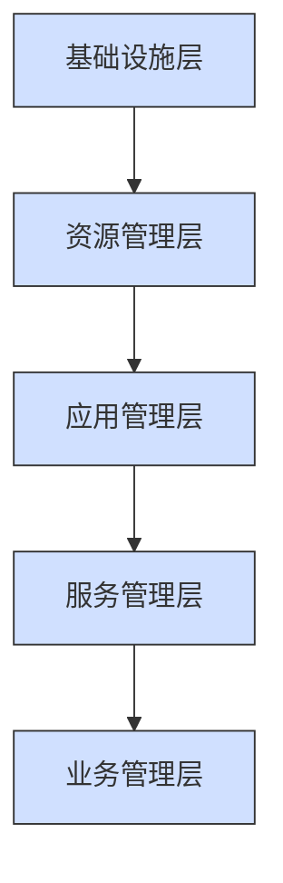
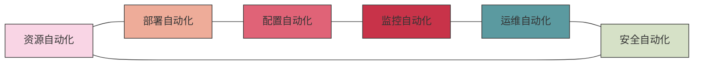
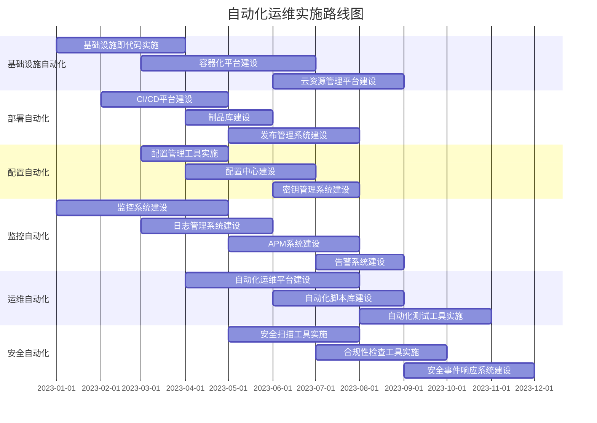

# 自动化运维体系架构

自动化运维体系架构是构建高效运维平台的基础，本文将详细介绍自动化运维的整体架构设计、核心组件和实现方法，帮助读者建立完整的自动化运维体系概念。

## 1. 自动化运维概述

### 1.1 什么是自动化运维

自动化运维（DevOps Automation）是指通过自动化工具和流程，减少或替代人工干预，实现IT基础设施和应用系统的部署、配置、监控、维护和优化等运维工作。它是DevOps理念的重要实践方式，旨在提高运维效率、降低人为错误、缩短服务交付周期，并确保系统稳定性和可靠性。

### 1.2 自动化运维的发展历程

自动化运维的发展经历了以下几个阶段：

1. **手工运维阶段**（2000年前）：主要依靠运维人员手动操作，通过SSH/远程桌面等方式登录服务器进行配置和维护。

2. **脚本自动化阶段**（2000-2010年）：运维人员开始使用Shell、Python等脚本语言编写自动化脚本，实现简单的自动化任务。

3. **工具平台阶段**（2010-2015年）：出现了专业的自动化工具，如Puppet、Chef、Ansible等配置管理工具，以及Jenkins等持续集成工具。

4. **DevOps阶段**（2015年至今）：DevOps文化兴起，自动化贯穿开发、测试、部署、运维全生命周期，出现了容器技术（Docker）、编排工具（Kubernetes）、基础设施即代码（Infrastructure as Code）等新技术。

5. **智能运维阶段**（正在发展）：引入AI和机器学习技术，实现预测性维护、智能告警和自愈系统。

### 1.3 自动化运维的价值

自动化运维为企业带来的核心价值包括：

- **提高效率**：减少重复性工作，释放运维人员时间，专注于更有价值的任务
- **降低成本**：减少人力资源投入，优化资源利用率
- **提升质量**：减少人为错误，确保操作的一致性和可重复性
- **加速交付**：缩短部署周期，实现快速迭代和持续交付
- **增强可靠性**：通过标准化流程和自动化检测，提高系统稳定性
- **提升安全性**：自动化安全检查和合规性验证，减少安全风险
- **改善可视化**：提供全面的监控和报告，增强系统透明度

## 2. 自动化运维体系架构设计

### 2.1 整体架构设计原则

设计自动化运维体系架构应遵循以下原则：

1. **标准化原则**：建立统一的标准和规范，确保各环节的一致性
2. **模块化原则**：将系统分解为独立的功能模块，便于维护和扩展
3. **可扩展性原则**：架构设计应支持业务增长和技术演进
4. **安全性原则**：确保运维操作的安全性和数据的保密性
5. **可视化原则**：提供直观的界面和报告，增强系统透明度
6. **闭环管理原则**：形成完整的管理闭环，包括计划、执行、检查和改进
7. **持续优化原则**：不断收集反馈并优化流程和工具

### 2.2 自动化运维体系架构层次

一个完整的自动化运维体系架构通常包含以下五个层次：



1. **基础设施层**：包括物理设备、网络、存储、虚拟化平台等基础设施资源
2. **资源管理层**：负责资源的分配、调度和管理，如云平台、容器平台等
3. **应用管理层**：负责应用的部署、配置、更新和维护
4. **服务管理层**：负责服务的监控、告警、故障处理和性能优化
5. **业务管理层**：与业务需求对接，提供业务视角的运维服务

### 2.3 自动化运维核心功能模块

自动化运维体系的核心功能模块包括：



1. **资源自动化**：自动化资源的申请、分配、回收和管理
2. **部署自动化**：自动化应用的构建、测试、部署和发布
3. **配置自动化**：自动化系统和应用的配置管理
4. **监控自动化**：自动化系统和应用的监控、告警和报告
5. **运维自动化**：自动化日常运维任务，如备份、恢复、扩容等
6. **安全自动化**：自动化安全检查、漏洞扫描和合规性验证

## 3. 自动化运维核心组件详解

### 3.1 资源自动化管理

资源自动化管理是自动化运维的基础，主要包括以下组件：

#### 3.1.1 基础设施即代码（IaC）

基础设施即代码（Infrastructure as Code）是一种使用代码来定义、部署和管理基础设施的方法。它将基础设施配置转化为代码，使其可版本化、可测试和可重复。

常用的IaC工具包括：

- **Terraform**：跨平台的基础设施编排工具，支持多种云服务提供商
- **AWS CloudFormation**：AWS云资源的模板化部署工具
- **Azure Resource Manager**：Azure云资源的模板化部署工具
- **Google Cloud Deployment Manager**：Google Cloud资源的模板化部署工具

Terraform示例：

```hcl
# 定义AWS提供商
provider "aws" {
  region = "us-west-2"
}

# 创建VPC
resource "aws_vpc" "main" {
  cidr_block = "10.0.0.0/16"
  
  tags = {
    Name = "main-vpc"
    Environment = "production"
  }
}

# 创建子网
resource "aws_subnet" "public" {
  vpc_id     = aws_vpc.main.id
  cidr_block = "10.0.1.0/24"
  
  tags = {
    Name = "public-subnet"
  }
}

# 创建EC2实例
resource "aws_instance" "web" {
  ami           = "ami-0c55b159cbfafe1f0"
  instance_type = "t2.micro"
  subnet_id     = aws_subnet.public.id
  
  tags = {
    Name = "web-server"
  }
}
```

#### 3.1.2 云资源管理平台

云资源管理平台负责统一管理多云环境下的资源，提供资源申请、审批、分配和回收等功能。

主要功能包括：

- **多云管理**：统一管理多个云平台的资源
- **资源目录**：提供资源的分类和查询
- **配额管理**：控制资源的使用配额
- **成本管理**：监控和优化资源成本
- **自助服务**：提供自助式的资源申请和使用

#### 3.1.3 容器编排平台

容器编排平台负责容器的部署、扩展和管理，提供容器化应用的运行环境。

主流的容器编排平台是Kubernetes，它提供以下核心功能：

- **容器编排**：自动部署、扩展和管理容器化应用
- **服务发现**：自动发现和连接服务
- **负载均衡**：分发流量到多个容器实例
- **存储编排**：自动挂载存储系统
- **自动扩缩容**：根据负载自动调整容器数量
- **自愈能力**：自动重启失败的容器

Kubernetes部署示例：

```yaml
apiVersion: apps/v1
kind: Deployment
metadata:
  name: nginx-deployment
  labels:
    app: nginx
spec:
  replicas: 3
  selector:
    matchLabels:
      app: nginx
  template:
    metadata:
      labels:
        app: nginx
    spec:
      containers:
      - name: nginx
        image: nginx:1.14.2
        ports:
        - containerPort: 80
        resources:
          limits:
            cpu: "1"
            memory: "512Mi"
          requests:
            cpu: "0.5"
            memory: "256Mi"
```

### 3.2 部署自动化

部署自动化是实现持续集成/持续部署（CI/CD）的关键，主要包括以下组件：

#### 3.2.1 持续集成/持续部署（CI/CD）平台

CI/CD平台负责自动化构建、测试和部署应用，实现快速迭代和持续交付。

常用的CI/CD工具包括：

- **Jenkins**：开源的自动化服务器，支持构建、部署和自动化任务
- **GitLab CI/CD**：GitLab内置的CI/CD功能
- **GitHub Actions**：GitHub提供的CI/CD服务
- **Azure DevOps**：微软提供的DevOps服务
- **CircleCI**：云原生CI/CD平台

Jenkins Pipeline示例：

```groovy
pipeline {
    agent any
    
    stages {
        stage('Checkout') {
            steps {
                checkout scm
            }
        }
        
        stage('Build') {
            steps {
                sh 'mvn clean package'
            }
        }
        
        stage('Test') {
            steps {
                sh 'mvn test'
            }
            post {
                always {
                    junit 'target/surefire-reports/*.xml'
                }
            }
        }
        
        stage('Deploy to Staging') {
            steps {
                sh 'ansible-playbook -i inventory/staging deploy.yml'
            }
        }
        
        stage('Integration Tests') {
            steps {
                sh 'mvn verify -Pintegration-tests'
            }
        }
        
        stage('Deploy to Production') {
            when {
                branch 'master'
            }
            steps {
                input message: 'Deploy to production?'
                sh 'ansible-playbook -i inventory/production deploy.yml'
            }
        }
    }
    
    post {
        success {
            echo 'Deployment successful!'
            slackSend channel: '#devops', color: 'good', message: "Deployment successful: ${env.JOB_NAME} ${env.BUILD_NUMBER}"
        }
        failure {
            echo 'Deployment failed!'
            slackSend channel: '#devops', color: 'danger', message: "Deployment failed: ${env.JOB_NAME} ${env.BUILD_NUMBER}"
        }
    }
}
```

#### 3.2.2 制品库

制品库负责存储和管理构建产物（制品），确保部署的一致性和可追溯性。

常用的制品库包括：

- **Nexus Repository**：支持多种制品格式的仓库管理器
- **JFrog Artifactory**：通用制品管理平台
- **Docker Registry**：Docker镜像仓库
- **Harbor**：企业级Docker镜像仓库

#### 3.2.3 发布管理系统

发布管理系统负责协调和管理应用的发布过程，确保发布的安全性和可控性。

主要功能包括：

- **发布计划**：制定和管理发布计划
- **发布审批**：控制发布的审批流程
- **发布执行**：自动化执行发布任务
- **发布回滚**：支持快速回滚到之前的版本
- **发布报告**：提供发布过程的报告和分析

### 3.3 配置自动化

配置自动化负责系统和应用的配置管理，确保配置的一致性和可控性。

#### 3.3.1 配置管理工具

配置管理工具负责自动化系统和应用的配置，确保环境的一致性。

常用的配置管理工具包括：

- **Ansible**：基于SSH的无代理配置管理工具
- **Puppet**：基于客户端-服务器架构的配置管理工具
- **Chef**：基于Ruby的配置管理工具
- **SaltStack**：基于Python的配置管理工具

Ansible Playbook示例：

```yaml
---
- name: Configure web servers
  hosts: webservers
  become: yes
  vars:
    http_port: 80
    max_clients: 200
  
  tasks:
    - name: Install Apache
      apt:
        name: apache2
        state: present
    
    - name: Configure Apache
      template:
        src: templates/httpd.conf.j2
        dest: /etc/apache2/httpd.conf
      notify: Restart Apache
    
    - name: Start Apache service
      service:
        name: apache2
        state: started
        enabled: yes
  
  handlers:
    - name: Restart Apache
      service:
        name: apache2
        state: restarted
```

#### 3.3.2 配置中心

配置中心负责集中管理和分发配置，支持动态配置更新和版本管理。

常用的配置中心包括：

- **Apollo**：携程开源的分布式配置中心
- **Spring Cloud Config**：Spring Cloud提供的配置服务
- **Nacos**：阿里巴巴开源的动态服务发现、配置管理和服务管理平台
- **etcd**：CoreOS开发的分布式键值存储系统

#### 3.3.3 密钥管理系统

密钥管理系统负责安全地存储和管理敏感信息，如密码、API密钥和证书。

常用的密钥管理系统包括：

- **HashiCorp Vault**：安全的密钥管理和数据保护工具
- **AWS Secrets Manager**：AWS提供的密钥管理服务
- **Azure Key Vault**：Azure提供的密钥管理服务
- **Google Cloud Secret Manager**：Google Cloud提供的密钥管理服务

### 3.4 监控自动化

监控自动化负责系统和应用的监控、告警和报告，确保系统的可观测性。

#### 3.4.1 监控系统

监控系统负责收集和分析系统和应用的指标，提供实时监控和历史数据分析。

常用的监控系统包括：

- **Prometheus**：开源的监控和告警系统
- **Grafana**：开源的可视化和分析平台
- **Zabbix**：企业级的开源监控解决方案
- **Nagios**：传统的IT基础设施监控系统
- **Datadog**：SaaS监控和分析平台

Prometheus配置示例：

```yaml
global:
  scrape_interval: 15s
  evaluation_interval: 15s

alerting:
  alertmanagers:
  - static_configs:
    - targets:
      - alertmanager:9093

rule_files:
  - "alert_rules.yml"

scrape_configs:
  - job_name: 'prometheus'
    static_configs:
    - targets: ['localhost:9090']
  
  - job_name: 'node_exporter'
    static_configs:
    - targets: ['node_exporter:9100']
  
  - job_name: 'app'
    metrics_path: '/actuator/prometheus'
    static_configs:
    - targets: ['app:8080']
```

#### 3.4.2 日志管理系统

日志管理系统负责收集、存储和分析日志数据，支持问题排查和安全审计。

常用的日志管理系统包括：

- **ELK Stack**：Elasticsearch、Logstash和Kibana组成的日志管理平台
- **Graylog**：开源的日志管理平台
- **Splunk**：商业日志管理和分析平台
- **Loki**：Grafana Labs开发的日志聚合系统

ELK Stack配置示例（Filebeat）：

```yaml
filebeat.inputs:
- type: log
  enabled: true
  paths:
    - /var/log/nginx/access.log
  fields:
    type: nginx_access
  fields_under_root: true

- type: log
  enabled: true
  paths:
    - /var/log/nginx/error.log
  fields:
    type: nginx_error
  fields_under_root: true

output.elasticsearch:
  hosts: ["elasticsearch:9200"]
  indices:
    - index: "nginx-access-%{+yyyy.MM.dd}"
      when.equals:
        type: "nginx_access"
    - index: "nginx-error-%{+yyyy.MM.dd}"
      when.equals:
        type: "nginx_error"

setup.kibana:
  host: "kibana:5601"
```

#### 3.4.3 APM系统

应用性能监控（APM）系统负责监控和分析应用的性能，帮助识别和解决性能问题。

常用的APM系统包括：

- **Elastic APM**：Elastic Stack提供的APM解决方案
- **Pinpoint**：开源的APM工具，专注于分布式系统
- **SkyWalking**：Apache开源的APM系统
- **Dynatrace**：商业APM解决方案
- **New Relic**：SaaS APM平台

#### 3.4.4 告警系统

告警系统负责根据预定义的规则生成告警，并通过多种渠道通知相关人员。

常用的告警系统包括：

- **Prometheus Alertmanager**：Prometheus的告警管理组件
- **Grafana Alerting**：Grafana提供的告警功能
- **Zabbix Alerts**：Zabbix的告警功能
- **PagerDuty**：商业事件管理和告警平台

Prometheus Alertmanager配置示例：

```yaml
global:
  resolve_timeout: 5m
  smtp_smarthost: 'smtp.example.org:587'
  smtp_from: 'alertmanager@example.org'
  smtp_auth_username: 'alertmanager'
  smtp_auth_password: 'password'

route:
  group_by: ['alertname', 'cluster', 'service']
  group_wait: 30s
  group_interval: 5m
  repeat_interval: 3h
  receiver: 'team-emails'
  routes:
  - match:
      severity: critical
    receiver: 'team-pager'
    continue: true

receivers:
- name: 'team-emails'
  email_configs:
  - to: 'team@example.org'
    send_resolved: true

- name: 'team-pager'
  pagerduty_configs:
  - service_key: '<team-pagerduty-key>'
    send_resolved: true
```

### 3.5 运维自动化

运维自动化负责自动化日常运维任务，提高运维效率和质量。

#### 3.5.1 自动化运维平台

自动化运维平台提供统一的界面和API，集成各种自动化工具和流程，支持运维任务的自动化执行。

主要功能包括：

- **任务编排**：定义和执行自动化任务流程
- **作业调度**：按计划执行定时任务
- **权限控制**：管理用户权限和操作审计
- **资源管理**：管理和分配运维资源
- **知识库**：存储和共享运维知识和最佳实践

#### 3.5.2 自动化脚本库

自动化脚本库存储和管理各种自动化脚本，支持脚本的版本管理和复用。

常用的脚本语言包括：

- **Shell**：Unix/Linux系统的命令行脚本
- **Python**：通用脚本语言，适合系统管理和自动化
- **PowerShell**：Windows系统的自动化脚本语言
- **Ruby**：面向对象的脚本语言

自动化脚本示例（Python）：

```python
#!/usr/bin/env python3
"""
自动备份数据库并上传到S3存储
"""
import os
import sys
import time
import subprocess
import boto3
from datetime import datetime

# 配置信息
DB_HOST = "db.example.com"
DB_USER = "backup_user"
DB_PASSWORD = "backup_password"
DB_NAME = "myapp"
BACKUP_DIR = "/tmp/backups"
S3_BUCKET = "myapp-backups"
S3_PREFIX = "database"

def create_backup():
    """创建数据库备份"""
    timestamp = datetime.now().strftime("%Y%m%d%H%M%S")
    backup_file = f"{BACKUP_DIR}/{DB_NAME}_{timestamp}.sql.gz"
    
    # 确保备份目录存在
    os.makedirs(BACKUP_DIR, exist_ok=True)
    
    # 执行备份命令
    cmd = f"mysqldump -h {DB_HOST} -u {DB_USER} -p{DB_PASSWORD} {DB_NAME} | gzip > {backup_file}"
    result = subprocess.run(cmd, shell=True, stderr=subprocess.PIPE)
    
    if result.returncode != 0:
        print(f"备份失败: {result.stderr.decode()}")
        sys.exit(1)
    
    print(f"备份成功: {backup_file}")
    return backup_file

def upload_to_s3(file_path):
    """上传备份文件到S3"""
    s3_client = boto3.client('s3')
    file_name = os.path.basename(file_path)
    s3_key = f"{S3_PREFIX}/{file_name}"
    
    try:
        s3_client.upload_file(file_path, S3_BUCKET, s3_key)
        print(f"上传成功: s3://{S3_BUCKET}/{s3_key}")
        return True
    except Exception as e:
        print(f"上传失败: {str(e)}")
        return False

def cleanup(file_path, keep_local=False):
    """清理本地备份文件"""
    if not keep_local:
        os.remove(file_path)
        print(f"已删除本地文件: {file_path}")

def main():
    """主函数"""
    print(f"开始备份数据库 {DB_NAME}...")
    backup_file = create_backup()
    
    print("上传备份到S3...")
    upload_success = upload_to_s3(backup_file)
    
    if upload_success:
        cleanup(backup_file)
    
    print("备份完成!")

if __name__ == "__main__":
    main()
```

#### 3.5.3 自动化测试工具

自动化测试工具负责自动化测试系统和应用，确保系统的质量和稳定性。

常用的自动化测试工具包括：

- **Selenium**：Web应用自动化测试工具
- **JMeter**：性能测试工具
- **Postman**：API测试工具
- **Chaos Monkey**：混沌工程工具，测试系统的弹性

#### 3.5.4 自动化运维机器人

自动化运维机器人负责自动响应和处理常见的运维事件，减少人工干预。

主要功能包括：

- **事件响应**：自动响应监控告警和事件
- **问题诊断**：自动诊断常见问题
- **自动修复**：自动修复简单问题
- **知识学习**：学习和积累运维知识
- **人机协作**：在复杂情况下与人类运维人员协作

### 3.6 安全自动化

安全自动化负责自动化安全检查、漏洞扫描和合规性验证，提高系统的安全性。

#### 3.6.1 安全扫描工具

安全扫描工具负责自动扫描系统和应用的安全漏洞，提供安全评估和建议。

常用的安全扫描工具包括：

- **Nessus**：网络漏洞扫描工具
- **OWASP ZAP**：Web应用安全扫描工具
- **SonarQube**：代码质量和安全分析工具
- **Trivy**：容器镜像漏洞扫描工具

#### 3.6.2 合规性检查工具

合规性检查工具负责自动检查系统和应用的合规性，确保符合相关标准和法规。

常用的合规性检查工具包括：

- **InSpec**：基础设施合规性测试工具
- **OpenSCAP**：开源的安全合规性评估平台
- **Compliance Checker**：AWS提供的合规性检查工具
- **Prisma Cloud**：云安全和合规性平台

InSpec配置示例：

```ruby
# 检查SSH配置
control 'ssh-1' do
  impact 1.0
  title 'SSH配置安全检查'
  desc '确保SSH配置符合安全最佳实践'
  
  describe sshd_config do
    its('Protocol') { should cmp 2 }
    its('PermitRootLogin') { should eq 'no' }
    its('PasswordAuthentication') { should eq 'no' }
    its('PermitEmptyPasswords') { should eq 'no' }
    its('MaxAuthTries') { should cmp <= 5 }
    its('X11Forwarding') { should eq 'no' }
  end
end

# 检查防火墙配置
control 'firewall-1' do
  impact 1.0
  title '防火墙配置检查'
  desc '确保防火墙正确配置'
  
  describe iptables do
    it { should have_rule('-P INPUT DROP') }
    it { should have_rule('-A INPUT -i lo -j ACCEPT') }
    it { should have_rule('-A INPUT -p tcp --dport 22 -j ACCEPT') }
    it { should have_rule('-A INPUT -p tcp --dport 80 -j ACCEPT') }
    it { should have_rule('-A INPUT -p tcp --dport 443 -j ACCEPT') }
  end
end
```

#### 3.6.3 安全事件响应系统

安全事件响应系统负责自动检测和响应安全事件，减少安全事件的影响。

主要功能包括：

- **事件检测**：自动检测安全事件
- **事件分析**：自动分析安全事件的影响和严重性
- **事件响应**：自动执行预定义的响应措施
- **事件报告**：生成安全事件报告和分析

## 4. 自动化运维实施方法

### 4.1 自动化运维实施路径

实施自动化运维通常遵循以下路径：

```mermaid
graph LR
    A[评估现状] --> B[制定策略]
    
让我继续完成自动化运维体系架构的内容：

```mermaid
graph LR
    A[评估现状] --> B[制定策略]
    B --> C[选择工具]
    C --> D[实施自动化]
    D --> E[持续优化]
    
    style A fill:#f9d5e5,stroke:#333,stroke-width:1px
    style B fill:#eeac99,stroke:#333,stroke-width:1px
    style C fill:#e06377,stroke:#333,stroke-width:1px
    style D fill:#c83349,stroke:#333,stroke-width:1px
    style E fill:#5b9aa0,stroke:#333,stroke-width:1px
```

1. **评估现状**：评估当前运维流程和工具，识别自动化机会和挑战
2. **制定策略**：制定自动化运维策略和路线图，确定优先级和目标
3. **选择工具**：选择适合的自动化工具和平台，建立工具链
4. **实施自动化**：逐步实施自动化，从简单任务开始，逐步扩展到复杂流程
5. **持续优化**：持续评估和优化自动化流程，适应业务和技术变化

### 4.2 自动化运维实施步骤

#### 4.2.1 评估现状

评估现状的主要任务包括：

- **流程梳理**：梳理现有运维流程和工作内容
- **痛点分析**：识别运维过程中的痛点和瓶颈
- **自动化机会**：识别可自动化的任务和流程
- **技术评估**：评估现有技术栈和工具
- **能力评估**：评估团队的自动化能力和技能

评估工具示例（运维任务自动化评估表）：

| 运维任务 | 频率 | 复杂度 | 风险 | 自动化价值 | 自动化难度 | 优先级 |
|---------|------|-------|-----|-----------|-----------|-------|
| 服务器部署 | 高 | 中 | 中 | 高 | 中 | 高 |
| 数据库备份 | 高 | 低 | 高 | 高 | 低 | 高 |
| 日志分析 | 高 | 高 | 低 | 中 | 高 | 中 |
| 安全补丁更新 | 中 | 中 | 高 | 高 | 中 | 高 |
| 性能监控 | 高 | 中 | 低 | 高 | 中 | 高 |

#### 4.2.2 制定策略

制定自动化运维策略的主要任务包括：

- **目标设定**：设定自动化运维的目标和KPI
- **路线图规划**：制定自动化运维的路线图和时间表
- **资源规划**：规划所需的人力、技术和财务资源
- **风险管理**：识别和管理自动化过程中的风险
- **变更管理**：规划如何管理自动化带来的变更

自动化运维路线图示例：



#### 4.2.3 选择工具

选择自动化工具的主要考虑因素包括：

- **功能需求**：工具是否满足功能需求
- **技术兼容性**：工具是否与现有技术栈兼容
- **易用性**：工具是否易于学习和使用
- **社区支持**：工具是否有活跃的社区和良好的文档
- **成本效益**：工具的成本是否与其带来的价值相匹配
- **扩展性**：工具是否能够随业务增长而扩展
- **安全性**：工具是否满足安全要求

工具选型矩阵示例：

| 工具类型 | 开源选项 | 商业选项 | 自研选项 |
|---------|---------|---------|---------|
| IaC工具 | Terraform, Ansible | AWS CloudFormation, Azure ARM | 自研IaC平台 |
| CI/CD工具 | Jenkins, GitLab CI | Azure DevOps, CircleCI | 自研CI/CD平台 |
| 容器编排 | Kubernetes | EKS, AKS, GKE | 自研容器平台 |
| 监控工具 | Prometheus, Grafana | Datadog, New Relic | 自研监控平台 |
| 日志管理 | ELK Stack, Graylog | Splunk, Sumo Logic | 自研日志平台 |
| 配置管理 | Ansible, Puppet | Chef Automate | 自研配置平台 |

#### 4.2.4 实施自动化

实施自动化的主要步骤包括：

- **环境准备**：准备自动化工具的运行环境
- **工具部署**：部署和配置自动化工具
- **流程设计**：设计自动化流程和工作流
- **脚本开发**：开发自动化脚本和程序
- **测试验证**：测试和验证自动化流程
- **培训赋能**：培训团队使用自动化工具和流程
- **逐步推广**：逐步推广自动化到更多场景

自动化实施清单示例：

```markdown
# 自动化实施清单

## 环境准备
- [ ] 准备自动化工具服务器
- [ ] 配置网络和安全策略
- [ ] 准备数据库和存储资源
- [ ] 配置用户和权限

## 工具部署
- [ ] 部署CI/CD平台（Jenkins）
- [ ] 部署配置管理工具（Ansible）
- [ ] 部署监控系统（Prometheus + Grafana）
- [ ] 部署日志管理系统（ELK Stack）

## 流程设计
- [ ] 设计代码提交和审查流程
- [ ] 设计构建和测试流程
- [ ] 设计部署和发布流程
- [ ] 设计监控和告警流程

## 脚本开发
- [ ] 开发基础设施部署脚本
- [ ] 开发应用部署脚本
- [ ] 开发监控和告警脚本
- [ ] 开发备份和恢复脚本

## 测试验证
- [ ] 测试自动化部署流程
- [ ] 测试自动化监控流程
- [ ] 测试自动化备份流程
- [ ] 测试故障恢复流程

## 培训赋能
- [ ] 培训开发团队使用CI/CD流程
- [ ] 培训运维团队使用自动化工具
- [ ] 编写自动化工具使用文档
- [ ] 建立知识共享平台

## 逐步推广
- [ ] 选择试点项目实施自动化
- [ ] 收集反馈并优化流程
- [ ] 推广到更多项目
- [ ] 建立自动化运维最佳实践
```

#### 4.2.5 持续优化

持续优化自动化运维的主要任务包括：

- **效果评估**：评估自动化运维的效果和价值
- **问题收集**：收集自动化过程中的问题和反馈
- **流程优化**：优化自动化流程和工作流
- **工具升级**：升级和更新自动化工具
- **能力提升**：提升团队的自动化能力和技能

持续优化指标示例：

| 指标类型 | 指标名称 | 指标说明 | 目标值 |
|---------|---------|---------|-------|
| 效率指标 | 部署频率 | 每周部署次数 | >10次/周 |
| 效率指标 | 部署时间 | 从代码提交到部署完成的时间 | <30分钟 |
| 效率指标 | 变更准备时间 | 准备变更所需的时间 | <1小时 |
| 质量指标 | 变更失败率 | 导致服务降级或中断的变更比例 | <5% |
| 质量指标 | 平均恢复时间 | 从故障发生到恢复的平均时间 | <30分钟 |
| 质量指标 | 故障率 | 每月故障次数 | <2次/月 |
| 成本指标 | 运维人力成本 | 运维人员人力成本 | 降低30% |
| 成本指标 | 基础设施成本 | 基础设施和工具成本 | 优化20% |

## 5. 自动化运维最佳实践

### 5.1 基础设施即代码最佳实践

基础设施即代码（IaC）的最佳实践包括：

1. **版本控制**：将基础设施代码纳入版本控制系统，如Git
2. **模块化设计**：将基础设施代码组织为可重用的模块
3. **参数化配置**：使用变量和参数化配置，支持不同环境
4. **状态管理**：妥善管理基础设施状态，避免状态不一致
5. **安全管理**：保护敏感信息，如密码和密钥
6. **测试验证**：对基础设施代码进行测试和验证
7. **文档化**：编写清晰的文档，说明基础设施代码的用途和使用方法

### 5.2 CI/CD最佳实践

CI/CD（持续集成/持续部署）的最佳实践包括：

1. **小批量提交**：鼓励开发人员频繁提交小批量代码
2. **自动化测试**：实施自动化测试，包括单元测试、集成测试和端到端测试
3. **快速反馈**：提供快速反馈，帮助开发人员及时发现和修复问题
4. **环境一致性**：确保开发、测试和生产环境的一致性
5. **可重复部署**：确保部署过程可重复和可靠
6. **回滚机制**：实施快速回滚机制，应对部署失败
7. **安全检查**：在CI/CD流程中集成安全检查

### 5.3 监控和告警最佳实践

监控和告警的最佳实践包括：

1. **多维度监控**：实施多维度监控，包括基础设施、应用和业务
2. **合理的告警阈值**：设置合理的告警阈值，避免告警风暴
3. **告警分级**：实施告警分级，区分不同严重程度的告警
4. **告警聚合**：聚合相关告警，减少告警数量
5. **告警抑制**：在特定情况下抑制不必要的告警
6. **告警路由**：将告警路由到合适的处理人员
7. **告警自动化处理**：自动化处理常见告警，减少人工干预

### 5.4 自动化运维安全最佳实践

自动化运维安全的最佳实践包括：

1. **最小权限原则**：遵循最小权限原则，只授予必要的权限
2. **密钥管理**：妥善管理密钥和凭证，避免泄露
3. **安全审计**：记录和审计所有运维操作
4. **变更管理**：实施严格的变更管理流程
5. **安全扫描**：定期进行安全扫描和漏洞评估
6. **安全更新**：及时应用安全更新和补丁
7. **安全培训**：对运维人员进行安全培训和意识提升

## 6. 自动化运维的挑战与应对

### 6.1 技术挑战与应对

自动化运维面临的技术挑战及应对策略包括：

1. **技术复杂性**
   - 挑战：自动化工具和技术复杂，学习曲线陡峭
   - 应对：分阶段实施，从简单工具开始，逐步引入复杂技术；提供培训和支持

2. **遗留系统集成**
   - 挑战：遗留系统难以集成到自动化流程中
   - 应对：使用适配器和包装器，逐步现代化遗留系统；考虑混合模式

3. **工具碎片化**
   - 挑战：不同工具之间集成困难，形成工具孤岛
   - 应对：建立统一的自动化平台，集成各种工具；使用API和插件实现工具互通

4. **环境一致性**
   - 挑战：不同环境之间的差异导致自动化流程不可靠
   - 应对：使用容器和虚拟化技术确保环境一致性；实施环境即代码

### 6.2 组织挑战与应对

自动化运维面临的组织挑战及应对策略包括：

1. **文化转变**
   - 挑战：传统运维文化难以适应自动化转型
   - 应对：培养DevOps文化，鼓励协作和创新；强调自动化的价值和意义

2. **技能缺口**
   - 挑战：运维人员缺乏自动化所需的技能
   - 应对：提供培训和学习机会；引入具有自动化经验的人才；建立内部知识共享机制

3. **职责划分**
   - 挑战：自动化模糊了开发和运维的界限，职责不清
   - 应对：明确职责划分，建立跨职能团队；实施SRE（站点可靠性工程）模式

4. **变更管理**
   - 挑战：自动化带来的变更难以管理
   - 应对：实施严格的变更管理流程；逐步引入自动化，控制变更风险

### 6.3 安全挑战与应对

自动化运维面临的安全挑战及应对策略包括：

1. **权限管理**
   - 挑战：自动化工具需要高级权限，增加安全风险
   - 应对：实施最小权限原则；使用临时凭证和权限边界

2. **凭证管理**
   - 挑战：自动化流程中的凭证难以安全管理
   - 应对：使用密钥管理系统；实施凭证轮换和临时凭证

3. **审计追踪**
   - 挑战：自动化操作难以追踪和审计
   - 应对：实施全面的日志记录和审计机制；使用不可变基础设施

4. **安全漏洞**
   - 挑战：自动化工具可能引入安全漏洞
   - 应对：定期进行安全评估和漏洞扫描；及时更新和修补工具

## 7. 自动化运维的未来趋势

### 7.1 AIOps

AIOps（人工智能运维）是将人工智能和机器学习技术应用于IT运维的新兴领域，旨在提高运维效率和质量。

主要特点包括：

- **智能监控**：使用机器学习算法分析监控数据，识别异常和潜在问题
- **预测分析**：预测系统故障和性能问题，实现预防性维护
- **根因分析**：自动分析故障根因，加速问题解决
- **智能告警**：减少告警噪音，提高告警质量
- **自动修复**：自动修复常见问题，减少人工干预

### 7.2 NoOps

NoOps（无运维）是一种理想状态，旨在通过高度自动化和智能化，最小化或消除传统运维工作。

主要特点包括：

- **全自动化**：实现全流程自动化，最小化人工干预
- **自愈系统**：系统能够自动检测和修复问题
- **无服务器架构**：使用无服务器（Serverless）架构，减少基础设施管理
- **平台即服务**：提供完整的平台服务，简化应用部署和管理
- **开发者自助服务**：开发者可以自助完成部署和运维任务

### 7.3 GitOps

GitOps是一种使用Git作为单一事实来源，自动化基础设施和应用部署的方法。

主要特点包括：

- **声明式配置**：使用声明式配置描述系统期望状态
- **Git作为单一事实来源**：所有配置都存储在Git仓库中
- **自动同步**：自动将系统状态与Git仓库中的配置同步
- **可审计性**：所有变更都可以通过Git历史追踪和审计
- **自助服务**：开发者可以通过Git提交变更，实现自助服务

### 7.4 混沌工程

混沌工程是一种通过主动注入故障来测试系统弹性的方法，旨在提高系统的可靠性和稳定性。

主要特点包括：

- **故障注入**：主动注入各种故障，如服务崩溃、网络延迟、资源耗尽等
- **故障演练**：定期进行故障演练，测试系统的恢复能力
- **弹性设计**：基于混沌实验的结果，改进系统设计，提高弹性
- **安全边界**：在受控环境中进行实验，确保不影响生产系统
- **持续验证**：持续验证系统的弹性和稳定性

## 8. 总结

自动化运维体系架构是现代IT运维的核心，通过自动化工具和流程，提高运维效率和质量，支持业务快速发展。本文详细介绍了自动化运维的整体架构设计、核心组件和实现方法，帮助读者建立完整的自动化运维体系概念。

随着技术的不断发展，自动化运维将向着更智能、更自动化的方向发展，如AIOps、NoOps、GitOps和混沌工程等新兴趋势。企业应根据自身情况，制定合适的自动化运维策略，逐步建立和完善自动化运维体系，提高IT运维的效率和质量，为业务发展提供有力支持。

## 参考资料

1. Humble, J., & Farley, D. (2010). Continuous Delivery: Reliable Software Releases through Build, Test, and Deployment Automation. Addison-Wesley Professional.
2. Kim, G., Debois, P., Willis, J., & Humble, J. (2016). The DevOps Handbook: How to Create World-Class Agility, Reliability, and Security in Technology Organizations. IT Revolution Press.
3. Morris, K. (2016). Infrastructure as Code: Managing Servers in the Cloud. O'Reilly Media.
4. Beyer, B., Jones, C., Petoff, J., & Murphy, N. R. (2016). Site Reliability Engineering: How Google Runs Production Systems. O'Reilly Media.
5. Limoncelli, T. A., Chalup, S. R., & Hogan, C. J. (2014). The Practice of Cloud System Administration: Designing and Operating Large Distributed Systems, Volume 2. Addison-Wesley Professional.