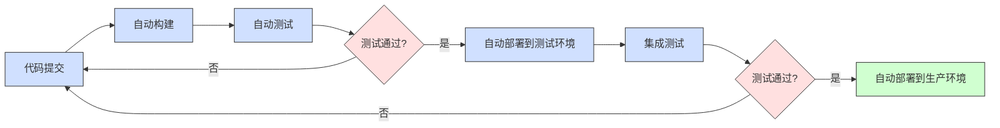
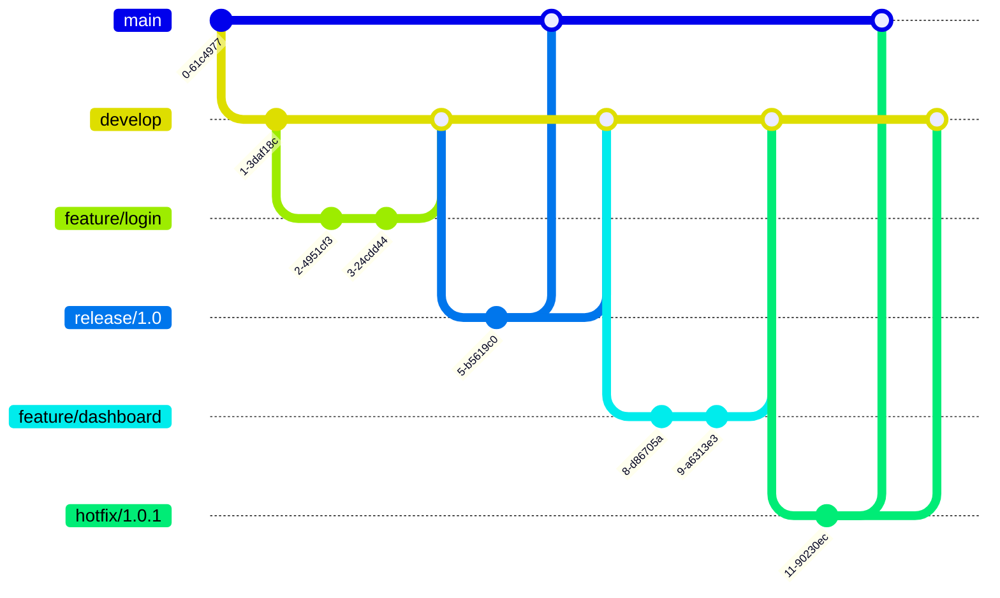
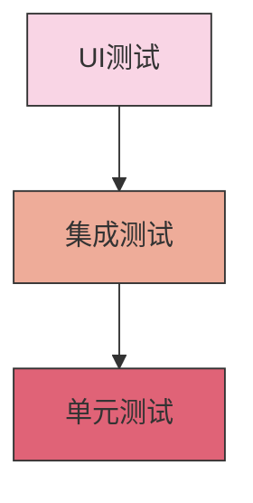
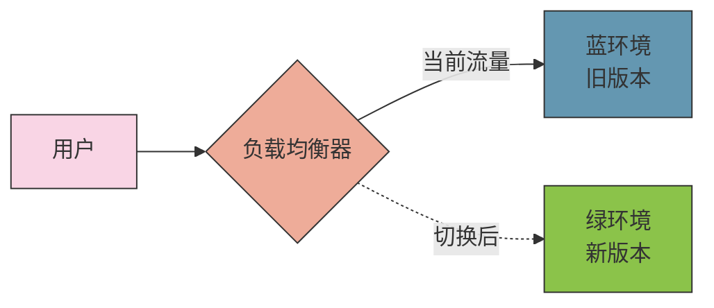
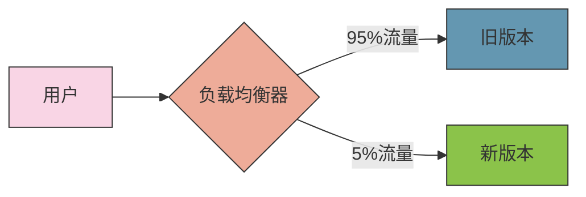
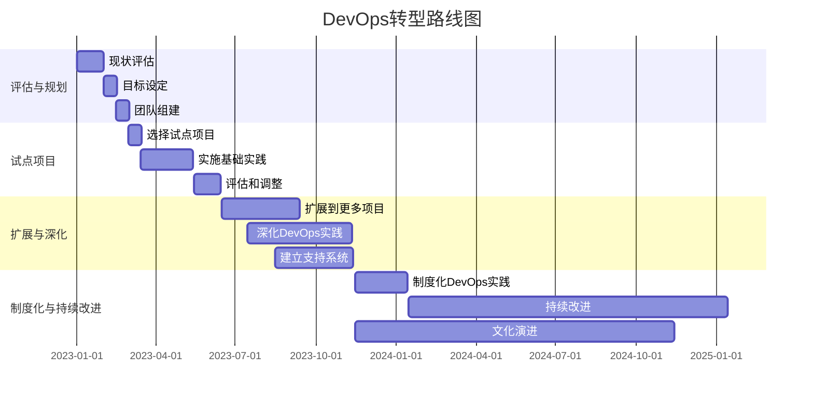

# DevOps理念与实践方法

DevOps是一种文化、一种实践，旨在打破开发和运维之间的壁垒。本文将详细介绍DevOps的核心理念、实践方法和实施策略，帮助团队实现更高效的协作和交付。

## 1. DevOps概述

### 1.1 DevOps的定义与起源

DevOps是"Development"（开发）和"Operations"（运维）的组合词，代表了一种文化理念、实践方法和工具集，旨在促进开发、运维和质量保障（QA）团队之间的协作与沟通，实现软件交付和基础设施变更的高速度、高质量和高可靠性。

DevOps的起源可以追溯到2009年，比利时根特举办的首届DevOpsDays大会，由Patrick Debois发起。这一概念源于对传统软件开发和IT运维之间"墙"（也称为"筒仓效应"）的反思，这种隔阂导致了软件交付过程中的诸多问题：

- 开发团队追求变更和创新，而运维团队则注重稳定性和可靠性
- 责任划分不清，相互推诿问题
- 沟通不畅，信息传递效率低下
- 手动操作多，自动化程度低
- 交付周期长，响应市场变化慢

### 1.2 DevOps的核心价值

DevOps的核心价值可以概括为"CAMS"模型，由John Willis和Damon Edwards提出：

1. **文化（Culture）**：强调人与人之间的协作，打破团队间的壁垒，建立共同的目标和责任感。
2. **自动化（Automation）**：通过自动化工具和流程，减少手动操作，提高效率和一致性。
3. **度量（Measurement）**：通过数据驱动决策，持续监控和改进流程和产品。
4. **共享（Sharing）**：鼓励知识共享和透明度，促进团队学习和成长。

后来，Jez Humble增加了"精益（Lean）"的概念，形成了"CALMS"框架，强调精益思想在DevOps中的重要性，包括消除浪费、优化流程和持续改进。

### 1.3 DevOps与传统开发模式的对比

DevOps与传统开发模式的主要区别在于：

| 特性 | 传统开发模式 | DevOps模式 |
|------|------------|-----------|
| 团队结构 | 开发、测试、运维分离 | 跨职能团队协作 |
| 交付周期 | 长周期（月/季度） | 短周期（天/周） |
| 变更规模 | 大批量变更 | 小批量、频繁变更 |
| 自动化程度 | 低，手动操作多 | 高，自动化流程 |
| 反馈速度 | 慢，滞后 | 快，实时 |
| 风险管理 | 避免风险 | 拥抱变化，快速失败 |
| 责任归属 | 各自负责各自的部分 | 共同对产品全生命周期负责 |
| 文化特点 | 命令与控制 | 协作与信任 |

## 2. DevOps的核心理念

### 2.1 三大支柱：人、流程、工具

DevOps的成功实施依赖于三大支柱的协同作用：

1. **人（People）**：
   - 建立跨职能团队，打破"筒仓效应"
   - 培养协作文化和共同责任感
   - 鼓励实验和学习，允许失败
   - 强调透明度和开放沟通

2. **流程（Process）**：
   - 实施持续集成和持续交付
   - 采用敏捷开发方法
   - 实现自动化测试和部署
   - 建立反馈循环和持续改进机制

3. **工具（Tools）**：
   - 版本控制系统
   - 自动化构建和测试工具
   - 配置管理和基础设施即代码
   - 监控和日志分析工具
   - 协作和沟通平台

这三个支柱相互依存，缺一不可。仅仅引入工具而不改变人的思维和流程，不会带来真正的DevOps转型；同样，没有适当的工具支持，良好的文化和流程也难以高效执行。

### 2.2 持续集成与持续交付（CI/CD）

持续集成（Continuous Integration, CI）和持续交付（Continuous Delivery, CD）是DevOps的核心实践，旨在通过自动化流程，实现快速、可靠的软件交付。

#### 2.2.1 持续集成（CI）

持续集成是指开发人员频繁地（通常每天多次）将代码集成到共享代码库中，并通过自动化构建和测试来验证每次集成，以尽早发现和解决问题。

CI的主要步骤包括：

1. 开发人员提交代码到版本控制系统
2. CI服务器检测到代码变更，触发自动构建
3. 运行单元测试和代码分析
4. 生成构建报告和测试结果
5. 通知开发人员构建结果

CI的好处：
- 尽早发现并修复问题
- 减少集成问题和"集成地狱"
- 保持代码库的健康状态
- 提高代码质量和可测试性
- 加速开发周期

#### 2.2.2 持续交付（CD）

持续交付是持续集成的扩展，它确保代码不仅经过了测试，而且随时可以部署到生产环境。CD的目标是使软件发布变得可靠、可预测和频繁。

CD的主要步骤包括：

1. 代码通过CI流程的构建和测试
2. 自动部署到测试环境
3. 运行集成测试、性能测试和验收测试
4. 准备生产部署（可能需要手动批准）
5. 部署到生产环境（可能是自动的，也可能是手动触发的）

CD的好处：
- 减少部署风险
- 提高部署频率
- 加快价值交付
- 获取更快的用户反馈
- 提高团队信心和士气

#### 2.2.3 持续部署（Continuous Deployment）

持续部署是持续交付的进一步扩展，它自动将通过所有测试的代码直接部署到生产环境，无需人工干预。这是DevOps自动化的最高级别。



### 2.3 基础设施即代码（Infrastructure as Code）

基础设施即代码（Infrastructure as Code, IaC）是一种使用代码来定义、部署和管理基础设施的方法，而不是通过手动流程或使用交互式配置工具。IaC将基础设施配置视为软件代码，使其可以版本化、可测试和可重复。

IaC的核心原则：

1. **声明式定义**：描述系统的期望状态，而不是实现步骤
2. **版本控制**：将基础设施代码存储在版本控制系统中
3. **自动化部署**：通过自动化流程部署基础设施
4. **幂等性**：多次执行相同的操作，结果保持一致
5. **可测试性**：可以对基础设施代码进行测试
6. **可重复性**：可以在不同环境中重复部署相同的基础设施

IaC的实现方式主要有两种：

1. **声明式（Declarative）**：定义系统的期望状态，工具负责实现这个状态（例如：Terraform、AWS CloudFormation）
2. **命令式（Imperative）**：定义实现期望状态的步骤（例如：脚本、Ansible）

IaC的好处：

- 提高基础设施部署的速度和一致性
- 减少手动配置错误
- 实现环境的标准化和可重复性
- 支持基础设施的版本控制和变更管理
- 促进开发和运维之间的协作
- 简化灾难恢复和扩展

Terraform示例：

```hcl
# 定义AWS提供商
provider "aws" {
  region = "us-west-2"
}

# 创建VPC
resource "aws_vpc" "main" {
  cidr_block = "10.0.0.0/16"
  
  tags = {
    Name = "main-vpc"
    Environment = "production"
  }
}

# 创建子网
resource "aws_subnet" "public" {
  vpc_id     = aws_vpc.main.id
  cidr_block = "10.0.1.0/24"
  
  tags = {
    Name = "public-subnet"
  }
}

# 创建安全组
resource "aws_security_group" "web" {
  name        = "web-sg"
  description = "Allow web traffic"
  vpc_id      = aws_vpc.main.id

  ingress {
    from_port   = 80
    to_port     = 80
    protocol    = "tcp"
    cidr_blocks = ["0.0.0.0/0"]
  }

  ingress {
    from_port   = 443
    to_port     = 443
    protocol    = "tcp"
    cidr_blocks = ["0.0.0.0/0"]
  }

  egress {
    from_port   = 0
    to_port     = 0
    protocol    = "-1"
    cidr_blocks = ["0.0.0.0/0"]
  }
}
```

### 2.4 监控与可观测性

监控与可观测性是DevOps的重要组成部分，它们提供了对系统运行状态的实时洞察，帮助团队快速发现和解决问题。

#### 2.4.1 监控（Monitoring）

监控是指收集和分析系统的各种指标，以了解系统的健康状况和性能。传统的监控主要关注系统的已知状态和问题。

监控的主要类型：

1. **基础设施监控**：服务器、网络、存储等硬件资源的监控
2. **应用监控**：应用程序的性能、错误率、响应时间等指标的监控
3. **业务监控**：业务指标和KPI的监控，如用户活跃度、转化率等

#### 2.4.2 可观测性（Observability）

可观测性是监控的扩展，它不仅关注已知的问题，还能帮助发现未知的问题。可观测性基于三大支柱：

1. **指标（Metrics）**：可量化的数据点，如CPU使用率、响应时间、错误率等
2. **日志（Logs）**：系统和应用程序生成的详细记录，包含事件、错误和状态信息
3. **追踪（Traces）**：请求在分布式系统中的完整路径，包括各个服务的处理时间和依赖关系

可观测性的好处：

- 提供系统内部状态的全面视图
- 帮助理解复杂系统的行为
- 支持快速故障排除和根因分析
- 促进性能优化和容量规划
- 提高系统可靠性和用户体验

#### 2.4.3 监控与告警最佳实践

有效的监控和告警策略应遵循以下最佳实践：

1. **监控关键指标**：确定对业务和用户体验最重要的指标
2. **设置合理的告警阈值**：避免过多的误报或漏报
3. **实施告警分级**：根据严重程度和影响范围分级告警
4. **自动化响应**：对常见问题实施自动化响应措施
5. **建立告警响应流程**：明确告警的处理流程和责任人
6. **持续优化**：根据实际情况不断调整监控策略和告警阈值

Prometheus监控配置示例：

```yaml
global:
  scrape_interval: 15s
  evaluation_interval: 15s

alerting:
  alertmanagers:
  - static_configs:
    - targets:
      - alertmanager:9093

rule_files:
  - "alert_rules.yml"

scrape_configs:
  - job_name: 'prometheus'
    static_configs:
    - targets: ['localhost:9090']
  
  - job_name: 'node_exporter'
    static_configs:
    - targets: ['node_exporter:9100']
  
  - job_name: 'app'
    metrics_path: '/actuator/prometheus'
    static_configs:
    - targets: ['app:8080']
```

### 2.5 反馈循环与持续改进

反馈循环和持续改进是DevOps的核心理念，它们确保团队能够从经验中学习并不断优化流程和产品。

#### 2.5.1 反馈循环

反馈循环是指从系统、用户和团队成员那里收集信息，并将这些信息用于改进产品和流程的机制。有效的反馈循环应该是：

1. **快速**：尽快获取反馈，减少反馈延迟
2. **频繁**：定期收集反馈，而不是一次性大量收集
3. **可操作**：反馈应该具体、明确，便于采取行动
4. **闭环**：确保反馈被处理并导致实际的改进

反馈循环的类型：

1. **技术反馈**：自动化测试、代码审查、性能监控等
2. **用户反馈**：用户调研、使用数据分析、客户支持等
3. **团队反馈**：回顾会议、一对一沟通、团队调查等

#### 2.5.2 持续改进

持续改进是一种系统化的方法，旨在通过小步迭代的方式不断优化流程和产品。它基于PDCA（Plan-Do-Check-Act）循环或DMAIC（Define-Measure-Analyze-Improve-Control）方法。

持续改进的步骤：

1. **识别问题或改进机会**：通过数据分析、反馈和观察识别需要改进的领域
2. **分析根本原因**：深入了解问题的根本原因，而不仅仅是表面现象
3. **制定改进计划**：设定明确的目标和可行的行动计划
4. **实施改进**：执行计划，进行小规模的实验和变更
5. **评估结果**：收集数据，评估改进的效果
6. **标准化和持续**：将成功的改进标准化，并继续寻找新的改进机会

持续改进的工具和方法：

1. **回顾会议（Retrospectives）**：团队定期回顾过去的工作，识别成功经验和改进机会
2. **价值流映射（Value Stream Mapping）**：可视化和分析价值流，识别浪费和瓶颈
3. **A/B测试**：通过对比实验评估不同方案的效果
4. **根本原因分析**：使用"5个为什么"或鱼骨图等方法分析问题的根本原因
5. **持续集成/持续交付指标**：监控和分析CI/CD流程的关键指标，如部署频率、变更准备时间、平均恢复时间等

## 3. DevOps实践方法

### 3.1 版本控制与代码管理

版本控制是DevOps的基础，它允许团队协作开发代码，跟踪变更历史，并管理不同版本的软件。

#### 3.1.1 版本控制系统

常用的版本控制系统包括：

1. **Git**：分布式版本控制系统，最为流行
2. **Subversion (SVN)**：集中式版本控制系统
3. **Mercurial**：分布式版本控制系统，类似于Git
4. **Perforce**：适用于大型项目和二进制文件的版本控制系统

#### 3.1.2 分支策略

有效的分支策略对于团队协作至关重要。常见的分支策略包括：

1. **Git Flow**：包含master、develop、feature、release和hotfix分支
2. **GitHub Flow**：简化版的工作流，主要包含master和feature分支
3. **GitLab Flow**：结合了Git Flow和GitHub Flow的特点，增加了环境分支
4. **Trunk Based Development**：所有开发者直接在主干（trunk）上工作，使用特性开关控制功能发布

Git Flow分支策略示例：



#### 3.1.3 代码审查

代码审查是提高代码质量和知识共享的重要实践。有效的代码审查应该：

1. **及时**：尽快进行审查，避免阻塞开发流程
2. **聚焦**：每次审查的代码量应该适中，便于深入审查
3. **建设性**：提供具体、有建设性的反馈，而不是简单的批评
4. **全面**：考虑代码的功能、性能、安全性、可维护性等多个方面

代码审查的工具包括：

1. **GitHub Pull Requests**
2. **GitLab Merge Requests**
3. **Gerrit**
4. **Crucible**
5. **Phabricator**

#### 3.1.4 代码质量管理

代码质量管理是确保软件可靠性和可维护性的关键。常用的代码质量管理工具和实践包括：

1. **静态代码分析**：使用SonarQube、ESLint、PMD等工具检查代码质量
2. **代码覆盖率分析**：使用JaCoCo、Istanbul等工具测量测试覆盖率
3. **代码风格检查**：使用Prettier、Black等工具确保代码风格一致
4. **技术债务管理**：识别和管理技术债务，制定偿还计划

### 3.2 自动化测试

自动化测试是DevOps的核心实践，它确保软件质量，加速反馈循环，并支持持续集成和持续交付。

#### 3.2.1 测试金字塔

测试金字塔是一种测试策略，它建议不同类型的测试应该按照一定的比例进行：



1. **单元测试**：测试最小的代码单元，如函数或方法，数量最多
2. **集成测试**：测试多个组件之间的交互，数量适中
3. **UI测试/端到端测试**：测试整个系统的功能，从用户界面到后端，数量最少

这种策略的好处是：单元测试运行快、成本低，而UI测试运行慢、成本高，因此应该更多地依赖单元测试，减少对UI测试的依赖。

#### 3.2.2 测试类型

全面的测试策略应该包括多种类型的测试：

1. **单元测试**：测试单个代码单元的功能
2. **集成测试**：测试多个组件之间的交互
3. **功能测试**：测试系统的功能是否符合需求
4. **性能测试**：测试系统在不同负载下的性能
5. **安全测试**：测试系统的安全性和漏洞
6. **可用性测试**：测试系统的用户体验和易用性
7. **兼容性测试**：测试系统在不同环境下的兼容性

#### 3.2.3 测试自动化工具

常用的测试自动化工具包括：

1. **单元测试**：JUnit、NUnit、Jest、Mocha等
2. **集成测试**：Spring Test、TestNG等
3. **API测试**：Postman、REST Assured、Karate等
4. **UI测试**：Selenium、Cypress、Playwright等
5. **性能测试**：JMeter、Gatling、Locust等
6. **安全测试**：OWASP ZAP、SonarQube等

#### 3.2.4 测试驱动开发（TDD）

测试驱动开发是一种开发方法，它要求在编写功能代码之前先编写测试代码。TDD的流程是：

1. **红**：编写一个失败的测试
2. **绿**：编写最简单的代码使测试通过
3. **重构**：优化代码，确保测试仍然通过

TDD的好处：

- 确保代码的可测试性
- 提高代码质量和设计
- 减少bug和回归问题
- 提供即时反馈
- 形成自动化测试套件

Java TDD示例：

```java
// 1. 编写失败的测试
@Test
public void testAddition() {
    Calculator calculator = new Calculator();
    assertEquals(5, calculator.add(2, 3));
}

// 2. 编写最简单的实现
public class Calculator {
    public int add(int a, int b) {
        return a + b;
    }
}

// 3. 重构（如果需要）
public class Calculator {
    public int add(int a, int b) {
        // 这个例子太简单，不需要重构
        return a + b;
    }
}
```

### 3.3 持续集成实践

持续集成（CI）是DevOps的核心实践，它要求开发人员频繁地将代码集成到共享代码库中，并通过自动化构建和测试来验证每次集成。

#### 3.3.1 CI流程

典型的CI流程包括以下步骤：

1. **代码提交**：开发人员将代码提交到版本控制系统
2. **触发构建**：CI服务器检测到代码变更，触发自动构建
3. **编译代码**：编译源代码，检查语法错误
4. **运行单元测试**：执行单元测试，验证代码功能
5. **代码分析**：进行静态代码分析，检查代码质量
6. **生成构建产物**：生成可部署的构建产物，如JAR包、Docker镜像等
7. **通知结果**：通知开发人员构建结果，如成功或失败

#### 3.3.2 CI工具

常用的CI工具包括：

1. **Jenkins**：开源的自动化服务器，功能强大，插件丰富
2. **GitLab CI/CD**：GitLab内置的CI/CD功能
3. **GitHub Actions**：GitHub提供的CI/CD服务
4. **CircleCI**：云原生CI/CD平台
5. **Travis CI**：针对开源项目的CI服务
6. **TeamCity**：JetBrains开发的CI服务器

#### 3.3.3 CI最佳实践

实施CI的最佳实践包括：

1. **频繁提交**：鼓励开发人员频繁提交小批量的代码变更
2. **快速构建**：保持构建过程快速，理想情况下不超过10分钟
3. **自动化测试**：包含全面的自动化测试，确保代码质量
4. **构建可见性**：使构建状态对所有团队成员可见
5. **修复优先**：当构建失败时，优先修复问题，保持主干稳定
6. **构建一次，部署多次**：构建产物应该可以部署到任何环境

Jenkins Pipeline示例：

```groovy
pipeline {
    agent any
    
    stages {
        stage('Checkout') {
            steps {
                checkout scm
            }
        }
        
        stage('Build') {
            steps {
                sh 'mvn clean compile'
            }
        }
        
        stage('Test') {
            steps {
                sh 'mvn test'
            }
            post {
                always {
                    junit 'target/surefire-reports/*.xml'
                }
            }
        }
        
        stage('Static Analysis') {
            steps {
                sh 'mvn sonar:sonar'
            }
        }
        
        stage('Package') {
            steps {
                sh 'mvn package'
                archiveArtifacts artifacts: 'target/*.jar', fingerprint: true
            }
        }
    }
    
    post {
        success {
            echo 'Build successful!'
            // 可以添加通知逻辑，如发送邮件或Slack消息
        }
        failure {
            echo 'Build failed!'
            // 可以添加通知逻辑，如发送邮件或Slack消息
        }
    }
}
```

### 3.4 持续交付与部署

持续交付（CD）是持续集成的扩展，它确保代码不仅经过了测试，而且随时可以部署到生产环境。持续部署则进一步自动化了部署过程，将通过测试的代码自动部署到生产环境。

#### 3.4.1 CD流程

典型的CD流程包括以下步骤：

1. **构建验证**：确保代码通过了CI流程的所有测试
2. **环境准备**：准备部署环境，如测试环境、预生产环境等
3. **部署应用**：将应用部署到目标环境
4. **自动化测试**：在目标环境中运行自动化测试，如集成测试、性能测试等
5. **手动验证**：在某些情况下，可能需要手动验证或批
让我继续完成DevOps理念与实践方法的内容：

#### 3.4.1 CD流程（续）

典型的CD流程包括以下步骤（续）：

5. **手动验证**：在某些情况下，可能需要手动验证或批准部署
6. **生产部署**：将应用部署到生产环境
7. **监控与反馈**：监控应用性能和用户反馈，为下一次迭代提供输入

#### 3.4.2 部署策略

有效的部署策略可以减少部署风险，提高系统可用性。常见的部署策略包括：

1. **蓝绿部署（Blue-Green Deployment）**：
   - 维护两个相同的生产环境，一个活跃（蓝），一个待命（绿）
   - 新版本部署到待命环境
   - 测试通过后，将流量从活跃环境切换到待命环境
   - 原活跃环境成为新的待命环境
   - 优点：零停机时间，快速回滚
   - 缺点：需要双倍资源



2. **金丝雀部署（Canary Deployment）**：
   - 逐步将流量从旧版本转移到新版本
   - 先将少量流量（如5%）路由到新版本
   - 监控新版本的性能和错误率
   - 如果一切正常，逐步增加流量比例，直到100%
   - 优点：风险可控，可以早期发现问题
   - 缺点：部署时间较长，需要复杂的流量控制



3. **滚动部署（Rolling Deployment）**：
   - 逐个替换服务实例，而不是一次性替换所有实例
   - 一次更新一小部分实例，确保服务持续可用
   - 优点：资源需求低，不需要额外的基础设施
   - 缺点：部署时间长，回滚复杂

4. **特性开关（Feature Toggles）**：
   - 在代码中实现开关，控制功能的启用或禁用
   - 将代码部署和功能发布分离
   - 可以逐步向用户群体发布功能
   - 优点：灵活控制功能发布，快速禁用问题功能
   - 缺点：增加代码复杂性，需要管理开关状态

#### 3.4.3 环境管理

有效的环境管理是CD的关键，它确保各环境之间的一致性和可靠性。环境管理的最佳实践包括：

1. **环境即代码**：使用代码定义和管理环境，确保环境的一致性和可重复性
2. **环境隔离**：确保各环境之间的隔离，避免相互干扰
3. **环境相似性**：使测试环境尽可能接近生产环境，减少"在我机器上能运行"的问题
4. **环境自动化**：自动化环境的创建、配置和销毁，减少手动操作
5. **环境监控**：监控各环境的状态和性能，及时发现问题

#### 3.4.4 配置管理

配置管理是CD的重要组成部分，它确保应用在不同环境中的配置正确和一致。配置管理的最佳实践包括：

1. **配置外部化**：将配置从代码中分离出来，存储在外部系统中
2. **环境特定配置**：支持不同环境的特定配置，如开发、测试、生产等
3. **配置版本控制**：对配置进行版本控制，跟踪配置变更
4. **配置加密**：加密敏感配置，如密码、API密钥等
5. **配置验证**：验证配置的正确性和完整性

Spring Boot配置示例：

```yaml
# application.yml
spring:
  profiles:
    active: ${SPRING_PROFILES_ACTIVE:dev}

---
spring:
  config:
    activate:
      on-profile: dev
  datasource:
    url: jdbc:mysql://localhost:3306/myapp
    username: dev_user
    password: dev_password

---
spring:
  config:
    activate:
      on-profile: prod
  datasource:
    url: jdbc:mysql://prod-db:3306/myapp
    username: ${DB_USERNAME}
    password: ${DB_PASSWORD}
```

### 3.5 容器化与编排

容器化和容器编排是现代DevOps实践的重要组成部分，它们提供了一种标准化、可移植的方式来打包、部署和管理应用。

#### 3.5.1 容器技术

容器是一种轻量级的虚拟化技术，它将应用及其依赖打包成一个独立的单元，可以在任何支持容器运行时的环境中运行。

容器的主要特点：

1. **轻量级**：容器共享主机操作系统内核，启动快速，资源占用少
2. **可移植性**：容器包含应用及其所有依赖，可以在任何环境中一致运行
3. **隔离性**：容器之间相互隔离，不会相互干扰
4. **可扩展性**：容器可以快速启动和停止，便于水平扩展
5. **不可变基础设施**：容器镜像是不可变的，确保环境的一致性

Docker是最流行的容器技术，它提供了构建、运行和管理容器的工具和平台。

Dockerfile示例：

```dockerfile
# 使用官方Node.js镜像作为基础镜像
FROM node:14-alpine

# 设置工作目录
WORKDIR /app

# 复制package.json和package-lock.json
COPY package*.json ./

# 安装依赖
RUN npm install

# 复制应用代码
COPY . .

# 构建应用
RUN npm run build

# 暴露端口
EXPOSE 3000

# 启动应用
CMD ["npm", "start"]
```

#### 3.5.2 容器编排

容器编排是管理容器化应用的生命周期的过程，包括部署、扩展、网络、存储和健康检查等。

容器编排的主要功能：

1. **服务发现和负载均衡**：自动发现服务并分发流量
2. **水平扩展**：根据负载自动调整容器数量
3. **滚动更新**：无停机更新应用
4. **自愈能力**：自动重启失败的容器
5. **配置管理**：管理应用配置和密钥
6. **存储编排**：管理容器的持久化存储
7. **网络管理**：管理容器间的网络通信

Kubernetes是最流行的容器编排平台，它提供了丰富的功能和强大的扩展性。

Kubernetes部署示例：

```yaml
apiVersion: apps/v1
kind: Deployment
metadata:
  name: myapp
  labels:
    app: myapp
spec:
  replicas: 3
  selector:
    matchLabels:
      app: myapp
  template:
    metadata:
      labels:
        app: myapp
    spec:
      containers:
      - name: myapp
        image: myapp:1.0.0
        ports:
        - containerPort: 3000
        resources:
          limits:
            cpu: "1"
            memory: "512Mi"
          requests:
            cpu: "0.5"
            memory: "256Mi"
        livenessProbe:
          httpGet:
            path: /health
            port: 3000
          initialDelaySeconds: 30
          periodSeconds: 10
        readinessProbe:
          httpGet:
            path: /ready
            port: 3000
          initialDelaySeconds: 5
          periodSeconds: 5
```

#### 3.5.3 服务网格

服务网格是一种基础设施层，用于处理服务间通信，提供服务发现、负载均衡、加密、认证和授权等功能。服务网格将这些功能从应用代码中分离出来，使开发人员可以专注于业务逻辑。

服务网格的主要组件：

1. **数据平面**：由一组智能代理（通常是sidecar容器）组成，负责处理服务间通信
2. **控制平面**：管理和配置代理，实现策略和收集遥测数据

常见的服务网格实现包括：

1. **Istio**：功能丰富的服务网格，由Google、IBM和Lyft开发
2. **Linkerd**：轻量级服务网格，专注于简单性和性能
3. **Consul Connect**：HashiCorp开发的服务网格，与Consul紧密集成

Istio服务网格配置示例：

```yaml
apiVersion: networking.istio.io/v1alpha3
kind: VirtualService
metadata:
  name: myapp
spec:
  hosts:
  - myapp
  http:
  - route:
    - destination:
        host: myapp
        subset: v1
      weight: 90
    - destination:
        host: myapp
        subset: v2
      weight: 10
---
apiVersion: networking.istio.io/v1alpha3
kind: DestinationRule
metadata:
  name: myapp
spec:
  host: myapp
  subsets:
  - name: v1
    labels:
      version: v1
  - name: v2
    labels:
      version: v2
```

### 3.6 云原生架构

云原生架构是一种设计和构建应用的方法，它充分利用云计算模型的优势，如弹性、可扩展性和服务化。

#### 3.6.1 云原生的特点

云原生应用具有以下特点：

1. **微服务架构**：将应用拆分为小型、松耦合的服务
2. **容器化**：使用容器打包和部署应用
3. **动态管理**：使用容器编排平台管理应用生命周期
4. **DevOps文化**：采用DevOps实践，实现持续交付
5. **声明式API**：使用声明式API定义和管理应用
6. **弹性设计**：设计应用以适应故障和负载变化
7. **可观测性**：实施全面的监控和日志记录

#### 3.6.2 微服务架构

微服务架构是云原生应用的基础，它将应用拆分为小型、独立的服务，每个服务负责特定的业务功能。

微服务的优势：

1. **独立部署**：服务可以独立部署，减少变更风险
2. **技术多样性**：不同服务可以使用不同的技术栈
3. **团队自治**：团队可以独立开发和维护服务
4. **可扩展性**：服务可以根据需求独立扩展
5. **故障隔离**：服务故障不会影响整个系统

微服务的挑战：

1. **分布式系统复杂性**：需要处理网络延迟、部分失败等问题
2. **服务间通信**：需要设计和管理服务间通信
3. **数据一致性**：需要处理分布式事务和数据一致性
4. **运维复杂性**：需要管理大量服务和依赖

#### 3.6.3 无服务器架构

无服务器架构（Serverless）是云原生的一种形式，它允许开发人员构建和运行应用，而无需管理服务器。在无服务器架构中，云提供商负责管理基础设施，开发人员只需关注代码。

无服务器的主要形式：

1. **函数即服务（FaaS）**：如AWS Lambda、Azure Functions、Google Cloud Functions
2. **后端即服务（BaaS）**：如Firebase、AWS Amplify

无服务器的优势：

1. **零基础设施管理**：无需管理服务器和基础设施
2. **自动扩展**：根据需求自动扩展
3. **按使用付费**：只为实际使用的资源付费
4. **快速开发**：专注于业务逻辑，加速开发

无服务器的挑战：

1. **冷启动延迟**：首次调用可能有延迟
2. **执行时间限制**：函数执行时间通常有限制
3. **供应商锁定**：可能依赖特定云提供商的服务
4. **调试和监控复杂**：分布式函数的调试和监控较复杂

AWS Lambda函数示例：

```javascript
exports.handler = async (event) => {
    try {
        // 解析请求
        const body = JSON.parse(event.body);
        const { name } = body;
        
        // 处理业务逻辑
        const response = {
            message: `Hello, ${name || 'World'}!`,
            timestamp: new Date().toISOString()
        };
        
        // 返回成功响应
        return {
            statusCode: 200,
            headers: {
                'Content-Type': 'application/json'
            },
            body: JSON.stringify(response)
        };
    } catch (error) {
        // 返回错误响应
        return {
            statusCode: 500,
            headers: {
                'Content-Type': 'application/json'
            },
            body: JSON.stringify({
                error: error.message
            })
        };
    }
};
```

## 4. DevOps实施策略

### 4.1 DevOps成熟度模型

DevOps成熟度模型是评估组织DevOps实践水平的框架，它帮助组织了解当前状态并规划改进路径。

#### 4.1.1 成熟度级别

DevOps成熟度通常分为以下几个级别：

1. **初始级（Initial）**：
   - 手动流程为主，自动化程度低
   - 团队间协作有限，存在明显的"墙"
   - 部署频率低，变更风险高
   - 反馈循环慢，问题发现和解决滞后

2. **重复级（Repeatable）**：
   - 开始实施基本的自动化，如自动构建和测试
   - 团队间开始协作，但仍有障碍
   - 部署流程有一定的标准化
   - 开始收集和使用反馈

3. **定义级（Defined）**：
   - 实施CI/CD流水线，自动化程度提高
   - 团队间协作改善，共同目标更加明确
   - 部署流程标准化，变更风险降低
   - 建立有效的反馈循环

4. **管理级（Managed）**：
   - 高度自动化的CI/CD流水线
   - 跨职能团队协作良好，共同负责
   - 频繁、可靠的部署
   - 全面的监控和反馈机制

5. **优化级（Optimizing）**：
   - 全面自动化，包括测试、部署、监控等
   - 团队文化完全融合，无明显边界
   - 持续部署，变更风险最小化
   - 持续改进，基于数据和反馈不断优化

#### 4.1.2 评估维度

评估DevOps成熟度通常考虑以下维度：

1. **文化与组织**：团队结构、协作方式、责任分配等
2. **自动化**：CI/CD、测试自动化、基础设施自动化等
3. **精益实践**：价值流映射、消除浪费、持续改进等
4. **测量与反馈**：监控、指标、反馈循环等
5. **共享与透明**：知识共享、信息透明度等

#### 4.1.3 成熟度评估工具

常用的DevOps成熟度评估工具包括：

1. **DevOps Research and Assessment (DORA)**：基于四个关键指标评估：部署频率、变更准备时间、平均恢复时间和变更失败率
2. **Puppet的State of DevOps报告**：提供行业基准和最佳实践
3. **DevOps成熟度自评工具**：如Microsoft的DevOps自评工具、AWS的DevOps成熟度评估等

### 4.2 DevOps转型路线图

DevOps转型是一个渐进的过程，需要系统的规划和执行。一个有效的DevOps转型路线图通常包括以下阶段：

#### 4.2.1 评估与规划

1. **现状评估**：
   - 评估当前的开发和运维流程
   - 识别痛点和改进机会
   - 确定DevOps成熟度水平

2. **目标设定**：
   - 设定明确的DevOps目标和KPI
   - 确定优先级和时间表
   - 获取管理层支持和资源承诺

3. **团队组建**：
   - 组建DevOps转型团队
   - 确定角色和责任
   - 培养内部倡导者和变革推动者

#### 4.2.2 试点项目

1. **选择试点项目**：
   - 选择适合的项目作为DevOps试点
   - 项目应具有一定的代表性，但风险可控
   - 确保团队愿意尝试新方法

2. **实施基础实践**：
   - 建立版本控制和代码管理流程
   - 实施基本的自动化测试
   - 建立简单的CI/CD流水线
   - 引入基本的监控和反馈机制

3. **评估和调整**：
   - 收集试点项目的反馈和数据
   - 评估实施效果和挑战
   - 调整方法和工具

#### 4.2.3 扩展与深化

1. **扩展到更多项目**：
   - 将DevOps实践扩展到更多项目和团队
   - 根据不同项目的特点调整实践方法
   - 建立内部社区和知识共享机制

2. **深化DevOps实践**：
   - 提高自动化程度，如自动化测试、部署等
   - 实施更高级的实践，如基础设施即代码、容器化等
   - 加强监控和反馈机制

3. **建立支持系统**：
   - 建立DevOps工具链和平台
   - 提供培训和支持
   - 建立激励机制，鼓励DevOps实践

#### 4.2.4 制度化与持续改进

1. **制度化DevOps实践**：
   - 将DevOps实践纳入组织标准和流程
   - 建立DevOps治理框架
   - 确保长期可持续性

2. **持续改进**：
   - 定期评估DevOps成熟度
   - 收集反馈和改进建议
   - 不断优化流程和工具
   - 跟踪行业趋势和最佳实践

3. **文化演进**：
   - 持续培养DevOps文化
   - 鼓励创新和实验
   - 建立学习型组织

DevOps转型路线图示例：



### 4.3 DevOps组织结构与角色

DevOps转型通常需要调整组织结构和角色定义，以支持跨职能协作和端到端责任。

#### 4.3.1 组织结构模型

常见的DevOps组织结构模型包括：

1. **DevOps团队模型**：
   - 成立专门的DevOps团队，负责构建和维护DevOps工具链和平台
   - 开发和运维团队仍然独立，但通过DevOps团队协作
   - 适合DevOps转型初期，但可能形成新的"筒仓"

2. **跨职能团队模型**：
   - 组建包含开发、测试、运维等角色的跨职能团队
   - 团队对产品或服务的全生命周期负责
   - 更符合DevOps理念，但需要组织文化的深度变革

3. **SRE（站点可靠性工程）模型**：
   - 由Google提出，将软件工程应用于运维问题
   - SRE团队与开发团队协作，确保系统可靠性
   - 强调自动化、监控和服务水平目标（SLO）

4. **平台团队模型**：
   - 建立内部平台团队，提供自助服务的开发和部署平台
   - 开发团队使用平台服务，减少运维负担
   - 平台团队专注于提供可靠、易用的服务

#### 4.3.2 DevOps角色与职责

DevOps转型可能引入新的角色或改变现有角色的职责：

1. **DevOps工程师**：
   - 构建和维护CI/CD流水线
   - 实施自动化测试和部署
   - 管理和优化DevOps工具链
   - 支持开发和运维团队的DevOps实践

2. **站点可靠性工程师（SRE）**：
   - 确保系统的可靠性和可用性
   - 设计和实施监控和告警系统
   - 参与容量规划和性能优化
   - 管理服务水平目标（SLO）和错误预算

3. **产品负责人**：
   - 定义产品愿景和路线图
   - 优先级排序和需求管理
   - 与开发团队和利益相关者协作
   - 确保产品交付价值

4. **全栈开发工程师**：
   - 开发前端和后端功能
   - 参与系统设计和架构
   - 编写自动化测试
   - 参与部署和运维活动

5. **质量工程师**：
   - 设计和实施测试策略
   - 开发自动化测试框架
   - 与开发团队协作，确保质量内建
   - 分析和报告质量指标

#### 4.3.3 技能矩阵

DevOps要求团队成员具备多种技能，形成T型人才（既有专长，又有广度）。一个典型的DevOps技能矩阵包括：

1. **技术技能**：
   - 编程和脚本语言（如Python、Shell、PowerShell）
   - 版本控制系统（如Git）
   - CI/CD工具（如Jenkins、GitLab CI）
   - 容器技术（如Docker、Kubernetes）
   - 基础设施即代码（如Terraform、Ansible）
   - 监控和日志工具（如Prometheus、ELK Stack）
   - 云平台（如AWS、Azure、GCP）

2. **软技能**：
   - 团队协作和沟通
   - 问题解决和批判性思维
   - 持续学习和适应能力
   - 系统思维
   - 变革管理

### 4.4 DevOps度量与KPI

有效的度量和KPI是评估DevOps实施效果和指导改进的关键。

#### 4.4.1 DORA四大指标

DevOps Research and Assessment (DORA)团队通过多年研究，确定了四个关键指标，可以有效衡量DevOps表现：

1. **部署频率（Deployment Frequency）**：
   - 定义：成功部署到生产环境的频率
   - 衡量：每天/每周/每月/每季度部署次数
   - 目标：高绩效组织可以实现按需多次部署（每天多次）

2. **变更准备时间（Lead Time for Changes）**：
   - 定义：从代码提交到成功部署到生产环境的时间
   - 衡量：小时/天/周/月
   - 目标：高绩效组织可以实现不到一天的变更准备时间

3. **平均恢复时间（Mean Time to Restore, MTTR）**：
   - 定义：从服务中断到恢复服务的平均时间
   - 衡量：小时/天
   - 目标：高绩效组织可以在不到一小时内恢复服务

4. **变更失败率（Change Failure Rate）**：
   - 定义：导致服务降级或需要修复的变更比例
   - 衡量：失败变更数/总变更数
   - 目标：高绩效组织的变更失败率低于15%

#### 4.4.2 其他重要指标

除了DORA四大指标外，还有其他重要指标可以衡量DevOps实施效果：

1. **技术指标**：
   - 测试覆盖率：自动化测试覆盖的代码比例
   - 构建成功率：自动化构建成功的比例
   - 环境准备时间：准备新环境所需的时间
   - 自动化程度：自动化任务占总任务的比例

2. **质量指标**：
   - 缺陷密度：每千行代码的缺陷数
   - 缺陷逃逸率：发布后发现的缺陷比例
   - 技术债务：需要重构或改进的代码量
   - 用户满意度：用户对产品的满意程度

3. **业务指标**：
   - 上市时间：从想法到产品发布的时间
   - 创新率：新功能或改进的发布频率
   - 客户获取成本：
让我继续完成DevOps理念与实践方法的内容：

3. **业务指标**（续）：
   - 上市时间：从想法到产品发布的时间
   - 创新率：新功能或改进的发布频率
   - 客户获取成本：获取新客户的平均成本
   - 客户留存率：客户继续使用产品的比例
   - 收入增长：产品或服务带来的收入增长

#### 4.4.3 度量实施策略

实施DevOps度量的策略包括：

1. **确定目标**：明确度量的目的和目标，与业务目标保持一致
2. **选择指标**：选择少量关键指标，避免过多指标导致关注点分散
3. **建立基线**：测量当前表现，建立改进的基线
4. **自动化收集**：自动化指标数据的收集和分析，减少手动工作
5. **可视化展示**：使用仪表板和报告直观展示指标数据
6. **定期回顾**：定期回顾指标数据，识别趋势和改进机会
7. **持续调整**：根据反馈和变化调整度量策略和指标

#### 4.4.4 度量陷阱与注意事项

实施DevOps度量时应注意以下陷阱：

1. **指标过多**：过多的指标会导致关注点分散，应专注于少量关键指标
2. **指标误用**：指标应用于改进，而非评判个人或团队
3. **优化指标而非价值**：避免为了改善指标而忽视真正的价值
4. **忽视上下文**：指标应结合具体上下文解读，避免简单比较
5. **静态指标**：指标应随着组织的成熟和目标的变化而调整

### 4.5 DevOps文化建设

DevOps不仅是工具和流程的变革，更是文化的转型。建立支持DevOps的文化是成功实施DevOps的关键。

#### 4.5.1 DevOps文化特征

成功的DevOps文化具有以下特征：

1. **协作与共享责任**：
   - 打破团队间的壁垒，促进协作
   - 共同对产品质量和用户体验负责
   - 强调"我们"而非"我"或"他们"

2. **透明度与开放沟通**：
   - 信息公开透明，易于获取
   - 鼓励开放、诚实的沟通
   - 分享成功和失败的经验

3. **持续学习与改进**：
   - 鼓励实验和创新
   - 从失败中学习，而非追究责任
   - 持续寻求改进的机会

4. **自动化思维**：
   - 优先考虑自动化解决方案
   - 减少手动工作和重复劳动
   - 将人力资源用于创造性工作

5. **用户至上**：
   - 以用户需求为中心
   - 快速响应用户反馈
   - 持续提供价值

#### 4.5.2 文化转型策略

建立DevOps文化的策略包括：

1. **领导层支持**：
   - 获取高层领导的支持和承诺
   - 领导者以身作则，展示DevOps价值观
   - 提供必要的资源和支持

2. **跨团队协作**：
   - 组建跨职能团队
   - 建立共同的目标和指标
   - 促进团队间的沟通和协作

3. **培训与赋能**：
   - 提供DevOps知识和技能培训
   - 赋予团队自主权和决策权
   - 鼓励创新和实验

4. **认可与奖励**：
   - 认可和奖励符合DevOps价值观的行为
   - 庆祝成功，分享经验
   - 建立激励机制，鼓励持续改进

5. **故事与案例**：
   - 分享DevOps成功案例和故事
   - 使用故事传达DevOps价值和原则
   - 建立内部社区，分享经验和最佳实践

#### 4.5.3 变革管理

DevOps转型是一个变革过程，需要有效的变革管理：

1. **创建紧迫感**：
   - 明确变革的必要性和紧迫性
   - 分析不变的风险和成本
   - 展示DevOps带来的价值和机会

2. **建立变革联盟**：
   - 识别和培养变革推动者
   - 建立跨部门的变革团队
   - 获取关键利益相关者的支持

3. **制定清晰愿景**：
   - 明确DevOps转型的愿景和目标
   - 制定具体的路线图和计划
   - 确保愿景易于理解和传达

4. **沟通愿景**：
   - 持续、多渠道地沟通变革愿景
   - 使用不同的方式传达信息
   - 解答疑问，消除顾虑

5. **赋能行动**：
   - 消除变革障碍
   - 提供必要的培训和资源
   - 鼓励创新和尝试

6. **创造短期胜利**：
   - 设定可实现的短期目标
   - 庆祝和宣传成功案例
   - 建立信心和动力

7. **巩固成果，持续变革**：
   - 将成功经验制度化
   - 扩大变革范围
   - 持续评估和调整

## 5. DevOps常见挑战与解决方案

### 5.1 技术挑战

DevOps实施过程中常见的技术挑战及其解决方案：

#### 5.1.1 遗留系统集成

**挑战**：
- 遗留系统难以纳入现代DevOps流程
- 缺乏自动化测试和部署能力
- 依赖手动操作和专业知识

**解决方案**：
1. **渐进式现代化**：
   - 逐步现代化遗留系统，而非一次性重写
   - 使用"绞杀者模式"（Strangler Pattern）逐步替换遗留系统
   - 优先现代化最频繁变更的部分

2. **API封装**：
   - 使用API封装遗留系统
   - 为遗留系统构建现代接口
   - 隔离遗留系统的复杂性

3. **自动化测试**：
   - 为遗留系统构建自动化测试框架
   - 优先实施回归测试
   - 使用服务虚拟化模拟遗留系统

4. **混合部署模型**：
   - 对遗留系统和现代系统采用不同的部署策略
   - 使用适配器连接不同的部署流程
   - 逐步提高遗留系统的自动化程度

#### 5.1.2 工具链复杂性

**挑战**：
- DevOps工具链复杂，工具众多
- 工具之间集成困难
- 维护和管理工具链成本高

**解决方案**：
1. **工具标准化**：
   - 建立工具选择和使用的标准
   - 减少重复功能的工具
   - 优先选择易于集成的工具

2. **集成平台**：
   - 使用DevOps集成平台，如GitLab、GitHub Actions
   - 选择提供端到端功能的平台
   - 减少工具之间的集成点

3. **自动化工具管理**：
   - 使用基础设施即代码管理工具配置
   - 自动化工具的安装和更新
   - 版本控制工具配置

4. **内部开发者平台**：
   - 构建内部开发者平台，抽象工具复杂性
   - 提供自助服务能力
   - 标准化工作流和最佳实践

#### 5.1.3 安全与合规

**挑战**：
- 安全和合规要求与快速交付目标冲突
- 传统安全流程难以适应DevOps速度
- 安全团队与开发团队协作不足

**解决方案**：
1. **DevSecOps**：
   - 将安全集成到DevOps流程中
   - 自动化安全测试和检查
   - 安全团队早期参与开发过程

2. **安全即代码**：
   - 将安全策略和控制编码化
   - 使用基础设施即代码实施安全控制
   - 版本控制安全配置

3. **持续合规**：
   - 自动化合规检查和审计
   - 将合规要求转化为自动化测试
   - 持续监控合规状态

4. **安全培训**：
   - 提高开发团队的安全意识和技能
   - 建立安全最佳实践和指南
   - 促进安全团队和开发团队的协作

### 5.2 组织挑战

DevOps实施过程中常见的组织挑战及其解决方案：

#### 5.2.1 组织结构与职责

**挑战**：
- 传统的组织结构不支持DevOps协作
- 职责划分不清，责任推诿
- 激励机制不一致，目标冲突

**解决方案**：
1. **重组团队**：
   - 组建跨职能团队，打破"筒仓"
   - 明确团队职责和边界
   - 建立共同的目标和指标

2. **共享责任**：
   - 实施"你构建它，你运行它"的理念
   - 建立共同的服务水平目标（SLO）
   - 共同对产品质量和用户体验负责

3. **调整激励机制**：
   - 基于团队成果而非个人贡献的激励
   - 奖励协作和知识共享
   - 认可和奖励符合DevOps价值观的行为

4. **明确角色和职责**：
   - 定义DevOps相关角色和职责
   - 建立RACI矩阵（责任、问责、咨询、知情）
   - 定期回顾和调整角色定义

#### 5.2.2 技能缺口

**挑战**：
- 团队缺乏DevOps所需的技能
- 传统开发和运维人员适应新技术困难
- 招聘DevOps人才竞争激烈

**解决方案**：
1. **培训与发展**：
   - 提供DevOps技能培训
   - 建立内部学习社区
   - 鼓励获取相关认证

2. **内部轮岗**：
   - 实施开发和运维人员的轮岗
   - 促进跨团队知识共享
   - 建立"影子"计划，让团队成员跟随学习

3. **招聘策略**：
   - 调整招聘策略，注重DevOps技能
   - 考虑培养潜力而非仅看现有技能
   - 建立DevOps人才培养计划

4. **外部合作**：
   - 与DevOps咨询公司合作
   - 引入外部专家指导
   - 参与行业社区和活动

#### 5.2.3 抵抗变革

**挑战**：
- 团队成员抵抗DevOps变革
- 担心工作安全和角色变化
- 习惯于传统工作方式，不愿改变

**解决方案**：
1. **沟通与透明**：
   - 清晰沟通变革的原因和好处
   - 保持透明，分享信息和计划
   - 解答疑问，消除顾虑

2. **参与和赋能**：
   - 让团队参与变革过程
   - 赋予团队决策权和自主权
   - 重视团队的反馈和建议

3. **示范和引导**：
   - 领导者以身作则，展示新行为
   - 识别和支持变革推动者
   - 分享成功案例和故事

4. **渐进式变革**：
   - 采取小步快跑的方式
   - 创造早期胜利，建立信心
   - 根据反馈调整变革步伐

### 5.3 流程挑战

DevOps实施过程中常见的流程挑战及其解决方案：

#### 5.3.1 流程复杂性

**挑战**：
- 现有流程复杂，难以自动化
- 流程中存在大量手动审批和检查点
- 流程文档不完整或过时

**解决方案**：
1. **流程简化**：
   - 使用价值流映射识别和消除浪费
   - 简化审批流程，减少不必要的检查点
   - 优先自动化高价值、低风险的流程

2. **自动化决策**：
   - 建立自动化决策规则和策略
   - 使用数据和指标驱动决策
   - 保留关键决策点的人工审批

3. **流程可视化**：
   - 可视化工作流和流程
   - 使用看板等工具跟踪工作进度
   - 定期回顾和优化流程

4. **持续文档**：
   - 将文档作为代码管理
   - 自动生成和更新文档
   - 使用简单、易于维护的文档格式

#### 5.3.2 变更管理

**挑战**：
- 传统变更管理流程与DevOps速度不匹配
- 变更审批流程复杂，延迟交付
- 变更风险评估不足或过度

**解决方案**：
1. **精益变更管理**：
   - 简化变更流程，减少不必要的步骤
   - 基于风险分类变更，采用不同的审批流程
   - 自动化低风险变更的审批

2. **变更即代码**：
   - 将变更流程编码化
   - 使用基础设施即代码和配置即代码
   - 通过版本控制和自动化测试减少变更风险

3. **持续变更**：
   - 鼓励小批量、频繁的变更
   - 建立快速反馈循环
   - 实施自动回滚机制

4. **变更风险管理**：
   - 建立变更风险评估框架
   - 使用数据和历史记录评估风险
   - 实施变更窗口和冻结期

#### 5.3.3 知识管理

**挑战**：
- 知识分散，难以获取
- 依赖个人经验和隐性知识
- 知识共享不足，重复解决相同问题

**解决方案**：
1. **文档即代码**：
   - 将文档纳入版本控制
   - 与代码一起更新文档
   - 自动化文档生成和验证

2. **知识库建设**：
   - 建立集中的知识库和wiki
   - 记录问题解决方案和最佳实践
   - 鼓励团队贡献和更新知识

3. **结对编程和代码审查**：
   - 通过结对编程共享知识
   - 使用代码审查传递经验
   - 建立导师制，促进知识传递

4. **社区和分享**：
   - 建立内部技术社区
   - 定期举办分享会和技术讲座
   - 鼓励参与外部社区和会议

## 6. DevOps成功案例与最佳实践

### 6.1 行业领先企业的DevOps实践

#### 6.1.1 Netflix

Netflix是DevOps实践的先驱，其DevOps实践包括：

1. **微服务架构**：
   - 将应用拆分为数千个微服务
   - 每个服务由小团队负责
   - 服务之间通过API通信

2. **混沌工程**：
   - 开发了Chaos Monkey等工具
   - 主动注入故障，测试系统弹性
   - 建立了混沌工程的理论和实践

3. **自动化平台**：
   - 构建了Spinnaker持续交付平台
   - 实现了全自动化的部署流程
   - 支持多云部署和回滚

4. **DevOps文化**：
   - 高度自主的团队结构
   - 鼓励创新和实验
   - 强调可靠性和用户体验

#### 6.1.2 Google

Google的SRE（站点可靠性工程）模型是DevOps的一种实现：

1. **SRE实践**：
   - 将运维问题视为软件工程问题
   - 使用错误预算管理可靠性和创新
   - 自动化运维任务，减少人工操作

2. **服务水平目标（SLO）**：
   - 基于用户体验定义SLO
   - 使用SLO指导开发和运维决策
   - 平衡可靠性和创新速度

3. **监控和可观测性**：
   - 构建了强大的监控系统
   - 关注黄金指标：延迟、流量、错误和饱和度
   - 实施分布式追踪和日志分析

4. **渐进式发布**：
   - 使用金丝雀发布和流量分割
   - 自动化发布和回滚
   - 持续监控发布过程

#### 6.1.3 Amazon

Amazon的DevOps实践支持了其快速创新和高可靠性：

1. **两个披萨团队**：
   - 小型、自主的团队（两个披萨可以喂饱的规模）
   - 端到端负责产品或服务
   - 减少协调成本，提高决策速度

2. **持续部署**：
   - 实现了每天数千次的部署
   - 自动化测试和部署流程
   - 快速反馈和迭代

3. **云原生架构**：
   - 构建了AWS云服务
   - 使用微服务和无服务器架构
   - 实现高度自动化和弹性

4. **运维自动化**：
   - 自动化基础设施管理
   - 实施自动扩展和自愈
   - 减少人工干预和错误

### 6.2 不同规模企业的DevOps实践

#### 6.2.1 大型企业

大型企业实施DevOps的最佳实践：

1. **渐进式转型**：
   - 从试点项目开始
   - 逐步扩展到更多团队和项目
   - 建立内部成功案例和最佳实践

2. **标准化与自治平衡**：
   - 建立共同的标准和平台
   - 允许团队在框架内自主决策
   - 平衡一致性和灵活性

3. **内部平台团队**：
   - 建立内部DevOps平台团队
   - 提供自助服务的工具和平台
   - 支持和赋能业务团队

4. **治理与合规**：
   - 将治理和合规集成到DevOps流程
   - 自动化合规检查和审计
   - 平衡速度和控制

#### 6.2.2 中小型企业

中小型企业实施DevOps的最佳实践：

1. **精简工具链**：
   - 选择集成度高的工具
   - 避免过多的工具和复杂性
   - 优先考虑云服务和SaaS解决方案

2. **全员参与**：
   - 全团队参与DevOps实践
   - 打破专业角色的界限
   - 共同负责产品质量和用户体验

3. **敏捷与DevOps结合**：
   - 将DevOps实践与敏捷方法结合
   - 在Sprint中包含DevOps任务
   - 持续改进开发和运维流程

4. **外部资源利用**：
   - 利用云服务减少基础设施管理负担
   - 考虑外部DevOps咨询和支持
   - 参与社区，学习最佳实践

#### 6.2.3 初创企业

初创企业实施DevOps的最佳实践：

1. **云优先策略**：
   - 充分利用云服务和托管服务
   - 减少基础设施管理负担
   - 按需扩展资源

2. **自动化优先**：
   - 从一开始就实施自动化
   - 优先自动化重复性任务
   - 建立持续集成和持续部署流程

3. **精益方法**：
   - 采用精益创业方法
   - 快速迭代和验证假设
   - 基于用户反馈持续改进

4. **DevOps文化内建**：
   - 从一开始就建立DevOps文化
   - 招聘具有DevOps思维的人才
   - 避免形成传统的开发和运维分离

### 6.3 行业特定的DevOps实践

#### 6.3.1 金融行业

金融行业的DevOps实践需要平衡创新和合规：

1. **合规即代码**：
   - 将合规要求编码化
   - 自动化合规检查和审计
   - 持续验证合规状态

2. **安全优先**：
   - 将安全集成到DevOps流程中
   - 实施多层次的安全控制
   - 自动化安全测试和扫描

3. **变更风险管理**：
   - 基于风险分类变更
   - 实施严格的变更审批流程
   - 使用蓝绿部署和金丝雀发布减少风险

4. **环境隔离**：
   - 严格隔离开发、测试和生产环境
   - 控制生产数据的访问和使用
   - 实施强大的访问控制和审计

#### 6.3.2 医疗行业

医疗行业的DevOps实践需要关注患者安全和数据保护：

1. **验证和确认**：
   - 将验证和确认集成到CI/CD流程
   - 自动化测试和验证
   - 保留必要的文档和证据

2. **数据保护**：
   - 实施严格的数据保护措施
   - 加密敏感数据
   - 控制数据访问和使用

3. **可追溯性**：
   - 确保变更的可追溯性
   - 记录和审计所有操作
   - 建立变更和问题的关联

4. **渐进式发布**：
   - 使用金丝雀发布和特性开关
   - 逐步推出新功能
   - 密切监控用户反馈和系统性能

#### 6.3.3 政府和公共部门

政府和公共部门的DevOps实践需要关注透明度和责任：

1. **开源优先**：
   - 优先考虑开源工具和平台
   - 促进代码和实践的共享
   - 避免供应商锁定

2. **安全和合规**：
   - 遵循政府安全标准和框架
   - 实施严格的访问控制和审计
   - 定期进行安全评估和认证

3. **渐进式现代化**：
   - 逐步现代化遗留系统
   - 采用混合云策略
   - 平衡创新和稳定性

4. **透明度和开放性**：
   - 公开开发和运维流程
   - 分享最佳实践和经验
   - 促进跨部门协作和知识共享

## 7. DevOps的未来趋势

### 7.1 AIOps与智能运维

AIOps（人工智能运维）是将人工智能和机器学习技术应用于IT运维的新兴领域：

1. **智能监控与异常检测**：
   - 使用机器学习识别异常模式
   - 预测性能问题和故障
   - 减少误报和漏报

2. **自动根因分析**：
   - 自动分析故障根因
   - 关联多源数据，识别问题模式
   - 加速问题解决

3. **智能自愈**：
   - 自动修复常见问题
   - 学习和改进修复策略
   - 减少人工干预

4. **容量规划与优化**：
   - 预测资源需求
   - 优化资源分配
   - 降低成本，提高性能

### 7.2 GitOps与声明式交付

GitOps是一种使用Git作为单一事实来源，自动化基础设施和应用部署的方法：

1. **声明式配置**：
   - 使用声明式配置描述系统期望状态
   - Git仓库作为配置的权威来源
   - 自动同步实际状态和期望状态

2. **拉式部署模型**：
   - 使用拉式模型而非推式模型
   - 代理监控Git仓库变更
   - 自动应用变更到目标环境

3. **可审计性与可回溯性**：
   - 所有变更都记录在Git历史中
   - 支持变更审计和回溯
   - 简化合规性和治理

4. **自助服务与开发者赋能**：
   - 开发者通过Git提交变更
   - 减少对运维团队的依赖
   - 加速交付和反馈

### 7.3 无服务器与低代码平台

无服务器和低代码平台正在改变DevOps实践：

1. **无服务器架构**：
   - 消除基础设施管理负担
   - 自动扩展和按使用付费
   - 专注于业务逻辑而非基础设施

2. **低代码/无代码平台**：
   - 简化应用开发和部署
   - 减少编码需求
   - 赋能业务用户参与开发

3. **平台工程**：
   - 构建内部开发者平台
   - 提供自助服务能力
   - 抽象复杂性，提高生产力

4. **开发者体验优化**：
   - 关注开发者体验和效率
   - 减少摩擦和等待时间
   - 提供集成的开发环境

### 7.4 DevSecOps与安全左移

DevSecOps是将安全集成到DevOps流程中的实践：

1. **安全左移**：
   - 将安全提前到开发周期早期
   - 在设计阶段考虑安全
   - 减少后期修复的成本和风险

2. **安全即代码**：
   - 将安全策略和控制编码化
   - 自动化安全测试和检查
   - 版本控制安全配置

3. **持续安全监控**：
   - 实时监控安全威胁和漏洞
   
让我继续完成DevOps的未来趋势部分：

### 7.4 DevSecOps与安全左移（续）

3. **持续安全监控**：
   - 实时监控安全威胁和漏洞
   - 自动响应安全事件
   - 持续评估安全状态

4. **安全文化建设**：
   - 提高团队安全意识
   - 将安全责任分散到整个团队
   - 鼓励安全最佳实践的分享

5. **供应链安全**：
   - 管理第三方组件和依赖的安全
   - 自动化依赖扫描和更新
   - 实施软件物料清单(SBOM)管理

### 7.5 多云与混合云策略

多云和混合云策略正在成为DevOps的重要趋势：

1. **云不可知部署**：
   - 使用抽象层实现跨云部署
   - 避免云供应商锁定
   - 优化成本和性能

2. **混合云管理**：
   - 统一管理私有云和公有云资源
   - 实现一致的安全和合规策略
   - 优化工作负载分布

3. **云原生工具链**：
   - 采用云原生工具和平台
   - 利用云服务提供商的托管服务
   - 减少自建和维护基础设施的负担

4. **边缘计算集成**：
   - 将DevOps实践扩展到边缘计算
   - 管理分布式部署和更新
   - 处理网络限制和延迟挑战

## 8. 总结与实施建议

### 8.1 DevOps实施路径

根据组织的规模和成熟度，可以采取不同的DevOps实施路径：

1. **初始阶段**：
   - 评估当前状态和痛点
   - 建立DevOps愿景和目标
   - 选择试点项目和团队
   - 引入基本的自动化和协作工具

2. **发展阶段**：
   - 扩展DevOps实践到更多团队
   - 建立内部DevOps平台和工具链
   - 深化自动化和测试实践
   - 培养DevOps文化和技能

3. **优化阶段**：
   - 持续优化DevOps流程和工具
   - 实施高级实践，如AIOps和GitOps
   - 建立DevOps卓越中心
   - 分享最佳实践和经验

4. **创新阶段**：
   - 探索新兴技术和方法
   - 推动业务创新和转型
   - 建立学习型组织
   - 成为行业DevOps领导者

### 8.2 关键成功因素

DevOps实施的关键成功因素包括：

1. **领导支持与承诺**：
   - 获取高层领导的支持和承诺
   - 确保资源和预算的可用性
   - 领导者以身作则，展示DevOps价值观

2. **文化与人员**：
   - 培养协作、透明和持续改进的文化
   - 投资人员技能发展和培训
   - 建立跨职能团队和共同责任

3. **流程与实践**：
   - 简化和自动化流程
   - 实施持续集成和持续交付
   - 建立反馈循环和持续改进机制

4. **工具与技术**：
   - 选择适合的工具和技术
   - 建立集成的工具链
   - 保持技术的更新和演进

5. **度量与反馈**：
   - 建立关键指标和度量
   - 持续收集和分析反馈
   - 基于数据驱动决策和改进

### 8.3 常见陷阱与避免策略

实施DevOps时应避免的常见陷阱及其避免策略：

1. **工具优先而非文化**：
   - 陷阱：过度关注工具而忽视文化和流程
   - 避免策略：平衡工具、流程和文化的变革，将文化放在首位

2. **一刀切方法**：
   - 陷阱：对所有团队和项目采用相同的DevOps方法
   - 避免策略：根据团队和项目的特点定制DevOps实践

3. **孤立的DevOps团队**：
   - 陷阱：创建独立的DevOps团队，形成新的"筒仓"
   - 避免策略：将DevOps实践融入现有团队，促进跨团队协作

4. **忽视安全和合规**：
   - 陷阱：为了速度而牺牲安全和合规
   - 避免策略：从一开始就将安全和合规集成到DevOps流程中

5. **缺乏明确目标和度量**：
   - 陷阱：没有明确的目标和度量标准
   - 避免策略：设定明确的目标和KPI，定期评估进展

### 8.4 持续改进策略

DevOps是一个持续改进的旅程，持续改进的策略包括：

1. **定期回顾**：
   - 定期举行团队回顾会议
   - 评估DevOps实践的效果
   - 识别改进机会和挑战

2. **实验与学习**：
   - 鼓励实验和创新
   - 从失败中学习，分享经验
   - 建立安全的实验环境

3. **基准比较**：
   - 与行业最佳实践进行比较
   - 参考DORA等研究的基准数据
   - 识别差距和改进方向

4. **持续学习**：
   - 投资团队的持续学习
   - 参与DevOps社区和活动
   - 跟踪行业趋势和新兴实践

## 9. 参考资料与延伸阅读

### 9.1 书籍推荐

1. **《凤凰项目：一个IT运维的传奇故事》**
   - 作者：Gene Kim, Kevin Behr, George Spafford
   - 内容：通过小说形式介绍DevOps理念和实践

2. **《DevOps实践指南》**
   - 作者：Gene Kim, Jez Humble, Patrick Debois, John Willis
   - 内容：全面介绍DevOps的原则、实践和案例

3. **《持续交付：发布可靠软件的系统方法》**
   - 作者：Jez Humble, David Farley
   - 内容：详细介绍持续交付的原则和实践

4. **《站点可靠性工程：Google运维解密》**
   - 作者：Betsy Beyer, Chris Jones, Jennifer Petoff, Niall Richard Murphy
   - 内容：介绍Google的SRE实践和经验

5. **《基础设施即代码：云服务器管理》**
   - 作者：Kief Morris
   - 内容：详细介绍基础设施即代码的原则和实践

### 9.2 在线资源

1. **DevOps研究与评估（DORA）**
   - 网址：https://www.devops-research.com/
   - 内容：DevOps研究报告和评估工具

2. **DevOps.com**
   - 网址：https://devops.com/
   - 内容：DevOps新闻、文章和资源

3. **The DevOps Handbook网站**
   - 网址：https://itrevolution.com/devops-handbook/
   - 内容：《DevOps实践指南》的补充资源

4. **DevOps Topologies**
   - 网址：https://web.devopstopologies.com/
   - 内容：DevOps团队结构和组织模式

5. **DevOps Roadmap**
   - 网址：https://roadmap.sh/devops
   - 内容：DevOps学习路径和技能图谱

### 9.3 社区与会议

1. **DevOpsDays**
   - 网址：https://devopsdays.org/
   - 内容：全球DevOps社区活动

2. **DevOps Enterprise Summit**
   - 网址：https://events.itrevolution.com/
   - 内容：面向企业的DevOps峰会

3. **DevOps Institute**
   - 网址：https://devopsinstitute.com/
   - 内容：DevOps培训、认证和资源

4. **Cloud Native Computing Foundation (CNCF)**
   - 网址：https://www.cncf.io/
   - 内容：云原生技术和社区

5. **Continuous Delivery Foundation (CDF)**
   - 网址：https://cd.foundation/
   - 内容：持续交付工具和实践的开源基金会

## 结语

DevOps不仅是一种技术实践，更是一种文化和思维方式的转变。它打破了传统开发和运维之间的壁垒，促进了团队协作，加速了价值交付，提高了系统可靠性。通过本文介绍的理念、实践方法和实施策略，组织可以开始或深化其DevOps旅程，实现更高效的软件交付和运营。

DevOps是一个持续演进的领域，新的工具、实践和方法不断涌现。组织应保持学习和适应的心态，不断探索和创新，以应对不断变化的技术和业务环境。最终，DevOps的成功不在于采用了多少工具或实践，而在于它如何帮助组织更好地实现业务目标和创造价值。