# 自动化运维价值与挑战

自动化运维带来巨大价值的同时也面临诸多挑战，本文将详细分析自动化运维的价值点、投资回报率以及实施过程中的常见挑战和应对策略。

## 1. 自动化运维的价值分析

### 1.1 效率提升与成本节约

自动化运维通过替代人工操作，显著提高了运维效率，降低了运维成本。具体表现在以下几个方面：

#### 1.1.1 人力资源优化

自动化运维可以大幅减少重复性、低价值的手动操作，使运维人员从繁琐的日常任务中解放出来，专注于更具创造性和战略性的工作。

- **工作量减少**：研究表明，成熟的自动化运维可以减少60%-80%的常规运维工作量
- **人员效能提升**：一个运维工程师通过自动化工具可以管理的服务器数量从传统的10-20台提升到100-200台甚至更多
- **人力成本节约**：通过自动化，企业可以优化运维团队规模，或者在不增加人力的情况下支持业务增长

以下是一个运维工作量对比的示例：

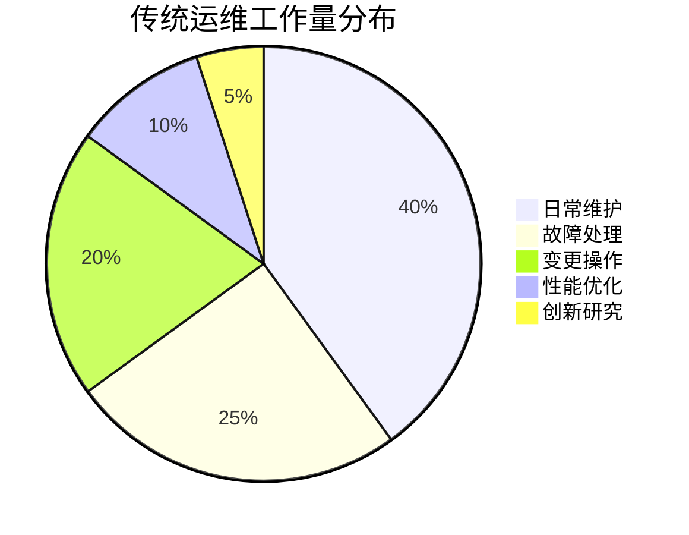

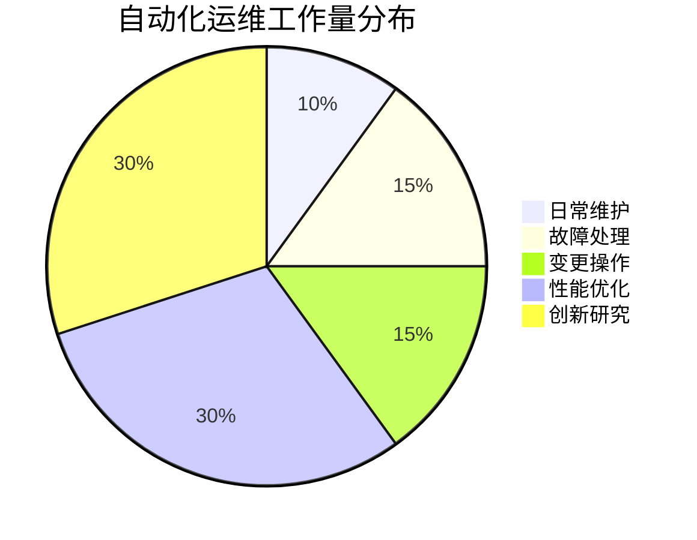

#### 1.1.2 时间效率提升

自动化运维显著缩短了各类运维任务的执行时间，加速了整个IT服务交付过程。

- **部署时间缩短**：传统手动部署可能需要数小时甚至数天，而自动化部署通常可以在几分钟内完成
- **问题响应加速**：自动化监控和告警可以实时发现问题，自动化修复可以在问题扩大前解决
- **变更执行加速**：标准化的自动化变更流程可以将变更时间从小时级缩短到分钟级

下表展示了某企业实施自动化运维前后的时间对比：

| 运维任务 | 传统手动方式 | 自动化方式 | 时间节约 |
|---------|------------|-----------|---------|
| 服务器部署 | 4-8小时 | 10-15分钟 | 95%+ |
| 应用发布 | 2-4小时 | 5-10分钟 | 90%+ |
| 数据库备份 | 1-2小时 | 自动执行 | 100% |
| 补丁更新 | 1-2天 | 30-60分钟 | 85%+ |
| 故障恢复 | 1-4小时 | 5-15分钟 | 90%+ |

#### 1.1.3 资源利用优化

自动化运维可以优化IT资源的分配和使用，提高资源利用率，降低基础设施成本。

- **动态资源调度**：根据实际负载自动扩展或收缩资源，避免资源浪费
- **闲置资源回收**：自动识别和回收闲置资源，降低运营成本
- **资源标准化**：通过基础设施即代码(IaC)实现资源配置的标准化，减少资源碎片

以下是某云平台实施自动化资源管理前后的资源利用率对比：

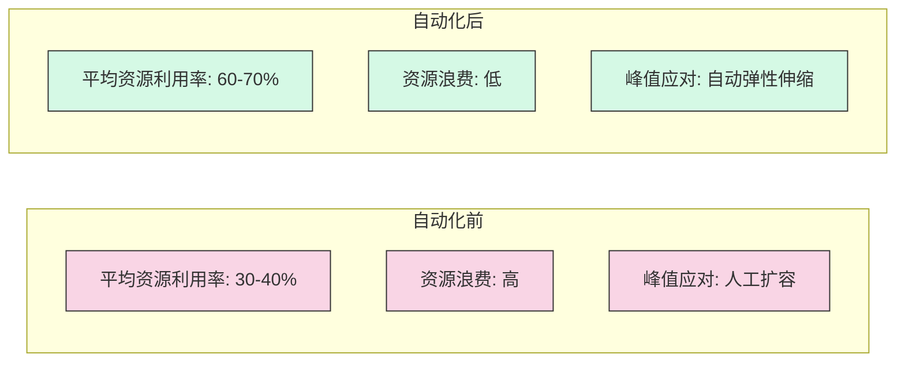

### 1.2 质量提升与风险降低

自动化运维通过标准化和一致性执行，显著提高了运维质量，降低了运维风险。

#### 1.2.1 一致性与标准化

自动化运维确保所有操作按照预定义的标准流程执行，消除了人为差异和错误。

- **操作标准化**：所有操作按照预定义的流程和标准执行，消除个人习惯差异
- **环境一致性**：通过代码定义环境，确保开发、测试和生产环境的一致性
- **配置标准化**：通过配置管理工具确保所有系统配置符合标准

标准化的自动化流程示例：

```yaml
# 应用部署自动化流程定义
name: Application Deployment
on:
  workflow_dispatch:
    inputs:
      version:
        description: 'Application version to deploy'
        required: true
      environment:
        description: 'Target environment'
        required: true
        default: 'staging'

jobs:
  deploy:
    runs-on: ubuntu-latest
    steps:
      - name: Checkout code
        uses: actions/checkout@v2
        
      - name: Setup environment
        run: |
          echo "Setting up environment for ${{ github.event.inputs.environment }}"
          # 环境准备脚本
          
      - name: Validate configuration
        run: |
          echo "Validating configuration for version ${{ github.event.inputs.version }}"
          # 配置验证脚本
          
      - name: Deploy application
        run: |
          echo "Deploying version ${{ github.event.inputs.version }} to ${{ github.event.inputs.environment }}"
          # 部署脚本
          
      - name: Run smoke tests
        run: |
          echo "Running smoke tests"
          # 冒烟测试脚本
          
      - name: Notify deployment status
        run: |
          echo "Sending deployment notification"
          # 通知脚本
```

#### 1.2.2 错误减少与问题预防

自动化运维可以显著减少人为错误，并通过主动监控和预防措施避免问题发生。

- **人为错误减少**：研究表明，自动化可以减少60%-90%的人为操作错误
- **一致性检查**：自动化工具可以持续检查系统配置和状态，确保符合预期
- **预防性维护**：通过自动化监控和分析，提前发现潜在问题并采取措施

错误率对比示例：

```mermaid
bar
    title 运维错误率对比(每100次操作)
    "手动变更" : 8.5
    "半自动变更" : 3.2
    "全自动变更" : 0.7
```

#### 1.2.3 合规性与安全性提升

自动化运维可以强化安全控制和合规管理，降低安全风险。

- **策略强制执行**：自动化工具可以强制执行安全策略和合规要求
- **变更审计**：自动记录所有变更操作，提供完整的审计跟踪
- **漏洞管理**：自动化扫描和修复安全漏洞，减少暴露时间

安全合规自动化示例：

```python
# 安全合规自动检查脚本示例
def check_compliance():
    # 检查密码策略
    password_policy = check_password_policy()
    # 检查防火墙规则
    firewall_rules = check_firewall_rules()
    # 检查访问控制
    access_control = check_access_control()
    # 检查加密设置
    encryption = check_encryption_settings()
    # 检查日志配置
    logging = check_logging_configuration()
    
    # 生成合规报告
    generate_compliance_report(
        password_policy,
        firewall_rules,
        access_control,
        encryption,
        logging
    )
    
    # 自动修复不合规项
    auto_remediate_non_compliance()
```

### 1.3 业务价值与竞争优势

自动化运维不仅提高了IT运维效率，更为业务创造了实质性价值和竞争优势。

#### 1.3.1 业务敏捷性提升

自动化运维使IT能够更快速地响应业务需求，支持业务创新和变革。

- **快速部署**：新功能和服务可以更快速地部署到生产环境
- **快速迭代**：支持敏捷开发和持续交付，加速产品迭代
- **快速扩展**：支持业务快速扩展，应对市场机会

业务响应时间对比：

| 业务需求 | 传统运维响应时间 | 自动化运维响应时间 | 改善幅度 |
|---------|---------------|-----------------|---------|
| 新产品上线 | 2-4周 | 1-3天 | 80-90% |
| 功能更新 | 1-2周 | 数小时 | 90-95% |
| 扩展容量 | 1-2周 | 分钟级 | 99%+ |
| 市场活动支持 | 1-2周 | 1-2天 | 70-85% |

#### 1.3.2 服务质量提升

自动化运维提高了IT服务的可用性、可靠性和性能，改善了用户体验。

- **系统可用性提高**：通过自动化监控和恢复，减少系统宕机时间
- **性能优化**：通过自动化性能监控和调优，提高系统响应速度
- **用户体验改善**：更稳定、更快速的系统提供更好的用户体验

服务质量指标改善示例：

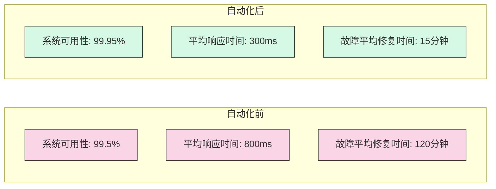

#### 1.3.3 创新能力增强

自动化运维释放了IT团队的创新潜力，支持业务创新和数字化转型。

- **资源转移**：从日常运维转向创新项目
- **实验能力**：快速创建和拆除环境，支持创新实验
- **技术赋能**：运维自动化技术可以赋能业务自动化

创新投入对比：

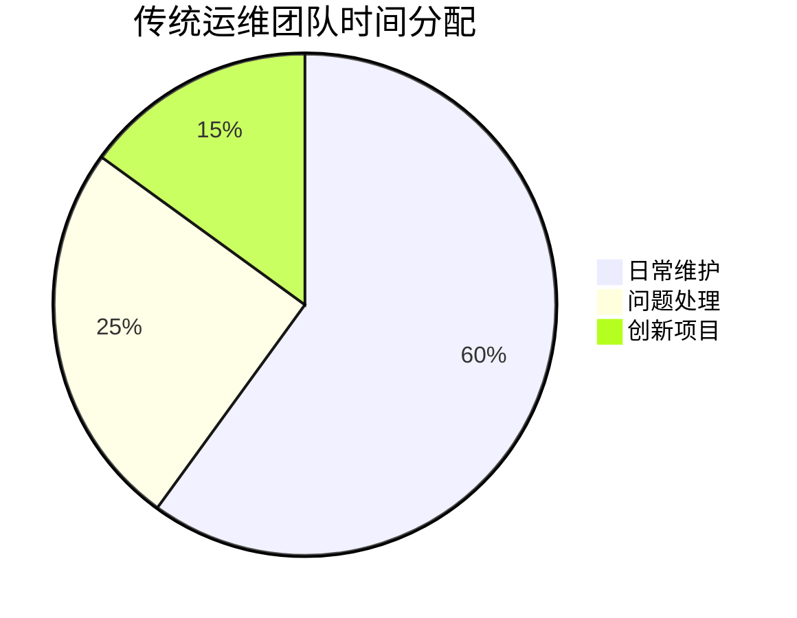

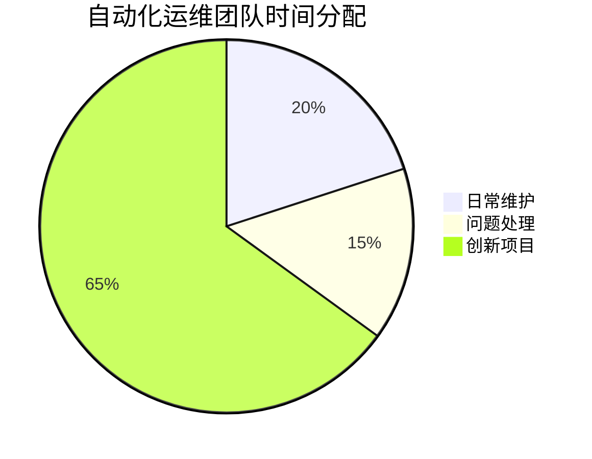

## 2. 自动化运维的投资回报分析

### 2.1 投资成本分析

实施自动化运维需要一定的初始投资和持续投入，主要包括以下几个方面：

#### 2.1.1 工具与平台成本

自动化运维需要各种工具和平台的支持，这些工具可能需要购买商业许可或者自行开发维护。

- **商业工具许可**：如监控工具、配置管理工具、自动化测试工具等的许可费用
- **云服务费用**：如使用云平台的CI/CD服务、监控服务等费用
- **基础设施成本**：支持自动化工具运行的服务器、存储等基础设施成本
- **定制开发成本**：针对特定需求的自动化工具开发成本

典型的自动化工具投资示例：

| 工具类型 | 开源选项 | 商业选项 | 年度成本估算(商业版) |
|---------|---------|---------|-------------------|
| 配置管理 | Ansible, Puppet | Ansible Tower, Puppet Enterprise | $10,000-$50,000 |
| CI/CD | Jenkins, GitLab CI | CircleCI, GitHub Actions | $5,000-$30,000 |
| 监控告警 | Prometheus, Grafana | Datadog, New Relic | $15,000-$100,000 |
| 日志管理 | ELK Stack | Splunk, Sumo Logic | $20,000-$150,000 |
| 容器编排 | Kubernetes | EKS, AKS, GKE | $10,000-$50,000 |
| 自动化测试 | Selenium, JMeter | Tricentis Tosca, Micro Focus UFT | $30,000-$100,000 |

#### 2.1.2 人力资源投入

实施自动化运维需要专业人才的投入，包括初始实施和持续维护的人力成本。

- **专业人才招聘**：招聘具备自动化技能的DevOps工程师、SRE等专业人才
- **团队培训**：对现有团队进行自动化技能培训
- **实施人力**：初始自动化实施阶段的人力投入
- **维护人力**：持续维护和优化自动化系统的人力投入

人力资源投入估算：

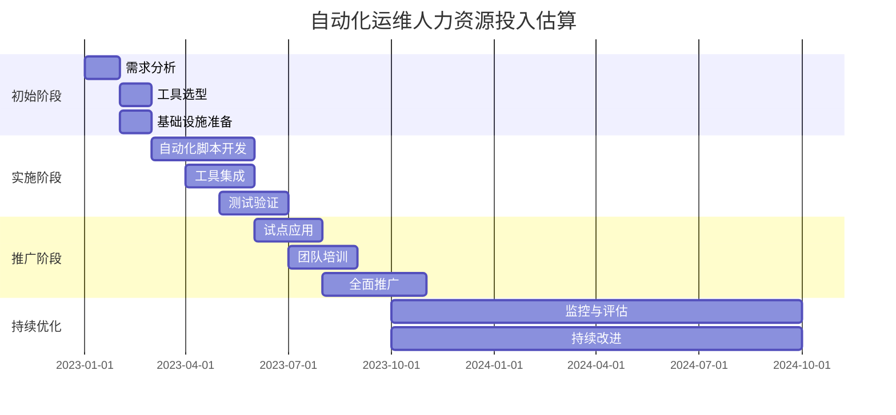

#### 2.1.3 转型与变革成本

自动化运维的实施通常伴随着组织和流程的变革，这些变革也会带来一定的成本。

- **流程重组**：重新设计和优化运维流程
- **组织调整**：调整团队结构和职责
- **文化转型**：培养自动化和DevOps文化
- **阻力克服**：克服组织内部对变革的阻力

变革管理投入估算：

| 变革管理活动 | 投入估算 | 持续时间 |
|------------|---------|---------|
| 变革愿景与规划 | 高管团队20%时间 | 1-2个月 |
| 流程重组与优化 | 专职团队3-5人 | 3-6个月 |
| 组织结构调整 | HR团队30%时间 | 2-3个月 |
| 文化建设与宣导 | 全员参与，专职2-3人 | 6-12个月 |
| 培训与赋能 | 每人3-5天培训 | 3-6个月 |
| 变革效果评估 | 专职团队1-2人 | 持续进行 |

### 2.2 收益量化分析

自动化运维带来的收益可以从多个维度进行量化分析，帮助组织评估投资回报。

#### 2.2.1 直接成本节约

自动化运维可以直接节约多种运营成本，这些节约可以相对容易地量化。

- **人力成本节约**：减少运维人员数量或避免增加人员
- **基础设施成本节约**：提高资源利用率，减少资源浪费
- **停机成本减少**：减少系统宕机时间和相关损失
- **问题修复成本降低**：减少问题数量和修复时间

直接成本节约计算示例：

```
# 人力成本节约计算
节约的人力成本 = 节约的人力数量 × 人均年薪

# 基础设施成本节约计算
基础设施成本节约 = 资源利用率提升百分比 × 年度基础设施成本

# 停机成本减少计算
停机成本减少 = 减少的停机时间 × 每小时停机成本

# 问题修复成本降低计算
问题修复成本降低 = 减少的问题数量 × 每个问题的平均修复成本
```

某企业实施自动化运维后的直接成本节约案例：

| 成本类型 | 自动化前 | 自动化后 | 年度节约 |
|---------|---------|---------|---------|
| 运维人员 | 20人 | 12人 | $800,000 |
| 服务器资源 | 利用率35% | 利用率70% | $300,000 |
| 系统停机 | 年均24小时 | 年均2小时 | $1,100,000 |
| 问题修复 | 年均200个 | 年均50个 | $450,000 |
| **总计** | | | **$2,650,000** |

#### 2.2.2 间接效益量化

自动化运维带来的一些间接效益虽然难以直接量化，但可以通过一定的方法进行估算。

- **上市时间缩短**：新产品和功能更快推向市场带来的收益
- **用户体验改善**：系统性能和可靠性提升带来的用户满意度和留存率提高
- **创新能力提升**：团队有更多时间和资源投入创新带来的价值
- **风险降低**：安全和合规性提升带来的风险降低

间接效益量化方法示例：

```
# 上市时间缩短带来的收益
上市时间收益 = 缩短的上市时间 × 每天产品收入

# 用户体验改善带来的收益
用户体验收益 = 用户数量 × 留存率提升百分比 × 用户生命周期价值

# 创新能力提升带来的收益
创新收益 = 新增创新项目数量 × 每个创新项目的平均价值

# 风险降低带来的收益
风险降低收益 = 降低的风险事件概率 × 风险事件的平均损失
```

#### 2.2.3 ROI计算模型

基于成本和收益分析，可以建立自动化运维的投资回报率(ROI)计算模型。

- **简单ROI计算**：
  ```
  ROI = (总收益 - 总成本) / 总成本 × 100%
  ```

- **净现值(NPV)计算**：考虑时间价值的ROI计算
  ```
  NPV = Σ(收益t - 成本t) / (1 + r)^t
  ```
  其中，t表示时间周期，r表示折现率

- **投资回收期计算**：
  ```
  投资回收期 = 初始投资 / 年度净收益
  ```

自动化运维ROI计算示例：

| 年份 | 投资成本 | 直接收益 | 间接收益 | 净收益 | 累计净收益 |
|-----|---------|---------|---------|-------|-----------|
| 第1年 | $1,000,000 | $500,000 | $300,000 | -$200,000 | -$200,000 |
| 第2年 | $400,000 | $1,200,000 | $800,000 | $1,600,000 | $1,400,000 |
| 第3年 | $300,000 | $1,500,000 | $1,000,000 | $2,200,000 | $3,600,000 |
| 第4年 | $300,000 | $1,800,000 | $1,200,000 | $2,700,000 | $6,300,000 |
| 第5年 | $300,000 | $2,000,000 | $1,500,000 | $3,200,000 | $9,500,000 |

5年ROI = ($9,500,000 / $2,300,000) × 100% = 413%
投资回收期 = 1 + (200,000 / 1,600,000) = 1.125年

### 2.3 案例分析与最佳实践

通过分析实际案例，可以更好地理解自动化运维的投资回报情况和最佳实践。

#### 2.3.1 行业案例分析

不同行业和规模的企业实施自动化运维的案例分析：

**案例1：大型电子商务平台**

- **背景**：年交易额超过10亿美元的电子商务平台，面临业务快速增长和季节性流量波动的挑战
- **自动化实施**：实施了基础设施自动化、CI/CD流水线、自动扩缩容、智能监控和自愈系统
- **投资**：两年内总投资约200万美元，包括工具、人力和培训
- **收益**：
  - 部署频率从每月2次提高到每天多次
  - 系统可用性从99.9%提高到99.99%
  - 资源利用率提高40%，节约基础设施成本约150万美元/年
  - 运维团队效率提升300%，支持业务增长而无需增加人员
  - 黑色星期五等峰值期间零宕机，增加销售额约500万美元/年
- **ROI**：投资回收期约9个月，3年ROI超过700%

**案例2：中型金融服务公司**

- **背景**：管理资产约50亿美元的金融服务公司，面临严格的合规要求和安全挑战
- **自动化实施**：实施了配置自动化、合规检查自动化、安全扫描自动化、变更管理自动化
- **投资**：18个月内总投资约100万美元
- **收益**：
  - 合规审计准备时间从4周减少到3天
  - 安全漏洞修复时间从平均15天减少到2天
  - 变更失败率从12%降低到2%
  - 避免了一次潜在的数据泄露事件，估计节约了约300万美元的损失
- **ROI**：投资回收期约15个月，3年ROI约350%

**案例3：小型软件开发公司**

- **背景**：50人规模的软件开发公司，提供SaaS解决方案，面临快速迭代和资源限制的挑战
- **自动化实施**：采用云原生工具链，实施轻量级自动化，包括GitHub Actions、AWS自动化服务等
- **投资**：12个月内总投资约20万美元，主要是人力成本
- **收益**：
  - 发布周期从2周缩短到2天
  - 开发人员生产力提升30%
  - 客户满意度提升25%，客户留存率提高15%
  - 新功能上市时间缩短60%，带来额外收入约50万美元/年
- **ROI**：投资回收期约5个月，2年ROI约500%

#### 2.3.2 ROI最大化策略

基于案例分析，总结提高自动化运维ROI的最佳实践：

1. **从高价值领域开始**：
   - 优先自动化重复性高、错误率高、价值明显的领域
   - 选择能够快速见效的"低垂果实"项目建立信心

2. **渐进式实施**：
   - 避免大爆炸式的全面自动化，采用渐进式方法
   - 每个阶段都要评估效果，调整策略

3. **标准化先行**：
   - 在自动化之前先标准化流程和环境
   - 标准化可以大幅降低自动化的复杂性和成本

4. **重用与共享**：
   - 构建可重用的自动化组件和模块
   - 建立自动化资产库，促进团队间共享

5. **持续优化**：
   - 定期评估自动化系统的效果和效率
   - 持续优化自动化流程，提高ROI

6. **全面衡量价值**：
   - 不仅关注直接成本节约，也要考虑间接效益
   - 建立全面的价值评估框架

## 3. 自动化运维的挑战分析

尽管自动化运维带来了巨大价值，但在实施过程中也面临着各种挑战。深入理解这些挑战，才能制定有效的应对策略。

### 3.1 技术挑战

自动化运维在技术层面面临多种挑战，这些挑战可能影响自动化的实施效果和进度。

#### 3.1.1 复杂性管理

自动化系统本身可能变得复杂，带来新的管理挑战。

- **自动化脚本维护**：随着自动化脚本数量增加，维护和管理变得复杂
- **依赖关系管理**：自动化组件之间的依赖关系可能变得复杂和难以管理
- **版本控制**：自动化代码和配置的版本控制和变更管理
- **调试难度**：自动化系统的问题诊断和调试可能比手动操作更复杂

复杂性管理的挑战示例：

```mermaid
graph TD
    A[自动化脚本] --> B[依赖库1]
    A --> C[依赖库2]
    B --> D[系统组件1]
    B --> E[系统组件2]
    C --> E
    C --> F[系统组
让我继续完成自动化运维价值与挑战的内容：

#### 3.1.1 复杂性管理（续）

复杂性管理的挑战示例：

```mermaid
graph TD
    A[自动化脚本] --> B[依赖库1]
    A --> C[依赖库2]
    B --> D[系统组件1]
    B --> E[系统组件2]
    C --> E
    C --> F[系统组件3]
    D --> G[基础设施服务1]
    E --> G
    E --> H[基础设施服务2]
    F --> H
    
    style A fill:#f9d5e5,stroke:#333,stroke-width:1px
    style B fill:#eeac99,stroke:#333,stroke-width:1px
    style C fill:#eeac99,stroke:#333,stroke-width:1px
    style D fill:#d5f9e5,stroke:#333,stroke-width:1px
    style E fill:#d5f9e5,stroke:#333,stroke-width:1px
    style F fill:#d5f9e5,stroke:#333,stroke-width:1px
    style G fill:#6497b1,stroke:#333,stroke-width:1px
    style H fill:#6497b1,stroke:#333,stroke-width:1px
```

#### 3.1.2 异构环境集成

现代IT环境通常是异构的，包含不同的操作系统、平台和技术栈，这给自动化带来了挑战。

- **多平台支持**：需要支持Windows、Linux、Unix等不同操作系统
- **遗留系统集成**：需要将难以自动化的遗留系统纳入自动化流程
- **多云环境管理**：需要跨AWS、Azure、GCP等多个云平台实现一致的自动化
- **API兼容性**：不同系统和服务的API可能不兼容或缺乏标准化

异构环境自动化挑战示例：

```python
# 跨平台自动化脚本示例及其挑战
def deploy_application(environment):
    if environment.os_type == "Windows":
        # Windows特定部署逻辑
        run_powershell_command("Deploy-Application.ps1")
    elif environment.os_type == "Linux":
        # Linux特定部署逻辑
        run_bash_command("./deploy_application.sh")
    elif environment.os_type == "Legacy_Unix":
        # 遗留Unix系统可能需要特殊处理
        connect_via_ssh()
        run_custom_commands()
        disconnect()
    else:
        raise UnsupportedPlatformError(f"不支持的平台: {environment.os_type}")
    
    # 云平台特定逻辑
    if environment.cloud_provider == "AWS":
        aws_client.update_service()
    elif environment.cloud_provider == "Azure":
        azure_client.update_deployment()
    elif environment.cloud_provider == "GCP":
        gcp_client.update_instance()
    elif environment.cloud_provider == "OnPremise":
        # 本地数据中心特定逻辑
        update_local_load_balancer()
    else:
        raise UnsupportedCloudError(f"不支持的云平台: {environment.cloud_provider}")
```

#### 3.1.3 安全与合规风险

自动化运维可能引入新的安全和合规风险，需要特别关注。

- **权限管理**：自动化工具通常需要高级权限，可能增加安全风险
- **凭证管理**：自动化过程中需要安全地管理和使用各种凭证
- **审计与追踪**：确保所有自动化操作可审计和追踪
- **合规要求**：确保自动化流程符合行业和监管合规要求

安全风险示例：

```yaml
# 自动化流水线中的安全风险示例
pipeline:
  stages:
    - name: 构建
      steps:
        - name: 检出代码
          uses: actions/checkout@v2
          # 风险：源代码访问权限控制
          
        - name: 安装依赖
          run: npm install
          # 风险：供应链攻击，恶意依赖包
          
    - name: 测试
      steps:
        - name: 运行测试
          run: npm test
          # 风险：测试可能暴露敏感数据
          
    - name: 部署
      steps:
        - name: 配置AWS凭证
          uses: aws-actions/configure-aws-credentials@v1
          with:
            aws-access-key-id: ${{ secrets.AWS_ACCESS_KEY_ID }}
            aws-secret-access-key: ${{ secrets.AWS_SECRET_ACCESS_KEY }}
            # 风险：凭证泄露，权限过大
            
        - name: 部署到生产
          run: aws s3 sync ./build s3://production-website
          # 风险：未经审批的生产环境变更
```

### 3.2 组织与人员挑战

自动化运维不仅是技术变革，也是组织和人员的变革，这方面的挑战往往比技术挑战更难解决。

#### 3.2.1 技能缺口与学习曲线

自动化运维需要新的技能和知识，现有团队可能面临技能缺口。

- **编程技能需求**：自动化需要编程和脚本编写能力
- **新工具学习**：需要学习和掌握各种自动化工具
- **系统思维**：需要从系统和流程的角度思考问题
- **持续学习压力**：技术快速发展，需要不断学习新知识

技能需求变化示例：

| 传统运维技能 | 自动化运维技能 | 技能差距 |
|------------|--------------|---------|
| 手动服务器配置 | 基础设施即代码(IaC) | 编程、版本控制、配置管理工具 |
| 手动问题排查 | 自动化监控与告警 | 监控工具、数据分析、阈值设置 |
| 手动部署应用 | CI/CD流水线 | CI/CD工具、容器技术、自动化测试 |
| 手动变更管理 | 自动化变更流程 | 流程设计、自动化审批、风险评估 |
| 单一技术专长 | 全栈技术知识 | 跨领域学习、系统集成能力 |

#### 3.2.2 抵抗变革与文化冲突

自动化运维通常会遇到组织内部的抵抗和文化冲突。

- **工作安全感担忧**：员工可能担心自动化会导致裁员
- **角色转变不适**：从手动操作转向编写自动化代码的角色转变
- **控制权丧失感**：自动化可能让一些人感觉失去了对系统的控制
- **传统与创新文化冲突**：稳定性优先vs创新优先的文化冲突

变革抵抗的常见表现：

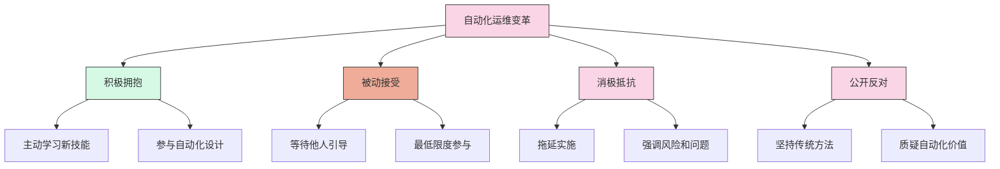

#### 3.2.3 组织结构与职责调整

自动化运维通常需要调整组织结构和职责分配，这可能带来挑战。

- **团队重组**：从功能型团队向跨职能团队转变
- **职责重新定义**：开发、运维、安全等角色的职责边界模糊
- **新角色创建**：需要创建DevOps工程师、SRE等新角色
- **绩效评估调整**：需要调整绩效评估标准以适应新的工作方式

组织结构变化示例：

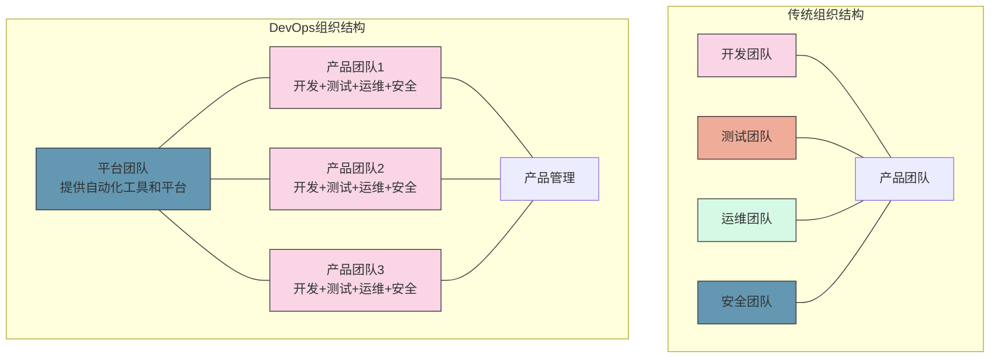

### 3.3 流程与管理挑战

自动化运维需要重新设计和管理流程，这方面也面临诸多挑战。

#### 3.3.1 流程重设计与标准化

自动化运维需要重新设计和标准化流程，这可能面临以下挑战：

- **流程复杂性**：现有流程可能过于复杂，难以自动化
- **流程标准化**：不同团队和系统的流程可能不一致，需要标准化
- **例外情况处理**：自动化流程需要处理各种例外情况
- **流程优化与自动化平衡**：是先优化流程再自动化，还是边自动化边优化

流程重设计挑战示例：

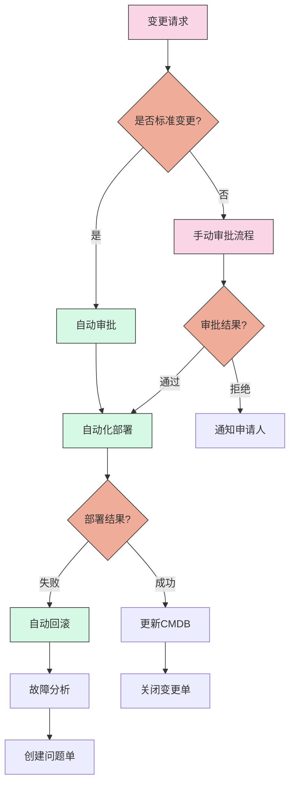

#### 3.3.2 变更与风险管理

自动化运维改变了传统的变更和风险管理方式，带来新的挑战。

- **变更速度与控制平衡**：如何在提高变更速度的同时保持适当的控制
- **风险评估自动化**：如何自动化评估变更风险
- **回滚机制**：如何设计有效的自动回滚机制
- **合规性保证**：如何确保自动化变更符合合规要求

变更风险管理策略示例：

```yaml
# 基于风险的变更管理策略示例
变更类型:
  低风险变更:
    - 描述: 不影响用户体验的配置修改
    - 审批流程: 自动审批
    - 实施时间: 任何时间
    - 测试要求: 自动化测试通过
    - 回滚策略: 自动回滚
    
  中风险变更:
    - 描述: 可能短暂影响部分用户的功能更新
    - 审批流程: 技术主管审批
    - 实施时间: 非高峰时段
    - 测试要求: 自动化测试+冒烟测试
    - 回滚策略: 自动回滚+手动确认
    
  高风险变更:
    - 描述: 架构调整或可能广泛影响用户的重大更新
    - 审批流程: 变更审核委员会审批
    - 实施时间: 计划维护窗口
    - 测试要求: 全面测试+灰度发布
    - 回滚策略: 详细的回滚计划+演练
```

#### 3.3.3 知识管理与文档

自动化运维需要有效的知识管理和文档，这方面也面临挑战。

- **知识转化**：将隐性知识转化为显性知识和自动化代码
- **文档维护**：保持文档与自动化代码的同步更新
- **知识共享**：促进团队间的知识共享和协作
- **学习曲线**：降低新团队成员的学习曲线

知识管理策略示例：

```markdown
# 自动化运维知识管理框架

## 1. 代码即文档
- 自动化代码应当自文档化，包含清晰的注释和说明
- 使用工具自动从代码生成文档
- 代码审查过程中检查文档质量

## 2. 集中式知识库
- 建立Wiki或知识管理系统
- 记录架构决策、设计模式和最佳实践
- 维护常见问题解决方案和故障排除指南

## 3. 版本控制
- 文档与代码一起版本控制
- 使用Markdown等易于版本控制的格式
- 实施文档审查流程

## 4. 知识共享机制
- 定期技术分享会
- 结对编程和代码审查
- 内部技术博客和案例分享

## 5. 培训与赋能
- 新员工入职培训计划
- 技能提升路径
- 认证和学习资源
```

## 4. 自动化运维的应对策略

面对自动化运维的各种挑战，组织需要制定有效的应对策略，以最大化自动化价值，降低实施风险。

### 4.1 技术策略

针对技术挑战的应对策略，帮助组织克服技术障碍，构建可靠的自动化系统。

#### 4.1.1 模块化与可重用设计

采用模块化和可重用的设计方法，降低自动化系统的复杂性。

- **组件化设计**：将自动化系统拆分为独立的组件，每个组件负责特定功能
- **标准接口**：定义标准接口，确保组件之间的互操作性
- **可重用模块**：构建可重用的自动化模块，避免重复开发
- **抽象层**：创建抽象层，隔离底层系统差异

模块化设计示例：

```python
# 模块化自动化框架示例

# 基础设施抽象层
class InfrastructureProvider:
    def provision_server(self, config):
        pass
    
    def deprovision_server(self, server_id):
        pass
    
    def update_server(self, server_id, config):
        pass

# 具体实现类
class AWSProvider(InfrastructureProvider):
    def provision_server(self, config):
        # AWS特定实现
        pass
    
class AzureProvider(InfrastructureProvider):
    def provision_server(self, config):
        # Azure特定实现
        pass

# 配置管理抽象层
class ConfigurationManager:
    def apply_configuration(self, server, config):
        pass
    
    def validate_configuration(self, server, config):
        pass

# 具体实现类
class AnsibleManager(ConfigurationManager):
    def apply_configuration(self, server, config):
        # Ansible特定实现
        pass

# 部署抽象层
class DeploymentManager:
    def deploy_application(self, server, application, version):
        pass
    
    def rollback_deployment(self, server, application, version):
        pass

# 自动化流程协调器
class AutomationOrchestrator:
    def __init__(self, infra_provider, config_manager, deploy_manager):
        self.infra_provider = infra_provider
        self.config_manager = config_manager
        self.deploy_manager = deploy_manager
    
    def provision_and_deploy(self, infra_config, server_config, application, version):
        # 协调完整的自动化流程
        server = self.infra_provider.provision_server(infra_config)
        self.config_manager.apply_configuration(server, server_config)
        self.deploy_manager.deploy_application(server, application, version)
        return server
```

#### 4.1.2 渐进式自动化策略

采用渐进式方法实施自动化，降低风险和复杂性。

- **分阶段实施**：将自动化分为多个阶段，逐步实施
- **优先级排序**：优先自动化高价值、低风险的流程
- **增量改进**：持续改进自动化系统，而非一次性完成
- **混合模式**：在过渡期采用人工与自动化混合的模式

渐进式自动化路线图示例：

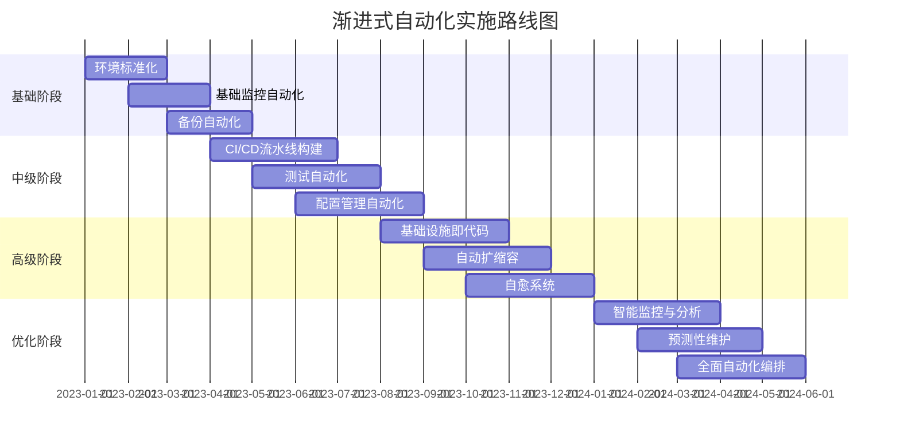

#### 4.1.3 标准化与兼容性策略

通过标准化和兼容性策略，解决异构环境的自动化挑战。

- **标准API封装**：为不同系统提供标准化的API封装
- **适配器模式**：使用适配器模式处理不同系统的差异
- **中间件集成**：使用集成中间件连接不同系统
- **容器化策略**：使用容器技术提供一致的运行环境

标准化策略示例：

```java
// 标准化API封装示例

// 标准化存储服务接口
public interface StorageService {
    void uploadFile(String localPath, String remotePath);
    void downloadFile(String remotePath, String localPath);
    void deleteFile(String remotePath);
    List<String> listFiles(String remotePath);
}

// AWS S3实现
public class S3StorageService implements StorageService {
    private AmazonS3 s3Client;
    
    public S3StorageService(String accessKey, String secretKey) {
        // 初始化S3客户端
        this.s3Client = AmazonS3ClientBuilder.standard()
            .withCredentials(new AWSStaticCredentialsProvider(
                new BasicAWSCredentials(accessKey, secretKey)))
            .build();
    }
    
    @Override
    public void uploadFile(String localPath, String remotePath) {
        // S3特定实现
    }
    
    // 其他方法实现...
}

// Azure Blob Storage实现
public class AzureBlobStorageService implements StorageService {
    private BlobServiceClient blobServiceClient;
    
    public AzureBlobStorageService(String connectionString) {
        // 初始化Azure Blob客户端
        this.blobServiceClient = new BlobServiceClientBuilder()
            .connectionString(connectionString)
            .buildClient();
    }
    
    @Override
    public void uploadFile(String localPath, String remotePath) {
        // Azure Blob特定实现
    }
    
    // 其他方法实现...
}

// 本地文件系统实现
public class LocalFileStorageService implements StorageService {
    private String rootDirectory;
    
    public LocalFileStorageService(String rootDirectory) {
        this.rootDirectory = rootDirectory;
    }
    
    @Override
    public void uploadFile(String localPath, String remotePath) {
        // 本地文件系统特定实现
    }
    
    // 其他方法实现...
}
```

#### 4.1.4 安全与合规策略

将安全和合规要求集成到自动化流程中，降低安全风险。

- **安全即代码**：将安全策略和控制编码化，集成到自动化流程
- **最小权限原则**：为自动化系统分配最小必要权限
- **密钥管理**：使用专业的密钥管理系统保护凭证
- **自动化合规检查**：自动化检查和验证合规要求

安全策略示例：

```yaml
# 自动化安全策略示例

# 凭证管理
credentials:
  storage: "vault"  # 使用HashiCorp Vault存储凭证
  rotation: "automatic"  # 自动轮换凭证
  access_control: "role-based"  # 基于角色的访问控制
  
# 权限管理
permissions:
  principle: "least-privilege"  # 最小权限原则
  temporary: true  # 临时提升权限
  just-in-time: true  # 即时访问
  
# 审计与日志
auditing:
  level: "all-actions"  # 记录所有操作
  storage: "immutable"  # 不可变存储
  retention: "1-year"  # 保留期限
  
# 安全检查
security_checks:
  pre_deployment:
    - "code_scan"  # 代码安全扫描
    - "dependency_check"  # 依赖项检查
    - "image_scan"  # 容器镜像扫描
  
  runtime:
    - "configuration_validation"  # 配置验证
    - "compliance_check"  # 合规性检查
    - "vulnerability_scan"  # 漏洞扫描
  
# 事件响应
incident_response:
  detection: "automated"  # 自动检测安全事件
  containment: "automated"  # 自动隔离
  remediation: "guided"  # 引导式修复
```

### 4.2 组织与人员策略

针对组织和人员挑战的应对策略，帮助组织顺利完成自动化转型。

#### 4.2.1 技能发展与培训

投资技能发展和培训，帮助团队掌握自动化所需的技能。

- **技能评估**：评估现有技能和技能缺口
- **培训计划**：制定针对性的培训计划
- **学习路径**：为不同角色设计学习路径
- **实践学习**：通过实际项目学习自动化技能

技能发展路径示例：

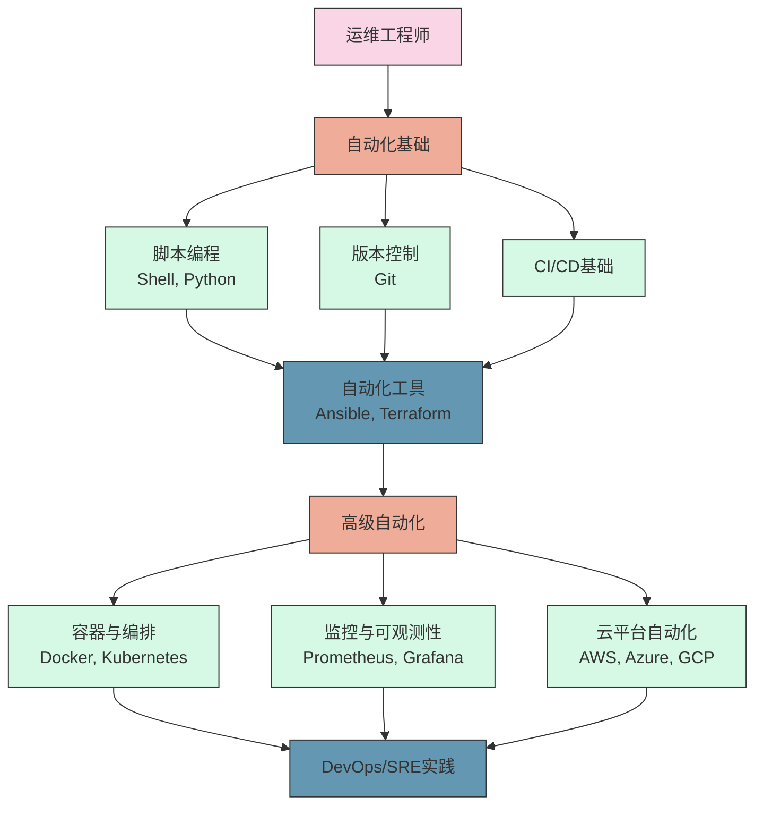

#### 4.2.2 变革管理与文化建设

有效的变革管理和文化建设，降低变革阻力，促进自动化接受。

- **变革愿景**：明确自动化变革的愿景和目标
- **沟通策略**：制定有效的沟通策略，解释变革的必要性和好处
- **参与式变革**：让团队参与自动化设计和实施
- **文化建设**：培养支持自动化的文化和价值观

变革管理框架示例：

```markdown
# 自动化运维变革管理框架

## 1. 准备阶段
- 明确变革愿景和目标
- 评估组织准备度
- 识别变革推动者和阻力来源
- 制定变革策略和计划

## 2. 参与阶段
- 沟通变革愿景和计划
- 解释变革的必要性和好处
- 回应疑虑和问题
- 获取关键利益相关者的支持

## 3. 实施阶段
- 提供必要的培训和资源
- 建立早期成功案例
- 庆祝和宣传成功
- 持续沟通进展和成果

## 4. 巩固阶段
- 制度化新的工作方式
- 调整绩效评估和激励机制
- 持续改进和优化
- 分享经验和最佳实践
```

#### 4.2.3 组织结构与角色调整

调整组织结构和角色定义，支持自动化运维的实施。

- **跨职能团队**：组建跨职能团队，打破传统部门边界
- **新角色定义**：定义DevOps工程师、自动化专
让我继续完成自动化运维价值与挑战的内容：

#### 4.2.3 组织结构与角色调整（续）

调整组织结构和角色定义，支持自动化运维的实施。

- **跨职能团队**：组建跨职能团队，打破传统部门边界
- **新角色定义**：定义DevOps工程师、自动化专家等新角色
- **职责重新分配**：重新分配开发、运维、安全等职责
- **矩阵式管理**：采用矩阵式管理模式，平衡专业能力和产品导向

组织结构调整示例：

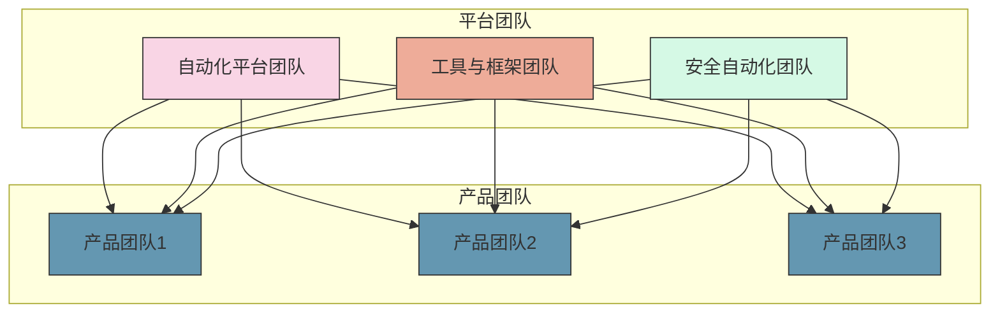

新角色定义示例：

| 角色 | 主要职责 | 核心技能 |
|-----|---------|---------|
| 自动化架构师 | 设计自动化架构和框架，制定自动化标准 | 系统架构、自动化工具、最佳实践 |
| DevOps工程师 | 构建和维护CI/CD流水线，实施自动化工具 | 编程、CI/CD、容器技术 |
| SRE工程师 | 确保系统可靠性，实施自动化监控和自愈 | 系统可靠性、监控、故障管理 |
| 平台工程师 | 构建和维护内部开发平台和工具 | 平台设计、API开发、用户体验 |
| 自动化测试专家 | 设计和实施自动化测试框架和策略 | 测试自动化、测试框架、质量保证 |

### 4.3 流程与管理策略

针对流程和管理挑战的应对策略，帮助组织优化流程，提高自动化效果。

#### 4.3.1 流程优化与简化

在自动化之前优化和简化流程，提高自动化的效果和效率。

- **价值流映射**：使用价值流映射识别和消除浪费
- **流程简化**：简化复杂流程，减少不必要的步骤
- **标准化流程**：标准化常见流程，便于自动化
- **持续改进**：建立持续改进机制，不断优化流程

流程优化方法示例：

```markdown
# 流程优化方法论

## 1. 流程分析
- 绘制当前流程图
- 识别每个步骤的价值
- 测量流程指标（时间、成本、质量）
- 识别瓶颈和浪费

## 2. 流程简化
- 消除非增值步骤
- 合并相似步骤
- 并行化独立步骤
- 减少交接点和等待

## 3. 流程标准化
- 定义标准操作程序
- 创建流程模板
- 建立决策规则
- 定义例外处理流程

## 4. 流程自动化
- 确定自动化范围
- 选择适当的自动化工具
- 实施自动化
- 监控和优化自动化流程

## 5. 持续改进
- 定期评审流程绩效
- 收集反馈和改进建议
- 实施改进措施
- 更新流程文档和培训
```

#### 4.3.2 风险管理与控制

建立有效的风险管理和控制机制，平衡自动化速度和安全性。

- **风险分类**：根据影响和概率分类风险
- **分级控制**：根据风险级别实施不同的控制措施
- **自动化控制**：将控制措施自动化，减少人工干预
- **持续监控**：持续监控风险指标，及时发现问题

风险管理框架示例：

```yaml
# 自动化运维风险管理框架

# 风险分类
risk_categories:
  - 技术风险
  - 安全风险
  - 合规风险
  - 运营风险
  - 人员风险

# 风险评估矩阵
risk_assessment_matrix:
  impact:
    - 低: "影响单个用户或功能"
    - 中: "影响多个用户或功能"
    - 高: "影响关键业务功能"
    - 严重: "影响整个系统或业务"
  
  likelihood:
    - 低: "几乎不可能发生"
    - 中: "可能发生"
    - 高: "很可能发生"
    - 极高: "几乎肯定发生"

# 控制措施
control_measures:
  低风险:
    - 自动化控制
    - 定期审查
  
  中风险:
    - 自动化控制
    - 自动化测试
    - 变更前审查
  
  高风险:
    - 自动化控制
    - 全面测试
    - 正式审批
    - 分阶段实施
  
  极高风险:
    - 全面风险评估
    - 高级管理层审批
    - 详细实施计划
    - 全面测试和验证
    - 回滚计划

# 监控与报告
monitoring:
  frequency: "实时"
  metrics:
    - 变更成功率
    - 自动化覆盖率
    - 安全事件数量
    - 合规违规数量
  
  alerts:
    - 变更失败
    - 安全违规
    - 性能异常
    - 合规违规
```

#### 4.3.3 知识管理与协作

建立有效的知识管理和协作机制，促进自动化知识的共享和传播。

- **知识库建设**：建立集中的自动化知识库
- **文档即代码**：将文档作为代码管理，确保文档与代码同步
- **协作平台**：使用协作平台促进知识共享
- **社区建设**：建立内部自动化社区，促进经验交流

知识管理策略示例：

```markdown
# 自动化运维知识管理策略

## 1. 知识捕获
- 自动化代码注释和文档
- 问题解决方案记录
- 经验教训总结
- 最佳实践收集

## 2. 知识组织
- 分类体系建设
- 标签和元数据管理
- 搜索和发现机制
- 版本控制和历史记录

## 3. 知识共享
- 内部Wiki和知识库
- 技术博客和案例分享
- 代码和配置示例库
- 培训材料和学习路径

## 4. 知识应用
- 自助服务门户
- 决策支持系统
- 自动化建议引擎
- 知识图谱和关联分析

## 5. 知识更新
- 定期内容审查
- 反馈收集和改进
- 过时内容归档
- 新知识整合
```

## 5. 自动化运维的未来趋势

自动化运维领域正在快速发展，新的技术和方法不断涌现。了解未来趋势，有助于组织制定前瞻性的自动化战略。

### 5.1 AIOps与智能自动化

人工智能和机器学习正在深刻改变自动化运维的方式，带来更智能、更主动的自动化能力。

#### 5.1.1 AIOps的核心能力

AIOps（人工智能运维）将AI技术应用于IT运维，提供以下核心能力：

- **异常检测**：使用机器学习识别系统异常和潜在问题
- **根因分析**：自动分析问题根因，加速故障排除
- **预测性维护**：预测潜在故障，实施主动维护
- **智能决策**：提供数据驱动的决策建议

AIOps架构示例：

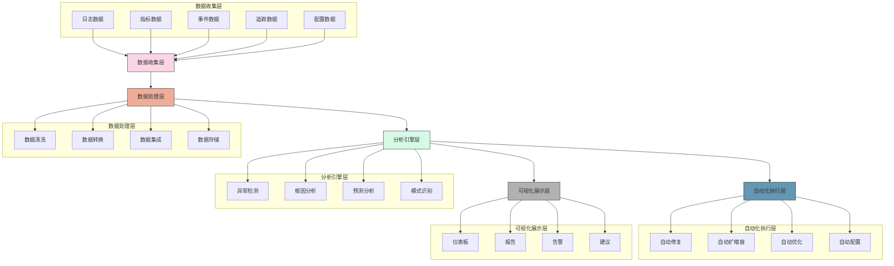

#### 5.1.2 智能自动化应用场景

智能自动化在运维领域的应用场景不断扩展：

- **智能监控**：自动调整监控阈值，减少误报
- **智能故障管理**：自动诊断和修复常见故障
- **智能容量规划**：预测资源需求，优化资源分配
- **智能安全防护**：识别安全威胁，自动响应安全事件

智能自动化应用示例：

```python
# 智能监控阈值调整示例
def adaptive_threshold_adjustment(metric_name, metric_data, current_threshold):
    # 加载历史数据
    historical_data = load_historical_data(metric_name)
    
    # 合并当前数据
    all_data = merge_data(historical_data, metric_data)
    
    # 使用机器学习模型预测正常范围
    model = load_ml_model(metric_name)
    normal_range = model.predict_normal_range(all_data)
    
    # 计算新阈值
    new_threshold = calculate_optimal_threshold(normal_range)
    
    # 如果新阈值与当前阈值差异显著，则更新
    if abs(new_threshold - current_threshold) / current_threshold > 0.2:
        update_threshold(metric_name, new_threshold)
        log_threshold_change(metric_name, current_threshold, new_threshold)
    
    return new_threshold
```

#### 5.1.3 AIOps实施挑战与策略

实施AIOps面临的挑战和应对策略：

- **数据质量挑战**：确保数据的完整性、准确性和一致性
- **模型训练挑战**：获取足够的训练数据，特别是故障数据
- **人才缺口**：需要同时具备IT运维和数据科学技能的人才
- **信任与透明**：确保AI决策的可解释性和透明度

AIOps实施路线图：

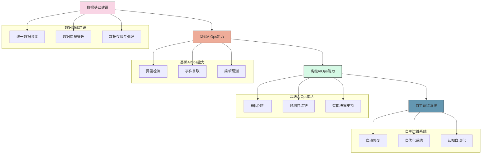

### 5.2 NoOps与自治系统

NoOps（无运维）代表了自动化运维的终极目标，即系统能够自我管理，最小化人工干预。

#### 5.2.1 NoOps的概念与目标

NoOps的核心概念和目标：

- **自我管理**：系统能够自我监控、自我修复、自我优化
- **零接触运维**：最小化或消除人工运维干预
- **开发者自助**：开发者可以自助完成部署和运维任务
- **运维即服务**：将运维能力作为服务提供给开发团队

NoOps与传统运维模式对比：

| 特性 | 传统运维 | DevOps | NoOps |
|-----|---------|-------|-------|
| 运维职责 | 专职运维团队 | 开发和运维共同负责 | 系统自我管理，开发者自助 |
| 自动化程度 | 低到中等 | 中等到高 | 极高 |
| 人工干预 | 频繁 | 有限 | 极少或无 |
| 部署频率 | 低 | 高 | 随需应变 |
| 基础设施 | 手动管理 | 基础设施即代码 | 自管理基础设施 |
| 监控与告警 | 被动响应 | 主动监控 | 自动检测和修复 |
| 扩展能力 | 手动扩展 | 自动扩展 | 自优化扩展 |

#### 5.2.2 自治系统的关键技术

实现自治系统的关键技术：

- **自愈架构**：系统能够自动检测和修复故障
- **自适应扩展**：根据负载自动调整资源
- **自优化配置**：自动优化系统配置以提高性能
- **自我保护**：自动检测和响应安全威胁

自治系统架构示例：

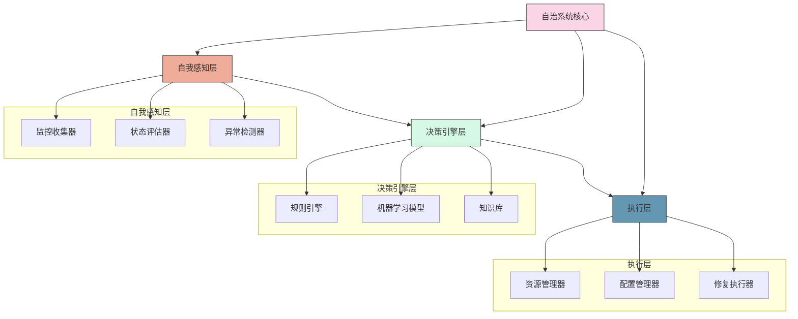

#### 5.2.3 NoOps的实施路径

实现NoOps的渐进式路径：

- **平台工程**：构建内部开发者平台，抽象复杂性
- **服务网格**：使用服务网格管理服务通信和治理
- **无服务器架构**：采用无服务器架构减少基础设施管理
- **SRE实践**：实施SRE实践，使用错误预算管理可靠性

NoOps实施路径示例：

```markdown
# NoOps实施路径

## 第一阶段：基础自动化
- 实现基础设施即代码
- 构建CI/CD流水线
- 自动化监控和告警
- 标准化环境和配置

## 第二阶段：高级自动化
- 实现自动扩缩容
- 构建自动化测试框架
- 实现配置自动化
- 建立自动化事件响应

## 第三阶段：智能运维
- 实施AIOps能力
- 构建预测性维护系统
- 实现智能根因分析
- 建立自动化决策支持

## 第四阶段：自治系统
- 构建自愈架构
- 实现自优化系统
- 建立开发者自助平台
- 实现零接触运维
```

### 5.3 平台工程与开发者体验

平台工程是实现自动化运维的重要趋势，通过构建内部开发者平台，提升开发者体验，加速软件交付。

#### 5.3.1 平台工程的核心理念

平台工程的核心理念和目标：

- **抽象复杂性**：隐藏底层基础设施和运维复杂性
- **自助服务**：提供自助服务能力，减少依赖和等待
- **标准化**：标准化环境、工具和流程
- **开发者体验**：优化开发者体验，提高生产力

平台工程与传统运维的区别：

| 特性 | 传统运维 | 平台工程 |
|-----|---------|---------|
| 服务模式 | 请求响应 | 自助服务 |
| 关注点 | 系统稳定性 | 开发者体验 |
| 交付方式 | 项目交付 | 产品交付 |
| 团队结构 | 职能团队 | 产品团队 |
| 用户关系 | 服务提供者-消费者 | 产品团队-客户 |
| 改进驱动 | 问题驱动 | 用户反馈驱动 |

#### 5.3.2 内部开发者平台

内部开发者平台的关键组件和功能：

- **自助服务门户**：提供统一的自助服务入口
- **服务目录**：提供可发现和可消费的服务
- **环境管理**：自动化环境创建和管理
- **CI/CD流水线**：提供标准化的CI/CD流水线
- **监控与可观测性**：提供统一的监控和可观测性能力

内部开发者平台架构示例：

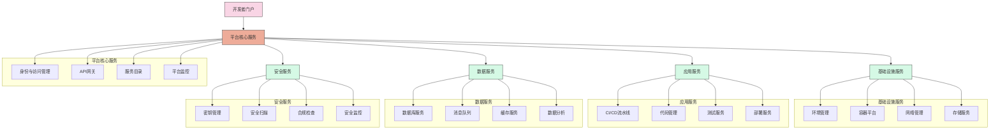

#### 5.3.3 开发者体验优化

优化开发者体验的关键策略：

- **简化流程**：减少开发者的等待和摩擦
- **工具集成**：提供集成的开发工具链
- **文档与支持**：提供高质量的文档和支持
- **反馈循环**：建立快速的反馈循环

开发者体验优化框架：

```markdown
# 开发者体验优化框架

## 1. 开发者旅程映射
- 识别开发者旅程的各个阶段
- 发现痛点和摩擦点
- 确定优化机会
- 设定体验目标

## 2. 自助服务能力
- 环境自助创建
- 代码自助部署
- 资源自助申请
- 问题自助诊断

## 3. 工具与集成
- IDE集成
- 命令行工具
- API和SDK
- 插件和扩展

## 4. 文档与学习
- 交互式文档
- 代码示例
- 教程和指南
- 知识库和FAQ

## 5. 反馈与改进
- 使用数据收集
- 满意度调查
- 用户访谈
- 持续改进机制
```

## 6. 结论与建议

自动化运维是数字化转型的关键支撑，带来了显著的价值，同时也面临诸多挑战。组织需要制定全面的自动化战略，平衡价值和风险，实现自动化运维的最大价值。

### 6.1 自动化运维的价值总结

自动化运维的价值可以从多个维度进行总结：

- **效率提升**：减少手动工作，提高运维效率，释放人力资源
- **质量改善**：减少人为错误，提高系统可靠性和稳定性
- **速度加快**：加速交付周期，支持快速迭代和创新
- **成本降低**：优化资源利用，降低运维成本
- **风险降低**：提高安全性和合规性，降低运营风险
- **创新赋能**：释放团队创新潜力，支持业务创新

自动化运维价值矩阵：

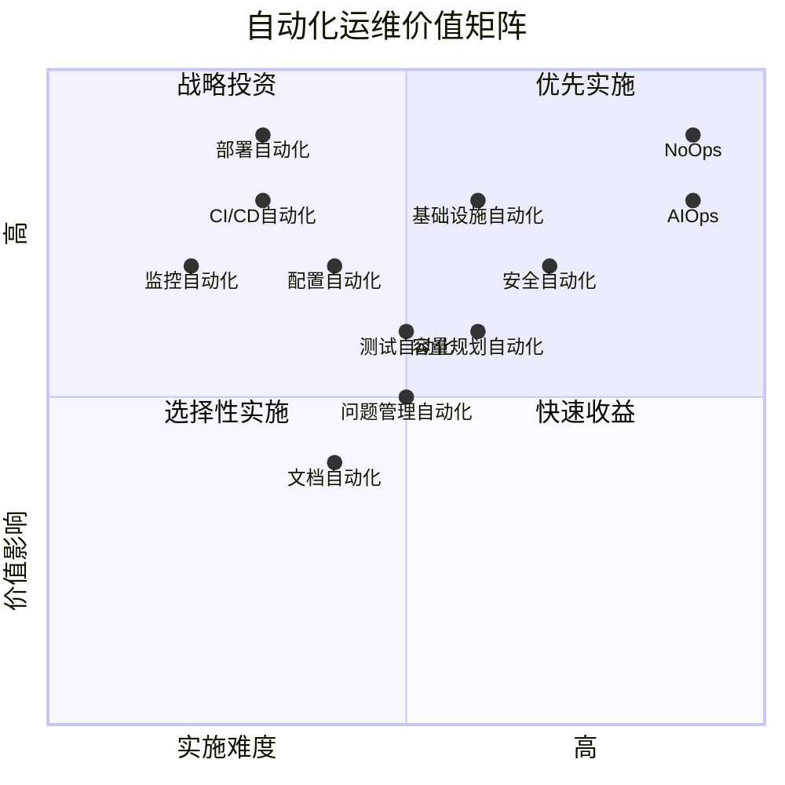

### 6.2 自动化运维实施建议

基于价值和挑战分析，提出以下自动化运维实施建议：

#### 6.2.1 战略层面建议

- **制定自动化战略**：明确自动化目标、范围和路线图
- **价值导向**：基于价值和ROI选择自动化项目
- **渐进式实施**：采用渐进式方法，从小到大，从简单到复杂
- **平衡短期和长期**：平衡短期收益和长期价值

#### 6.2.2 技术层面建议

- **标准化先行**：先标准化，再自动化
- **模块化设计**：采用模块化和可重用的设计
- **工具选择**：选择适合组织需求和能力的工具
- **安全内建**：将安全和合规要求内建到自动化流程

#### 6.2.3 组织层面建议

- **文化建设**：培养支持自动化的文化和思维方式
- **技能发展**：投资团队技能发展和培训
- **组织调整**：调整组织结构和职责，支持自动化
- **变革管理**：实施有效的变革管理，降低阻力

#### 6.2.4 管理层面建议

- **度量与评估**：建立自动化度量和评估机制
- **持续改进**：建立持续改进
让我继续完成自动化运维价值与挑战的内容：

#### 6.2.4 管理层面建议（续）

- **度量与评估**：建立自动化度量和评估机制
- **持续改进**：建立持续改进机制，不断优化自动化流程
- **知识管理**：建立有效的知识管理和共享机制
- **风险管理**：建立自动化风险管理框架，平衡速度和安全

自动化运维实施路线图示例：

```mermaid
gantt
    title 自动化运维实施路线图
    dateFormat  YYYY-QQ
    section 基础阶段
    自动化评估与规划       :a1, 2023-Q1, 1Q
    基础监控自动化         :a2, 2023-Q1, 2Q
    CI/CD基础构建          :a3, 2023-Q2, 2Q
    
    section 发展阶段
    配置自动化             :b1, 2023-Q3, 2Q
    测试自动化             :b2, 2023-Q3, 2Q
    部署自动化             :b3, 2023-Q4, 2Q
    
    section 成熟阶段
    基础设施即代码         :c1, 2024-Q1, 2Q
    自动化安全与合规       :c2, 2024-Q2, 2Q
    自愈系统构建           :c3, 2024-Q3, 2Q
    
    section 创新阶段
    AIOps实施              :d1, 2025-Q1, 3Q
    平台工程建设           :d2, 2025-Q2, 3Q
    NoOps探索              :d3, 2025-Q4, 2Q
```

### 6.3 未来展望

自动化运维将继续快速发展，未来趋势包括：

- **智能化**：AI和机器学习将深度融入自动化运维，实现更智能的自动化
- **自治化**：系统将越来越自治，减少人工干预
- **平台化**：内部开发者平台将成为自动化运维的重要载体
- **融合化**：开发、安全、运维的边界将进一步模糊，形成更紧密的协作

自动化运维发展阶段：

```mermaid
graph LR
    A[手动运维] --> B[基础自动化]
    B --> C[高级自动化]
    C --> D[智能运维]
    D --> E[自治系统]
    
    style A fill:#f9d5e5,stroke:#333,stroke-width:1px
    style B fill:#eeac99,stroke:#333,stroke-width:1px
    style C fill:#d5f9e5,stroke:#333,stroke-width:1px
    style D fill:#6497b1,stroke:#333,stroke-width:1px
    style E fill:#b1b1b1,stroke:#333,stroke-width:1px
    
    A -. "现在" .-> B
    B -. "3-5年" .-> C
    C -. "5-10年" .-> D
    D -. "10年+" .-> E
```

## 7. 附录

### 7.1 自动化运维工具清单

自动化运维涉及多种工具和技术，以下是常用工具分类：

#### 7.1.1 基础设施自动化工具

| 工具名称 | 类型 | 主要功能 | 开源/商业 |
|---------|-----|---------|----------|
| Terraform | 基础设施即代码 | 跨云平台基础设施编排 | 开源 |
| AWS CloudFormation | 基础设施即代码 | AWS资源编排 | 商业 |
| Azure Resource Manager | 基础设施即代码 | Azure资源编排 | 商业 |
| Pulumi | 基础设施即代码 | 使用编程语言定义基础设施 | 开源+商业 |
| Vagrant | 环境管理 | 开发环境自动化 | 开源 |

#### 7.1.2 配置管理工具

| 工具名称 | 类型 | 主要功能 | 开源/商业 |
|---------|-----|---------|----------|
| Ansible | 配置管理 | 无代理配置管理和自动化 | 开源 |
| Puppet | 配置管理 | 声明式配置管理 | 开源+商业 |
| Chef | 配置管理 | 基于Ruby的配置管理 | 开源+商业 |
| SaltStack | 配置管理 | 高速配置管理和远程执行 | 开源+商业 |
| CFEngine | 配置管理 | 轻量级配置管理 | 开源+商业 |

#### 7.1.3 CI/CD工具

| 工具名称 | 类型 | 主要功能 | 开源/商业 |
|---------|-----|---------|----------|
| Jenkins | CI/CD | 可扩展的自动化服务器 | 开源 |
| GitLab CI | CI/CD | 集成在GitLab中的CI/CD | 开源+商业 |
| GitHub Actions | CI/CD | 集成在GitHub中的CI/CD | 商业 |
| CircleCI | CI/CD | 云原生CI/CD | 商业 |
| TeamCity | CI/CD | 企业级CI/CD | 商业 |
| Bamboo | CI/CD | Atlassian生态CI/CD | 商业 |

#### 7.1.4 容器和编排工具

| 工具名称 | 类型 | 主要功能 | 开源/商业 |
|---------|-----|---------|----------|
| Docker | 容器 | 容器化应用 | 开源+商业 |
| Kubernetes | 容器编排 | 容器编排和管理 | 开源 |
| OpenShift | 容器平台 | 企业级Kubernetes平台 | 商业 |
| Rancher | 容器管理 | 多集群Kubernetes管理 | 开源+商业 |
| Docker Compose | 容器编排 | 多容器应用定义和运行 | 开源 |

#### 7.1.5 监控和可观测性工具

| 工具名称 | 类型 | 主要功能 | 开源/商业 |
|---------|-----|---------|----------|
| Prometheus | 监控 | 时序数据库和监控系统 | 开源 |
| Grafana | 可视化 | 指标可视化和仪表板 | 开源+商业 |
| ELK Stack | 日志管理 | 日志收集、存储和分析 | 开源+商业 |
| Datadog | 监控 | 云监控和分析 | 商业 |
| New Relic | 监控 | 应用性能监控 | 商业 |
| Dynatrace | 监控 | AI驱动的全栈监控 | 商业 |

#### 7.1.6 安全自动化工具

| 工具名称 | 类型 | 主要功能 | 开源/商业 |
|---------|-----|---------|----------|
| OWASP ZAP | 安全测试 | 自动化安全测试 | 开源 |
| SonarQube | 代码质量 | 代码质量和安全分析 | 开源+商业 |
| Vault | 密钥管理 | 密钥和凭证管理 | 开源+商业 |
| Aqua Security | 容器安全 | 容器安全平台 | 商业 |
| Prisma Cloud | 云安全 | 云原生安全平台 | 商业 |

### 7.2 自动化运维成熟度模型

自动化运维成熟度模型可以帮助组织评估当前状态并规划未来发展：

#### 7.2.1 成熟度级别定义

| 级别 | 名称 | 特征 | 自动化程度 |
|-----|------|-----|-----------|
| 1 | 初始级 | 手动操作为主，少量脚本自动化 | <20% |
| 2 | 重复级 | 基本流程自动化，但缺乏标准化 | 20-40% |
| 3 | 定义级 | 标准化流程和自动化，有明确的自动化策略 | 40-60% |
| 4 | 管理级 | 全面自动化，有度量和持续改进机制 | 60-80% |
| 5 | 优化级 | 智能自动化，自治系统，持续创新 | >80% |

#### 7.2.2 成熟度评估维度

自动化运维成熟度可以从以下维度进行评估：

```markdown
# 自动化运维成熟度评估维度

## 1. 技术维度
- 自动化工具和平台
- 自动化覆盖范围
- 自动化集成程度
- 自动化可靠性和稳定性

## 2. 流程维度
- 流程标准化程度
- 流程自动化程度
- 流程优化机制
- 变更和风险管理

## 3. 人员维度
- 技能和能力
- 文化和思维方式
- 角色和职责
- 协作和沟通

## 4. 管理维度
- 自动化战略和规划
- 度量和评估机制
- 持续改进机制
- 知识管理和共享
```

#### 7.2.3 成熟度评估工具

自动化运维成熟度评估工具示例：

```markdown
# 自动化运维成熟度评估工具

## 评分标准
- 1分：初始级 - 基本不存在或极少使用
- 2分：重复级 - 部分实施但不一致
- 3分：定义级 - 标准化实施但覆盖有限
- 4分：管理级 - 全面实施并有度量
- 5分：优化级 - 持续优化并创新

## 技术维度评估项
1. 基础设施自动化程度 [1-5]
2. 配置管理自动化程度 [1-5]
3. 部署自动化程度 [1-5]
4. 监控自动化程度 [1-5]
5. 测试自动化程度 [1-5]
6. 安全自动化程度 [1-5]
7. 工具集成程度 [1-5]
8. 自动化可靠性 [1-5]

## 流程维度评估项
1. 流程标准化程度 [1-5]
2. 流程文档化程度 [1-5]
3. 变更管理自动化程度 [1-5]
4. 问题管理自动化程度 [1-5]
5. 流程优化机制 [1-5]
6. 风险管理有效性 [1-5]

## 人员维度评估项
1. 自动化技能水平 [1-5]
2. 自动化文化程度 [1-5]
3. 角色职责清晰度 [1-5]
4. 团队协作效果 [1-5]
5. 知识共享程度 [1-5]

## 管理维度评估项
1. 自动化战略清晰度 [1-5]
2. 自动化度量完善度 [1-5]
3. 持续改进机制 [1-5]
4. 资源投入充分度 [1-5]
5. 领导支持程度 [1-5]

## 评分计算
- 技术维度得分 = 技术维度评估项总分 / 技术维度评估项数量
- 流程维度得分 = 流程维度评估项总分 / 流程维度评估项数量
- 人员维度得分 = 人员维度评估项总分 / 人员维度评估项数量
- 管理维度得分 = 管理维度评估项总分 / 管理维度评估项数量
- 总体成熟度得分 = (技术维度得分 + 流程维度得分 + 人员维度得分 + 管理维度得分) / 4

## 成熟度级别判定
- 1.0-1.9分：初始级
- 2.0-2.9分：重复级
- 3.0-3.9分：定义级
- 4.0-4.9分：管理级
- 5.0分：优化级
```

### 7.3 自动化运维案例研究

以下是不同行业和规模组织实施自动化运维的案例研究：

#### 7.3.1 大型电子商务平台案例

**背景**：
- 年交易额超过50亿美元的电子商务平台
- 超过1000台服务器，300多个微服务
- 面临业务快速增长和季节性流量波动的挑战

**挑战**：
- 手动部署导致发布周期长，无法快速响应市场
- 环境不一致导致频繁出现"在我机器上能运行"的问题
- 高峰期系统稳定性问题，影响用户体验和销售
- 运维团队疲于应对日常问题，无法支持业务创新

**自动化实施**：
1. 基础设施自动化：使用Terraform实现基础设施即代码
2. 配置管理自动化：使用Ansible统一管理服务器配置
3. CI/CD流水线：构建端到端的CI/CD流水线，实现自动化测试和部署
4. 容器化和编排：使用Docker和Kubernetes实现应用容器化和编排
5. 自动扩缩容：实现基于负载的自动扩缩容
6. 智能监控：实施全面的监控和告警系统，实现主动问题检测

**成果**：
- 部署频率从每月2次提高到每天多次
- 部署时间从4小时缩短到10分钟
- 系统可用性从99.9%提高到99.99%
- 资源利用率提高40%，节约基础设施成本约200万美元/年
- 运维团队效率提升300%，支持业务增长而无需增加人员
- 黑色星期五等峰值期间零宕机，增加销售额约800万美元/年

**经验教训**：
- 自动化需要全面规划，但分阶段实施
- 标准化是自动化的基础，先标准化再自动化
- 文化转型与技术转型同样重要
- 持续改进是自动化成功的关键

#### 7.3.2 中型金融服务公司案例

**背景**：
- 管理资产约100亿美元的金融服务公司
- 约200台服务器，50多个应用系统
- 面临严格的合规要求和安全挑战

**挑战**：
- 合规审计准备耗时且容易出错
- 变更流程复杂，导致变更周期长
- 安全漏洞修复时间长，增加风险暴露
- 环境不一致导致频繁出现问题

**自动化实施**：
1. 配置自动化：使用Puppet实现配置自动化和一致性
2. 合规检查自动化：实施自动化合规检查和报告
3. 安全自动化：实施自动化安全扫描和漏洞管理
4. 变更管理自动化：实施自动化变更流程和审批
5. 环境管理自动化：实施环境自动化创建和管理

**成果**：
- 合规审计准备时间从4周减少到3天
- 安全漏洞修复时间从平均15天减少到2天
- 变更失败率从12%降低到2%
- 变更周期从平均10天缩短到2天
- 避免了一次潜在的数据泄露事件，估计节约了约500万美元的损失

**经验教训**：
- 在高度监管的环境中，自动化需要特别关注合规和审计
- 安全和合规可以通过自动化得到加强，而非削弱
- 自动化需要获得业务和合规部门的支持
- 文档和可追溯性对于金融服务行业尤为重要

#### 7.3.3 小型软件开发公司案例

**背景**：
- 50人规模的软件开发公司，提供SaaS解决方案
- 约20台服务器，10个微服务
- 面临快速迭代和资源限制的挑战

**挑战**：
- 有限的运维资源无法支持业务增长
- 手动部署导致频繁出错和延迟
- 缺乏监控和告警，导致问题发现滞后
- 开发环境和生产环境不一致

**自动化实施**：
1. 采用云原生工具链：使用GitHub Actions、AWS自动化服务等
2. 实施轻量级CI/CD：构建简单但有效的CI/CD流水线
3. 基础监控自动化：实施基本的监控和告警
4. 环境标准化：使用Docker确保环境一致性

**成果**：
- 发布周期从2周缩短到2天
- 开发人员生产力提升30%
- 客户满意度提升25%，客户留存率提高15%
- 新功能上市时间缩短60%，带来额外收入约50万美元/年
- 运维成本降低40%，同时支持业务增长

**经验教训**：
- 小型组织可以从简单的自动化开始，逐步扩展
- 云服务和托管服务可以减少自建和维护的负担
- 选择适合团队规模和技能的工具非常重要
- 自动化可以帮助小型组织实现与大型组织相当的运维能力

### 7.4 自动化运维资源与参考

#### 7.4.1 书籍推荐

1. **《凤凰项目：一个IT运维的传奇故事》**
   - 作者：Gene Kim, Kevin Behr, George Spafford
   - 内容：通过小说形式介绍DevOps理念和实践

2. **《DevOps实践指南》**
   - 作者：Gene Kim, Jez Humble, Patrick Debois, John Willis
   - 内容：全面介绍DevOps的原则、实践和案例

3. **《持续交付：发布可靠软件的系统方法》**
   - 作者：Jez Humble, David Farley
   - 内容：详细介绍持续交付的原则和实践

4. **《基础设施即代码：云服务器管理》**
   - 作者：Kief Morris
   - 内容：详细介绍基础设施即代码的原则和实践

5. **《站点可靠性工程：Google运维解密》**
   - 作者：Betsy Beyer, Chris Jones, Jennifer Petoff, Niall Richard Murphy
   - 内容：介绍Google的SRE实践和经验

#### 7.4.2 在线资源

1. **DevOps研究与评估（DORA）**
   - 网址：https://www.devops-research.com/
   - 内容：DevOps研究报告和评估工具

2. **DevOps.com**
   - 网址：https://devops.com/
   - 内容：DevOps新闻、文章和资源

3. **The DevOps Handbook网站**
   - 网址：https://itrevolution.com/devops-handbook/
   - 内容：《DevOps实践指南》的补充资源

4. **DevOps Topologies**
   - 网址：https://web.devopstopologies.com/
   - 内容：DevOps团队结构和组织模式

5. **DevOps Roadmap**
   - 网址：https://roadmap.sh/devops
   - 内容：DevOps学习路径和技能图谱

#### 7.4.3 社区与会议

1. **DevOpsDays**
   - 网址：https://devopsdays.org/
   - 内容：全球DevOps社区活动

2. **DevOps Enterprise Summit**
   - 网址：https://events.itrevolution.com/
   - 内容：面向企业的DevOps峰会

3. **DevOps Institute**
   - 网址：https://devopsinstitute.com/
   - 内容：DevOps培训、认证和资源

4. **Cloud Native Computing Foundation (CNCF)**
   - 网址：https://www.cncf.io/
   - 内容：云原生技术和社区

5. **Continuous Delivery Foundation (CDF)**
   - 网址：https://cd.foundation/
   - 内容：持续交付工具和实践的开源基金会

## 总结

自动化运维是数字化时代的必然选择，它不仅提高了运维效率和质量，降低了成本和风险，更为业务创新和数字化转型提供了强大支撑。然而，自动化运维也面临技术、组织和管理等多方面的挑战，需要组织制定全面的策略，平衡价值和风险，实现自动化运维的最大价值。

随着AI、机器学习等技术的发展，自动化运维正在向智能化、自治化方向发展，NoOps和自治系统将成为未来趋势。组织应当密切关注技术发展，持续学习和创新，不断提升自动化运维能力，为业务创造更大价值。

自动化运维不是目的，而是手段，其最终目标是支持业务创新和价值创造。组织应当始终以业务价值为导向，将自动化运维与业务战略紧密结合，真正发挥自动化运维的战略价值。