# 自动化运维成熟度模型

自动化运维成熟度模型是评估组织自动化水平的重要工具，本文将详细介绍自动化运维的不同成熟度阶段、评估维度和进阶路径，帮助组织了解自身所处位置并规划发展方向。

## 1. 自动化运维成熟度模型概述

### 1.1 什么是自动化运维成熟度模型

自动化运维成熟度模型（Automation Operations Maturity Model，AOMM）是一个结构化框架，用于评估、衡量和指导组织在IT运维自动化方面的能力发展。该模型将自动化运维能力划分为不同的成熟度级别，每个级别代表着不同的自动化深度、广度和价值实现程度。

成熟度模型的核心价值在于：
- **评估现状**：帮助组织客观评估当前自动化运维能力
- **明确目标**：提供清晰的进阶路径和发展方向
- **指导实践**：针对不同成熟度级别提供相应的最佳实践
- **衡量进展**：提供度量标准，跟踪自动化运维能力的提升

### 1.2 成熟度模型的理论基础

自动化运维成熟度模型的理论基础主要来源于以下几个方面：

1. **能力成熟度模型集成（CMMI）**：借鉴了CMMI的分级思想和持续改进理念
2. **DevOps成熟度模型**：融合了DevOps在文化、自动化、测量和共享方面的最佳实践
3. **IT服务管理（ITIL）**：吸收了ITIL在服务设计、交付和持续改进方面的方法论
4. **精益和敏捷原则**：强调价值流、持续改进和快速反馈的理念

### 1.3 成熟度模型的应用价值

自动化运维成熟度模型在组织中的应用价值主要体现在以下几个方面：

#### 1.3.1 战略层面

- **明确发展路径**：为组织提供清晰的自动化运维发展蓝图
- **资源优化配置**：帮助组织合理分配资源，聚焦关键能力建设
- **对标行业最佳实践**：了解行业领先水平，制定有竞争力的目标

#### 1.3.2 管理层面

- **统一认知**：建立组织内部对自动化运维的共识
- **进度跟踪**：提供客观的度量标准，跟踪自动化能力提升
- **绩效评估**：为团队和个人提供明确的能力发展目标

#### 1.3.3 实践层面

- **识别差距**：发现自动化运维能力的短板和瓶颈
- **优先级排序**：确定自动化项目的优先级和实施顺序
- **持续改进**：建立持续改进的机制和文化

## 2. 自动化运维成熟度级别

自动化运维成熟度模型通常将组织的自动化能力划分为5个级别，从初始级到优化级，每个级别代表着不同的自动化深度和广度。

### 2.1 Level 1：初始级（Initial）

初始级是自动化运维的起点，这个阶段的自动化程度非常有限，主要特点包括：

#### 2.1.1 核心特征

- **手动操作为主**：大部分运维工作依赖手动操作
- **个人英雄主义**：依赖个别技术专家解决问题
- **临时性脚本**：存在一些简单的自动化脚本，但缺乏标准化和文档
- **被动响应**：主要是被动响应问题，而非主动预防

#### 2.1.2 典型表现

- 运维工作主要通过手动操作和命令行完成
- 自动化脚本分散在个人电脑上，缺乏版本控制
- 知识主要存在于个人头脑中，缺乏文档和共享
- 频繁出现人为错误和系统问题
- 运维团队疲于应对日常问题，缺乏时间进行改进

#### 2.1.3 自动化覆盖范围

初始级的自动化覆盖范围通常不超过20%的运维工作，主要集中在：
- 简单的备份脚本
- 基本的监控告警
- 个别重复性任务的简单脚本

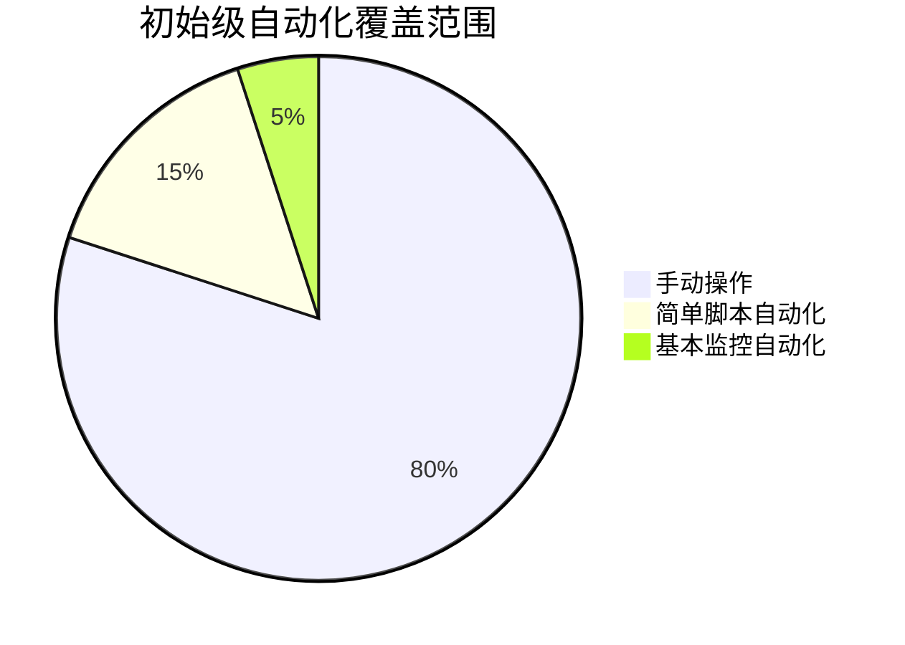

### 2.2 Level 2：重复级（Repeatable）

重复级代表组织开始有意识地推进自动化，但尚未形成统一标准和全面规划。

#### 2.2.1 核心特征

- **部分流程自动化**：常见的重复性工作开始实现自动化
- **团队级自动化**：自动化主要在团队内部实施和使用
- **缺乏标准化**：不同团队采用不同的自动化方法和工具
- **有限的文档**：开始有基本文档，但不完整或不及时更新

#### 2.2.2 典型表现

- 部署、配置等常见任务有基本的自动化脚本
- 开始使用版本控制系统管理脚本和配置
- 不同团队使用不同的自动化工具和方法
- 自动化主要针对特定系统或应用，缺乏跨系统集成
- 开始关注自动化的价值，但缺乏系统性度量

#### 2.2.3 自动化覆盖范围

重复级的自动化覆盖范围通常在20%-40%之间，主要包括：
- 标准化的部署脚本
- 基本的配置管理
- 常规监控和告警
- 简单的CI/CD流程

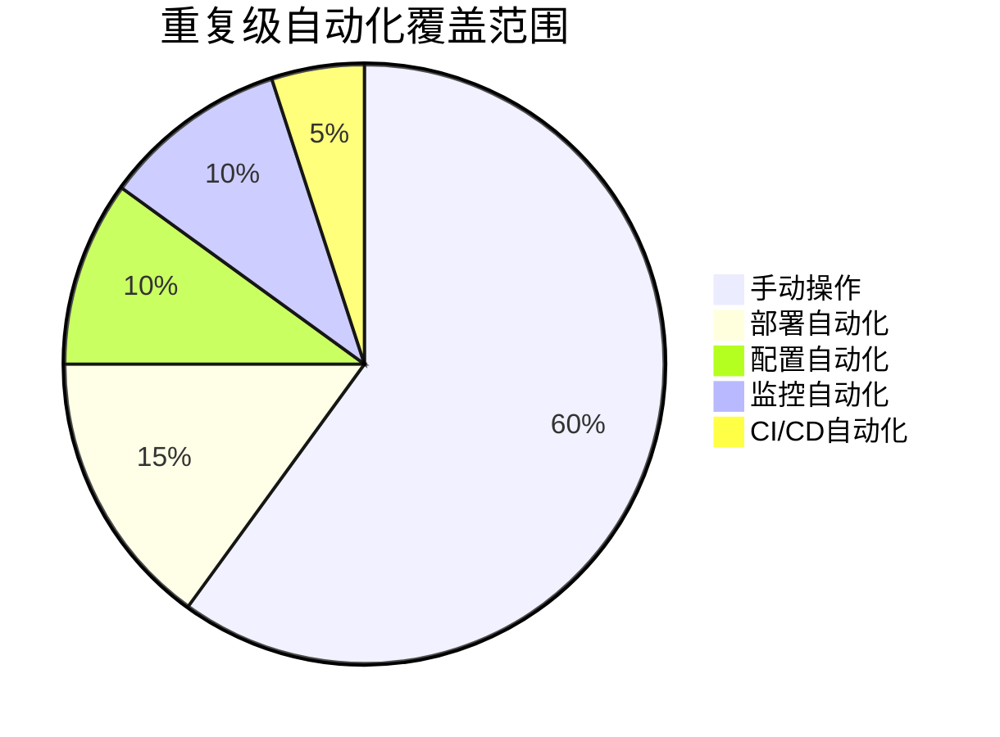

### 2.3 Level 3：定义级（Defined）

定义级标志着组织开始系统化地规划和实施自动化，建立统一的标准和流程。

#### 2.3.1 核心特征

- **标准化流程**：建立统一的自动化标准和流程
- **组织级规划**：制定组织级的自动化战略和规划
- **工具链整合**：开始整合不同的自动化工具形成工具链
- **完善的文档**：建立完善的文档体系和知识库

#### 2.3.2 典型表现

- 建立自动化运维团队或中心，推动全组织自动化
- 制定自动化标准、规范和最佳实践
- 实施统一的自动化平台和工具链
- 建立自动化资产库和知识共享机制
- 开始度量自动化的效果和价值

#### 2.3.3 自动化覆盖范围

定义级的自动化覆盖范围通常在40%-60%之间，主要包括：
- 标准化的CI/CD流水线
- 全面的配置管理
- 自动化测试
- 基础设施即代码(IaC)
- 自动化监控和告警

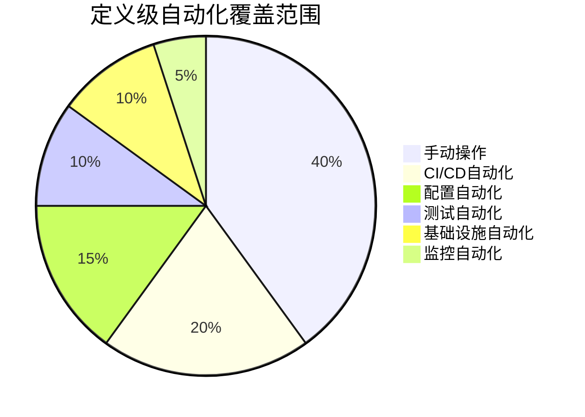

### 2.4 Level 4：管理级（Managed）

管理级代表组织已经建立了全面的自动化体系，并能够通过数据驱动持续优化。

#### 2.4.1 核心特征

- **全面自动化**：大部分运维工作实现自动化
- **数据驱动**：基于数据和度量进行决策和优化
- **持续改进**：建立持续改进机制，不断优化自动化流程
- **预测性能力**：开始具备预测性分析和主动优化能力

#### 2.4.2 典型表现

- 建立自动化运维平台，提供自助服务能力
- 实施全面的自动化度量和报告体系
- 基于数据分析持续优化自动化流程
- 开始应用AI/ML技术增强自动化能力
- 自动化成为组织文化的一部分

#### 2.4.3 自动化覆盖范围

管理级的自动化覆盖范围通常在60%-80%之间，主要包括：
- 端到端的CI/CD流水线
- 全面的基础设施即代码
- 自动化安全检查和合规验证
- 自动扩缩容和资源优化
- 初步的自愈能力

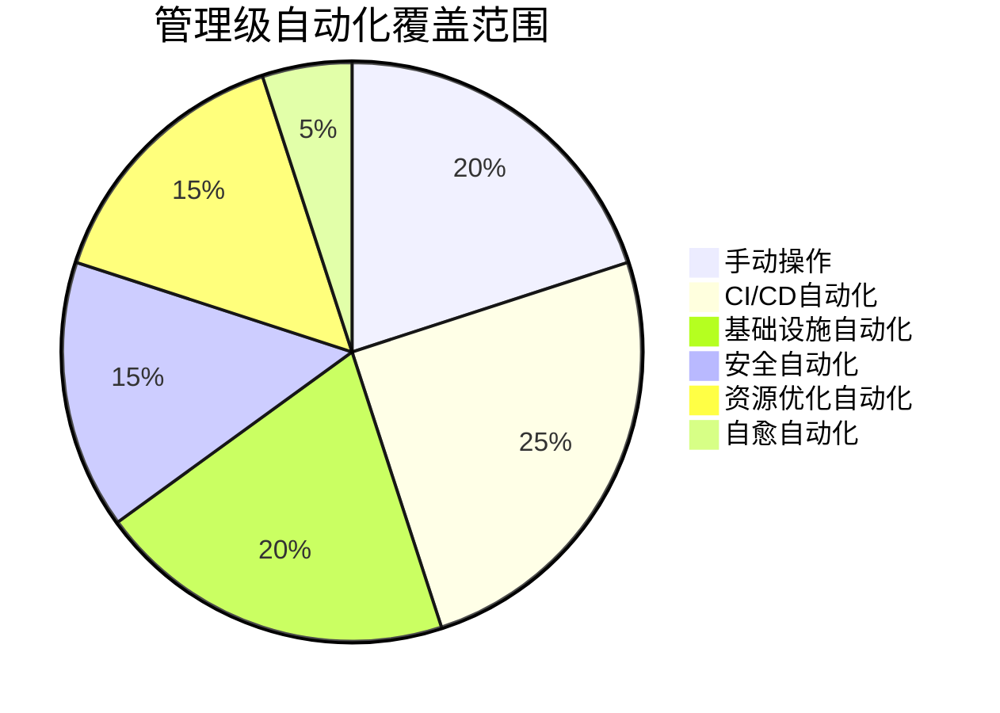

### 2.5 Level 5：优化级（Optimizing）

优化级是自动化运维的最高级别，代表组织已经建立了智能化、自适应的自动化体系。

#### 2.5.1 核心特征

- **智能自动化**：广泛应用AI/ML技术实现智能自动化
- **自适应系统**：系统能够自我学习、自我优化
- **创新文化**：持续创新，不断探索新的自动化方向
- **业务驱动**：自动化与业务战略紧密结合，创造业务价值

#### 2.5.2 典型表现

- 实施AIOps，实现智能运维
- 建立自治系统，最小化人工干预
- 自动化覆盖全生命周期，包括规划、设计、开发、运维
- 自动化成为组织核心竞争力
- 持续创新，引领行业自动化实践

#### 2.5.3 自动化覆盖范围

优化级的自动化覆盖范围通常超过80%，主要包括：
- 智能CI/CD流水线
- 自治基础设施
- 智能安全防护
- 自优化资源管理
- 全面的自愈能力
- 预测性维护

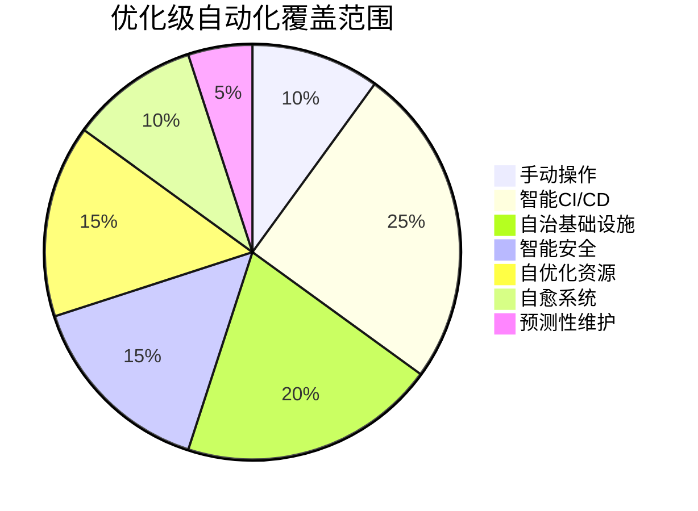

### 2.6 成熟度级别对比

下表对比了不同成熟度级别的主要特征和差异：

| 特征 | 初始级 | 重复级 | 定义级 | 管理级 | 优化级 |
|-----|-------|-------|-------|-------|-------|
| 自动化程度 | <20% | 20%-40% | 40%-60% | 60%-80% | >80% |
| 标准化程度 | 无标准 | 团队标准 | 组织标准 | 全面标准 | 动态优化标准 |
| 工具使用 | 分散脚本 | 基本工具 | 工具链 | 平台化 | 智能平台 |
| 文档完善度 | 极少或无 | 基本文档 | 完善文档 | 知识体系 | 自动生成文档 |
| 度量方式 | 无度量 | 基本指标 | 全面指标 | 数据驱动 | 预测分析 |
| 改进机制 | 被动修复 | 问题驱动 | 计划改进 | 持续改进 | 自优化 |
| 人员依赖 | 高度依赖 | 较高依赖 | 中等依赖 | 低依赖 | 极低依赖 |
| 响应模式 | 被动响应 | 主动监控 | 快速响应 | 预防为主 | 预测预防 |

## 3. 自动化运维成熟度评估维度

自动化运维成熟度评估需要从多个维度进行全面考量，以确保评估的全面性和准确性。

### 3.1 技术维度

技术维度主要评估组织在自动化技术和工具方面的能力。

#### 3.1.1 自动化工具与平台

评估组织使用的自动化工具和平台的广度和深度：

| 成熟度级别 | 自动化工具与平台特征 |
|----------|-------------------|
| 初始级 | 分散的脚本，缺乏统一工具 |
| 重复级 | 团队级工具，基本自动化功能 |
| 定义级 | 组织级工具链，标准化平台 |
| 管理级 | 集成平台，自助服务能力 |
| 优化级 | 智能平台，自适应能力 |

评估要点：
- 自动化工具的覆盖范围
- 工具集成和互操作性
- 工具的可扩展性和灵活性
- 自助服务能力
- 智能化程度

#### 3.1.2 自动化覆盖范围

评估自动化在不同运维领域的覆盖程度：

```mermaid
graph TD
    A[自动化覆盖范围] --> B[基础设施自动化]
    A --> C[配置自动化]
    A --> D[部署自动化]
    A --> E[监控自动化]
    A --> F[安全自动化]
    A --> G[测试自动化]
    A --> H[数据自动化]
    
    B --> B1[服务器自动化]
    B --> B2[网络自动化]
    B --> B3[存储自动化]
    B --> B4[云资源自动化]
    
    C --> C1[配置管理]
    C --> C2[配置验证]
    C --> C3[配置合规]
    
    D --> D1[CI/CD流水线]
    D --> D2[发布管理]
    D --> D3[环境管理]
    
    E --> E1[监控部署]
    E --> E2[告警管理]
    E --> E3[日志管理]
    E --> E4[性能监控]
    
    F --> F1[漏洞扫描]
    F --> F2[合规检查]
    F --> F3[安全响应]
    
    G --> G1[单元测试]
    G --> G2[集成测试]
    G --> G3[性能测试]
    G --> G4[安全测试]
    
    H --> H1[数据备份]
    H --> H2[数据恢复]
    H --> H3[数据迁移]
```

评估要点：
- 各领域自动化覆盖的广度
- 自动化深度（部分自动化vs全自动化）
- 端到端自动化流程的完整性
- 跨领域自动化集成程度

#### 3.1.3 自动化质量与可靠性

评估自动化解决方案的质量和可靠性：

| 评估项 | 初始级 | 优化级 |
|-------|-------|-------|
| 代码质量 | 无标准，个人风格 | 严格标准，自动检查 |
| 错误处理 | 基本或缺失 | 全面、优雅的错误处理 |
| 可测试性 | 难以测试 | 设计为可测试 |
| 可维护性 | 难以维护 | 模块化、文档完善 |
| 可靠性 | 频繁失败 | 高度可靠，自我修复 |

评估要点：
- 自动化代码的质量和标准
- 错误处理和异常管理
- 自动化解决方案的可测试性
- 可维护性和可扩展性
- 运行可靠性和稳定性

#### 3.1.4 技术创新与演进

评估组织在自动化技术创新和演进方面的能力：

| 成熟度级别 | 技术创新特征 |
|----------|------------|
| 初始级 | 几乎无创新，被动采用 |
| 重复级 | 有限创新，跟随采用 |
| 定义级 | 计划性创新，积极采用 |
| 管理级 | 持续创新，早期采用 |
| 优化级 | 引领创新，创造新方法 |

评估要点：
- 新技术评估和采用机制
- 技术债务管理
- 创新文化和实践
- 技术路线图和演进计划
- 前沿技术探索（如AI/ML）

### 3.2 流程维度

流程维度主要评估组织在自动化流程设计、实施和优化方面的能力。

#### 3.2.1 流程标准化与文档化

评估自动化流程的标准化和文档化程度：

| 成熟度级别 | 流程标准化特征 |
|----------|--------------|
| 初始级 | 无标准流程，极少文档 |
| 重复级 | 团队级标准，基本文档 |
| 定义级 | 组织级标准，完善文档 |
| 管理级 | 全面标准，知识体系 |
| 优化级 | 动态优化标准，自动文档 |

评估要点：
- 流程标准的存在和完善程度
- 文档的质量和可访问性
- 知识管理和共享机制
- 标准的遵循和执行情况
- 标准的更新和优化机制

#### 3.2.2 流程自动化程度

评估各类运维流程的自动化程度：


评估要点：
- 各类流程的自动化程度
- 人工干预点的数量和必要性
- 端到端流程的自动化连贯性
- 异常流程的自动化处理
- 自动化决策点的智能程度

#### 3.2.3 流程优化与持续改进

评估组织在流程优化和持续改进方面的能力：

| 成熟度级别 | 流程优化特征 |
|----------|------------|
| 初始级 | 被动修复，无计划改进 |
| 重复级 | 问题驱动，有限改进 |
| 定义级 | 计划改进，定期优化 |
| 管理级 | 数据驱动，持续改进 |
| 优化级 | 自优化，预测性改进 |

评估要点：
- 流程评估和优化机制
- 改进计划的制定和执行
- 反馈收集和应用机制
- 数据驱动的决策过程
- 持续改进文化

#### 3.2.4 变更与风险管理

评估自动化环境中的变更和风险管理能力：

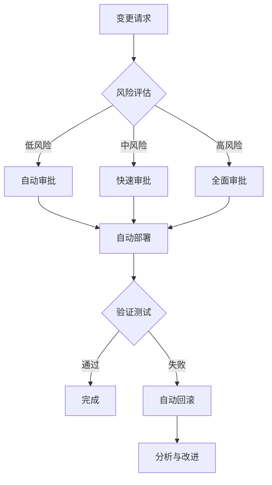

评估要点：
- 变更管理流程的自动化程度
- 风险评估和分类机制
- 审批流程的效率和严谨性
- 变更验证和测试机制
- 回滚和恢复能力

### 3.3 人员与组织维度

人员与组织维度主要评估组织在人才、文化和组织结构方面支持自动化运维的能力。

#### 3.3.1 技能与能力

评估团队在自动化运维方面的技能和能力：

| 技能领域 | 初始级 | 优化级 |
|---------|-------|-------|
| 编程能力 | 基础脚本编写 | 高级软件工程实践 |
| 工具使用 | 基本工具操作 | 工具深度定制和扩展 |
| 系统设计 | 简单系统理解 | 复杂系统架构能力 |
| 问题解决 | 已知问题处理 | 创新解决复杂问题 |
| 持续学习 | 被动学习 | 主动学习和知识创造 |

评估要点：
- 团队技能水平和分布
- 技能发展和培训机制
- 知识共享和协作能力
- 创新和问题解决能力
- 学习文化和机制

#### 3.3.2 文化与思维方式

评估组织在自动化文化和思维方式方面的成熟度：

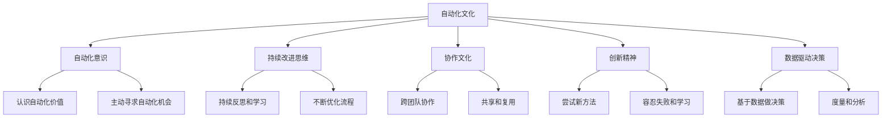

评估要点：
- 自动化意识和价值认同
- 持续改进的思维和行为
- 协作和知识共享文化
- 创新和实验精神
- 数据驱动的决策文化

#### 3.3.3 组织结构与角色

评估组织结构和角色设置对自动化运维的支持程度：

| 成熟度级别 | 组织结构特征 |
|----------|------------|
| 初始级 | 传统职能型结构，明确边界 |
| 重复级 | 部分跨职能协作，边界模糊 |
| 定义级 | 正式跨职能团队，共同责任 |
| 管理级 | 产品型团队，端到端责任 |
| 优化级 | 自组织团队，动态调整 |

评估要点：
- 组织结构对自动化的支持度
- 角色和职责的定义和分配
- 跨职能协作的机制和效果
- 决策权和自主权的分配
- 组织灵活性和适应能力

#### 3.3.4 领导力与支持

评估领导层对自动化运维的支持和引导：

| 成熟度级别 | 领导力特征 |
|----------|----------|
| 初始级 | 有限支持，缺乏理解 |
| 重复级 | 基本支持，战术关注 |
| 定义级 | 积极支持，战略认同 |
| 管理级 | 全面支持，资源保障 |
| 优化级 | 引领变革，文化塑造 |

评估要点：
- 领导层对自动化的理解和重视
- 资源投入和支持力度
- 战略规划和愿景设定
- 变革管理和推动能力
- 以身作则和文化塑造

### 3.4 管理与度量维度

管理与度量维度主要评估组织在自动化运维管理、度量和持续优化方面的能力。

#### 3.4.1 战略与规划

评估组织在自动化运维战略和规划方面的成熟度：

| 成熟度级别 | 战略规划特征 |
|----------|------------|
| 初始级 | 无明确战略，临时决策 |
| 重复级 | 短期规划，战术导向 |
| 定义级 | 明确战略，中期规划 |
| 管理级 | 全面战略，长期规划 |
| 优化级 | 动态战略，持续调整 |

评估要点：
- 自动化战略的清晰度和全面性
- 战略与业务目标的一致性
- 规划的详细程度和可行性
- 资源分配和优先级设定
- 战略执行和调整机制

#### 3.4.2 度量与评估

评估组织在自动化运维度量和评估方面的能力：

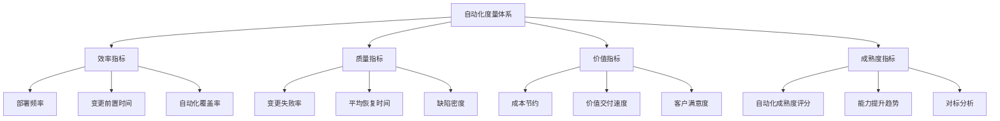

评估要点：
- 度量指标的全面性和相关性
- 数据收集和分析能力
- 度量结果的可视化和共享
- 基于度量的决策机制
- 度量体系的持续优化

#### 3.4.3 资源管理与投资

评估组织在自动化运维资源管理和投资方面的成熟度：

| 成熟度级别 | 资源管理特征 |
|----------|
让我继续完成自动化运维成熟度模型的内容：

#### 3.4.3 资源管理与投资（续）

| 成熟度级别 | 资源管理特征 |
|----------|------------|
| 初始级 | 临时投资，无计划预算 |
| 重复级 | 基本预算，项目式投资 |
| 定义级 | 专项预算，计划性投资 |
| 管理级 | 战略投资，价值导向 |
| 优化级 | 动态投资，持续优化 |

评估要点：
- 自动化资源分配的合理性
- 投资决策的科学性和透明度
- 投资回报率(ROI)的评估
- 资源优化和效率提升
- 长期投资与短期收益的平衡

#### 3.4.4 知识管理与共享

评估组织在自动化知识管理和共享方面的能力：

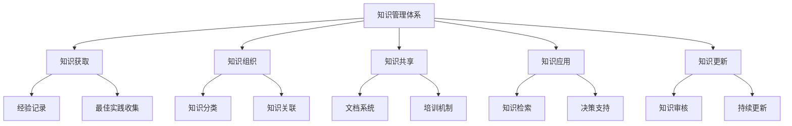

评估要点：
- 知识管理系统的完善程度
- 知识获取和记录机制
- 知识共享和传播渠道
- 知识应用和复用程度
- 知识更新和维护机制

## 4. 自动化运维成熟度评估方法

自动化运维成熟度评估是一个系统性工作，需要采用科学的方法和工具，确保评估的客观性和准确性。

### 4.1 评估准备

在开展评估前，需要做好充分准备，确保评估的顺利进行。

#### 4.1.1 评估目标与范围

明确评估的目标和范围是评估准备的第一步：

- **评估目标**：
  - 了解当前自动化运维能力水平
  - 识别能力差距和改进机会
  - 制定自动化运维发展路线图
  - 对标行业最佳实践
  - 跟踪自动化能力提升进展

- **评估范围**：
  - 组织范围：整个IT部门还是特定团队
  - 技术范围：所有技术领域还是特定领域
  - 流程范围：全部运维流程还是核心流程
  - 系统范围：所有系统还是关键系统

#### 4.1.2 评估团队组建

组建一个多元化的评估团队，确保评估的全面性和客观性：

| 角色 | 职责 |
|-----|-----|
| 评估负责人 | 统筹评估工作，确保评估质量 |
| 技术专家 | 提供技术领域的专业评估 |
| 流程专家 | 提供流程领域的专业评估 |
| 业务代表 | 提供业务视角的评估和反馈 |
| 外部顾问 | 提供客观的第三方视角和行业经验 |

#### 4.1.3 评估工具与模板

准备评估所需的工具和模板，提高评估效率和一致性：

- **评估问卷**：针对不同维度和领域的结构化问卷
- **评分表**：明确的评分标准和评分方法
- **证据清单**：需要收集的证据和材料清单
- **访谈指南**：结构化的访谈问题和指南
- **报告模板**：标准化的评估报告模板

### 4.2 评估实施

评估实施是成熟度评估的核心环节，需要采用多种方法收集和分析数据。

#### 4.2.1 数据收集方法

采用多种方法收集评估所需的数据，确保数据的全面性和准确性：

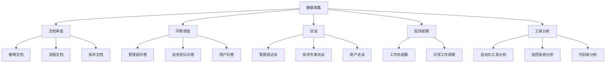

#### 4.2.2 评分方法

采用科学的评分方法，确保评估结果的客观性和可比性：

- **五级评分法**：
  - 1分：初始级 - 基本不存在或极少使用
  - 2分：重复级 - 部分实施但不一致
  - 3分：定义级 - 标准化实施但覆盖有限
  - 4分：管理级 - 全面实施并有度量
  - 5分：优化级 - 持续优化并创新

- **证据要求**：
  - 每个评分需要有相应的证据支持
  - 证据可以是文档、系统演示、数据分析等
  - 证据需要具有代表性和可验证性

- **评分一致性**：
  - 建立评分标准和示例
  - 评估团队进行校准
  - 多人独立评分后讨论
  - 解决评分分歧

#### 4.2.3 评估维度与权重

根据组织特点和评估目标，确定各评估维度的权重：

| 评估维度 | 权重范围 | 调整因素 |
|---------|---------|---------|
| 技术维度 | 20%-40% | 技术驱动型组织权重更高 |
| 流程维度 | 20%-30% | 流程密集型组织权重更高 |
| 人员与组织维度 | 20%-30% | 转型初期组织权重更高 |
| 管理与度量维度 | 10%-30% | 成熟组织权重更高 |

示例权重配置：

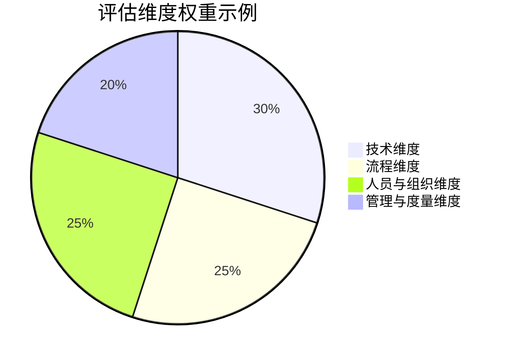

### 4.3 评估结果分析

评估完成后，需要对结果进行深入分析，提取有价值的洞察。

#### 4.3.1 成熟度评分计算

根据评估数据计算成熟度评分：

```
维度评分 = Σ(子维度得分 × 子维度权重)
总体成熟度评分 = Σ(维度评分 × 维度权重)
```

成熟度级别判定：
- 1.0-1.9分：初始级
- 2.0-2.9分：重复级
- 3.0-3.9分：定义级
- 4.0-4.9分：管理级
- 5.0分：优化级

#### 4.3.2 差距分析

识别当前成熟度与目标成熟度之间的差距：

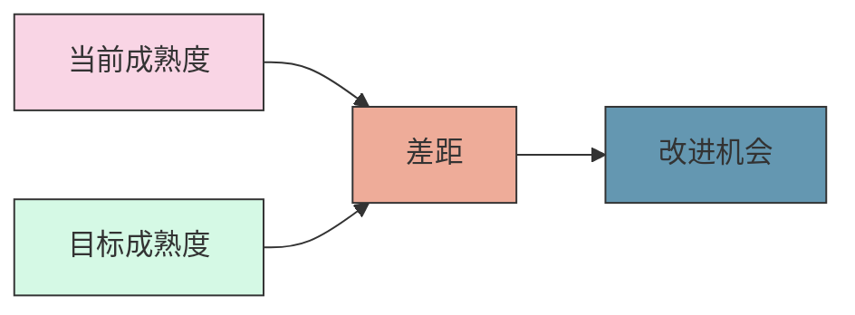

差距分析方法：
- 维度级差距分析：识别薄弱维度
- 子维度级差距分析：识别具体改进点
- 关键能力差距分析：识别核心能力短板
- 对标分析：与行业最佳实践对比

#### 4.3.3 优势与劣势分析

分析组织在自动化运维方面的优势和劣势：

- **优势分析**：
  - 识别得分较高的维度和子维度
  - 分析优势形成的原因和条件
  - 评估优势的可持续性和扩展性
  - 确定如何利用优势促进整体提升

- **劣势分析**：
  - 识别得分较低的维度和子维度
  - 分析劣势形成的根本原因
  - 评估劣势的影响范围和程度
  - 确定改进劣势的优先级和方法

#### 4.3.4 成熟度雷达图

使用雷达图直观展示各维度的成熟度水平：

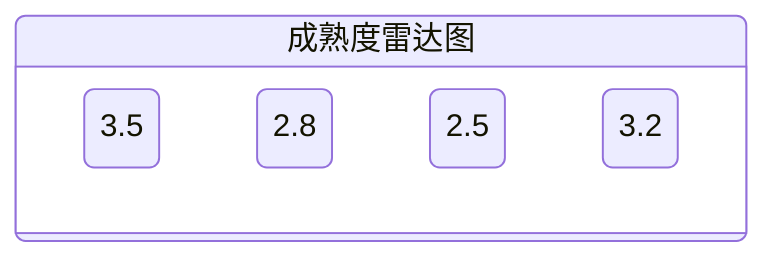

雷达图分析：
- 整体平衡性分析：各维度发展是否均衡
- 短板识别：最低分维度和子维度
- 发展趋势：与历史评估结果比较
- 对标分析：与行业标杆或同行比较

### 4.4 评估报告与建议

评估结果需要形成清晰的报告，并提出有针对性的改进建议。

#### 4.4.1 评估报告结构

标准化的评估报告结构：

1. **执行摘要**：
   - 评估背景和目标
   - 主要发现和结论
   - 关键建议和下一步

2. **评估方法**：
   - 评估框架和标准
   - 评估范围和对象
   - 评估过程和方法

3. **评估结果**：
   - 总体成熟度评分
   - 各维度成熟度评分
   - 优势和劣势分析
   - 与目标的差距分析

4. **改进建议**：
   - 短期改进建议（0-6个月）
   - 中期改进建议（6-18个月）
   - 长期改进建议（18-36个月）
   - 关键成功因素和风险

5. **附录**：
   - 详细评分数据
   - 证据清单
   - 参考资料
   - 术语表

#### 4.4.2 改进路线图

基于评估结果制定自动化运维能力提升路线图：

```mermaid
gantt
    title 自动化运维能力提升路线图
    dateFormat  YYYY-QQ
    section 基础建设
    标准化环境与工具       :a1, 2023-Q1, 2Q
    基础自动化实践         :a2, 2023-Q2, 2Q
    
    section 能力提升
    CI/CD流水线建设        :b1, 2023-Q3, 2Q
    配置自动化             :b2, 2023-Q4, 2Q
    测试自动化             :b3, 2024-Q1, 2Q
    
    section 平台建设
    自动化平台构建         :c1, 2024-Q2, 3Q
    自助服务能力           :c2, 2024-Q3, 2Q
    
    section 智能化
    AIOps基础能力          :d1, 2025-Q1, 3Q
    预测性运维             :d2, 2025-Q3, 2Q
```

路线图设计原则：
- 阶段性：分阶段实施，循序渐进
- 价值导向：优先实施高价值项目
- 基础先行：先解决基础问题，再构建高级能力
- 快速见效：在每个阶段都有可见成果
- 持续调整：根据实施情况和环境变化调整

#### 4.4.3 关键成功因素

识别自动化运维能力提升的关键成功因素：

1. **领导支持与承诺**：
   - 高层领导的理解和支持
   - 明确的愿景和目标
   - 充分的资源投入

2. **文化与变革管理**：
   - 培养自动化文化
   - 有效的变革管理
   - 克服组织阻力

3. **技能与能力建设**：
   - 技能评估和培训
   - 招聘关键人才
   - 知识共享和学习

4. **标准与规范**：
   - 建立统一标准
   - 规范化流程
   - 质量保证机制

5. **工具与平台**：
   - 选择适合的工具
   - 构建集成平台
   - 持续优化工具链

## 5. 自动化运维成熟度提升路径

了解当前成熟度水平后，组织需要制定清晰的提升路径，实现自动化运维能力的持续提升。

### 5.1 初始级到重复级的提升

从初始级到重复级的提升，主要是建立基础自动化能力，实现从手动到基本自动化的转变。

#### 5.1.1 关键目标

- 建立基础自动化意识和技能
- 实现常见重复任务的基本自动化
- 开始使用版本控制和基本工具
- 建立初步的自动化标准和规范

#### 5.1.2 实施重点

1. **技术方面**：
   - 引入基础自动化工具（如脚本语言、基本CI工具）
   - 实施版本控制系统，管理代码和配置
   - 自动化常见的重复性任务
   - 建立基本的监控和告警系统

2. **流程方面**：
   - 梳理和记录关键运维流程
   - 识别自动化机会和优先级
   - 建立基本的变更管理流程
   - 开始记录和共享自动化实践

3. **人员方面**：
   - 基础自动化技能培训
   - 建立自动化意识和文化
   - 识别和培养自动化champions
   - 鼓励知识共享和协作

4. **管理方面**：
   - 获取管理层对自动化的基本支持
   - 分配初步的自动化资源和预算
   - 建立简单的自动化度量指标
   - 展示自动化的早期价值

#### 5.1.3 常见挑战与应对

| 挑战 | 应对策略 |
|-----|---------|
| 技能不足 | 基础培训、外部顾问、招聘关键人才 |
| 资源限制 | 从小项目开始、展示价值、逐步扩大 |
| 抵抗变化 | 沟通自动化价值、参与式设计、成功案例 |
| 工具选择 | 从简单工具开始、考虑长期发展、避免过度复杂 |
| 标准缺失 | 建立基本标准、参考行业实践、循序渐进 |

#### 5.1.4 成功案例

**案例：中型制造企业IT部门**

初始状态：
- 大部分运维工作依赖手动操作
- 频繁出现人为错误和系统问题
- 运维团队疲于应对日常问题

实施措施：
- 引入基本脚本语言（PowerShell、Bash）自动化常见任务
- 实施Git版本控制系统管理脚本和配置
- 建立基本的监控系统监控关键服务
- 为运维团队提供基础自动化培训

成果：
- 减少50%的重复性手动工作
- 错误率降低30%
- 运维团队有更多时间学习和改进
- 建立了基本的自动化文化和意识

### 5.2 重复级到定义级的提升

从重复级到定义级的提升，主要是实现自动化的标准化和组织化，建立统一的自动化框架和实践。

#### 5.2.1 关键目标

- 建立组织级自动化标准和框架
- 实现核心运维流程的标准化自动化
- 整合自动化工具形成工具链
- 建立自动化团队和治理机制

#### 5.2.2 实施重点

1. **技术方面**：
   - 建立标准化的自动化工具链
   - 实施配置管理和基础设施即代码
   - 构建CI/CD流水线
   - 实现环境一致性和自动化部署

2. **流程方面**：
   - 标准化和文档化自动化流程
   - 建立自动化开发和发布流程
   - 实施变更管理自动化
   - 建立自动化质量保证机制

3. **人员方面**：
   - 建立专门的自动化团队或中心
   - 提供进阶自动化技能培训
   - 促进跨团队协作和知识共享
   - 调整角色和职责以支持自动化

4. **管理方面**：
   - 制定组织级自动化战略和规划
   - 建立自动化治理机制
   - 完善自动化度量和报告体系
   - 建立自动化知识库和最佳实践

#### 5.2.3 常见挑战与应对

| 挑战 | 应对策略 |
|-----|---------|
| 标准不统一 | 建立自动化卓越中心、制定统一标准、渐进式推广 |
| 工具碎片化 | 工具整合评估、构建集成平台、API集成 |
| 团队孤岛 | 跨团队协作机制、共享目标、知识共享平台 |
| 治理缺失 | 建立治理框架、明确角色职责、定期审查 |
| 扩展性挑战 | 模块化设计、可重用组件、标准接口 |

#### 5.2.4 成功案例

**案例：大型金融服务公司**

初始状态：
- 各团队使用不同的自动化工具和方法
- 自动化脚本分散，缺乏标准
- 环境不一致导致频繁问题
- 变更流程复杂且耗时

实施措施：
- 建立自动化卓越中心(CoE)，制定统一标准
- 实施Ansible进行配置管理，确保环境一致性
- 构建标准化CI/CD流水线，自动化部署流程
- 建立自动化知识库和培训计划

成果：
- 环境一致性问题减少70%
- 部署时间从天缩短到小时
- 变更成功率提高40%
- 建立了组织级自动化文化和实践

### 5.3 定义级到管理级的提升

从定义级到管理级的提升，主要是实现全面自动化和数据驱动的持续优化。

#### 5.3.1 关键目标

- 实现端到端自动化流程
- 建立数据驱动的自动化优化机制
- 提供自助服务和平台化能力
- 实现自动化的全面度量和管理

#### 5.3.2 实施重点

1. **技术方面**：
   - 构建自动化平台和自助服务门户
   - 实现全面的基础设施即代码
   - 实施自动化安全和合规检查
   - 引入高级监控和可观测性工具

2. **流程方面**：
   - 实现端到端流程自动化
   - 建立自动化流程优化机制
   - 实施自动化变更风险评估
   - 建立自动化事件响应流程

3. **人员方面**：
   - 培养高级自动化技能和专业角色
   - 建立自动化创新文化
   - 实施DevOps和SRE实践
   - 优化组织结构支持自动化

4. **管理方面**：
   - 建立全面的自动化度量体系
   - 实施数据驱动的决策机制
   - 建立自动化投资回报评估
   - 完善自动化治理和风险管理

#### 5.3.3 常见挑战与应对

| 挑战 | 应对策略 |
|-----|---------|
| 复杂性管理 | 模块化设计、抽象层、标准接口、文档完善 |
| 数据质量 | 数据治理、自动化验证、数据标准化 |
| 安全合规 | 安全即代码、自动化合规检查、风险评估 |
| 技能缺口 | 高级培训、专业认证、外部专家、社区参与 |
| 文化转型 | 领导示范、成功案例、激励机制、持续沟通 |

#### 5.3.4 成功案例

**案例：全球电子商务平台**

初始状态：
- 标准化的自动化流程但覆盖不全面
- 自动化工具链但缺乏集成平台
- 基本度量但缺乏数据驱动优化
- 团队协作但仍有部门边界

实施措施：
- 构建内部开发者平台，提供自助服务能力
- 实施全面的基础设施即代码和GitOps
- 建立数据驱动的自动化优化机制
- 重组为产品型团队，打破部门边界

成果：
- 部署频率从每周提高到每天多次
- 变更前置时间从天缩短到分钟
- 资源利用率提高50%
- 运维成本降低40%，同时支持业务增长

### 5.4 管理级到优化级的提升

从管理级到优化级的提升，主要是实现智能自动化和自适应系统，达到自动化运维的最高水平。

#### 5.4.1 关键目标

- 实现智能自动化和AIOps
- 建立自适应和自优化系统
- 创造创新的自动化实践和方法
- 将自动化作为业务创新的驱动力

#### 5.4.2 实施重点

1. **技术方面**：
   - 实施AIOps和机器学习增强自动化
   - 建立自适应和自优化系统
   - 实现预测性分析和主动优化
   - 探索新兴技术和创新方法

2. **流程方面**：
   - 建立自优化流程和持续创新机制
   - 实现流程的自适应和动态调整
   - 建立实验和创新的流程
   - 将自动化与业务流程深度融合

3. **人员方面**：
   - 培养AI和高级自动化专家
   - 建立创新和实验文化
   - 促进跨领域协作和创新
   - 重新定义角色和职责

4. **管理方面**：
   - 建立动态和自适应的战略
   - 实施创新管理和孵化机制
   - 建立预测性分析和决策支持
   - 将自动化作为业务战略的核心

#### 5.4.3 常见挑战与应对

| 挑战 | 应对策略 |
|-----|---------|
| AI技能缺口 | 专业培训、合作伙伴、开源社区、逐步实施 |
| 数据可用性 | 数据平台、数据标准化、数据质量管理 |
| 过度自动化 | 价值评估、人机协作、适度自动化 |
| 创新管理 | 创新框架、实验文化、容忍失败、快速学习 |
| 伦理考量 | 伦理框架、透明度、人工监督、持续评估 |

#### 5.4.4 成功案例

**案例：全球科技公司**

初始状态：
- 全面的自动化体系但缺乏智能化
- 数据驱动决策但主要是回顾性分析
- 持续改进但主要依赖人工识别机会
- 自动化平台但缺乏自适应能力

实施措施：
- 实施AIOps平台，应用机器学习进行异常检测和根因分析
- 建立预测性维护系统，主动识别和解决潜在问题
- 实现自优化资源管理，动态调整资源分配
- 建立创新实验室，探索新的自动化技术和方法

成果：
- 问题检测提前90%，从小时级缩短到分钟级
- 系统可用性从99.99%提高到99.999%
- 资源成本降低30%，同时提高性能
- 运维团队从日常运维转向创新和业务支持

## 6. 自动化运维成熟度模型的实践应用

自动化运维成熟度模型不仅是评估工具，更是指导组织实践和持续改进的框架。

### 6.1 不同规模组织的应用

自动化运维成熟度模型可以根据组织规模进行调整和应用。

#### 6.1.1 大型组织应用

大型组织（1000+员工）应用成熟度模型的特点：

- **全面评估**：覆盖所有维度和子维度
- **分层评估**：可按业务线或部门分别评估
- **标准化实施**：建立统一的评估标准和流程
- **专业团队**：组建专门的评估和改进团队
- **系统化改进**：制定全面的改进计划和路线图

大型组织应用建议：
- 建立自动化卓越中心(CoE)推动成熟度提升
- 分阶段、分领域实施评估和改进
- 建立组织级自动化标准和最佳实践
- 实施自动化平台战略，提供统一能力
- 建立完善的度量和报告体系

#### 6.1.2 中型组织应用

中型组织（100-1000员工）应用成熟度模型的特点：

- **重点评估**：聚焦关键维度和子维度
- **整体评估**：通常作为整体进行评估
- **灵活实施**：根据实际情况调整评估方法
- **兼职团队**：通常由兼职人员组成评估团队
- **渐进式改进**：根据资源情况
让我继续完成自动化运维成熟度模型的内容：

#### 6.1.2 中型组织应用（续）

中型组织（100-1000员工）应用成熟度模型的特点：

- **重点评估**：聚焦关键维度和子维度
- **整体评估**：通常作为整体进行评估
- **灵活实施**：根据实际情况调整评估方法
- **兼职团队**：通常由兼职人员组成评估团队
- **渐进式改进**：根据资源情况分步实施改进

中型组织应用建议：
- 选择最关键的维度和领域进行评估
- 结合业务目标确定自动化优先级
- 利用云服务和现成工具加速自动化
- 培养内部自动化专家和champions
- 建立适合组织规模的自动化治理机制

#### 6.1.3 小型组织应用

小型组织（<100员工）应用成熟度模型的特点：

- **简化评估**：使用简化版的评估框架
- **自我评估**：通常采用自我评估方式
- **重点突破**：聚焦最具价值的自动化机会
- **资源优化**：最大化有限资源的价值
- **快速迭代**：采用快速迭代的改进方式

小型组织应用建议：
- 使用简化版的成熟度模型，聚焦核心能力
- 优先自动化高价值、高重复性工作
- 充分利用云服务和SaaS工具减少自建负担
- 培养全栈自动化技能，减少专业分工
- 建立敏捷的自动化实施和改进流程

### 6.2 不同行业的应用

自动化运维成熟度模型需要根据行业特点进行调整和应用。

#### 6.2.1 互联网行业

互联网行业应用成熟度模型的特点：

- **快速迭代**：强调自动化支持快速迭代和创新
- **弹性扩展**：自动化需支持弹性扩展和高可用
- **DevOps导向**：强调开发和运维的紧密协作
- **云原生**：以云原生技术为基础的自动化
- **用户体验**：关注自动化对用户体验的影响

互联网行业应用建议：
- 重点评估CI/CD自动化和持续部署能力
- 关注自动扩缩容和弹性架构自动化
- 强调监控和可观测性自动化
- 建立支持快速试错和创新的自动化文化
- 利用开源工具和云服务构建自动化能力

#### 6.2.2 金融行业

金融行业应用成熟度模型的特点：

- **合规安全**：强调自动化的合规性和安全性
- **风险控制**：自动化需内置风险控制机制
- **变更管理**：严格的变更管理和审计要求
- **高可用性**：对系统可用性的极高要求
- **数据保护**：对数据安全和隐私的严格要求

金融行业应用建议：
- 重点评估自动化的安全性和合规性
- 关注变更管理和审计自动化
- 强调自动化测试和验证能力
- 建立严格的自动化质量保证机制
- 实施分级的自动化审批和控制机制

#### 6.2.3 制造业

制造业应用成熟度模型的特点：

- **稳定性优先**：强调系统稳定性和可靠性
- **集成复杂**：需与生产系统和设备集成
- **长生命周期**：支持长生命周期系统的自动化
- **异构环境**：需处理多种异构系统和设备
- **成本敏感**：对自动化投资回报的高要求

制造业应用建议：
- 重点评估系统集成和异构环境自动化
- 关注配置管理和变更控制自动化
- 强调监控和预警自动化能力
- 建立支持长期稳定运行的自动化实践
- 实施基于价值的自动化优先级排序

### 6.3 与其他框架的集成

自动化运维成熟度模型可以与其他IT管理和改进框架集成，形成更全面的能力提升体系。

#### 6.3.1 与ITIL的集成

ITIL（IT服务管理框架）与自动化运维成熟度模型的集成点：

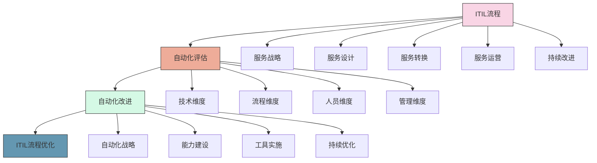

集成建议：
- 将自动化成熟度评估纳入ITIL持续改进流程
- 基于ITIL流程地图识别自动化机会
- 使用自动化提升ITIL流程的效率和质量
- 建立自动化与ITIL流程的映射关系
- 确保自动化实践符合ITIL服务管理原则

#### 6.3.2 与DevOps的集成

DevOps与自动化运维成熟度模型的集成点：

| DevOps维度 | 自动化成熟度维度 | 集成点 |
|-----------|---------------|-------|
| 文化 | 人员与组织 | 协作文化、共享责任、持续学习 |
| 自动化 | 技术 | CI/CD、基础设施即代码、测试自动化 |
| 精益 | 流程 | 价值流、消除浪费、持续流动 |
| 测量 | 管理与度量 | 度量驱动、数据可视化、反馈循环 |
| 共享 | 人员与组织 | 知识共享、透明度、跨团队协作 |

集成建议：
- 将自动化成熟度评估作为DevOps转型的基础
- 使用DevOps原则指导自动化实践的设计
- 建立DevOps和自动化成熟度的联合度量
- 将自动化能力建设纳入DevOps转型路线图
- 确保自动化实践支持DevOps价值流

#### 6.3.3 与敏捷方法的集成

敏捷方法与自动化运维成熟度模型的集成点：

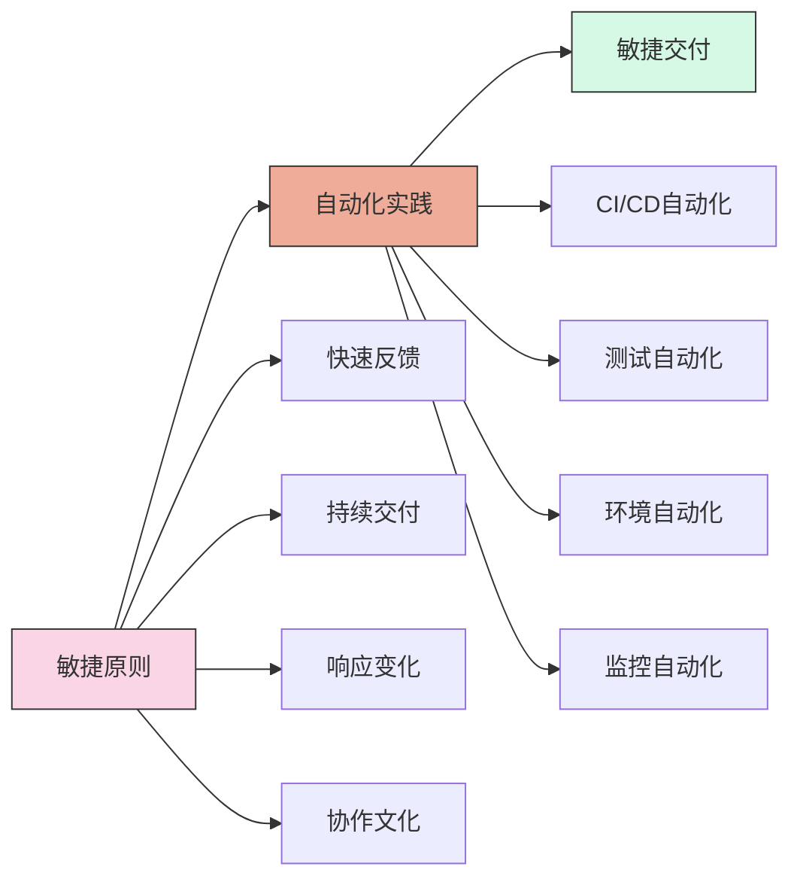

集成建议：
- 使用敏捷方法实施自动化改进项目
- 将自动化能力建设纳入敏捷团队的工作
- 建立支持敏捷交付的自动化基础设施
- 使用自动化加速敏捷反馈循环
- 采用迭代式方法提升自动化成熟度

### 6.4 持续改进与演进

自动化运维成熟度模型需要持续改进和演进，以适应技术和业务的变化。

#### 6.4.1 定期评估与回顾

建立定期评估和回顾机制，确保自动化能力持续提升：

- **评估频率**：
  - 全面评估：每年1-2次
  - 重点领域评估：每季度1次
  - 关键指标跟踪：每月或每周

- **回顾内容**：
  - 成熟度评分变化
  - 改进计划执行情况
  - 新出现的挑战和机会
  - 技术和业务环境变化

- **回顾方法**：
  - 数据分析：基于度量数据的分析
  - 团队讨论：收集团队反馈和建议
  - 用户反馈：收集内部用户的反馈
  - 对标分析：与行业最佳实践对比

#### 6.4.2 适应新技术与趋势

自动化运维成熟度模型需要不断适应新技术和趋势：

| 技术趋势 | 对成熟度模型的影响 | 调整建议 |
|---------|-----------------|---------|
| AI/ML | 智能自动化能力要求提高 | 增加AI/ML相关评估维度 |
| 云原生 | 云原生自动化能力要求 | 调整技术维度评估标准 |
| 无服务器 | 运维模式变化 | 增加无服务器相关评估项 |
| 安全左移 | 安全自动化要求提高 | 强化安全自动化评估 |
| 低代码/无代码 | 自动化实现方式变化 | 纳入低代码平台评估 |

适应策略：
- 建立技术雷达，跟踪新技术和趋势
- 定期更新成熟度模型的评估维度和标准
- 进行试点项目，评估新技术的价值
- 与行业社区和专家保持交流
- 保持模型的灵活性和可扩展性

#### 6.4.3 模型的演进与迭代

自动化运维成熟度模型本身也需要演进和迭代：

- **模型迭代原则**：
  - 价值导向：确保模型能反映真正的价值创造
  - 简单实用：避免过度复杂，保持可操作性
  - 前瞻性：反映未来趋势和最佳实践
  - 可定制：允许根据组织特点进行定制
  - 持续验证：基于实践反馈不断验证和调整

- **迭代方法**：
  - 收集用户反馈
  - 分析评估结果的有效性
  - 研究行业最佳实践和标准
  - 进行小规模试点和验证
  - 定期发布模型更新

## 7. 结论与展望

自动化运维成熟度模型为组织提供了评估和提升自动化能力的框架和路径，帮助组织实现自动化运维的最大价值。

### 7.1 自动化运维的未来趋势

自动化运维正在向以下方向发展：

1. **智能自动化**：
   - AI/ML深度融入自动化运维
   - 从规则驱动向数据驱动转变
   - 预测性和主动性运维成为主流
   - 自学习和自适应系统的兴起

2. **无运维(NoOps)**：
   - 极高程度的自动化和自治
   - 开发者自助服务平台的普及
   - 运维工作从执行转向治理
   - 人机协作的新模式

3. **平台工程**：
   - 内部开发者平台的兴起
   - 自助服务和抽象复杂性
   - 开发者体验成为关键指标
   - 平台即产品的理念普及

4. **安全自动化**：
   - 安全左移和DevSecOps
   - 自动化安全检测和响应
   - 合规即代码的实践
   - 零信任安全模型的自动化实施

### 7.2 成熟度模型的价值与局限

自动化运维成熟度模型的价值：

- **提供框架**：为自动化能力评估提供结构化框架
- **明确路径**：为能力提升提供清晰的发展路径
- **促进对话**：为组织内部对话提供共同语言
- **支持决策**：为资源分配和优先级提供依据
- **衡量进展**：为能力提升提供度量标准

自动化运维成熟度模型的局限：

- **简化现实**：任何模型都是对现实的简化
- **静态视角**：难以完全捕捉动态变化的环境
- **标准化挑战**：不同组织的情况各不相同
- **过度关注级别**：可能导致追求级别而非价值
- **实施复杂性**：全面评估和改进需要大量资源

### 7.3 实施建议与最佳实践

实施自动化运维成熟度模型的建议：

1. **价值导向**：
   - 关注自动化创造的实际价值
   - 将成熟度提升与业务目标紧密结合
   - 优先实施高价值的自动化项目
   - 定期评估和展示自动化价值

2. **渐进式实施**：
   - 从小处着手，逐步扩展
   - 分阶段实施，循序渐进
   - 建立早期成功案例，获取支持
   - 平衡短期收益和长期能力建设

3. **文化与人才**：
   - 培养支持自动化的文化
   - 投资人才发展和技能培训
   - 建立知识共享和协作机制
   - 认可和奖励自动化贡献

4. **持续改进**：
   - 建立持续评估和改进机制
   - 收集和应用反馈
   - 保持对新技术和实践的开放态度
   - 持续优化自动化流程和工具

### 7.4 结语

自动化运维成熟度模型为组织提供了评估和提升自动化能力的框架和路径。通过系统性地应用这一模型，组织可以清晰地了解当前自动化能力的水平，识别改进机会，制定有效的提升策略，最终实现自动化运维的最大价值。

随着技术的发展和业务的变化，自动化运维将继续演进，成熟度模型也需要不断调整和完善。组织应当保持开放和学习的态度，持续关注行业最佳实践和新兴技术，不断提升自动化运维能力，为业务创造更大价值。

自动化不是目的，而是手段。真正的目标是通过自动化提高效率、改善质量、降低成本、加速创新，最终支持业务成功。自动化运维成熟度模型正是帮助组织实现这一目标的有力工具。

## 参考资料

1. Humble, J., & Farley, D. (2010). Continuous Delivery: Reliable Software Releases through Build, Test, and Deployment Automation. Addison-Wesley.

2. Kim, G., Debois, P., Willis, J., & Humble, J. (2016). The DevOps Handbook: How to Create World-Class Agility, Reliability, and Security in Technology Organizations. IT Revolution.

3. Forsgren, N., Humble, J., & Kim, G. (2018). Accelerate: The Science of Lean Software and DevOps: Building and Scaling High Performing Technology Organizations. IT Revolution.

4. Morris, K. (2016). Infrastructure as Code: Managing Servers in the Cloud. O'Reilly Media.

5. Beyer, B., Jones, C., Petoff, J., & Murphy, N. R. (2016). Site Reliability Engineering: How Google Runs Production Systems. O'Reilly Media.