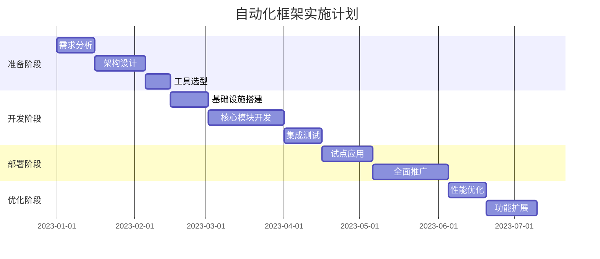

# 构建基础自动化框架

## 1. 自动化框架概述

### 1.1 什么是自动化运维框架

自动化运维框架是一套系统化的工具集合和方法论，旨在减少人工干预，提高运维效率和一致性。它通过将重复性的运维任务自动化，使运维人员能够专注于更具价值的工作，同时降低人为错误的风险。

一个完善的自动化运维框架通常包括以下核心组件：

- **任务编排系统**：协调和调度各类自动化任务
- **配置管理工具**：管理和同步各环境的配置信息
- **监控告警系统**：实时监控系统状态并在异常时触发告警
- **资源管理模块**：管理各类IT资源的生命周期
- **安全合规检查**：确保系统符合安全标准和合规要求
- **报告和可视化**：提供直观的数据展示和报告功能

### 1.2 自动化框架的价值

构建自动化运维框架能够为企业带来显著价值：

- **提高效率**：将耗时的手动操作转变为自动化流程，大幅提升工作效率
- **降低错误率**：减少人工操作带来的错误，提高系统稳定性
- **标准化流程**：确保所有操作按照预定义的标准执行，提高一致性
- **快速响应**：缩短问题响应和解决时间，提高服务可用性
- **知识沉淀**：将运维知识和经验转化为代码，便于传承和共享
- **成本优化**：减少人力成本，优化资源利用率

### 1.3 自动化框架的发展趋势

自动化运维框架正在向以下方向发展：

- **智能化**：引入AI和机器学习技术，实现预测性维护和智能决策
- **云原生化**：适应云环境特性，支持多云和混合云架构
- **DevOps融合**：与开发流程深度集成，支持持续交付和部署
- **安全左移**：将安全检查融入自动化流程的早期阶段
- **自服务能力**：为非运维人员提供简单易用的自助服务界面

## 2. 需求分析与规划

### 2.1 业务需求收集

构建自动化框架的第一步是全面了解业务需求。以下是收集需求的关键步骤：

#### 2.1.1 利益相关方访谈

与各利益相关方进行深入访谈，了解他们的痛点和期望：

- **运维团队**：了解当前手动操作的痛点和自动化期望
- **开发团队**：了解对环境部署和配置的需求
- **业务部门**：了解对系统可用性和响应时间的要求
- **管理层**：了解对成本控制和合规性的关注点

访谈问题示例：

```
1. 您在日常工作中最耗时的重复性任务是什么？
2. 系统出现问题时，通常需要多长时间才能解决？
3. 您认为哪些运维流程最容易出错？
4. 您希望自动化系统能够提供哪些功能？
5. 您对系统的可用性和性能有什么具体要求？
```

#### 2.1.2 现有流程分析

详细记录和分析当前的运维流程：

1. **流程梳理**：绘制流程图，记录每个步骤的输入、输出和执行条件
2. **时间测量**：统计各流程的执行频率和平均耗时
3. **风险评估**：识别流程中的风险点和常见错误
4. **自动化可行性**：评估各流程的自动化难度和价值

流程分析表格示例：

| 流程名称 | 执行频率 | 平均耗时 | 错误率 | 自动化难度 | 自动化价值 |
|---------|---------|---------|-------|-----------|-----------|
| 服务器部署 | 每周5次 | 2小时 | 15% | 中等 | 高 |
| 数据库备份 | 每日1次 | 30分钟 | 5% | 低 | 中 |
| 系统监控 | 持续 | - | 20% | 低 | 高 |
| 故障恢复 | 每月2次 | 4小时 | 10% | 高 | 高 |

#### 2.1.3 技术环境调研

全面了解现有技术环境：

- **硬件资源**：服务器、存储、网络设备的类型和数量
- **软件系统**：操作系统、中间件、数据库、应用系统的版本和配置
- **网络架构**：网络拓扑、安全策略、带宽限制
- **云资源**：使用的云服务类型和规模
- **安全要求**：访问控制、数据保护、合规标准

### 2.2 需求优先级排序

根据收集的需求，使用以下标准进行优先级排序：

1. **业务影响**：对业务连续性和用户体验的影响程度
2. **实施难度**：技术复杂性和资源需求
3. **投资回报**：自动化后预期的效益与成本比
4. **依赖关系**：与其他需求的前后依赖关系

可以使用MoSCoW方法进行分类：
- **Must Have**：必须实现的核心需求
- **Should Have**：应该实现但不是核心的需求
- **Could Have**：可以实现但优先级较低的需求
- **Won't Have**：暂不考虑实现的需求

需求优先级矩阵示例：

```
高  |  监控告警系统  |  配置自动化  |  资源自动扩缩容
    |  基础部署流程  |  数据备份    |  自助服务门户
业  |----------------+---------------+----------------
务  |  安全合规检查  |  日志分析    |  知识库集成
价  |  故障自愈      |  报表系统    |  多云管理
值  |----------------+---------------+----------------
    |  资源回收      |  成本优化    |  预测性维护
低  |  资产管理      |  文档生成    |  聊天机器人
    +------------------------------------------------>
        低            实施难度            高
```

### 2.3 制定项目计划

基于需求分析结果，制定详细的项目计划：

#### 2.3.1 项目范围定义

明确项目的边界和交付物：

- **核心功能**：第一阶段要实现的关键功能
- **排除项**：明确不在当前阶段考虑的功能
- **验收标准**：明确项目成功的衡量标准

#### 2.3.2 里程碑规划

将项目分解为可管理的阶段和里程碑：



#### 2.3.3 资源规划

确定项目所需的人力和技术资源：

- **团队组成**：项目经理、架构师、开发工程师、测试工程师、运维工程师
- **技能要求**：Python/Shell编程、CI/CD工具、云平台经验、网络知识
- **硬件资源**：开发环境、测试环境、生产环境的服务器配置
- **软件资源**：开发工具、测试工具、监控工具的许可和配置

#### 2.3.4 风险管理

识别潜在风险并制定应对策略：

| 风险描述 | 可能性 | 影响 | 应对策略 |
|---------|-------|------|---------|
| 需求变更频繁 | 高 | 中 | 采用敏捷方法，增量交付，定期需求评审 |
| 技术难题阻碍进度 | 中 | 高 | 提前进行技术验证，准备备选方案 |
| 团队技能不足 | 中 | 高 | 提供培训，引入外部专家，建立知识共享机制 |
| 系统集成复杂 | 高 | 高 | 采用标准接口，进行充分的集成测试 |
| 用户抵触自动化 | 中 | 中 | 加强沟通，提供培训，展示自动化价值 |

## 3. 架构设计

### 3.1 总体架构

自动化框架的总体架构应遵循模块化、可扩展、高可用的原则。以下是一个典型的分层架构：

```
+--------------------------------------------------+
|                  表现层                           |
|  +----------------+  +------------------------+  |
|  |    Web门户     |  |      命令行界面        |  |
|  +----------------+  +------------------------+  |
+--------------------------------------------------+
|                  业务逻辑层                       |
|  +----------------+  +------------+  +--------+  |
|  |   任务编排     |  |  配置管理  |  | 资源管理 |  |
|  +----------------+  +------------+  +--------+  |
|  +----------------+  +------------+  +--------+  |
|  |   监控告警     |  |  安全合规  |  | 报表分析 |  |
|  +----------------+  +------------+  +--------+  |
+--------------------------------------------------+
|                  集成层                           |
|  +----------------+  +------------+  +--------+  |
|  |   API网关      |  | 消息队列   |  | 事件总线 |  |
|  +----------------+  +------------+  +--------+  |
+--------------------------------------------------+
|                  基础设施层                       |
|  +----------------+  +------------+  +--------+  |
|  |   计算资源     |  |  存储资源  |  | 网络资源 |  |
|  +----------------+  +------------+  +--------+  |
+--------------------------------------------------+
```

### 3.2 核心组件设计

#### 3.2.1 任务编排系统

任务编排系统负责定义、调度和执行自动化任务：

- **任务定义**：支持YAML/JSON格式的任务描述
- **任务调度**：基于时间、事件或条件的触发机制
- **执行引擎**：并行执行、错误处理、重试机制
- **状态管理**：跟踪任务执行状态和历史记录

任务定义示例（YAML格式）：

```yaml
name: "数据库备份任务"
description: "每日自动备份生产数据库"
schedule: "0 2 * * *"  # 每天凌晨2点执行
timeout: 3600  # 超时时间（秒）
steps:
  - name: "检查磁盘空间"
    type: "script"
    script: "check_disk_space.sh"
    parameters:
      min_free_space: "10G"
    on_failure: "abort"
  
  - name: "创建备份目录"
    type: "command"
    command: "mkdir -p /backup/$(date +%Y%m%d)"
    on_failure: "retry"
    retry:
      max_attempts: 3
      interval: 60
  
  - name: "执行数据库备份"
    type: "function"
    function: "database.backup"
    parameters:
      db_name: "production"
      backup_path: "/backup/$(date +%Y%m%d)/prod_db.sql"
    on_failure: "notify"
  
  - name: "压缩备份文件"
    type: "command"
    command: "gzip /backup/$(date +%Y%m%d)/prod_db.sql"
    on_failure: "continue"
  
  - name: "上传到远程存储"
    type: "function"
    function: "storage.upload"
    parameters:
      local_path: "/backup/$(date +%Y%m%d)/prod_db.sql.gz"
      remote_path: "backups/$(date +%Y%m%d)/"
    on_failure: "notify"

notifications:
  - type: "email"
    recipients: ["dba@example.com", "ops@example.com"]
    events: ["failure", "timeout"]
  
  - type: "webhook"
    url: "https://monitoring.example.com/api/events"
    events: ["start", "complete", "failure"]
```

#### 3.2.2 配置管理模块

配置管理模块负责管理各环境的配置信息：

- **配置存储**：集中存储配置数据，支持版本控制
- **配置分发**：将配置推送到目标系统
- **变量替换**：支持环境变量和模板变量
- **配置验证**：检查配置的有效性和一致性

配置模板示例：

```jinja
# 应用服务器配置模板

server {
    listen {{ port | default(80) }};
    server_name {{ server_name }};
    
    location / {
        proxy_pass http://{{ backend_host }}:{{ backend_port }};
        proxy_set_header Host $host;
        proxy_set_header X-Real-IP $remote_addr;
    }
    
    
    listen 443 ssl;
    ssl_certificate {{ ssl_cert_path }};
    ssl_certificate_key {{ ssl_key_path }};
    
    
    access_log {{ log_path }}/access.log;
    error_log {{ log_path }}/error.log {{ log_level | default('warn') }};
}
```

#### 3.2.3 监控告警系统

监控告警系统负责实时监控系统状态并在异常时触发告警：

- **数据采集**：从各种来源收集监控数据
- **数据处理**：聚合、过滤和分析监控数据
- **告警规则**：定义触发告警的条件
- **通知渠道**：支持多种告警通知方式

告警规则示例：

```yaml
name: "CPU使用率过高"
description: "服务器CPU使用率超过阈值"
target:
  type: "server"
  tags: ["production", "app-server"]
metric: "system.cpu.utilization"
condition: "> 85%"
duration: "5m"  # 持续5分钟
severity: "warning"
escalation:
  - level: 1
    threshold: "15m"  # 持续15分钟
    severity: "critical"
  - level: 2
    threshold: "30m"  # 持续30分钟
    actions:
      - type: "function"
        function: "server.auto_scale"
        parameters:
          increment: 2
notifications:
  - channel: "email"
    recipients: ["ops-team@example.com"]
  - channel: "sms"
    recipients: ["+1234567890"]
    only_severity: ["critical"]
  - channel: "webhook"
    url: "https://pagerduty.example.com/trigger"
```

#### 3.2.4 资源管理模块

资源管理模块负责管理IT资源的生命周期：

- **资源发现**：自动发现和注册资源
- **资源分配**：按需分配和回收资源
- **资源监控**：跟踪资源使用情况
- **资源优化**：识别和处理资源浪费

资源定义示例：

```yaml
kind: "VirtualMachine"
metadata:
  name: "app-server-01"
  environment: "production"
  owner: "app-team"
  created_at: "2023-01-15T10:30:00Z"
spec:
  provider: "aws"
  region: "us-west-2"
  instance_type: "t3.large"
  image: "ami-0c55b159cbfafe1f0"
  disk:
    root_size: "50G"
    data_volumes:
      - name: "app-data"
        size: "100G"
        type: "gp3"
  network:
    vpc: "vpc-production"
    subnet: "subnet-app-tier"
    security_groups:
      - "sg-app-server"
      - "sg-common"
  tags:
    Application: "e-commerce"
    Component: "web-server"
    CostCenter: "CC-123456"
status:
  state: "running"
  private_ip: "10.0.1.42"
  public_ip: "54.123.45.67"
  health: "healthy"
  last_updated: "2023-01-15T14:22:10Z"
```

### 3.3 接口设计

#### 3.3.1 API设计

设计RESTful API，遵循以下原则：

- **资源导向**：API围绕资源而非操作设计
- **标准HTTP方法**：使用GET、POST、PUT、DELETE等标准方法
- **一致的URL结构**：采用一致的URL命名和层次结构
- **适当的状态码**：使用标准HTTP状态码表示操作结果
- **版本控制**：在URL或请求头中包含API版本

API示例：

```
# 任务管理API
GET    /api/v1/tasks                # 获取任务列表
POST   /api/v1/tasks                # 创建新任务
GET    /api/v1/tasks/{id}           # 获取特定任务详情
PUT    /api/v1/tasks/{id}           # 更新特定任务
DELETE /api/v1/tasks/{id}           # 删除特定任务
POST   /api/v1/tasks/{id}/execute   # 执行特定任务
GET    /api/v1/tasks/{id}/status    # 获取任务执行状态
GET    /api/v1/tasks/{id}/logs      # 获取任务执行日志

# 资源管理API
GET    /api/v1/resources                    # 获取资源列表
POST   /api/v1/resources                    # 创建新资源
GET    /api/v1/resources/{id}               # 获取特定资源详情
PUT    /api/v1/resources/{id}               # 更新特定资源
DELETE /api/v1/resources/{id}               # 删除特定资源
GET    /api/v1/resources/{id}/metrics       # 获取资源监控指标
POST   /api/v1/resources/{id}/actions/{action}  # 对资源执行操作
```

#### 3.3.2 事件总线

设计事件驱动架构，通过事件总线实现组件间的松耦合：

- **事件定义**：标准化事件格式和类型
- **发布订阅**：支持多个消费者订阅同一事件
- **事件过滤**：基于事件属性进行过滤
- **事件持久化**：保存事件历史记录

事件格式示例：

```json
{
  "id": "evt-12345678",
  "type": "resource.created",
  "source": "resource-manager",
  "time": "2023-01-15T10:30:00Z",
  "data": {
    "resource_id": "vm-abcdef",
    "resource_type": "virtual-machine",
    "resource_name": "app-server-01",
    "created_by": "user-123"
  },
  "metadata": {
    "correlation_id": "req-87654321",
    "environment": "production"
  }
}
```

#### 3.3.3 插件系统

设计可扩展的插件系统，支持第三方功能集成：

- **插件接口**：定义标准插件接口
- **插件注册**：动态发现和注册插件
- **插件隔离**：确保插件不影响核心系统稳定性
- **版本兼容**：管理插件与核心系统的版本兼容性

插件定义示例：

```python
from framework.plugin import Plugin, register_plugin

@register_plugin(
    name="aws-resource-manager",
    version="1.0.0",
    description="AWS资源管理插件",
    dependencies=["core>=2.0.0"]
)
class AWSResourceManager(Plugin):
    def __init__(self, config):
        super().__init__(config)
        self.aws_region = config.get("region", "us-west-2")
        # 初始化AWS客户端
        
    def create_resource(self, resource_spec):
        """创建AWS资源"""
        resource_type = resource_spec.get("type")
        if resource_type == "ec2-instance":
            return self._create_ec2_instance(resource_spec)
        elif resource_type == "s3-bucket":
            return self._create_s3_bucket(resource_spec)
        else:
            raise ValueError(f"不支持的资源类型: {resource_type}")
    
    def _create_ec2_instance(self, spec):
        # 实现EC2实例创建逻辑
        pass
    
    def _create_s3_bucket(self, spec):
        # 实现S3存储桶创建逻辑
        pass
```

### 3.4 数据模型设计

设计清晰的数据模型，支持系统的核心功能：

#### 3.4.1 任务模型

```python
class Task:
    """任务模型"""
    
    def __init__(self, task_id, name, description=None):
        self.task_id = task_id
        self.name = name
        self.description = description
        self.steps = []
        self.schedule = None
        self.timeout = 3600  # 默认超时时间（秒）
        self.created_at = datetime.now()
        self.updated_at = datetime.now()
        self.created_by = None
        self.tags = []
        self.notifications = []
    
    def add_step(self, step):
        """添加任务步骤"""
        self.steps.append(step)
        self.updated_at = datetime.now()
    
    def set_schedule(self, schedule):
        """设置任务调度计划"""
        self.schedule = schedule
        self.updated_at = datetime.now()
    
    def to_dict(self):
        """转换为字典表示"""
        return {
            "task_id": self.task_id,
            "name": self.name,
            "description": self.description,
            "steps": [step.to_dict() for step in self.steps],
            "schedule": self.schedule.to_dict() if self.schedule else None,
            "timeout": self.timeout,
            "created_at": self.created_at.isoformat(),
            "updated_at": self.updated_at.isoformat(),
            "created_by": self.created_by,
            "tags": self.tags,
            "notifications": [n.to_dict() for n in self.notifications]
        }
    
    @classmethod
    def from_dict(cls, data):
        """从字典创建任务对象"""
        task = cls(
            task_id=data.get("task_id"),
            name=data.get("name"),
            description=data.get("description")
        )
        
        # 设置任务属性
        task.timeout = data.get("timeout", 3600)
        task.created_at = datetime.fromisoformat(data.get("created_at"))
        task.updated_at = datetime.fromisoformat(data.get("updated_at"))
        task.created_by = data.get("created_by")
        task.tags = data.get("tags", [])
        
        # 添加任务步骤
        for step_data in data.get("steps", []):
            step = TaskStep.from_dict(step_data)
            task.add_step(step)
        
        # 设置调度计划
        if data.get("schedule"):
            task.schedule = Schedule.from_dict(data.get("schedule"))
        
        # 添加通知配置
        for notification_data in data.get("notifications", []):
            notification = Notification.from_dict(notification_data)
            task.notifications.append(notification)
        
        return task
```

#### 3.4.2 资源模型

```python
class Resource:
    """资源模型"""
    
    def __init__(self, resource_id, name, resource_type):
        self.resource_id = resource_id
        self.name = name
        self.resource_type = resource_type
        self.metadata = {}
        self.spec = {}
        self.status = {
            "state": "pending",
            "last_updated": datetime.now().isoformat()
        }
        self.created_at = datetime.now()
        self.updated_at = datetime.now()
        self.created_by = None
        self.tags = {}
    
    def update_spec(self, spec):
        """更新资源规格"""
        self.spec.update(spec)
        self.updated_at = datetime.now()
        self.status["last_updated"] = self.updated_at.isoformat()
    
    def update_status(self, status):
        """更新资源状态"""
        self.status.update(status)
        self.status["last_updated"] = datetime.now().isoformat()
    
    def to_dict(self):
        """转换为字典表示"""
        return {
            "resource_id": self.resource_id,
            "name": self.name,
            "resource_type": self.resource_type,
            "metadata": self.metadata,
            "spec": self.spec,
            "status": self.status,
            "created_at": self.created_at.isoformat(),
            "updated_at": self.updated_at.isoformat(),
            "created_by": self.created_by,
            "tags": self.tags
        }
    
    @classmethod
    def from_dict(cls, data):
        """从字典创建资源对象"""
        resource = cls(
            resource_id=data.get("resource_id"),
            name=data.get("name"),
            resource_type=data.get("resource_type")
        )
        
        resource.metadata = data.get("metadata", {})
        resource.spec = data.get("spec", {})
        resource.status = data.get("status", {"state": "pending"})
        resource.created_at = datetime.fromisoformat(data.get("created_at"))
        resource.updated_at = datetime.fromisoformat(data.get("updated_at"))
        resource.created_by = data.get("created_by")
        resource.tags = data.get("tags", {})
        
        return resource
```

## 4. 技术选型

### 4.1 编程语言选择

选择合适的编程语言是构建自动化框架的关键决策之一：

#### 4.1.1 Python

Python是自动化领域的首选语言之一：

- **优势**：
  - 简洁易读的语法
  - 丰富的库和框架生态
  - 跨平台兼容性
  - 强大的文本处理能力
  - 活跃的社区支持

- **适用场景**：
  - 通用自动化脚本
  - 数据处理和分析
  - Web应用和API开发
  - 系统管理和配置

- **常用库**：
  - `paramiko`：SSH连接和远程执行
  - `requests`：HTTP请求处理
  - `flask`/`fastapi`：Web API开发
  - `pyyaml`：YAML文件处理
  - `sqlalchemy`：数据库操作
  - `celery`：分布式任务队列

#### 4.1.2 Go

Go语言在云原生和高性能场景中越来越受欢迎：

- **优势**：
  - 高性能和低资源消耗
  - 内置并发支持
  - 静态类型和编译安全
  - 单一可执行文件部署
  - 良好的云原生生态

- **