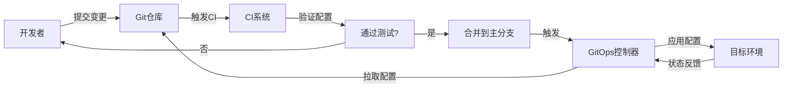
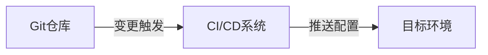
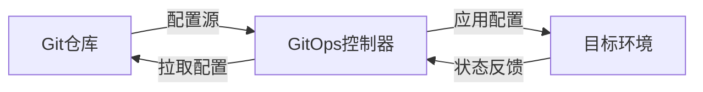
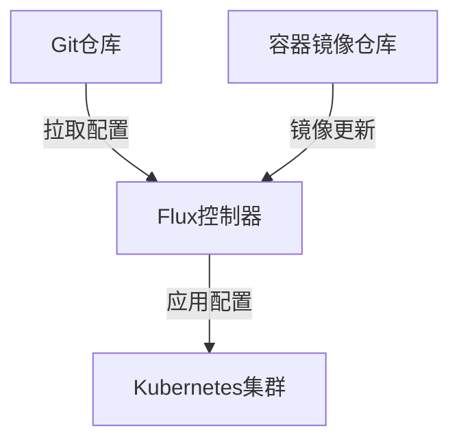
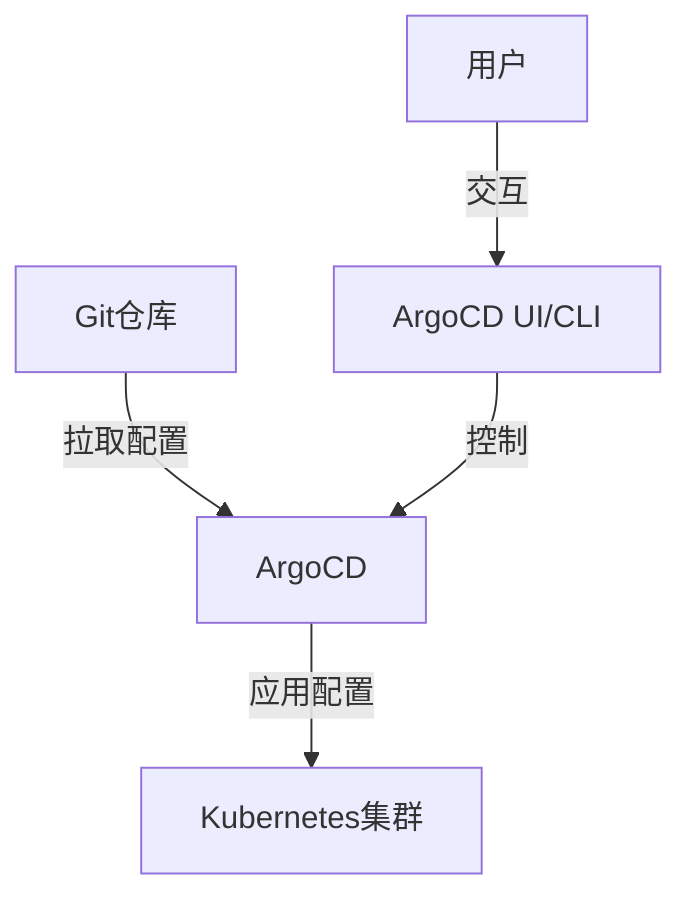

# GitOps实践与工作流

---
title: GitOps实践与工作流
icon: practice
order: 9
---

# GitOps实践与工作流

## GitOps的概念与核心理念

GitOps是一种以Git为中心的现代化运维实践方法，它将Git作为整个系统的唯一事实来源(Single Source of Truth)，通过声明式配置来管理基础设施和应用部署。GitOps的核心思想是将基础设施和应用配置作为代码，存储在Git仓库中，并通过自动化工具确保实际运行环境与Git仓库中定义的期望状态保持一致。

### GitOps的定义

GitOps最早由Weaveworks公司在2017年提出，它是DevOps理念的延伸和具体实践。简单来说，GitOps就是：

1. 使用Git作为声明式基础设施和应用的单一事实来源
2. 通过Git操作(pull request, merge等)触发系统变更
3. 使用自动化工具确保实际系统状态与Git中定义的期望状态一致
4. 实现基础设施即代码(Infrastructure as Code, IaC)和配置即代码(Configuration as Code)

### GitOps的核心原则

1. **声明式配置**：系统的期望状态通过声明式配置文件定义，而不是一系列命令式操作步骤。

2. **版本控制与历史追踪**：所有配置变更都通过Git进行版本控制，提供完整的变更历史和审计跟踪。

3. **自动化协调**：自动化工具负责检测配置变更并将实际环境调整为期望状态。

4. **持续同步**：系统持续监控并确保实际状态与期望状态的一致性，自动修复偏差。

5. **拉取式部署(Pull-based Deployment)**：代理组件从Git仓库拉取配置并应用，而不是外部系统推送变更。

### GitOps与传统运维的区别

| 传统运维 | GitOps |
|---------|--------|
| 手动执行命令或脚本 | 声明式配置，自动化执行 |
| 变更过程不透明 | 所有变更通过Git追踪，完全透明 |
| 环境配置分散，难以管理 | 集中式配置管理，单一事实来源 |
| 回滚复杂，风险高 | 简单回滚到任何历史版本 |
| 权限控制分散 | 统一的权限控制机制 |
| 难以审计和合规 | 内置审计和合规能力 |

## GitOps的工作流程

GitOps工作流程围绕Git仓库展开，从配置变更到环境同步形成一个完整的闭环。

### 基本工作流程



1. **配置变更**：开发者或运维人员通过Pull Request提交配置变更
2. **代码审查**：团队成员审查变更，确保符合最佳实践
3. **自动化验证**：CI系统自动验证配置的语法和逻辑
4. **合并变更**：审查通过后，变更被合并到主分支
5. **自动部署**：GitOps控制器检测到变更，将新配置应用到目标环境
6. **状态监控**：控制器持续监控环境状态，确保与期望状态一致

### Push模式与Pull模式

GitOps实现有两种主要模式：Push模式和Pull模式。

#### Push模式(CI/CD驱动)



特点：
- CI/CD系统检测到配置变更后主动推送到目标环境
- 实现简单，可利用现有CI/CD工具链
- 需要CI/CD系统有权访问目标环境
- 适合简单场景和传统应用部署

#### Pull模式(操作员模式)



特点：
- 在目标环境中运行的控制器定期拉取配置并应用
- 更符合GitOps理念，环境自主维护状态
- 不需要外部系统访问目标环境，提高安全性
- 能够持续监控和修复偏差
- 适合云原生和Kubernetes环境

### GitOps工作流中的角色与职责

1. **开发者**：
   - 开发应用代码
   - 创建应用部署配置
   - 提交配置变更请求

2. **运维工程师**：
   - 设计和维护基础设施配置
   - 审查基础设施变更
   - 监控系统健康状态

3. **GitOps控制器**：
   - 监控Git仓库变更
   - 将配置应用到目标环境
   - 检测和修复配置偏差

4. **CI/CD系统**：
   - 验证配置正确性
   - 运行自动化测试
   - 在Push模式中负责部署

## GitOps工具生态

GitOps有丰富的工具生态系统，支持不同场景和需求。

### 核心GitOps工具

#### Flux CD

Flux是CNCF(Cloud Native Computing Foundation)孵化的GitOps工具，专为Kubernetes环境设计。

特点：
- 自动同步Kubernetes集群与Git仓库状态
- 支持多租户和多集群场景
- 内置镜像自动更新机制
- 支持Helm、Kustomize等配置管理工具
- 提供通知和警报功能

基本架构：



简单配置示例：

```yaml
# flux-system/gotk-sync.yaml
apiVersion: source.toolkit.fluxcd.io/v1beta1
kind: GitRepository
metadata:
  name: flux-system
  namespace: flux-system
spec:
  interval: 1m0s
  ref:
    branch: main
  url: https://github.com/example/gitops-config
---
apiVersion: kustomize.toolkit.fluxcd.io/v1beta1
kind: Kustomization
metadata:
  name: flux-system
  namespace: flux-system
spec:
  interval: 10m0s
  path: ./clusters/production
  prune: true
  sourceRef:
    kind: GitRepository
    name: flux-system
  validation: client
```

#### ArgoCD

ArgoCD是CNCF的孵化项目，是一个专为Kubernetes设计的声明式GitOps持续交付工具。

特点：
- 提供Web UI和CLI界面
- 支持多集群管理
- 自动或手动同步选项
- 丰富的SSO集成和RBAC控制
- 支持健康状态评估和自动回滚

基本架构：



应用配置示例：

```yaml
# application.yaml
apiVersion: argoproj.io/v1alpha1
kind: Application
metadata:
  name: myapp
  namespace: argocd
spec:
  project: default
  source:
    repoURL: https://github.com/example/myapp-config.git
    targetRevision: HEAD
    path: overlays/production
  destination:
    server: https://kubernetes.default.svc
    namespace: myapp
  syncPolicy:
    automated:
      prune: true
      selfHeal: true
```

#### Jenkins X

Jenkins X是基于Jenkins的云原生CI/CD解决方案，集成了GitOps工作流。

特点：
- 自动化CI/CD管道
- 内置环境管理
- 集成ChatOps功能
- 预览环境支持
- 自动版本管理和发布

#### Weave GitOps

由GitOps概念的创始公司Weaveworks开发的GitOps平台。

特点：
- 提供企业级GitOps解决方案
- 多集群管理能力
- 策略控制和治理
- 团队协作功能
- 与Flux紧密集成

### 配置管理工具

这些工具与GitOps控制器配合，用于管理Kubernetes配置。

#### Kustomize

Kustomize是Kubernetes原生的配置定制工具，允许通过覆盖和组合方式管理配置。

特点：
- 无模板，纯YAML配置
- 基于覆盖的配置管理
- 支持配置变体和环境差异
- 与kubectl集成

基本结构：

```
base/
  kustomization.yaml
  deployment.yaml
  service.yaml
overlays/
  production/
    kustomization.yaml
    deployment-patch.yaml
  staging/
    kustomization.yaml
    deployment-patch.yaml
```

基本配置示例：

```yaml
# base/kustomization.yaml
apiVersion: kustomize.config.k8s.io/v1beta1
kind: Kustomization
resources:
- deployment.yaml
- service.yaml

# overlays/production/kustomization.yaml
apiVersion: kustomize.config.k8s.io/v1beta1
kind: Kustomization
bases:
- ../../base
patchesStrategicMerge:
- deployment-patch.yaml
```

#### Helm

Helm是Kubernetes的包管理工具，使用模板化方式管理复杂应用配置。

特点：
- 模板化配置管理
- 支持依赖管理
- 版本控制和回滚
- 丰富的社区图表库

Chart结构：

```
mychart/
  Chart.yaml          # 元数据文件
  values.yaml         # 默认配置值
  templates/          # 模板目录
    deployment.yaml
    service.yaml
  charts/             # 依赖图表
  .helmignore
```

values.yaml示例：

```yaml
# values.yaml
replicaCount: 2
image:
  repository: nginx
  tag: 1.19.3
service:
  type: ClusterIP
  port: 80
```

模板示例：

```yaml
# templates/deployment.yaml
apiVersion: apps/v1
kind: Deployment
metadata:
  name: {{ .Release.Name }}
spec:
  replicas: {{ .Values.replicaCount }}
  selector:
    matchLabels:
      app: {{ .Release.Name }}
  template:
    metadata:
      labels:
        app: {{ .Release.Name }}
    spec:
      containers:
      - name: {{ .Chart.Name }}
        image: {{ .Values.image.repository }}:{{ .Values.image.tag }}
        ports:
        - containerPort: {{ .Values.service.port }}
```

## GitOps最佳实践

### 仓库结构设计

有效的GitOps实践需要精心设计的仓库结构。常见的模式包括：

#### 单仓库模式(Monorepo)

所有配置集中在一个仓库中管理。

```
gitops-repo/
  ├── apps/
  │   ├── app1/
  │   │   ├── base/
  │   │   └── overlays/
  │   └── app2/
  ├── clusters/
  │   ├── production/
  │   └── staging/
  └── infrastructure/
      ├── networking/
      └── storage/
```

优点：
- 配置集中管理，易于维护
- 简化依赖管理
- 原子性变更支持
- 统一的权限控制

缺点：
- 随着规模增长可能变得复杂
- 权限粒度较粗

#### 多仓库模式(Multirepo)

将不同类型的配置分散到多个仓库中。

```
app1-repo/
  ├── base/
  └── overlays/

app2-repo/
  ├── base/
  └── overlays/

infra-repo/
  ├── networking/
  └── storage/

cluster-config-repo/
  ├── production/
  └── staging/
```

优点：
- 关注点分离
- 精细的权限控制
- 适合大型组织和复杂系统
- 减少合并冲突

缺点：
- 配置分散，管理复杂
- 跨仓库依赖难以处理
- 可能导致配置不一致

#### 环境分支与环境目录

管理多环境配置的两种主要方法：

**环境分支模式**：
- 每个环境对应一个Git分支
- 配置从开发环境分支提升到生产环境分支
- 简化环境间配置提升流程

**环境目录模式**：
- 单一分支，不同环境配置存放在不同目录
- 所有环境配置在同一分支上可见
- 便于比较不同环境配置差异

### 安全最佳实践

GitOps带来便利的同时也需要注意安全问题：

1. **敏感信息管理**：
   - 使用Kubernetes Secrets或外部密钥管理系统
   - 考虑使用Sealed Secrets、Vault等工具加密敏感信息
   - 避免将明文密钥存储在Git仓库中

2. **访问控制**：
   - 实施严格的仓库访问控制
   - 使用分支保护规则限制直接推送
   - 要求所有变更通过审查流程

3. **签名验证**：
   - 启用Git提交签名验证
   - 配置GitOps工具验证签名
   - 建立可信提交者列表

4. **网络安全**：
   - 限制GitOps控制器的网络访问范围
   - 使用私有Git仓库
   - 实施网络策略限制集群内通信

### 持续验证与测试

确保配置质量的关键实践：

1. **配置验证**：
   - 使用schema验证工具(如kubeval, conftest)
   - 实施策略检查(OPA, Kyverno)
   - 自动化语法和结构验证

2. **预部署测试**：
   - 在临时环境中测试配置变更
   - 使用预览环境验证应用行为
   - 自动化集成测试

3. **渐进式部署**：
   - 实施金丝雀部署或蓝绿部署
   - 自动回滚失败的部署
   - 监控部署过程中的关键指标

## GitOps实施路线图

### 评估与准备

1. **现状评估**：
   - 审查现有部署流程和工具
   - 识别自动化机会和挑战
   - 评估团队技能和知识差距

2. **目标定义**：
   - 设定明确的GitOps实施目标
   - 确定成功指标
   - 建立实施时间表

3. **团队准备**：
   - 提供GitOps培训
   - 建立支持机制
   - 指定GitOps冠军和专家

### 实施步骤

1. **基础设施准备**：
   - 设置Git仓库结构
   - 部署GitOps控制器
   - 配置基础监控和告警

2. **试点项目**：
   - 选择低风险应用作为试点
   - 将现有配置迁移到GitOps模式
   - 验证端到端工作流

3. **扩展应用范围**：
   - 逐步将更多应用纳入GitOps管理
   - 标准化配置模板和结构
   - 建立跨团队最佳实践

4. **持续改进**：
   - 收集反馈并调整流程
   - 优化自动化和工具链
   - 扩展GitOps覆盖范围

### 常见挑战与解决方案

1. **团队抵抗**：
   - 提供充分培训和支持
   - 展示GitOps带来的具体价值
   - 鼓励团队参与设计过程

2. **遗留系统集成**：
   - 采用渐进式迁移策略
   - 开发适配器连接遗留系统
   - 考虑混合模式过渡期

3. **复杂依赖管理**：
   - 实施明确的依赖声明机制
   - 使用版本控制管理依赖
   - 建立依赖变更通知流程

4. **扩展性挑战**：
   - 设计可扩展的仓库结构
   - 实施自动化配置生成
   - 使用分层配置管理方法

## GitOps与云原生技术的结合

### GitOps与Kubernetes

Kubernetes是GitOps最理想的运行环境，两者结合带来强大优势：

1. **声明式API契合**：
   - Kubernetes的声明式API与GitOps理念完美契合
   - 配置即代码的实现变得自然

2. **控制器模式**：
   - Kubernetes的控制器模式与GitOps的自动协调一致
   - 简化了GitOps工具的实现

3. **资源管理**：
   - 使用GitOps管理Kubernetes资源
   - 支持CRD和自定义资源的管理

4. **多集群管理**：
   - 通过GitOps实现一致的多集群配置
   - 简化集群间配置同步

### GitOps与服务网格

服务网格技术(如Istio, Linkerd)与GitOps结合：

1. **流量管理**：
   - 通过GitOps管理服务网格流量规则
   - 实现渐进式发布和金丝雀部署

2. **安全策略**：
   - 版本控制和审计安全策略变更
   - 确保一致的安全配置

3. **可观测性配置**：
   - 管理监控和追踪配置
   - 确保所有环境一致的可观测性

### GitOps与无服务器架构

GitOps在无服务器(Serverless)环境中的应用：

1. **函数配置管理**：
   - 版本控制函数代码和配置
   - 自动部署函数更新

2. **事件触发器**：
   - 管理事件源和触发器配置
   - 确保一致的事件处理流程

3. **资源编排**：
   - 通过GitOps管理无服务器资源编排
   - 实现基础设施即代码

## GitOps的未来趋势

### 多云与混合云GitOps

随着企业采用多云和混合云策略，GitOps正在演变：

1. **统一管理平面**：
   - 通过单一GitOps工作流管理多个云环境
   - 抽象云提供商差异

2. **云无关配置**：
   - 开发云无关的配置模型
   - 使用适配器处理云特定实现

3. **一致性保证**：
   - 确保跨云环境的配置一致性
   - 统一的审计和合规机制

### GitOps与AI/ML

GitOps在AI/ML领域的应用正在兴起：

1. **模型版本控制**：
   - 将ML模型作为GitOps管理的资产
   - 版本控制模型参数和配置

2. **MLOps集成**：
   - GitOps作为MLOps工作流的核心
   - 自动化模型部署和更新

3. **实验管理**：
   - 通过GitOps管理ML实验配置
   - 追踪实验结果和参数

### GitOps与边缘计算

GitOps正在扩展到边缘计算场景：

1. **边缘设备管理**：
   - 通过GitOps管理分布式边缘设备
   - 处理间歇性连接和有限带宽挑战

2. **离线同步**：
   - 开发适用于离线环境的GitOps模式
   - 实现断点续传和增量同步

3. **本地控制器**：
   - 边缘设备上的轻量级GitOps控制器
   - 自主运行并与中心协调

## 结论

GitOps代表了现代云原生应用交付和基础设施管理的重要范式转变。通过将Git作为单一事实来源，GitOps实现了透明、可审计、可重复的变更管理流程，同时提高了系统的可靠性和安全性。

随着云原生技术的不断发展，GitOps正在从简单的Kubernetes配置管理扩展到更广泛的领域，包括多云环境、AI/ML工作负载和边缘计算。组织在采用GitOps时应关注仓库结构设计、安全最佳实践和持续验证，同时制定清晰的实施路线图。

通过拥抱GitOps，组织可以实现更快的部署周期、更高的系统可靠性和更好的团队协作，最终提升软件交付的整体效率和质量。