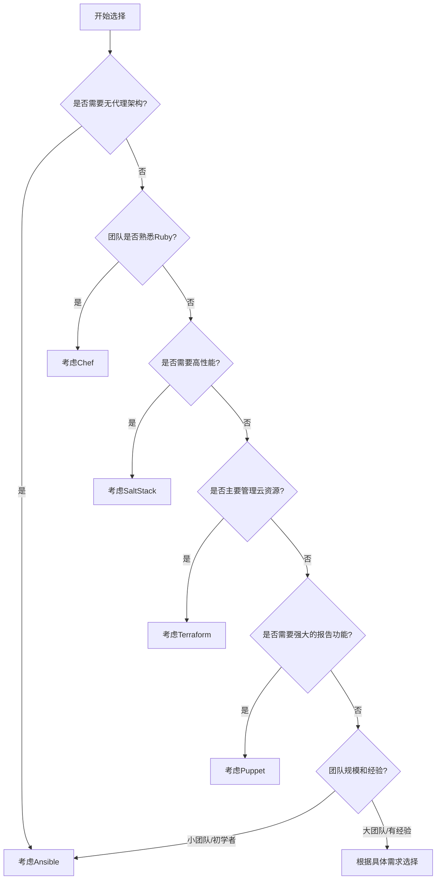

# 配置管理工具对比与选择

## 配置管理工具概述

配置管理工具是现代IT基础设施自动化的核心组件，它们使系统管理员和开发运维人员能够以代码形式定义、部署和管理服务器配置，从而实现基础设施即代码(Infrastructure as Code, IaC)的理念。随着云计算和DevOps实践的普及，配置管理工具已成为确保环境一致性、提高部署效率和降低人为错误的关键技术。

### 配置管理的核心价值

1. **一致性保障**：确保所有环境（开发、测试、生产）配置一致，减少"在我机器上能运行"的问题
2. **自动化部署**：将手动配置转变为自动化脚本，提高部署速度和可靠性
3. **版本控制**：配置代码可以纳入版本控制系统，实现变更追踪和回滚
4. **规模化管理**：轻松管理成百上千台服务器，实现批量配置和更新
5. **合规性与审计**：通过代码定义的配置便于审计和确保合规性

### 配置管理工具的基本功能

尽管不同的配置管理工具在实现方式上有所差异，但它们通常提供以下核心功能：

1. **资源抽象**：将服务器组件（如文件、服务、用户等）抽象为可管理的资源
2. **声明式配置**：描述系统期望状态而非执行步骤
3. **幂等性**：多次执行相同配置不会导致不同结果
4. **依赖管理**：处理资源之间的依赖关系
5. **模板系统**：支持配置文件模板化
6. **变量管理**：支持环境变量和配置参数
7. **目标系统分组**：对服务器进行分类和分组管理

## 主流配置管理工具详解

市场上存在多种配置管理工具，如Ansible、Puppet、Chef、SaltStack等。下面将详细介绍这些工具的架构特点、适用场景、优缺点和性能表现。

### Ansible

Ansible是由Red Hat开发和维护的开源配置管理工具，以简单易用和无代理架构著称。

#### 架构特点

Ansible采用无代理(Agentless)架构，通过SSH协议与目标系统通信：


**核心组件**：

1. **Inventory**：定义目标主机和组
2. **Playbook**：YAML格式的配置脚本，定义要执行的任务
3. **Modules**：执行特定任务的代码单元（如文件操作、包管理等）
4. **Roles**：组织和重用Playbook的方式
5. **Facts**：目标系统的信息收集

**工作流程**：

1. Ansible读取Inventory和Playbook
2. 通过SSH连接到目标服务器
3. 将执行所需的Python代码推送到目标服务器
4. 执行任务并收集结果
5. 断开连接，移除临时文件

#### 示例配置

**Inventory文件示例**：
```ini
[webservers]
web1.example.com
web2.example.com

[dbservers]
db1.example.com
db2.example.com

[all:vars]
ansible_user=deploy
```

**Playbook示例**：
```yaml
---
- name: 安装并配置Nginx
  hosts: webservers
  become: yes
  tasks:
    - name: 安装Nginx
      apt:
        name: nginx
        state: present
        update_cache: yes
      
    - name: 确保Nginx服务启动
      service:
        name: nginx
        state: started
        enabled: yes
    
    - name: 部署网站配置文件
      template:
        src: templates/nginx.conf.j2
        dest: /etc/nginx/sites-available/default
      notify: 重启Nginx
  
  handlers:
    - name: 重启Nginx
      service:
        name: nginx
        state: restarted
```

#### 优势

1. **简单易学**：YAML语法直观，学习曲线平缓
2. **无代理架构**：无需在目标系统安装额外软件
3. **广泛的模块支持**：4,000多个内置模块
4. **低资源消耗**：控制节点资源需求较低
5. **强大的社区支持**：活跃的社区和丰富的文档

#### 劣势

1. **性能限制**：大规模部署时可能面临性能瓶颈
2. **实时性较差**：基于轮询而非事件驱动
3. **状态管理有限**：相比Puppet等工具，状态管理能力较弱
4. **依赖SSH**：在某些环境中可能受限
5. **错误处理机制简单**：复杂场景下错误处理能力有限

#### 适用场景

- 中小型基础设施管理
- 临时任务执行和快速自动化
- 简单的应用部署
- 对现有系统的配置管理
- 团队DevOps实践的初期阶段

### Puppet

Puppet是最早的现代配置管理工具之一，由Puppet Inc.（原Puppet Labs）开发，提供了强大的声明式配置管理能力。

#### 架构特点

Puppet采用客户端-服务器架构，包含Puppet Master和Puppet Agent：


**核心组件**：

1. **Puppet Master**：中央服务器，编译和分发配置
2. **Puppet Agent**：运行在目标系统上的客户端
3. **Manifests**：包含资源声明的配置文件（.pp文件）
4. **Modules**：组织和重用代码的单元
5. **Hiera**：层次化数据存储
6. **PuppetDB**：存储系统状态和配置数据
7. **Facter**：收集系统信息的工具

**工作流程**：

1. Puppet Agent发送系统信息(Facts)到Master
2. Master编译适用于该Agent的Catalog（配置清单）
3. Agent接收Catalog并应用配置
4. Agent报告执行结果给Master
5. Master存储报告到PuppetDB

#### 示例配置

**Manifest文件示例**：
```puppet
# 安装并配置Nginx
class profile::web::nginx {
  package { 'nginx':
    ensure => installed,
  }
  
  service { 'nginx':
    ensure  => running,
    enable  => true,
    require => Package['nginx'],
  }
  
  file { '/etc/nginx/sites-available/default':
    ensure  => file,
    content => template('profile/nginx/default.erb'),
    require => Package['nginx'],
    notify  => Service['nginx'],
  }
}

node 'web1.example.com', 'web2.example.com' {
  include profile::web::nginx
}
```

**Hiera数据示例**：
```yaml
---
nginx::worker_processes: 4
nginx::worker_connections: 1024
nginx::keepalive_timeout: 65
```

#### 优势

1. **成熟稳定**：长期发展的成熟产品
2. **强大的声明式语言**：专为配置管理设计的DSL
3. **完善的依赖处理**：自动解析和管理资源依赖
4. **丰富的报告功能**：详细的执行报告和状态监控
5. **企业级支持**：商业版提供高级功能和支持

#### 劣势

1. **复杂性**：学习曲线较陡峭
2. **资源消耗**：Master服务器需要较多资源
3. **部署复杂**：初始设置相对复杂
4. **性能开销**：Agent定期轮询增加系统负担
5. **Ruby依赖**：对Ruby环境的依赖

#### 适用场景

- 大型异构环境管理
- 需要严格合规性的企业环境
- 长期运行的基础设施
- 复杂的配置管理需求
- 需要详细报告和审计的场景

### Chef

Chef是一个强大的自动化平台，特别适合开发人员，采用Ruby DSL定义配置。

#### 架构特点

Chef采用客户端-服务器架构，包含Chef Server、Chef Workstation和Chef Client：


**核心组件**：

1. **Chef Server**：中央服务器，存储配置数据和策略
2. **Chef Workstation**：开发和测试配置的工作站
3. **Chef Client**：运行在目标系统上的代理
4. **Cookbook**：包含配置代码的主要单元
5. **Recipe**：定义资源和操作的脚本
6. **Resource**：表示系统组件的抽象
7. **Knife**：命令行工具，管理Chef环境
8. **Ohai**：系统信息收集工具

**工作流程**：

1. 在Workstation上开发和测试Cookbook
2. 使用Knife上传Cookbook到Chef Server
3. 目标系统上的Chef Client定期检查Server
4. Client下载并应用适用的Cookbook
5. Client报告执行结果给Server

#### 示例配置

**Recipe示例**：
```ruby
# 安装并配置Nginx
package 'nginx' do
  action :install
end

service 'nginx' do
  action [:enable, :start]
  supports status: true, restart: true, reload: true
end

template '/etc/nginx/sites-available/default' do
  source 'default.erb'
  owner 'root'
  group 'root'
  mode '0644'
  variables(
    server_name: node['nginx']['server_name'],
    document_root: node['nginx']['document_root']
  )
  notifies :reload, 'service[nginx]'
end
```

**属性文件示例**：
```ruby
# attributes/default.rb
default['nginx']['server_name'] = 'example.com'
default['nginx']['document_root'] = '/var/www/html'
default['nginx']['worker_processes'] = 4
```

#### 优势

1. **代码优先**：适合熟悉编程的开发人员
2. **灵活性高**：Ruby DSL提供强大的编程能力
3. **测试驱动**：内置测试框架支持
4. **丰富的生态系统**：大量可用的Cookbook
5. **与CI/CD集成**：良好的持续集成支持

#### 劣势

1. **学习曲线陡峭**：需要Ruby知识
2. **复杂架构**：初始设置和维护复杂
3. **资源消耗高**：Server和Client都需要较多资源
4. **配置复杂**：相比其他工具配置更复杂
5. **过度灵活**：可能导致不一致的实践

#### 适用场景

- 开发人员主导的DevOps环境
- 需要高度定制化配置的场景
- 与CI/CD管道紧密集成的环境
- 复杂的应用部署和配置
- 团队已熟悉Ruby的组织

### SaltStack (Salt)

SaltStack是一个高速、可扩展的配置管理和远程执行工具，由VMware维护。

#### 架构特点

Salt支持两种架构模式：Master-Minion模式和Masterless模式：


**核心组件**：

1. **Salt Master**：中央控制服务器
2. **Salt Minion**：运行在目标系统上的代理
3. **States**：YAML格式的配置声明
4. **Pillars**：安全的变量存储
5. **Grains**：Minion系统信息
6. **Modules**：执行特定功能的Python代码
7. **Formulas**：可重用的State集合

**工作流程**：

1. Minion启动并连接到Master
2. Master接受Minion并分配密钥
3. Master根据目标选择器向Minion发送命令
4. Minion执行命令并返回结果
5. Master处理和显示结果

#### 示例配置

**State文件示例**：
```yaml
# 安装并配置Nginx
nginx:
  pkg.installed: []
  service.running:
    - enable: True
    - require:
      - pkg: nginx

/etc/nginx/sites-available/default:
  file.managed:
    - source: salt://nginx/files/default.jinja
    - template: jinja
    - user: root
    - group: root
    - mode: 644
    - require:
      - pkg: nginx
    - watch_in:
      - service: nginx
```

**Pillar数据示例**：
```yaml
# pillar/nginx.sls
nginx:
  server_name: example.com
  worker_processes: 4
  worker_connections: 1024
  keepalive_timeout: 65
```

#### 优势

1. **高性能**：ZeroMQ通信使其非常快速
2. **可扩展性**：能够管理数万台服务器
3. **远程执行**：强大的远程命令执行能力
4. **灵活的目标选择**：多种方式选择目标Minion
5. **事件驱动**：支持事件驱动的配置管理

#### 劣势

1. **文档不完善**：相比其他工具文档质量较低
2. **学习曲线**：概念较多，初学者可能困惑
3. **安全考虑**：默认配置下的安全性问题
4. **依赖ZeroMQ**：特定环境中可能有限制
5. **社区规模**：相比Ansible和Puppet社区较小

#### 适用场景

- 大规模基础设施管理
- 需要高性能远程执行的环境
- 需要实时响应的系统
- 云环境自动化
- 需要事件驱动自动化的场景

### Terraform

虽然Terraform主要是一个基础设施编排工具而非传统的配置管理工具，但它在现代云环境中扮演着越来越重要的角色，值得在此讨论。

#### 架构特点

Terraform采用声明式配置，使用HashiCorp配置语言(HCL)定义基础设施：


**核心组件**：

1. **Terraform CLI**：命令行工具
2. **Provider**：与特定服务交互的插件
3. **Resource**：要管理的基础设施组件
4. **Module**：可重用的配置单元
5. **State**：当前基础设施状态记录
6. **Plan**：执行计划，显示将要进行的更改
7. **Apply**：执行计划并创建/修改资源

**工作流程**：

1. 编写HCL配置文件定义期望状态
2. 执行`terraform init`初始化环境
3. 执行`terraform plan`生成执行计划
4. 执行`terraform apply`应用更改
5. Terraform更新状态文件

#### 示例配置

**基础设施定义示例**：
```hcl
# 定义AWS提供商
provider "aws" {
  region = "us-west-2"
}

# 创建VPC
resource "aws_vpc" "main" {
  cidr_block = "10.0.0.0/16"
  
  tags = {
    Name = "MainVPC"
  }
}

# 创建子网
resource "aws_subnet" "public" {
  vpc_id     = aws_vpc.main.id
  cidr_block = "10.0.1.0/24"
  
  tags = {
    Name = "PublicSubnet"
  }
}

# 创建EC2实例
resource "aws_instance" "web" {
  ami           = "ami-0c55b159cbfafe1f0"
  instance_type = "t2.micro"
  subnet_id     = aws_subnet.public.id
  
  tags = {
    Name = "WebServer"
  }
}
```

**模块使用示例**：
```hcl
module "vpc" {
  source = "terraform-aws-modules/vpc/aws"
  
  name = "my-vpc"
  cidr = "10.0.0.0/16"
  
  azs             = ["us-west-2a", "us-west-2b", "us-west-2c"]
  private_subnets = ["10.0.1.0/24", "10.0.2.0/24", "10.0.3.0/24"]
  public_subnets  = ["10.0.101.0/24", "10.0.102.0/24", "10.0.103.0/24"]
  
  enable_nat_gateway = true
  single_nat_gateway = true
}
```

#### 优势

1. **云原生设计**：专为现代云环境设计
2. **基础设施即代码**：完整的IaC实现
3. **状态管理**：跟踪和管理基础设施状态
4. **提供商生态系统**：支持众多云服务和工具
5. **计划和预览**：可预览变更影响

#### 劣势

1. **配置管理能力有限**：主要关注资源创建而非配置
2. **状态管理复杂性**：需要妥善管理状态文件
3. **学习曲线**：HCL语法需要学习
4. **有限的操作系统配置**：需要结合其他工具进行OS配置
5. **幂等性挑战**：某些场景下难以保证幂等性

#### 适用场景

- 云基础设施的创建和管理
- 多云环境编排
- 基础设施版本控制
- 临时环境的创建和销毁
- 与配置管理工具配合使用

## 工具对比与选择指南

### 性能对比

不同配置管理工具在性能方面有显著差异，以下是在管理1000台服务器时的性能比较：

| 工具 | 初始部署时间 | 配置更新时间 | 内存占用 | CPU使用率 |
|------|------------|------------|---------|----------|
| Ansible | 较长 | 中等 | 低 | 低 |
| Puppet | 中等 | 较短 | 高 | 中等 |
| Chef | 较长 | 中等 | 高 | 高 |
| SaltStack | 短 | 短 | 中等 | 中等 |
| Terraform | N/A | 中等 | 低 | 低 |

### 学习曲线对比

各工具的学习难度也是选择时的重要考虑因素：


### 功能特性对比表

| 特性 | Ansible | Puppet | Chef | SaltStack | Terraform |
|------|---------|--------|------|-----------|-----------|
| 架构 | 无代理 | 客户端-服务器 | 客户端-服务器 | 客户端-服务器/无代理 | 客户端 |
| 配置语言 | YAML | Puppet DSL | Ruby DSL | YAML/Jinja | HCL |
| 通信协议 | SSH | HTTPS | HTTPS | ZeroMQ | HTTPS |
| 可扩展性 | 中等 | 高 | 高 | 非常高 | 高 |
| 实时命令执行 | 支持 | 有限 | 有限 | 强大 | 不支持 |
| 状态管理 | 有限 | 强大 | 强大 | 强大 | 核心功能 |
| 云集成 | 良好 | 良好 | 良好 | 良好 | 卓越 |
| 社区活跃度 | 非常高 | 高 | 中等 | 中等 | 非常高 |
| 企业支持 | Red Hat | Puppet Inc. | Progress Chef | VMware | HashiCorp |
| 开源许可 | GPL | Apache | Apache | Apache | MPL |

### 选择决策树

以下决策树可以帮助根据具体需求选择合适的配置管理工具：



### 根据场景选择工具

#### 小型团队/初创公司

**推荐工具**：Ansible

**原因**：
- 简单易学，快速上手
- 无需额外基础设施
- 适合小规模部署
- 文档完善，社区活跃

#### 大型企业环境

**推荐工具**：Puppet或SaltStack

**原因**：
- 强大的扩展性和性能
- 完善的报告和审计功能
- 企业级支持选项
- 适合复杂、异构环境

#### 开发人员主导的团队

**推荐工具**：Chef或Terraform

**原因**：
- 代码优先的方法
- 与开发工作流程集成
- 强大的测试和CI/CD支持
- 适合频繁变更的环境

#### 云原生环境

**推荐工具**：Terraform + Ansible

**原因**：
- Terraform管理云资源
- Ansible配置操作系统和应用
- 组合提供完整的IaC解决方案
- 适合多云和混合云环境

#### 需要实时控制的环境

**推荐工具**：SaltStack

**原因**：
- 高性能的事件系统
- 强大的远程执行功能
- 实时响应能力
- 适合需要频繁操作的环境

## 实施最佳实践

无论选择哪种配置管理工具，以下最佳实践都能帮助提高实施效果：

### 代码组织与结构

1. **模块化设计**
   - 将配置分解为可重用的模块
   - 遵循单一职责原则
   - 创建层次化的配置结构

2. **版本控制**
   - 将所有配置代码纳入Git等版本控制系统
   - 实施分支策略（如GitFlow）
   - 使用有意义的提交信息

3. **环境分离**
   - 明确区分开发、测试、生产环境
   - 使用变量处理环境差异
   - 实施环境提升流程

### 测试与验证

1. **语法检查**
   - 使用工具验证配置语法
   - 在CI/CD管道中集成语法检查

2. **单元测试**
   - 测试单个模块和组件
   - 使用专用测试框架（如InSpec、ServerSpec）

3. **集成测试**
   - 在临时环境中测试完整配置
   - 使用容器或虚拟机进行测试

4. **持续验证**
   - 定期验证生产环境配置
   - 检测配置漂移

### 安全考虑

1. **敏感数据管理**
   - 使用专用工具管理密钥（如Vault、KMS）
   - 避免在配置中硬编码敏感信息
   - 实施最小权限原则

2. **访问控制**
   - 限制配置管理工具的访问权限
   - 实施角色基础访问控制
   - 审计所有配置变更

3. **网络安全**
   - 使用加密通信
   - 限制管理网络访问
   - 考虑使用专用管理网络

### 扩展性与性能

1. **分层架构**
   - 对于大型环境，考虑分层架构
   - 使用中继服务器或代理
   - 实施负载均衡

2. **批处理策略**
   - 使用滚动更新减少影响
   - 实施批处理和限流
   - 考虑时间窗口和维护期

3. **缓存与优化**
   - 利用工具提供的缓存机制
   - 优化配置代码性能
   - 监控和调整资源使用

### 文档与知识共享

1. **代码即文档**
   - 编写自解释的代码
   - 使用有意义的命名
   - 添加适当的注释

2. **专用文档**
   - 记录架构决策
   - 创建操作手册
   - 维护常见问题解答

3. **知识转移**
   - 进行团队培训
   - 建立内部知识库
   - 鼓励配对编程和代码审查

## 案例研究：不同环境下的工具选择

### 案例1：电子商务平台

**环境特点**：
- 混合云架构（AWS + 本地数据中心）
- 需要频繁部署新功能
- 高可用性要求
- DevOps文化成熟

**选择方案**：Terraform + Ansible

**实施策略**：
- 使用Terraform管理云资源（VPC、EC2、RDS等）
- 
我将继续为您提供关于配置管理工具对比与选择的内容。

### 案例1：电子商务平台（续）

**实施策略**：
- 使用Terraform管理云资源（VPC、EC2、RDS等）
- 使用Ansible配置应用服务器和部署应用
- 实施基础设施即代码(IaC)工作流
- 通过CI/CD管道自动化部署流程

**成果**：
- 部署时间从数小时减少到30分钟
- 环境一致性提高95%
- 手动配置错误减少80%
- 开发团队能够自助创建测试环境

### 案例2：金融服务机构

**环境特点**：
- 严格的合规要求
- 大型异构环境（Windows和Linux）
- 变更管理流程严格
- 安全性是首要考虑因素

**选择方案**：Puppet Enterprise

**实施策略**：
- 建立中央Puppet基础设施
- 实施基于角色的访问控制
- 利用Puppet的报告和审计功能
- 分阶段推出，从非关键系统开始

**成果**：
- 配置合规性提高到99.5%
- 审计准备时间减少75%
- 安全补丁部署时间从周减少到天
- 建立了配置基线和漂移检测

### 案例3：SaaS初创公司

**环境特点**：
- 完全基于云（AWS）
- 小型开发团队
- 快速迭代和部署
- 资源有限

**选择方案**：Ansible + AWS CloudFormation

**实施策略**：
- 使用CloudFormation管理AWS资源
- 使用Ansible进行应用配置和部署
- 实施GitOps工作流
- 自动化测试和部署管道

**成果**：
- 从代码提交到部署时间减少90%
- 开发环境与生产环境一致性提高
- 减少了对专门DevOps人员的需求
- 支持每日多次部署

### 案例4：大型教育机构

**环境特点**：
- 分布式校园网络
- 多种服务器和应用
- IT团队技能水平不均
- 预算限制

**选择方案**：SaltStack

**实施策略**：
- 建立中央Salt Master服务器
- 分阶段部署Salt Minions
- 创建标准化配置模板
- 实施远程执行功能进行日常管理

**成果**：
- 服务器管理效率提高200%
- 标准化配置减少了支持请求
- 实现了快速响应安全事件的能力
- IT团队能够管理更多服务器

## 配置管理工具的未来趋势

随着技术的发展，配置管理工具也在不断演进。以下是一些值得关注的趋势：

### 1. 容器和Kubernetes集成

随着容器技术和Kubernetes的普及，配置管理工具正在加强与这些技术的集成：

- **声明式配置**：向Kubernetes的声明式模型靠拢
- **操作符模式**：采用Kubernetes操作符模式管理应用
- **GitOps工作流**：将Git作为单一事实来源
- **混合管理**：同时管理容器化和传统工作负载

### 2. 无服务器和边缘计算支持

新的计算模式需要配置管理工具进行适应：

- **函数即服务(FaaS)管理**：配置和部署无服务器函数
- **边缘设备管理**：支持远程和断连环境
- **轻量级代理**：适应资源受限的环境
- **事件驱动配置**：响应系统和环境变化

### 3. 人工智能和机器学习集成

AI/ML正在改变配置管理方式：

- **智能异常检测**：自动识别配置问题
- **预测性分析**：预测配置变更的影响
- **自动修复**：自动解决常见配置问题
- **自适应配置**：根据工作负载自动调整配置

### 4. 安全和合规性增强

随着安全威胁的增加，配置管理工具正在加强安全功能：

- **安全即代码**：将安全策略作为代码管理
- **合规性自动化**：自动验证和报告合规状态
- **漏洞管理**：自动检测和修复安全漏洞
- **零信任模型**：实施最小权限和身份验证

### 5. 多云和混合云管理

随着多云战略的普及，配置管理工具需要支持跨云环境：

- **云无关抽象**：提供统一的配置接口
- **多云协调**：协调跨云资源和服务
- **混合环境管理**：无缝管理本地和云资源
- **成本优化**：帮助优化多云环境成本

## 配置管理工具实施路线图

对于计划采用或升级配置管理工具的组织，以下是一个建议的实施路线图：

### 阶段1：评估与规划（1-2个月）

1. **需求分析**
   - 识别当前痛点和挑战
   - 定义成功标准和目标
   - 评估团队技能和资源

2. **工具选择**
   - 根据需求评估不同工具
   - 考虑技术和非技术因素
   - 进行概念验证测试

3. **架构设计**
   - 设计配置管理架构
   - 定义环境和分组策略
   - 规划安全和访问控制

### 阶段2：基础设施搭建（1个月）

1. **环境准备**
   - 部署核心基础设施
   - 配置网络和安全设置
   - 建立备份和恢复机制

2. **工具配置**
   - 安装和配置选定工具
   - 设置用户和权限
   - 配置集成点（如版本控制、CI/CD）

3. **基础模块开发**
   - 创建核心配置模块
   - 开发通用工具和库
   - 建立测试框架

### 阶段3：试点项目（1-2个月）

1. **选择试点**
   - 选择适当规模的非关键系统
   - 定义明确的范围和目标
   - 建立成功指标

2. **实施自动化**
   - 将试点系统纳入配置管理
   - 开发和测试配置代码
   - 实施自动化部署流程

3. **评估与调整**
   - 收集反馈和指标
   - 解决发现的问题
   - 调整方法和工具

### 阶段4：扩展与标准化（3-6个月）

1. **扩大覆盖范围**
   - 逐步将更多系统纳入管理
   - 优先处理高价值和高风险系统
   - 建立迁移计划和时间表

2. **标准化实践**
   - 制定编码标准和最佳实践
   - 创建模板和参考架构
   - 建立审查和质量控制流程

3. **知识转移**
   - 培训团队成员
   - 创建文档和知识库
   - 建立支持机制

### 阶段5：优化与创新（持续）

1. **性能优化**
   - 监控和优化系统性能
   - 解决扩展性问题
   - 改进资源利用

2. **流程改进**
   - 自动化更多手动流程
   - 简化和优化工作流
   - 集成其他DevOps工具

3. **创新应用**
   - 探索新功能和用例
   - 实施高级自动化场景
   - 采用新兴技术和方法

## 常见挑战与解决方案

在实施配置管理工具的过程中，组织可能会遇到各种挑战。以下是一些常见问题及其解决方案：

### 技术挑战

1. **学习曲线陡峭**
   
   **解决方案**：
   - 分阶段培训，从基础到高级
   - 创建内部知识库和示例库
   - 考虑外部培训和认证
   - 实施导师制，经验丰富的团队成员指导新手

2. **遗留系统集成**
   
   **解决方案**：
   - 创建适配器和包装器
   - 使用混合方法，逐步迁移
   - 为无法直接管理的系统创建代理
   - 考虑使用API和自定义脚本桥接差距

3. **性能和扩展性问题**
   
   **解决方案**：
   - 实施分层架构
   - 优化配置代码和模块
   - 使用缓存和增量更新
   - 监控性能并进行容量规划

### 组织挑战

1. **团队抵抗变化**
   
   **解决方案**：
   - 清晰沟通变更的价值和好处
   - 让团队参与工具选择和实施
   - 展示早期成功和快速胜利
   - 提供充分的培训和支持

2. **跨团队协作困难**
   
   **解决方案**：
   - 建立跨职能工作组
   - 定义明确的责任和流程
   - 使用共享平台促进协作
   - 实施统一的工作流和标准

3. **缺乏管理支持**
   
   **解决方案**：
   - 量化自动化的ROI和业务价值
   - 展示风险减少和合规性改进
   - 将配置管理与业务目标对齐
   - 从小处着手，展示成功案例

### 流程挑战

1. **配置漂移**
   
   **解决方案**：
   - 实施定期合规性检查
   - 自动修复检测到的漂移
   - 禁止手动更改，或至少记录所有更改
   - 实施强制性变更管理流程

2. **环境不一致**
   
   **解决方案**：
   - 使用相同的配置代码管理所有环境
   - 实施环境参数化而非硬编码
   - 自动化环境创建和销毁
   - 定期验证环境一致性

3. **版本控制和变更管理**
   
   **解决方案**：
   - 将所有配置纳入版本控制
   - 实施分支策略和合并流程
   - 自动化测试和验证
   - 建立变更审批和发布流程

## 结论

配置管理工具是现代IT基础设施自动化的核心组件，选择合适的工具对于实现高效、可靠的基础设施管理至关重要。本文详细对比了Ansible、Puppet、Chef、SaltStack和Terraform等主流配置管理工具的架构特点、适用场景、优缺点和性能表现。

在选择配置管理工具时，组织应考虑多种因素，包括团队规模和技能、基础设施复杂性、安全和合规要求、性能需求以及与现有工具的集成。没有一种工具能够适合所有场景，最佳选择取决于组织的具体需求和环境。

随着云计算、容器化、无服务器计算和边缘计算等技术的发展，配置管理工具也在不断演进，增加对这些新技术的支持，并融合人工智能和机器学习等创新功能。组织应保持对这些趋势的关注，并定期评估其配置管理策略，以确保它能够满足不断变化的业务和技术需求。

最终，成功的配置管理不仅仅是选择正确的工具，还包括建立适当的流程、培养团队技能、促进协作文化，以及持续改进和创新。通过综合考虑这些因素，组织可以建立高效、可靠、安全的基础设施管理能力，为业务创新和增长提供坚实基础。