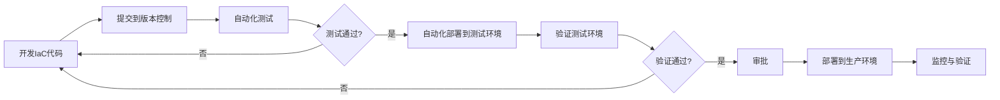

# 基础设施即代码(IaC)理念

## 什么是基础设施即代码

基础设施即代码(Infrastructure as Code, IaC)是一种通过代码而非手动流程来管理和配置计算基础设施的方法。它将传统的手动基础设施管理转变为使用代码和软件开发技术来自动化基础设施的配置、部署和管理。在IaC模型中，基础设施的配置被定义为代码，存储在版本控制系统中，并遵循与应用程序代码相同的开发生命周期。

### 核心定义

基础设施即代码可以定义为：

> 通过机器可读的定义文件而非物理硬件配置或交互式配置工具来管理和配置基础设施的过程。

这种方法将基础设施视为软件，应用软件工程实践来管理IT基础设施。通过代码定义的基础设施可以被版本控制、测试、重用，并且可以实现自动化部署和管理。

### 与传统基础设施管理的区别

为了更好地理解IaC的价值，我们可以对比传统的基础设施管理方法与IaC方法：

| 传统基础设施管理 | 基础设施即代码 |
|----------------|--------------|
| 手动配置服务器和网络设备 | 通过代码自动配置基础设施 |
| 配置过程难以重现 | 配置过程完全可重现 |
| 环境之间存在差异 | 环境保持一致性 |
| 变更难以追踪 | 变更通过版本控制系统追踪 |
| 扩展需要大量人工干预 | 扩展可以自动化实现 |
| 配置漂移常见 | 配置漂移可被检测和修复 |
| 知识集中在少数专家手中 | 知识在代码中共享 |
| 恢复灾难复杂且耗时 | 快速灾难恢复 |

## IaC的发展历程

基础设施即代码的概念并非一夜之间出现，而是随着IT行业的发展逐渐演变而来。了解其发展历程有助于我们更好地理解IaC的价值和未来方向。

### 早期自动化脚本阶段(1990s-2000s)

在IaC概念正式出现之前，系统管理员已经开始使用脚本来自动化重复性任务：

- Shell脚本(Bash, PowerShell)用于自动化系统配置
- 批处理文件(.bat)用于Windows系统管理
- 自定义脚本用于软件安装和配置

这些早期尝试虽然提高了效率，但存在以下问题：
- 脚本通常是命令式的，关注"如何做"而非"做什么"
- 缺乏版本控制和协作机制
- 难以处理复杂的依赖关系
- 脚本执行结果不一致

### 配置管理工具出现(2000s中期)

随着数据中心规模扩大，更专业的配置管理工具开始出现：

- 2005年：Puppet发布，引入了声明式配置管理
- 2009年：Chef发布，采用Ruby DSL进行配置定义
- 2011年：Ansible发布，强调简单性和无代理架构
- 2011年：SaltStack发布，专注于高速、可扩展的基础设施管理

这些工具带来了重要改进：
- 声明式配置取代命令式脚本
- 引入幂等性概念，确保多次运行产生相同结果
- 提供模块化和可重用组件
- 支持大规模基础设施管理

### 云计算与基础设施编排(2010s)

云计算的兴起为IaC带来了新的发展机遇：

- 2010年：Amazon发布CloudFormation，用于AWS资源编排
- 2014年：HashiCorp发布Terraform，支持多云基础设施编排
- 2015年：Azure Resource Manager发布，用于Azure资源管理
- 2016年：Google Cloud Deployment Manager正式发布

云计算时代的IaC特点：
- 基础设施资源可通过API创建和管理
- 支持完整的基础设施生命周期管理
- 多云和混合云环境的统一管理
- 基础设施即服务(IaaS)模型的普及

### 容器化与不可变基础设施(2010s中后期)

容器技术的普及进一步推动了IaC的发展：

- 2013年：Docker发布，简化了容器使用
- 2014年：不可变基础设施概念流行
- 2015年：Kubernetes发布，成为容器编排标准
- 2017年：Kubernetes Operators引入，扩展了声明式API

这一阶段的关键发展：
- 从配置管理转向不可变基础设施
- 容器镜像成为应用分发的标准方式
- 声明式API用于基础设施管理
- 微服务架构的普及

### GitOps与持续交付(2018至今)

最近几年，GitOps模式将IaC与持续交付实践结合：

- 2018年：Weaveworks提出GitOps概念
- 2019年：Flux CD和ArgoCD等GitOps工具流行
- 2020年：平台工程实践兴起
- 2022年：多云和混合云IaC工具成熟

当前IaC的特点：
- Git作为单一事实来源
- 自动化协调确保实际状态与期望状态一致
- 基础设施变更通过Pull Request流程管理
- 平台即产品的理念普及

## IaC的核心原则

无论使用哪种IaC工具或方法，以下核心原则都是基础设施即代码实践的基础。

### 声明式定义

声明式方法是IaC的核心原则之一，它关注"做什么"而非"如何做"：

- **定义期望状态**：代码描述系统的最终期望状态
- **抽象实现细节**：工具负责确定如何达到期望状态
- **减少复杂性**：开发人员无需了解底层实现机制
- **提高可读性**：代码更清晰地表达意图

声明式定义示例(Terraform):
```hcl
resource "aws_instance" "web_server" {
  ami           = "ami-0c55b159cbfafe1f0"
  instance_type = "t2.micro"
  tags = {
    Name = "WebServer"
  }
}
```

相比之下，命令式方法(AWS CLI脚本):
```bash
aws ec2 run-instances \
  --image-id ami-0c55b159cbfafe1f0 \
  --instance-type t2.micro \
  --tag-specifications 'ResourceType=instance,Tags=[{Key=Name,Value=WebServer}]'
```

声明式方法不仅更简洁，而且能够更好地处理状态管理和变更应用。

### 幂等性

幂等性是指无论执行多少次相同的操作，结果都是一致的。这是IaC的关键特性：

- **消除不确定性**：多次运行产生相同结果
- **简化错误恢复**：失败后可以安全地重试
- **支持增量更新**：只应用必要的变更
- **减少人为错误**：不需要判断是否已执行过操作

幂等性示例(Ansible):
```yaml
- name: 确保Nginx已安装并运行
  hosts: webservers
  tasks:
    - name: 安装Nginx
      apt:
        name: nginx
        state: present
      
    - name: 确保Nginx服务启动
      service:
        name: nginx
        state: started
        enabled: yes
```

无论执行多少次，结果都是一致的：Nginx已安装且正在运行。

### 版本控制

将基础设施代码纳入版本控制系统是IaC的基础实践：

- **变更历史**：记录所有基础设施变更
- **协作基础**：支持多人协作修改基础设施
- **回滚能力**：在问题出现时可以回到之前的状态
- **审计跟踪**：满足合规性和安全性要求
- **知识共享**：代码即文档，减少知识孤岛

版本控制最佳实践：
- 使用Git等分布式版本控制系统
- 实施分支策略(如GitFlow或Trunk-Based Development)
- 使用有意义的提交信息
- 实施代码审查流程
- 将基础设施代码与应用代码分开管理

### 模块化与可重用性

良好的IaC实践强调代码的模块化和可重用性：

- **减少重复**：通过抽象共同模式减少代码重复
- **标准化**：确保一致的配置和最佳实践
- **简化维护**：集中更新共享组件
- **提高质量**：共享模块经过更多测试和使用

模块化示例(Terraform模块):
```hcl
module "vpc" {
  source = "./modules/vpc"
  
  name = "production-vpc"
  cidr = "10.0.0.0/16"
  azs  = ["us-west-2a", "us-west-2b", "us-west-2c"]
}

module "web_servers" {
  source = "./modules/web_servers"
  
  vpc_id = module.vpc.vpc_id
  count  = 3
}
```

### 测试与验证

IaC代码应该像应用程序代码一样经过测试：

- **语法验证**：确保代码格式正确
- **静态分析**：检查安全问题和最佳实践
- **单元测试**：测试单个模块功能
- **集成测试**：测试组件之间的交互
- **合规性检查**：验证是否符合组织策略

测试工具示例：
- Terraform: `terraform validate`, `tflint`, `terraform-compliance`
- Ansible: `ansible-lint`, `molecule`
- CloudFormation: `cfn-lint`, `taskcat`
- 通用: `InSpec`, `ServerSpec`, `Open Policy Agent`

测试自动化示例(CI/CD管道):
```yaml
# .github/workflows/terraform.yml
name: 'Terraform CI'

on:
  push:
    branches: [ main ]
  pull_request:
    branches: [ main ]

jobs:
  validate:
    runs-on: ubuntu-latest
    steps:
    - uses: actions/checkout@v2
    
    - name: Setup Terraform
      uses: hashicorp/setup-terraform@v1
    
    - name: Terraform Format
      run: terraform fmt -check
    
    - name: Terraform Init
      run: terraform init
    
    - name: Terraform Validate
      run: terraform validate
    
    - name: Terraform Plan
      run: terraform plan
```

### 自动化与持续交付

自动化是IaC的核心价值之一，通过CI/CD管道实现基础设施的持续交付：

- **减少手动干预**：消除人为错误
- **加速交付**：缩短从变更到部署的时间
- **标准化流程**：确保一致的部署流程
- **可见性**：提供变更和部署的可见性

IaC持续交付流程：



## IaC的实现方式

基础设施即代码可以通过多种方式实现，每种方式都有其特点和适用场景。

### 配置管理工具

配置管理工具专注于服务器配置和应用部署：

- **代表工具**：Ansible, Puppet, Chef, SaltStack
- **主要功能**：软件安装、配置文件管理、服务管理
- **适用场景**：服务器配置、应用部署、配置标准化

Ansible示例(配置Web服务器):
```yaml
---
- name: 配置Web服务器
  hosts: webservers
  become: yes
  tasks:
    - name: 安装必要软件包
      apt:
        name:
          - nginx
          - php-fpm
          - mysql-client
        state: present
        update_cache: yes
      
    - name: 配置Nginx虚拟主机
      template:
        src: templates/vhost.conf.j2
        dest: /etc/nginx/sites-available/default
      notify: 重启Nginx
    
    - name: 确保服务运行
      service:
        name: "{{ item }}"
        state: started
        enabled: yes
      loop:
        - nginx
        - php7.4-fpm
  
  handlers:
    - name: 重启Nginx
      service:
        name: nginx
        state: restarted
```

### 基础设施编排工具

基础设施编排工具专注于创建和管理云资源：

- **代表工具**：Terraform, AWS CloudFormation, Azure Resource Manager
- **主要功能**：资源创建、依赖管理、状态跟踪
- **适用场景**：云资源管理、多云部署、基础设施生命周期管理

Terraform示例(创建AWS基础设施):
```hcl
provider "aws" {
  region = "us-west-2"
}

# 创建VPC
resource "aws_vpc" "main" {
  cidr_block = "10.0.0.0/16"
  
  tags = {
    Name = "MainVPC"
  }
}

# 创建子网
resource "aws_subnet" "public" {
  vpc_id            = aws_vpc.main.id
  cidr_block        = "10.0.1.0/24"
  availability_zone = "us-west-2a"
  
  tags = {
    Name = "PublicSubnet"
  }
}

# 创建安全组
resource "aws_security_group" "web" {
  name        = "web-sg"
  description = "Allow web traffic"
  vpc_id      = aws_vpc.main.id
  
  ingress {
    from_port   = 80
    to_port     = 80
    protocol    = "tcp"
    cidr_blocks = ["0.0.0.0/0"]
  }
  
  egress {
    from_port   = 0
    to_port     = 0
    protocol    = "-1"
    cidr_blocks = ["0.0.0.0/0"]
  }
}

# 创建EC2实例
resource "aws_instance" "web" {
  ami                    = "ami-0c55b159cbfafe1f0"
  instance_type          = "t2.micro"
  subnet_id              = aws_subnet.public.id
  vpc_security_group_ids = [aws_security_group.web.id]
  
  tags = {
    Name = "WebServer"
  }
}
```

### 容器编排工具

容器编排工具管理容器化应用的部署和运行：

- **代表工具**：Kubernetes, Docker Compose, Amazon ECS
- **主要功能**：容器部署、服务发现、负载均衡、自动扩展
- **适用场景**：微服务架构、云原生应用、DevOps环境

Kubernetes示例(部署Web应用):
```yaml
apiVersion: apps/v1
kind: Deployment
metadata:
  name: web-app
  labels:
    app: web
spec:
  replicas: 3
  selector:
    matchLabels:
      app: web
  template:
    metadata:
      labels:
        app: web
    spec:
      containers:
      - name: web
        image: nginx:1.19
        ports:
        - containerPort: 80
        resources:
          limits:
            cpu: "0.5"
            memory: "512Mi"
          requests:
            cpu: "0.2"
            memory: "256Mi"
---
apiVersion: v1
kind: Service
metadata:
  name: web-service
spec:
  selector:
    app: web
  ports:
  - port: 80
    targetPort: 80
  type: LoadBalancer
```

### 服务器模板工具

服务器模板工具用于创建预配置的机器镜像：

- **代表工具**：Packer, Image Builder, Vagrant
- **主要功能**：创建一致的机器镜像
- **适用场景**：不可变基础设施、快速部署、标准化环境

Packer示例(创建AWS AMI):
```json
{
  "variables": {
    "aws_access_key": "{{env `AWS_ACCESS_KEY_ID`}}",
    "aws_secret_key": "{{env `AWS_SECRET_ACCESS_KEY`}}"
  },
  "builders": [
    {
      "type": "amazon-ebs",
      "access_key": "{{user `aws_access_key`}}",
      "secret_key": "{{user `aws_secret_key`}}",
      "region": "us-west-2",
      "source_ami_filter": {
        "filters": {
          "virtualization-type": "hvm",
          "name": "ubuntu/images/*ubuntu-focal-20.04-amd64-server-*",
          "root-device-type": "ebs"
        },
        "owners": ["099720109477"],
        "most_recent": true
      },
      "instance_type": "t2.micro",
      "ssh_username": "ubuntu",
      "ami_name": "web-server-{{timestamp}}"
    }
  ],
  "provisioners": [
    {
      "type": "shell",
      "inline": [
        "sudo apt-get update",
        "sudo apt-get install -y nginx",
        "sudo systemctl enable nginx"
      ]
    }
  ]
}
```

### 政策即代码工具

政策即代码工具用于定义和强制执行基础设施策略：

- **代表工具**：Open Policy Agent, HashiCorp Sentinel, AWS Config
- **主要功能**：策略定义、合规性检查、安全验证
- **适用场景**：安全合规、治理、风险管理

Open Policy Agent示例(Kubernetes准入控制):
```rego
package kubernetes.admission

deny[msg] {
  input.request.kind.kind == "Pod"
  not input.request.object.spec.securityContext.runAsNonRoot
  
  msg := "Pods must run as non-root user"
}

deny[msg] {
  input.request.kind.kind == "Pod"
  container := input.request.object.spec.containers[_]
  not container.resources.limits
  
  msg := sprintf("Container %v must specify resource limits", [container.name])
}
```

## IaC的价值与优势

基础设施即代码为组织带来多方面的价值和优势，从技术层面到业务层面都有显著影响。

### 技术价值

#### 一致性与可重复性

IaC确保环境的一致性和部署的可重复性：

- **消除环境差异**：所有环境使用相同的代码创建
- **减少"在我机器上能运行"问题**：开发、测试和生产环境保持一致
- **可靠的部署**：每次部署使用相同的流程
- **减少配置漂移**：定期应用配置确保环境不会偏离期望状态

#### 速度与效率

IaC显著提高基础设施管理的速度和效率：

- **自动化部署**：从数小时或数天减少到数分钟
- **快速环境创建**：按需创建新环境
- **并行工作**：团队成员可以并行处理基础设施变更
- **减少手动操作**：自动化重复性任务

#### 可扩展性

IaC使基础设施能够轻松扩展：

- **按需扩展**：根据需求自动扩展资源
- **复制环境**：轻松创建环境副本
- **标准化扩展**：确保扩展过程的一致性
- **管理复杂性**：处理大规模基础设施的复杂性

#### 风险降低

IaC减少与基础设施变更相关的风险：

- **减少人为错误**：自动化减少手动操作错误
- **变更可预测**：通过测试和验证确保变更结果可预测
- **快速恢复**：在问题出现时能够快速回滚
- **灾难恢复**：能够快速重建环境

### 业务价值

#### 成本优化

IaC帮助组织优化基础设施成本：

- **资源优化**：避免资源浪费和过度配置
- **自动化节约**：减少手动操作的人力成本
- **按需资源**：只在需要时创建和使用资源
- **标准化节约**：通过标准化减少支持成本

#### 加速创新

IaC使组织能够更快地创新：

- **缩短上市时间**：加速环境部署和应用发布
- **实验能力**：轻松创建和销毁测试环境
- **快速迭代**：支持敏捷和DevOps实践
- **专注于价值**：减少基础设施管理负担，专注于业务价值

#### 提高质量

IaC提高产品和服务质量：

- **减少缺陷**：环境一致性减少环境相关问题
- **可靠部署**：减少部署失败和相关问题
- **持续改进**：通过自动化测试和验证提高质量
- **标准化实践**：确保最佳实践的一致应用

#### 合规与治理

IaC简化合规性和治理：

- **审计跟踪**：所有变更都有记录
- **策略执行**：自动化策略检查和执行
- **一致性合规**：确保所有环境符合要求
- **快速修复**：在发现合规问题时快速响应

## IaC实施策略

成功实施IaC需要周密的规划和执行策略。以下是实施IaC的关键步骤和最佳实践。

### 评估与规划

在开始IaC实施之前，进行全面评估和规划：

1. **当前状态评估**
   - 盘点现有基础设施和管理流程
   - 识别手动流程和自动化机会
   - 评估团队技能和知识差距

2. **目标定义**
   - 设定明确的IaC实施目标
   - 定义成功指标和关键绩效指标(KPI)
   - 确定优先级和实施范围

3. **工具选择**
   - 评估不同IaC工具的优缺点
   - 考虑与现有工具和流程的集成
   - 选择适合组织需求的工具集

4. **路线图制定**
   - 创建分阶段实施计划
   - 定义里程碑和时间表
   - 规划资源和预算

### 团队准备

IaC实施需要团队具备相应的技能和思维方式：

1. **技能发展**
   - 提供IaC工具和实践培训
   - 建立内部知识共享机制
   - 考虑外部专家支持和指导

2. **组织变革**
   - 培养DevOps文化和思维
   - 打破开发和运维之间的壁垒
   - 建立跨职能团队

3. **角色和责任**
   - 明确IaC相关角色和责任
   - 建立支持和维护机制
   - 确保管理层支持和参与

### 实施方法

采用渐进式方法实施IaC，从小处着手，逐步扩展：

1. **试点项目**
   - 选择适当规模的非关键项目
   - 验证工具和流程
   - 收集反馈和经验教训

2. **标准化和模板化**
   - 创建标准模块和模板
   - 定义编码规范和最佳实践
   - 建立可重用组件库

3. **自动化管道**
   - 实施CI/CD管道自动化测试和部署
   - 集成安全和合规性检查
   - 建立监控和反馈机制

4. **扩展和优化**
   - 将IaC实践扩展到更多项目
   - 持续优化流程和工具
   - 度量和展示价值

### 常见挑战与解决方案

实施IaC过程中可能面临多种挑战，以下是常见挑战及其解决方案：

1. **技能差距**
   
   **挑战**：团队缺乏IaC工具和实践的经验。
   
   **解决方案**：
   - 提供结构化培训计划
   - 从简单工具开始（如Ansible）
   - 考虑外部专家指导
   - 建立内部知识共享机制

2. **遗留系统集成**
   
   **挑战**：现有遗留系统难以纳入IaC管理。
   
   **解决方案**：
   - 采用混合方法，逐步迁移
   - 使用适配器模式连接新旧系统
   - 优先自动化新系统和服务
   - 为无法自动化的部分创建文档和流程

3. **组织阻力**
   
   **挑战**：团队或管理层对变革存在抵触。
   
   **解决方案**：
   - 展示早期成功和具体价值
   - 强调IaC如何解决现有痛点
   - 让团队参与工具选择和流程设计
   - 确保管理层支持和理解

4. **工具复杂性**
   
   **挑战**：IaC工具学习曲线陡峭，使用复杂。
   
   **解决方案**：
   - 从简单用例开始
   - 创建内部文档和示例
   - 建立标准模板减少复杂性
   - 实施代码审查确保质量

5. **状态管理**
   
   **挑战**：管理基础设施状态和处理漂移。
   
   **解决方案**：
   - 使用支持状态管理的工具（如Terraform）
   - 实施定期漂移检测
   - 使用远程状态存储和锁定机制
   - 建立清晰的状态管理流程

## IaC的未来趋势

基础设施即代码领域正在快速发展，以下是一些值得关注的趋势：

### 声明式API与控制器模式

Kubernetes的成功推动了声明式API和控制器模式的普及：

- **自定义资源定义(CRD)**：扩展平台能力
- **操作符模式**：封装领域知识的控制器
- **声明式管理**：定义期望状态，控制器确保实际状态匹配
- **GitOps模式**：Git作为单一事实来源

这一趋势使基础设施管理更加标准化和可扩展，同时简化了复杂系统的管理。

### 低代码/无代码IaC

为了降低采用门槛，低代码/无代码IaC工具正在兴起：

- **可视化编辑器**：通过图形界面创建基础设施
- **自然语言接口**：使用自然语言描述基础
我将继续为您提供关于基础设施即代码(IaC)理念的内容。

### 低代码/无代码IaC

为了降低采用门槛，低代码/无代码IaC工具正在兴起：

- **可视化编辑器**：通过图形界面创建基础设施
- **自然语言接口**：使用自然语言描述基础设施需求
- **模板市场**：预构建的基础设施模板库
- **智能助手**：AI辅助基础设施设计和优化

这些工具使非技术人员也能参与基础设施管理，扩大了IaC的应用范围。

### 人工智能与机器学习集成

AI/ML正在改变IaC的实施方式：

- **智能基础设施设计**：AI推荐最佳架构和配置
- **异常检测**：自动识别配置问题和性能异常
- **预测性维护**：预测潜在故障并提前解决
- **自动优化**：根据使用模式自动调整资源配置
- **自我修复系统**：自动检测和修复配置漂移

随着AI技术的成熟，我们可以期待更智能、更自主的基础设施管理系统。

### 安全即代码(Security as Code)

安全正在成为IaC的核心组成部分：

- **安全策略即代码**：将安全策略定义为代码
- **自动化安全扫描**：在部署前检测安全问题
- **合规性验证**：自动验证基础设施是否符合合规要求
- **安全基线**：定义和强制执行安全基线
- **零信任架构**：通过代码实现零信任安全模型

这一趋势将安全左移，使其成为基础设施设计和部署的内在部分。

### 多云与边缘计算

随着多云战略和边缘计算的普及，IaC工具正在适应这些新环境：

- **云无关抽象**：统一管理不同云提供商的资源
- **边缘设备管理**：扩展到边缘计算设备
- **混合环境编排**：协调跨云和本地资源
- **网络即代码**：自动化网络配置和策略
- **分布式状态管理**：处理分布式环境中的状态

这些发展使IaC能够应对日益复杂和分散的计算环境。

## IaC实践案例研究

通过真实案例研究，我们可以更好地理解IaC在不同场景中的应用和价值。

### 案例1：电子商务平台迁移到云

**背景**：
一家中型电子商务公司决定将其传统数据中心的应用迁移到AWS云平台，以提高可扩展性和降低运营成本。

**挑战**：
- 手动创建和配置云资源耗时且容易出错
- 确保开发、测试和生产环境的一致性
- 管理多个微服务的部署和配置
- 实现自动扩展以应对流量波动

**解决方案**：
公司采用了基于Terraform和Ansible的IaC策略：

1. **基础设施层**：使用Terraform管理AWS资源
   ```hcl
   # 定义VPC和网络
   module "vpc" {
     source = "terraform-aws-modules/vpc/aws"
     name = "ecommerce-vpc"
     cidr = "10.0.0.0/16"
     azs             = ["us-east-1a", "us-east-1b", "us-east-1c"]
     private_subnets = ["10.0.1.0/24", "10.0.2.0/24", "10.0.3.0/24"]
     public_subnets  = ["10.0.101.0/24", "10.0.102.0/24", "10.0.103.0/24"]
     
     enable_nat_gateway = true
     single_nat_gateway = false
     one_nat_gateway_per_az = true
   }
   
   # 定义自动扩展组
   module "web_asg" {
     source  = "terraform-aws-modules/autoscaling/aws"
     
     name = "web-asg"
     
     min_size                  = 2
     max_size                  = 10
     desired_capacity          = 2
     wait_for_capacity_timeout = 0
     health_check_type         = "ELB"
     vpc_zone_identifier       = module.vpc.private_subnets
     
     # 启动配置
     lc_name   = "web-lc"
     image_id  = data.aws_ami.amazon_linux.id
     instance_type = "t3.micro"
     security_groups = [module.web_sg.security_group_id]
     
     # 自动扩展策略
     scaling_policies = {
       cpu = {
         policy_type               = "TargetTrackingScaling"
         target_tracking_configuration = {
           predefined_metric_specification = {
             predefined_metric_type = "ASGAverageCPUUtilization"
           }
           target_value = 70.0
         }
       }
     }
   }
   ```

2. **配置层**：使用Ansible配置应用服务器
   ```yaml
   ---
   - name: 配置Web服务器
     hosts: tag_Role_web
     become: yes
     vars:
       app_version: "{{ lookup('env', 'APP_VERSION') | default('latest', true) }}"
     
     tasks:
       - name: 安装必要软件包
         apt:
           name:
             - nginx
             - nodejs
             - npm
           state: present
           update_cache: yes
       
       - name: 配置Nginx
         template:
           src: templates/nginx.conf.j2
           dest: /etc/nginx/sites-available/default
         notify: 重启Nginx
       
       - name: 部署应用
         git:
           repo: https://github.com/company/ecommerce-app.git
           dest: /var/www/app
           version: "{{ app_version }}"
         notify: 重启应用
     
     handlers:
       - name: 重启Nginx
         service:
           name: nginx
           state: restarted
       
       - name: 重启应用
         shell: |
           cd /var/www/app
           npm install
           pm2 restart app.js
   ```

3. **CI/CD集成**：使用GitLab CI自动化部署流程
   ```yaml
   stages:
     - validate
     - plan
     - apply
     - configure
   
   validate:
     stage: validate
     script:
       - terraform init
       - terraform validate
   
   plan:
     stage: plan
     script:
       - terraform plan -out=tfplan
     artifacts:
       paths:
         - tfplan
   
   apply:
     stage: apply
     script:
       - terraform apply -auto-approve tfplan
     when: manual
     only:
       - main
   
   configure:
     stage: configure
     script:
       - ansible-playbook -i inventory.aws_ec2.yml playbooks/configure.yml
     only:
       - main
   ```

**成果**：
- 环境部署时间从数天减少到1小时以内
- 配置错误减少了90%
- 成功应对了季节性流量高峰，自动扩展资源
- 开发团队能够自助创建测试环境
- 基础设施成本降低了30%，通过自动化资源优化

### 案例2：金融科技公司的多环境管理

**背景**：
一家金融科技初创公司需要管理多个环境（开发、测试、预生产、生产），同时确保严格的安全合规性。

**挑战**：
- 环境之间的配置一致性
- 严格的安全和合规要求
- 敏感数据和密钥的安全管理
- 频繁的应用更新和部署

**解决方案**：
公司采用了GitOps方法，结合Kubernetes和Terraform：

1. **基础设施层**：使用Terraform创建多环境基础设施
   ```hcl
   # 环境变量定义
   locals {
     env = terraform.workspace
     
     env_vars = {
       dev = {
         instance_count = 2
         instance_type  = "t3.small"
       }
       test = {
         instance_count = 2
         instance_type  = "t3.medium"
       }
       staging = {
         instance_count = 3
         instance_type  = "t3.large"
       }
       prod = {
         instance_count = 5
         instance_type  = "m5.large"
       }
     }
     
     # 当前环境配置
     config = local.env_vars[local.env]
   }
   
   # 创建Kubernetes集群
   module "eks" {
     source  = "terraform-aws-modules/eks/aws"
     version = "~> 18.0"
     
     cluster_name    = "fintech-${local.env}"
     cluster_version = "1.22"
     
     vpc_id     = module.vpc.vpc_id
     subnet_ids = module.vpc.private_subnets
     
     # 节点组配置
     eks_managed_node_groups = {
       main = {
         min_size     = local.config.instance_count
         max_size     = local.config.instance_count * 2
         desired_size = local.config.instance_count
         
         instance_types = [local.config.instance_type]
       }
     }
   }
   ```

2. **GitOps部署**：使用ArgoCD实现声明式部署
   ```yaml
   # 应用定义
   apiVersion: argoproj.io/v1alpha1
   kind: Application
   metadata:
     name: fintech-app
     namespace: argocd
   spec:
     project: default
     source:
       repoURL: https://github.com/company/fintech-app.git
       targetRevision: HEAD
       path: kubernetes/overlays/{{ env }}
     destination:
       server: https://kubernetes.default.svc
       namespace: fintech
     syncPolicy:
       automated:
         prune: true
         selfHeal: true
       syncOptions:
         - CreateNamespace=true
   ```

3. **密钥管理**：使用HashiCorp Vault管理敏感数据
   ```hcl
   # Vault配置
   resource "vault_mount" "kvv2" {
     path        = "secret"
     type        = "kv"
     options     = { version = "2" }
     description = "KV Version 2 secret engine mount"
   }
   
   # 创建密钥
   resource "vault_kv_secret_v2" "db_creds" {
     mount               = vault_mount.kvv2.path
     name                = "${local.env}/db-credentials"
     delete_all_versions = true
     data_json = jsonencode({
       username = "app_user"
       password = random_password.db_password.result
     })
   }
   
   # Kubernetes集成
   resource "kubernetes_manifest" "vault_auth" {
     manifest = {
       apiVersion = "secrets-store.csi.x-k8s.io/v1"
       kind       = "SecretProviderClass"
       metadata = {
         name      = "vault-db-creds"
         namespace = "fintech"
       }
       spec = {
         provider = "vault"
         parameters = {
           vaultAddress = "https://vault.example.com"
           roleName     = "fintech-${local.env}"
           objects      = <<-EOT
             - objectName: "dbUsername"
               secretPath: "secret/${local.env}/db-credentials"
               secretKey: "username"
             - objectName: "dbPassword"
               secretPath: "secret/${local.env}/db-credentials"
               secretKey: "password"
           EOT
         }
       }
     }
   }
   ```

4. **合规性检查**：使用Open Policy Agent强制执行策略
   ```rego
   # 安全策略
   package kubernetes.admission
   
   # 禁止特权容器
   deny[msg] {
     input.request.kind.kind == "Pod"
     c := input.request.object.spec.containers[_]
     c.securityContext.privileged
     msg := sprintf("特权容器不允许: %v", [c.name])
   }
   
   # 强制资源限制
   deny[msg] {
     input.request.kind.kind == "Pod"
     c := input.request.object.spec.containers[_]
     not c.resources.limits
     msg := sprintf("容器必须设置资源限制: %v", [c.name])
   }
   
   # 强制镜像来源
   deny[msg] {
     input.request.kind.kind == "Pod"
     c := input.request.object.spec.containers[_]
     not startswith(c.image, "company-registry.example.com/")
     msg := sprintf("容器镜像必须来自公司注册表: %v", [c.name])
   }
   ```

**成果**：
- 环境之间的配置一致性达到99.9%
- 安全审计和合规性检查自动化
- 部署频率从每周一次增加到每天多次
- 敏感数据泄露风险显著降低
- 开发到生产的周期从数周减少到数天

### 案例3：大型企业的混合云转型

**背景**：
一家大型企业需要管理跨越本地数据中心、AWS和Azure的混合云环境。

**挑战**：
- 统一管理多云环境
- 标准化部署流程
- 确保跨环境的安全性
- 优化资源使用和成本

**解决方案**：
企业采用了多层IaC策略，结合Terraform、Ansible和自定义工具：

1. **多云基础设施管理**：使用Terraform管理多云资源
   ```hcl
   # AWS提供商配置
   provider "aws" {
     region = "us-east-1"
     alias  = "east"
   }
   
   # Azure提供商配置
   provider "azurerm" {
     features {}
     subscription_id = var.azure_subscription_id
     tenant_id       = var.azure_tenant_id
   }
   
   # AWS资源
   module "aws_infrastructure" {
     source    = "./modules/aws"
     providers = {
       aws = aws.east
     }
     
     vpc_cidr        = "10.0.0.0/16"
     environment     = var.environment
     instance_count  = var.aws_instance_count
   }
   
   # Azure资源
   module "azure_infrastructure" {
     source    = "./modules/azure"
     
     resource_group_name = "enterprise-${var.environment}"
     location            = "eastus"
     environment         = var.environment
     vm_count            = var.azure_vm_count
   }
   
   # 输出统一格式的资源信息
   output "all_resources" {
     value = {
       aws_instances   = module.aws_infrastructure.instances
       azure_vms       = module.azure_infrastructure.vms
       onprem_servers  = data.vsphere_virtual_machine.onprem
     }
   }
   ```

2. **统一配置管理**：使用Ansible管理跨云配置
   ```yaml
   ---
   # 动态库存
   - name: 生成动态库存
     hosts: localhost
     tasks:
       - name: 获取Terraform输出
         shell: terraform output -json all_resources
         register: tf_output
         
       - name: 解析输出并创建库存
         set_fact:
           inventory: "{{ tf_output.stdout | from_json }}"
           
       - name: 创建库存文件
         template:
           src: inventory.j2
           dest: inventory.yml
   
   # 应用基础配置
   - name: 应用基础配置
     hosts: all
     become: yes
     tasks:
       - name: 安装基础软件包
         package:
           name:
             - ntp
             - monitoring-agent
             - security-agent
           state: present
         when: ansible_system == "Linux"
       
       - name: 配置NTP
         template:
           src: ntp.conf.j2
           dest: /etc/ntp.conf
         notify: 重启NTP服务
         when: ansible_system == "Linux"
       
       - name: 配置Windows基础服务
         win_feature:
           name: "{{ item }}"
           state: present
         loop:
           - RSAT
           - Telnet-Client
         when: ansible_os_family == "Windows"
   
   # 应用特定于环境的配置
   - name: 应用环境特定配置
     hosts: all
     become: yes
     vars_files:
       - "vars/{{ environment }}.yml"
     roles:
       - common
       - security
       - monitoring
       - { role: app_config, when: "'app_servers' in group_names" }
       - { role: db_config, when: "'db_servers' in group_names" }
   ```

3. **成本优化**：使用自定义工具监控和优化资源
   ```python
   # 资源优化脚本示例
   import boto3
   import azure.mgmt.compute
   import json
   
   def get_underutilized_resources():
       # 获取AWS资源使用情况
       ec2 = boto3.client('ec2')
       cloudwatch = boto3.client('cloudwatch')
       
       instances = ec2.describe_instances()
       underutilized = []
       
       for reservation in instances['Reservations']:
           for instance in reservation['Instances']:
               # 获取CPU使用率
               response = cloudwatch.get_metric_statistics(
                   Namespace='AWS/EC2',
                   MetricName='CPUUtilization',
                   Dimensions=[{'Name': 'InstanceId', 'Value': instance['InstanceId']}],
                   StartTime=datetime.utcnow() - timedelta(days=14),
                   EndTime=datetime.utcnow(),
                   Period=86400,
                   Statistics=['Average']
               )
               
               # 检查是否低于阈值
               if response['Datapoints'] and sum([p['Average'] for p in response['Datapoints']]) / len(response['Datapoints']) < 20:
                   underutilized.append({
                       'id': instance['InstanceId'],
                       'type': instance['InstanceType'],
                       'provider': 'aws',
                       'avg_cpu': sum([p['Average'] for p in response['Datapoints']]) / len(response['Datapoints'])
                   })
       
       # 类似地获取Azure资源...
       
       return underutilized
   
   def generate_optimization_plan(resources):
       plan = []
       
       for resource in resources:
           if resource['provider'] == 'aws':
               # 根据使用情况推荐实例类型
               if resource['avg_cpu'] < 10:
                   plan.append({
                       'resource_id': resource['id'],
                       'action': 'resize',
                       'current_type': resource['type'],
                       'recommended_type': get_smaller_instance_type(resource['type']),
                       'estimated_savings': calculate_savings(resource['type'], get_smaller_instance_type(resource['type']))
                   })
           # 类似地处理Azure资源...
       
       return plan
   
   if __name__ == "__main__":
       underutilized = get_underutilized_resources()
       plan = generate_optimization_plan(underutilized)
       
       print(json.dumps(plan, indent=2))
       
       # 可选：自动应用优化
       if '--apply' in sys.argv:
           apply_optimization_plan(plan)
   ```

4. **跨云安全管理**：使用中央安全管理平台
   ```yaml
   # 安全策略定义
   security_policies:
     # 通用策略
     common:
       - name: 强制密码复杂性
         description: 确保所有系统使用复杂密码
         enforcement: automatic
         remediation: |
           在Linux上：
           echo 'minlen=12 ucredit=-1 lcredit=-1 dcredit=-1 ocredit=-1' > /etc/security/pwquality.conf
           
           在Windows上：
           Set-ADDefaultDomainPasswordPolicy -ComplexityEnabled $true -MinPasswordLength 12
       
       - name: 禁用不必要的服务
         description: 禁用常见的不安全服务
         enforcement: automatic
         services:
           - telnet
           - rsh
           - rlogin
     
     # AWS特定策略
     aws:
       - name: 强制S3加密
         description: 确保所有S3存储桶启用加密
         enforcement: automatic
         remediation: |
           aws s3api put-bucket-encryption --bucket ${bucket_name} --server-side-encryption-configuration...
     
     # Azure特定策略
     azure:
       - name: 强制存储账户加密
         description: 确保所有存储账户启用加密
         enforcement: automatic
         remediation: |
           az storage account update --name ${account_name} --resource-group ${resource_group} --encryption-services blob file...
   ```

**成果**：
- 跨云资源管理统一化，减少了70%的管理开销
- 部署时间从数周减少到数小时
- 资源利用率提高了40%，节省了大量成本
- 安全合规性自动化，减少了安全事件
- 实现了跨云资源的一致配置和管理

## 结论

基础设施即代码(IaC)已经从一种新兴技术发展成为现代IT运营的基础实践。通过将基础设施定义为代码，组织能够实现更高的自动化水平、更好的一致性、更快的部署速度和更低的运营成本。

IaC的核心价值在于：

1. **一致性与可重复性**：确保所有环境配置一致，消除"在我机器上能运行"的问题
2. **速度与效率**：自动化部署和配置，显著减少手动操作
3. **可扩展性**：轻松管理大规模基础设施，支持业务增长
4. **风险降低**：减少人为错误，提高变更的可预测性
5. **成本优化**：更有效地利用资源，减少浪费
6. **知识共享**：将基础设施知识编码化，减少对特定个人的依赖

随着云计算、容器化、微服务和DevOps实践的普及，IaC的重要性将继续增长。未来的趋势指向更智能、更自动化的基础设施管理，结合AI/ML技术、安全即代码实践和更强大的多云管理能力。

对于组织而言，采用IaC不仅是技术变革，也是文化和流程的转变。成功实施IaC需要技术技能、组织支持和持续改进的心态。通过分阶段实施、培养团队技能和选择适合的工具，组织可以逐步实现基础设施管理的现代化，为业务创新和增长提供坚实基础。

基础设施即代码不仅仅是一种技术实践，更是一种思维方式的转变——将基础设施视为软件，应用软件工程的原则和实践来管理它。这种转变使组织能够以前所未有的速度、规模和可靠性构建和管理复杂的IT环境，为数字化转型和业务创新提供强大支持。