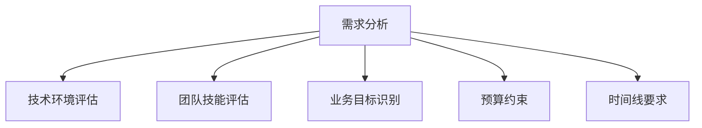
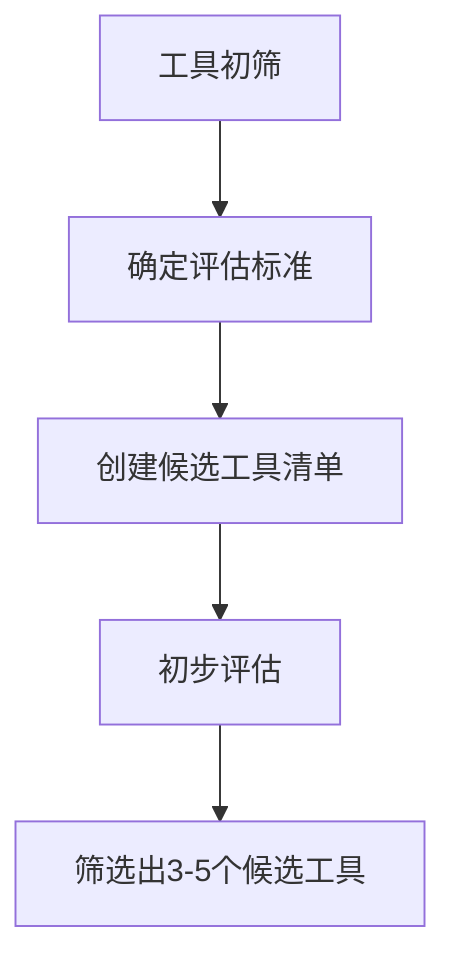
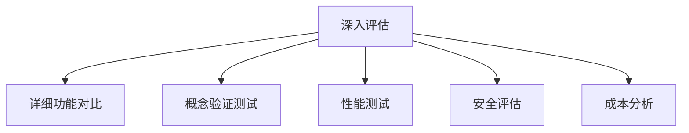
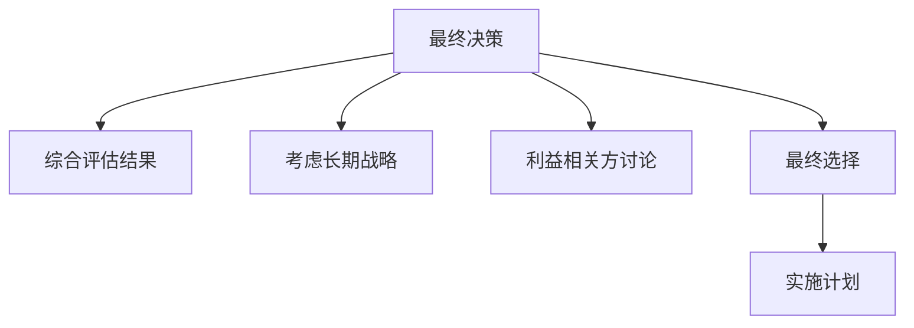
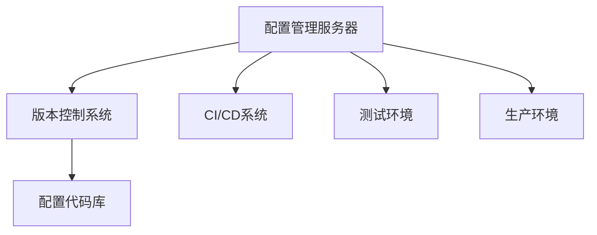
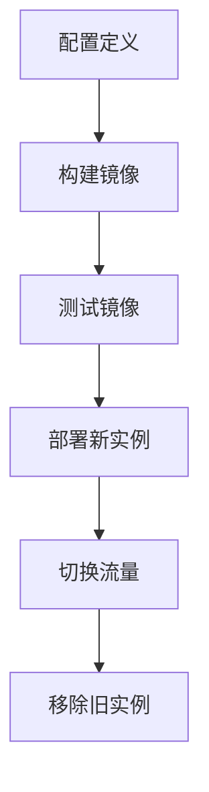
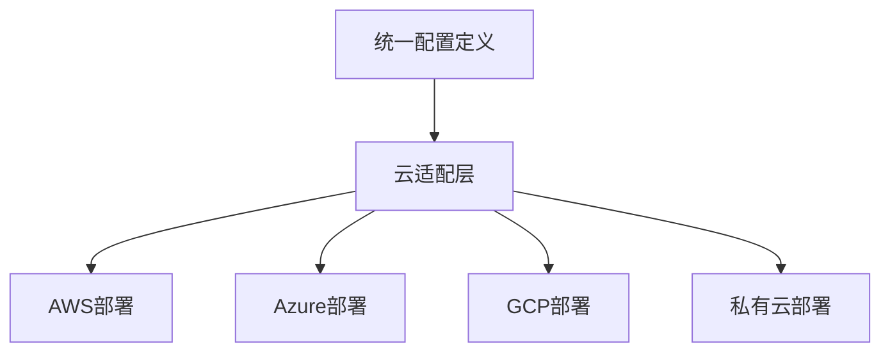

# 配置管理工具选型策略

选择合适的配置管理工具是成功实施自动化运维的关键。本文将详细介绍配置管理工具选型的评估维度、决策流程和实施策略，帮助团队根据自身需求和环境特点选择最适合的配置管理解决方案。

## 配置管理工具概述

配置管理工具是自动化基础设施和应用程序配置的专用软件，它们能够以一致、可重复的方式管理IT环境中的配置变更。在DevOps实践中，这些工具扮演着至关重要的角色，确保环境的一致性和可靠性。

### 主流配置管理工具类别

1. **声明式工具**：描述系统的期望状态，工具负责实现该状态
   - 代表工具：Puppet, Chef, Terraform, Ansible (部分功能)
   
2. **命令式工具**：定义实现期望状态的具体步骤
   - 代表工具：早期的Shell脚本, 部分Ansible功能

3. **混合型工具**：结合声明式和命令式特性
   - 代表工具：Ansible, SaltStack

4. **容器编排工具**：专注于容器化环境的配置管理
   - 代表工具：Kubernetes, Docker Compose

5. **云原生配置工具**：针对云环境优化的配置管理
   - 代表工具：AWS CloudFormation, Azure Resource Manager

## 评估维度

选择配置管理工具时，应从多个维度进行全面评估：

### 1. 技术架构与兼容性

#### 1.1 架构模型

配置管理工具主要有以下几种架构模型：

- **客户端-服务器模型**：需要在被管理节点上安装客户端
  ```mermaid
  graph TD
    A[配置管理服务器] --> B[客户端1]
    A --> C[客户端2]
    A --> D[客户端3]
  ```

- **无客户端模型**：通过SSH或WinRM等协议远程执行操作
  ```mermaid
  graph TD
    A[控制节点] -- SSH/WinRM --> B[目标节点1]
    A -- SSH/WinRM --> C[目标节点2]
    A -- SSH/WinRM --> D[目标节点3]
  ```

- **拉取式模型**：客户端定期从服务器拉取配置
  ```mermaid
  graph LR
    B[客户端1] --> A[配置管理服务器]
    C[客户端2] --> A
    D[客户端3] --> A
  ```

- **推送式模型**：服务器主动推送配置到客户端
  ```mermaid
  graph LR
    A[配置管理服务器] --> B[客户端1]
    A --> C[客户端2]
    A --> D[客户端3]
  ```

#### 1.2 平台兼容性

评估工具对不同操作系统和环境的支持程度：

```markdown
| 工具 | Linux | Windows | macOS | 容器 | 云平台 |
|-----|-------|---------|-------|------|-------|
| Ansible | ✅ | ✅ | ✅ | ✅ | ✅ |
| Puppet | ✅ | ✅ | ✅ | ⚠️ | ✅ |
| Chef | ✅ | ✅ | ✅ | ⚠️ | ✅ |
| SaltStack | ✅ | ✅ | ⚠️ | ✅ | ✅ |
| Terraform | ✅ | ✅ | ✅ | ✅ | ✅ |
```

#### 1.3 技术栈集成

考虑工具与现有技术栈的集成能力：

- 版本控制系统（Git, SVN）
- CI/CD工具（Jenkins, GitLab CI, GitHub Actions）
- 监控系统（Prometheus, Grafana, Nagios）
- 日志管理（ELK Stack, Graylog）
- 云服务提供商（AWS, Azure, GCP）

### 2. 功能特性与能力

#### 2.1 核心功能

评估工具的基本功能集：

- **配置声明**：定义系统配置的方式和语法
- **状态管理**：跟踪和维护系统状态的能力
- **变更控制**：管理配置变更的机制
- **模板支持**：使用模板生成配置的能力
- **变量管理**：处理不同环境变量的能力
- **条件逻辑**：基于条件应用配置的能力

#### 2.2 高级特性

考虑工具的高级功能：

- **幂等性**：重复执行相同操作不会产生副作用
- **并行执行**：同时在多个节点上执行操作
- **回滚能力**：在失败时恢复到之前状态
- **加密管理**：处理敏感数据的安全机制
- **事件触发**：基于事件自动执行配置更新
- **资源依赖管理**：处理资源间依赖关系

#### 2.3 扩展性

评估工具的扩展能力：

- **模块/插件系统**：添加新功能的能力
- **API集成**：与其他系统集成的API
- **自定义扩展**：开发自定义功能的能力

### 3. 学习曲线与易用性

#### 3.1 语法与配置方式

不同工具使用不同的配置语法：

- **YAML**（Ansible, SaltStack）：
  ```yaml
  # Ansible示例
  - name: 安装Nginx
    apt:
      name: nginx
      state: present
  ```

- **DSL**（Puppet, Chef）：
  ```ruby
  # Puppet示例
  package { 'nginx':
    ensure => installed,
  }
  ```

- **HCL**（Terraform）：
  ```hcl
  # Terraform示例
  resource "aws_instance" "web" {
    ami           = "ami-0c55b159cbfafe1f0"
    instance_type = "t2.micro"
  }
  ```

#### 3.2 文档与社区支持

评估工具的学习资源：

- 官方文档质量
- 社区规模和活跃度
- 教程和学习资源可用性
- 问题解决资源（Stack Overflow, GitHub Issues）

#### 3.3 开发工具支持

考虑开发工具集成：

- IDE插件
- 语法检查工具
- 测试框架
- 调试工具

### 4. 性能与可扩展性

#### 4.1 执行性能

评估工具在不同规模下的性能：

- 小规模环境（<50个节点）
- 中等规模环境（50-500个节点）
- 大规模环境（>500个节点）

```markdown
| 工具 | 小规模 | 中等规模 | 大规模 |
|-----|-------|---------|-------|
| Ansible | 快 | 中等 | 慢（需优化） |
| Puppet | 中等 | 快 | 快 |
| Chef | 中等 | 快 | 快 |
| SaltStack | 快 | 快 | 快 |
| Terraform | 快 | 中等 | 取决于提供商API |
```

#### 4.2 并发能力

考虑工具的并行处理能力：

- 并行执行模型
- 批处理能力
- 节点分组策略

#### 4.3 分布式架构

评估工具在分布式环境中的表现：

- 多区域/多数据中心支持
- 高可用性配置
- 故障恢复机制

### 5. 安全性与合规性

#### 5.1 访问控制

评估工具的安全控制机制：

- 用户认证方法
- 角色基础访问控制（RBAC）
- 权限管理粒度

#### 5.2 数据安全

考虑敏感数据处理方式：

- 凭证管理
- 加密机制
- 密钥轮换

#### 5.3 审计与合规

评估工具的审计能力：

- 变更日志记录
- 合规性报告
- 审计追踪

### 6. 成本与支持

#### 6.1 许可模式

考虑工具的许可和成本结构：

- 开源免费
- 开源+商业支持
- 商业许可
- 基于节点/用户的定价

#### 6.2 维护成本

评估长期维护成本：

- 基础设施要求
- 管理开销
- 升级复杂性

#### 6.3 商业支持

考虑可用的支持选项：

- 社区支持
- 商业支持服务
- 培训和认证
- 咨询服务

## 主流配置管理工具对比

### Ansible

**优势**：
- 无客户端架构，只需SSH连接
- 简单的YAML语法
- 丰富的模块库
- 较低的学习曲线

**劣势**：
- 大规模环境性能可能受限
- 状态管理相对简单
- 高级功能可能需要Tower/AWX

**适用场景**：
- 小型到中型环境
- 混合IT环境
- 需要快速上手的团队
- 临时自动化任务

```yaml
# Ansible示例：安装和配置Nginx
---
- hosts: webservers
  become: yes
  tasks:
    - name: 安装Nginx
      apt:
        name: nginx
        state: present
        update_cache: yes
      
    - name: 配置Nginx站点
      template:
        src: templates/default.conf.j2
        dest: /etc/nginx/sites-available/default
      notify: restart nginx
      
  handlers:
    - name: restart nginx
      service:
        name: nginx
        state: restarted
```

### Puppet

**优势**：
- 成熟的声明式模型
- 强大的状态管理
- 优秀的大规模性能
- 丰富的模块生态

**劣势**：
- 需要客户端安装
- 学习曲线较陡
- 配置复杂性较高

**适用场景**：
- 大型企业环境
- 需要严格状态管理的场景
- 长期基础设施管理
- 复杂的合规性要求

```ruby
# Puppet示例：安装和配置Nginx
class profile::nginx {
  package { 'nginx':
    ensure => installed,
  }
  
  file { '/etc/nginx/sites-available/default':
    ensure  => file,
    content => template('profile/nginx/default.erb'),
    require => Package['nginx'],
    notify  => Service['nginx'],
  }
  
  service { 'nginx':
    ensure  => running,
    enable  => true,
    require => Package['nginx'],
  }
}
```

### Chef

**优势**：
- 灵活的Ruby DSL
- 强大的社区和生态系统
- 优秀的测试集成
- 适合开发人员使用

**劣势**：
- 陡峭的学习曲线
- 需要客户端安装
- 配置复杂性高

**适用场景**：
- 开发人员主导的环境
- 需要高度自定义的场景
- 大型企业环境
- 与CI/CD紧密集成的场景

```ruby
# Chef示例：安装和配置Nginx
package 'nginx' do
  action :install
end

template '/etc/nginx/sites-available/default' do
  source 'default.erb'
  owner 'root'
  group 'root'
  mode '0644'
  notifies :restart, 'service[nginx]'
end

service 'nginx' do
  action [:enable, :start]
end
```

### Terraform

**优势**：
- 专注于基础设施即代码
- 优秀的云资源管理
- 声明式语法
- 强大的状态管理

**劣势**：
- 不是传统的配置管理工具
- 配置应用层面功能有限
- 状态管理需要额外考虑

**适用场景**：
- 云基础设施管理
- 多云环境
- 基础设施供应
- 网络和安全配置

```hcl
# Terraform示例：创建AWS EC2实例并安装Nginx
provider "aws" {
  region = "us-west-2"
}

resource "aws_instance" "web" {
  ami           = "ami-0c55b159cbfafe1f0"
  instance_type = "t2.micro"
  
  user_data = <<-EOF
              #!/bin/bash
              apt-get update
              apt-get install -y nginx
              systemctl enable nginx
              systemctl start nginx
              EOF
  
  tags = {
    Name = "nginx-server"
  }
}
```

### SaltStack

**优势**：
- 高性能的事件驱动架构
- 支持推送和拉取模式
- 强大的远程执行功能
- 良好的大规模性能

**劣势**：
- 配置相对复杂
- 学习曲线中等到较高
- 社区相对较小

**适用场景**：
- 大规模环境
- 需要实时响应的场景
- 混合云环境
- 需要高级编排的场景

```yaml
# SaltStack示例：安装和配置Nginx
nginx:
  pkg.installed: []
  
  file.managed:
    - name: /etc/nginx/sites-available/default
    - source: salt://nginx/files/default
    - template: jinja
    - require:
      - pkg: nginx
    - watch_in:
      - service: nginx
  
  service.running:
    - enable: True
    - require:
      - pkg: nginx
```

## 决策流程

选择配置管理工具应遵循系统化的决策流程：

### 1. 需求分析

首先明确组织的具体需求：



#### 1.1 关键问题清单

回答以下问题有助于明确需求：

- 需要管理的环境类型是什么？（物理服务器、虚拟机、容器、云服务等）
- 环境规模如何？（节点数量、地理分布）
- 团队的技术背景和经验如何？
- 需要与哪些现有系统集成？
- 安全和合规性要求是什么？
- 预算和资源限制是什么？
- 实施时间表是什么？

#### 1.2 需求优先级矩阵

创建需求优先级矩阵，对各项需求进行评分：

```markdown
| 需求 | 重要性(1-5) | 紧急性(1-5) | 总分 |
|-----|------------|------------|-----|
| 多平台支持 | 5 | 4 | 20 |
| 易于学习 | 4 | 5 | 20 |
| 大规模性能 | 3 | 2 | 6 |
| 安全合规 | 5 | 3 | 15 |
| 云集成 | 4 | 4 | 16 |
```

### 2. 工具初筛

根据关键需求进行初步筛选：



#### 2.1 排除标准

定义明确的排除标准，快速缩小范围：

- 不支持关键平台的工具
- 超出预算范围的工具
- 不满足关键安全要求的工具
- 缺乏必要集成能力的工具

### 3. 深入评估

对候选工具进行深入评估：



#### 3.1 评分卡方法

使用评分卡对各工具进行量化评估：

```markdown
| 评估维度 | 权重 | 工具A | 工具B | 工具C |
|---------|------|-------|-------|-------|
| 功能完整性 | 20% | 4 | 5 | 3 |
| 易用性 | 15% | 5 | 3 | 4 |
| 性能 | 15% | 3 | 5 | 4 |
| 安全性 | 20% | 4 | 4 | 5 |
| 集成能力 | 15% | 5 | 4 | 3 |
| 成本 | 15% | 4 | 3 | 5 |
| 加权总分 | 100% | 4.15 | 4.1 | 4.0 |
```

#### 3.2 概念验证（POC）

为最终候选工具设计概念验证测试：

1. 定义测试场景（覆盖典型用例）
2. 创建测试环境
3. 实施测试用例
4. 记录结果和观察
5. 评估用户体验

### 4. 最终决策

基于评估结果做出最终决策：



#### 4.1 决策矩阵

创建决策矩阵，综合考虑各因素：

```markdown
| 决策因素 | 工具A | 工具B | 工具C |
|---------|-------|-------|-------|
| 技术适配性 | ⭐⭐⭐⭐ | ⭐⭐⭐⭐⭐ | ⭐⭐⭐ |
| 团队接受度 | ⭐⭐⭐⭐⭐ | ⭐⭐⭐ | ⭐⭐⭐⭐ |
| 长期可持续性 | ⭐⭐⭐⭐ | ⭐⭐⭐⭐⭐ | ⭐⭐⭐ |
| 总体成本 | ⭐⭐⭐⭐ | ⭐⭐⭐ | ⭐⭐⭐⭐⭐ |
| 实施风险 | ⭐⭐⭐⭐ | ⭐⭐⭐ | ⭐⭐⭐⭐ |
| 推荐度 | 首选 | 备选 | 第三选择 |
```

## 实施策略

选择工具后，需要制定系统化的实施策略：

### 1. 分阶段实施计划

采用渐进式实施方法：


#### 1.1 准备阶段

- 建立基础架构
- 培训核心团队
- 开发初始配置模板
- 制定标准和最佳实践

#### 1.2 试点阶段

- 选择低风险、高价值的试点项目
- 实施并记录经验教训
- 调整流程和方法
- 验证价值和可行性

#### 1.3 扩展阶段

- 扩大应用范围
- 培训更多团队成员
- 改进自动化流程
- 建立反馈机制

#### 1.4 优化阶段

- 分析性能和效率
- 优化配置和流程
- 增强集成和自动化
- 实施高级功能

#### 1.5 标准化阶段

- 制定组织标准
- 建立治理框架
- 实施持续改进机制
- 分享知识和最佳实践

### 2. 团队准备与培训

确保团队具备必要的技能和知识：

#### 2.1 培训计划

为不同角色设计培训计划：

```markdown
| 角色 | 培训内容 | 培训方式 | 时长 |
|-----|---------|---------|-----|
| 管理员 | 架构设计、高级配置、故障排除 | 正式培训+实践 | 5天 |
| 开发人员 | 基本概念、配置编写、测试 | 研讨会+实践 | 3天 |
| 运维人员 | 日常操作、监控、故障处理 | 实践培训 | 4天 |
| 安全团队 | 安全最佳实践、审计 | 专题研讨会 | 2天 |
```

#### 2.2 知识库建设

建立组织内部知识库：

- 标准操作程序（SOP）
- 配置模板库
- 常见问题解答
- 故障排除指南
- 最佳实践文档

### 3. 技术实施细节

#### 3.1 基础架构设计

根据选定工具设计基础架构：



#### 3.2 代码组织结构

建立清晰的代码组织结构：

```
配置代码库/
├── environments/
│   ├── development/
│   ├── testing/
│   └── production/
├── roles/
│   ├── common/
│   ├── webserver/
│   ├── database/
│   └── monitoring/
├── modules/
│   ├── security/
│   ├── networking/
│   └── storage/
├── templates/
├── variables/
└── tests/
```

#### 3.3 工作流程设计

设计配置管理工作流程：


### 4. 持续改进机制

建立持续改进的机制：

#### 4.1 指标与监控

定义关键性能指标（KPI）：

- 配置部署成功率
- 配置漂移检测率
- 自动修复成功率
- 平均配置部署时间
- 配置错误率

#### 4.2 反馈循环

建立反馈机制：

- 定期回顾会议
- 问题跟踪系统
- 用户满意度调查
- 自动化报告

#### 4.3 优化策略

制定持续优化策略：

- 定期代码重构
- 性能优化
- 安全加固
- 流程简化

## 常见陷阱与应对策略

实施配置管理工具时常见的陷阱及应对策略：

### 1. 过度复杂化

**陷阱**：实施过于复杂的配置结构，超出实际需求。

**应对策略**：
- 从简单开始，逐步增加复杂性
- 遵循"足够好"原则，避免过度工程
- 定期重构和简化配置代码
- 建立清晰的模块化结构

### 2. 忽视团队技能差距

**陷阱**：低估学习曲线，导致团队无法有效使用工具。

**应对策略**：
- 在选型时充分考虑团队技能水平
- 投资充分的培训和指导
- 建立内部专家团队
- 考虑外部咨询支持

### 3. 缺乏标准化

**陷阱**：每个团队成员使用不同的方法编写配置。

**应对策略**：
- 建立编码标准和最佳实践
- 实施代码审查流程
- 使用自动化检查工具
- 创建标准模板库

### 4. 安全考虑不足

**陷阱**：在配置中暴露敏感信息或权限设置不当。

**应对策略**：
- 使用专用的密钥管理解决方案
- 实施最小权限原则
- 定期安全审计
- 加密敏感数据

### 5. 忽视测试

**陷阱**：直接在生产环境应用未经测试的配置。

**应对策略**：
- 建立配置测试框架
- 实施多环境部署流程
- 自动化测试集成
- 使用沙箱环境进行验证

## 案例研究

### 案例1：电子商务公司迁移到Ansible

**背景**：
一家中型电子商务公司需要管理100多台服务器，包括Web服务器、数据库和缓存服务器。之前使用手动配置和基本脚本。

**挑战**：
- 配置不一致导致环境问题
- 部署时间长且容易出错
- 缺乏变更追踪和审计

**解决方案**：
- 选择Ansible作为配置管理工具
- 实施基于角色的配置结构
- 集成到现有CI/CD流程
- 实施配置测试框架

**结果**：
- 部署时间减少80%
- 配置错误减少90%
- 环境一致性显著提高
- 团队生产力提升

**关键经验**：
- 从简单用例开始，逐步扩展
- 投资团队培训是关键
- 标准化配置模板大幅提高效率
- 版本控制集成至关重要

### 案例2：金融机构采用Puppet

**背景**：
一家大型金融机构需要管理1000多台服务器，跨多个数据中心，有严格的合规要求。

**挑战**：
- 严格的安全和合规要求
- 大规模环境管理
- 复杂的依赖关系
- 多团队协作

**解决方案**：
- 选择Puppet作为配置管理工具
- 实施分层模块结构
- 建立严格的变更管理流程
- 集成安全合规检查

**结果**：
- 合规性审计时间减少70%
- 配置标准化率达到95%
- 安全漏洞减少85%
- 跨团队协作显著改善

**关键经验**：
- 强大的治理框架是成功的关键
- 自动化合规性检查提供巨大价值
- 分阶段实施降低风险
- 持续培训和知识共享至关重要

## 未来趋势

配置管理工具的发展趋势：

### 1. GitOps模式

GitOps将Git作为配置的单一事实来源，所有变更通过Git工
配置管理工具的未来趋势（续）：

### 1. GitOps模式

GitOps将Git作为配置的单一事实来源，所有变更通过Git工作流进行管理：


**主要特点**：
- 声明式配置
- 版本控制作为核心
- 自动化差异检测和应用
- 自我修复能力

**代表工具**：
- Flux CD
- ArgoCD
- Jenkins X

### 2. 不可变基础设施

不可变基础设施模式强调服务器一旦部署就不再修改，而是通过重新部署来更新：



**主要特点**：
- 一致的环境
- 简化的回滚
- 减少配置漂移
- 提高安全性

**代表工具**：
- Packer
- Docker
- Terraform

### 3. 基于AI的配置管理

人工智能和机器学习在配置管理中的应用：

- **自动异常检测**：识别异常配置模式
- **智能建议**：提供配置优化建议
- **自动修复**：自动解决常见配置问题
- **预测性分析**：预测配置变更的潜在影响

### 4. 多云配置管理

随着多云战略的普及，跨云配置管理变得越来越重要：



**主要特点**：
- 云无关的配置抽象
- 统一的管理界面
- 跨云一致性保证
- 云间迁移支持

**代表工具**：
- Terraform
- Pulumi
- Crossplane

### 5. 安全与合规集成

配置管理与安全合规的深度集成：

- **策略即代码**：将安全策略编码为可执行规则
- **持续合规性验证**：自动检查配置是否符合合规要求
- **安全扫描集成**：在配置部署前自动扫描安全漏洞
- **自动修复**：自动修复不合规的配置

**代表工具**：
- Open Policy Agent (OPA)
- HashiCorp Sentinel
- Chef InSpec

## 结论

选择合适的配置管理工具是一个复杂的决策过程，需要考虑多种因素，包括技术需求、团队能力、业务目标和长期战略。通过系统化的评估和决策流程，组织可以选择最适合其特定需求的工具。

成功的配置管理工具实施不仅仅是技术选择，还涉及人员、流程和文化的变革。分阶段实施、充分的团队培训和持续改进机制是确保长期成功的关键因素。

随着技术的发展，配置管理工具将继续演变，融合更多的自动化、智能化和安全特性。组织应保持对新趋势的关注，并适时调整其配置管理策略，以保持竞争优势。

最终，配置管理工具的价值不仅在于自动化配置变更，还在于提供一致、可靠、安全的IT环境，支持业务创新和增长。通过明智的选择和有效的实施，配置管理工具可以成为组织数字化转型的强大推动力。