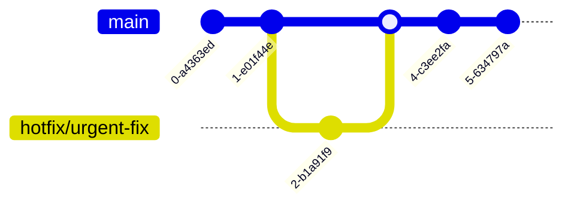

# 配置管理与版本控制集成

将配置管理与版本控制系统集成是实现基础设施即代码的关键步骤，本文将详细介绍配置管理与Git等版本控制工具的集成方法、工作流程和最佳实践，帮助团队实现配置的版本化管理和协作开发。

## 配置管理与版本控制的融合基础

### 为什么需要版本控制配置

在现代IT环境中，配置管理已经从手动操作转变为代码化实现。这种转变带来了多种优势，但也引入了新的挑战：如何有效管理这些配置代码？版本控制系统正是解决这一挑战的关键工具。

将配置管理与版本控制系统集成具有以下核心优势：

1. **变更追踪**：记录每一次配置变更的详细历史，包括变更内容、时间和责任人
2. **回滚能力**：在配置出现问题时能够快速回滚到之前的稳定版本
3. **协作开发**：支持多人同时开发和管理配置，避免冲突
4. **审计合规**：提供完整的审计跟踪，满足合规性要求
5. **知识共享**：通过代码注释和提交信息分享配置知识和决策理由

### 基础设施即代码（IaC）概念

基础设施即代码是一种使用代码来定义、部署和管理基础设施的方法。它将传统的手动配置过程转变为可版本化、可重复和可测试的代码。


IaC的核心原则包括：

- **一致性**：确保所有环境配置一致
- **可重复性**：能够重复创建相同的环境
- **可版本化**：配置变更可以像软件一样进行版本控制
- **可测试性**：配置可以在应用前进行测试
- **自文档化**：配置代码本身就是文档

## 版本控制系统概述

### 主流版本控制系统比较

在集成配置管理与版本控制时，选择合适的版本控制系统至关重要。以下是主流版本控制系统的比较：

| 特性 | Git | Mercurial | SVN |
|------|-----|-----------|-----|
| 分布式 | ✅ | ✅ | ❌ |
| 分支管理 | 强大且轻量 | 简单易用 | 较复杂 |
| 学习曲线 | 中等到陡峭 | 平缓 | 平缓 |
| 大文件处理 | 需要扩展(LFS) | 原生支持 | 良好 |
| 社区支持 | 非常活跃 | 活跃 | 较少 |
| 工具生态 | 丰富 | 中等 | 有限 |
| 适用场景 | 几乎所有场景 | 中小型项目 | 中央控制需求 |

对于配置管理，Git已成为事实上的标准，主要因为：

1. 分布式架构提供更好的灵活性
2. 强大的分支模型支持复杂的工作流
3. 丰富的工具生态系统
4. 与现代CI/CD工具的广泛集成

### Git基础知识回顾

在深入配置管理集成前，让我们回顾Git的核心概念：

#### 基本概念

- **仓库（Repository）**：存储项目文件和历史记录的地方
- **提交（Commit）**：对仓库进行的一次更改的快照
- **分支（Branch）**：独立的开发线，可以并行开发
- **合并（Merge）**：将一个分支的更改整合到另一个分支
- **远程（Remote）**：托管在网络上的仓库副本

#### 基本工作流


#### 常用Git命令

```bash
# 初始化仓库
git init

# 克隆远程仓库
git clone https://github.com/example/repo.git

# 添加文件到暂存区
git add filename.yml

# 提交更改
git commit -m "添加nginx配置文件"

# 创建并切换到新分支
git checkout -b feature/new-config

# 推送到远程
git push origin feature/new-config

# 拉取远程更改
git pull origin main

# 查看历史
git log --oneline --graph
```

## 配置管理代码组织结构

### 仓库结构设计原则

良好的仓库结构对于配置管理至关重要，它影响代码的可维护性、可读性和协作效率。设计仓库结构时应遵循以下原则：

1. **模块化**：将配置按功能或服务进行模块化组织
2. **层次清晰**：建立清晰的目录层次结构
3. **关注点分离**：分离不同环境、角色和功能的配置
4. **一致性**：在整个仓库中保持一致的命名和组织方式
5. **自文档化**：目录和文件名应具有描述性，便于理解

### 典型的配置代码仓库结构

以下是一个典型的配置管理仓库结构示例：

```
infrastructure-as-code/
├── README.md                 # 项目文档
├── .gitignore                # Git忽略文件
├── environments/             # 环境特定配置
│   ├── development/
│   ├── staging/
│   └── production/
├── modules/                  # 可重用配置模块
│   ├── networking/
│   ├── compute/
│   ├── database/
│   └── security/
├── roles/                    # 角色定义（适用于Ansible等）
│   ├── webserver/
│   ├── database/
│   └── monitoring/
├── templates/                # 配置模板
│   ├── nginx/
│   ├── apache/
│   └── mysql/
├── scripts/                  # 辅助脚本
│   ├── validation/
│   └── deployment/
├── tests/                    # 测试代码
│   ├── unit/
│   └── integration/
├── docs/                     # 详细文档
│   ├── architecture/
│   ├── procedures/
│   └── standards/
└── vars/                     # 变量定义
    ├── common.yml
    ├── development.yml
    └── production.yml
```

### 不同配置管理工具的仓库组织

不同的配置管理工具可能需要特定的仓库组织方式：

#### Ansible仓库结构

```
ansible-repo/
├── ansible.cfg              # Ansible配置文件
├── inventory/               # 主机清单
│   ├── development
│   ├── staging
│   └── production
├── playbooks/               # 剧本
│   ├── site.yml             # 主剧本
│   ├── webservers.yml
│   └── databases.yml
├── roles/                   # 角色
│   ├── common/
│   ├── nginx/
│   └── mysql/
└── group_vars/              # 组变量
    ├── all.yml
    ├── webservers.yml
    └── databases.yml
```

#### Terraform仓库结构

```
terraform-repo/
├── environments/            # 环境特定配置
│   ├── dev/
│   │   ├── main.tf
│   │   ├── variables.tf
│   │   └── terraform.tfvars
│   └── prod/
│       ├── main.tf
│       ├── variables.tf
│       └── terraform.tfvars
├── modules/                 # 可重用模块
│   ├── vpc/
│   ├── ec2/
│   └── rds/
└── scripts/                 # 辅助脚本
    ├── apply.sh
    └── plan.sh
```

#### Puppet仓库结构

```
puppet-repo/
├── manifests/              # 主清单
│   └── site.pp
├── modules/                # 模块
│   ├── nginx/
│   ├── mysql/
│   └── monitoring/
├── hieradata/              # Hiera数据
│   ├── common.yaml
│   ├── development.yaml
│   └── production.yaml
└── environment.conf        # 环境配置
```

## 版本控制工作流模型

### Git Flow工作流

Git Flow是一种基于分支的工作流，为不同类型的开发活动定义了特定的分支：


**主要分支**：
- **main**：生产环境代码，始终保持稳定
- **develop**：开发分支，集成所有功能
- **feature/***：新功能开发
- **release/***：准备发布版本
- **hotfix/***：紧急修复生产问题

**适用场景**：
- 有计划的发布周期
- 需要严格控制生产环境变更
- 团队规模较大，需要明确的流程

### GitHub Flow工作流

GitHub Flow是一种更简单的工作流，适合持续部署环境：


**主要特点**：
- 只有一个长期分支（main）
- 所有功能在特性分支开发
- 通过Pull Request进行代码审查
- 合并后立即部署

**适用场景**：
- 持续部署环境
- 小型团队
- 需要快速迭代

### Trunk-Based开发

Trunk-Based开发是一种更简化的工作流，所有开发者直接在主干分支上工作：



**主要特点**：
- 所有开发在主干分支进行
- 使用特性标志控制功能发布
- 小而频繁的提交
- 自动化测试至关重要

**适用场景**：
- 高度自动化的CI/CD环境
- 经验丰富的团队
- 需要极快的交付速度

### 环境分支模型

针对配置管理的特殊需求，环境分支模型是一种常用的工作流：

```mermaid
gitGraph
    commit
    branch development
    checkout development
    commit
    commit
    branch staging
    checkout staging
    merge development
    commit
    branch production
    checkout production
    merge staging
    commit
```

**主要特点**：
- 每个环境有专门的分支
- 配置从低环境向高环境提升
- 分支间的合并代表环境提升
- 可以在每个环境分支上进行特定调整

**适用场景**：
- 多环境部署
- 需要环境间配置差异
- 需要严格控制生产环境变更

## 配置管理与版本控制的集成实践

### 敏感信息处理

配置管理中的一个关键挑战是如何处理敏感信息（如密码、API密钥等）。以下是几种常用的方法：

#### 1. 加密工具集成

使用专门的加密工具保护敏感数据：

```bash
# 使用git-crypt加密敏感文件
git-crypt init
git-crypt add-gpg-user user@example.com
echo "*.key filter=git-crypt diff=git-crypt" > .gitattributes
echo "secrets/* filter=git-crypt diff=git-crypt" >> .gitattributes

# 使用ansible-vault加密敏感变量
ansible-vault create secrets.yml
ansible-vault edit secrets.yml
```

**常用加密工具**：
- **git-crypt**：透明加密Git仓库中的文件
- **SOPS**：支持多种格式的加密文件编辑器
- **BlackBox**：用于团队共享加密文件
- **Ansible Vault**：Ansible专用加密工具

#### 2. 外部密钥管理系统

将敏感信息存储在专用的密钥管理系统中：

```yaml
# Terraform使用HashiCorp Vault
provider "vault" {
  address = "https://vault.example.com:8200"
}

data "vault_generic_secret" "db_credentials" {
  path = "secret/database/credentials"
}

resource "aws_db_instance" "database" {
  username = data.vault_generic_secret.db_credentials.data["username"]
  password = data.vault_generic_secret.db_credentials.data["password"]
  # 其他配置...
}
```

**常用密钥管理系统**：
- **HashiCorp Vault**：全功能密钥管理系统
- **AWS Secrets Manager**：AWS云原生密钥管理
- **Azure Key Vault**：Azure云原生密钥管理
- **Google Secret Manager**：GCP云原生密钥管理

#### 3. 环境变量与配置注入

在运行时注入敏感信息：

```yaml
# Docker Compose示例
version: '3'
services:
  webapp:
    image: myapp:latest
    environment:
      - DB_PASSWORD=${DB_PASSWORD}
      - API_KEY=${API_KEY}
```

**最佳实践**：
- 永远不要以明文形式提交敏感信息
- 使用`.gitignore`排除敏感文件
- 为不同环境使用不同的密钥
- 实施最小权限原则
- 定期轮换密钥

### 配置验证与测试

将配置代码纳入版本控制后，应该像对待应用代码一样进行验证和测试：

#### 1. 语法验证

确保配置文件格式正确：

```bash
# Ansible语法检查
ansible-playbook --syntax-check playbook.yml

# Terraform验证
terraform validate

# Kubernetes配置验证
kubectl apply --validate=true --dry-run=client -f deployment.yaml
```

#### 2. 静态分析

检查配置中的潜在问题：

```bash
# Ansible Lint
ansible-lint playbook.yml

# Terraform静态分析
tflint

# Kubernetes配置分析
kube-score score deployment.yaml
```

#### 3. 单元测试

测试配置的独立组件：

```ruby
# Serverspec测试示例
require 'serverspec'
set :backend, :exec

describe package('nginx') do
  it { should be_installed }
end

describe service('nginx') do
  it { should be_enabled }
  it { should be_running }
end

describe port(80) do
  it { should be_listening }
end
```

#### 4. 集成测试

测试配置组件的交互：

```yaml
# Molecule测试配置示例
---
dependency:
  name: galaxy
driver:
  name: docker
platforms:
  - name: instance
    image: ubuntu:20.04
provisioner:
  name: ansible
verifier:
  name: testinfra
```

#### 5. 基础设施测试

在临时环境中测试完整配置：

```bash
# 使用Terratest测试Terraform配置
package test

import (
  "testing"
  "github.com/gruntwork-io/terratest/modules/terraform"
)

func TestTerraformBasicExample(t *testing.T) {
  terraformOptions := &terraform.Options{
    TerraformDir: "../examples/basic",
    Vars: map[string]interface{}{
      "region": "us-west-2",
    },
  }
  
  defer terraform.Destroy(t, terraformOptions)
  terraform.InitAndApply(t, terraformOptions)
  
  // 验证输出
  output := terraform.Output(t, terraformOptions, "instance_id")
  // 进行断言...
}
```

### 持续集成与持续部署

将配置管理与CI/CD流水线集成，实现自动化测试和部署：

#### 1. CI/CD流水线示例

```yaml
# GitLab CI配置示例
stages:
  - validate
  - test
  - plan
  - apply
  - verify

validate:
  stage: validate
  script:
    - terraform init
    - terraform validate
    - tflint

test:
  stage: test
  script:
    - cd tests
    - go test -v ./...

plan:
  stage: plan
  script:
    - terraform init
    - terraform plan -out=tfplan
  artifacts:
    paths:
      - tfplan

apply:
  stage: apply
  script:
    - terraform apply -auto-approve tfplan
  when: manual
  environment:
    name: production
    
verify:
  stage: verify
  script:
    - ./scripts/verify-deployment.sh
  dependencies:
    - apply
```

#### 2. 环境提升流程


#### 3. GitOps模式

GitOps是一种以Git作为单一事实来源的操作模型：


**GitOps工具**：
- **Flux CD**：Kubernetes原生GitOps工具
- **ArgoCD**：声明式GitOps持续交付工具
- **Jenkins X**：云原生CI/CD平台

## 版本控制最佳实践

### 提交消息规范

良好的提交消息对于配置管理至关重要：

```
<类型>(<范围>): <简短描述>

<详细描述>

<关联问题>
```

**类型示例**：
- **feat**: 新功能
- **fix**: 错误修复
- **config**: 配置变更
- **docs**: 文档更新
- **refactor**: 代码重构
- **test**: 添加测试
- **chore**: 维护任务

**实际示例**：
```
config(nginx): 优化负载均衡配置

- 增加最大连接数到1000
- 调整keepalive超时为65秒
- 启用gzip压缩

解决问题: #123
```

### 分支命名约定

一致的分支命名有助于团队协作：

```
<类型>/<描述>
```

**类型示例**：
- **feature**: 新功能
- **bugfix**: 错误修复
- **hotfix**: 紧急修复
- **release**: 发布准备
- **config**: 配置变更
- **env**: 环境特定变更

**实际示例**：
```
config/update-nginx-ssl-settings
env/prod-memory-optimization
feature/add-redis-caching
```

### 代码审查策略

配置代码审查的关键点：

1. **功能性**：配置是否实现预期功能
2. **安全性**：是否存在安全风险
3. **性能**：配置是否优化性能
4. **一致性**：是否遵循团队标准
5. **可维护性**：是否易于理解和维护

**代码审查清单**：
```markdown
## 配置代码审查清单

### 功能性
- [ ] 配置实现了需求中描述的所有功能
- [ ] 配置在所有目标环境中都能正常工作
- [ ] 考虑了边缘情况和错误处理

### 安全性
- [ ] 没有硬编码的敏感信息
- [ ] 遵循最小权限原则
- [ ] 安全设置符合组织标准

### 性能
- [ ] 配置不会导致性能瓶颈
- [ ] 资源分配合理
- [ ] 考虑了扩展性

### 一致性
- [ ] 遵循团队的命名约定
- [ ] 代码格式符合团队标准
- [ ] 与现有配置保持一致

### 可维护性
- [ ] 代码结构清晰
- [ ] 包含必要的注释和文档
- [ ] 变量和参数有明确的命名
```

### 标签与版本管理

为配置仓库使用语义化版本控制：

```bash
# 创建版本标签
git tag -a v1.2.3 -m "版本1.2.3：更新负载均衡配置"

# 推送标签到远程
git push origin v1.2.3

# 查看所有标签
git tag -l
```

**语义化版本格式**：`主版本.次版本.修订版本`
- **主版本**：不兼容的API变更
- **次版本**：向后兼容的功能性新增
- **修订版本**：向后兼容的问题修正

## 实际案例分析

### 案例1：多环境Kubernetes配置管理

**场景**：管理多个环境（开发、测试、生产）的Kubernetes配置

**解决方案**：使用Kustomize进行环境特定配置管理

**仓库结构**：
```
k8s-configs/
├── base/                    # 基础配置
│   ├── deployment.yaml
│   ├── service.yaml
│   └── kustomization.yaml
├── overlays/                # 环境特定覆盖
│   ├── development/
│   │   ├── kustomization.yaml
│   │   └── patch.yaml
│   ├── staging/
│   │   ├── kustomization.yaml
│   │   └── patch.yaml
│   └── production/
│       ├── kustomization.yaml
│       └── patch.yaml
└── README.md
```

**基础配置示例**：
```yaml
# base/deployment.yaml
apiVersion: apps/v1
kind: Deployment
metadata:
  name: myapp
spec:
  replicas: 1
  selector:
    matchLabels:
      app: myapp
  template:
    metadata:
      labels:
        app: myapp
    spec:
      containers:
      - name: myapp
        image: myapp:latest
        resources:
          requests:
            memory: "64Mi"
            cpu: "100m"
          limits:
            memory: "128Mi"
            cpu: "200m"
```

**环境特定覆盖**：
```yaml
# overlays/production/patch.yaml
apiVersion: apps/v1
kind: Deployment
metadata:
  name: myapp
spec:
  replicas: 3
  template:
    spec:
      containers:
      - name: myapp
        resources:
          requests:
            memory: "256Mi"
            cpu: "500m"
          limits:
            memory: "512Mi"
            cpu: "1000m"
```

**CI/CD集成**：
```yaml
# GitLab CI配置
stages:
  - validate
  - deploy

validate:
  stage: validate
  script:
    - kubectl kustomize overlays/development | kubeval

deploy_dev:
  stage: deploy
  script:
    - kubectl apply -k overlays/development
  environment:
    name: development
  only:
    - develop

deploy_prod:
  stage: deploy
  script:
    - kubectl apply -k overlays/production
  environment:
    name: production
  when: manual
  only:
    - main
```

### 案例2：Terraform多云基础设施管理

**场景**：管理跨AWS和Azure的基础设施配置

**解决方案**：使用Terraform模块和工作区管理多云环境

**仓库结构**：
```
terraform-infra/
├── modules/                 # 共享模块
│   ├── networking/
│   │   ├── main.tf
│   │   ├── variables.tf
│   │   └── outputs.tf
│   └── compute/
│       ├── main.tf
│       ├── variables.tf
│       └── outputs.tf
├── aws/                     # AWS特定配置
│   ├── dev/
│   │   ├── main.tf
│   │   ├── variables.tf
│   │   └── terraform.tfvars
│   └── prod/
│       ├── main.tf
│       ├── variables.tf
│       └── terraform.tfvars
├── azure/                   # Azure特定配置
│   ├── dev/
│   │   ├── main.tf
│   │   ├── variables.tf
│   │   └── terraform.tfvars
│   └── prod/
│       ├── main.tf
│       ├── variables.tf
│       └── terraform.tfvars
└── README.md
```

**模块使用示例**：
```hcl
# aws/prod/main.tf
provider "aws" {
  region = var.region
}

module "vpc" {
  source = "../../modules/networking"
  
  name = "prod-vpc"
  cidr = "10.0.0.0/16"
  azs  = ["us-west-2a", "us-west-2b", "us-west-2c"]
}

module "ec2" {
  source = "../../modules/compute"
  
  name          = "prod-web"
  instance_type = "t3.large"
  vpc_id        = module.vpc.vpc_id
  subnet_ids    = module.vpc.subnet_ids
}
```

**CI/CD集成**：
```yaml
# GitHub Actions工作流
name: Terraform

on:
  push:
    branches: [ main ]
  pull_request:
    branches: [ main ]

jobs:
  validate:
    runs-on: ubuntu-latest
    steps:
    - uses: actions/checkout@v2
    - name: Setup Terraform
      uses: hashicorp/setup-terraform@v1
    
    - name: Terraform Format
      run: terraform fmt -check -recursive
    
    - name: Terraform Validate AWS Dev
      run: |
        cd aws/dev
        terraform init -backend=false
        terraform validate
  
  plan:
    needs: validate
    runs-on: ubuntu-latest
    steps:
    - uses: actions/checkout@v2
    - name: Setup Terraform
      uses: hashicorp/setup-terraform@v1
    
    - name: Terraform Plan AWS Prod
      run: |
        cd aws/prod
        terraform init
        terraform plan -out=tfplan
      env:
        AWS_ACCESS_KEY_ID: ${{ secrets.AWS_ACCESS_KEY_ID }}
        AWS_SECRET_ACCESS_KEY: ${{ secrets.AWS_SECRET_ACCESS_KEY }}
```

### 案例3：Ansible配置管理与版本控制

**场景**：使用Ansible管理多种服务器配置

**解决方案**：结构化Ansible代码库与Git分支策略

**仓库结构**：
```
ansible-configs/
├── inventories/             # 主机清单
│   ├── development/
│   │   ├── hosts
│   │   └── group_vars/
让我继续完成关于配置管理与版本控制集成的内容。

### 案例3：Ansible配置管理与版本控制（续）

**仓库结构**（续）：
```
ansible-configs/
├── inventories/             # 主机清单
│   ├── development/
│   │   ├── hosts
│   │   └── group_vars/
│   ├── staging/
│   │   ├── hosts
│   │   └── group_vars/
│   └── production/
│       ├── hosts
│       └── group_vars/
├── playbooks/               # 剧本
│   ├── site.yml             # 主剧本
│   ├── webservers.yml
│   └── databases.yml
├── roles/                   # 角色
│   ├── common/
│   │   ├── tasks/
│   │   ├── handlers/
│   │   ├── templates/
│   │   └── files/
│   ├── nginx/
│   │   ├── tasks/
│   │   ├── handlers/
│   │   ├── templates/
│   │   └── files/
│   └── mysql/
│       ├── tasks/
│       ├── handlers/
│       ├── templates/
│       └── files/
├── library/                 # 自定义模块
├── filter_plugins/          # 自定义过滤器
├── ansible.cfg              # Ansible配置
└── README.md
```

**分支策略**：
- **main**：生产就绪的配置
- **develop**：开发中的配置
- **feature/***：新功能或配置更改
- **env/prod**：生产环境特定配置
- **env/staging**：预生产环境特定配置
- **env/dev**：开发环境特定配置

**角色示例**：
```yaml
# roles/nginx/tasks/main.yml
---
- name: 安装Nginx
  apt:
    name: nginx
    state: present
    update_cache: yes
  tags: install

- name: 配置Nginx站点
  template:
    src: default.conf.j2
    dest: /etc/nginx/sites-available/default
    owner: root
    group: root
    mode: '0644'
  notify: restart nginx
  tags: configure

- name: 启用Nginx站点
  file:
    src: /etc/nginx/sites-available/default
    dest: /etc/nginx/sites-enabled/default
    state: link
  notify: restart nginx
  tags: configure

- name: 确保Nginx服务运行
  service:
    name: nginx
    state: started
    enabled: yes
  tags: service
```

**CI/CD集成**：
```yaml
# Jenkins Pipeline
pipeline {
    agent any
    
    stages {
        stage('Checkout') {
            steps {
                checkout scm
            }
        }
        
        stage('Lint') {
            steps {
                sh 'ansible-lint playbooks/*.yml roles/*'
            }
        }
        
        stage('Syntax Check') {
            steps {
                sh 'ansible-playbook --syntax-check playbooks/site.yml -i inventories/development/hosts'
            }
        }
        
        stage('Deploy to Development') {
            when {
                branch 'develop'
            }
            steps {
                sh 'ansible-playbook playbooks/site.yml -i inventories/development/hosts'
            }
        }
        
        stage('Deploy to Staging') {
            when {
                branch 'main'
            }
            steps {
                sh 'ansible-playbook playbooks/site.yml -i inventories/staging/hosts'
            }
        }
        
        stage('Deploy to Production') {
            when {
                branch 'main'
            }
            steps {
                input message: '确认部署到生产环境?'
                sh 'ansible-playbook playbooks/site.yml -i inventories/production/hosts'
            }
        }
    }
    
    post {
        always {
            cleanWs()
        }
    }
}
```

## 常见挑战与解决方案

### 配置漂移管理

配置漂移是指实际环境配置与版本控制中定义的配置之间的差异。

**挑战**：
- 手动更改导致的漂移
- 自动化流程外的紧急修复
- 临时更改变成永久更改
- 多团队操作同一环境

**解决方案**：

1. **定期漂移检测**：
```bash
# Terraform漂移检测
terraform plan

# Ansible漂移检测
ansible-playbook playbook.yml --check --diff

# Puppet漂移检测
puppet agent --test --noop
```

2. **自动修复漂移**：
```yaml
# Kubernetes使用GitOps控制器自动修复漂移
apiVersion: apps/v1
kind: Deployment
metadata:
  name: flux
  namespace: flux
spec:
  replicas: 1
  selector:
    matchLabels:
      app: flux
  template:
    metadata:
      labels:
        app: flux
    spec:
      containers:
      - name: flux
        image: fluxcd/flux:1.21.0
        args:
        - --git-url=git@github.com:org/repo.git
        - --git-branch=main
        - --git-path=clusters/production
        - --git-poll-interval=1m
        - --sync-interval=5m
        - --sync-garbage-collection
```

3. **强制一致性策略**：
   - 禁止直接访问生产环境
   - 所有更改必须通过版本控制
   - 实施审批流程
   - 自动化配置验证

### 大规模团队协作

在大型组织中，多团队协作管理配置可能面临挑战。

**挑战**：
- 代码冲突
- 责任界限不清
- 知识孤岛
- 标准不一致

**解决方案**：

1. **模块化配置**：
```
infrastructure/
├── networking/      # 网络团队负责
├── security/        # 安全团队负责
├── compute/         # 计算团队负责
└── databases/       # 数据库团队负责
```

2. **明确的所有权**：
```yaml
# CODEOWNERS文件示例
# 网络配置
/networking/ @network-team

# 安全配置
/security/ @security-team

# 计算资源配置
/compute/ @compute-team

# 数据库配置
/databases/ @database-team
```

3. **标准化工作流**：
   - 统一的分支策略
   - 一致的代码审查流程
   - 标准化的测试要求
   - 共享的最佳实践

4. **跨团队协作机制**：
   - 定期同步会议
   - 共享知识库
   - 配置管理卓越中心
   - 内部培训和认证

### 版本控制系统限制

版本控制系统在处理配置管理时可能存在一些限制。

**挑战**：
- 大文件处理
- 二进制文件版本控制
- 历史记录膨胀
- 性能问题

**解决方案**：

1. **大文件处理**：
```bash
# 使用Git LFS处理大文件
git lfs install
git lfs track "*.iso" "*.bin" "*.tar.gz"
git add .gitattributes
```

2. **仓库拆分**：
```
# 按功能拆分仓库
infrastructure-networking/
infrastructure-compute/
infrastructure-databases/

# 使用子模块引用
git submodule add https://github.com/org/infrastructure-networking.git networking
git submodule add https://github.com/org/infrastructure-compute.git compute
```

3. **历史记录管理**：
```bash
# 清理大文件历史
git filter-branch --tree-filter 'rm -f path/to/large/file' HEAD

# 压缩历史
git gc --aggressive --prune=now
```

4. **性能优化**：
   - 浅克隆（`git clone --depth 1`）
   - 稀疏检出（`git sparse-checkout`）
   - 部分克隆（`git clone --filter=blob:none`）

## 未来趋势

### GitOps的兴起

GitOps是一种以Git作为单一事实来源的操作模型，正在成为配置管理的主流方法。

**核心原则**：
1. 声明式配置存储在Git中
2. 通过Git操作进行变更
3. 自动化控制器确保环境与Git定义一致
4. 持续监控和修复漂移

**实现工具**：
- **Flux CD**：Kubernetes原生GitOps工具
- **ArgoCD**：声明式GitOps持续交付工具
- **Jenkins X**：云原生CI/CD平台

**GitOps工作流**：


### 策略即代码

策略即代码（Policy as Code）是将组织策略编码为可执行规则的实践，与配置管理紧密集成。

**应用领域**：
- 安全策略
- 合规性要求
- 成本控制
- 资源标准

**实现工具**：
- **Open Policy Agent (OPA)**：通用策略引擎
- **HashiCorp Sentinel**：策略框架
- **Kyverno**：Kubernetes原生策略管理
- **Cloud Custodian**：云资源策略引擎

**策略示例**：
```rego
# OPA策略：确保所有EC2实例都有标签
package aws.ec2

deny[msg] {
    resource := input.resource.aws_instance[name]
    not resource.tags
    msg := sprintf("EC2实例 %v 缺少必要的标签", [name])
}

deny[msg] {
    resource := input.resource.aws_instance[name]
    required_tags := ["Owner", "Environment", "Project"]
    provided_tags := {tag | resource.tags[tag]}
    missing_tags := required_tags - provided_tags
    count(missing_tags) > 0
    msg := sprintf("EC2实例 %v 缺少必要的标签: %v", [name, missing_tags])
}
```

### 多云配置管理

随着多云战略的普及，跨云配置管理变得越来越重要。

**挑战**：
- 不同云提供商的API差异
- 资源模型不一致
- 安全模型差异
- 配置漂移风险增加

**解决方案**：

1. **云无关的抽象层**：
```hcl
# Pulumi多云抽象示例
import * as aws from "@pulumi/aws";
import * as azure from "@pulumi/azure";
import * as gcp from "@pulumi/gcp";

// 根据环境变量选择云提供商
const cloud = process.env.CLOUD_PROVIDER || "aws";

// 创建虚拟机
function createVM(name, size) {
    switch(cloud) {
        case "aws":
            return new aws.ec2.Instance(name, {
                instanceType: size,
                ami: "ami-0c55b159cbfafe1f0",
            });
        case "azure":
            return new azure.compute.VirtualMachine(name, {
                vmSize: size,
                imageReference: {
                    publisher: "Canonical",
                    offer: "UbuntuServer",
                    sku: "18.04-LTS",
                    version: "latest",
                },
            });
        case "gcp":
            return new gcp.compute.Instance(name, {
                machineType: size,
                bootDisk: {
                    initializeParams: {
                        image: "debian-cloud/debian-9",
                    },
                },
            });
    }
}

// 使用统一接口创建资源
const webserver = createVM("webserver", "small");
```

2. **统一配置模型**：
```yaml
# Crossplane示例：云无关的资源定义
apiVersion: database.example.org/v1alpha1
kind: PostgreSQLInstance
metadata:
  name: my-db
  namespace: default
spec:
  parameters:
    version: "11"
    size: small
    storageGB: 20
  compositionSelector:
    matchLabels:
      provider: aws  # 或azure, gcp
  writeConnectionSecretToRef:
    name: db-conn
```

### 不可变基础设施

不可变基础设施是一种模式，其中服务器一旦部署就不再修改，而是通过重新部署来更新。

**核心原则**：
1. 服务器从不更新，只替换
2. 所有变更通过重新部署实现
3. 环境由版本控制的配置定义
4. 自动化构建和部署流程

**实现方法**：

1. **容器化**：
```dockerfile
# 应用容器化示例
FROM nginx:1.19

COPY ./config/nginx.conf /etc/nginx/nginx.conf
COPY ./html /usr/share/nginx/html

EXPOSE 80

HEALTHCHECK --interval=30s --timeout=3s \
  CMD curl -f http://localhost/ || exit 1
```

2. **基础设施即代码**：
```hcl
# Terraform示例：创建不可变基础设施
resource "aws_launch_template" "web" {
  name_prefix   = "web-"
  image_id      = data.aws_ami.web_ami.id
  instance_type = "t3.micro"
  
  user_data = base64encode(templatefile("${path.module}/user-data.sh", {
    app_version = var.app_version
  }))
  
  lifecycle {
    create_before_destroy = true
  }
}

resource "aws_autoscaling_group" "web" {
  name                = "web-${aws_launch_template.web.latest_version}"
  min_size            = 2
  max_size            = 10
  desired_capacity    = 2
  vpc_zone_identifier = var.subnet_ids
  
  launch_template {
    id      = aws_launch_template.web.id
    version = "$Latest"
  }
  
  lifecycle {
    create_before_destroy = true
  }
}
```

3. **蓝绿部署**：
```yaml
# Kubernetes蓝绿部署示例
apiVersion: argoproj.io/v1alpha1
kind: Rollout
metadata:
  name: myapp-rollout
spec:
  replicas: 5
  selector:
    matchLabels:
      app: myapp
  template:
    metadata:
      labels:
        app: myapp
    spec:
      containers:
      - name: myapp
        image: myapp:v2
        ports:
        - containerPort: 8080
  strategy:
    blueGreen:
      activeService: myapp-active
      previewService: myapp-preview
      autoPromotionEnabled: false
```

## 结论与最佳实践总结

### 关键成功因素

成功集成配置管理与版本控制的关键因素：

1. **明确的工作流程**：建立清晰的配置变更流程
2. **自动化测试**：实施全面的配置测试策略
3. **安全处理敏感信息**：采用适当的密钥管理方法
4. **标准化实践**：建立和执行一致的标准
5. **持续改进**：定期评估和优化流程

### 最佳实践清单

以下是配置管理与版本控制集成的最佳实践清单：

#### 版本控制实践
- [ ] 使用分支策略管理不同环境的配置
- [ ] 实施明确的提交消息规范
- [ ] 使用标签标记稳定版本
- [ ] 实施代码审查流程
- [ ] 保护主分支，防止直接推送

#### 仓库组织实践
- [ ] 采用模块化结构组织配置
- [ ] 分离环境特定配置
- [ ] 使用明确的命名约定
- [ ] 包含全面的文档
- [ ] 定义明确的所有权

#### 安全实践
- [ ] 加密敏感信息
- [ ] 使用外部密钥管理系统
- [ ] 实施最小权限原则
- [ ] 定期轮换密钥
- [ ] 审计配置变更

#### 自动化实践
- [ ] 实施持续集成流水线
- [ ] 自动化配置验证和测试
- [ ] 使用GitOps实现自动部署
- [ ] 自动检测和修复配置漂移
- [ ] 自动化合规性检查

#### 团队协作实践
- [ ] 提供充分的培训和文档
- [ ] 建立知识共享机制
- [ ] 定期回顾和改进流程
- [ ] 跨团队协调配置变更
- [ ] 建立配置管理卓越中心

### 最终思考

配置管理与版本控制的集成不仅是技术实践，也是组织文化的转变。它要求团队采用代码化思维处理基础设施，遵循软件开发的最佳实践，并建立严格的变更管理流程。

随着云计算、容器化和微服务架构的普及，配置管理的复杂性不断增加。通过将配置管理与版本控制紧密集成，组织可以有效管理这种复杂性，提高基础设施的可靠性、安全性和灵活性。

最终，成功的配置管理与版本控制集成将帮助组织实现：

- 更快的部署速度
- 更高的系统可靠性
- 更强的安全保障
- 更好的合规性
- 更高效的团队协作

这些优势将直接转化为业务价值，支持组织的数字化转型和创新能力。