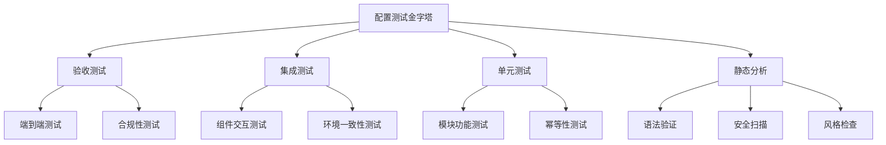

# 配置管理测试与验证

配置管理代码的测试和验证是确保配置质量和可靠性的重要环节，本文将详细介绍配置管理测试的方法、工具和最佳实践，包括语法检查、单元测试、集成测试和验证环境搭建等内容。

## 配置测试的重要性

在传统软件开发中，测试是确保代码质量的关键环节。随着基础设施即代码(IaC)的兴起，配置管理代码同样需要严格的测试和验证流程。配置错误可能导致严重后果，包括服务中断、安全漏洞和数据丢失。

### 配置错误的潜在影响

配置错误可能导致的问题包括：

1. **服务不可用**：错误的网络配置、资源限制或依赖关系可能导致服务完全不可用
2. **性能下降**：不当的资源分配或优化参数可能导致性能瓶颈
3. **安全漏洞**：错误的访问控制、加密设置或防火墙规则可能引入安全风险
4. **数据丢失**：存储配置错误可能导致数据未正确备份或复制
5. **合规性问题**：不符合行业标准或法规要求的配置可能导致合规性违规

### 测试配置代码的独特挑战

配置代码测试与传统软件测试相比存在一些独特挑战：

1. **环境依赖性**：配置代码通常与特定环境紧密耦合
2. **状态管理**：配置更改可能涉及复杂的状态转换
3. **幂等性验证**：需要确保重复应用配置不会产生副作用
4. **回滚复杂性**：某些配置更改难以回滚或需要特殊处理
5. **分布式影响**：配置变更可能影响多个相互依赖的系统

## 配置测试金字塔

类似于软件测试中的测试金字塔，配置测试也可以分为多个层次，从底部的快速、低成本测试到顶部的全面但成本较高的测试。



### 静态分析

静态分析是最基础的配置测试层次，它不需要实际执行配置代码，而是通过分析代码本身来发现潜在问题。

#### 语法验证

语法验证确保配置文件格式正确，符合相应工具或平台的语法要求。

**Ansible语法检查示例**：

```bash
# 检查playbook语法
ansible-playbook --syntax-check playbook.yml

# 使用ansible-lint进行更深入的检查
ansible-lint playbook.yml
```

**Terraform语法验证示例**：

```bash
# 初始化Terraform工作目录
terraform init

# 验证配置文件语法
terraform validate
```

**Kubernetes配置验证示例**：

```bash
# 验证Kubernetes清单文件
kubectl apply --validate=true --dry-run=client -f deployment.yaml
```

#### 风格检查

风格检查确保配置代码遵循一致的编码风格和最佳实践。

**Terraform格式化示例**：

```bash
# 检查Terraform文件格式
terraform fmt -check

# 自动格式化Terraform文件
terraform fmt
```

**YAML Lint示例**：

```bash
# 检查YAML文件格式
yamllint config.yml

# 使用自定义规则检查
yamllint -c .yamllint.yml config.yml
```

#### 安全扫描

安全扫描工具可以识别配置中的安全风险和漏洞。

**TFSec示例**（Terraform安全扫描）：

```bash
# 扫描Terraform配置中的安全问题
tfsec .

# 生成详细报告
tfsec . --format json > security-report.json
```

**Checkov示例**（多平台IaC安全扫描）：

```bash
# 扫描目录中的所有IaC文件
checkov -d .

# 扫描特定文件
checkov -f main.tf

# 生成SARIF格式报告
checkov -d . --output sarif > checkov.sarif
```

**Kube-score示例**（Kubernetes配置分析）：

```bash
# 分析Kubernetes配置的安全性和最佳实践
kube-score score deployment.yaml

# 分析多个文件
kube-score score *.yaml
```

### 单元测试

单元测试关注配置代码的独立组件或模块，验证它们是否按预期工作。

#### 模块功能测试

模块功能测试验证配置模块是否正确实现了预期功能。

**Terraform模块测试示例**（使用Terratest）：

```go
package test

import (
    "testing"
    "github.com/gruntwork-io/terratest/modules/terraform"
    "github.com/stretchr/testify/assert"
)

func TestTerraformWebServerModule(t *testing.T) {
    // 配置Terraform选项
    terraformOptions := &terraform.Options{
        TerraformDir: "../modules/web-server",
        Vars: map[string]interface{}{
            "server_name": "test-server",
            "instance_type": "t2.micro",
        },
    }
    
    // 测试结束后清理资源
    defer terraform.Destroy(t, terraformOptions)
    
    // 初始化并应用Terraform配置
    terraform.InitAndApply(t, terraformOptions)
    
    // 获取输出并验证
    instanceID := terraform.Output(t, terraformOptions, "instance_id")
    assert.NotEmpty(t, instanceID, "Instance ID should not be empty")
    
    // 验证实例类型
    instanceType := terraform.Output(t, terraformOptions, "instance_type")
    assert.Equal(t, "t2.micro", instanceType, "Instance type should match input")
}
```

**Ansible角色测试示例**（使用Molecule）：

```yaml
# molecule/default/molecule.yml
---
dependency:
  name: galaxy
driver:
  name: docker
platforms:
  - name: instance
    image: ubuntu:20.04
    pre_build_image: true
provisioner:
  name: ansible
verifier:
  name: testinfra
  lint:
    name: flake8
```

```python
# molecule/default/tests/test_default.py
import os
import testinfra.utils.ansible_runner

testinfra_hosts = testinfra.utils.ansible_runner.AnsibleRunner(
    os.environ['MOLECULE_INVENTORY_FILE']).get_hosts('all')

def test_nginx_installed(host):
    package = host.package("nginx")
    assert package.is_installed
    
def test_nginx_running(host):
    service = host.service("nginx")
    assert service.is_running
    assert service.is_enabled
    
def test_nginx_listening(host):
    socket = host.socket("tcp://0.0.0.0:80")
    assert socket.is_listening
```

#### 幂等性测试

幂等性测试验证重复应用相同配置不会产生副作用或导致错误。

**Ansible幂等性测试示例**：

```bash
# 第一次运行playbook
ansible-playbook playbook.yml

# 第二次运行并检查是否有变更
ansible-playbook playbook.yml --diff | grep -q "changed=0" && echo "幂等性测试通过" || echo "幂等性测试失败"
```

**使用Molecule测试Ansible角色幂等性**：

```yaml
# molecule/default/converge.yml
---
- name: Converge
  hosts: all
  tasks:
    - name: Include role
      include_role:
        name: my_role

# molecule/default/verify.yml
---
- name: Verify
  hosts: all
  tasks:
    - name: Run role again to test idempotence
      include_role:
        name: my_role
      register: idempotence_result
      
    - name: Check if role is idempotent
      assert:
        that: idempotence_result.changed == 0
        fail_msg: "Role is not idempotent"
        success_msg: "Role is idempotent"
```

### 集成测试

集成测试验证多个配置组件如何协同工作，以及它们与外部系统的交互。

#### 组件交互测试

组件交互测试验证不同配置组件之间的交互是否正确。

**Terraform多模块测试示例**：

```go
package test

import (
    "testing"
    "github.com/gruntwork-io/terratest/modules/terraform"
    "github.com/stretchr/testify/assert"
)

func TestNetworkAndComputeIntegration(t *testing.T) {
    // 配置Terraform选项
    terraformOptions := &terraform.Options{
        TerraformDir: "../environments/test",
    }
    
    // 测试结束后清理资源
    defer terraform.Destroy(t, terraformOptions)
    
    // 初始化并应用Terraform配置
    terraform.InitAndApply(t, terraformOptions)
    
    // 验证网络和计算资源的集成
    vpcID := terraform.Output(t, terraformOptions, "vpc_id")
    instanceSubnetID := terraform.Output(t, terraformOptions, "instance_subnet_id")
    
    // 验证实例是否在正确的VPC和子网中
    assert.Contains(t, instanceSubnetID, vpcID, "Instance should be in the correct VPC")
    
    // 验证安全组规则
    sshAccess := terraform.Output(t, terraformOptions, "ssh_accessible")
    assert.Equal(t, "true", sshAccess, "SSH should be accessible")
}
```

**Ansible多角色测试示例**：

```yaml
# molecule/integration/molecule.yml
---
dependency:
  name: galaxy
driver:
  name: docker
platforms:
  - name: web
    image: ubuntu:20.04
    groups:
      - web
  - name: db
    image: ubuntu:20.04
    groups:
      - db
provisioner:
  name: ansible
  inventory:
    group_vars:
      all:
        environment: test
verifier:
  name: testinfra
```

```yaml
# molecule/integration/converge.yml
---
- name: Converge web servers
  hosts: web
  roles:
    - nginx
    - app

- name: Converge database servers
  hosts: db
  roles:
    - mysql
```

```python
# molecule/integration/tests/test_integration.py
import os
import testinfra.utils.ansible_runner

testinfra_hosts = testinfra.utils.ansible_runner.AnsibleRunner(
    os.environ['MOLECULE_INVENTORY_FILE']).get_hosts('all')

def test_web_db_connection(host):
    # 检查web服务器是否可以连接到数据库
    if host.ansible.get_variables()['group_names'][0] == 'web':
        cmd = host.run("curl -s http://db:3306")
        assert cmd.rc == 0 or "MySQL" in cmd.stderr
```

#### 环境一致性测试

环境一致性测试验证配置在不同环境中是否产生一致的结果。

**多环境Terraform测试示例**：

```go
package test

import (
    "testing"
    "github.com/gruntwork-io/terratest/modules/terraform"
    "github.com/stretchr/testify/assert"
)

func TestEnvironmentConsistency(t *testing.T) {
    // 测试环境配置
    testOptions := &terraform.Options{
        TerraformDir: "../environments/test",
        Vars: map[string]interface{}{
            "environment": "test",
        },
    }
    
    // 开发环境配置
    devOptions := &terraform.Options{
        TerraformDir: "../environments/dev",
        Vars: map[string]interface{}{
            "environment": "dev",
        },
    }
    
    // 清理资源
    defer terraform.Destroy(t, testOptions)
    defer terraform.Destroy(t, devOptions)
    
    // 应用配置
    terraform.InitAndApply(t, testOptions)
    terraform.InitAndApply(t, devOptions)
    
    // 验证关键配置是否一致
    testVpcCidr := terraform.Output(t, testOptions, "vpc_cidr_block")
    devVpcCidr := terraform.Output(t, devOptions, "vpc_cidr_block")
    
    // 验证CIDR格式一致（不一定是相同的值）
    assert.Regexp(t, `^\d{1,3}\.\d{1,3}\.\d{1,3}\.\d{1,3}/\d{1,2}$`, testVpcCidr)
    assert.Regexp(t, `^\d{1,3}\.\d{1,3}\.\d{1,3}\.\d{1,3}/\d{1,2}$`, devVpcCidr)
    
    // 验证安全设置一致
    testEncryption := terraform.Output(t, testOptions, "storage_encrypted")
    devEncryption := terraform.Output(t, devOptions, "storage_encrypted")
    assert.Equal(t, testEncryption, devEncryption, "Encryption settings should be consistent")
}
```

### 验收测试

验收测试是最高层次的测试，验证配置是否满足业务需求和合规要求。

#### 端到端测试

端到端测试验证整个系统在配置应用后是否按预期工作。

**基础设施端到端测试示例**：

```python
# 使用Python和Boto3测试AWS基础设施
import boto3
import requests
import unittest

class InfrastructureTest(unittest.TestCase):
    def setUp(self):
        self.ec2 = boto3.client('ec2')
        self.elb = boto3.client('elbv2')
        
    def test_web_application_available(self):
        # 获取负载均衡器DNS名称
        response = self.elb.describe_load_balancers(Names=['web-app-lb'])
        lb_dns = response['LoadBalancers'][0]['DNSName']
        
        # 测试应用是否可访问
        response = requests.get(f"http://{lb_dns}")
        self.assertEqual(response.status_code, 200)
        self.assertIn("Welcome to our application", response.text)
        
    def test_auto_scaling_group_healthy(self):
        # 检查自动扩展组实例健康状态
        autoscaling = boto3.client('autoscaling')
        response = autoscaling.describe_auto_scaling_groups(
            AutoScalingGroupNames=['web-app-asg']
        )
        
        instances = response['AutoScalingGroups'][0]['Instances']
        self.assertGreater(len(instances), 0, "No instances in ASG")
        
        # 验证所有实例都是健康的
        for instance in instances:
            self.assertEqual(instance['HealthStatus'], 'Healthy')
```

**使用InSpec进行基础设施验收测试**：

```ruby
# 测试AWS基础设施
control 'aws-1' do
  impact 1.0
  title 'Ensure VPC is properly configured'
  
  describe aws_vpc(vpc_id: 'vpc-12345678') do
    it { should exist }
    its('cidr_block') { should eq '10.0.0.0/16' }
  end
end

control 'aws-2' do
  impact 1.0
  title 'Ensure security groups are properly configured'
  
  describe aws_security_group(group_name: 'web-sg') do
    it { should exist }
    its('inbound_rules') { should_not allow(port: 22, ipv4_range: '0.0.0.0/0') }
    its('inbound_rules') { should allow(port: 443) }
  end
end

# 测试服务器配置
control 'server-1' do
  impact 1.0
  title 'Ensure web server is properly configured'
  
  describe package('nginx') do
    it { should be_installed }
  end
  
  describe service('nginx') do
    it { should be_enabled }
    it { should be_running }
  end
  
  describe port(80) do
    it { should be_listening }
  end
  
  describe http('http://localhost') do
    its('status') { should cmp 200 }
    its('body') { should include 'Welcome' }
  end
end
```

#### 合规性测试

合规性测试验证配置是否符合安全标准、法规要求和组织政策。

**使用InSpec进行合规性测试**：

```ruby
# CIS Docker Benchmark测试
control 'docker-4.1' do
  impact 1.0
  title 'Ensure a user for the container has been created'
  
  docker.containers.running?.ids.each do |id|
    describe docker.object(id) do
      its(%w(Config User)) { should_not eq nil }
      its(%w(Config User)) { should_not eq 'root' }
    end
  end
end

# PCI DSS合规性测试
control 'pci-dss-2.2' do
  impact 1.0
  title 'Develop configuration standards for all system components.'
  
  describe file('/etc/ssh/sshd_config') do
    its('content') { should match /^Protocol 2$/ }
    its('content') { should match /^PermitRootLogin no$/ }
    its('content') { should match /^PasswordAuthentication no$/ }
  end
end
```

**使用OPA (Open Policy Agent) 进行策略合规性测试**：

```rego
# policy.rego
package kubernetes

# 确保所有容器都有资源限制
deny[msg] {
    input.kind == "Deployment"
    container := input.spec.template.spec.containers[_]
    not container.resources.limits
    msg := sprintf("Container %s in deployment %s does not have resource limits", [container.name, input.metadata.name])
}

# 确保所有容器都不是特权容器
deny[msg] {
    input.kind == "Deployment"
    container := input.spec.template.spec.containers[_]
    container.securityContext.privileged
    msg := sprintf("Container %s in deployment %s is running as privileged", [container.name, input.metadata.name])
}
```

```bash
# 使用OPA测试Kubernetes配置
opa eval --data policy.rego --input deployment.yaml "data.kubernetes.deny"
```

## 测试环境管理

有效的配置测试需要适当的测试环境。这些环境应该尽可能接近生产环境，同时又足够隔离以避免影响生产系统。

### 临时测试环境

临时测试环境是为特定测试创建并在测试完成后销毁的环境。

**使用Docker创建临时测试环境**：

```dockerfile
# Dockerfile.test
FROM ubuntu:20.04

RUN apt-get update && apt-get install -y \
    nginx \
    curl \
    && rm -rf /var/lib/apt/lists/*

COPY ./config/nginx.conf /etc/nginx/nginx.conf
COPY ./test/index.html /var/www/html/index.html

EXPOSE 80

CMD ["nginx", "-g", "daemon off;"]
```

```bash
# 构建测试镜像
docker build -t nginx-test -f Dockerfile.test .

# 运行测试容器
docker run -d --name nginx-test-container -p 8080:80 nginx-test

# 执行测试
curl -s http://localhost:8080 | grep "Test Page"

# 清理
docker stop nginx-test-container
docker rm nginx-test-container
```

**使用Terraform创建临时云测试环境**：

```hcl
# test-environment.tf
provider "aws" {
  region = "us-west-2"
}

resource "random_id" "test_suffix" {
  byte_length = 4
}

module "test_vpc" {
  source = "./modules/vpc"
  name   = "test-vpc-${random_id.test_suffix.hex}"
  cidr   = "10.0.0.0/16"
}

module "test_instance" {
  source        = "./modules/ec2"
  name          = "test-instance-${random_id.test_suffix.hex}"
  instance_type = "t2.micro"
  vpc_id        = module.test_vpc.vpc_id
  subnet_id     = module.test_vpc.public_subnet_ids[0]
}

output "test_instance_ip" {
  value = module.test_instance.public_ip
}
```

```bash
# 创建测试环境
terraform init
terraform apply -auto-approve

# 获取测试实例IP
TEST_IP=$(terraform output -raw test_instance_ip)

# 执行测试
ssh -i test-key.pem ubuntu@$TEST_IP "curl -s http://localhost"

# 清理测试环境
terraform destroy -auto-approve
```

### 沙箱环境

沙箱环境是隔离的长期存在的环境，用于持续测试和开发。

**使用Kubernetes命名空间创建沙箱环境**：

```yaml
# sandbox-namespace.yaml
apiVersion: v1
kind: Namespace
metadata:
  name: sandbox
  labels:
    environment: sandbox

---
# 资源配额
apiVersion: v1
kind: ResourceQuota
metadata:
  name: sandbox-quota
  namespace: sandbox
spec:
  hard:
    pods: "20"
    requests.cpu: "4"
    requests.memory: 8Gi
    limits.cpu: "8"
    limits.memory: 16Gi

---
# 网络策略
apiVersion: networking.k8s.io/v1
kind: NetworkPolicy
metadata:
  name: sandbox-isolation
  namespace: sandbox
spec:
  podSelector: {}
  policyTypes:
  - Ingress
  - Egress
  ingress:
  - from:
    - namespaceSelector:
        matchLabels:
          environment: sandbox
  egress:
  - to:
    - namespaceSelector:
        matchLabels:
          environment: sandbox
  - to:
    - ipBlock:
        cidr: 0.0.0.0/0
        except:
        - 10.0.0.0/8
        - 172.16.0.0/12
        - 192.168.0.0/16
```

```bash
# 创建沙箱环境
kubectl apply -f sandbox-namespace.yaml

# 在沙箱中部署测试应用
kubectl apply -f test-app.yaml -n sandbox

# 在沙箱中执行测试
kubectl exec -it -n sandbox test-pod -- curl http://test-service
```

### 模拟服务

模拟服务可以模拟外部依赖，使测试更加可控和可重复。

**使用WireMock模拟HTTP服务**：

```java
// 使用Java和WireMock创建模拟API
import static com.github.tomakehurst.wiremock.client.WireMock.*;
import com.github.tomakehurst.wiremock.WireMockServer;

public class MockApiTest {
    public static void main(String[] args) {
        WireMockServer wireMockServer = new WireMockServer(8080);
        wireMockServer.start();
        
        // 配置模拟响应
        wireMockServer.stubFor(get(urlEqualTo("/api/users"))
            .willReturn(aResponse()
                .withHeader("Content-Type", "application/json")
                .withBody("{\"users\":[{\"id\":1,\"name\":\"Test User\"}]}")
                .withStatus(200)));
        
        System.out.println("Mock API running at http://localhost:8080");
    }
}
```

**使用LocalStack模拟AWS服务**：

```yaml
# docker-compose.yml
version: '3.8'
services:
  localstack:
    container_name: localstack
    image: localstack/localstack:latest
    ports:
      - "4566:4566"
    environment:
      - SERVICES=s3,dynamodb,lambda,sqs
      - DEBUG=1
      - DATA_DIR=/tmp/localstack/data
    volumes:
      - ./localstack:/tmp/localstack
      - /var/run/docker.sock:/var/run/docker.sock
```

```python
# 使用Python和Boto3测试LocalStack
import boto3

# 配置LocalStack端点
s3 = boto3.client(
    's3',
    endpoint_url='http://localhost:4566',
    aws_access_key_id='test',
    aws_secret_access_key='test',
    region_name='us-east-1'
)

# 创建测试桶
s3.create_bucket(Bucket='test-bucket')

# 上传测试文件
s3.put_object(
    Bucket='test-bucket',
    Key='test-file.txt',
    Body='This is a test file'
)

# 验证文件存在
response = s3.list_objects(Bucket='test-bucket')
print(response['Contents'])
```

## 测试自动化与CI/CD集成

将配置测试集成到CI/CD流水线中可以确保每次变更都经过适当的验证。

### 测试自动化框架

测试自动化框架可以简化测试执行和报告生成。

**使用Kitchen-Terraform自动化Terraform测试**：

```ruby
# .kitchen.yml
---
driver:
  name: terraform
  root_module_directory: test/fixtures/default

provisioner:
  name: terraform

platforms:
  - name: aws

verifier:
  name: terraform
  systems:
    - name: default
      backend: local

suites:
  - name: default
```

```ruby
# test/integration/default/controls/aws_test.rb
control 'vpc_check' do
  describe aws_vpc(vpc_id: attribute('vpc_id')) do
    it { should exist }
    its('cidr_block') { should eq '10.0.0.0/16' }
  end
end

control 'security_group_check' do
  describe aws_security_group(group_id: attribute('security_group_id')) do
    it { should exist }
    its('group_name') { should eq 'test-sg' }
    it { should allow_in(port: 443, protocol: 'tcp') }
    it { should_not allow_in(port: 22, ipv4_range: '0.0.0.0/0') }
  end
end
```

**使用Goss自动化服务器配置测试**：

```yaml
# goss.yaml
file:
  /etc/nginx/nginx.conf:
    exists: true
    mode: "0644"
    owner: root
    group: root
    filetype: file
    contains: ["worker_processes"]

package:
  nginx:
    installed: true

port:
  tcp:80:
    listening: true
    ip:
    - 0.0.0.0

service:
  nginx:
    enabled: true
    running: true

http:
  http://localhost:
    status: 200
    body: ["Welcome"]
```

```bash
# 执行Goss测试
goss validate

# 生成测试报告
goss validate --format json > report.json
```

### CI/CD流水线集成

将配置测试集成到CI/CD流水线中可以自动化测试执行和结果验证。

**GitLab CI/CD配置示例**：

```yaml
# .gitlab-ci.yml
stages:
  - validate
  - test
  - deploy
  - verify

variables:
  TF_VAR_environment: "test"

validate:
  stage: validate
  image: hashicorp/terraform:latest
  script:
    - terraform init
    - terraform validate
    - terraform fmt -check
  only:
    - merge_requests

lint:
  stage: validate
  image: wata727/tflint:latest
  script:
    - tflint
  only:
    - merge_requests

security_scan:
  stage: validate
  image: bridgecrew/checkov:latest
  script:
    - checkov -d . --output cli
  only:
    - merge_requests

unit_test:
  stage: test
  image: golang:latest
  script:
    - cd test
    - go test -v ./...
  only:
    - merge_requests

integration_test:
  stage: test
  image: hashicorp/terraform:latest
  services:
    - docker:dind
  script:
    - cd test/integration
    - terraform init
    - terraform apply -auto-approve
    - ./run_tests.sh
    - terraform destroy -auto-approve
  only:
    - merge_requests

deploy_test:
  stage: deploy
  image: hashicorp/terraform:latest
  script:
    - terraform init
    - terraform apply -auto-approve
  environment:
    name: test
    url
让我继续完成关于配置管理测试与验证的内容：

### CI/CD流水线集成（续）

**GitLab CI/CD配置示例**（续）：

```yaml
deploy_test:
  stage: deploy
  image: hashicorp/terraform:latest
  script:
    - terraform init
    - terraform apply -auto-approve
  environment:
    name: test
    url: https://test.example.com
  only:
    - main
  when: manual

verify_deployment:
  stage: verify
  image: curlimages/curl:latest
  script:
    - curl -s https://test.example.com/health | grep "UP"
    - ./scripts/run_verification_tests.sh
  environment:
    name: test
  only:
    - main
  needs:
    - deploy_test
```

**GitHub Actions工作流示例**：

```yaml
# .github/workflows/terraform.yml
name: "Terraform CI/CD"

on:
  push:
    branches: [ main ]
  pull_request:
    branches: [ main ]

jobs:
  validate:
    name: "验证"
    runs-on: ubuntu-latest
    steps:
      - name: 检出代码
        uses: actions/checkout@v2
      
      - name: 设置Terraform
        uses: hashicorp/setup-terraform@v1
      
      - name: Terraform格式检查
        run: terraform fmt -check -recursive
      
      - name: Terraform初始化
        run: terraform init
      
      - name: Terraform验证
        run: terraform validate
      
      - name: 安全扫描
        uses: bridgecrewio/checkov-action@master
        with:
          directory: .
          framework: terraform

  test:
    name: "测试"
    needs: validate
    runs-on: ubuntu-latest
    steps:
      - name: 检出代码
        uses: actions/checkout@v2
      
      - name: 设置Go
        uses: actions/setup-go@v2
        with:
          go-version: 1.17
      
      - name: 运行单元测试
        run: |
          cd test
          go test -v ./...
      
      - name: 设置Terraform
        uses: hashicorp/setup-terraform@v1
      
      - name: 运行集成测试
        run: |
          cd test/integration
          terraform init
          terraform apply -auto-approve
          ./run_tests.sh
          terraform destroy -auto-approve

  deploy:
    name: "部署"
    needs: test
    runs-on: ubuntu-latest
    if: github.ref == 'refs/heads/main'
    environment: test
    steps:
      - name: 检出代码
        uses: actions/checkout@v2
      
      - name: 设置Terraform
        uses: hashicorp/setup-terraform@v1
      
      - name: Terraform初始化
        run: terraform init
      
      - name: Terraform计划
        run: terraform plan -out=tfplan
      
      - name: Terraform应用
        run: terraform apply -auto-approve tfplan
      
      - name: 验证部署
        run: |
          curl -s https://test.example.com/health | grep "UP"
          ./scripts/run_verification_tests.sh
```

**Jenkins Pipeline示例**：

```groovy
// Jenkinsfile
pipeline {
    agent any
    
    stages {
        stage('验证') {
            parallel {
                stage('语法检查') {
                    agent {
                        docker {
                            image 'hashicorp/terraform:latest'
                        }
                    }
                    steps {
                        sh 'terraform init -backend=false'
                        sh 'terraform validate'
                        sh 'terraform fmt -check'
                    }
                }
                
                stage('安全扫描') {
                    agent {
                        docker {
                            image 'bridgecrew/checkov:latest'
                        }
                    }
                    steps {
                        sh 'checkov -d . --output cli'
                    }
                }
            }
        }
        
        stage('单元测试') {
            agent {
                docker {
                    image 'golang:latest'
                }
            }
            steps {
                dir('test') {
                    sh 'go test -v ./...'
                }
            }
        }
        
        stage('集成测试') {
            agent {
                docker {
                    image 'hashicorp/terraform:latest'
                }
            }
            steps {
                dir('test/integration') {
                    sh 'terraform init'
                    sh 'terraform apply -auto-approve'
                    sh './run_tests.sh'
                    sh 'terraform destroy -auto-approve'
                }
            }
        }
        
        stage('部署测试环境') {
            when {
                branch 'main'
            }
            agent {
                docker {
                    image 'hashicorp/terraform:latest'
                }
            }
            steps {
                sh 'terraform init'
                sh 'terraform apply -auto-approve'
            }
        }
        
        stage('验证部署') {
            when {
                branch 'main'
            }
            steps {
                sh 'curl -s https://test.example.com/health | grep "UP"'
                sh './scripts/run_verification_tests.sh'
            }
        }
    }
    
    post {
        always {
            cleanWs()
        }
    }
}
```

### 测试报告与可视化

测试报告和可视化工具可以帮助团队理解测试结果和配置状态。

**使用JUnit格式生成测试报告**：

```bash
# 使用Terratest生成JUnit报告
go test -v ./... -timeout 30m | go-junit-report > report.xml

# 使用InSpec生成JUnit报告
inspec exec . --reporter junit:report.xml
```

**使用Terraform Compliance生成报告**：

```bash
# 运行Terraform Compliance测试
terraform-compliance -f features/ -p terraform.tfplan

# 生成HTML报告
terraform-compliance -f features/ -p terraform.tfplan --report html:report.html
```

**使用Grafana可视化配置状态**：

```yaml
# docker-compose.yml
version: '3'
services:
  prometheus:
    image: prom/prometheus:latest
    volumes:
      - ./prometheus.yml:/etc/prometheus/prometheus.yml
    ports:
      - "9090:9090"
  
  grafana:
    image: grafana/grafana:latest
    depends_on:
      - prometheus
    ports:
      - "3000:3000"
    volumes:
      - ./grafana/provisioning:/etc/grafana/provisioning
    environment:
      - GF_SECURITY_ADMIN_PASSWORD=admin
```

```yaml
# prometheus.yml
global:
  scrape_interval: 15s

scrape_configs:
  - job_name: 'infrastructure'
    static_configs:
      - targets: ['node-exporter:9100']
  
  - job_name: 'applications'
    static_configs:
      - targets: ['app-metrics:8080']
```

## 常见测试场景与最佳实践

### 网络配置测试

网络配置是基础设施的关键组成部分，需要全面测试以确保连接性和安全性。

**测试网络连接性**：

```bash
# 使用Bash脚本测试网络连接
#!/bin/bash

# 测试端口连接
test_port_connection() {
    local host=$1
    local port=$2
    timeout 5 bash -c "cat < /dev/null > /dev/tcp/$host/$port"
    if [ $? -eq 0 ]; then
        echo "✅ 连接到 $host:$port 成功"
        return 0
    else
        echo "❌ 连接到 $host:$port 失败"
        return 1
    fi
}

# 测试HTTP连接
test_http_connection() {
    local url=$1
    local expected_code=$2
    
    code=$(curl -s -o /dev/null -w "%{http_code}" $url)
    if [ "$code" = "$expected_code" ]; then
        echo "✅ HTTP请求 $url 返回预期状态码 $expected_code"
        return 0
    else
        echo "❌ HTTP请求 $url 返回状态码 $code，预期 $expected_code"
        return 1
    fi
}

# 测试数据库连接
test_db_connection() {
    local host=$1
    local port=$2
    local user=$3
    local password=$4
    local database=$5
    
    PGPASSWORD=$password psql -h $host -p $port -U $user -d $database -c "SELECT 1" > /dev/null 2>&1
    if [ $? -eq 0 ]; then
        echo "✅ 数据库连接成功"
        return 0
    else
        echo "❌ 数据库连接失败"
        return 1
    fi
}

# 执行测试
test_port_connection "db.example.com" 5432
test_http_connection "https://api.example.com/health" 200
test_db_connection "db.example.com" 5432 "user" "password" "mydb"
```

**使用InSpec测试网络安全配置**：

```ruby
# 测试防火墙规则
control 'firewall-1' do
  impact 1.0
  title 'Ensure firewall is properly configured'
  
  describe iptables do
    it { should have_rule('-A INPUT -p tcp -m tcp --dport 22 -j ACCEPT') }
    it { should have_rule('-A INPUT -p tcp -m tcp --dport 80 -j ACCEPT') }
    it { should have_rule('-A INPUT -p tcp -m tcp --dport 443 -j ACCEPT') }
    it { should have_rule('-A INPUT -j DROP') }
  end
end

# 测试开放端口
control 'ports-1' do
  impact 1.0
  title 'Ensure only necessary ports are open'
  
  describe port(22) do
    it { should be_listening }
    its('processes') { should include 'sshd' }
  end
  
  describe port(80) do
    it { should be_listening }
    its('processes') { should include 'nginx' }
  end
  
  describe port(443) do
    it { should be_listening }
    its('processes') { should include 'nginx' }
  end
  
  # 确保没有其他意外开放的端口
  describe command('netstat -tulpn | grep LISTEN | grep -v "127.0.0.1"') do
    its('stdout') { should_not match /3306/ }
    its('stdout') { should_not match /6379/ }
  end
end
```

### 安全配置测试

安全配置测试确保系统符合安全最佳实践和合规要求。

**使用Lynis进行安全审计**：

```bash
# 安装Lynis
apt-get update && apt-get install -y lynis

# 运行安全审计
lynis audit system

# 生成报告
lynis audit system --report-file /tmp/lynis-report.dat
```

**使用CIS-CAT测试CIS基准合规性**：

```bash
# 运行CIS-CAT
java -Xmx2048m -jar CIS-CAT.jar -a -b benchmarks/CIS_Ubuntu_Linux_18.04_LTS_Benchmark_v1.0.0-xccdf.xml

# 生成HTML报告
java -Xmx2048m -jar CIS-CAT.jar -a -b benchmarks/CIS_Ubuntu_Linux_18.04_LTS_Benchmark_v1.0.0-xccdf.xml -html
```

**使用Prowler测试AWS安全配置**：

```bash
# 克隆Prowler仓库
git clone https://github.com/toniblyx/prowler

# 运行完整安全评估
cd prowler
./prowler

# 运行特定检查
./prowler -c check21,check31,check310

# 生成HTML报告
./prowler -M html
```

### 性能配置测试

性能配置测试验证系统在预期负载下的性能表现。

**使用Apache Benchmark测试Web服务器性能**：

```bash
# 安装Apache Benchmark
apt-get update && apt-get install -y apache2-utils

# 测试HTTP性能
ab -n 1000 -c 100 https://example.com/

# 测试带认证的HTTP性能
ab -n 1000 -c 100 -A username:password https://example.com/

# 测试POST请求性能
ab -n 1000 -c 100 -p post.data -T application/json https://example.com/api
```

**使用Vegeta进行负载测试**：

```bash
# 安装Vegeta
go get -u github.com/tsenart/vegeta

# 创建目标文件
echo "GET https://example.com/" > targets.txt

# 运行负载测试
vegeta attack -targets=targets.txt -duration=30s -rate=100 | vegeta report

# 生成图形报告
vegeta attack -targets=targets.txt -duration=30s -rate=100 | vegeta plot > plot.html
```

**使用JMeter测试应用性能**：

```xml
<!-- JMeter测试计划示例 -->
<?xml version="1.0" encoding="UTF-8"?>
<jmeterTestPlan version="1.2" properties="5.0">
  <hashTree>
    <TestPlan guiclass="TestPlanGui" testclass="TestPlan" testname="Web应用性能测试" enabled="true">
      <stringProp name="TestPlan.comments"></stringProp>
      <boolProp name="TestPlan.functional_mode">false</boolProp>
      <boolProp name="TestPlan.serialize_threadgroups">false</boolProp>
      <elementProp name="TestPlan.user_defined_variables" elementType="Arguments" guiclass="ArgumentsPanel" testclass="Arguments" testname="User Defined Variables" enabled="true">
        <collectionProp name="Arguments.arguments"/>
      </elementProp>
      <stringProp name="TestPlan.user_define_classpath"></stringProp>
    </TestPlan>
    <hashTree>
      <ThreadGroup guiclass="ThreadGroupGui" testclass="ThreadGroup" testname="用户组" enabled="true">
        <stringProp name="ThreadGroup.on_sample_error">continue</stringProp>
        <elementProp name="ThreadGroup.main_controller" elementType="LoopController" guiclass="LoopControlPanel" testclass="LoopController" testname="Loop Controller" enabled="true">
          <boolProp name="LoopController.continue_forever">false</boolProp>
          <stringProp name="LoopController.loops">10</stringProp>
        </elementProp>
        <stringProp name="ThreadGroup.num_threads">100</stringProp>
        <stringProp name="ThreadGroup.ramp_time">30</stringProp>
        <longProp name="ThreadGroup.start_time">1373789594000</longProp>
        <longProp name="ThreadGroup.end_time">1373789594000</longProp>
        <boolProp name="ThreadGroup.scheduler">false</boolProp>
        <stringProp name="ThreadGroup.duration"></stringProp>
        <stringProp name="ThreadGroup.delay"></stringProp>
      </ThreadGroup>
      <hashTree>
        <HTTPSamplerProxy guiclass="HttpTestSampleGui" testclass="HTTPSamplerProxy" testname="首页请求" enabled="true">
          <elementProp name="HTTPsampler.Arguments" elementType="Arguments" guiclass="HTTPArgumentsPanel" testclass="Arguments" testname="User Defined Variables" enabled="true">
            <collectionProp name="Arguments.arguments"/>
          </elementProp>
          <stringProp name="HTTPSampler.domain">example.com</stringProp>
          <stringProp name="HTTPSampler.port">443</stringProp>
          <stringProp name="HTTPSampler.protocol">https</stringProp>
          <stringProp name="HTTPSampler.contentEncoding"></stringProp>
          <stringProp name="HTTPSampler.path">/</stringProp>
          <stringProp name="HTTPSampler.method">GET</stringProp>
          <boolProp name="HTTPSampler.follow_redirects">true</boolProp>
          <boolProp name="HTTPSampler.auto_redirects">false</boolProp>
          <boolProp name="HTTPSampler.use_keepalive">true</boolProp>
          <boolProp name="HTTPSampler.DO_MULTIPART_POST">false</boolProp>
          <stringProp name="HTTPSampler.embedded_url_re"></stringProp>
          <stringProp name="HTTPSampler.connect_timeout"></stringProp>
          <stringProp name="HTTPSampler.response_timeout"></stringProp>
        </HTTPSamplerProxy>
        <hashTree/>
      </hashTree>
    </hashTree>
  </hashTree>
</jmeterTestPlan>
```

### 灾难恢复配置测试

灾难恢复配置测试验证系统在灾难情况下的恢复能力。

**测试数据备份和恢复**：

```bash
# 备份测试脚本
#!/bin/bash

# 配置
DB_USER="dbuser"
DB_PASS="dbpass"
DB_NAME="mydb"
BACKUP_DIR="/backup"
TIMESTAMP=$(date +%Y%m%d%H%M%S)
BACKUP_FILE="$BACKUP_DIR/backup_$TIMESTAMP.sql"

# 创建备份
echo "创建数据库备份..."
mysqldump -u $DB_USER -p$DB_PASS $DB_NAME > $BACKUP_FILE
if [ $? -eq 0 ]; then
    echo "✅ 备份成功: $BACKUP_FILE"
else
    echo "❌ 备份失败"
    exit 1
fi

# 模拟数据损坏
echo "模拟数据损坏..."
mysql -u $DB_USER -p$DB_PASS $DB_NAME -e "DROP TABLE IF EXISTS test_table;"

# 从备份恢复
echo "从备份恢复..."
mysql -u $DB_USER -p$DB_PASS $DB_NAME < $BACKUP_FILE
if [ $? -eq 0 ]; then
    echo "✅ 恢复成功"
else
    echo "❌ 恢复失败"
    exit 1
fi

# 验证恢复
echo "验证恢复..."
TABLE_COUNT=$(mysql -u $DB_USER -p$DB_PASS $DB_NAME -e "SHOW TABLES LIKE 'test_table';" | wc -l)
if [ $TABLE_COUNT -gt 0 ]; then
    echo "✅ 验证成功: test_table 已恢复"
else
    echo "❌ 验证失败: test_table 未恢复"
    exit 1
fi

echo "备份和恢复测试完成"
```

**测试故障转移配置**：

```bash
# 故障转移测试脚本
#!/bin/bash

# 配置
PRIMARY_SERVER="primary.example.com"
SECONDARY_SERVER="secondary.example.com"
HEALTH_CHECK_URL="https://$PRIMARY_SERVER/health"
FAILOVER_COMMAND="aws route53 change-resource-record-sets --hosted-zone-id Z1234567890 --change-batch file://failover.json"

# 检查主服务器健康状态
echo "检查主服务器健康状态..."
HEALTH_STATUS=$(curl -s -o /dev/null -w "%{http_code}" $HEALTH_CHECK_URL)
if [ "$HEALTH_STATUS" = "200" ]; then
    echo "✅ 主服务器运行正常"
else
    echo "❌ 主服务器不可用，状态码: $HEALTH_STATUS"
    
    # 执行故障转移
    echo "执行故障转移到备用服务器..."
    $FAILOVER_COMMAND
    if [ $? -eq 0 ]; then
        echo "✅ 故障转移命令执行成功"
    else
        echo "❌ 故障转移命令执行失败"
        exit 1
    fi
    
    # 等待DNS传播
    echo "等待DNS传播..."
    sleep 60
    
    # 验证故障转移
    echo "验证故障转移..."
    NEW_IP=$(dig +short example.com)
    SECONDARY_IP=$(dig +short $SECONDARY_SERVER)
    if [ "$NEW_IP" = "$SECONDARY_IP" ]; then
        echo "✅ 故障转移验证成功: 流量已转移到备用服务器"
    else
        echo "❌ 故障转移验证失败: 流量未转移到备用服务器"
        exit 1
    fi
fi

echo "故障转移测试完成"
```

**使用Chaos Monkey测试系统弹性**：

```yaml
# Kubernetes Chaos Monkey配置
apiVersion: apps/v1
kind: Deployment
metadata:
  name: chaos-monkey
  namespace: chaos-testing
spec:
  replicas: 1
  selector:
    matchLabels:
      app: chaos-monkey
  template:
    metadata:
      labels:
        app: chaos-monkey
    spec:
      containers:
      - name: chaos-monkey
        image: linki/chaoskube:latest
        args:
        - --interval=10m
        - --labels=stage=production
        - --namespaces=default
        - --annotations=chaos-monkey/enabled=true
        - --dry-run=false
```

## 测试驱动的配置管理

测试驱动的配置管理（Test-Driven Infrastructure）将测试驱动开发的原则应用于基础设施配置。

### TDI工作流程

测试驱动的配置管理遵循以下工作流程：

1. **编写测试**：首先编写测试，定义配置的预期行为
2. **运行测试**：确认测试失败，因为尚未实现配置
3. **编写配置**：实现满足测试要求的最小配置
4. **再次测试**：确认测试通过
5. **重构**：优化配置，确保代码质量和最佳实践
6. **重复**：继续添加新的测试和功能


### TDI示例

**使用ServerSpec进行测试驱动的Ansible开发**：

```ruby
# spec/web_server_spec.rb
require 'spec_helper'

describe 'Web Server Configuration' do
  # 测试Nginx安装
  describe package('nginx') do
    it { should be_installed }
  end
  
  # 测试Nginx服务
  describe service('nginx') do
    it { should be_enabled }
    it { should be_running }
  end
  
  # 测试Nginx配置
  describe file('/etc/nginx/sites-enabled/default') do
    it { should exist }
    its(:content) { should match /server_name example.com/ }
    its(:content) { should match /listen 443 ssl/ }
  end
  
  # 测试SSL证书
  describe file('/etc/nginx/ssl/example.com.crt') do
    it { should exist }
    it { should be_file }
    it { should be_mode 644 }
  end
  
  describe file('/etc/nginx/ssl/example.com.key') do
    it { should exist }
    it { should be_file }
    it { should be_mode 600 }
  end
  
  # 测试HTTP重定向到HTTPS
  describe command('curl -I -s -L http://localhost') do
    its(:stdout) { should match /301 Moved Permanently/ }
    its(:stdout) { should match /Location: https/ }
  end
  
  # 测试HTTPS可访问
  describe command('curl -I -s -k https://localhost') do
    its(:stdout) { should match /200 OK/ }
  end
end
```

**对应的Ansible角色实现**：

```yaml
# roles/nginx/tasks/main.yml
---
- name: 安装Nginx
  apt:
    name: nginx
    state: present
    update_cache: yes
  tags: install

- name: 创建SSL目录
  file:
    path: /etc/nginx/ssl
    state: directory
    mode: '0755'
  tags: ssl

- name: 复制SSL证书
  copy:
    src: files/example.com.crt
    dest: /etc/nginx/ssl/example.com.crt
    owner: root
    group: root
    mode: '0644'
  notify: restart nginx
  tags: ssl

- name: 复制SSL密钥
  copy:
    src: files/example.com.key
    dest: /etc/nginx/ssl/example.com.key
    owner: root
    group: root
    mode: '0600'
  notify: restart nginx
  tags: ssl

- name: 配置Nginx站点
  template:
    src: templates/default.conf.j2
    dest: /etc/nginx/sites-available/default
    owner: root
    group: root
    mode: '0644'
  notify: restart nginx
  tags: configure

- name: 启用Nginx站点
  file:
    src: /etc/nginx/sites-available/default
    dest: /etc/nginx/sites-enabled/default
    state: link
  notify: restart nginx
  tags: configure

- name: 确保Nginx服务运行
  service:
    name: nginx
    state: started
    enabled: yes
  tags: service
```

## 测试策略与最佳实践

### 测试策略制定

有效的配置测试策略应考虑以下因素：

1. **风险评估**：识别高风险配置区域，优先测试
2. **测试覆盖率**：确定需要测试的配置范围
3. **测试频率**：决定不同类型测试的执行频率
4. **自动化程度**：确定哪些测试应该自动化
5. **环境策略**：规划测试环境的创建和管理方式

**测试策略文档示例**：

```markdown
# 配置测试策略

## 1. 测试目标

确保所有基础设施配置符合功能要求、安全标准和性能期望。

## 2. 测试范围

- 网络配置（VPC、子网、安全组、负载均衡器）
- 计算资源（EC2实例、容器、无服务器函数）
- 存储服务（S3、EBS、RDS）
- 安全配置（IAM、加密、证书）
- 监控和日志配置

## 3. 测试类型与频率

| 测试类型 | 频率 | 自动化 | 责任方 |
|---------|------|-------|-------|
| 静态分析 | 每次提交 | 完全自动化 | CI/CD系统 |
| 单元测试 | 每次提交 | 完全自动化 | 开发团队 |
| 集成测试 | 每日 | 完全自动化 | QA团队 |
| 安全测试 | 每周 | 部分自动化 | 安全团队 |
| 性能测试 | 每两周 | 部分自动化 | 性能团队 |
| 灾难恢复测试 | 每月 | 手动 | 运维团队 |

## 4. 测试环境

- **开发环境**：开发人员本地测试
- **集成环境**：自动化测试的主要环境
- **预生产环境**：与生产环境相似，用于最终验证
- **生产环境**：仅限非侵入性测试

## 5. 测试工具

- 静态分析：TFLint, Checkov, ansible-lint
- 单元测试：Terratest, Molecule
- 集成测试：InSpec, Goss
- 安全测试：TFSec, Prowler, CIS-CAT
- 性能测试：JMeter, Vegeta
- 灾难恢复测试：自定义脚本

## 6. 测试流程

1. 开发人员在本地运行静态分析和单元测试
2. 提交代码触发CI/CD流水线
3. CI/CD流水线执行静态分析、单元测试和集成测试
4. 通过基本测试后，部署到集成环境
5. 在集成环境执行安全测试和性能测试
6. 通过所有测试后，部署到预生产环境
7. 在预生产环境执行最终验证
8. 批准后部署到生产环境

## 7. 测试指标

- 测试覆盖率：>90%
- 静态分析问题：0严重问题，<5中等问题
- 安全测试：0高风险发现
- 性能测试：满足SLA要求
- 测试自动化率：>80%
```

### 测试最佳实践

以下是配置测试的最佳实践：

1. **测试金字塔**：遵循测试金字塔原则，多做低成本的单元测试，少做高成本的端到端测试
2. **测试隔离**：确保测试之间相互独立，不相互影响
3. **测试数据管理**：妥善管理测试数据，避免测试数据泄露敏感信息
4. **测试环境一致性**：保持测试环境与目标环境的一致性
让我继续完成关于配置管理测试与验证的内容：

### 测试最佳实践（续）

5. **自动化优先**：尽可能自动化测试流程，减少手动干预
6. **持续测试**：将测试集成到CI/CD流程中，实现持续测试
7. **测试可重复性**：确保测试可以重复执行并产生一致的结果
8. **测试可维护性**：编写清晰、模块化的测试代码，便于维护
9. **测试文档化**：为测试提供充分的文档，包括目的、前提条件和预期结果
10. **测试结果可视化**：使用直观的方式展示测试结果，便于理解和分析

### 常见测试陷阱与解决方案

在配置测试过程中，团队可能遇到各种挑战和陷阱。以下是一些常见问题及其解决方案：

#### 1. 环境依赖问题

**问题**：测试依赖于特定环境，导致测试结果不一致。

**解决方案**：
- 使用容器化技术创建一致的测试环境
- 使用基础设施即代码定义测试环境
- 使用服务模拟技术模拟外部依赖

```yaml
# Docker Compose测试环境示例
version: '3'
services:
  app:
    build: .
    depends_on:
      - db
      - redis
    environment:
      - DB_HOST=db
      - REDIS_HOST=redis
      - ENV=test
  
  db:
    image: postgres:13
    environment:
      - POSTGRES_USER=test
      - POSTGRES_PASSWORD=test
      - POSTGRES_DB=testdb
  
  redis:
    image: redis:6
  
  test:
    build:
      context: .
      dockerfile: Dockerfile.test
    depends_on:
      - app
    volumes:
      - ./test-results:/app/test-results
    command: ["./run-tests.sh"]
```

#### 2. 测试速度问题

**问题**：配置测试执行缓慢，特别是涉及实际资源创建的测试。

**解决方案**：
- 增加并行测试执行
- 使用测试金字塔策略，减少高成本测试
- 使用模拟和存根代替实际资源创建
- 实现测试缓存机制

```bash
# 并行执行Terratest测试
go test -parallel 4 ./...

# 使用测试标签选择性运行测试
go test -tags=unit ./...
go test -tags=integration ./...
```

#### 3. 敏感数据处理

**问题**：测试需要访问敏感数据，可能导致安全风险。

**解决方案**：
- 使用测试专用的凭证和密钥
- 在CI/CD系统中安全存储敏感信息
- 使用模拟服务代替真实服务
- 实施数据脱敏技术

```yaml
# GitHub Actions中安全处理敏感数据
name: "安全测试"

on:
  push:
    branches: [ main ]

jobs:
  security-test:
    runs-on: ubuntu-latest
    steps:
      - name: 检出代码
        uses: actions/checkout@v2
      
      - name: 设置AWS凭证
        uses: aws-actions/configure-aws-credentials@v1
        with:
          aws-access-key-id: ${{ secrets.TEST_AWS_ACCESS_KEY_ID }}
          aws-secret-access-key: ${{ secrets.TEST_AWS_SECRET_ACCESS_KEY }}
          aws-region: us-west-2
      
      - name: 运行安全测试
        run: |
          # 使用测试账号运行安全测试
          ./run-security-tests.sh
        env:
          # 使用测试专用的数据库凭证
          TEST_DB_PASSWORD: ${{ secrets.TEST_DB_PASSWORD }}
```

#### 4. 测试维护负担

**问题**：随着配置复杂性增加，测试维护变得困难。

**解决方案**：
- 实施测试代码重用和抽象
- 创建测试辅助函数和库
- 定期重构测试代码
- 使用测试生成工具

```go
// Terraform测试辅助函数示例
package test

import (
    "testing"
    "github.com/gruntwork-io/terratest/modules/terraform"
    "github.com/stretchr/testify/assert"
)

// 通用测试辅助函数
func DeployAndVerifyModule(t *testing.T, modulePath string, vars map[string]interface{}, expectedOutputs map[string]string) {
    terraformOptions := &terraform.Options{
        TerraformDir: modulePath,
        Vars:         vars,
    }
    
    defer terraform.Destroy(t, terraformOptions)
    terraform.InitAndApply(t, terraformOptions)
    
    // 验证输出
    for outputKey, expectedValue := range expectedOutputs {
        actualValue := terraform.Output(t, terraformOptions, outputKey)
        assert.Equal(t, expectedValue, actualValue, "Output %s should match expected value", outputKey)
    }
}

// 使用示例
func TestVpcModule(t *testing.T) {
    vars := map[string]interface{}{
        "vpc_name": "test-vpc",
        "cidr_block": "10.0.0.0/16",
    }
    
    expectedOutputs := map[string]string{
        "vpc_id": "vpc-", // 只验证前缀
        "public_subnet_count": "3",
    }
    
    DeployAndVerifyModule(t, "../modules/vpc", vars, expectedOutputs)
}
```

#### 5. 测试覆盖率不足

**问题**：测试覆盖率不足，导致未发现的配置问题。

**解决方案**：
- 实施测试覆盖率监控
- 定义最小测试覆盖率标准
- 使用测试驱动开发方法
- 进行定期测试审查

```bash
# 使用go-cover测量Terratest覆盖率
go test -coverprofile=coverage.out ./...
go tool cover -html=coverage.out -o coverage.html

# 使用SonarQube分析测试覆盖率
sonar-scanner \
  -Dsonar.projectKey=infrastructure-tests \
  -Dsonar.sources=. \
  -Dsonar.host.url=http://localhost:9000 \
  -Dsonar.login=myauthtoken \
  -Dsonar.go.coverage.reportPaths=coverage.out
```

## 高级测试技术

### 混沌工程

混沌工程是一种通过在系统中引入故障来验证系统弹性的方法。

**使用Chaos Toolkit进行混沌测试**：

```json
{
    "version": "1.0.0",
    "title": "网络分区测试",
    "description": "验证系统在网络分区情况下的行为",
    "tags": ["network", "resilience"],
    "steady-state-hypothesis": {
        "title": "服务正常运行",
        "probes": [
            {
                "type": "probe",
                "name": "api-health",
                "tolerance": 200,
                "provider": {
                    "type": "http",
                    "url": "https://api.example.com/health",
                    "method": "GET"
                }
            }
        ]
    },
    "method": [
        {
            "type": "action",
            "name": "block-database-traffic",
            "provider": {
                "type": "process",
                "path": "iptables",
                "arguments": ["-A", "INPUT", "-p", "tcp", "--dport", "5432", "-j", "DROP"]
            },
            "pauses": {
                "after": 10
            }
        }
    ],
    "rollbacks": [
        {
            "type": "action",
            "name": "unblock-database-traffic",
            "provider": {
                "type": "process",
                "path": "iptables",
                "arguments": ["-D", "INPUT", "-p", "tcp", "--dport", "5432", "-j", "DROP"]
            }
        }
    ]
}
```

**使用Litmus Chaos进行Kubernetes混沌测试**：

```yaml
apiVersion: litmuschaos.io/v1alpha1
kind: ChaosEngine
metadata:
  name: nginx-chaos
  namespace: default
spec:
  appinfo:
    appns: 'default'
    applabel: 'app=nginx'
    appkind: 'deployment'
  chaosServiceAccount: litmus-admin
  monitoring: false
  jobCleanUpPolicy: 'delete'
  experiments:
    - name: pod-delete
      spec:
        components:
          env:
            # 设置混沌持续时间(秒)
            - name: TOTAL_CHAOS_DURATION
              value: '30'
            # 设置混沌间隔(秒)
            - name: CHAOS_INTERVAL
              value: '10'
            # 设置要删除的Pod百分比
            - name: PODS_AFFECTED_PERC
              value: '50'
```

### 属性测试

属性测试（Property-Based Testing）是一种通过生成随机输入来验证系统属性的测试方法。

**使用Hypothesis进行Python属性测试**：

```python
from hypothesis import given, strategies as st
import subprocess
import json

# 测试防火墙规则生成器
@given(
    port=st.integers(min_value=1, max_value=65535),
    protocol=st.sampled_from(["tcp", "udp"]),
    action=st.sampled_from(["ACCEPT", "DROP"])
)
def test_firewall_rule_generator(port, protocol, action):
    """测试防火墙规则生成器在各种输入下是否正常工作"""
    # 调用规则生成器脚本
    result = subprocess.run(
        ["./generate_firewall_rule.sh", str(port), protocol, action],
        capture_output=True,
        text=True
    )
    
    # 验证输出是有效的iptables规则
    assert result.returncode == 0
    rule = result.stdout.strip()
    
    # 验证规则包含正确的端口
    assert str(port) in rule
    
    # 验证规则包含正确的协议
    assert protocol in rule
    
    # 验证规则包含正确的动作
    assert action in rule
    
    # 验证规则语法正确（通过iptables-save验证）
    check = subprocess.run(
        ["iptables-save"],
        input=rule,
        capture_output=True,
        text=True
    )
    assert check.returncode == 0
```

**使用QuickCheck进行Haskell属性测试**：

```haskell
import Test.QuickCheck
import Data.List (sort)

-- 测试负载均衡器配置生成器
prop_loadBalancerConfig :: [Int] -> Property
prop_loadBalancerConfig servers = 
  not (null servers) ==> 
    let config = generateLoadBalancerConfig (map (\p -> "server" ++ show p) servers)
        serverCount = length $ filter (isPrefixOf "server ") (lines config)
    in serverCount == length servers

-- 测试配置排序
prop_configSort :: [String] -> Bool
prop_configSort lines =
  let sorted = sortConfigLines lines
  in sort lines == sorted

-- 测试配置合并
prop_configMerge :: [String] -> [String] -> Bool
prop_configMerge config1 config2 =
  let merged = mergeConfigs config1 config2
  in all (`elem` merged) config1 && all (`elem` merged) config2

-- 运行测试
main :: IO ()
main = do
  quickCheck prop_loadBalancerConfig
  quickCheck prop_configSort
  quickCheck prop_configMerge
```

### 契约测试

契约测试（Contract Testing）验证系统组件之间的交互是否符合预期。

**使用Pact进行消费者驱动的契约测试**：

```ruby
# 消费者端测试
require 'pact/consumer/rspec'

Pact.service_consumer "ConfigConsumer" do
  has_pact_with "ConfigProvider" do
    mock_service :config_provider do
      port 1234
    end
  end
end

describe "配置消费者", :pact => true do
  before do
    ConfigClient.base_uri('http://localhost:1234')
  end

  it "获取应用配置" do
    config_provider.given("存在应用配置").
      upon_receiving("获取应用配置请求").
      with(method: :get, path: '/config/app', query: 'env=prod').
      will_respond_with(
        status: 200,
        headers: {'Content-Type' => 'application/json'},
        body: {
          database: {
            host: Pact.like('db.example.com'),
            port: Pact.like(5432),
            user: Pact.like('app_user')
          },
          cache: {
            host: Pact.like('redis.example.com'),
            port: Pact.like(6379)
          }
        }
      )

    response = ConfigClient.get_app_config('prod')
    expect(response.database.host).to eq('db.example.com')
    expect(response.cache.port).to eq(6379)
  end
end
```

**使用Spring Cloud Contract进行提供者驱动的契约测试**：

```groovy
// 契约定义
package contracts

import org.springframework.cloud.contract.spec.Contract

Contract.make {
    description "应返回应用配置"
    request {
        method GET()
        url "/config/app"
        headers {
            contentType(applicationJson())
        }
        queryParameters {
            parameter("env", "prod")
        }
    }
    response {
        status 200
        headers {
            contentType(applicationJson())
        }
        body([
            database: [
                host: "db.example.com",
                port: 5432,
                user: "app_user"
            ],
            cache: [
                host: "redis.example.com",
                port: 6379
            ]
        ])
    }
}
```

### 可观测性测试

可观测性测试验证系统的监控和日志配置是否正确。

**使用Prometheus和Grafana测试监控配置**：

```yaml
# prometheus-test.yml
global:
  scrape_interval: 15s

scrape_configs:
  - job_name: 'test-app'
    static_configs:
      - targets: ['localhost:8080']

  - job_name: 'test-node'
    static_configs:
      - targets: ['localhost:9100']
```

```bash
# 测试Prometheus配置
promtool check config prometheus-test.yml

# 启动测试Prometheus实例
prometheus --config.file=prometheus-test.yml --storage.tsdb.path=/tmp/prometheus

# 验证指标收集
curl -s http://localhost:9090/api/v1/query?query=up | jq .
```

**使用Loki测试日志配置**：

```yaml
# loki-test.yml
auth_enabled: false

server:
  http_listen_port: 3100

ingester:
  lifecycler:
    ring:
      kvstore:
        store: inmemory
      replication_factor: 1
    final_sleep: 0s
  chunk_idle_period: 5m
  chunk_retain_period: 30s

schema_config:
  configs:
    - from: 2020-05-15
      store: boltdb
      object_store: filesystem
      schema: v11
      index:
        prefix: index_
        period: 168h

storage_config:
  boltdb:
    directory: /tmp/loki/index
  filesystem:
    directory: /tmp/loki/chunks

limits_config:
  enforce_metric_name: false
  reject_old_samples: true
  reject_old_samples_max_age: 168h
```

```bash
# 启动测试Loki实例
loki -config.file=loki-test.yml

# 使用Promtail发送测试日志
promtail -config.file=promtail-test.yml

# 验证日志收集
curl -s "http://localhost:3100/loki/api/v1/query_range?query={job=\"test\"}" | jq .
```

## 测试成熟度模型

配置测试成熟度模型可以帮助组织评估和改进其配置测试实践。

### 成熟度级别

配置测试成熟度可以分为以下五个级别：

#### 级别1：初始（Ad-hoc）

**特点**：
- 没有正式的测试流程
- 测试是手动和反应式的
- 没有测试文档
- 测试覆盖率低

**改进建议**：
- 开始记录测试活动
- 识别关键配置进行测试
- 引入基本的静态分析

#### 级别2：可重复（Repeatable）

**特点**：
- 有基本的测试流程
- 部分测试是自动化的
- 有基本的测试文档
- 测试覆盖率有限

**改进建议**：
- 增加自动化测试比例
- 建立测试环境
- 定义测试标准
- 引入版本控制

#### 级别3：定义（Defined）

**特点**：
- 有正式的测试流程
- 大部分测试是自动化的
- 有全面的测试文档
- 测试覆盖率适中

**改进建议**：
- 集成测试到CI/CD流程
- 建立测试指标
- 实施测试驱动开发
- 引入更高级的测试技术

#### 级别4：管理（Managed）

**特点**：
- 测试流程是量化和可预测的
- 测试几乎完全自动化
- 测试文档完善且最新
- 测试覆盖率高

**改进建议**：
- 优化测试性能
- 实施测试数据管理
- 建立测试中心卓越
- 引入高级测试技术

#### 级别5：优化（Optimizing）

**特点**：
- 测试流程持续改进
- 测试完全自动化
- 测试文档是活文档
- 测试覆盖率全面

**改进建议**：
- 持续优化测试流程
- 采用最新测试技术
- 分享测试最佳实践
- 建立测试创新文化

### 成熟度评估

组织可以使用以下评估表来确定其配置测试成熟度级别：

```markdown
# 配置测试成熟度评估表

## 测试流程
- [ ] 1. 没有正式的测试流程
- [ ] 2. 有基本的测试流程，但不一致
- [ ] 3. 有正式的测试流程，并被遵循
- [ ] 4. 测试流程是量化和可预测的
- [ ] 5. 测试流程持续改进

## 自动化程度
- [ ] 1. 测试主要是手动的
- [ ] 2. 部分测试是自动化的
- [ ] 3. 大部分测试是自动化的
- [ ] 4. 测试几乎完全自动化
- [ ] 5. 测试完全自动化，包括测试生成

## 测试覆盖率
- [ ] 1. 测试覆盖率低（<20%）
- [ ] 2. 测试覆盖率有限（20-40%）
- [ ] 3. 测试覆盖率适中（40-60%）
- [ ] 4. 测试覆盖率高（60-80%）
- [ ] 5. 测试覆盖率全面（>80%）

## 测试环境
- [ ] 1. 没有专门的测试环境
- [ ] 2. 有基本的测试环境，但与生产不一致
- [ ] 3. 有专门的测试环境，与生产相似
- [ ] 4. 测试环境与生产高度一致
- [ ] 5. 测试环境自动创建，与生产完全一致

## 测试工具
- [ ] 1. 很少或没有使用测试工具
- [ ] 2. 使用基本的测试工具
- [ ] 3. 使用多种测试工具
- [ ] 4. 使用全面的测试工具套件
- [ ] 5. 使用最先进的测试工具，并定制工具

## 测试集成
- [ ] 1. 测试与开发分离
- [ ] 2. 测试部分集成到开发流程
- [ ] 3. 测试集成到CI/CD流程
- [ ] 4. 测试完全集成到开发生命周期
- [ ] 5. 测试驱动整个开发和运维流程

## 测试文档
- [ ] 1. 没有测试文档
- [ ] 2. 有基本的测试文档，但不完整
- [ ] 3. 有全面的测试文档
- [ ] 4. 测试文档完善且最新
- [ ] 5. 测试文档是活文档，自动更新

## 测试技能
- [ ] 1. 团队缺乏测试技能
- [ ] 2. 团队有基本的测试技能
- [ ] 3. 团队有良好的测试技能
- [ ] 4. 团队有专业的测试技能
- [ ] 5. 团队是测试领域的专家
```

## 结论

配置管理测试与验证是确保基础设施可靠性、安全性和性能的关键环节。通过实施全面的测试策略，组织可以：

1. **提高配置质量**：通过早期发现和修复问题，减少生产环境中的配置错误
2. **增强系统可靠性**：验证系统在各种条件下的行为，包括故障情况
3. **加速变更速度**：自动化测试使团队能够更快地实施配置变更
4. **提高安全性**：验证配置符合安全最佳实践和合规要求
5. **降低运维成本**：减少因配置错误导致的停机和修复成本

随着基础设施即代码的普及，配置测试将继续发展，采用更先进的技术和方法。组织应该将配置测试视为其DevOps实践的核心组成部分，并持续投资于测试能力的提升。

通过采用本文介绍的测试方法、工具和最佳实践，组织可以建立强大的配置测试框架，确保其基础设施配置的质量和可靠性。