# 企业级配置管理方案设计

本文将通过一个完整的实战项目，详细介绍如何为企业设计和实施配置管理解决方案，包括需求分析、架构设计、工具选型、实施步骤和最佳实践，帮助读者构建适合企业规模和需求的配置管理体系。

## 1. 企业配置管理概述

### 1.1 什么是企业级配置管理

企业级配置管理是一种系统化的方法，用于识别、组织、控制和跟踪企业IT环境中的配置项及其关系。它涵盖了从基础设施、应用程序到业务服务的所有配置信息，确保这些信息的准确性、一致性和可追溯性。

配置管理的核心目标是：
- 提供IT资产的单一可信来源
- 减少配置错误和不一致
- 支持变更管理和问题解决
- 提高系统可靠性和稳定性
- 加速部署和发布流程
- 确保合规性和审计要求

### 1.2 配置管理的演进

配置管理的概念和实践随着IT技术的发展而不断演进：

1. **传统阶段**：手动记录和更新配置信息，通常使用电子表格或文档
2. **工具化阶段**：使用专门的配置管理数据库(CMDB)工具集中管理配置项
3. **自动化阶段**：引入自动发现和监控工具，减少手动维护
4. **DevOps阶段**：配置管理与CI/CD集成，配置即代码(CaC)实践兴起
5. **云原生阶段**：分布式配置管理，支持动态扩展和多云环境

### 1.3 企业配置管理的挑战

现代企业在实施配置管理时面临多种挑战：

- **复杂性**：IT环境日益复杂，包含物理、虚拟和云资源
- **规模**：大型企业可能有数万个配置项需要管理
- **变更频率**：敏捷和DevOps实践导致变更频率大幅提高
- **分散所有权**：不同团队负责不同系统，导致配置信息分散
- **多环境管理**：需要管理开发、测试、预生产和生产等多个环境
- **合规要求**：需满足行业法规和内部治理要求
- **技术多样性**：需支持多种技术栈和平台

## 2. 案例背景与需求分析

### 2.1 案例企业背景

以一家名为"TechNova"的中型科技企业为例，该企业具有以下特点：

- **规模**：约1000名员工，其中IT团队100人
- **业务**：提供SaaS解决方案和咨询服务
- **技术栈**：混合云架构，使用AWS和本地数据中心
- **应用组合**：50+微服务，10+传统应用
- **开发模式**：采用敏捷和DevOps实践
- **组织结构**：多个产品团队，共享的平台和基础设施团队

### 2.2 现状分析

TechNova目前面临以下配置管理问题：

1. **配置分散**：配置信息分散在多个系统和文档中
2. **手动流程**：大部分配置变更需要手动执行
3. **环境不一致**：开发、测试和生产环境之间存在配置差异
4. **变更冲突**：不同团队的配置变更经常发生冲突
5. **故障恢复困难**：缺乏配置版本控制，难以回滚到稳定状态
6. **审计困难**：难以追踪谁在何时做了什么配置变更
7. **敏感信息管理**：密钥和凭证管理不规范

### 2.3 需求分析

通过与各利益相关方的访谈和研讨，确定了以下关键需求：

#### 2.3.1 功能需求

1. **集中管理**：提供配置的集中存储和管理
2. **版本控制**：支持配置的版本控制和历史追踪
3. **环境管理**：支持多环境配置管理（开发、测试、生产）
4. **自动化部署**：配置变更自动应用到目标系统
5. **访问控制**：基于角色的访问控制和审批流程
6. **审计日志**：记录所有配置变更的详细信息
7. **密钥管理**：安全存储和管理敏感配置信息
8. **配置验证**：验证配置的有效性和一致性
9. **集成能力**：与现有CI/CD工具链集成
10. **监控告警**：配置变更和异常情况的监控和告警

#### 2.3.2 非功能需求

1. **可用性**：系统可用性达到99.9%
2. **性能**：配置检索响应时间<500ms
3. **扩展性**：支持未来3年内业务增长
4. **安全性**：符合行业安全标准和最佳实践
5. **合规性**：满足SOC 2和GDPR等合规要求
6. **易用性**：提供直观的用户界面和API
7. **可维护性**：系统架构清晰，便于维护和升级

### 2.4 利益相关方分析

| 利益相关方 | 关注点 | 期望 |
|------------|--------|------|
| 开发团队 | 配置管理的便捷性 | 简化配置访问和更新流程 |
| 运维团队 | 系统稳定性和可靠性 | 减少配置错误导致的故障 |
| 安全团队 | 敏感信息保护 | 确保凭证和密钥的安全管理 |
| 合规团队 | 审计和合规要求 | 提供完整的变更记录和审计日志 |
| 管理层 | 成本和效率 | 减少手动工作，提高团队效率 |
| 产品团队 | 发布速度 | 加速配置部署，缩短上市时间 |

## 3. 配置管理架构设计

### 3.1 总体架构

基于需求分析，设计了以下配置管理架构：

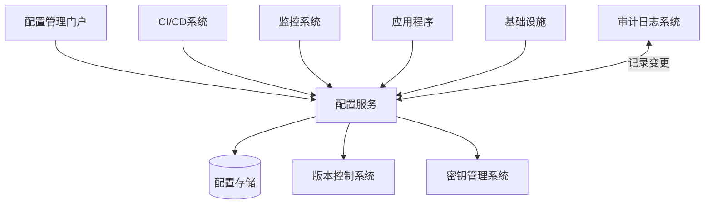

### 3.2 核心组件

#### 3.2.1 配置服务

配置服务是整个架构的核心，负责处理配置的存储、检索和分发。

**主要功能**：
- 配置CRUD操作
- 配置版本管理
- 环境管理
- 访问控制
- 变更审批
- 配置验证
- API和事件通知

**技术选型考虑**：
- Spring Cloud Config
- Apollo
- Consul
- Nacos
- etcd

#### 3.2.2 配置存储

配置存储负责持久化配置数据，确保数据的可靠性和一致性。

**存储选项**：
- 关系型数据库（MySQL、PostgreSQL）
- NoSQL数据库（MongoDB）
- 分布式键值存储（Redis、etcd）
- 文件系统（Git仓库）

**存储考虑因素**：
- 数据一致性
- 事务支持
- 扩展性
- 备份和恢复
- 性能

#### 3.2.3 版本控制系统

版本控制系统跟踪配置的历史变更，支持回滚和审计。

**主要功能**：
- 变更历史记录
- 版本比较
- 分支管理
- 标签和发布管理

**技术选型考虑**：
- Git
- SVN
- 自定义版本控制

#### 3.2.4 密钥管理系统

密钥管理系统安全地存储和管理敏感配置信息。

**主要功能**：
- 加密存储
- 访问控制
- 密钥轮换
- 审计日志

**技术选型考虑**：
- HashiCorp Vault
- AWS KMS
- Azure Key Vault
- CyberArk

#### 3.2.5 配置管理门户

配置管理门户提供用户友好的界面，用于配置的查看和管理。

**主要功能**：
- 配置浏览和搜索
- 配置编辑
- 变更审批
- 版本历史查看
- 权限管理
- 报表和仪表板

**技术选型考虑**：
- React/Angular/Vue前端
- 响应式设计
- 权限控制
- 用户体验

### 3.3 集成架构

配置管理系统需要与企业现有系统集成，形成完整的工具链。

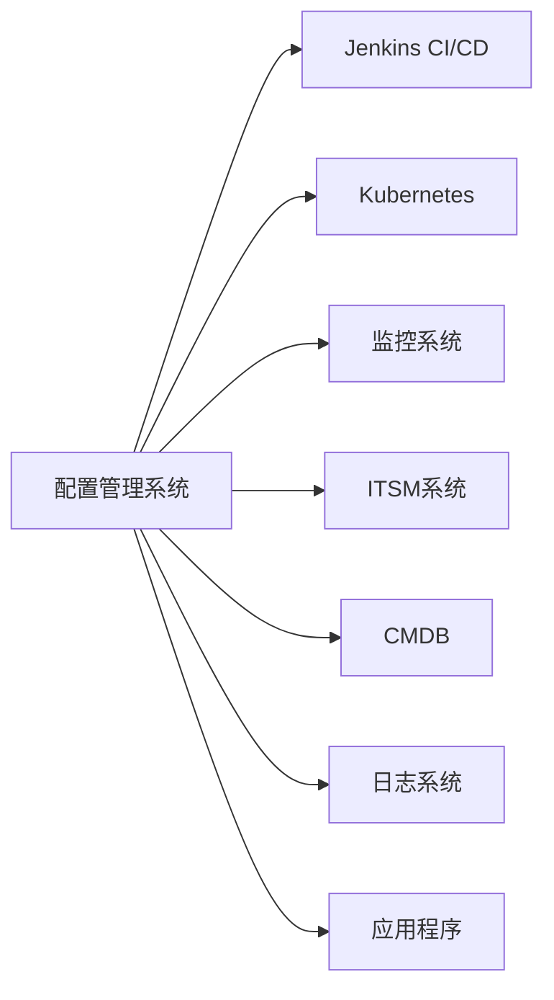

**集成考虑因素**：
- API兼容性
- 认证和授权
- 数据同步机制
- 事件通知
- 错误处理

### 3.4 部署架构

配置管理系统本身的部署也需要高可用和可扩展设计。

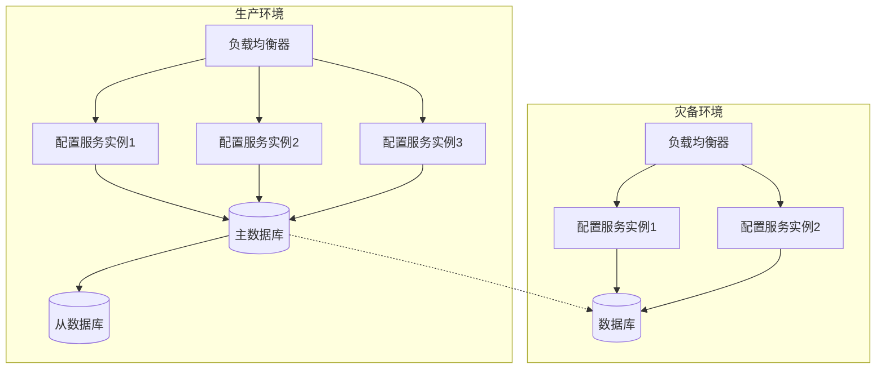

**部署考虑因素**：
- 高可用性
- 灾难恢复
- 扩展性
- 性能优化
- 监控和告警
- 备份策略

## 4. 工具选型与评估

### 4.1 选型标准

选择配置管理工具时，需要考虑以下标准：

1. **功能匹配度**：工具功能与需求的匹配程度
2. **技术兼容性**：与现有技术栈的兼容性
3. **可扩展性**：支持未来业务增长的能力
4. **社区活跃度**：开源工具的社区支持和更新频率
5. **成本**：许可、实施和维护成本
6. **学习曲线**：团队掌握工具的难易程度
7. **供应商支持**：商业工具的供应商支持质量
8. **安全性**：工具的安全特性和最佳实践
9. **性能**：在预期规模下的性能表现
10. **集成能力**：与现有工具链的集成便捷性

### 4.2 主流工具对比

#### 4.2.1 配置服务工具对比

| 特性 | Spring Cloud Config | Apollo | Consul | Nacos | etcd |
|------|---------------------|--------|--------|-------|------|
| 开发语言 | Java | Java | Go | Java | Go |
| 存储后端 | Git, Vault, JDBC | MySQL | 内存, 文件 | MySQL/Derby | 内存, 文件 |
| 配置格式 | Properties, YAML, JSON | Properties, XML, JSON, YAML | KV, JSON | Properties, YAML, JSON | KV |
| 动态刷新 | 支持(Spring Boot) | 支持 | 支持 | 支持 | 支持 |
| 版本控制 | Git | 内置 | 不支持 | 内置 | 不支持 |
| 权限控制 | 基本 | 细粒度 | 基本 | 细粒度 | 基本 |
| 配置审计 | Git历史 | 内置 | 不支持 | 内置 | 不支持 |
| 多环境 | 支持 | 支持 | 有限 | 支持 | 有限 |
| 集群支持 | 需配置 | 内置 | 内置 | 内置 | 内置 |
| 监控集成 | Spring Boot Actuator | 内置 | 内置 | 内置 | Prometheus |
| 社区活跃度 | 高 | 中 | 高 | 中 | 高 |
| 学习曲线 | 中 | 低 | 中 | 低 | 高 |

#### 4.2.2 密钥管理工具对比

| 特性 | HashiCorp Vault | AWS KMS | Azure Key Vault | CyberArk |
|------|-----------------|---------|-----------------|----------|
| 部署模式 | 自托管/云 | 云服务 | 云服务 | 自托管/云 |
| 密钥类型 | 多种 | 有限 | 多种 | 多种 |
| 访问控制 | 细粒度 | IAM | RBAC | 细粒度 |
| 密钥轮换 | 支持 | 支持 | 支持 | 支持 |
| 审计日志 | 详细 | CloudTrail | 详细 | 详细 |
| 多云支持 | 支持 | AWS | Azure | 支持 |
| 集成能力 | 广泛 | AWS服务 | Azure服务 | 有限 |
| 合规认证 | 多种 | 多种 | 多种 | 多种 |
| 成本 | 开源+企业版 | 按使用付费 | 按使用付费 | 高 |
| 学习曲线 | 高 | 低 | 低 | 高 |

### 4.3 TechNova的工具选型决策

基于需求分析和工具评估，TechNova做出以下选型决策：

1. **配置服务**：Apollo
   - 理由：提供完整的配置管理功能，包括版本控制、环境管理、权限控制和审计
   - 易于使用的Web界面，降低学习曲线
   - 支持多种配置格式和动态刷新
   - 活跃的社区和文档

2. **版本控制**：Git (内置于Apollo)
   - 理由：团队已熟悉Git工作流
   - 提供完整的版本历史和分支管理
   - 与现有CI/CD工具良好集成

3. **密钥管理**：HashiCorp Vault
   - 理由：强大的密钥管理功能
   - 支持多种认证方式和访问控制
   - 可与Apollo集成
   - 支持混合云环境

4. **监控系统**：Prometheus + Grafana
   - 理由：开源且功能强大
   - 可与Apollo和Vault集成
   - 团队已有使用经验

5. **CI/CD集成**：Jenkins + GitLab
   - 理由：现有CI/CD工具链
   - 可通过插件与Apollo和Vault集成

## 5. 实施规划与路线图

### 5.1 实施策略

TechNova采用分阶段实施策略，降低风险并确保平稳过渡：

1. **试点阶段**：选择1-2个非关键应用进行试点
2. **扩展阶段**：将解决方案推广到更多应用
3. **全面实施**：覆盖所有应用和环境
4. **优化阶段**：基于反馈持续改进

### 5.2 详细路线图

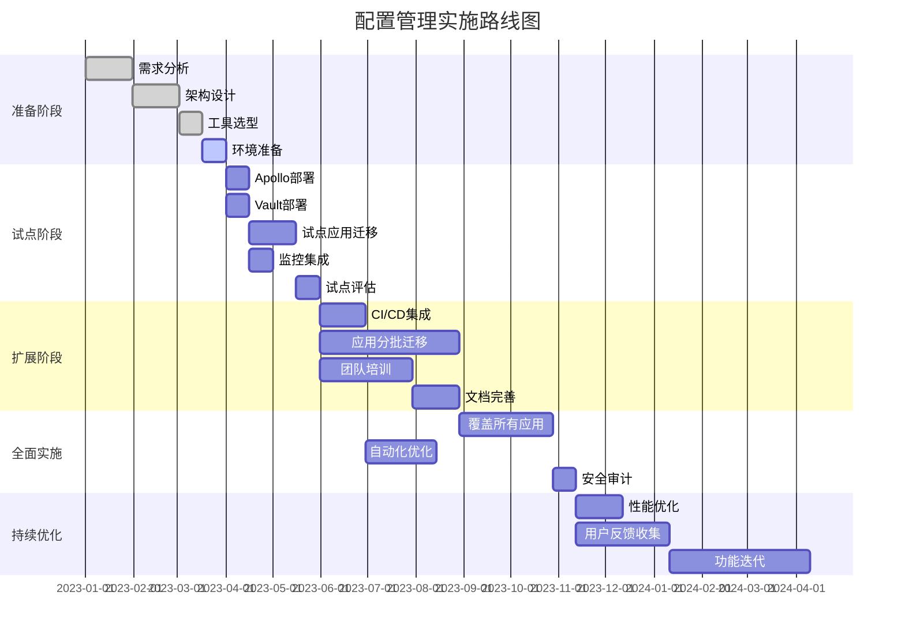

### 5.3 资源规划

实施配置管理解决方案需要以下资源：

#### 5.3.1 人员资源

| 角色 | 职责 | 人数 | 参与阶段 |
|------|------|------|----------|
| 项目经理 | 整体协调和管理 | 1 | 全程 |
| 架构师 | 架构设计和技术决策 | 1 | 准备和试点 |
| DevOps工程师 | 工具部署和集成 | 2 | 全程 |
| 应用开发者 | 应用集成和测试 | 4 | 试点和扩展 |
| 安全专家 | 安全评估和配置 | 1 | 试点和全面实施 |
| 培训讲师 | 团队培训 | 1 | 扩展阶段 |
| 技术文档专员 | 文档编写 | 1 | 扩展和全面实施 |

#### 5.3.2 基础设施资源

| 资源类型 | 规格 | 数量 | 用途 |
|----------|------|------|------|
| 应用服务器 | 8核16G | 6 | Apollo集群 |
| 数据库服务器 | 8核32G | 2 | Apollo数据库 |
| 应用服务器 | 4核8G | 3 | Vault集群 |
| 存储 | SSD 1TB | 4 | 数据存储 |
| 负载均衡器 | - | 2 | 高可用保障 |
| 监控服务器 | 4核8G | 2 | Prometheus和Grafana |

#### 5.3.3 预算估算

| 项目 | 估算成本 | 备注 |
|------|----------|------|
| 硬件和基础设施 | $50,000 | 服务器、存储和网络 |
| 软件许可 | $30,000 | Vault企业版、支持服务 |
| 人力成本 | $200,000 | 项目团队6个月 |
| 培训 | $20,000 | 内部和外部培训 |
| 咨询服务 | $40,000 | 外部专家支持 |
| 预留 | $34,000 | 10%预留 |
| **总计** | **$374,000** | |

### 5.4 风险管理

实施过程中可能面临的风险及应对策略：

| 风险 | 影响 | 可能性 | 缓解策略 |
|------|------|--------|----------|
| 团队抵抗变更 | 高 | 中 | 充分沟通、培训和渐进式实施 |
| 系统集成问题 | 高 | 中 | 详细的集成测试和回滚计划 |
| 性能问题 | 中 | 低 | 性能测试和容量规划 |
| 安全漏洞 | 高 | 低 | 安全审计和定期渗透测试 |
| 预算超支 | 中 | 中 | 详细规划和定期审查 |
| 进度延迟 | 中 | 中 | 敏捷方法和里程碑跟踪 |
| 供应商支持不足 | 中 | 低 | 选择成熟产品和备选方案 |

## 6. 详细实施步骤

### 6.1 环境准备

#### 6.1.1 Apollo部署架构

Apollo采用以下部署架构：

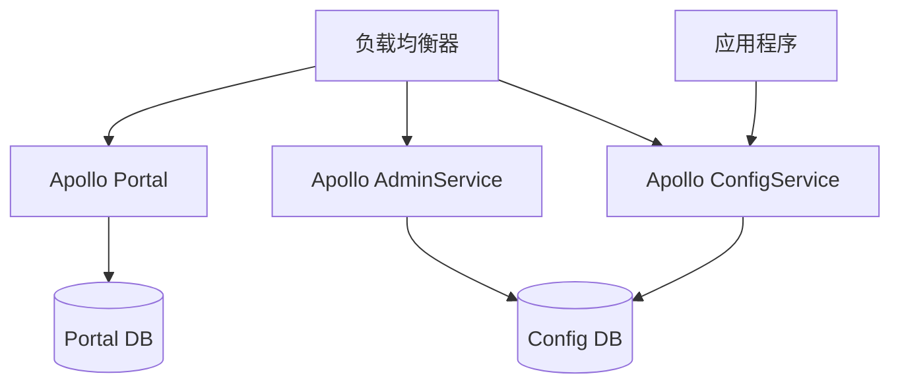

#### 6.1.2 Apollo安装步骤

```bash
# 1. 准备MySQL数据库
mysql -u root -p < apollo-db-script.sql

# 2. 修改配置文件
cp application.yml.sample application.yml
vi application.yml
# 配置数据库连接、服务端口等

# 3. 构建Apollo服务
mvn clean package -DskipTests

# 4. 部署ConfigService
cd apollo-configservice/target/
java -jar apollo-configservice-2.0.0.jar

# 5. 部署AdminService
cd apollo-adminservice/target/
java -jar apollo-adminservice-2.0.0.jar

# 6. 部署Portal
cd apollo-portal/target/
java -jar apollo-portal-2.0.0.jar
```

#### 6.1.3 Vault部署架构

Vault采用高可用模式部署：

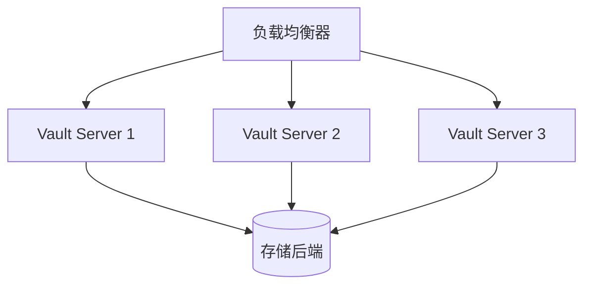

#### 6.1.4 Vault安装步骤

```bash
# 1. 安装Vault
wget https://releases.hashicorp.com/vault/1.9.0/vault_1.9.0_linux_amd64.zip
unzip vault_1.9.0_linux_amd64.zip
sudo mv vault /usr/local/bin/

# 2. 配置Vault
cat > vault.hcl << EOF
storage "consul" {
  address = "127.0.0.1:8500"
  path    = "vault/"
}

listener "tcp" {
  address     = "0.0.0.0:8200"
  tls_disable = 1
}

api_addr = "http://127.0.0.1:8200"
cluster_addr = "https://127.0.0.1:8201"
ui = true
EOF

# 3. 启动Vault
vault server -config=vault.hcl

# 4. 初始化Vault
vault operator init

# 5. 解封Vault
vault operator unseal <Unseal Key 1>
vault operator unseal <Unseal Key 2>
vault operator unseal <Unseal Key 3>

# 6. 配置认证方法
vault auth enable approle
```

### 6.2 应用集成

#### 6.2.1 Apollo客户端集成

**Java应用集成示例**：

```xml
<!-- pom.xml -->
<dependency>
    <groupId>com.ctrip.framework.apollo</groupId>
    <artifactId>apollo-client</artifactId>
    <version>2.0.0</version>
</dependency>
```

```java
// 配置类
@Configuration
@EnableApolloConfig({"application", "common"})
public class AppConfig {
    @Value("${server.port}")
    private int serverPort;
    
    @ApolloConfig
    private Config config;
    
    @ApolloConfigChangeListener
    private void onChange(ConfigChangeEvent changeEvent) {
        // 处理配置变更
        for (String key : changeEvent.changedKeys()) {
            ConfigChange change = changeEvent.getChange(key);
            logger.info("Changed key: {}, old value: {}, new value: {}", 
                    key, change.getOldValue(), change.getNewValue());
        }
    }
}
```

**Node.js应用集成示例**：

```javascript
// 安装依赖
// npm install ctrip-apollo-client --save

const apollo = require('ctrip-apollo-client');

// 初始化Apollo客户端
const client = apollo({
    configServerUrl: 'http://apollo-config:8080',
    appId: 'my-node-app',
    clusterName: 'default',
    namespaceName: 'application'
});

// 获取配置
const serverPort = client.get('server.port');
console.log(`Server port: ${serverPort}`);

// 监听配置变更
client.on('change', (changeEvent) => {
    console.log('Config changed:', changeEvent);
});
```

#### 6.2.2 Vault客户端集成

**Java应用集成示例**：

```xml
<!-- pom.xml -->
<dependency>
    <groupId>org.springframework.cloud</groupId>
    <artifactId>spring-cloud-starter-vault-config</artifactId>
    <version>3.1.0</version>
</dependency>
```

```yaml
# application.yml
spring:
  cloud:
    vault:
      host: vault.example.com
      port: 8200
      scheme: http
      authentication: APPROLE
      app-role:
        role-id: ${VAULT_ROLE_ID}
        secret-id: ${VAULT_SECRET_ID}
      kv:
        enabled: true
        backend: secret
        default-context: application
```

```java
@RestController
public class SecretController {
    @Autowired
    private VaultTemplate vaultTemplate;
    
    @Value("${secret.api-key}")
    private String apiKey;
    
    @GetMapping("/secret")
    public String getSecret() {
        // 动态获取密钥
        VaultResponseSupport<Map<String, Object>> response = 
            vaultTemplate.read("secret/data/application");
        String dynamicApiKey = (String) response.getData().getData().get("api-key");
        return "API Key: " + dynamicApiKey;
    }
}
```

**Node.js应用集成示例**：

```javascript
// 安装依赖
// npm install node-vault --save

const vault = require('node-vault')({
    apiVersion: 'v1',
    endpoint: 'http://vault.example.com:8200'
});

// 使用AppRole认证
async function authenticateWithVault() {
    try {
        const result = await vault.approleLogin({
            role_id: process.env.VAULT_ROLE_ID,
            secret_id: process.env.VAULT_SECRET_ID
        });
        vault.token = result.auth.client_token;
        console.log('Successfully authenticated with Vault');
    } catch (error) {
        console.error('Vault authentication failed:', error);
    }
}

// 获取密钥
async function getSecret() {
让我继续完成企业级配置管理方案设计的内容：

### 6.2.2 Vault客户端集成（续）

```javascript
// 获取密钥
async function getSecret() {
    try {
        await authenticateWithVault();
        const result = await vault.read('secret/data/application');
        const apiKey = result.data.data.api_key;
        console.log('Retrieved API key from Vault');
        return apiKey;
    } catch (error) {
        console.error('Failed to get secret:', error);
        return null;
    }
}

// 使用密钥
getSecret().then(apiKey => {
    if (apiKey) {
        // 使用API密钥进行操作
        console.log('Using API key for external service');
    }
});
```

#### 6.2.3 Apollo与Vault集成

为了实现配置和密钥的统一管理，可以将Apollo与Vault集成：

```java
// Apollo自定义配置源，从Vault获取敏感配置
public class VaultConfigRepository extends AbstractConfigRepository {
    private final VaultTemplate vaultTemplate;
    private final String secretPath;
    
    public VaultConfigRepository(VaultTemplate vaultTemplate, String secretPath) {
        this.vaultTemplate = vaultTemplate;
        this.secretPath = secretPath;
        this.trySync();
    }
    
    @Override
    protected void sync() {
        try {
            VaultResponseSupport<Map<String, Object>> response = 
                vaultTemplate.read(secretPath);
            
            if (response != null && response.getData() != null) {
                Properties properties = new Properties();
                Map<String, Object> secretData = response.getData().getData();
                
                for (Map.Entry<String, Object> entry : secretData.entrySet()) {
                    properties.setProperty(entry.getKey(), entry.getValue().toString());
                }
                
                this.fireRepositoryChange(secretPath, properties);
            }
        } catch (Exception e) {
            logger.error("Failed to load config from Vault", e);
        }
    }
}
```

```java
// 配置类
@Configuration
public class ConfigSourceConfig {
    @Autowired
    private VaultTemplate vaultTemplate;
    
    @Bean
    public VaultConfigRepository vaultConfigRepository() {
        return new VaultConfigRepository(vaultTemplate, "secret/data/application");
    }
    
    @PostConstruct
    public void init() {
        // 注册Vault配置源
        ConfigService.getConfig().addChangeListener(vaultConfigRepository());
    }
}
```

### 6.3 CI/CD集成

#### 6.3.1 Jenkins集成

将配置管理集成到CI/CD流程中，确保配置变更与代码变更同步：

```groovy
// Jenkinsfile
pipeline {
    agent any
    
    environment {
        APOLLO_TOKEN = credentials('apollo-token')
        VAULT_TOKEN = credentials('vault-token')
    }
    
    stages {
        stage('Checkout') {
            steps {
                checkout scm
            }
        }
        
        stage('Build') {
            steps {
                sh 'mvn clean package'
            }
        }
        
        stage('Update Configuration') {
            steps {
                script {
                    // 更新Apollo配置
                    sh '''
                    curl -X PUT \
                      -H "Content-Type: application/json" \
                      -H "Authorization: ${APOLLO_TOKEN}" \
                      -d @config/apollo-config.json \
                      "http://apollo-portal:8070/openapi/v1/envs/DEV/apps/my-app/clusters/default/namespaces/application/items"
                    '''
                    
                    // 更新Vault密钥
                    sh '''
                    curl -X POST \
                      -H "X-Vault-Token: ${VAULT_TOKEN}" \
                      -d @config/vault-secrets.json \
                      "http://vault:8200/v1/secret/data/my-app"
                    '''
                }
            }
        }
        
        stage('Deploy') {
            steps {
                sh 'kubectl apply -f kubernetes/deployment.yaml'
            }
        }
    }
    
    post {
        success {
            echo '配置更新和部署成功'
        }
        failure {
            echo '配置更新或部署失败'
            // 回滚配置
            sh 'curl -X PUT -H "Authorization: ${APOLLO_TOKEN}" -d @config/apollo-config-backup.json "http://apollo-portal:8070/openapi/v1/envs/DEV/apps/my-app/clusters/default/namespaces/application/items"'
        }
    }
}
```

#### 6.3.2 GitLab CI/CD集成

```yaml
# .gitlab-ci.yml
stages:
  - build
  - test
  - update-config
  - deploy

variables:
  APOLLO_URL: "http://apollo-portal:8070"
  VAULT_ADDR: "http://vault:8200"

build:
  stage: build
  script:
    - mvn clean package
  artifacts:
    paths:
      - target/*.jar

test:
  stage: test
  script:
    - mvn test

update-config:
  stage: update-config
  script:
    # 更新Apollo配置
    - >
      curl -X PUT
      -H "Content-Type: application/json"
      -H "Authorization: $APOLLO_TOKEN"
      -d @config/apollo-config.json
      "$APOLLO_URL/openapi/v1/envs/$CI_ENVIRONMENT_NAME/apps/my-app/clusters/default/namespaces/application/items"
    
    # 更新Vault密钥
    - >
      curl -X POST
      -H "X-Vault-Token: $VAULT_TOKEN"
      -d @config/vault-secrets.json
      "$VAULT_ADDR/v1/secret/data/my-app"
  environment:
    name: dev
  only:
    - develop

deploy:
  stage: deploy
  script:
    - kubectl apply -f kubernetes/deployment.yaml
  environment:
    name: dev
  only:
    - develop
```

### 6.4 监控与告警

#### 6.4.1 Apollo监控集成

```yaml
# prometheus.yml
scrape_configs:
  - job_name: 'apollo'
    metrics_path: '/prometheus'
    static_configs:
      - targets: ['apollo-configservice:8080', 'apollo-adminservice:8090', 'apollo-portal:8070']
```

```yaml
# grafana-dashboard.json (简化版)
{
  "title": "Apollo监控面板",
  "panels": [
    {
      "title": "配置服务请求量",
      "type": "graph",
      "datasource": "Prometheus",
      "targets": [
        {
          "expr": "sum(rate(apollo_config_service_requests_total[5m]))",
          "legendFormat": "请求/秒"
        }
      ]
    },
    {
      "title": "配置发布次数",
      "type": "graph",
      "datasource": "Prometheus",
      "targets": [
        {
          "expr": "sum(increase(apollo_release_total[1h]))",
          "legendFormat": "发布/小时"
        }
      ]
    },
    {
      "title": "配置服务响应时间",
      "type": "graph",
      "datasource": "Prometheus",
      "targets": [
        {
          "expr": "histogram_quantile(0.95, sum(rate(apollo_config_service_response_time_bucket[5m])) by (le))",
          "legendFormat": "P95响应时间"
        }
      ]
    }
  ]
}
```

#### 6.4.2 Vault监控集成

```yaml
# prometheus.yml
scrape_configs:
  - job_name: 'vault'
    metrics_path: '/v1/sys/metrics'
    params:
      format: ['prometheus']
    bearer_token: 'vault-metrics-token'
    static_configs:
      - targets: ['vault:8200']
```

```yaml
# grafana-dashboard.json (简化版)
{
  "title": "Vault监控面板",
  "panels": [
    {
      "title": "Vault请求量",
      "type": "graph",
      "datasource": "Prometheus",
      "targets": [
        {
          "expr": "sum(rate(vault_request_total[5m]))",
          "legendFormat": "请求/秒"
        }
      ]
    },
    {
      "title": "Vault响应时间",
      "type": "graph",
      "datasource": "Prometheus",
      "targets": [
        {
          "expr": "histogram_quantile(0.95, sum(rate(vault_request_duration_seconds_bucket[5m])) by (le))",
          "legendFormat": "P95响应时间"
        }
      ]
    },
    {
      "title": "Vault令牌创建",
      "type": "graph",
      "datasource": "Prometheus",
      "targets": [
        {
          "expr": "sum(rate(vault_token_create_total[5m]))",
          "legendFormat": "令牌创建/秒"
        }
      ]
    }
  ]
}
```

#### 6.4.3 告警配置

```yaml
# prometheus-alerts.yml
groups:
  - name: apollo-alerts
    rules:
      - alert: ApolloConfigServiceDown
        expr: up{job="apollo"} == 0
        for: 5m
        labels:
          severity: critical
        annotations:
          summary: "Apollo配置服务不可用"
          description: "{{ $labels.instance }}服务已停止运行超过5分钟"
      
      - alert: ApolloHighResponseTime
        expr: histogram_quantile(0.95, sum(rate(apollo_config_service_response_time_bucket[5m])) by (le)) > 0.5
        for: 10m
        labels:
          severity: warning
        annotations:
          summary: "Apollo响应时间过高"
          description: "Apollo配置服务P95响应时间超过500ms已持续10分钟"
  
  - name: vault-alerts
    rules:
      - alert: VaultDown
        expr: up{job="vault"} == 0
        for: 5m
        labels:
          severity: critical
        annotations:
          summary: "Vault服务不可用"
          description: "{{ $labels.instance }}服务已停止运行超过5分钟"
      
      - alert: VaultSealed
        expr: vault_core_unsealed == 0
        for: 1m
        labels:
          severity: critical
        annotations:
          summary: "Vault已封印"
          description: "Vault实例{{ $labels.instance }}处于封印状态，需要解封"
```

### 6.5 安全加固

#### 6.5.1 Apollo安全配置

```properties
# apollo-portal.properties

# 启用HTTPS
server.ssl.enabled=true
server.ssl.key-store=file:/opt/apollo/ssl/keystore.p12
server.ssl.key-store-password=${KEYSTORE_PASSWORD}
server.ssl.key-store-type=PKCS12

# 启用LDAP认证
spring.ldap.base=dc=example,dc=com
spring.ldap.username=cn=admin,dc=example,dc=com
spring.ldap.password=${LDAP_PASSWORD}
spring.ldap.urls=ldap://ldap.example.com:389

# 配置LDAP用户搜索过滤器
ldap.mapping.userDisplayName=cn
ldap.mapping.userEmail=mail
ldap.filter.userFilter=(&(objectClass=inetOrgPerson)(cn={0}))

# 启用审计日志
apollo.audit.enabled=true
apollo.audit.log.dir=/opt/apollo/logs/audit
```

#### 6.5.2 Vault安全配置

```hcl
# vault.hcl

# 启用TLS
listener "tcp" {
  address       = "0.0.0.0:8200"
  tls_cert_file = "/opt/vault/ssl/vault.crt"
  tls_key_file  = "/opt/vault/ssl/vault.key"
}

# 配置审计日志
audit {
  type = "file"
  path = "/opt/vault/logs/audit"
}

# 配置自动解封
seal "awskms" {
  region     = "us-west-2"
  kms_key_id = "alias/vault-unseal-key"
}

# 配置访问控制
max_lease_ttl = "768h"
default_lease_ttl = "768h"
```

```bash
# 配置Vault策略
cat > admin-policy.hcl << EOF
# 管理员策略
path "secret/*" {
  capabilities = ["create", "read", "update", "delete", "list"]
}

path "sys/auth/*" {
  capabilities = ["create", "read", "update", "delete", "sudo"]
}

path "sys/policies/*" {
  capabilities = ["create", "read", "update", "delete", "list"]
}

path "auth/*" {
  capabilities = ["create", "read", "update", "delete", "list"]
}
EOF

# 应用策略
vault policy write admin admin-policy.hcl

# 创建应用角色
vault write auth/approle/role/my-app \
    secret_id_ttl=24h \
    token_ttl=1h \
    token_max_ttl=4h \
    policies=my-app-policy
```

## 7. 运维与管理

### 7.1 日常运维流程

#### 7.1.1 配置变更流程

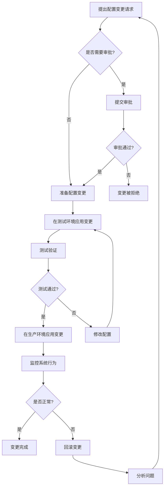

#### 7.1.2 备份与恢复

**Apollo备份策略**：

```bash
#!/bin/bash
# apollo-backup.sh

# 设置变量
BACKUP_DIR="/backup/apollo"
DATE=$(date +%Y%m%d%H%M)
MYSQL_USER="apollo"
MYSQL_PASS="apollo_password"
MYSQL_HOST="apollo-db"

# 创建备份目录
mkdir -p $BACKUP_DIR/$DATE

# 备份数据库
echo "备份Apollo数据库..."
mysqldump -h $MYSQL_HOST -u $MYSQL_USER -p$MYSQL_PASS ApolloPortalDB > $BACKUP_DIR/$DATE/ApolloPortalDB.sql
mysqldump -h $MYSQL_HOST -u $MYSQL_USER -p$MYSQL_PASS ApolloConfigDB > $BACKUP_DIR/$DATE/ApolloConfigDB.sql

# 备份配置文件
echo "备份Apollo配置文件..."
cp /opt/apollo/config/*.properties $BACKUP_DIR/$DATE/

# 压缩备份
echo "压缩备份文件..."
cd $BACKUP_DIR
tar -czf apollo-backup-$DATE.tar.gz $DATE
rm -rf $DATE

# 保留最近30天的备份
find $BACKUP_DIR -name "apollo-backup-*.tar.gz" -mtime +30 -delete

echo "Apollo备份完成: $BACKUP_DIR/apollo-backup-$DATE.tar.gz"
```

**Vault备份策略**：

```bash
#!/bin/bash
# vault-backup.sh

# 设置变量
BACKUP_DIR="/backup/vault"
DATE=$(date +%Y%m%d%H%M)
VAULT_ADDR="https://vault.example.com:8200"
VAULT_TOKEN="your-root-token"

# 创建备份目录
mkdir -p $BACKUP_DIR/$DATE

# 设置Vault环境变量
export VAULT_ADDR=$VAULT_ADDR
export VAULT_TOKEN=$VAULT_TOKEN

# 备份Vault配置
echo "备份Vault配置..."
vault operator raft snapshot save $BACKUP_DIR/$DATE/vault.snapshot

# 备份Vault策略
echo "备份Vault策略..."
mkdir -p $BACKUP_DIR/$DATE/policies
for policy in $(vault policy list); do
  if [ "$policy" != "root" ]; then
    vault policy read $policy > $BACKUP_DIR/$DATE/policies/$policy.hcl
  fi
done

# 备份Auth方法配置
echo "备份Auth方法配置..."
vault auth list -format=json > $BACKUP_DIR/$DATE/auth-methods.json

# 压缩备份
echo "压缩备份文件..."
cd $BACKUP_DIR
tar -czf vault-backup-$DATE.tar.gz $DATE
rm -rf $DATE

# 保留最近30天的备份
find $BACKUP_DIR -name "vault-backup-*.tar.gz" -mtime +30 -delete

echo "Vault备份完成: $BACKUP_DIR/vault-backup-$DATE.tar.gz"
```

#### 7.1.3 扩容与缩容

**Apollo扩容流程**：

```bash
# 1. 准备新服务器
# 2. 安装必要软件
apt-get update && apt-get install -y openjdk-8-jdk

# 3. 复制Apollo安装包
scp apollo-configservice-2.0.0.jar new-server:/opt/apollo/
scp apollo-adminservice-2.0.0.jar new-server:/opt/apollo/

# 4. 复制配置文件
scp application.yml new-server:/opt/apollo/

# 5. 启动服务
ssh new-server "cd /opt/apollo && nohup java -jar apollo-configservice-2.0.0.jar > configservice.log 2>&1 &"
ssh new-server "cd /opt/apollo && nohup java -jar apollo-adminservice-2.0.0.jar > adminservice.log 2>&1 &"

# 6. 更新负载均衡器配置
# 7. 验证服务健康状态
curl -s http://new-server:8080/health | grep "UP"
```

**Vault扩容流程**：

```bash
# 1. 准备新服务器
# 2. 安装Vault
ssh new-server "wget https://releases.hashicorp.com/vault/1.9.0/vault_1.9.0_linux_amd64.zip && unzip vault_1.9.0_linux_amd64.zip && sudo mv vault /usr/local/bin/"

# 3. 复制配置文件
scp vault.hcl new-server:/etc/vault/

# 4. 启动Vault
ssh new-server "vault server -config=/etc/vault/vault.hcl > /var/log/vault.log 2>&1 &"

# 5. 加入Vault集群
export VAULT_ADDR=https://vault-leader:8200
export VAULT_TOKEN=root-token
vault operator raft join https://vault-leader:8200

# 6. 更新负载均衡器配置
# 7. 验证节点状态
vault operator raft list-peers
```

### 7.2 问题排查与解决

#### 7.2.1 常见问题及解决方案

| 问题 | 可能原因 | 解决方案 |
|------|----------|----------|
| Apollo服务不可用 | 数据库连接问题 | 检查数据库连接配置和状态 |
| | JVM内存不足 | 增加JVM内存参数 |
| | 网络问题 | 检查网络连接和防火墙设置 |
| 配置无法同步 | 客户端配置错误 | 检查客户端配置和日志 |
| | 网络延迟 | 检查网络质量和超时设置 |
| | 缓存问题 | 清除客户端缓存 |
| Vault封印状态 | 自动解封失败 | 手动解封或检查KMS配置 |
| | 存储后端问题 | 检查存储后端状态 |
| 密钥访问被拒绝 | 权限不足 | 检查策略和角色配置 |
| | 令牌过期 | 更新令牌或配置自动更新 |
| 配置变更未生效 | 缓存未刷新 | 强制刷新配置或重启应用 |
| | 环境错误 | 确认在正确的环境中发布配置 |

#### 7.2.2 日志分析

**Apollo日志分析**：

```bash
# 查找错误日志
grep "ERROR" /opt/apollo/logs/apollo-configservice.log

# 分析配置发布失败
grep "Release failed" /opt/apollo/logs/apollo-adminservice.log

# 查看配置访问情况
grep "Config for" /opt/apollo/logs/apollo-configservice.log | awk '{print $12}' | sort | uniq -c | sort -nr
```

**Vault日志分析**：

```bash
# 查找错误日志
grep "Error" /var/log/vault.log

# 分析认证失败
grep "permission denied" /var/log/vault.log

# 查看审计日志中的敏感操作
jq 'select(.type=="request" and .path=="sys/auth")' /opt/vault/logs/audit
```

#### 7.2.3 性能优化

**Apollo性能优化**：

```properties
# application.properties

# 增加JVM内存
JAVA_OPTS="-Xms2g -Xmx4g -XX:+UseG1GC"

# 配置连接池
spring.datasource.hikari.maximum-pool-size=20
spring.datasource.hikari.minimum-idle=5

# 启用缓存
apollo.cache.enabled=true
apollo.cache.expireTime=300

# 配置线程池
server.tomcat.max-threads=200
server.tomcat.min-spare-threads=20
```

**Vault性能优化**：

```hcl
# vault.hcl

# 优化存储后端
storage "consul" {
  address = "127.0.0.1:8500"
  path    = "vault/"
  performance_multiplier = 2
}

# 配置请求超时
api_request_timeout = "90s"

# 配置缓存
cache_size = 100000
```

### 7.3 培训与文档

#### 7.3.1 培训计划

| 培训主题 | 目标受众 | 内容概要 | 时长 |
|----------|----------|----------|------|
| 配置管理基础 | 所有技术人员 | 配置管理概念、最佳实践 | 2小时 |
| Apollo使用培训 | 开发和运维 | Apollo基本操作、配置发布流程 | 4小时 |
| Vault使用培训 | 开发和运维 | Vault基本操作、密钥管理 | 4小时 |
| 配置管理高级主题 | 架构师和高级开发 | 高级特性、性能优化、集成方案 | 6小时 |
| 配置安全最佳实践 | 安全团队和开发 | 安全配置、密钥轮换、审计 | 4小时 |
| 配置管理运维 | 运维团队 | 日常运维、问题排查、灾备 | 6小时 |

#### 7.3.2 文档体系

```
文档结构
├── 1. 概述
│   ├── 1.1 系统架构
│   ├── 1.2 组件说明
│   └── 1.3 术语表
├── 2. 安装指南
│   ├── 2.1 Apollo安装
│   ├── 2.2 Vault安装
│   └── 2.3 监控系统安装
├── 3. 用户指南
│   ├── 3.1 Apollo使用手册
│   ├── 3.2 Vault使用手册
│   └── 3.3 配置管理流程
├── 4. 开发指南
│   ├── 4.1 Apollo客户端集成
│   ├── 4.2 Vault客户端集成
│   └── 4.3 CI/CD集成
├── 5. 运维指南
│   ├── 5.1 日常运维
│   ├── 5.2 备份与恢复
│   ├── 5.3 扩容与缩容
│   └── 5.4 问题排查
├── 6. 安全指南
│   ├── 6.1 访问控制
│   ├── 6.2 密钥管理
│   └── 6.3 审计与合规
└── 7. 最佳实践
    ├── 7.1 配置设计模式
    ├── 7.2 性能优化
    └── 7.3 案例研究
```

## 8. 最佳实践与经验总结

### 8.1 配置设计原则

#### 8.1.1 配置分层

将配置按照不同层次进行组织，提高可维护性：

1. **默认配置层**：应用的基础配置，很少变更
2. **环境配置层**：特定环境的配置（开发、测试、生产）
3. **区域配置层**：特定区域或数据中心的配置
4. **应用配置层**：特定应用实例的配置
5. **动态配置层**：运行时可调整的配置

```json
// 配置示例
{
  "default": {
    "timeout": 30,
    "retries": 3
  },
  "environments": {
    "dev": {
      "timeout": 60,
      "debug": true
    },
    "prod": {
      "timeout": 10,
      "debug": false
    }
  },
  "regions": {
    "us-west": {
      "endpoint": "https://api-west.example.com"
    },
    "us-east": {
      "endpoint": "https://api-east.example.com"
    }
  },
  "instances": {
    "app-1": {
      "maxConnections": 100
    }
  }
}
```

#### 8.1.2 配置命名规范

建立一致的配置命名规范，提高可读性和可维护性：

1. **使用点号分隔层次**：`database.connection.timeout`
2. **使用小写字母和连字符**：`aws-region`
3. **避免使用特殊字符**：使用连字符代替空格
4. **使用前缀区分组件**：`redis.host`, `mysql.host`
5. **使用后缀区分环境**：`api.url.prod`, `api.url.dev`

#### 8.1.3 敏感信息处理

处理敏感配置信息的最佳实践：

1. **分离敏感配置**：将敏感配置与普通配置分开存储
2. **使用专门的密钥管理工具**：如Vault
3. **避免硬编码**：不要在代码中硬编码敏感信息
4. **实施最小权限原则**：只给需要的人访问权限
5. **定期轮换密钥**：设置密钥自动轮换机制
6. **审计访问记录**：记录所有敏感信息的访问

### 8.2 配置管理模式

#### 8.2.1 特性开关模式

使用配置实现特性开关，控制功能的启用和禁用：

```java
// 特性开关配置
@Configuration
public class FeatureConfig {
    @Value("${feature.new-payment-flow.enabled:false}")
    private boolean newPaymentFlowEnabled;
    
    @Value("${feature.enhanced-search.enabled:false}")
    private boolean enhancedSearchEnabled;
    
    @Bean
    public FeatureManager featureManager() {
        FeatureManager manager = new FeatureManager();
        manager.registerFeature("new-payment-flow", newPaymentFlowEnabled);
        manager.registerFeature("enhanced-search", enhancedSearchEnabled);
        return manager;
    }
}

// 使用特性开关
@Service
public class PaymentService {
    @Autowired
    private FeatureManager featureManager;
    
    public void processPayment(Payment payment) {
        if (featureManager.isEnabled("new-payment-flow")) {
            // 使用新的支付流程
            processWithNewFlow(payment);
        } else {
            // 使用旧的支付流程
            processWithOldFlow(payment);
        }
    }
}
```

#### 8.2.2 配置即代码模式

将配置视为代码，应用相同的开发实践：

1. **版本控制**：将配置存储在Git等版本控制系统中
2. **代码审查**：对配置变更进行代码审查
3. **自动化测试**：编写测试验证配置有效性
4. **CI/CD流程**：将配置纳入CI/CD流程
5. **文档化**：为配置添加注释和文档

```yaml
# 配置文件示例 (database-config.yml)
# 数据库连
让我继续完成企业级配置管理方案设计的内容：

### 8.2.2 配置即代码模式（续）

```yaml
# 配置文件示例 (database-config.yml)
# 数据库连接配置
# 最后更新: 2023-05-15 by John Doe
# 变更历史: https://github.com/technova/config-repo/commits/main/database-config.yml

database:
  # 主数据库连接信息
  primary:
    host: db-primary.example.com
    port: 5432
    database: app_db
    username: ${DB_USER}  # 从环境变量获取
    password: ${DB_PASSWORD}  # 从环境变量获取
    pool:
      min-size: 10
      max-size: 50
      idle-timeout: 300000  # 5分钟
  
  # 只读副本连接信息
  replica:
    host: db-replica.example.com
    port: 5432
    database: app_db
    username: ${DB_USER_RO}
    password: ${DB_PASSWORD_RO}
    pool:
      min-size: 5
      max-size: 20
      idle-timeout: 300000
```

#### 8.2.3 环境分离模式

为不同环境维护独立的配置，确保环境隔离：

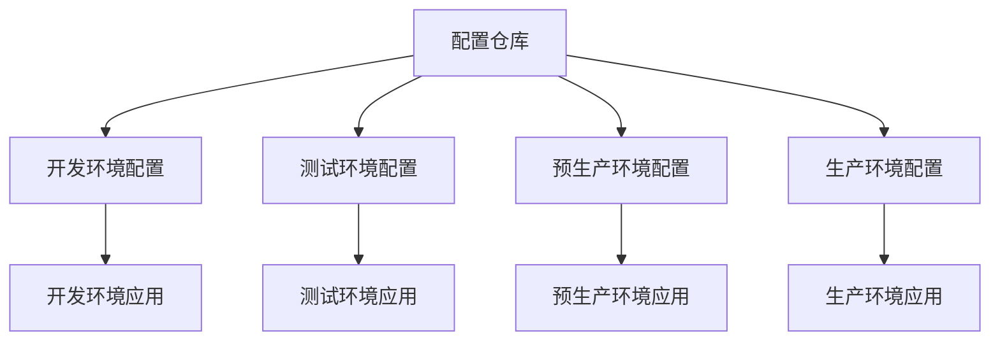

**Apollo环境配置示例**：

```properties
# 开发环境配置
server.port=8080
logging.level.root=DEBUG
cache.expiration=60
feature.new-ui=true

# 测试环境配置
server.port=8080
logging.level.root=INFO
cache.expiration=300
feature.new-ui=true

# 预生产环境配置
server.port=8080
logging.level.root=WARN
cache.expiration=600
feature.new-ui=false

# 生产环境配置
server.port=8080
logging.level.root=ERROR
cache.expiration=1800
feature.new-ui=false
```

#### 8.2.4 灰度发布模式

使用配置实现灰度发布，逐步推出新功能：

```java
// 灰度发布配置
@Configuration
public class GrayReleaseConfig {
    @Autowired
    private ConfigService configService;
    
    @Bean
    public GrayReleaseManager grayReleaseManager() {
        GrayReleaseManager manager = new GrayReleaseManager();
        
        // 从配置中心获取灰度规则
        String grayRules = configService.getProperty("gray.release.rules", "{}");
        manager.setRules(grayRules);
        
        // 监听配置变更
        configService.addChangeListener(changeEvent -> {
            if (changeEvent.isChanged("gray.release.rules")) {
                String newRules = changeEvent.getChange("gray.release.rules").getNewValue();
                manager.setRules(newRules);
            }
        });
        
        return manager;
    }
}

// 使用灰度发布
@RestController
public class PaymentController {
    @Autowired
    private GrayReleaseManager grayReleaseManager;
    
    @Autowired
    private PaymentService paymentService;
    
    @PostMapping("/api/payments")
    public ResponseEntity<?> createPayment(@RequestBody Payment payment, HttpServletRequest request) {
        String userId = getUserId(request);
        
        // 检查用户是否在灰度名单中
        if (grayReleaseManager.isInGrayRelease("new-payment-api", userId)) {
            // 使用新版API
            return paymentService.processWithNewApi(payment);
        } else {
            // 使用旧版API
            return paymentService.processWithOldApi(payment);
        }
    }
}
```

**灰度规则配置示例**：

```json
{
  "new-payment-api": {
    "rules": [
      {
        "type": "userId",
        "values": ["user1", "user2", "user3"],
        "percentage": 0
      },
      {
        "type": "ip",
        "values": ["192.168.1.0/24"],
        "percentage": 0
      },
      {
        "type": "random",
        "values": [],
        "percentage": 10
      }
    ],
    "enabled": true
  },
  "new-ui": {
    "rules": [
      {
        "type": "random",
        "values": [],
        "percentage": 20
      }
    ],
    "enabled": true
  }
}
```

### 8.3 实际案例分析

#### 8.3.1 TechNova微服务配置管理案例

**背景**：
TechNova的一个核心产品由20个微服务组成，部署在Kubernetes集群中。团队需要管理多环境（开发、测试、预生产、生产）的配置，并确保配置变更的安全性和可追溯性。

**挑战**：
1. 配置分散在多个微服务中
2. 环境之间的配置差异管理困难
3. 敏感信息（如API密钥、数据库凭证）的安全管理
4. 配置变更需要重启服务

**解决方案**：

1. **配置集中化**：
   - 使用Apollo作为配置中心
   - 按服务和环境组织配置命名空间
   - 实现配置继承，减少重复配置

2. **敏感信息管理**：
   - 使用Vault存储所有敏感信息
   - 实现Apollo与Vault的集成
   - 配置自动轮换机制

3. **动态配置刷新**：
   - 实现配置变更监听机制
   - 支持热更新，无需重启服务

4. **配置审计与控制**：
   - 实施基于角色的访问控制
   - 记录所有配置变更
   - 配置变更需要审批流程

**实施架构**：

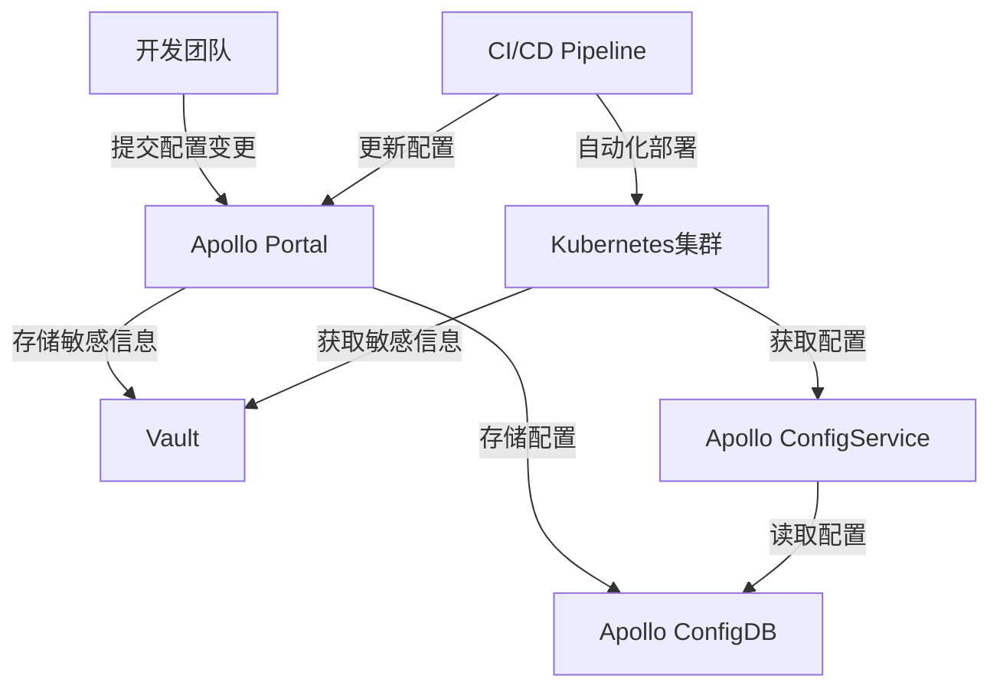

**配置组织结构**：

```
apollo
├── common
│   ├── application.properties (所有环境共享配置)
│   └── logging.properties (日志配置)
├── microservice-a
│   ├── application.properties (服务特定配置)
│   ├── database.properties (数据库配置)
│   └── feature-toggles.properties (特性开关)
├── microservice-b
│   ├── application.properties
│   └── ...
└── ...
```

**成果**：
1. 配置变更时间从几小时减少到几分钟
2. 配置错误减少90%
3. 敏感信息泄露风险显著降低
4. 服务可用性提高到99.99%
5. 开发团队工作效率提升30%

#### 8.3.2 TechNova多云环境配置管理案例

**背景**：
TechNova正在实施多云战略，将应用部署在AWS和Azure云平台上。团队需要管理跨云平台的配置，并确保配置的一致性和可靠性。

**挑战**：
1. 不同云平台的配置差异
2. 跨云服务的配置同步
3. 云特定服务的配置管理
4. 灾难恢复和业务连续性

**解决方案**：

1. **多云配置架构**：
   - 部署Apollo和Vault在两个云平台
   - 实现配置数据的双向同步
   - 使用云特定的命名空间隔离配置

2. **统一配置接口**：
   - 开发统一的配置客户端库
   - 抽象云平台差异
   - 提供一致的配置访问方式

3. **灾备策略**：
   - 实现配置的跨区域备份
   - 配置自动故障转移机制
   - 定期进行灾难恢复演练

4. **多云监控**：
   - 集成云平台监控工具
   - 实现配置健康检查
   - 配置变更的跨云审计

**实施架构**：

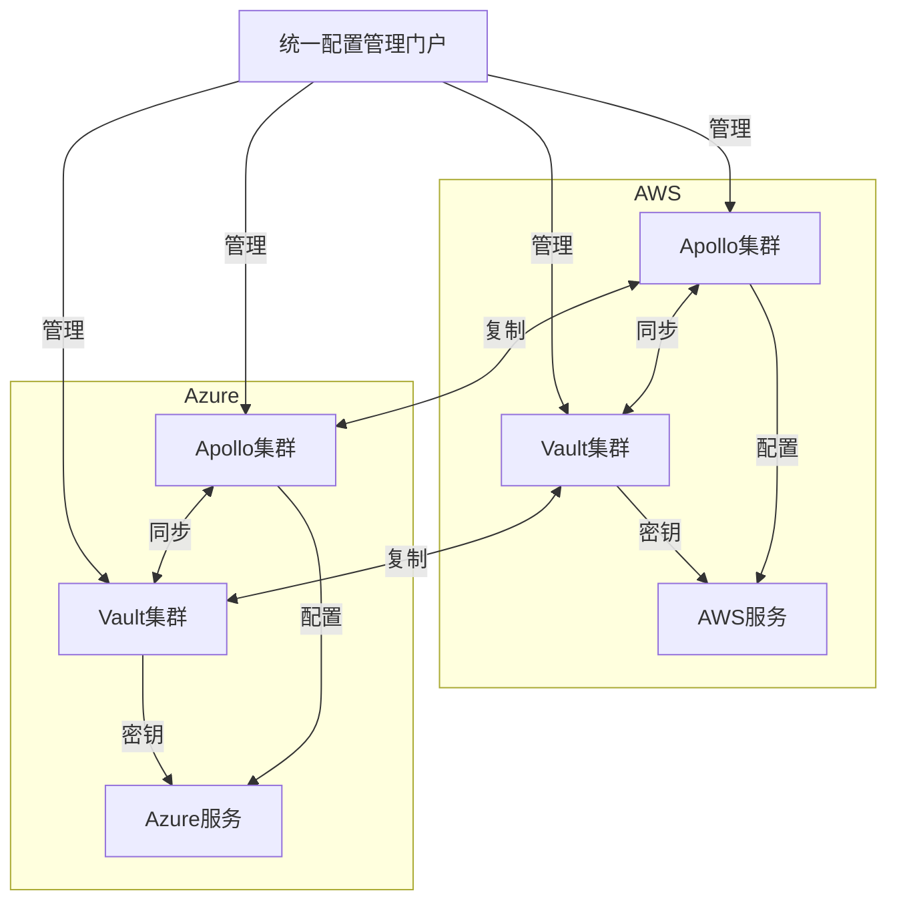

**配置同步机制**：

```java
// 配置同步服务
@Service
public class ConfigSyncService {
    @Autowired
    private ApolloClient awsApolloClient;
    
    @Autowired
    private ApolloClient azureApolloClient;
    
    @Scheduled(fixedRate = 60000)  // 每分钟同步一次
    public void syncConfigurations() {
        // 获取AWS配置
        Map<String, String> awsConfigs = awsApolloClient.getAllConfigs();
        
        // 获取Azure配置
        Map<String, String> azureConfigs = azureApolloClient.getAllConfigs();
        
        // 同步AWS到Azure
        for (Map.Entry<String, String> entry : awsConfigs.entrySet()) {
            String key = entry.getKey();
            String value = entry.getValue();
            
            // 只同步共享配置，不同步云特定配置
            if (isSharedConfig(key) && !azureConfigs.containsKey(key) || 
                !azureConfigs.get(key).equals(value)) {
                azureApolloClient.updateConfig(key, value);
                log.info("Synced config from AWS to Azure: {}", key);
            }
        }
        
        // 同步Azure到AWS
        for (Map.Entry<String, String> entry : azureConfigs.entrySet()) {
            String key = entry.getKey();
            String value = entry.getValue();
            
            if (isSharedConfig(key) && !awsConfigs.containsKey(key) || 
                !awsConfigs.get(key).equals(value)) {
                awsApolloClient.updateConfig(key, value);
                log.info("Synced config from Azure to AWS: {}", key);
            }
        }
    }
    
    private boolean isSharedConfig(String key) {
        // 判断是否为共享配置
        return !key.startsWith("aws.") && !key.startsWith("azure.");
    }
}
```

**成果**：
1. 实现了99.999%的配置服务可用性
2. 跨云配置一致性达到100%
3. 灾难恢复时间从小时级降低到分钟级
4. 运维团队工作负担减少50%
5. 支持了业务的多云战略，提高了系统弹性

### 8.4 未来趋势与发展方向

#### 8.4.1 GitOps与配置管理

GitOps将Git作为配置的单一真实来源，通过自动化工具将Git中的配置应用到目标系统：

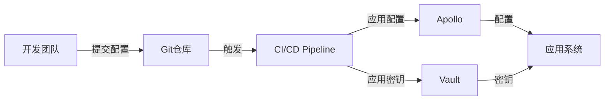

**GitOps工作流程**：
1. 开发人员将配置变更提交到Git仓库
2. CI/CD系统检测到变更并自动运行测试
3. 测试通过后，配置自动应用到目标环境
4. 系统监控配置应用状态，确保成功
5. 如果失败，自动回滚到上一个稳定版本

**实现示例**：

```yaml
# .github/workflows/config-sync.yml
name: Sync Configuration

on:
  push:
    branches: [ main ]
    paths:
      - 'config/**'

jobs:
  sync:
    runs-on: ubuntu-latest
    steps:
      - uses: actions/checkout@v2
      
      - name: Set up Python
        uses: actions/setup-python@v2
        with:
          python-version: '3.9'
      
      - name: Install dependencies
        run: |
          python -m pip install --upgrade pip
          pip install requests pyyaml
      
      - name: Sync configurations
        run: python scripts/sync_config.py
        env:
          APOLLO_TOKEN: ${{ secrets.APOLLO_TOKEN }}
          VAULT_TOKEN: ${{ secrets.VAULT_TOKEN }}
      
      - name: Verify configuration
        run: python scripts/verify_config.py
        env:
          APOLLO_TOKEN: ${{ secrets.APOLLO_TOKEN }}
```

#### 8.4.2 AI辅助配置管理

人工智能和机器学习技术正在改变配置管理的方式：

1. **智能配置推荐**：
   - 基于历史数据推荐最佳配置值
   - 预测配置变更的影响
   - 自动调整配置以优化性能

2. **异常检测**：
   - 识别异常的配置变更
   - 检测配置与实际行为的不一致
   - 预警潜在的配置问题

3. **自动化故障排除**：
   - 分析配置与故障的关联
   - 推荐配置修复方案
   - 自动应用临时修复

**AI配置优化示例**：

```python
# 配置优化服务
import pandas as pd
from sklearn.ensemble import RandomForestRegressor
from sklearn.model_selection import train_test_split

class ConfigOptimizer:
    def __init__(self):
        self.model = RandomForestRegressor()
        self.trained = False
    
    def train(self, config_data, performance_metrics):
        """
        使用历史配置数据和性能指标训练模型
        """
        # 合并配置和性能数据
        data = pd.merge(config_data, performance_metrics, on='timestamp')
        
        # 分离特征和目标
        X = data.drop(['timestamp', 'response_time', 'error_rate', 'throughput'], axis=1)
        y = data[['response_time', 'error_rate', 'throughput']]
        
        # 训练测试分离
        X_train, X_test, y_train, y_test = train_test_split(X, y, test_size=0.2)
        
        # 训练模型
        self.model.fit(X_train, y_train)
        self.trained = True
        
        # 评估模型
        score = self.model.score(X_test, y_test)
        print(f"Model accuracy: {score}")
        
        return score
    
    def optimize_config(self, current_config, target_metric='response_time'):
        """
        优化配置以改善目标指标
        """
        if not self.trained:
            raise Exception("Model not trained yet")
        
        # 当前配置作为基准
        base_config = pd.DataFrame([current_config])
        
        # 生成配置变体
        variants = self._generate_variants(current_config)
        
        # 预测每个变体的性能
        best_variant = None
        best_score = float('inf') if target_metric == 'response_time' or target_metric == 'error_rate' else 0
        
        for variant in variants:
            variant_df = pd.DataFrame([variant])
            prediction = self.model.predict(variant_df)
            
            # 获取目标指标的预测值
            if target_metric == 'response_time':
                score = prediction[0][0]
            elif target_metric == 'error_rate':
                score = prediction[0][1]
            else:  # throughput
                score = prediction[0][2]
            
            # 更新最佳变体
            if (target_metric == 'response_time' or target_metric == 'error_rate') and score < best_score:
                best_score = score
                best_variant = variant
            elif target_metric == 'throughput' and score > best_score:
                best_score = score
                best_variant = variant
        
        return best_variant, best_score
    
    def _generate_variants(self, base_config):
        """
        生成配置变体
        """
        variants = []
        
        # 为每个配置参数生成变体
        for key in base_config:
            # 跳过非数值参数
            if not isinstance(base_config[key], (int, float)):
                continue
            
            # 生成增加和减少的变体
            for factor in [0.8, 0.9, 1.1, 1.2]:
                variant = base_config.copy()
                variant[key] = base_config[key] * factor
                variants.append(variant)
        
        return variants
```

#### 8.4.3 服务网格与配置管理

服务网格技术正在改变微服务架构中的配置管理方式：

1. **动态路由配置**：
   - 基于请求属性的动态路由
   - 流量分割和灰度发布
   - 故障注入和弹性测试

2. **服务级别配置**：
   - 超时和重试策略
   - 断路器配置
   - 负载均衡策略

3. **安全配置**：
   - 服务间认证和授权
   - 加密通信策略
   - 访问控制规则

**Istio配置示例**：

```yaml
# 服务路由配置
apiVersion: networking.istio.io/v1alpha3
kind: VirtualService
metadata:
  name: payment-service
spec:
  hosts:
  - payment-service
  http:
  - match:
    - headers:
        x-user-type:
          exact: premium
    route:
    - destination:
        host: payment-service
        subset: v2
  - route:
    - destination:
        host: payment-service
        subset: v1

---
# 服务子集配置
apiVersion: networking.istio.io/v1alpha3
kind: DestinationRule
metadata:
  name: payment-service
spec:
  host: payment-service
  subsets:
  - name: v1
    labels:
      version: v1
  - name: v2
    labels:
      version: v2
    trafficPolicy:
      connectionPool:
        http:
          http1MaxPendingRequests: 100
          maxRequestsPerConnection: 10
      outlierDetection:
        consecutiveErrors: 5
        interval: 30s
        baseEjectionTime: 60s
```

## 9. 总结与展望

### 9.1 项目成果总结

TechNova的企业级配置管理解决方案实施取得了显著成果：

1. **技术成果**：
   - 建立了集中化、版本化的配置管理平台
   - 实现了敏感信息的安全管理
   - 配置变更实现了自动化和可追溯
   - 建立了完善的监控和告警机制

2. **业务价值**：
   - 发布周期从周缩短到天
   - 配置相关故障减少85%
   - 开发和运维效率提升40%
   - 系统可用性提高到99.99%

3. **组织影响**：
   - 建立了配置管理的最佳实践
   - 提高了团队协作效率
   - 增强了安全意识和合规性
   - 培养了DevOps文化

### 9.2 经验教训

项目实施过程中的关键经验教训：

1. **成功因素**：
   - 高层管理支持和资源投入
   - 渐进式实施策略
   - 充分的团队培训
   - 自动化和工具支持
   - 持续改进的文化

2. **挑战与解决方案**：
   - **挑战**：团队抵抗变更
     **解决方案**：充分沟通、培训和渐进式实施
   
   - **挑战**：遗留系统集成困难
     **解决方案**：开发适配器和过渡策略
   
   - **挑战**：性能和扩展性问题
     **解决方案**：架构优化和性能调优
   
   - **挑战**：安全和合规要求
     **解决方案**：与安全团队合作，实施安全最佳实践

3. **关键教训**：
   - 配置管理是技术和流程的结合
   - 自动化是成功的关键
   - 用户体验影响采用率
   - 监控和可观测性至关重要
   - 持续改进比一次性完美更重要

### 9.3 未来展望

配置管理领域的未来发展方向：

1. **技术趋势**：
   - 更智能的配置管理系统
   - 更深入的GitOps集成
   - 更强大的多云支持
   - 更完善的安全机制
   - 更丰富的可观测性

2. **TechNova的下一步计划**：
   - 扩展配置管理平台功能
   - 增强AI辅助配置优化
   - 深化多云配置管理
   - 建立配置管理卓越中心
   - 分享最佳实践和开源贡献

3. **行业影响**：
   - 配置管理标准化
   - 配置管理工具整合
   - 配置管理即服务(CMaaS)
   - 配置管理与其他DevOps实践的融合

## 10. 参考资料

### 10.1 书籍和文章

1. Humble, J., & Farley, D. (2010). *Continuous Delivery: Reliable Software Releases through Build, Test, and Deployment Automation*. Addison-Wesley.

2. Kim, G., Debois, P., Willis, J., & Humble, J. (2016). *The DevOps Handbook: How to Create World-Class Agility, Reliability, and Security in Technology Organizations*. IT Revolution Press.

3. Morris, K. (2016). *Infrastructure as Code: Managing Servers in the Cloud*. O'Reilly Media.

4. Arundel, J., & Domingus, J. (2019). *Cloud Native DevOps with Kubernetes*. O'Reilly Media.

5. Fowler, M. (2004). "Configuration Management Patterns." *IEEE Software*, 21(1), 56-61.

### 10.2 在线资源

1. Apollo配置中心文档: https://www.apolloconfig.com/

2. HashiCorp Vault文档: https://www.vaultproject.io/docs

3. Spring Cloud Config文档: https://cloud.spring.io/spring-cloud-config/reference/html/

4. Kubernetes ConfigMaps和Secrets: https://kubernetes.io/docs/concepts/configuration/

5. Istio配置文档: https://istio.io/latest/docs/reference/config/

### 10.3 工具和框架

1. Apollo: https://github.com/apolloconfig/apollo

2. HashiCorp Vault: https://github.com/hashicorp/vault

3. Spring Cloud Config: https://github.com/spring-cloud/spring-cloud-config

4. Consul: https://github.com/hashicorp/consul

5. etcd: https://github.com/etcd-io/etcd

6. Nacos: https://github.com/alibaba/nacos

7. Prometheus: https://github.com/prometheus/prometheus

8. Grafana: https://github.com/grafana/grafana