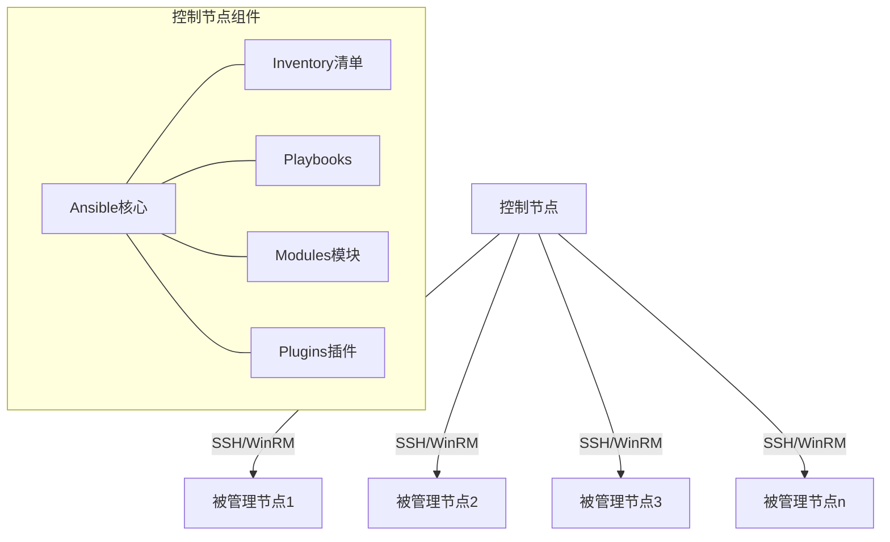
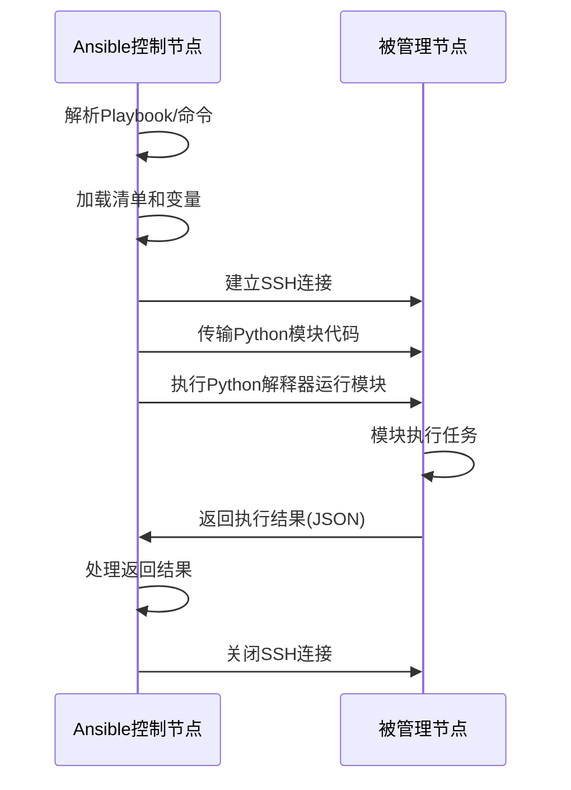
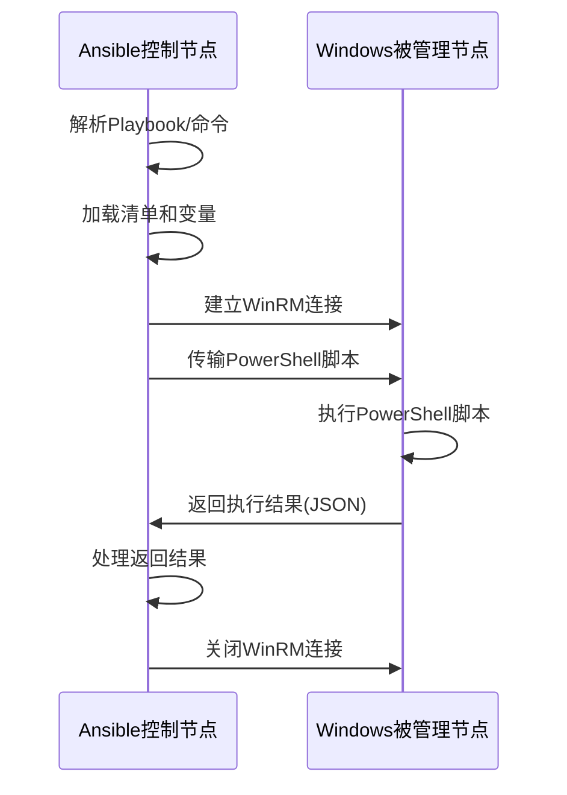
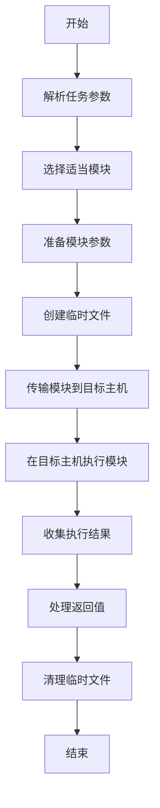
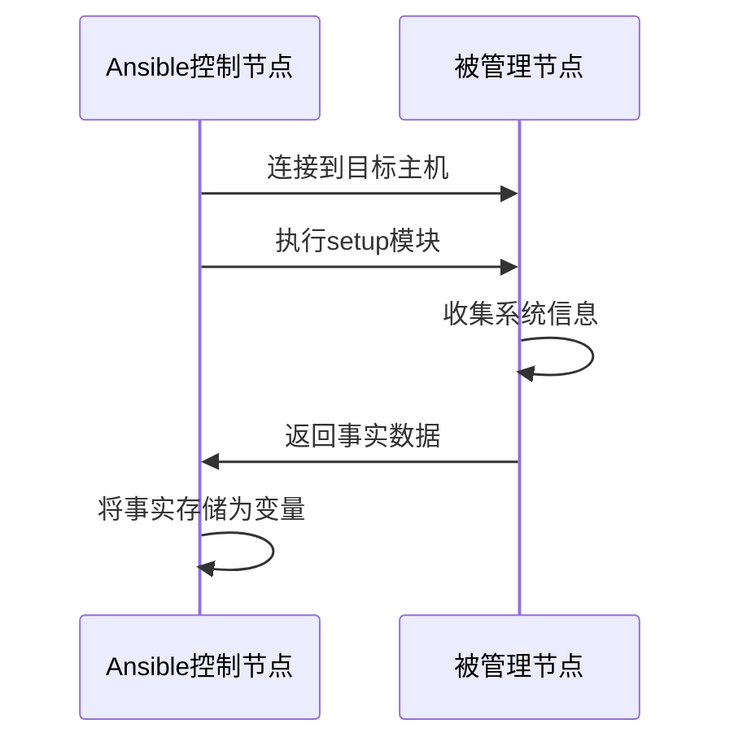

# Ansible架构与工作原理

Ansible采用了无代理(Agentless)的架构设计，本文将详细介绍Ansible的系统架构、核心组件和工作流程，包括控制节点与被管理节点的通信机制、模块执行原理和并行处理模型，帮助读者深入理解Ansible的设计思想。

## 1. Ansible架构概述

Ansible是一个开源的自动化工具，专为配置管理、应用部署、任务自动化和IT编排而设计。与其他配置管理工具不同，Ansible采用了无代理(Agentless)架构，这意味着在被管理的远程主机上不需要安装任何客户端软件或守护进程。

### 1.1 无代理架构的优势

Ansible的无代理架构带来了多项优势：

1. **简化部署**：不需要在目标主机上安装和维护额外的软件
2. **降低资源消耗**：目标主机不需要运行常驻进程
3. **提高安全性**：减少了潜在的攻击面
4. **易于采用**：降低了使用自动化工具的门槛
5. **适用范围广**：可以管理几乎任何支持SSH或其他连接方式的设备

### 1.2 Ansible系统架构图



### 1.3 核心架构组件

Ansible的架构由以下核心组件构成：

1. **控制节点(Control Node)**：安装Ansible的主机，负责执行自动化任务
2. **被管理节点(Managed Nodes)**：被Ansible管理的远程主机
3. **清单(Inventory)**：定义被管理节点及其分组信息
4. **模块(Modules)**：执行特定任务的代码单元
5. **插件(Plugins)**：扩展Ansible核心功能的组件
6. **Playbooks**：用YAML格式编写的自动化任务脚本
7. **角色(Roles)**：组织和重用Playbook的方式
8. **集合(Collections)**：模块、角色和插件的分发格式

## 2. 控制节点详解

控制节点是安装并运行Ansible的主机，它负责协调和执行自动化任务。

### 2.1 控制节点要求

控制节点需要满足以下要求：

- Python 2.7或Python 3.5+（最新版本推荐Python 3.8+）
- 支持的操作系统：几乎所有类Unix系统（Linux、macOS等）
- Windows不能作为控制节点（但可以通过WSL使用）
- 网络连接：能够通过SSH或其他协议连接到被管理节点

### 2.2 控制节点核心组件

#### 2.2.1 Ansible核心引擎

Ansible核心引擎负责解析用户输入、加载配置、协调模块执行等核心功能。它包含以下主要部分：

- **命令解析器**：处理命令行参数和选项
- **配置管理器**：加载和管理Ansible配置
- **任务执行器**：协调任务的执行流程
- **主机连接管理器**：管理与被管理节点的连接

#### 2.2.2 清单管理

清单(Inventory)定义了Ansible可以管理的主机列表及其分组信息。清单可以是静态的（如INI或YAML文件）或动态的（如从云提供商或CMDB获取）。

**静态清单示例(INI格式)**：

```ini
[webservers]
web1.example.com
web2.example.com

[dbservers]
db1.example.com
db2.example.com

[datacenter:children]
webservers
dbservers

[datacenter:vars]
ansible_user=admin
```

**动态清单示例(Python脚本)**：

```python
#!/usr/bin/env python

import json
import subprocess

# 从外部系统获取主机信息
def get_hosts_from_external_system():
    # 这里可以是API调用、数据库查询等
    return {
        "webservers": ["web1.example.com", "web2.example.com"],
        "dbservers": ["db1.example.com", "db2.example.com"]
    }

# 构建Ansible动态清单格式
inventory = {}
hosts_data = get_hosts_from_external_system()

# 添加主机和组
for group, hosts in hosts_data.items():
    inventory[group] = {
        "hosts": hosts,
        "vars": {
            "group_specific_var": "value"
        }
    }

# 添加元数据
inventory["_meta"] = {
    "hostvars": {
        "web1.example.com": {
            "host_specific_var": "value"
        }
    }
}

# 输出JSON格式
print(json.dumps(inventory))
```

#### 2.2.3 变量管理

Ansible使用变量来处理不同环境和主机的差异。变量可以在多个位置定义，包括：

- 清单文件中的主机和组变量
- 独立的变量文件（YAML格式）
- 角色默认变量和角色变量
- Playbook中定义的变量
- 命令行传递的变量（使用`-e`或`--extra-vars`）
- 注册变量（任务执行结果）
- 事实变量（从被管理节点收集的信息）

Ansible遵循特定的变量优先级顺序，命令行变量具有最高优先级，而角色默认变量优先级最低。

### 2.3 模块系统

模块是Ansible的工作单元，每个模块执行特定的任务，如管理文件、安装软件包、操作数据库等。

#### 2.3.1 模块类型

Ansible模块可以分为多种类型：

- **核心模块**：Ansible官方维护的模块
- **自定义模块**：用户开发的模块
- **第三方模块**：社区或第三方开发的模块

按功能分类：

- **系统模块**：如`user`、`group`、`service`
- **命令模块**：如`command`、`shell`、`raw`
- **文件模块**：如`file`、`copy`、`template`
- **包管理模块**：如`apt`、`yum`、`pip`
- **云模块**：如`aws_ec2`、`azure_rm_virtualmachine`
- **数据库模块**：如`mysql_db`、`postgresql_db`
- **网络模块**：如`ios_command`、`nxos_config`

#### 2.3.2 模块加载机制

Ansible使用插件式架构加载模块，遵循以下步骤：

1. 搜索模块路径（由`ANSIBLE_LIBRARY`环境变量或配置文件定义）
2. 查找匹配的模块文件
3. 验证模块文件的有效性
4. 加载模块代码
5. 准备模块参数
6. 将模块和参数传输到目标主机

### 2.4 插件系统

插件扩展了Ansible的核心功能，处理诸如连接管理、回调处理、缓存等任务。

#### 2.4.1 主要插件类型

- **连接插件**：管理与被管理节点的连接（SSH、WinRM等）
- **回调插件**：处理命令输出和显示
- **缓存插件**：缓存事实和清单数据
- **查找插件**：在各种位置查找数据（文件、数据库等）
- **过滤插件**：转换和操作数据
- **策略插件**：控制任务执行策略
- **变量插件**：加载额外的变量数据

#### 2.4.2 插件加载机制

插件加载过程类似于模块加载：

1. 搜索插件路径
2. 查找匹配的插件文件
3. 验证插件文件的有效性
4. 加载插件代码
5. 初始化插件实例

## 3. 被管理节点详解

被管理节点是Ansible自动化的目标主机，可以是物理服务器、虚拟机、网络设备或云实例。

### 3.1 被管理节点要求

被管理节点需要满足以下基本要求：

- **Linux/Unix节点**：
  - SSH服务
  - Python 2.6+或Python 3.5+（推荐Python 3.8+）
  
- **Windows节点**：
  - PowerShell 3.0+
  - .NET Framework 4.0+
  - WinRM服务配置为接受连接

### 3.2 Python依赖

虽然Ansible是无代理的，但它依赖于目标主机上的Python解释器来执行模块。Ansible会：

1. 将Python模块代码传输到目标主机
2. 在目标主机上调用Python解释器执行模块
3. 收集执行结果并返回给控制节点

对于不支持Python的设备（如某些网络设备），Ansible可以使用`raw`模块或特定的连接插件。

### 3.3 临时文件管理

Ansible在执行过程中会在被管理节点上创建临时文件：

1. 在远程主机上创建临时目录（通常在`/tmp`下）
2. 将模块代码和参数复制到临时目录
3. 执行模块
4. 收集输出
5. 清理临时文件

这个过程是自动的，通常对用户透明，但在某些环境中（如受限的`/tmp`目录）可能需要特别配置。

## 4. 通信机制

Ansible的通信机制是其无代理架构的核心，它定义了控制节点如何与被管理节点交互。

### 4.1 SSH通信

对于Linux/Unix系统，Ansible默认使用SSH协议进行通信：



#### 4.1.1 SSH连接选项

Ansible支持多种SSH连接方式：

- **OpenSSH**（默认）：利用系统的SSH客户端
- **Paramiko**：纯Python实现的SSH客户端
- **ssh (command line)**：直接调用ssh命令

可以在配置文件或命令行中指定：

```ini
# ansible.cfg
[defaults]
transport = paramiko
```

#### 4.1.2 SSH密钥管理

Ansible推荐使用SSH密钥认证，而非密码认证：

```bash
# 生成SSH密钥对
ssh-keygen -t rsa -b 4096

# 将公钥复制到目标主机
ssh-copy-id user@target-host
```

也可以使用`ansible-playbook`的`--private-key`选项指定私钥：

```bash
ansible-playbook playbook.yml --private-key=~/.ssh/id_rsa
```

### 4.2 WinRM通信

对于Windows系统，Ansible使用WinRM（Windows Remote Management）协议：



#### 4.2.1 配置WinRM

在Windows主机上，需要配置WinRM服务以允许Ansible连接：

```powershell
# 在Windows主机上执行
$url = "https://raw.githubusercontent.com/ansible/ansible/devel/examples/scripts/ConfigureRemotingForAnsible.ps1"
$file = "$env:temp\ConfigureRemotingForAnsible.ps1"
(New-Object -TypeName System.Net.WebClient).DownloadFile($url, $file)
powershell.exe -ExecutionPolicy ByPass -File $file
```

#### 4.2.2 WinRM连接选项

在Ansible清单中配置WinRM连接：

```ini
[windows]
win1.example.com

[windows:vars]
ansible_connection=winrm
ansible_winrm_server_cert_validation=ignore
ansible_user=Administrator
ansible_password=SecurePassword
```

### 4.3 网络设备通信

对于网络设备，Ansible使用特定的连接插件：

- **network_cli**：基于SSH的CLI连接
- **netconf**：使用NETCONF协议
- **httpapi**：基于HTTP/HTTPS API

```ini
[cisco]
switch1.example.com

[cisco:vars]
ansible_connection=network_cli
ansible_network_os=ios
ansible_user=admin
ansible_password=cisco
```

### 4.4 本地执行

Ansible也可以在本地执行任务，无需远程连接：

```yaml
- name: 本地执行任务
  hosts: localhost
  connection: local
  tasks:
    - name: 创建本地文件
      file:
        path: /tmp/test.txt
        state: touch
```

## 5. 模块执行原理

模块是Ansible的工作单元，了解其执行原理对于深入理解Ansible至关重要。

### 5.1 模块执行流程



### 5.2 模块实现方式

Ansible模块可以用多种语言实现，但最常见的是Python：

#### 5.2.1 Python模块示例

```python
#!/usr/bin/python

from ansible.module_utils.basic import AnsibleModule

def main():
    # 定义模块参数
    module = AnsibleModule(
        argument_spec=dict(
            name=dict(type='str', required=True),
            state=dict(type='str', default='present', choices=['present', 'absent']),
            content=dict(type='str', default='')
        ),
        supports_check_mode=True
    )
    
    # 获取参数
    name = module.params['name']
    state = module.params['state']
    content = module.params['content']
    
    # 检查模式
    if module.check_mode:
        module.exit_json(changed=False)
    
    # 执行实际操作
    changed = False
    try:
        if state == 'present':
            # 创建或更新文件
            with open(name, 'w') as f:
                f.write(content)
            changed = True
        else:
            # 删除文件
            import os
            if os.path.exists(name):
                os.remove(name)
                changed = True
    except Exception as e:
        module.fail_json(msg=str(e))
    
    # 返回结果
    module.exit_json(changed=changed)

if __name__ == '__main__':
    main()
```

#### 5.2.2 PowerShell模块示例

对于Windows目标，Ansible使用PowerShell模块：

```powershell
#!powershell

#Requires -Module Ansible.ModuleUtils.Legacy

$params = Parse-Args $args -supports_check_mode $true
$check_mode = Get-AnsibleParam -obj $params -name "_ansible_check_mode" -type "bool" -default $false

$path = Get-AnsibleParam -obj $params -name "path" -type "str" -failifempty $true
$state = Get-AnsibleParam -obj $params -name "state" -type "str" -default "present" -validateset "present","absent"
$content = Get-AnsibleParam -obj $params -name "content" -type "str" -default ""

$result = @{
    changed = $false
}

if ($state -eq "present") {
    if (-not (Test-Path -Path $path) -or (Get-Content -Path $path -Raw) -ne $content) {
        if (-not $check_mode) {
            Set-Content -Path $path -Value $content
        }
        $result.changed = $true
    }
} else {
    if (Test-Path -Path $path) {
        if (-not $check_mode) {
            Remove-Item -Path $path -Force
        }
        $result.changed = $true
    }
}

Exit-Json $result
```

### 5.3 参数验证与处理

Ansible模块使用参数规范来验证和处理输入：

1. **类型验证**：确保参数是正确的数据类型（字符串、整数、布尔值等）
2. **必需参数检查**：确保所有必需参数都已提供
3. **参数值验证**：检查参数值是否在允许的范围内
4. **互斥参数检查**：确保互斥参数不会同时使用
5. **依赖参数检查**：确保依赖参数一起提供

### 5.4 返回值处理

Ansible模块通过JSON格式返回执行结果：

```json
{
  "changed": true,
  "failed": false,
  "msg": "操作成功完成",
  "additional_info": {
    "key1": "value1",
    "key2": "value2"
  }
}
```

关键返回字段：

- **changed**：指示模块是否对系统进行了更改
- **failed**：指示模块执行是否失败
- **msg**：描述执行结果的消息
- 其他字段：模块特定的额外信息

### 5.5 幂等性原则

Ansible模块设计遵循幂等性原则，即多次执行相同的操作应产生相同的结果：

```yaml
- name: 确保用户存在
  user:
    name: ansible
    state: present
    shell: /bin/bash
```

无论执行多少次，结果都是相同的：用户`ansible`存在，且shell为`/bin/bash`。

## 6. 任务执行流程

Ansible的任务执行流程定义了从Playbook到实际操作的完整过程。

### 6.1 Playbook解析

当执行`ansible-playbook`命令时，Ansible首先解析Playbook文件：

1. 读取YAML文件
2. 验证语法
3. 解析变量、条件和循环
4. 构建任务列表

```yaml
---
- name: 示例Playbook
  hosts: webservers
  vars:
    http_port: 80
  tasks:
    - name: 确保Apache已安装
      apt:
        name: apache2
        state: present
      when: ansible_os_family == "Debian"
      
    - name: 确保Apache服务运行
      service:
        name: apache2
        state: started
        enabled: yes
```

### 6.2 主机选择与分组

Ansible根据Playbook中的`hosts`字段选择目标主机：

1. 查询清单文件
2. 应用主机模式匹配（如通配符、正则表达式）
3. 应用主机限制（如`--limit`选项）
4. 构建最终的主机列表

### 6.3 任务执行策略

Ansible支持多种任务执行策略：

#### 6.3.1 线性策略（默认）

每个任务在所有主机上执行完成后，才开始下一个任务：

```mermaid
gantt
    title 线性策略
    dateFormat  s
    axisFormat %S
    
    section 主机1
    任务1     :a1, 0, 2s
    任务2     :a2, after a1 b1 c1, 2s
    任务3     :a3, after a2 b2 c2, 2s
    
    section 主机2
    任务1     :b1, 0, 2s
    任务2     :b2, after a1 b1 c1, 2s
    任务3     :b3, after a2 b2 c2, 2s
    
    section 主机3
    任务1     :c1, 0, 2s
    任务2     :c2, after a1 b1 c1, 2s
    任务3     :c3, after a2 b2 c2, 2s
```



#### 6.3.2 自由策略

每个主机独立执行所有任务，不等待其他主机：

```mermaid
gantt
    title 自由策略
    dateFormat  s
    axisFormat %S
    
    section 主机1
    任务1     :a1, 0, 2s
    任务2     :a2, after a1, 2s
    任务3     :a3, after a2, 2s
    
    section 主机2
    任务1     :b1, 0, 2s
    任务2     :b2, after b1, 2s
    任务3     :b3, after b2, 2s
    
    section 主机3
    任务1     :c1, 0, 2s
    任务2     :c2, after c1, 2s
    任务3     :c3, after c2, 2s
```



在Playbook中指定策略：

```yaml
- name: 使用自由策略的Playbook
  hosts: all
  strategy: free
  tasks:
    # 任务列表
```

### 6.4 任务委派

Ansible允许将任务委派给特定主机执行：

```yaml
- name: 在负载均衡器上更新配置
  template:
    src: haproxy.cfg.j2
    dest: /etc/haproxy/haproxy.cfg
  delegate_to: loadbalancer.example.com
  
- name: 在本地执行任务
  command: echo "在控制节点执行"
  delegate_to: localhost
```

### 6.5 并行处理模型

Ansible使用多进程模型实现并行执行：

1. 主进程解析Playbook和清单
2. 为每个主机创建一个子进程（最大数量由`forks`参数控制）
3. 子进程与目标主机建立连接并执行任务
4. 主进程收集和处理结果

默认情况下，`forks`设置为5，可以在配置文件中修改：

```ini
# ansible.cfg
[defaults]
forks = 20
```

也可以在命令行中指定：

```bash
ansible-playbook playbook.yml -f 30
```

### 6.6 错误处理

Ansible提供多种错误处理机制：

#### 6.6.1 忽略错误

```yaml
- name: 可能会失败的任务
  command: /bin/false
  ignore_errors: yes
```

#### 6.6.2 自定义错误条件

```yaml
- name: 检查命令输出
  command: grep "ERROR" /var/log/app.log
  register: command_result
  failed_when: command_result.rc > 1
```

#### 6.6.3 块级错误处理

```yaml
- name: 尝试一组任务
  block:
    - name: 任务1
      command: /bin/true
    - name: 任务2
      command: /bin/false
  rescue:
    - name: 错误恢复任务
      debug:
        msg: "发生错误，执行恢复操作"
  always:
    - name: 总是执行的任务
      debug:
        msg: "无论成功或失败都会执行"
```

## 7. 事实收集与使用

Ansible使用"事实"(Facts)来收集有关被管理节点的信息，这些信息可以在Playbook中使用。

### 7.1 事实收集过程

事实收集是Ansible执行的第一步：

1. 连接到目标主机
2. 执行`setup`模块
3. 收集系统信息
4. 将信息作为变量返回



### 7.2 常用事实变量

Ansible收集的事实包括：

- **系统信息**：`ansible_distribution`、`ansible_os_family`
- **硬件信息**：`ansible_processor`、`ansible_memtotal_mb`
- **网络信息**：`ansible_default_ipv4`、`ansible_interfaces`
- **存储信息**：`ansible_devices`、`ansible_mounts`
- **虚拟化信息**：`ansible_virtualization_type`

示例：

```yaml
- name: 显示系统信息
  debug:
    msg: "操作系统: {{ ansible_distribution }} {{ ansible_distribution_version }}"

- name: 基于操作系统执行不同任务
  include_tasks: "{{ ansible_os_family }}.yml"
```

### 7.3 自定义事实

除了系统收集的事实，还可以定义自定义事实：

```yaml
- name: 设置自定义事实
  set_fact:
    app_version: "1.2.3"
    deployment_date: "{{ ansible_date_time.date }}"

- name: 使用自定义事实
  debug:
    msg: "部署应用版本 {{ app_version }} 于 {{ deployment_date }}"
```

### 7.4 本地事实

可以在被管理节点上创建持久的自定义事实：

```yaml
- name: 创建自定义事实目录
  file:
    path: /etc/ansible/facts.d
    state: directory
    mode: '0755'

- name: 创建自定义事实文件
  copy:
    content: |
      [application]
      version=1.2.3
      deploy_date={{ ansible_date_time.date }}
    dest: /etc/ansible/facts.d/application.fact
    mode: '0644'
```

这些事实将在下次事实收集时自动加载，可通过`ansible_local`变量访问：

```yaml
- name: 显示本地事实
  debug:
    msg: "应用版本: {{ ansible_local.application.version }}"
```

### 7.5 禁用事实收集

对于某些场景，可能需要禁用事实收集以提高性能：

```yaml
- name: 不收集事实的Playbook
  hosts: all
  gather_facts: no
  tasks:
    - name: 简单任务
      debug:
        msg: "跳过事实收集"
```

## 8. 缓存机制

Ansible提供缓存机制来提高性能和减少对被管理节点的访问。

### 8.1 事实缓存

事实缓存可以减少重复的事实收集：

```ini
# ansible.
让我继续完成关于Ansible架构与工作原理的内容：

## 8. 缓存机制

Ansible提供缓存机制来提高性能和减少对被管理节点的访问。

### 8.1 事实缓存

事实缓存可以减少重复的事实收集：

```ini
# ansible.cfg
[defaults]
gathering = smart
fact_caching = jsonfile
fact_caching_connection = /tmp/ansible_fact_cache
fact_caching_timeout = 86400  # 缓存有效期（秒）
```

缓存模式选项：
- **smart**：仅在首次连接主机或缓存过期时收集事实
- **implicit**：始终收集事实（默认）
- **explicit**：仅在明确要求时收集事实

### 8.2 缓存插件

Ansible支持多种缓存后端：

1. **jsonfile**：将缓存存储为JSON文件
2. **memcached**：使用Memcached服务
3. **redis**：使用Redis服务
4. **mongodb**：使用MongoDB数据库

Redis缓存配置示例：

```ini
# ansible.cfg
[defaults]
gathering = smart
fact_caching = redis
fact_caching_timeout = 86400
fact_caching_connection = redis://localhost:6379/0
```

### 8.3 清单缓存

除了事实缓存，Ansible还支持动态清单缓存：

```ini
# ansible.cfg
[inventory]
cache = yes
cache_plugin = jsonfile
cache_timeout = 3600
cache_connection = /tmp/ansible_inventory_cache
```

这对于使用云API等较慢的动态清单源特别有用。

### 8.4 手动管理缓存

可以使用命令行工具管理缓存：

```bash
# 清除所有主机的事实缓存
ansible-inventory --flush-cache

# 刷新特定主机的事实
ansible hostname -m setup
```

## 9. 并发与性能优化

Ansible的性能对于大规模自动化至关重要，了解并发模型和优化技术可以显著提高效率。

### 9.1 并发控制

Ansible使用`forks`参数控制并发执行的任务数：

```ini
# ansible.cfg
[defaults]
forks = 50  # 默认为5
```

增加`forks`值可以提高并行度，但也会增加控制节点的资源消耗。

### 9.2 异步任务执行

对于长时间运行的任务，可以使用异步执行：

```yaml
- name: 异步执行长时间任务
  command: /usr/bin/long_running_operation
  async: 3600  # 最大运行时间（秒）
  poll: 0      # 不等待完成

- name: 检查任务状态
  async_status:
    jid: "{{ async_result.ansible_job_id }}"
  register: job_result
  until: job_result.finished
  retries: 30
  delay: 10
```

`poll=0`表示立即返回，不等待任务完成，适用于"启动并忘记"的场景。

### 9.3 批处理执行

使用`serial`参数可以控制批量执行的主机数：

```yaml
- name: 批量更新服务器
  hosts: webservers
  serial: 3  # 一次处理3台主机
  tasks:
    - name: 更新应用
      command: /usr/bin/update_app
```

也可以使用百分比或更复杂的模式：

```yaml
serial: "30%"  # 一次处理30%的主机

# 或者使用列表定义多个批次
serial:
  - 1    # 第一批处理1台
  - 5    # 第二批处理5台
  - 25%  # 剩余主机按25%批处理
```

### 9.4 SSH优化

SSH连接是Ansible性能的关键因素：

```ini
# ansible.cfg
[ssh_connection]
ssh_args = -o ControlMaster=auto -o ControlPersist=60s
pipelining = True
control_path = /tmp/ansible-ssh-%%h-%%p-%%r
```

- **ControlMaster/ControlPersist**：复用SSH连接
- **Pipelining**：减少SSH操作次数
- **Control Path**：定义SSH控制套接字位置

### 9.5 模块优化

选择合适的模块可以显著提高性能：

- 使用`copy`模块而非`template`模块处理静态文件
- 使用`shell`/`command`模块时避免不必要的管道和重定向
- 使用`with_items`/`loop`批量处理多个项目
- 使用`package`模块代替特定的包管理器模块

### 9.6 Mitogen加速器

Mitogen是一个第三方插件，可以显著提高Ansible性能：

```ini
# ansible.cfg
[defaults]
strategy_plugins = /path/to/mitogen/ansible_mitogen/plugins/strategy
strategy = mitogen_linear
```

Mitogen通过优化Python解释器调用和减少SSH连接次数，可以使Ansible执行速度提高2-7倍。

## 10. 安全考虑

Ansible的无代理架构带来了独特的安全考虑因素。

### 10.1 控制节点安全

控制节点是Ansible架构中的关键安全点：

1. **文件系统安全**：保护Playbook、变量和密钥文件
2. **用户权限**：限制谁可以运行Ansible命令
3. **代码审查**：审查Playbook和角色以防止恶意代码
4. **版本控制**：使用Git等工具跟踪变更

### 10.2 凭证管理

Ansible提供多种方式管理敏感凭证：

#### 10.2.1 Ansible Vault

Ansible Vault用于加密敏感数据：

```bash
# 创建加密文件
ansible-vault create secrets.yml

# 编辑加密文件
ansible-vault edit secrets.yml

# 加密现有文件
ansible-vault encrypt vars/credentials.yml

# 解密文件
ansible-vault decrypt vars/credentials.yml

# 查看加密文件内容
ansible-vault view secrets.yml
```

在Playbook中使用加密文件：

```yaml
- name: 使用加密变量的Playbook
  hosts: webservers
  vars_files:
    - secrets.yml
  tasks:
    - name: 使用加密变量
      debug:
        msg: "数据库密码: {{ db_password }}"
```

运行带有加密文件的Playbook：

```bash
# 交互式输入密码
ansible-playbook site.yml --ask-vault-pass

# 使用密码文件
ansible-playbook site.yml --vault-password-file ~/.vault_pass

# 使用脚本获取密码
ansible-playbook site.yml --vault-password-file ./get_vault_pass.py
```

#### 10.2.2 外部密钥管理

对于企业环境，可以集成外部密钥管理系统：

- HashiCorp Vault
- CyberArk
- AWS Secrets Manager
- Azure Key Vault

示例：与HashiCorp Vault集成

```yaml
- name: 从HashiCorp Vault获取密钥
  community.hashi_vault.vault_read:
    url: https://vault.example.com:8200
    token: "{{ lookup('env', 'VAULT_TOKEN') }}"
    path: secret/data/database
  register: vault_data

- name: 使用从Vault获取的密钥
  mysql_user:
    login_user: admin
    login_password: "{{ vault_data.data.data.password }}"
    name: webapp
    password: "{{ vault_data.data.data.webapp_password }}"
    state: present
```

### 10.3 权限管理

Ansible任务通常需要特权访问，应谨慎管理：

#### 10.3.1 最小权限原则

```yaml
- name: 以普通用户身份执行
  command: whoami
  become: no

- name: 以root身份执行
  command: whoami
  become: yes
  become_user: root

- name: 以特定用户身份执行
  command: whoami
  become: yes
  become_user: postgres
```

#### 10.3.2 sudo配置

在清单中配置sudo参数：

```ini
[webservers]
web1.example.com

[webservers:vars]
ansible_become=yes
ansible_become_method=sudo
ansible_become_user=root
ansible_become_password='{{ sudo_password }}'
```

### 10.4 网络安全

保护Ansible控制节点和被管理节点之间的通信：

1. **SSH加密**：使用强密钥和算法
2. **跳板机**：使用跳板机访问隔离网络
3. **防火墙规则**：限制SSH访问
4. **SSH密钥轮换**：定期更新SSH密钥

使用跳板机配置：

```ini
# ansible.cfg
[ssh_connection]
ssh_args = -o ProxyCommand="ssh -W %h:%p -q jumphost.example.com"
```

或在清单中配置：

```ini
[internal]
server1.internal ansible_ssh_common_args='-o ProxyCommand="ssh -W %h:%p -q jumpuser@jumphost.example.com"'
```

## 11. 扩展Ansible

Ansible的模块化设计使其易于扩展，以满足特定需求。

### 11.1 自定义模块开发

创建自定义模块可以扩展Ansible的功能：

```python
#!/usr/bin/python

DOCUMENTATION = '''
---
module: my_custom_module
short_description: 自定义模块示例
description:
    - 这是一个自定义模块示例
options:
    name:
        description:
            - 要处理的名称
        required: true
    state:
        description:
            - 期望的状态
        choices: [ 'present', 'absent' ]
        default: present
'''

EXAMPLES = '''
# 创建资源
- name: 创建资源
  my_custom_module:
    name: example
    state: present

# 删除资源
- name: 删除资源
  my_custom_module:
    name: example
    state: absent
'''

from ansible.module_utils.basic import AnsibleModule

def main():
    module = AnsibleModule(
        argument_spec=dict(
            name=dict(type='str', required=True),
            state=dict(type='str', default='present', choices=['present', 'absent']),
        ),
        supports_check_mode=True
    )

    name = module.params['name']
    state = module.params['state']
    
    result = dict(
        changed=False,
        name=name,
        state=state
    )

    # 这里是模块的实际逻辑
    if state == 'present':
        # 创建或更新资源
        result['changed'] = True
        result['message'] = f"资源 {name} 已创建"
    else:
        # 删除资源
        result['changed'] = True
        result['message'] = f"资源 {name} 已删除"

    module.exit_json(**result)

if __name__ == '__main__':
    main()
```

将自定义模块放在以下位置之一：
- `./library/` (相对于Playbook目录)
- `~/.ansible/plugins/modules/`
- 在`ansible.cfg`中配置的路径

### 11.2 自定义插件开发

Ansible支持多种类型的插件开发：

#### 11.2.1 过滤器插件

```python
# filter_plugins/my_filters.py
def reverse_string(string):
    return string[::-1]

def add_prefix(string, prefix):
    return prefix + string

class FilterModule(object):
    def filters(self):
        return {
            'reverse_string': reverse_string,
            'add_prefix': add_prefix
        }
```

在Playbook中使用：

```yaml
- name: 使用自定义过滤器
  debug:
    msg: "{{ 'hello' | reverse_string }}"  # 输出: olleh
```

#### 11.2.2 查找插件

```python
# lookup_plugins/my_lookup.py
from ansible.plugins.lookup import LookupBase

class LookupModule(LookupBase):
    def run(self, terms, variables=None, **kwargs):
        result = []
        for term in terms:
            # 处理查找逻辑
            result.append(f"Processed: {term}")
        return result
```

在Playbook中使用：

```yaml
- name: 使用自定义查找插件
  debug:
    msg: "{{ lookup('my_lookup', 'value1', 'value2') }}"
```

### 11.3 动态清单脚本

动态清单脚本可以从外部系统获取主机信息：

```python
#!/usr/bin/env python

import json
import argparse
import sys

def get_inventory():
    inventory = {
        '_meta': {
            'hostvars': {
                'host1': {
                    'ansible_host': '192.168.1.101',
                    'var1': 'value1'
                },
                'host2': {
                    'ansible_host': '192.168.1.102',
                    'var2': 'value2'
                }
            }
        },
        'group1': {
            'hosts': ['host1'],
            'vars': {
                'group_var1': 'group_value1'
            }
        },
        'group2': {
            'hosts': ['host2'],
            'vars': {
                'group_var2': 'group_value2'
            }
        }
    }
    return inventory

def main():
    parser = argparse.ArgumentParser()
    parser.add_argument('--list', action='store_true')
    parser.add_argument('--host', action='store')
    args = parser.parse_args()

    if args.list:
        print(json.dumps(get_inventory()))
    elif args.host:
        # 返回特定主机的变量
        inventory = get_inventory()
        hostvars = inventory['_meta']['hostvars']
        if args.host in hostvars:
            print(json.dumps(hostvars[args.host]))
        else:
            print(json.dumps({}))
    else:
        parser.print_help()

if __name__ == '__main__':
    main()
```

使用动态清单：

```bash
ansible-playbook -i ./my_inventory.py playbook.yml
```

### 11.4 回调插件

回调插件可以自定义Ansible的输出和行为：

```python
# callback_plugins/my_callback.py
from ansible.plugins.callback import CallbackBase

class CallbackModule(CallbackBase):
    CALLBACK_VERSION = 2.0
    CALLBACK_TYPE = 'notification'
    CALLBACK_NAME = 'my_callback'

    def __init__(self):
        super(CallbackModule, self).__init__()
        self.task_ok_counter = 0
        self.task_failed_counter = 0

    def v2_runner_on_ok(self, result):
        self.task_ok_counter += 1
        host = result._host.get_name()
        self._display.display(f"✅ {host}: 任务成功执行")

    def v2_runner_on_failed(self, result, ignore_errors=False):
        self.task_failed_counter += 1
        host = result._host.get_name()
        self._display.display(f"❌ {host}: 任务执行失败", color='red')

    def v2_playbook_on_stats(self, stats):
        self._display.display("=== 执行统计 ===")
        self._display.display(f"成功任务: {self.task_ok_counter}")
        self._display.display(f"失败任务: {self.task_failed_counter}")
```

启用回调插件：

```ini
# ansible.cfg
[defaults]
callback_whitelist = my_callback
```

## 12. 总结与最佳实践

### 12.1 Ansible架构优势

Ansible的架构设计带来了多项优势：

1. **简单性**：无代理架构降低了部署和维护复杂性
2. **安全性**：减少了攻击面，不需要开放额外端口
3. **可扩展性**：模块化设计使其易于扩展
4. **低资源消耗**：被管理节点不需要运行额外进程
5. **广泛兼容性**：可以管理几乎任何支持SSH的设备

### 12.2 架构限制

同时也需要了解Ansible架构的一些限制：

1. **性能**：对于大规模环境，可能面临性能挑战
2. **实时监控**：不适合实时监控和事件响应
3. **状态管理**：相比某些工具，状态管理能力有限
4. **控制节点依赖**：控制节点故障会影响自动化能力
5. **网络依赖**：需要可靠的网络连接到被管理节点

### 12.3 最佳实践

基于Ansible的架构特点，以下是一些最佳实践：

#### 12.3.1 组织结构

```
ansible-project/
├── ansible.cfg           # 项目特定配置
├── inventory/            # 清单文件
│   ├── production/       # 生产环境清单
│   ├── staging/          # 预生产环境清单
│   └── development/      # 开发环境清单
├── group_vars/           # 组变量
│   ├── all.yml           # 适用于所有组的变量
│   └── webservers.yml    # 特定组的变量
├── host_vars/            # 主机变量
│   └── web1.example.com.yml
├── roles/                # 角色目录
│   ├── common/           # 通用角色
│   ├── webserver/        # Web服务器角色
│   └── database/         # 数据库角色
├── playbooks/            # Playbook目录
│   ├── site.yml          # 主Playbook
│   ├── webservers.yml    # Web服务器Playbook
│   └── databases.yml     # 数据库Playbook
└── library/              # 自定义模块
```

#### 12.3.2 性能优化

1. **使用事实缓存**：减少事实收集开销
2. **增加并发度**：适当增加`forks`值
3. **使用异步任务**：对于长时间运行的操作
4. **优化SSH连接**：启用SSH复用和管道
5. **使用批处理**：通过`serial`参数控制批量执行

#### 12.3.3 安全最佳实践

1. **使用Ansible Vault**：加密敏感数据
2. **最小权限原则**：仅在必要时使用特权
3. **版本控制**：使用Git管理Playbook和角色
4. **代码审查**：实施Playbook的代码审查流程
5. **定期轮换凭证**：更新SSH密钥和密码

#### 12.3.4 可维护性

1. **使用角色**：将功能模块化为可重用角色
2. **变量分层**：合理组织变量的层次结构
3. **命名约定**：使用一致的命名约定
4. **注释和文档**：为Playbook和角色添加注释
5. **测试**：使用`--check`模式和测试环境验证变更

### 12.4 未来发展趋势

Ansible架构的未来发展趋势包括：

1. **容器和Kubernetes集成**：更深入地集成容器编排
2. **事件驱动自动化**：响应事件触发的自动化
3. **AI/ML增强**：智能化的自动化决策
4. **多云管理**：统一管理多个云平台
5. **安全自动化**：更强大的安全自动化能力

## 13. 参考资源

- [Ansible官方文档](https://docs.ansible.com/)
- [Ansible GitHub仓库](https://github.com/ansible/ansible)
- [Ansible Galaxy](https://galaxy.ansible.com/)
- [Red Hat Ansible自动化平台](https://www.redhat.com/en/technologies/management/ansible)
- [Ansible for DevOps (Jeff Geerling)](https://www.ansiblefordevops.com/)

通过深入理解Ansible的架构和工作原理，用户可以更有效地利用这一强大的自动化工具，构建可靠、可扩展的IT自动化解决方案。无论是小型环境还是大规模企业部署，Ansible的无代理架构都提供了简单而强大的自动化能力。