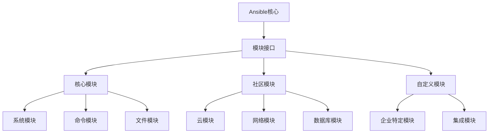
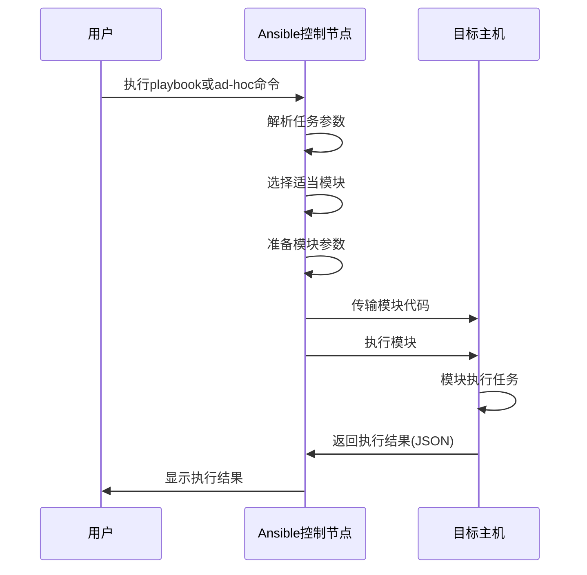
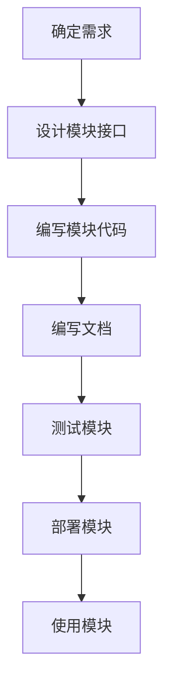

# Ansible模块化设计

模块是Ansible的核心功能单元，本文将详细介绍Ansible的模块化设计理念、模块分类和开发框架，以及如何选择和使用合适的模块完成各种自动化任务，帮助读者理解Ansible的可扩展性设计。

## 1. 模块化设计理念

Ansible的模块化设计是其成功的关键因素之一，它使Ansible能够保持核心简洁的同时，通过丰富的模块生态系统提供强大的功能。

### 1.1 设计原则

Ansible的模块化设计遵循以下核心原则：

1. **单一职责原则**：每个模块专注于完成一项特定任务，如管理用户、安装软件包或配置服务。

2. **幂等性**：模块设计确保多次执行相同操作产生相同结果，避免重复执行导致的问题。

3. **声明式接口**：用户描述期望的状态，而不是执行的步骤，模块负责实现状态转换。

4. **可扩展性**：允许用户轻松创建自定义模块，扩展Ansible的功能。

5. **跨平台兼容**：模块能够在不同操作系统和环境中工作，处理平台差异。

### 1.2 模块与核心分离

Ansible采用了模块与核心分离的架构：



这种分离带来了多项优势：

1. **核心简洁**：Ansible核心保持轻量级和高效
2. **独立开发**：模块可以独立于核心开发和发布
3. **技术隔离**：模块的实现细节对用户透明
4. **灵活部署**：可以选择性地安装所需模块
5. **社区贡献**：降低了社区贡献的门槛

### 1.3 模块执行流程

Ansible模块的执行遵循以下流程：



这个流程确保了：

1. 模块代码在目标主机上执行，而不是控制节点
2. 模块接收结构化的参数并返回结构化的结果
3. 执行过程对用户透明，提供一致的体验

## 2. 模块分类与组织

Ansible拥有丰富的模块生态系统，这些模块按功能和来源进行分类和组织。

### 2.1 按功能分类

Ansible模块按功能可分为以下主要类别：

#### 2.1.1 系统模块

系统模块用于管理操作系统级别的资源：

- **用户和组管理**：`user`, `group`
- **服务管理**：`service`, `systemd`
- **包管理**：`apt`, `yum`, `dnf`, `package`
- **系统信息**：`setup`, `gather_facts`

示例：使用`user`模块创建用户

```yaml
- name: 创建用户
  user:
    name: ansible
    state: present
    groups: sudo
    shell: /bin/bash
    create_home: yes
    comment: "Ansible自动化用户"
```

#### 2.1.2 命令模块

命令模块用于执行命令和脚本：

- **命令执行**：`command`, `shell`, `raw`
- **脚本执行**：`script`
- **异步执行**：`async_status`

示例：使用`shell`模块执行命令

```yaml
- name: 查找大文件
  shell: find /var -type f -size +100M
  register: large_files
  
- name: 显示结果
  debug:
    var: large_files.stdout_lines
```

#### 2.1.3 文件模块

文件模块用于管理文件和目录：

- **文件操作**：`file`, `copy`, `fetch`
- **内容管理**：`lineinfile`, `blockinfile`
- **模板渲染**：`template`
- **归档管理**：`unarchive`, `archive`

示例：使用`template`模块生成配置文件

```yaml
- name: 配置Nginx
  template:
    src: nginx.conf.j2
    dest: /etc/nginx/nginx.conf
    owner: root
    group: root
    mode: '0644'
    backup: yes
  notify: restart nginx
```

#### 2.1.4 数据库模块

数据库模块用于管理各种数据库系统：

- **MySQL/MariaDB**：`mysql_db`, `mysql_user`
- **PostgreSQL**：`postgresql_db`, `postgresql_user`
- **MongoDB**：`mongodb_user`
- **Redis**：`redis`

示例：使用`mysql_db`模块创建数据库

```yaml
- name: 创建MySQL数据库
  mysql_db:
    name: webapp
    state: present
    login_user: root
    login_password: "{{ mysql_root_password }}"
    encoding: utf8mb4
    collation: utf8mb4_unicode_ci
```

#### 2.1.5 云模块

云模块用于管理各种云服务提供商的资源：

- **AWS**：`ec2`, `s3`, `route53`
- **Azure**：`azure_rm_virtualmachine`, `azure_rm_networkinterface`
- **Google Cloud**：`gcp_compute_instance`
- **阿里云**：`ali_instance`

示例：使用`ec2`模块创建EC2实例

```yaml
- name: 启动EC2实例
  ec2:
    key_name: my_key
    instance_type: t2.micro
    image: ami-123456
    wait: yes
    group: webserver
    count: 1
    vpc_subnet_id: subnet-29e63245
    assign_public_ip: yes
    region: us-east-1
    tags:
      Name: web-server
      Environment: production
```

#### 2.1.6 网络模块

网络模块用于配置网络设备：

- **Cisco IOS**：`ios_command`, `ios_config`
- **Juniper JUNOS**：`junos_command`, `junos_config`
- **Arista EOS**：`eos_command`, `eos_config`
- **通用网络**：`net_command`, `net_config`

示例：使用`ios_config`模块配置Cisco设备

```yaml
- name: 配置接口描述
  ios_config:
    lines:
      - description Configured by Ansible
    parents: interface GigabitEthernet0/1
```

#### 2.1.7 容器和虚拟化模块

用于管理容器和虚拟化平台：

- **Docker**：`docker_container`, `docker_image`
- **Kubernetes**：`k8s`, `k8s_info`
- **VMware**：`vmware_guest`, `vmware_cluster`
- **Podman**：`podman_container`, `podman_image`

示例：使用`docker_container`模块运行容器

```yaml
- name: 运行Nginx容器
  docker_container:
    name: webapp
    image: nginx:latest
    state: started
    ports:
      - "80:80"
    volumes:
      - /data/www:/usr/share/nginx/html:ro
    restart_policy: always
```

### 2.2 按来源分类

Ansible模块也可以按照来源进行分类：

#### 2.2.1 核心模块

核心模块是Ansible官方维护的模块，包含在Ansible基本安装中：

- 基本系统操作模块
- 文件管理模块
- 命令执行模块
- 包管理模块

这些模块经过严格测试，提供最基本的自动化功能。

#### 2.2.2 集合模块

Ansible 2.10之后，大多数模块被组织为集合(Collections)，这是一种打包和分发Ansible内容的方式：

```
ansible.builtin    # 内置集合
ansible.posix      # POSIX系统集合
community.general  # 通用社区集合
community.mysql    # MySQL社区集合
cisco.ios          # Cisco IOS集合
```

安装集合示例：

```bash
ansible-galaxy collection install community.mysql
```

使用集合中的模块：

```yaml
- name: 创建MySQL用户
  community.mysql.mysql_user:
    name: webapp
    password: secret
    priv: 'webapp.*:ALL'
    state: present
```

#### 2.2.3 自定义模块

用户可以创建自定义模块来扩展Ansible功能：

- 企业特定的模块
- 集成内部系统的模块
- 特殊用例的模块

自定义模块可以放置在以下位置：

- `./library/` - 相对于playbook目录
- `~/.ansible/plugins/modules/` - 用户级别
- `/usr/share/ansible/plugins/modules/` - 系统级别

### 2.3 模块组织结构

Ansible 2.10之后的模块组织结构：

```
ansible-collections/
├── ansible/
│   ├── builtin/        # 内置模块
│   └── posix/          # POSIX模块
├── community/
│   ├── general/        # 通用社区模块
│   ├── mysql/          # MySQL模块
│   └── postgresql/     # PostgreSQL模块
├── cisco/
│   ├── ios/            # Cisco IOS模块
│   └── nxos/           # Cisco NXOS模块
└── ...
```

每个集合包含：

- 模块(modules)
- 角色(roles)
- 插件(plugins)
- 文档(docs)

## 3. 模块开发框架

Ansible提供了强大的模块开发框架，使开发者能够轻松创建自定义模块。

### 3.1 模块开发基础

#### 3.1.1 模块结构

一个典型的Ansible模块包含以下部分：

1. **文档字符串**：描述模块功能、参数和示例
2. **参数定义**：定义模块接受的参数及其验证规则
3. **主要逻辑**：实现模块的核心功能
4. **结果返回**：以JSON格式返回执行结果

基本模块结构示例：

```python
#!/usr/bin/python

DOCUMENTATION = '''
---
module: my_module
short_description: 这是我的自定义模块
description:
    - 这个模块执行特定的任务
    - 提供了某些功能
options:
    name:
        description: 资源名称
        required: true
        type: str
    state:
        description: 期望的状态
        choices: [ present, absent ]
        default: present
        type: str
'''

EXAMPLES = '''
# 创建资源
- name: 创建新资源
  my_module:
    name: example
    state: present

# 删除资源
- name: 删除资源
  my_module:
    name: example
    state: absent
'''

RETURN = '''
original_message:
    description: 传入的参数
    type: str
    returned: always
    sample: 'hello world'
message:
    description: 操作结果
    type: str
    returned: always
    sample: 'resource created successfully'
'''

from ansible.module_utils.basic import AnsibleModule

def run_module():
    # 定义参数
    module_args = dict(
        name=dict(type='str', required=True),
        state=dict(type='str', default='present', choices=['present', 'absent']),
    )

    # 创建模块实例
    module = AnsibleModule(
        argument_spec=module_args,
        supports_check_mode=True
    )

    # 获取参数
    name = module.params['name']
    state = module.params['state']

    # 初始化结果
    result = dict(
        changed=False,
        original_message=f"name: {name}, state: {state}",
        message=''
    )

    # 检查模式
    if module.check_mode:
        module.exit_json(**result)

    # 执行实际操作
    if state == 'present':
        # 创建资源的逻辑
        result['changed'] = True
        result['message'] = f"Resource {name} created"
    else:
        # 删除资源的逻辑
        result['changed'] = True
        result['message'] = f"Resource {name} deleted"

    # 返回结果
    module.exit_json(**result)

def main():
    run_module()

if __name__ == '__main__':
    main()
```

#### 3.1.2 AnsibleModule类

`AnsibleModule`是模块开发的核心类，提供了：

1. **参数验证**：类型检查、必需参数、互斥参数等
2. **结果处理**：成功和失败结果的标准化返回
3. **检查模式**：支持`--check`模式的无修改运行
4. **临时文件管理**：创建和清理临时文件
5. **运行命令**：安全地执行外部命令

常用的`AnsibleModule`方法：

- `module.params`：获取模块参数
- `module.exit_json()`：成功退出
- `module.fail_json()`：失败退出
- `module.run_command()`：执行命令
- `module.get_bin_path()`：查找可执行文件路径

### 3.2 参数处理与验证

Ansible模块开发框架提供了强大的参数处理和验证功能：

#### 3.2.1 参数规范

参数规范定义了模块接受的参数及其验证规则：

```python
module_args = dict(
    # 基本参数
    name=dict(type='str', required=True),
    state=dict(type='str', default='present', choices=['present', 'absent']),
    
    # 数值参数
    timeout=dict(type='int', default=30),
    ratio=dict(type='float', default=0.5),
    
    # 布尔参数
    enabled=dict(type='bool', default=True),
    
    # 列表和字典
    users=dict(type='list', elements='str'),
    options=dict(type='dict'),
    
    # 路径参数
    path=dict(type='path', required=True),
    
    # 互斥参数组
    mutually_exclusive=[
        ['file', 'content'],
    ],
    
    # 必需参数组
    required_together=[
        ['username', 'password'],
    ],
    
    # 条件必需参数
    required_if=[
        ['state', 'present', ['path']],
    ]
)
```

#### 3.2.2 参数验证示例

```python
def run_module():
    module_args = dict(
        database=dict(type='str', required=True),
        table=dict(type='str', required=True),
        user=dict(type='str', required=True),
        password=dict(type='str', required=True, no_log=True),
        host=dict(type='str', default='localhost'),
        port=dict(type='int', default=3306),
        state=dict(type='str', default='present', choices=['present', 'absent']),
        columns=dict(
            type='list',
            elements='dict',
            options=dict(
                name=dict(type='str', required=True),
                type=dict(type='str', required=True),
                nullable=dict(type='bool', default=True),
                primary=dict(type='bool', default=False)
            )
        )
    )
    
    module = AnsibleModule(
        argument_spec=module_args,
        supports_check_mode=True,
        required_if=[
            ['state', 'present', ['columns']],
        ]
    )
    
    # 模块逻辑...
```

### 3.3 返回值处理

Ansible模块通过标准化的JSON格式返回执行结果：

#### 3.3.1 成功返回

```python
# 成功返回
module.exit_json(
    changed=True,                      # 是否改变了系统状态
    message="操作成功完成",             # 人类可读的消息
    resource_id=123,                   # 自定义返回值
    details={                          # 复杂结构
        "created_at": "2023-01-01",
        "status": "active"
    }
)
```

#### 3.3.2 失败返回

```python
# 失败返回
module.fail_json(
    msg="操作失败：无法连接数据库",     # 错误消息
    rc=1,                             # 返回码
    cmd="mysql -u root -p",           # 执行的命令
    stderr="Access denied"            # 标准错误输出
)
```

#### 3.3.3 警告信息

```python
# 发送警告
module.warn("此操作可能导致性能问题")

# 继续执行
module.exit_json(changed=True, message="操作完成，但有警告")
```

### 3.4 模块测试框架

Ansible提供了测试框架来验证模块功能：

#### 3.4.1 单元测试

使用Python的`unittest`或`pytest`框架测试模块：

```python
import unittest
from unittest.mock import patch
from ansible.module_utils import basic
from ansible.module_utils.common.text.converters import to_bytes
import my_module

def set_module_args(args):
    """准备模块参数"""
    args = json.dumps({'ANSIBLE_MODULE_ARGS': args})
    basic._ANSIBLE_ARGS = to_bytes(args)

class TestMyModule(unittest.TestCase):
    def test_module_present(self):
        """测试创建资源"""
        set_module_args({
            'name': 'test-resource',
            'state': 'present'
        })
        
        with patch.object(basic.AnsibleModule, 'exit_json') as exit_mock:
            my_module.main()
        
        exit_mock.assert_called_once_with(
            changed=True,
            message='Resource test-resource created',
            original_message='name: test-resource, state: present'
        )
    
    def test_module_absent(self):
        """测试删除资源"""
        set_module_args({
            'name': 'test-resource',
            'state': 'absent'
        })
        
        with patch.object(basic.AnsibleModule, 'exit_json') as exit_mock:
            my_module.main()
        
        exit_mock.assert_called_once_with(
            changed=True,
            message='Resource test-resource deleted',
            original_message='name: test-resource, state: absent'
        )
```

#### 3.4.2 集成测试

使用Ansible的`ansible-test`工具进行集成测试：

```bash
# 运行集成测试
ansible-test integration my_module

# 运行单元测试
ansible-test units my_module
```

集成测试目录结构：

```
tests/
├── integration/
│   ├── targets/
│   │   └── my_module/
│   │       ├── tasks/
│   │       │   └── main.yml
│   │       └── meta/
│   │           └── main.yml
└── unit/
    └── plugins/
        └── modules/
            └── test_my_module.py
```

## 4. 常用模块详解

了解常用模块的功能和用法对于高效使用Ansible至关重要。

### 4.1 系统管理模块

#### 4.1.1 user模块

`user`模块用于管理系统用户账户：

```yaml
- name: 创建用户
  user:
    name: webadmin
    uid: 1040
    group: www-data
    groups: sudo,developers
    shell: /bin/bash
    password: "{{ 'password' | password_hash('sha512') }}"
    create_home: yes
    home: /home/webadmin
    comment: "Web Application Admin"
    state: present
```

高级用法：

```yaml
- name: 创建系统用户
  user:
    name: app
    system: yes
    shell: /sbin/nologin
    
- name: 设置SSH密钥
  user:
    name: devops
    generate_ssh_key: yes
    ssh_key_bits: 4096
    ssh_key_comment: "ansible-generated"
```

#### 4.1.2 package模块

`package`模块是一个通用包管理模块，会根据目标系统选择合适的包管理器：

```yaml
- name: 安装软件包
  package:
    name: nginx
    state: present
    
- name: 安装多个软件包
  package:
    name:
      - httpd
      - php
      - php-mysql
    state: latest
```

特定包管理器模块：

```yaml
# Debian/Ubuntu
- name: 安装软件包(apt)
  apt:
    name: nginx
    state: present
    update_cache: yes
    cache_valid_time: 3600

# RHEL/CentOS
- name: 安装软件包(yum)
  yum:
    name: nginx
    state: present
    enablerepo: epel
```

#### 4.1.3 service模块

`service`模块用于管理系统服务：

```yaml
- name: 确保服务运行
  service:
    name: nginx
    state: started
    enabled: yes
    
- name: 重启服务
  service:
    name: httpd
    state: restarted
```

使用`systemd`模块的高级功能：

```yaml
- name: 管理systemd服务
  systemd:
    name: nginx
    state: started
    enabled: yes
    daemon_reload: yes
```

### 4.2 文件操作模块

#### 4.2.1 file模块

`file`模块用于管理文件、目录和符号链接：

```yaml
- name: 创建目录
  file:
    path: /var/www/html
    state: directory
    mode: '0755'
    owner: www-data
    group: www-data
    
- name: 创建符号链接
  file:
    src: /var/www/app/current
    dest: /var/www/html
    state: link
    
- name: 删除文件
  file:
    path: /tmp/old_file
    state: absent
```

递归设置权限：

```yaml
- name: 递归设置目录权限
  file:
    path: /var/www/app
    state: directory
    mode: '0755'
    owner: www-data
    group: www-data
    recurse: yes
```

#### 4.2.2 copy模块

`copy`模块用于将文件从控制节点复制到目标主机：

```yaml
- name: 复制配置文件
  copy:
    src: files/nginx.conf
    dest: /etc/nginx/nginx.conf
    owner: root
    group: root
    mode: '0644'
    backup: yes
    
- name: 复制内容到文件
  copy:
    content: |
      # 这是一个配置文件
      option1=value1
      option2=value2
    dest: /etc/app/config.ini
    mode: '0600'
```

#### 4.2.3 template模块

`template`模块使用Jinja2模板引擎生成文件：

```yaml
- name: 配置Nginx虚拟主机
  template:
    src: templates/vhost.conf.j2
    dest: /etc/nginx/sites-available/{{ domain }}.conf
    owner: root
    group: root
    mode: '0644'
    validate: 'nginx -t -c %s'
```

模板文件示例(`vhost.conf.j2`)：

```jinja
server {
    listen 80;
    server_name {{ domain }};
    
    root /var/www/{{ domain }}/public;
    index index.html index.php;
    
    access_log /var/log/nginx/{{ domain }}_access.log;
    error_log /var/log/nginx/{{ domain }}_error.log;
    
    
    listen 443 ssl;
    ssl_certificate /etc/letsencrypt/live/{{ domain }}/fullchain.pem;
    ssl_certificate_key /etc/letsencrypt/live/{{ domain }}/privkey.pem;
    
    
    location / {
        try_files $uri $uri/ /index.php?$query_string;
    }
    
    location ~ \.php$ {
        fastcgi_pass unix:/var/run/php/php{{ php_version }}-fpm.sock;
        fastcgi_index index.php;
        fastcgi_param SCRIPT_FILENAME $document_root$fastcgi_script_name;
        include fastcgi_params;
    }
}
```

### 4.3 命令执行模块

#### 4.3.1 command模块

`command`模块用于执行简单命令：

```yaml
- name: 运行命令
  command: hostname -f
  register: hostname_result
  
- name: 显示结果
  debug:
    var: hostname_result.stdout
```

带条件的命令：

```yaml
- name: 检查文件是否存在
  command: ls /path/to/file
  register: file_check
  failed_when: file_check.rc > 1
  changed_when: false
```

#### 4.3.2 shell模块

`shell`模块支持shell特性，如管道、重定向和环境变量：

```yaml
- name: 查找大文件
  shell: find /var/log -type f -size +100M | sort -n
  register: large_files
  
- name: 使用环境变量
  shell: echo $PATH
  environment:
    PATH: /usr/local/bin:{{ ansible_env.PATH }}
```

#### 4.3.3 script模块

`script`模块在远程主机上执行本地脚本：

```yaml
- name: 运行本地脚本
  script: scripts/setup.sh
  args:
    creates: /var/lock/setup.done
```

### 4.4 数据库模块

#### 4.4.1 mysql_db模块

`mysql_db`模块管理MySQL/MariaDB数据库：

```yaml
- name: 创建数据库
  community.mysql.mysql_db:
    name: wordpress
    state: present
    login_user: root
    login_password: "{{ mysql_root_password }}"
    encoding: utf8mb4
    collation: utf8mb4_unicode_ci
    
- name: 导入数据库
  community.mysql.mysql_db:
    name: wordpress
    state: import
    target: /tmp/wordpress.sql
    login_user: root
    login_password: "{{ mysql_root_password }}"
```

#### 4.4.2 postgresql_db模块

`postgresql_db`模块管理PostgreSQL数据库：

```yaml
- name: 创建PostgreSQL数据库
  community.postgresql.postgresql_db:
    name: app_db
    encoding: UTF-8
    lc_collate: en_US.UTF-8
    lc_ctype: en_US.UTF-8
    template: template0
    login_user: postgres
    login_password: "{{ postgres_password }}"
    state: present
```

### 4.5 云服务模块

#### 4.5.1 ec2模块

`ec2`模块管理AWS EC2实例：

```yaml
- name: 启动EC2实例
  amazon.aws.ec2:
    key_name: my_key
    instance_type: t2.micro
    image: ami-123456
    wait: yes
    group: webserver
    count: 1
    vpc_subnet_id: subnet-29e63245
    assign_public_ip: yes
    region: us-east-1
    instance_tags:
      Name: web-server
      Environment: production
  register: ec2
```

#### 4.5.2 azure_rm_virtualmachine模块

`azure_rm_virtualmachine`模块管理Azure虚拟机：

```yaml
- name: 创建Azure虚
让我继续完成关于Ansible模块化设计的内容：

### 4.5 云服务模块（续）

#### 4.5.2 azure_rm_virtualmachine模块

`azure_rm_virtualmachine`模块管理Azure虚拟机：

```yaml
- name: 创建Azure虚拟机
  azure.azcollection.azure_rm_virtualmachine:
    resource_group: myResourceGroup
    name: myVM
    vm_size: Standard_DS1_v2
    admin_username: azureuser
    ssh_password_enabled: false
    ssh_public_keys:
      - path: /home/azureuser/.ssh/authorized_keys
        key_data: "{{ lookup('file', '~/.ssh/id_rsa.pub') }}"
    image:
      offer: CentOS
      publisher: OpenLogic
      sku: '7.5'
      version: latest
```

#### 4.5.3 gcp_compute_instance模块

`gcp_compute_instance`模块管理Google Cloud Platform虚拟机：

```yaml
- name: 创建GCP实例
  google.cloud.gcp_compute_instance:
    name: "test-vm"
    machine_type: "n1-standard-1"
    disks:
      - auto_delete: true
        boot: true
        initialize_params:
          source_image: "projects/debian-cloud/global/images/family/debian-10"
    network_interfaces:
      - network: "{{ network }}"
        access_configs:
          - name: "External NAT"
            nat_ip: "{{ address }}"
            type: "ONE_TO_ONE_NAT"
    zone: "us-central1-a"
    project: "my-project"
    auth_kind: "serviceaccount"
    service_account_file: "/path/to/service-account.json"
    state: present
```

### 4.6 容器和编排模块

#### 4.6.1 docker_container模块

`docker_container`模块管理Docker容器：

```yaml
- name: 运行Docker容器
  community.docker.docker_container:
    name: webapp
    image: nginx:latest
    state: started
    ports:
      - "80:80"
      - "443:443"
    volumes:
      - /data/www:/usr/share/nginx/html:ro
      - /data/certs:/etc/nginx/certs:ro
    env:
      NGINX_HOST: "example.com"
      NGINX_PORT: "80"
    restart_policy: always
    networks:
      - name: frontend
```

#### 4.6.2 k8s模块

`k8s`模块管理Kubernetes资源：

```yaml
- name: 创建Kubernetes部署
  kubernetes.core.k8s:
    state: present
    definition:
      apiVersion: apps/v1
      kind: Deployment
      metadata:
        name: nginx-deployment
        namespace: default
      spec:
        replicas: 3
        selector:
          matchLabels:
            app: nginx
        template:
          metadata:
            labels:
              app: nginx
          spec:
            containers:
            - name: nginx
              image: nginx:1.19
              ports:
              - containerPort: 80
```

也可以使用文件定义资源：

```yaml
- name: 从文件创建Kubernetes资源
  kubernetes.core.k8s:
    state: present
    src: k8s/deployment.yml
```

### 4.7 网络模块

#### 4.7.1 ios_config模块

`ios_config`模块配置Cisco IOS设备：

```yaml
- name: 配置Cisco路由器接口
  cisco.ios.ios_config:
    lines:
      - description WAN Interface
      - ip address 192.168.1.1 255.255.255.0
      - no shutdown
    parents: interface GigabitEthernet0/1
    save_when: modified
```

#### 4.7.2 nxos_config模块

`nxos_config`模块配置Cisco NXOS设备：

```yaml
- name: 配置NXOS VLAN
  cisco.nxos.nxos_config:
    lines:
      - name Engineering
      - state active
    parents: vlan 100
```

#### 4.7.3 junos_config模块

`junos_config`模块配置Juniper JUNOS设备：

```yaml
- name: 配置Juniper路由器
  junipernetworks.junos.junos_config:
    lines:
      - description "Configured by Ansible"
      - family inet address 192.168.100.1/24
    parents: interfaces ge-0/0/0 unit 0
    comment: "配置管理接口"
```

## 5. 模块选择与最佳实践

选择合适的模块并遵循最佳实践对于高效使用Ansible至关重要。

### 5.1 模块选择原则

选择Ansible模块时应考虑以下原则：

#### 5.1.1 特定模块优于通用模块

尽可能使用特定于平台的模块，而不是通用模块：

```yaml
# 推荐：使用特定模块
- name: 安装软件包
  apt:
    name: nginx
    state: present
    
# 不推荐：使用通用模块
- name: 安装软件包
  package:
    name: nginx
    state: present
```

特定模块通常提供更多功能和更好的错误处理。

#### 5.1.2 声明式模块优于命令模块

尽可能使用声明式模块，而不是命令模块：

```yaml
# 推荐：使用声明式模块
- name: 确保用户存在
  user:
    name: webadmin
    state: present
    
# 不推荐：使用命令模块
- name: 确保用户存在
  command: useradd webadmin
  args:
    creates: /home/webadmin
```

声明式模块提供更好的幂等性和错误处理。

#### 5.1.3 内置模块优于自定义脚本

尽可能使用内置模块，而不是自定义脚本：

```yaml
# 推荐：使用内置模块
- name: 创建目录结构
  file:
    path: "{{ item }}"
    state: directory
    mode: '0755'
  loop:
    - /var/www/app
    - /var/www/app/public
    - /var/www/app/logs
    
# 不推荐：使用自定义脚本
- name: 创建目录结构
  script: scripts/create_dirs.sh
```

内置模块通常更可靠，并提供更好的跨平台兼容性。

### 5.2 模块使用最佳实践

#### 5.2.1 利用模块的幂等性

Ansible模块设计为幂等的，多次执行相同的任务应产生相同的结果：

```yaml
# 幂等任务示例
- name: 确保服务配置正确
  template:
    src: nginx.conf.j2
    dest: /etc/nginx/nginx.conf
  notify: restart nginx

- name: 确保服务运行
  service:
    name: nginx
    state: started
    enabled: yes
```

这些任务可以安全地多次执行，只有在配置实际更改时才会重启服务。

#### 5.2.2 使用检查模式

使用Ansible的检查模式(`--check`)来预览任务执行效果：

```bash
# 检查模式运行
ansible-playbook site.yml --check
```

支持检查模式的模块会模拟执行，而不实际更改系统。

在模块中支持检查模式：

```python
def run_module():
    module = AnsibleModule(
        argument_spec=module_args,
        supports_check_mode=True  # 支持检查模式
    )
    
    # 检查模式处理
    if module.check_mode:
        module.exit_json(changed=True, msg="Would have created resource")
```

#### 5.2.3 注册和使用返回值

利用模块的返回值进行条件处理：

```yaml
- name: 检查服务状态
  command: systemctl status nginx
  register: service_status
  failed_when: false
  changed_when: false
  
- name: 启动服务(如果未运行)
  service:
    name: nginx
    state: started
  when: service_status.rc != 0
```

#### 5.2.4 处理敏感数据

使用`no_log`参数隐藏敏感信息：

```yaml
- name: 设置数据库密码
  mysql_user:
    name: webapp
    password: "{{ db_password }}"
    priv: 'webapp.*:ALL'
    state: present
  no_log: true  # 不记录任务输出
```

### 5.3 常见模块组合模式

某些自动化任务通常需要多个模块协同工作：

#### 5.3.1 安装和配置服务

```yaml
- name: 安装Nginx
  apt:
    name: nginx
    state: present
    update_cache: yes
  
- name: 配置Nginx
  template:
    src: nginx.conf.j2
    dest: /etc/nginx/nginx.conf
    owner: root
    group: root
    mode: '0644'
    validate: 'nginx -t -c %s'
  notify: restart nginx
  
- name: 确保Nginx服务运行
  service:
    name: nginx
    state: started
    enabled: yes
```

#### 5.3.2 数据库配置和用户管理

```yaml
- name: 安装MySQL
  apt:
    name:
      - mysql-server
      - python3-mysqldb  # Ansible模块依赖
    state: present
  
- name: 确保MySQL服务运行
  service:
    name: mysql
    state: started
    enabled: yes
  
- name: 创建数据库
  mysql_db:
    name: webapp
    state: present
    login_unix_socket: /var/run/mysqld/mysqld.sock
  
- name: 创建数据库用户
  mysql_user:
    name: webapp_user
    password: "{{ db_password }}"
    priv: 'webapp.*:ALL'
    host: localhost
    state: present
    login_unix_socket: /var/run/mysqld/mysqld.sock
```

#### 5.3.3 部署Web应用

```yaml
- name: 创建应用目录
  file:
    path: /var/www/app
    state: directory
    owner: www-data
    group: www-data
    mode: '0755'
  
- name: 克隆应用代码
  git:
    repo: https://github.com/example/webapp.git
    dest: /var/www/app
    version: master
  
- name: 安装依赖
  pip:
    requirements: /var/www/app/requirements.txt
    virtualenv: /var/www/app/venv
  
- name: 配置应用
  template:
    src: config.py.j2
    dest: /var/www/app/config.py
    owner: www-data
    group: www-data
    mode: '0644'
  
- name: 配置应用服务
  template:
    src: webapp.service.j2
    dest: /etc/systemd/system/webapp.service
  
- name: 启动应用服务
  systemd:
    name: webapp
    state: started
    enabled: yes
    daemon_reload: yes
```

## 6. 自定义模块开发实践

开发自定义模块可以扩展Ansible的功能，满足特定需求。

### 6.1 自定义模块开发流程

开发Ansible自定义模块的一般流程：



#### 6.1.1 需求分析

确定模块需要解决的问题和功能需求：

1. 模块的目标功能
2. 输入参数和返回值
3. 错误处理策略
4. 幂等性设计

#### 6.1.2 模块接口设计

设计模块的参数和返回值：

```python
# 参数设计
module_args = dict(
    name=dict(type='str', required=True),
    type=dict(type='str', choices=['type1', 'type2'], default='type1'),
    properties=dict(type='dict', default={}),
    state=dict(type='str', choices=['present', 'absent'], default='present'),
)

# 返回值设计
return_values = dict(
    changed=True,
    resource_id='12345',
    properties={
        'key1': 'value1',
        'key2': 'value2'
    }
)
```

### 6.2 实用自定义模块示例

#### 6.2.1 REST API模块

与REST API交互的自定义模块：

```python
#!/usr/bin/python

DOCUMENTATION = '''
---
module: rest_resource
short_description: 管理REST API资源
description:
    - 通过REST API创建、更新或删除资源
options:
    url:
        description: API端点URL
        required: true
        type: str
    username:
        description: API用户名
        required: false
        type: str
    password:
        description: API密码
        required: false
        type: str
        no_log: true
    token:
        description: API令牌
        required: false
        type: str
        no_log: true
    resource_id:
        description: 资源ID(更新或删除时需要)
        required: false
        type: str
    data:
        description: 资源数据(创建或更新时需要)
        required: false
        type: dict
    state:
        description: 期望的状态
        choices: [ present, absent ]
        default: present
        type: str
'''

EXAMPLES = '''
# 创建资源
- name: 创建新资源
  rest_resource:
    url: https://api.example.com/resources
    token: "{{ api_token }}"
    data:
      name: "测试资源"
      type: "test"
    state: present

# 更新资源
- name: 更新资源
  rest_resource:
    url: https://api.example.com/resources
    token: "{{ api_token }}"
    resource_id: "12345"
    data:
      name: "更新的资源"
      type: "test"
    state: present

# 删除资源
- name: 删除资源
  rest_resource:
    url: https://api.example.com/resources
    token: "{{ api_token }}"
    resource_id: "12345"
    state: absent
'''

RETURN = '''
resource_id:
    description: 资源ID
    type: str
    returned: success
    sample: "12345"
response:
    description: API响应
    type: dict
    returned: success
status_code:
    description: HTTP状态码
    type: int
    returned: always
    sample: 200
'''

import json
import urllib.request
import urllib.error
from ansible.module_utils.basic import AnsibleModule

def main():
    module_args = dict(
        url=dict(type='str', required=True),
        username=dict(type='str', required=False),
        password=dict(type='str', required=False, no_log=True),
        token=dict(type='str', required=False, no_log=True),
        resource_id=dict(type='str', required=False),
        data=dict(type='dict', required=False),
        state=dict(type='str', default='present', choices=['present', 'absent']),
    )

    result = dict(
        changed=False,
        resource_id='',
        response={},
        status_code=0
    )

    module = AnsibleModule(
        argument_spec=module_args,
        supports_check_mode=True,
        required_one_of=[['username', 'token']],
        required_if=[
            ['state', 'present', ['data']],
            ['state', 'absent', ['resource_id']]
        ]
    )

    # 参数
    url = module.params['url']
    username = module.params['username']
    password = module.params['password']
    token = module.params['token']
    resource_id = module.params['resource_id']
    data = module.params['data']
    state = module.params['state']

    # 构建请求头
    headers = {
        'Content-Type': 'application/json',
        'Accept': 'application/json'
    }
    
    if token:
        headers['Authorization'] = f'Bearer {token}'
    elif username and password:
        import base64
        auth = base64.b64encode(f'{username}:{password}'.encode()).decode()
        headers['Authorization'] = f'Basic {auth}'

    # 检查模式
    if module.check_mode:
        module.exit_json(**result)

    try:
        if state == 'present':
            if resource_id:
                # 更新资源
                full_url = f"{url}/{resource_id}"
                data_json = json.dumps(data).encode('utf-8')
                req = urllib.request.Request(full_url, data=data_json, headers=headers, method='PUT')
                result['changed'] = True
            else:
                # 创建资源
                data_json = json.dumps(data).encode('utf-8')
                req = urllib.request.Request(url, data=data_json, headers=headers, method='POST')
                result['changed'] = True
        else:
            # 删除资源
            full_url = f"{url}/{resource_id}"
            req = urllib.request.Request(full_url, headers=headers, method='DELETE')
            result['changed'] = True

        # 执行请求
        response = urllib.request.urlopen(req)
        result['status_code'] = response.status
        
        # 解析响应
        response_data = response.read().decode('utf-8')
        if response_data:
            result['response'] = json.loads(response_data)
            if 'id' in result['response']:
                result['resource_id'] = result['response']['id']
            elif resource_id:
                result['resource_id'] = resource_id

    except urllib.error.HTTPError as e:
        error_message = e.read().decode('utf-8')
        module.fail_json(msg=f"HTTP错误: {e.code} - {error_message}", status_code=e.code)
    except urllib.error.URLError as e:
        module.fail_json(msg=f"URL错误: {e.reason}")
    except json.JSONDecodeError:
        module.fail_json(msg="无法解析JSON响应")
    except Exception as e:
        module.fail_json(msg=f"发生错误: {str(e)}")

    module.exit_json(**result)

if __name__ == '__main__':
    main()
```

使用自定义REST模块：

```yaml
- name: 创建API资源
  rest_resource:
    url: https://api.example.com/resources
    token: "{{ api_token }}"
    data:
      name: "测试资源"
      description: "这是一个测试资源"
      properties:
        key1: value1
        key2: value2
    state: present
  register: resource_result

- name: 显示资源ID
  debug:
    var: resource_result.resource_id
```

#### 6.2.2 配置文件解析模块

解析和修改配置文件的自定义模块：

```python
#!/usr/bin/python

DOCUMENTATION = '''
---
module: config_file
short_description: 管理配置文件中的键值对
description:
    - 读取、添加、修改或删除配置文件中的键值对
options:
    path:
        description: 配置文件路径
        required: true
        type: path
    section:
        description: 配置文件中的节(INI格式)
        required: false
        type: str
    key:
        description: 要管理的键
        required: true
        type: str
    value:
        description: 键的值(state=present时需要)
        required: false
        type: str
    state:
        description: 期望的状态
        choices: [ present, absent ]
        default: present
        type: str
    backup:
        description: 修改前是否备份文件
        default: no
        type: bool
    format:
        description: 配置文件格式
        choices: [ ini, properties, json, yaml ]
        default: ini
        type: str
'''

EXAMPLES = '''
# 设置INI配置
- name: 设置数据库连接
  config_file:
    path: /etc/app/config.ini
    section: database
    key: host
    value: db.example.com
    format: ini

# 删除配置项
- name: 删除配置项
  config_file:
    path: /etc/app/config.properties
    key: debug.mode
    state: absent
    format: properties

# 修改JSON配置
- name: 修改JSON配置
  config_file:
    path: /etc/app/config.json
    key: logging.level
    value: INFO
    format: json
'''

RETURN = '''
changed:
    description: 是否修改了文件
    type: bool
    returned: always
backup_file:
    description: 备份文件路径(如果创建了备份)
    type: str
    returned: changed and backup=yes
diff:
    description: 文件变更差异
    type: dict
    returned: changed
    contains:
        before:
            description: 修改前的内容
            type: str
        after:
            description: 修改后的内容
            type: str
'''

import os
import json
import configparser
import yaml
from ansible.module_utils.basic import AnsibleModule

def main():
    module_args = dict(
        path=dict(type='path', required=True),
        section=dict(type='str', required=False),
        key=dict(type='str', required=True),
        value=dict(type='str', required=False),
        state=dict(type='str', default='present', choices=['present', 'absent']),
        backup=dict(type='bool', default=False),
        format=dict(type='str', default='ini', choices=['ini', 'properties', 'json', 'yaml']),
    )

    result = dict(
        changed=False,
        diff=dict(
            before='',
            after=''
        )
    )

    module = AnsibleModule(
        argument_spec=module_args,
        supports_check_mode=True,
        required_if=[
            ['state', 'present', ['value']]
        ]
    )

    path = module.params['path']
    section = module.params['section']
    key = module.params['key']
    value = module.params['value']
    state = module.params['state']
    backup = module.params['backup']
    format_type = module.params['format']

    # 检查文件是否存在
    file_exists = os.path.isfile(path)
    
    # 读取原始内容(用于diff)
    if file_exists:
        with open(path, 'r') as f:
            result['diff']['before'] = f.read()
    else:
        result['diff']['before'] = ''

    # 根据格式类型处理配置
    if format_type == 'ini':
        changed = handle_ini(module, path, section, key, value, state, file_exists)
    elif format_type == 'properties':
        changed = handle_properties(module, path, key, value, state, file_exists)
    elif format_type == 'json':
        changed = handle_json(module, path, key, value, state, file_exists)
    elif format_type == 'yaml':
        changed = handle_yaml(module, path, key, value, state, file_exists)
    
    # 读取修改后的内容(用于diff)
    if os.path.isfile(path):
        with open(path, 'r') as f:
            result['diff']['after'] = f.read()
    else:
        result['diff']['after'] = ''
    
    # 如果有变更且需要备份
    if changed and backup and not module.check_mode and file_exists:
        backup_file = module.backup_local(path)
        result['backup_file'] = backup_file
    
    result['changed'] = changed
    module.exit_json(**result)

def handle_ini(module, path, section, key, value, state, file_exists):
    """处理INI格式配置文件"""
    if not section:
        module.fail_json(msg="INI格式需要提供section参数")
    
    config = configparser.ConfigParser()
    
    if file_exists:
        config.read(path)
    
    # 检查当前状态
    current_value = None
    if section in config and key in config[section]:
        current_value = config[section][key]
    
    # 确定是否需要变更
    changed = False
    
    if state == 'present':
        if not section in config:
            config[section] = {}
        
        if current_value != value:
            config[section][key] = value
            changed = True
    else:  # state == 'absent'
        if section in config and key in config[section]:
            del config[section][key]
            # 如果节为空，删除节
            if not config[section]:
                del config[section]
            changed = True
    
    # 写入文件(如果不是检查模式且有变更)
    if changed and not module.check_mode:
        with open(path, 'w') as f:
            config.write(f)
    
    return changed

def handle_properties(module, path, key, value, state, file_exists):
    """处理Properties格式配置文件"""
    properties = {}
    
    if file_exists:
        with open(path, 'r') as f:
            for line in f:
                line = line.strip()
                if not line or line.startswith('#'):
                    continue
                if '=' in line:
                    k, v = line.split('=', 1)
                    properties[k.strip()] = v.strip()
    
    # 检查当前状态
    current_value = properties.get(key)
    
    # 确定是否需要变更
    changed = False
    
    if state == 'present':
        if current_value != value:
            properties[key] = value
            changed = True
    else:  # state == 'absent'
        if key in properties:
            del properties[key]
            changed = True
    
    # 写入文件(如果不是检查模式且有变更)
    if changed and not module.check_mode:
        with open(path, 'w') as f:
            for k, v in properties.items():
                f.write(f"{k}={v}\n")
    
    return changed

def handle_json(module, path, key, value, state, file_exists):
    """处理JSON格式配置文件"""
    data = {}
    
    if file_exists:
        try:
            with open(path, 'r') as f:
                data = json.load(f)
        except json.JSONDecodeError:
            module.fail_json(msg=f"无法解析JSON文件: {path}")
    
    # 处理嵌套键(如logging.level)
    keys = key.split('.')
    
    # 获取当前值
    current_data = data
    for i, k in enumerate(keys[:-1]):
        if k not in current_data:
            if state == 'present':
                current_data[k] = {}
            else:
                # 键路径不存在，无需删除
                return False
        current_data = current_data[k]
    
    last_key = keys[-1]
    
    # 确定是否需要变更
    changed = False
    
    if state == 'present':
        if last_key not in current_data or current_data[last_key] != value:
            current_data[last_key] = value
            changed = True
    else:  # state == 'absent'
        if last_key in current_data:
            del current_data[last_key]
            changed = True
    
    # 写入文件(如果不是检查模式且有变更)
    if changed and not module.check_mode:
        with open(path, 'w') as f:
            json.dump(data, f, indent=2)
    
    return changed

def handle_yaml(module, path, key, value, state, file_exists):
    """处理YAML格式配置文件"""
    data = {}
    
    if file_exists:
        try:
            with open(path, 'r') as f:
                data = yaml.safe_load(f) or {}
        except yaml.YAMLError:
            module.fail_json(msg=f"无法解析YAML文件: {path}")
    
    # 处理嵌套键(如logging.level)
    keys = key.split('.')
    
    # 获取当前值
    current_data = data
    for i, k in enumerate(keys[:-1]):
        if k not in current_data:
            if state == 'present':
                current_data[k] = {}
            else:
                # 键路径不存在，无需删除
                return False
        current_data = current_data[k]
    
    last_key = keys[-1]
    
    # 确定是否需要变更
    changed = False
    
    if state == 'present':
        if last_key not in current_data or current_data[last_key] != value:
            current_data[last_key] = value
            changed = True
    else:  # state == 'absent'
        if last_key in current_data:
            del current_data[last_key]
            changed = True
    
    # 写入文件(如果不是检查模式且有变更)
    if changed and not
让我继续完成关于Ansible模块化设计的内容：

### 6.2.2 配置文件解析模块（续）

```python
    # 写入文件(如果不是检查模式且有变更)
    if changed and not module.check_mode:
        with open(path, 'w') as f:
            yaml.safe_dump(data, f, default_flow_style=False)
    
    return changed

if __name__ == '__main__':
    main()
```

使用配置文件解析模块：

```yaml
- name: 设置应用配置
  config_file:
    path: /etc/app/config.yaml
    key: database.connection.host
    value: db.example.com
    format: yaml
  register: config_result

- name: 显示配置变更
  debug:
    var: config_result.diff
```

### 6.3 模块测试与调试

开发自定义模块时，测试和调试是确保模块质量的关键步骤。

#### 6.3.1 本地测试

在开发过程中，可以直接从命令行测试模块：

```bash
# 使用Python解释器直接运行模块
python -m library.my_module '{"ANSIBLE_MODULE_ARGS": {"name": "test", "state": "present"}}'

# 使用ansible命令测试模块
ansible localhost -m my_module -a "name=test state=present" -vvv
```

#### 6.3.2 调试技巧

调试Ansible模块的常用技巧：

1. **使用print语句**：在模块中添加print语句（输出到stderr）

```python
import sys
print("调试信息", file=sys.stderr)
```

2. **使用AnsibleModule的debug方法**：

```python
module.debug("这是一条调试消息")
```

3. **记录到文件**：

```python
with open('/tmp/ansible_debug.log', 'a') as f:
    f.write(f"参数: {module.params}\n")
```

4. **使用远程调试器**：

```python
import ptvsd
ptvsd.enable_attach(address=('0.0.0.0', 5678))
ptvsd.wait_for_attach()  # 暂停执行直到调试器连接
```

#### 6.3.3 单元测试

为模块编写单元测试：

```python
import unittest
from unittest.mock import patch
import json
from ansible.module_utils import basic
from ansible.module_utils.common.text.converters import to_bytes
import my_module

def set_module_args(args):
    """准备模块参数"""
    args = json.dumps({'ANSIBLE_MODULE_ARGS': args})
    basic._ANSIBLE_ARGS = to_bytes(args)

class TestMyModule(unittest.TestCase):
    def setUp(self):
        self.mock_run_command = patch('ansible.module_utils.basic.AnsibleModule.run_command')
        self.mock_run_command_start = self.mock_run_command.start()
        self.mock_run_command_start.return_value = (0, 'output', '')
        self.addCleanup(self.mock_run_command.stop)
    
    def test_module_present(self):
        """测试创建资源"""
        set_module_args({
            'name': 'test-resource',
            'state': 'present'
        })
        
        with patch.object(basic.AnsibleModule, 'exit_json') as exit_mock:
            my_module.main()
        
        exit_mock.assert_called_once_with(
            changed=True,
            message='Resource test-resource created',
            original_message='name: test-resource, state: present'
        )
    
    def test_module_absent(self):
        """测试删除资源"""
        set_module_args({
            'name': 'test-resource',
            'state': 'absent'
        })
        
        with patch.object(basic.AnsibleModule, 'exit_json') as exit_mock:
            my_module.main()
        
        exit_mock.assert_called_once_with(
            changed=True,
            message='Resource test-resource deleted',
            original_message='name: test-resource, state: absent'
        )

if __name__ == '__main__':
    unittest.main()
```

### 6.4 模块分发与共享

开发完成的自定义模块可以通过多种方式分发和共享。

#### 6.4.1 本地模块

将模块放在项目的`library`目录中：

```
project/
├── ansible.cfg
├── inventory/
├── playbooks/
└── library/
    └── my_module.py
```

在`ansible.cfg`中配置模块路径：

```ini
[defaults]
library = ./library
```

#### 6.4.2 创建集合

将模块打包为Ansible集合：

1. 创建集合结构：

```
collections/
└── ansible_collections/
    └── mycompany/
        └── mymodules/
            ├── galaxy.yml
            ├── plugins/
            │   └── modules/
            │       └── my_module.py
            ├── docs/
            └── README.md
```

2. 编辑`galaxy.yml`：

```yaml
namespace: mycompany
name: mymodules
version: 1.0.0
readme: README.md
authors:
  - Your Name <your.email@example.com>
description: Custom modules for specific tasks
license:
  - GPL-3.0-or-later
tags:
  - custom
  - mycompany
repository: https://github.com/mycompany/ansible-modules
documentation: https://github.com/mycompany/ansible-modules/docs
homepage: https://github.com/mycompany/ansible-modules
issues: https://github.com/mycompany/ansible-modules/issues
```

3. 构建集合：

```bash
ansible-galaxy collection build collections/ansible_collections/mycompany/mymodules
```

4. 安装集合：

```bash
ansible-galaxy collection install mycompany-mymodules-1.0.0.tar.gz
```

5. 使用集合中的模块：

```yaml
- name: 使用自定义模块
  mycompany.mymodules.my_module:
    name: test
    state: present
```

#### 6.4.3 发布到Ansible Galaxy

将集合发布到Ansible Galaxy，使其可以被社区使用：

1. 创建Ansible Galaxy账号
2. 获取API密钥
3. 发布集合：

```bash
ansible-galaxy collection publish mycompany-mymodules-1.0.0.tar.gz --api-key=your_api_key
```

## 7. 模块化设计的未来趋势

Ansible模块化设计正在不断发展，以下是一些未来趋势和发展方向。

### 7.1 集合(Collections)的发展

Ansible 2.10之后，模块生态系统正在向集合转变：

1. **模块迁移**：核心模块逐渐迁移到独立的集合中
2. **版本独立性**：集合可以独立于Ansible核心版本发布
3. **依赖管理**：集合可以声明对其他集合的依赖
4. **社区治理**：不同集合可以由不同的维护者管理

集合的优势：

- 更灵活的发布周期
- 更清晰的责任划分
- 更好的可扩展性
- 更精细的版本控制

### 7.2 容器和云原生集成

随着容器和云原生技术的普及，Ansible模块正在加强这方面的集成：

1. **Kubernetes集成**：更强大的Kubernetes资源管理
2. **容器编排**：与Docker、Podman等容器技术深度集成
3. **无服务器计算**：支持AWS Lambda、Azure Functions等
4. **基础设施即代码**：与Terraform等工具协同工作

示例：使用Kubernetes模块管理应用部署：

```yaml
- name: 部署应用到Kubernetes
  kubernetes.core.k8s:
    definition:
      apiVersion: apps/v1
      kind: Deployment
      metadata:
        name: "{{ app_name }}"
        namespace: "{{ namespace }}"
      spec:
        replicas: "{{ replicas }}"
        selector:
          matchLabels:
            app: "{{ app_name }}"
        template:
          metadata:
            labels:
              app: "{{ app_name }}"
          spec:
            containers:
            - name: "{{ app_name }}"
              image: "{{ image }}:{{ tag }}"
              ports:
              - containerPort: "{{ port }}"
              env: "{{ environment_variables }}"
    state: present
```

### 7.3 事件驱动自动化

Ansible正在向事件驱动自动化方向发展：

1. **Event-Driven Ansible**：基于事件触发的自动化
2. **实时响应**：对系统事件的实时响应
3. **自动修复**：自动检测和修复问题
4. **集成监控**：与监控系统的深度集成

示例：使用Event-Driven Ansible响应事件：

```yaml
---
- name: 响应磁盘空间不足事件
  hosts: all
  sources:
    - name: listen_for_alerts
      ansible.eda.alertmanager:
        host: 0.0.0.0
        port: 8000
  rules:
    - name: 处理磁盘空间不足
      condition: event.alert.labels.alertname == "DiskSpaceLow"
      action:
        run_playbook:
          name: clean_disk_space.yml
          extra_vars:
            host: "{{ event.alert.labels.instance }}"
            mount_point: "{{ event.alert.labels.mountpoint }}"
```

### 7.4 AI和机器学习增强

AI和机器学习正在为Ansible模块带来新的可能性：

1. **智能推荐**：推荐最佳模块和参数
2. **异常检测**：检测执行中的异常模式
3. **自动优化**：优化Playbook执行
4. **预测分析**：预测可能的执行问题

未来可能的AI增强模块示例：

```yaml
- name: 智能系统优化
  ai.optimizer:
    target: database
    metrics:
      - throughput
      - response_time
    constraints:
      memory_usage: "<80%"
    optimization_time: 30m
  register: optimization_result

- name: 应用优化建议
  template:
    src: db_config.j2
    dest: /etc/mysql/my.cnf
    variables: "{{ optimization_result.recommendations }}"
  when: optimization_result.confidence > 0.8
```

## 8. 总结与最佳实践

### 8.1 模块化设计的核心价值

Ansible的模块化设计带来了多项核心价值：

1. **简化复杂性**：将复杂任务封装为简单接口
2. **提高可重用性**：模块可以在不同Playbook中重用
3. **增强可维护性**：模块化代码更易于维护和测试
4. **促进协作**：不同团队可以开发和共享模块
5. **扩展功能**：轻松扩展Ansible的功能范围

### 8.2 模块选择最佳实践

选择和使用Ansible模块的最佳实践：

1. **了解模块生态系统**：熟悉可用的模块和集合
2. **选择专用模块**：优先使用专为特定任务设计的模块
3. **避免命令模块**：尽量避免使用`command`/`shell`模块
4. **利用模块文档**：详细阅读模块文档和示例
5. **测试模块行为**：在应用前测试模块的行为
6. **保持模块更新**：定期更新模块和集合

### 8.3 模块开发最佳实践

开发Ansible模块的最佳实践：

1. **遵循幂等性原则**：确保模块可以安全地多次执行
2. **提供全面的文档**：详细记录参数、返回值和示例
3. **实现检查模式**：支持`--check`模式的无修改运行
4. **处理错误情况**：优雅地处理各种错误情况
5. **返回有用信息**：提供详细的执行结果信息
6. **编写测试**：为模块编写单元测试和集成测试
7. **遵循安全最佳实践**：安全处理敏感信息

### 8.4 模块使用案例模式

常见的模块使用案例模式：

#### 8.4.1 配置管理模式

```yaml
- name: 确保配置正确
  template:
    src: app.conf.j2
    dest: /etc/app/app.conf
  notify: restart app

- name: 确保服务运行
  service:
    name: app
    state: started
    enabled: yes
```

#### 8.4.2 资源管理模式

```yaml
- name: 确保资源存在
  my_resource:
    name: example
    type: web
    properties:
      key1: value1
      key2: value2
    state: present
  register: resource_result

- name: 配置依赖资源
  another_resource:
    parent_id: "{{ resource_result.id }}"
    name: dependent
    state: present
```

#### 8.4.3 协调模式

```yaml
- name: 获取当前状态
  get_status:
    resource: app
  register: current_status

- name: 执行必要更新
  update_resource:
    resource: app
    state: updated
  when: current_status.version != target_version

- name: 验证更新
  verify_status:
    resource: app
    expected_version: "{{ target_version }}"
```

## 9. 参考资源

- [Ansible官方文档 - 模块索引](https://docs.ansible.com/ansible/latest/collections/index_module.html)
- [Ansible官方文档 - 开发模块](https://docs.ansible.com/ansible/latest/dev_guide/developing_modules_general.html)
- [Ansible集合文档](https://docs.ansible.com/ansible/latest/user_guide/collections_using.html)
- [Ansible Galaxy](https://galaxy.ansible.com/)
- [Ansible模块开发示例](https://github.com/ansible/ansible/tree/devel/lib/ansible/modules)

通过深入理解Ansible的模块化设计，用户可以更有效地利用现有模块，并在需要时开发自定义模块，从而构建强大、灵活的自动化解决方案。无论是系统管理员、开发人员还是DevOps工程师，掌握Ansible模块化设计都能显著提高自动化效率和质量。