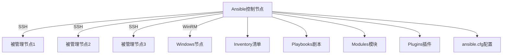

# Ansible环境搭建与配置

本文将详细介绍Ansible的安装部署和基础配置过程，包括不同操作系统下的安装方法、配置文件结构和参数设置，以及环境初始化和连接测试，帮助读者快速搭建可用的Ansible环境。

## 1. Ansible简介

在开始安装和配置Ansible之前，让我们先简单了解一下Ansible是什么以及它的核心特性。

### 1.1 什么是Ansible

Ansible是一个开源的自动化工具，用于配置管理、应用部署、任务自动化和编排。它的设计理念是简单、高效和安全，不需要在被管理的节点上安装代理软件，通过SSH协议进行通信。

Ansible的主要特点包括：

- **无代理架构**：不需要在目标主机上安装客户端软件
- **基于SSH**：使用安全的SSH协议进行通信
- **声明式语言**：使用YAML格式描述系统状态
- **模块化设计**：提供大量可重用的模块
- **幂等性**：多次执行相同操作，结果一致
- **并行执行**：可同时在多台主机上执行任务

### 1.2 Ansible架构

Ansible采用简单的架构设计，主要包含以下组件：



- **控制节点**：安装Ansible的主机，负责执行自动化任务
- **被管理节点**：需要被管理的远程主机
- **Inventory**：定义被管理节点的清单文件
- **Modules**：Ansible的功能模块，执行具体任务
- **Playbooks**：使用YAML格式编写的自动化任务脚本
- **Plugins**：扩展Ansible功能的插件
- **ansible.cfg**：Ansible的配置文件

## 2. 安装Ansible

Ansible可以在多种操作系统上安装，下面将详细介绍各种安装方法。

### 2.1 系统要求

在安装Ansible之前，请确保您的系统满足以下要求：

- **控制节点要求**：
  - Python 2.7或Python 3.5+
  - SSH客户端
  - 支持的操作系统：Linux、macOS、WSL(Windows Subsystem for Linux)
  
- **被管理节点要求**：
  - Python 2.6+或Python 3.5+
  - SSH服务器（Linux/Unix）或WinRM（Windows）
  - 无需安装额外软件

### 2.2 在Linux上安装Ansible

#### 2.2.1 使用包管理器安装

**Ubuntu/Debian系统**：

```bash
# 添加Ansible PPA仓库
sudo apt update
sudo apt install software-properties-common
sudo apt-add-repository --yes --update ppa:ansible/ansible

# 安装Ansible
sudo apt install ansible
```

**CentOS/RHEL系统**：

```bash
# 启用EPEL仓库
sudo yum install epel-release

# 安装Ansible
sudo yum install ansible
```

**Fedora系统**：

```bash
# 直接安装
sudo dnf install ansible
```

#### 2.2.2 使用pip安装

使用Python的包管理器pip安装Ansible是跨平台的方法，也是获取最新版本的推荐方式：

```bash
# 安装pip（如果尚未安装）
sudo apt install python3-pip  # Debian/Ubuntu
sudo yum install python3-pip  # CentOS/RHEL
sudo dnf install python3-pip  # Fedora

# 使用pip安装Ansible
pip3 install ansible --user
```

使用虚拟环境安装（推荐）：

```bash
# 安装virtualenv
pip3 install virtualenv

# 创建虚拟环境
python3 -m virtualenv ansible_env

# 激活虚拟环境
source ansible_env/bin/activate

# 在虚拟环境中安装Ansible
pip install ansible
```

### 2.3 在macOS上安装Ansible

macOS上可以使用Homebrew或pip安装Ansible：

#### 2.3.1 使用Homebrew安装

```bash
# 安装Homebrew（如果尚未安装）
/bin/bash -c "$(curl -fsSL https://raw.githubusercontent.com/Homebrew/install/HEAD/install.sh)"

# 安装Ansible
brew install ansible
```

#### 2.3.2 使用pip安装

```bash
# 安装pip（如果尚未安装）
sudo easy_install pip

# 安装Ansible
pip install ansible --user
```

### 2.4 在Windows上安装Ansible

Ansible控制节点不直接支持Windows，但有以下几种方法可以在Windows环境中使用Ansible：

#### 2.4.1 使用WSL（Windows Subsystem for Linux）

1. 启用WSL功能：

```powershell
# 以管理员身份运行PowerShell
Enable-WindowsOptionalFeature -Online -FeatureName Microsoft-Windows-Subsystem-Linux
```

2. 从Microsoft Store安装Linux发行版（如Ubuntu）

3. 在WSL中安装Ansible：

```bash
# 在WSL终端中执行
sudo apt update
sudo apt install software-properties-common
sudo apt-add-repository --yes --update ppa:ansible/ansible
sudo apt install ansible
```

#### 2.4.2 使用Docker容器

1. 安装Docker Desktop for Windows

2. 创建Ansible Docker容器：

```powershell
# 创建Dockerfile
@"
FROM python:3.9-slim

RUN pip install ansible

WORKDIR /ansible
ENTRYPOINT ["ansible"]
"@ | Out-File -Encoding ASCII Dockerfile

# 构建Docker镜像
docker build -t ansible .

# 运行Ansible容器
docker run --rm -it -v ${PWD}:/ansible ansible --version
```

#### 2.4.3 使用Cygwin或Git Bash

虽然不是官方支持的方法，但可以在Cygwin或Git Bash中尝试安装Ansible：

```bash
# 在Cygwin中
pip install ansible

# 在Git Bash中
pip install ansible
```

### 2.5 验证安装

安装完成后，可以通过以下命令验证Ansible是否安装成功：

```bash
# 检查Ansible版本
ansible --version

# 输出示例
ansible [core 2.13.3]
  config file = /etc/ansible/ansible.cfg
  configured module search path = ['/home/user/.ansible/plugins/modules', '/usr/share/ansible/plugins/modules']
  ansible python module location = /usr/lib/python3/dist-packages/ansible
  ansible collection location = /home/user/.ansible/collections:/usr/share/ansible/collections
  executable location = /usr/bin/ansible
  python version = 3.10.4 (main, Apr  2 2022, 09:04:19) [GCC 11.2.0]
  jinja version = 3.0.3
  libyaml = True
```

## 3. Ansible配置文件

Ansible使用配置文件来定义其行为。了解配置文件的结构和优先级对于有效使用Ansible至关重要。

### 3.1 配置文件位置和优先级

Ansible按以下优先级查找配置文件（从高到低）：

1. **环境变量**：`ANSIBLE_CONFIG`
2. **当前目录**：`./ansible.cfg`
3. **用户主目录**：`~/.ansible.cfg`
4. **系统配置**：`/etc/ansible/ansible.cfg`

可以通过以下命令查看当前使用的配置文件：

```bash
ansible --version
```

### 3.2 创建基本配置文件

以下是一个基本的`ansible.cfg`配置文件示例：

```ini
[defaults]
# 主机清单文件路径
inventory = ./inventory

# 默认远程用户
remote_user = ansible

# 禁用SSH密钥检查
host_key_checking = False

# 并行执行的任务数
forks = 5

# 连接超时时间（秒）
timeout = 30

# 日志路径
log_path = ./ansible.log

# 显示执行时间
callback_whitelist = timer, profile_tasks

[privilege_escalation]
# 是否默认使用sudo
become = False

# sudo用户
become_user = root

# sudo方法
become_method = sudo

# 是否询问sudo密码
become_ask_pass = False

[ssh_connection]
# SSH参数
ssh_args = -o ControlMaster=auto -o ControlPersist=60s

# 使用sftp而不是scp
transfer_method = sftp

# 加速文件传输
pipelining = True
```

### 3.3 主要配置参数详解

#### 3.3.1 [defaults]部分

这是最常用的配置部分，包含Ansible的基本行为设置：

| 参数 | 说明 | 示例值 |
|------|------|--------|
| inventory | 主机清单文件路径 | ./inventory |
| remote_user | 默认远程用户 | ansible |
| host_key_checking | 是否检查SSH主机密钥 | False |
| forks | 并行任务数 | 10 |
| timeout | 连接超时时间（秒） | 30 |
| log_path | 日志文件路径 | ./ansible.log |
| private_key_file | 默认SSH私钥路径 | ~/.ssh/id_rsa |
| roles_path | 角色搜索路径 | ./roles:/usr/share/ansible/roles |
| library | 模块搜索路径 | ./library:/usr/share/ansible/plugins/modules |
| retry_files_enabled | 是否创建重试文件 | False |
| interpreter_python | Python解释器路径 | auto |
| vault_password_file | Vault密码文件路径 | ~/.vault_pass |

#### 3.3.2 [privilege_escalation]部分

控制权限提升（如sudo）的配置：

| 参数 | 说明 | 示例值 |
|------|------|--------|
| become | 是否默认使用权限提升 | True |
| become_method | 权限提升方法 | sudo |
| become_user | 提升为哪个用户 | root |
| become_ask_pass | 是否询问提升密码 | False |

#### 3.3.3 [ssh_connection]部分

SSH连接相关配置：

| 参数 | 说明 | 示例值 |
|------|------|--------|
| ssh_args | SSH命令参数 | -o ControlMaster=auto -o ControlPersist=60s |
| control_path | SSH控制路径 | /tmp/ansible-ssh-%%h-%%p-%%r |
| pipelining | 是否启用管道传输 | True |
| scp_if_ssh | 使用SCP而非SFTP | False |
| transfer_method | 文件传输方法 | smart |

#### 3.3.4 [persistent_connection]部分

持久连接相关配置：

| 参数 | 说明 | 示例值 |
|------|------|--------|
| connect_timeout | 连接超时时间 | 30 |
| command_timeout | 命令超时时间 | 30 |
| connect_retry_timeout | 连接重试超时 | 15 |

### 3.4 环境变量配置

除了配置文件，Ansible也支持通过环境变量进行配置。环境变量的格式为`ANSIBLE_`前缀加上配置参数的大写形式：

```bash
# 设置主机清单文件
export ANSIBLE_INVENTORY=./my_inventory

# 禁用主机密钥检查
export ANSIBLE_HOST_KEY_CHECKING=False

# 设置远程用户
export ANSIBLE_REMOTE_USER=admin

# 设置并行任务数
export ANSIBLE_FORKS=20
```

可以将这些环境变量添加到`~/.bashrc`或`~/.bash_profile`中使其永久生效：

```bash
echo 'export ANSIBLE_HOST_KEY_CHECKING=False' >> ~/.bashrc
source ~/.bashrc
```

## 4. 配置Inventory（主机清单）

Inventory是Ansible中定义被管理主机的文件，它告诉Ansible应该连接哪些主机以及如何连接它们。

### 4.1 Inventory文件格式

Ansible支持两种主要的Inventory格式：INI格式和YAML格式。

#### 4.1.1 INI格式（最常用）

```ini
# 单个主机
web1.example.com

# 主机组
[webservers]
web1.example.com
web2.example.com
web3.example.com ansible_host=192.168.1.103

# 带有连接参数的主机
db1.example.com ansible_host=10.0.0.1 ansible_user=dbadmin ansible_ssh_private_key_file=~/.ssh/db_key

# 使用范围表达式
[webservers]
web[1:5].example.com

# 组的组（父组）
[production:children]
webservers
dbservers

# 组变量
[webservers:vars]
http_port=80
proxy_timeout=5

# 另一个组
[dbservers]
db1.example.com
db2.example.com
```

#### 4.1.2 YAML格式

```yaml
all:
  hosts:
    web1.example.com:
  children:
    webservers:
      hosts:
        web1.example.com:
        web2.example.com:
        web3.example.com:
          ansible_host: 192.168.1.103
      vars:
        http_port: 80
        proxy_timeout: 5
    dbservers:
      hosts:
        db1.example.com:
          ansible_host: 10.0.0.1
          ansible_user: dbadmin
          ansible_ssh_private_key_file: ~/.ssh/db_key
        db2.example.com:
    production:
      children:
        webservers:
        dbservers:
```

### 4.2 主机变量和组变量

Ansible支持为主机和组定义变量，这些变量可以在Playbook中使用。

#### 4.2.1 在Inventory文件中定义变量

```ini
# 主机变量
web1.example.com ansible_host=192.168.1.101 http_port=8080 max_connections=1000

# 组变量
[webservers:vars]
http_port=80
proxy_timeout=5
```

#### 4.2.2 使用变量目录

更推荐的方法是使用单独的变量文件，这样可以更好地组织变量：

```
inventory/
├── hosts                  # 主机清单文件
├── group_vars/            # 组变量目录
│   ├── all.yml           # 适用于所有主机的变量
│   ├── webservers.yml    # webservers组的变量
│   └── dbservers.yml     # dbservers组的变量
└── host_vars/             # 主机变量目录
    ├── web1.example.com.yml
    └── db1.example.com.yml
```

示例组变量文件（`group_vars/webservers.yml`）：

```yaml
---
# webservers组的变量
http_port: 80
proxy_timeout: 5
max_connections: 1000

# 嵌套变量
apache:
  port: 80
  max_clients: 200
  server_admin: admin@example.com
```

示例主机变量文件（`host_vars/web1.example.com.yml`）：

```yaml
---
# web1.example.com的变量
http_port: 8080  # 覆盖组变量
backup_dir: /var/backups/web1
```

### 4.3 常用的Inventory参数

以下是一些常用的Inventory参数：

| 参数 | 说明 | 示例 |
|------|------|------|
| ansible_host | 连接的主机名或IP | ansible_host=192.168.1.100 |
| ansible_port | SSH端口 | ansible_port=2222 |
| ansible_user | SSH用户名 | ansible_user=admin |
| ansible_password | SSH密码（不推荐） | ansible_password=secret |
| ansible_ssh_private_key_file | SSH私钥路径 | ansible_ssh_private_key_file=~/.ssh/id_rsa |
| ansible_connection | 连接类型 | ansible_connection=ssh |
| ansible_python_interpreter | Python解释器路径 | ansible_python_interpreter=/usr/bin/python3 |
| ansible_become | 是否使用权限提升 | ansible_become=true |
| ansible_become_method | 权限提升方法 | ansible_become_method=sudo |
| ansible_become_user | 提升为哪个用户 | ansible_become_user=root |
| ansible_become_password | 提升权限的密码 | ansible_become_password=sudopass |

### 4.4 动态Inventory

对于云环境或大型动态环境，静态Inventory文件可能不够灵活。Ansible支持动态Inventory脚本，可以从外部数据源（如云提供商API、CMDB或数据库）获取主机信息。

#### 4.4.1 使用现有的动态Inventory脚本

Ansible提供了许多内置的动态Inventory插件，如AWS、Azure、GCP等：

```bash
# 使用AWS EC2动态清单
ansible-playbook -i aws_ec2.yml playbook.yml
```

AWS EC2动态清单配置示例（`aws_ec2.yml`）：

```yaml
plugin: aws_ec2
regions:
  - us-east-1
  - us-west-1
keyed_groups:
  - key: tags.Environment
    prefix: env
  - key: tags.Role
    prefix: role
```

#### 4.4.2 创建自定义动态Inventory脚本

您也可以创建自定义的动态Inventory脚本。脚本需要支持两个命令行参数：

- `--list`：返回所有主机和组的JSON数据
- `--host <hostname>`：返回特定主机的变量

示例Python动态Inventory脚本：

```python
#!/usr/bin/env python3

import argparse
import json
import sys

# 模拟从外部数据源获取数据
def get_inventory_data():
    return {
        "webservers": {
            "hosts": ["web1.example.com", "web2.example.com"],
            "vars": {
                "http_port": 80
            }
        },
        "dbservers": {
            "hosts": ["db1.example.com"],
            "vars": {
                "db_port": 5432
            }
        },
        "_meta": {
            "hostvars": {
                "web1.example.com": {
                    "ansible_host": "192.168.1.101"
                },
                "web2.example.com": {
                    "ansible_host": "192.168.1.102"
                },
                "db1.example.com": {
                    "ansible_host": "192.168.1.103",
                    "ansible_user": "dbadmin"
                }
            }
        }
    }

def main():
    parser = argparse.ArgumentParser()
    parser.add_argument('--list', action='store_true')
    parser.add_argument('--host', action='store')
    args = parser.parse_args()

    inventory_data = get_inventory_data()
    
    if args.list:
        print(json.dumps(inventory_data))
    elif args.host:
        host_vars = inventory_data['_meta']['hostvars'].get(args.host, {})
        print(json.dumps(host_vars))
    else:
        parser.print_help()
        sys.exit(1)

if __name__ == '__main__':
    main()
```

使用自定义动态Inventory脚本：

```bash
# 确保脚本有执行权限
chmod +x custom_inventory.py

# 使用动态清单
ansible-playbook -i custom_inventory.py playbook.yml
```

## 5. SSH密钥配置

Ansible主要通过SSH连接到被管理节点，因此正确配置SSH密钥对于无密码自动化至关重要。

### 5.1 生成SSH密钥对

如果您还没有SSH密钥对，可以使用以下命令生成：

```bash
# 生成RSA密钥对
ssh-keygen -t rsa -b 4096 -C "ansible@example.com"

# 或生成更安全的ED25519密钥对
ssh-keygen -t ed25519 -C "ansible@example.com"
```

生成过程中，系统会提示您：
- 指定密钥文件保存位置（默认为`~/.ssh/id_rsa`或`~/.ssh/id_ed25519`）
- 设置密钥密码（可选，但建议设置）

### 5.2 分发SSH公钥

要实现无密码登录，需要将公钥分发到所有被管理节点：

```bash
# 使用ssh-copy-id命令（推荐）
ssh-copy-id -i ~/.ssh/id_ed25519.pub user@remote_host

# 或手动复制
cat ~/.ssh/id_ed25519.pub | ssh user@remote_host "mkdir -p ~/.ssh && chmod 700 ~/.ssh && cat >> ~/.ssh/authorized_keys && chmod 600 ~/.ssh/authorized_keys"
```

对于多台主机，可以使用循环：

```bash
# Bash循环分发公钥
for host in host1 host2 host3; do
    ssh-copy-id -i ~/.ssh/id_ed25519.pub user@$host
done
```

或者使用Ansible自身来分发公钥（需要先能够使用密码登录）：

```yaml
# distribute_ssh_keys.yml
---
- name: 分发SSH公钥
  hosts: all
  gather_facts: no
  vars:
    ssh_key: "{{ lookup('file', '~/.ssh/id_ed25519.pub') }}"
  tasks:
    - name: 确保.ssh目录存在
      file:
        path: ~/.ssh
        state: directory
        mode: '0700'
      
    - name: 添加SSH公钥到authorized_keys
      lineinfile:
        path: ~/.ssh/authorized_keys
        line: "{{ ssh_key }}"
        create: yes
        state: present
        mode: '0600'
```

执行此Playbook：

```bash
ansible-playbook -i inventory distribute_ssh_keys.yml -k
```

### 5.3 SSH配置优化

可以通过`~/.ssh/config`文件优化SSH连接：

```
# 全局选项
Host *
    ServerAliveInterval 60
    ServerAliveCountMax 30
    ControlMaster auto
    ControlPath ~/.ssh/sockets/%r@%h-%p
    ControlPersist 600
    StrictHostKeyChecking accept-new
    
# 特定主机配置
Host web*.example.com
    User webadmin
    IdentityFile ~/.ssh/web_id_ed25519
    
Host db*.example.com
    User dbadmin
    IdentityFile ~/.ssh/db_id_ed25519
    Port 2222
```

这些配置可以：
- 保持连接活跃
- 启用连接复用，提高性能
- 自动接受新主机密钥
- 为不同主机组指定不同的用户和密钥

### 5.4 SSH代理配置

对于受密码保护的SSH密钥，可以使用SSH代理避免重复输入密码：

```bash
# 启动SSH代理
eval $(ssh-agent)

# 添加密钥到代理
ssh-add ~/.ssh/id_ed25519
```

将这些命令添加到`~/.bashrc`或`~/.bash_profile`中，使其在登录时自动执行：

```bash
# 添加到~/.bashrc
if [ -z "$SSH_AUTH_SOCK" ]; then
    eval $(ssh-agent -s)
    ssh-add ~/.ssh/id_ed25519 2>/dev/null
fi
```

## 6. 初始化Ansible项目

一个良好组织的Ansible项目结构可以提高可维护性和可扩展性。

### 6.1 创建项目目录结构

以下是一个推荐的Ansible项目目录结构：

```
ansible-project/
├── ansible.cfg                 # 项目特定的配置
├── inventory/                  # 主机清单目录
│   ├── production/             # 生产环境
│   │   ├── hosts               # 主机列表
│   │   ├── group_vars/         # 组变量
│   │   └── host_vars/          # 主机变量
│   └── staging/                # 测试环境
│       ├── hosts               # 主机列表
│       ├── group_vars/         # 组变量
│       └── host_vars/          # 主机变量
├── playbooks/                  # Playbook目录
│   ├── site.yml                # 主Playbook
│   ├── webservers.yml          # Web服务器Playbook
│   └── dbservers.yml           # 数据库服务器Playbook
├── roles/                      # 角色目录
│   ├── common/                 # 通用角色
│   ├── webserver/              # Web服务器角色
│   └── database/               # 数据库服务器角色
├── library/                    # 自定义模块
├── filter_plugins/             # 自定义过滤器
└── files/                      # 静态文件
```

可以使用以下命令创建此目录结构：

```bash
# 创建主目录
mkdir -p ansible-project
cd ansible-project

# 创建子目录
mkdir -p inventory/{production,staging}/{group_vars,host_vars}
mkdir -p playbooks
mkdir -p roles/{common,webserver,database}/{tasks,handlers,templates,files,vars,defaults,meta}
mkdir -p {library,filter_plugins,files}

# 创建基本配置文件
touch ansible.cfg
touch inventory/production/hosts
touch inventory/staging/hosts
touch playbooks/{site,webservers,dbservers}.yml
```

### 6.2 配置项目特定的ansible.cfg

为项目创建一个特定的`ansible.cfg`文件：

```ini
[defaults]
# 主机清单路径
inventory = ./inventory/production

# 角色路径
roles_path = ./roles

# 自定义模块路径
library = ./library

# 并行任务数
forks = 10

# 禁用SSH密钥检查
host_key_checking = False

# 禁用重试文件
retry_files_enabled = False

# 显示任务执行时间
callback_whitelist = timer, profile_tasks

# 缓存设置
fact_caching = jsonfile
fact_caching_connection = ./fact_cache
fact_caching_timeout = 86400

[privilege_escalation]
become = True
become_method = sudo
become_user = root
become_ask_pass = False

[ssh_connection]
pipelining = True
ssh_args = -o ControlMaster=auto -o ControlPersist=60s
```

### 6.3 创建基本Inventory文件

为生产环境创建一个基本的Inventory文件（`inventory/production/hosts`）：

```ini
# Web服务器
[webservers]
web1.example.com ansible_host=192.168.1.101
web2.example.com ansible_host=192.168.1.102

# 数据库服务器
[dbservers]
db1.example.com ansible_host=192.168.1.103

# 负载均衡器
[loadbalancers]
lb1.example.com ansible_host=192.168.1.100

# 环境分组
[production:children]
webservers
dbservers
loadbalancers

# 全局变量
[all:vars]
ansible_user=ansible
ansible_python_interpreter=/usr/bin/python3
```

### 6.4 创建组变量和主机变量

创建组变量文件（`inventory/production/group_vars/all.yml`）：

```yaml
---
# 适用于所有主机的变量
ntp_servers:
  - 0.pool.ntp.org
  - 1.pool.ntp.org

dns_servers:
  - 8.8.8.8
  - 8.8.4.4

timezone: UTC

# 安全设置
security:
  ssh:
    permit_root_login: "no"
    password_authentication: "no"
  firewall:
    enabled: true
```

创
让我继续完成Ansible环境搭建与配置的内容：

创建组变量文件（`inventory/production/group_vars/webservers.yml`）：

```yaml
---
# Web服务器组变量
http_port: 80
https_port: 443

# Web服务配置
web_server: nginx
document_root: /var/www/html

# 应用部署设置
app_deployment:
  repository: git@github.com:example/webapp.git
  version: master
  deploy_path: /var/www/webapp
```

创建主机变量文件（`inventory/production/host_vars/web1.example.com.yml`）：

```yaml
---
# web1特定变量
server_id: web01
backup_dir: /var/backups/web1
is_primary: true
```

### 6.5 创建基本Playbook

创建主Playbook（`playbooks/site.yml`）：

```yaml
---
# 主Playbook - 包含所有其他Playbook
- import_playbook: common.yml
- import_playbook: webservers.yml
- import_playbook: dbservers.yml
- import_playbook: loadbalancers.yml
```

创建通用Playbook（`playbooks/common.yml`）：

```yaml
---
- name: 应用通用配置
  hosts: all
  become: yes
  roles:
    - common
```

创建Web服务器Playbook（`playbooks/webservers.yml`）：

```yaml
---
- name: 配置Web服务器
  hosts: webservers
  become: yes
  roles:
    - webserver
```

## 7. 连接测试与验证

在完成基本配置后，应该测试Ansible是否能够正确连接到被管理节点。

### 7.1 使用ping模块测试连接

Ansible的ping模块是测试连接的最简单方法：

```bash
# 测试所有主机
ansible all -m ping

# 测试特定组
ansible webservers -m ping

# 测试特定主机
ansible web1.example.com -m ping
```

成功的ping响应如下：

```
web1.example.com | SUCCESS => {
    "ansible_facts": {
        "discovered_interpreter_python": "/usr/bin/python3"
    },
    "changed": false,
    "ping": "pong"
}
```

### 7.2 收集主机信息

使用setup模块收集主机的详细信息：

```bash
# 收集所有主机的信息
ansible all -m setup

# 收集特定主机的信息
ansible web1.example.com -m setup

# 收集特定信息（使用过滤器）
ansible web1.example.com -m setup -a "filter=ansible_distribution*"
```

这将返回主机的详细信息，包括操作系统、硬件、网络等。

### 7.3 执行简单命令

使用command或shell模块执行简单命令：

```bash
# 使用command模块（不支持管道和重定向）
ansible all -m command -a "uptime"

# 使用shell模块（支持shell特性）
ansible all -m shell -a "df -h | grep /dev/sda"
```

### 7.4 验证权限提升

测试sudo权限是否正确配置：

```bash
# 使用become提升权限
ansible all -m command -a "whoami" -b

# 应该返回"root"或配置的become_user
```

### 7.5 测试文件传输

测试文件传输功能：

```bash
# 创建测试文件
echo "Ansible test file" > test.txt

# 复制文件到远程主机
ansible all -m copy -a "src=test.txt dest=/tmp/test.txt"

# 验证文件内容
ansible all -m command -a "cat /tmp/test.txt"
```

### 7.6 运行简单Playbook

创建并运行一个简单的测试Playbook（`test.yml`）：

```yaml
---
- name: 测试Playbook
  hosts: all
  become: yes
  tasks:
    - name: 创建测试目录
      file:
        path: /tmp/ansible_test
        state: directory
        mode: '0755'
      
    - name: 创建测试文件
      copy:
        content: "Ansible测试成功！\n创建时间: {{ ansible_date_time.iso8601 }}\n"
        dest: /tmp/ansible_test/test.txt
        mode: '0644'
      
    - name: 显示测试文件内容
      command: cat /tmp/ansible_test/test.txt
      register: test_content
      
    - name: 输出测试结果
      debug:
        var: test_content.stdout_lines
```

运行测试Playbook：

```bash
ansible-playbook test.yml
```

## 8. 常见问题与解决方案

在设置Ansible环境时，可能会遇到各种问题。以下是一些常见问题及其解决方案。

### 8.1 SSH连接问题

#### 8.1.1 SSH密钥认证失败

**症状**：`Permission denied (publickey)`错误

**解决方案**：
1. 确认公钥已正确添加到远程主机的`~/.ssh/authorized_keys`文件中
2. 检查SSH密钥权限：
   ```bash
   chmod 700 ~/.ssh
   chmod 600 ~/.ssh/id_ed25519
   chmod 644 ~/.ssh/id_ed25519.pub
   chmod 600 ~/.ssh/authorized_keys
   ```
3. 检查远程主机的SSH配置：
   ```bash
   # 在远程主机上执行
   grep PubkeyAuthentication /etc/ssh/sshd_config
   # 应该是"PubkeyAuthentication yes"
   ```
4. 使用`-vvv`选项获取详细调试信息：
   ```bash
   ansible web1.example.com -m ping -vvv
   ```

#### 8.1.2 主机密钥验证失败

**症状**：`Host key verification failed`错误

**解决方案**：
1. 在配置文件中禁用主机密钥检查：
   ```ini
   # ansible.cfg
   [defaults]
   host_key_checking = False
   ```
2. 或设置环境变量：
   ```bash
   export ANSIBLE_HOST_KEY_CHECKING=False
   ```
3. 或手动添加主机密钥：
   ```bash
   ssh-keyscan -H remote_host >> ~/.ssh/known_hosts
   ```

#### 8.1.3 SSH连接超时

**症状**：`Timeout when connecting to host`错误

**解决方案**：
1. 检查网络连接和防火墙设置
2. 增加SSH连接超时时间：
   ```ini
   # ansible.cfg
   [defaults]
   timeout = 60
   
   [ssh_connection]
   ssh_args = -o ConnectTimeout=60
   ```
3. 确认远程主机SSH服务正在运行：
   ```bash
   telnet remote_host 22
   ```

### 8.2 权限提升问题

#### 8.2.1 sudo权限问题

**症状**：`sudo: no tty present and no askpass program specified`错误

**解决方案**：
1. 在sudoers文件中添加NOPASSWD选项：
   ```bash
   # 在远程主机上执行
   echo "ansible ALL=(ALL) NOPASSWD: ALL" | sudo tee /etc/sudoers.d/ansible
   ```
2. 或在Ansible配置中启用TTY：
   ```ini
   # ansible.cfg
   [ssh_connection]
   ssh_args = -o ControlMaster=auto -o ControlPersist=60s -tt
   ```

#### 8.2.2 become密码问题

**症状**：权限提升失败，需要密码

**解决方案**：
1. 使用`--ask-become-pass`选项提供密码：
   ```bash
   ansible-playbook playbook.yml --ask-become-pass
   ```
2. 或在Inventory中设置become密码：
   ```ini
   [webservers:vars]
   ansible_become_password=your_sudo_password
   ```
3. 或使用Ansible Vault加密存储密码：
   ```bash
   ansible-vault create group_vars/all/vault.yml
   # 添加以下内容
   ansible_become_password: your_sudo_password
   ```

### 8.3 Python相关问题

#### 8.3.1 Python解释器问题

**症状**：`/usr/bin/python: not found`错误

**解决方案**：
1. 指定正确的Python解释器路径：
   ```ini
   # inventory/hosts
   [all:vars]
   ansible_python_interpreter=/usr/bin/python3
   ```
2. 或使用raw模块安装Python：
   ```bash
   ansible all -m raw -a "apt-get update && apt-get install -y python3" -b
   ```

#### 8.3.2 Python模块缺失

**症状**：`No module named 'xxx'`错误

**解决方案**：
1. 在远程主机上安装所需模块：
   ```yaml
   - name: 安装Python模块
     pip:
       name:
         - pywinrm
         - boto3
         - dnspython
       state: present
   ```
2. 或使用raw模块安装：
   ```bash
   ansible all -m raw -a "pip3 install pywinrm boto3 dnspython" -b
   ```

### 8.4 Inventory问题

#### 8.4.1 主机无法解析

**症状**：`Could not resolve hostname`错误

**解决方案**：
1. 使用IP地址代替主机名：
   ```ini
   # inventory/hosts
   web1 ansible_host=192.168.1.101
   ```
2. 或在/etc/hosts文件中添加主机名解析：
   ```bash
   echo "192.168.1.101 web1.example.com web1" | sudo tee -a /etc/hosts
   ```

#### 8.4.2 动态Inventory脚本权限问题

**症状**：动态Inventory脚本无法执行

**解决方案**：
1. 确保脚本有执行权限：
   ```bash
   chmod +x inventory_script.py
   ```
2. 检查脚本的shebang行：
   ```python
   #!/usr/bin/env python3
   ```

### 8.5 配置文件问题

#### 8.5.1 配置文件不生效

**症状**：配置更改没有生效

**解决方案**：
1. 检查使用的配置文件：
   ```bash
   ansible --version
   # 查看"config file = ..."行
   ```
2. 确保配置文件格式正确：
   ```bash
   ansible-config dump --only-changed
   ```
3. 尝试使用绝对路径指定配置文件：
   ```bash
   ansible-playbook -i inventory playbook.yml -e "ANSIBLE_CONFIG=/path/to/ansible.cfg"
   ```

#### 8.5.2 配置文件优先级问题

**症状**：使用了错误的配置文件

**解决方案**：
1. 设置环境变量指定配置文件：
   ```bash
   export ANSIBLE_CONFIG=/path/to/ansible.cfg
   ```
2. 或使用命令行参数：
   ```bash
   ansible-playbook playbook.yml --ansible-config=/path/to/ansible.cfg
   ```

## 9. 高级配置选项

除了基本配置外，Ansible还提供了许多高级配置选项，可以根据需要进行调整。

### 9.1 性能优化

#### 9.1.1 并行执行

调整并行任务数可以提高执行效率：

```ini
# ansible.cfg
[defaults]
forks = 20  # 默认为5，可根据控制节点性能调整
```

#### 9.1.2 启用管道传输

启用SSH管道传输可以减少SSH连接数：

```ini
# ansible.cfg
[ssh_connection]
pipelining = True
```

#### 9.1.3 持久连接

配置SSH持久连接可以减少连接建立的开销：

```ini
# ansible.cfg
[ssh_connection]
ssh_args = -o ControlMaster=auto -o ControlPersist=60s
control_path = %(directory)s/ansible-ssh-%%h-%%p-%%r
```

#### 9.1.4 事实缓存

启用事实缓存可以减少收集主机信息的时间：

```ini
# ansible.cfg
[defaults]
gathering = smart
fact_caching = jsonfile
fact_caching_connection = /path/to/fact_cache
fact_caching_timeout = 86400  # 缓存有效期（秒）
```

### 9.2 安全增强

#### 9.2.1 Vault配置

配置Ansible Vault用于加密敏感数据：

```ini
# ansible.cfg
[defaults]
vault_password_file = ~/.vault_pass
```

创建密码文件：

```bash
echo "your_vault_password" > ~/.vault_pass
chmod 600 ~/.vault_pass
```

使用Vault加密文件：

```bash
# 加密文件
ansible-vault encrypt secret.yml

# 创建加密文件
ansible-vault create secret.yml

# 编辑加密文件
ansible-vault edit secret.yml

# 解密文件
ansible-vault decrypt secret.yml
```

#### 9.2.2 SSH安全增强

增强SSH连接安全性：

```ini
# ansible.cfg
[ssh_connection]
ssh_args = -o ControlMaster=auto -o ControlPersist=60s -o PreferredAuthentications=publickey -o ServerAliveInterval=30
```

#### 9.2.3 权限控制

限制Ansible可以执行的命令：

```ini
# /etc/sudoers.d/ansible（在被管理节点上）
ansible ALL=(ALL) NOPASSWD: /bin/systemctl restart httpd, /bin/systemctl restart nginx
```

### 9.3 日志和调试

#### 9.3.1 配置日志

启用详细日志记录：

```ini
# ansible.cfg
[defaults]
log_path = /var/log/ansible.log
verbosity = 1  # 日志详细程度（0-4）
```

#### 9.3.2 回调插件

启用回调插件以增强输出：

```ini
# ansible.cfg
[defaults]
callback_whitelist = profile_tasks, timer, mail
```

自定义回调插件示例（`callback_plugins/log_plays.py`）：

```python
from __future__ import (absolute_import, division, print_function)
__metaclass__ = type

import os
import time
import json

from ansible.plugins.callback import CallbackBase

class CallbackModule(CallbackBase):
    CALLBACK_VERSION = 2.0
    CALLBACK_TYPE = 'notification'
    CALLBACK_NAME = 'log_plays'
    CALLBACK_NEEDS_WHITELIST = True

    def __init__(self):
        super(CallbackModule, self).__init__()
        self.log_file = os.environ.get('ANSIBLE_LOG_FILE', '/var/log/ansible/plays.log')
        self.log_dir = os.path.dirname(self.log_file)
        if not os.path.exists(self.log_dir):
            os.makedirs(self.log_dir)

    def log_message(self, message):
        with open(self.log_file, 'a') as f:
            f.write(message + '\n')

    def v2_playbook_on_start(self, playbook):
        self.log_message(
            "Playbook started: {0} at {1}".format(
                playbook._file_name,
                time.strftime('%Y-%m-%d %H:%M:%S')
            )
        )

    def v2_playbook_on_task_start(self, task, is_conditional):
        self.log_message(
            "Task started: {0} at {1}".format(
                task.name,
                time.strftime('%Y-%m-%d %H:%M:%S')
            )
        )

    def v2_playbook_on_stats(self, stats):
        hosts = sorted(stats.processed.keys())
        summary = {}
        for host in hosts:
            summary[host] = stats.summarize(host)

        self.log_message(
            "Playbook finished at {0}\nSummary: {1}".format(
                time.strftime('%Y-%m-%d %H:%M:%S'),
                json.dumps(summary, indent=2)
            )
        )
```

#### 9.3.3 调试模式

启用调试模式：

```ini
# ansible.cfg
[defaults]
debug = True
```

或使用环境变量：

```bash
export ANSIBLE_DEBUG=True
```

### 9.4 模块和插件配置

#### 9.4.1 自定义模块路径

配置自定义模块路径：

```ini
# ansible.cfg
[defaults]
library = ./library:/usr/share/ansible/plugins/modules
```

#### 9.4.2 插件路径

配置各种插件的路径：

```ini
# ansible.cfg
[defaults]
action_plugins = ./action_plugins
callback_plugins = ./callback_plugins
connection_plugins = ./connection_plugins
lookup_plugins = ./lookup_plugins
filter_plugins = ./filter_plugins
```

#### 9.4.3 自定义过滤器

创建自定义过滤器（`filter_plugins/custom_filters.py`）：

```python
def to_uppercase(string):
    return string.upper()

def add_prefix(string, prefix):
    return prefix + string

class FilterModule(object):
    def filters(self):
        return {
            'to_uppercase': to_uppercase,
            'add_prefix': add_prefix
        }
```

在Playbook中使用自定义过滤器：

```yaml
- name: 使用自定义过滤器
  debug:
    msg: "{{ 'hello world' | to_uppercase }}"
```

## 10. 多环境管理

在实际项目中，通常需要管理多个环境（如开发、测试、生产）。Ansible提供了多种方法来管理不同环境。

### 10.1 使用不同的Inventory

为每个环境创建单独的Inventory：

```
inventory/
├── production/
│   ├── hosts
│   ├── group_vars/
│   └── host_vars/
├── staging/
│   ├── hosts
│   ├── group_vars/
│   └── host_vars/
└── development/
    ├── hosts
    ├── group_vars/
    └── host_vars/
```

使用`-i`选项指定要使用的Inventory：

```bash
# 使用生产环境
ansible-playbook -i inventory/production playbooks/site.yml

# 使用测试环境
ansible-playbook -i inventory/staging playbooks/site.yml

# 使用开发环境
ansible-playbook -i inventory/development playbooks/site.yml
```

### 10.2 使用组变量区分环境

在单个Inventory中使用组来区分环境：

```ini
# inventory/hosts
[production]
prod-web1.example.com
prod-web2.example.com
prod-db1.example.com

[staging]
staging-web1.example.com
staging-db1.example.com

[development]
dev-web1.example.com
dev-db1.example.com

[webservers:children]
production_webservers
staging_webservers
development_webservers

[production_webservers]
prod-web1.example.com
prod-web2.example.com

[staging_webservers]
staging-web1.example.com

[development_webservers]
dev-web1.example.com
```

然后为每个环境组创建变量文件：

```yaml
# group_vars/production.yml
env_name: production
db_host: prod-db1.example.com
debug_mode: false

# group_vars/staging.yml
env_name: staging
db_host: staging-db1.example.com
debug_mode: true

# group_vars/development.yml
env_name: development
db_host: dev-db1.example.com
debug_mode: true
```

在Playbook中使用条件语句：

```yaml
- name: 配置Web服务器
  hosts: webservers
  tasks:
    - name: 安装Web服务器
      package:
        name: "{{ web_server_package }}"
        state: present
      
    - name: 启用调试模式
      lineinfile:
        path: /etc/app/config.ini
        regexp: '^debug='
        line: 'debug=true'
      when: debug_mode | bool
```

### 10.3 使用变量文件

使用`--extra-vars`选项加载特定环境的变量文件：

```bash
# 创建环境变量文件
mkdir -p vars

# vars/production.yml
cat > vars/production.yml << EOF
env_name: production
db_host: prod-db1.example.com
debug_mode: false
EOF

# vars/staging.yml
cat > vars/staging.yml << EOF
env_name: staging
db_host: staging-db1.example.com
debug_mode: true
EOF

# 使用变量文件
ansible-playbook playbooks/site.yml --extra-vars "@vars/production.yml"
```

### 10.4 使用标签

使用标签来控制任务执行：

```yaml
- name: 配置服务器
  hosts: all
  tasks:
    - name: 安装基础软件包
      package:
        name: "{{ item }}"
        state: present
      loop:
        - vim
        - htop
        - tmux
      tags: base
      
    - name: 配置生产环境特定设置
      template:
        src: prod_config.j2
        dest: /etc/app/config.ini
      tags: production
      
    - name: 配置开发环境特定设置
      template:
        src: dev_config.j2
        dest: /etc/app/config.ini
      tags: development
```

使用标签执行特定任务：

```bash
# 只执行基础任务
ansible-playbook playbooks/site.yml --tags base

# 执行生产环境特定任务
ansible-playbook playbooks/site.yml --tags production

# 执行除开发环境外的所有任务
ansible-playbook playbooks/site.yml --skip-tags development
```

## 11. 总结与最佳实践

### 11.1 Ansible环境搭建总结

成功搭建Ansible环境需要以下步骤：

1. **安装Ansible**：选择适合您操作系统的安装方法
2. **配置SSH密钥**：设置无密码SSH认证
3. **创建Inventory**：定义被管理节点
4. **配置ansible.cfg**：根据需求调整Ansible配置
5. **创建项目结构**：组织Playbook、角色和变量
6. **测试连接**：验证Ansible能够连接到被管理节点
7. **编写基本Playbook**：开始自动化任务

### 11.2 最佳实践

#### 11.2.1 目录结构

- 使用一致的目录结构
- 将变量、任务和文件分离
- 使用角色组织相关任务

#### 11.2.2 Inventory管理

- 为不同环境使用单独的Inventory
- 使用组变量和主机变量
- 考虑使用动态Inventory

#### 11.2.3 配置管理

- 将项目特定配置放在项目目录中
- 使用版本控制管理配置文件
- 不要在配置文件中存储敏感信息

#### 11.2.4 安全实践

- 使用SSH密钥认证
- 使用Ansible Vault加密敏感数据
- 实施最小权限原则
- 定期轮换密钥和密码

#### 11.2.5 性能优化

- 启用SSH管道传输
- 配置事实缓存
- 调整并行任务数
- 使用标签限制执行范围

### 11.3 进一步学习资源

- [Ansible官方文档](https://docs.ansible.com/)
- [Ansible Galaxy](https://galaxy.ansible.com/)：共享和发现Ansible角色
- [Ansible示例](https://github.com/ansible/ansible-examples)：官方示例仓库
- [Ansible最佳实践](https://docs.ansible.com/ansible/latest/user_guide/playbooks_best_practices.html)：官方最佳实践指南

通过本文的指导，您应该能够成功搭建和配置Ansible环境，为自动化基础设施和应用部署奠定基础。随着对Ansible的深入了解，您可以进一步探索其高级功能，如AWX/Tower、自定义模块开发和与CI/CD系统集成等。