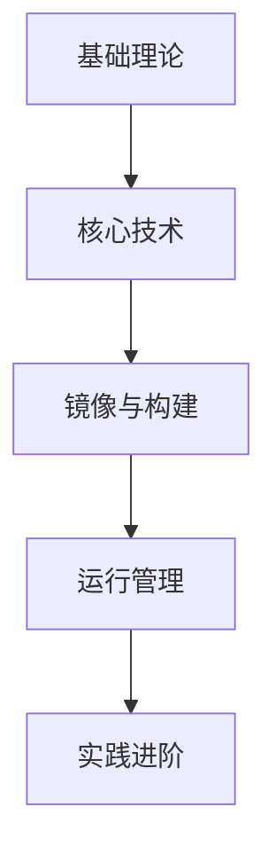

## 回答

---
title: Docker知识库概述
icon: docker
order: 0
---

# Docker知识库概述

Docker作为现代软件开发和部署的核心技术，已经深刻改变了应用程序的构建、交付和运行方式。本知识库系统地整理了Docker相关的核心概念、技术原理和实践指南，旨在帮助开发者、运维人员和技术管理者全面掌握容器技术，并在实际项目中高效应用。

## 学习路径

本知识库采用渐进式学习路径，从基础理论到实践应用，层层递进，帮助读者建立完整的知识体系：

建议按照目录顺序阅读，循序渐进地掌握Docker技术栈。每个章节都包含理论讲解、图示说明和实践案例，同时提供Windows和Linux双平台的示例代码，确保读者在不同环境中都能顺利应用所学知识。

## 知识库内容

### 1. 基础理论篇

基础理论篇介绍容器技术的基本概念、历史发展和核心原理，帮助读者建立对Docker的整体认识。

- [容器技术原理与发展历程](./01-容器技术原理与发展历程.md)  
  本文详细讲解了容器技术的起源、发展历程和核心原理。从早期的chroot到现代容器技术的演进，解析了Linux内核特性（Namespace、Cgroups、UnionFS）如何支撑容器技术的实现，以及Docker如何在容器化浪潮中崭露头角并引领行业发展。

- [Docker架构与核心组件](./02-Docker架构与核心组件.md)  
  深入分析Docker的整体架构设计和各组件协作机制。详细介绍了Docker客户端、Docker守护进程、容器运行时、镜像仓库等核心组件的功能和工作原理，以及它们之间如何协同工作，构成完整的Docker生态系统。

- [容器与虚拟机对比分析](./03-容器与虚拟机对比分析.md)  
  全面对比容器与传统虚拟机在架构、性能、资源利用、安全性和应用场景等方面的差异。通过具体数据和案例，帮助读者理解何时选择容器化，何时选择虚拟化，以及如何在实际环境中结合两种技术发挥最大优势。

### 2. 核心技术篇

核心技术篇深入Docker的关键技术细节，包括镜像机制、环境配置和命令行工具，为实际应用打下坚实基础。

- [容器镜像分层机制详解](./04-容器镜像分层机制详解.md)  
  深入解析Docker镜像的分层存储原理和联合文件系统工作机制。通过图解方式展示镜像层如何构建、共享和复用，以及写时复制（Copy-on-Write）技术如何提高存储效率和容器启动速度，同时介绍镜像优化的实用技巧。

- [Docker环境安装与配置](./05-Docker环境安装与配置.md)  
  提供Windows、Linux和macOS平台的Docker安装详细指南，包括系统要求、安装步骤和常见问题解决。同时介绍Docker环境的基础配置和性能优化方法，如镜像加速、资源限制、日志配置等，确保Docker在不同环境中都能高效运行。

- [Docker命令行工具使用](./06-Docker命令行工具使用.md)  
  全面介绍Docker CLI的命令体系和使用技巧。从基础的容器和镜像管理命令，到高级的网络配置、资源监控和系统维护命令，通过实际示例讲解每个命令的用法、参数和最佳实践，帮助读者熟练掌握Docker的日常操作。

### 3. 镜像与构建篇

镜像与构建篇聚焦于Docker镜像的管理和构建过程，教授如何创建高效、安全的容器镜像。

- [Docker镜像管理与构建](./07-Docker镜像管理与构建.md)  
  详细讲解Docker镜像的生命周期管理和构建策略。包括镜像的拉取、推送、标记、检查和删除等基本操作，以及多阶段构建、缓存优化、镜像瘦身等高级技巧。同时介绍私有镜像仓库的搭建和管理，满足企业级应用需求。

- [Dockerfile编写最佳实践](./08-Dockerfile编写最佳实践.md)  
  提供生产级Dockerfile的编写规范和优化技巧。从基础指令的正确使用，到构建上下文优化、多阶段构建、缓存利用和安全加固等高级主题，通过大量实例和对比分析，指导读者编写高效、安全、可维护的Dockerfile，构建最佳容器镜像。

### 4. 运行管理篇

运行管理篇关注容器的运行时管理和数据持久化，确保容器化应用的稳定运行和数据安全。

- [容器运行与生命周期管理](./09-容器运行与生命周期管理.md)  
  深入探讨容器的状态管理和资源控制。详细介绍容器的创建、启动、停止、重启和删除等生命周期操作，以及CPU、内存、IO限制和监控等资源管理技术。同时讲解容器编排的基本概念，为学习Kubernetes等高级工具奠定基础。

- [Docker数据持久化方案](./10-Docker数据持久化方案.md)  
  全面比较Docker的各种数据持久化方案，包括数据卷、绑定挂载、tmpfs挂载等。通过实际案例分析每种方案的优缺点和适用场景，指导读者为不同类型的应用选择最合适的数据持久化策略，确保数据的安全性和可靠性。

### 5. 实践进阶篇

实践进阶篇提供实战指导和问题解决方案，帮助读者将Docker技术应用到实际项目中。

- [Docker常见问题解决](./11-Docker常见问题解决.md)  
  系统整理Docker使用过程中的常见问题和解决方案。从安装配置、网络连接、存储管理到性能优化等各个方面，提供详细的故障排查流程和解决步骤，帮助读者快速定位和解决Docker环境中遇到的各类问题。

- [容器化第一个应用](./12-容器化第一个应用.md)  
  提供从零开始的完整容器化实战指南。以一个实际应用为例，详细讲解应用分析、Dockerfile编写、镜像构建、容器运行、网络配置、数据管理、调试优化等全流程操作，帮助读者掌握应用容器化的完整技能，为更复杂的微服务架构打下基础。

## 使用指南

1. **初学者**：建议按照目录顺序从头开始学习，先建立基础概念，再逐步深入技术细节和实践应用。

2. **有一定基础的读者**：可以根据自己的需求选择性地阅读相关章节，如镜像构建、数据持久化或问题排查等。

3. **实践学习**：每个章节都提供了可执行的示例代码和命令，建议在学习过程中动手实践，加深理解。

4. **参考使用**：本知识库也可作为日常工作的参考手册，遇到具体问题时查阅相关章节。

## 环境要求

本知识库中的示例代码和命令适用于以下环境：

- **Windows**：Windows 10/11 Professional 或 Enterprise 版本，已启用Hyper-V或WSL 2
- **Linux**：Ubuntu 20.04/22.04、CentOS 7/8、Debian 10/11等主流发行版
- **Docker版本**：Docker Engine 20.10.x 或更高版本
- **硬件要求**：至少4GB RAM，20GB可用磁盘空间

所有示例均已在上述环境中测试验证，确保可靠执行。

## 持续更新

Docker技术生态发展迅速，本知识库将持续更新以反映最新的技术变化和最佳实践。欢迎读者提供反馈和建议，共同完善这个学习资源。

通过系统学习本知识库，您将能够全面掌握Docker技术，并能在实际项目中熟练应用容器化解决方案，提升开发效率和部署可靠性。