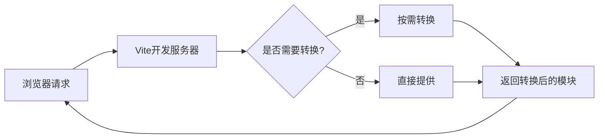

# Vite与插件

Vite（法语中"快"的意思，发音 `/vit/`）是一个现代化的前端构建工具，由Vue.js的创建者尤雨溪（Evan You）开发。它利用现代浏览器原生支持ES模块的特性，提供了极速的开发体验和高效的生产构建。本章将详细介绍Vite的核心概念、工作原理以及如何通过插件扩展其功能。

## Vite基础

### Vite的设计理念

Vite的核心设计理念是"按需编译"和"快速启动"，这与传统的打包工具有着本质的区别。

#### 开发环境：无打包的开发服务器

在开发环境中，Vite不会提前打包整个应用，而是利用浏览器原生的ES模块支持（ESM），直接提供源文件。当浏览器请求一个模块时，Vite才会对该模块进行转换和提供。这种按需编译的方式带来了几个关键优势：

1. **极速的服务器启动**：不需要等待整个应用打包完成
2. **即时的模块热更新（HMR）**：只需要精确地使失效并替换已编辑的模块
3. **按需编译**：只编译当前页面需要的文件



#### 生产环境：优化的构建过程

在生产环境中，Vite使用Rollup进行打包，提供了一系列优化：

1. **代码分割**：自动分割代码块，优化加载性能
2. **静态资源处理**：自动处理和优化图片、字体等静态资源
3. **CSS代码分割**：将CSS提取到单独的文件中
4. **预编译**：使用esbuild预编译依赖，显著提升构建速度

```javascript
// vite.config.js - 生产环境构建配置示例
export default {
  build: {
    // 设置输出目录
    outDir: 'dist',
    // 启用/禁用CSS代码分割
    cssCodeSplit: true,
    // 设置块大小警告的限制
    chunkSizeWarningLimit: 500,
    // 自定义rollup构建选项
    rollupOptions: {
      output: {
        // 自定义块文件名
        manualChunks(id) {
          if (id.includes('node_modules')) {
            return 'vendor';
          }
        }
      }
    }
  }
}
```

### 与传统构建工具的对比

Vite与传统构建工具（如Webpack、Parcel等）在开发体验和构建性能上有显著差异。

#### 开发服务器启动时间

传统构建工具在启动开发服务器时，需要先构建整个应用的依赖图谱，这在大型项目中可能需要几十秒甚至几分钟。而Vite通过按需编译的方式，可以在几百毫秒内启动开发服务器。

```
┌─────────────────────────────────────────────┐
│                                             │
│  传统打包工具启动过程                        │
│                                             │
│  ┌──────────┐  ┌──────────┐  ┌──────────┐  │
│  │ 解析入口 │→ │构建依赖图│→ │打包所有模块│  │
│  └──────────┘  └──────────┘  └──────────┘  │
│                                             │
└─────────────────────────────────────────────┘

┌─────────────────────────────────────────────┐
│                                             │
│  Vite启动过程                               │
│                                             │
│  ┌──────────┐  ┌──────────────────────┐     │
│  │ 启动服务 │→ │按需编译请求的模块(ESM)│     │
│  └──────────┘  └──────────────────────┘     │
│                                             │
└─────────────────────────────────────────────┘
```

#### 热模块替换（HMR）性能

传统工具的HMR通常需要重新构建整个模块及其依赖，而Vite的HMR只需要精确替换修改的模块，不受项目规模影响，始终保持快速响应。

#### 构建工具对比表

| 特性 | Vite | Webpack | Parcel |
|------|------|---------|--------|
| 开发服务器启动 | 极快（毫秒级） | 慢（秒到分钟） | 中等（秒级） |
| HMR速度 | 极快（毫秒级） | 中等到慢 | 中等 |
| 配置复杂度 | 低（简单直观） | 高（学习曲线陡） | 低（零配置） |
| 生态系统 | 成长中 | 非常成熟 | 中等 |
| 构建工具 | Rollup（生产） | 内置 | 内置 |
| 预构建工具 | esbuild（极快） | 无内置 | 无内置 |
| 原生ESM支持 | 完全支持 | 部分支持 | 部分支持 |

### 开发服务器与构建优化

#### Vite开发服务器的核心功能

Vite的开发服务器提供了多种开箱即用的功能：

1. **模块热替换（HMR）**：无需刷新页面即可应用代码更改
2. **CSS处理**：支持CSS预处理器（Sass、Less、Stylus等）
3. **静态资源处理**：支持导入静态资源，如图片、字体等
4. **TypeScript支持**：内置TypeScript支持，无需额外配置
5. **JSX支持**：通过插件支持React和Vue的JSX
6. **WebAssembly支持**：可以直接导入.wasm文件

```javascript
// 在Vite中导入各种资源的示例
import { createApp } from 'vue'
import App from './App.vue'
import './style.css'                 // 导入CSS
import sassStyles from './style.scss' // 导入Sass
import imgUrl from './img.png'        // 导入图片
import jsonData from './data.json'    // 导入JSON
import Worker from './worker?worker'  // 导入Web Worker
import wasmModule from './module.wasm' // 导入WebAssembly

createApp(App).mount('#app')
```

#### 构建优化技术

Vite在生产构建中采用了多种优化技术：

1. **依赖预构建**：使用esbuild（比传统JavaScript转译器快10-100倍）预构建依赖
2. **代码分割策略**：
   - 自动将异步导入的模块拆分为单独的块
   - 可配置的手动块分割
3. **CSS优化**：
   - 提取CSS到单独文件
   - 压缩CSS
   - 自动CSS前缀处理
4. **资源优化**：
   - 小型资源内联为base64
   - 大型资源使用内容哈希命名，支持长期缓存

```javascript
// vite.config.js - 构建优化配置示例
export default {
  build: {
    // 使用terser压缩代码
    minify: 'terser',
    // terser选项
    terserOptions: {
      compress: {
        drop_console: true,  // 移除console语句
        drop_debugger: true  // 移除debugger语句
      }
    },
    // 资源内联阈值（小于此值的资源将被内联为base64）
    assetsInlineLimit: 4096,
    // 启用CSS代码分割
    cssCodeSplit: true,
    // 自定义rollup构建选项
    rollupOptions: {
      output: {
        // 自定义入口点分块
        manualChunks: {
          // 将所有React相关库打包到一个chunk中
          'react-vendor': ['react', 'react-dom'],
          // 将所有其他依赖打包到另一个chunk中
          'vendor': ['lodash', 'axios']
        }
      }
    }
  }
}
```

## Vue3专用插件

Vite为Vue3提供了专门的插件，使Vue3应用开发变得更加高效和便捷。

### @vitejs/plugin-vue详解

`@vitejs/plugin-vue`是Vite官方提供的Vue3单文件组件(SFC)支持插件，它允许你在Vite项目中使用`.vue`文件。

#### 基本使用

```javascript
// vite.config.js
import { defineConfig } from 'vite'
import vue from '@vitejs/plugin-vue'

export default defineConfig({
  plugins: [vue()]
})
```

#### 高级配置选项

`@vitejs/plugin-vue`插件提供了多种配置选项，可以根据项目需求进行调整：

```javascript
// vite.config.js
import { defineConfig } from 'vite'
import vue from '@vitejs/plugin-vue'

export default defineConfig({
  plugins: [
    vue({
      // 是否启用响应式语法糖
      reactivityTransform: false,
      
      // 是否编译Vue模板为渲染函数
      // 设为false时会导入运行时编译器
      template: {
        compilerOptions: {
          // 将所有带短横线的标签视为自定义元素
          isCustomElement: (tag) => tag.includes('-')
        }
      },
      
      // 是否启用SFC <style> CSS变量注入
      // 默认为true
      cssVars: true,
      
      // 是否在生产环境移除模板中的注释
      // 默认为true
      comments: true
    })
  ]
})
```

#### 单文件组件特性支持

`@vitejs/plugin-vue`支持Vue3单文件组件的所有特性：

1. **`<script setup>`语法**：更简洁的组件编写方式
2. **CSS变量注入**：在`<style>`中使用组件状态
3. **`<style scoped>`**：CSS作用域隔离
4. **`<style module>`**：CSS模块化
5. **自定义块处理**：如`<docs>`、`<i18n>`等

```vue
<!-- 使用@vitejs/plugin-vue支持的Vue3特性示例 -->
<template>
  <div class="container">
    <h1 :class="$style.title">{{ title }}</h1>
    <p :style="{ color }">当前计数: {{ count }}</p>
    <button @click="increment">增加</button>
  </div>
</template>

<script setup>
import { ref, computed } from 'vue'

// 响应式状态
const count = ref(0)
const title = ref('Vue3 + Vite 示例')

// 计算属性
const color = computed(() => count.value > 5 ? 'red' : 'green')

// 方法
const increment = () => {
  count.value++
}

// 暴露给模板
defineExpose({
  reset: () => {
    count.value = 0
  }
})
</script>

<style scoped>
/* 作用域样式 */
.container {
  padding: 20px;
  border: 1px solid #ccc;
}

/* 使用v-bind注入响应式变量 */
button {
  background-color: v-bind(color);
  color: white;
  padding: 8px 16px;
  border: none;
  border-radius: 4px;
  cursor: pointer;
}
</style>

<style module>
/* CSS模块 */
.title {
  font-size: 24px;
  color: #333;
}
</style>
```

### @vitejs/plugin-vue-jsx使用

`@vitejs/plugin-vue-jsx`插件为Vite提供了Vue3 JSX/TSX支持，使开发者可以在Vue3项目中使用JSX语法。

#### 基本配置

```javascript
// vite.config.js
import { defineConfig } from 'vite'
import vue from '@vitejs/plugin-vue'
import vueJsx from '@vitejs/plugin-vue-jsx'

export default defineConfig({
  plugins: [
    vue(),
    vueJsx()
  ]
})
```

#### 高级配置选项

```javascript
// vite.config.js
import { defineConfig } from 'vite'
import vue from '@vitejs/plugin-vue'
import vueJsx from '@vitejs/plugin-vue-jsx'

export default defineConfig({
  plugins: [
    vue(),
    vueJsx({
      // 启用Babel插件
      // 默认为false
      babelPlugins: [
        // 添加额外的Babel插件
        '@babel/plugin-proposal-optional-chaining'
      ],
      
      // 自定义JSX转换选项
      transformOn: true, // 将on{Event}属性转换为onUpdate:{event}
      mergeProps: true,  // 合并class/style/onXXX处理器
      
      // 启用响应式语法糖
      // 默认为false
      reactivityTransform: false
    })
  ]
})
```

#### Vue3 JSX语法示例

```jsx
// 使用JSX编写Vue3组件示例
import { defineComponent, ref, computed } from 'vue'

export default defineComponent({
  name: 'JsxExample',
  
  setup() {
    const count = ref(0)
    const color = computed(() => count.value > 5 ? 'red' : 'green')
    
    const increment = () => {
      count.value++
    }
    
    return () => (
      <div class="container">
        <h1 style={{ color: color.value }}>JSX示例</h1>
        <p>当前计数: {count.value}</p>
        <button 
          onClick={increment}
          style={{ 
            backgroundColor: color.value,
            color: 'white',
            padding: '8px 16px',
            border: 'none',
            borderRadius: '4px'
          }}
        >
          增加
        </button>
        
        {/* 条件渲染 */}
        {count.value > 10 && <p>计数超过10了!</p>}
        
        {/* 列表渲染 */}
        <ul>
          {Array.from({ length: count.value }).map((_, index) => (
            <li key={index}>项目 {index + 1}</li>
          ))}
        </ul>
      </div>
    )
  }
})
```

#### JSX与SFC的对比与选择

| 特性 | JSX | 单文件组件(SFC) |
|------|-----|----------------|
| 语法 | JavaScript扩展 | HTML扩展 |
| 学习曲线 | 对React开发者友好 | 对HTML/CSS开发者友好 |
| 代码组织 | 逻辑与模板在一起 | 模板、逻辑、样式分离 |
| IDE支持 | 良好 | 非常好（专用插件） |
| 动态性 | 更灵活 | 更结构化 |
| 性能 | 相似 | 相似 |
| 适用场景 | 高度动态UI、从React迁移 | 大多数Vue应用场景 |

### 路由与状态管理插件

Vite生态系统中有多种插件可以简化Vue3应用中的路由和状态管理集成。

#### Vue Router集成

Vue Router是Vue.js的官方路由管理器，可以轻松集成到Vite项目中：

```bash
# 安装Vue Router
npm install vue-router@4
```

**基本设置**：

```javascript
// src/router/index.js
import { createRouter, createWebHistory } from 'vue-router'
import Home from '../views/Home.vue'

const routes = [
  {
    path: '/',
    name: 'Home',
    component: Home
  },
  {
    path: '/about',
    name: 'About',
    // 路由懒加载 - Vite会自动代码分割
    component: () => import('../views/About.vue')
  }
]

const router = createRouter({
  history: createWebHistory(),
  routes
})

export default router
```

**在主应用中使用**：

```javascript
// src/main.js
import { createApp } from 'vue'
import App from './App.vue'
import router from './router'

createApp(App)
  .use(router)
  .mount('#app')
```

#### Pinia状态管理

Pinia是Vue官方推荐的状态管理库，专为Vue3设计，可以无缝集成到Vite项目中：

```bash
# 安装Pinia
npm install pinia
```

**基本设置**：

```javascript
// src/store/index.js
import { createPinia } from 'pinia'

export const pinia = createPinia()
```

**创建Store**：

```javascript
// src/store/counter.js
import { defineStore } from 'pinia'

// 定义store
export const useCounterStore = defineStore('counter', {
  // 状态
  state: () => ({
    count: 0,
    name: 'Counter'
  }),
  
  // 计算属性
  getters: {
    doubleCount: (state) => state.count * 2,
    // 使用this访问其他getter
    doubleCountPlusOne() {
      return this.doubleCount + 1
    }
  },
  
  // 操作方法
  actions: {
    increment() {
      this.count++
    },
    async fetchData() {
      // 异步操作
      const response = await fetch('https://api.example.com/data')
      const data = await response.json()
      this.count = data.count
    }
  }
})
```

**在主应用中使用**：

```javascript
// src/main.js
import { createApp } from 'vue'
import App from './App.vue'
import router from './router'
import { pinia } from './store'

createApp(App)
  .use(router)
  .use(pinia)
  .mount('#app')
```

**在组件中使用**：

```vue
<template>
  <div>
    <h1>{{ store.name }}</h1>
    <p>Count: {{ store.count }}</p>
    <p>Double Count: {{ store.doubleCount }}</p>
    <button @click="store.increment">Increment</button>
    <button @click="store.fetchData">Fetch Data</button>
  </div>
</template>

<script setup>
import { useCounterStore } from '../store/counter'

// 获取store实例
const store = useCounterStore()
</script>
```

#### 路由与状态管理的自动导入插件

为了简化开发体验，可以使用`unplugin-auto-import`插件自动导入Vue、Vue Router和Pinia的API：

```bash
# 安装自动导入插件
npm install -D unplugin-auto-import
```

**配置**：

```javascript
// vite.config.js
import { defineConfig } from 'vite'
import vue from '@vitejs/plugin-vue'
import AutoImport from 'unplugin-auto-import/vite'

export default defineConfig({
  plugins: [
    vue(),
    AutoImport({
      // 自动导入Vue相关函数
      imports: [
        'vue',
        'vue-router',
        'pinia'
      ],
      // 为true时生成自动导入的声明文件
      dts: true,
      // 自动导入组件中使用的指令
      vueTemplate: true
    })
  ]
})
```

配置后，可以在组件中直接使用这些API，无需手动导入：

```vue
<template>
  <div>
    <p>Count: {{ count }}</p>
    <button @click="increment">Increment</button>
  </div>
</template>

<script setup>
// 无需导入ref，直接使用
const count = ref(0)

function increment() {
  count.value++
}

// 无需导入onMounted，直接使用
onMounted(() => {
  console.log('Component mounted')
})

// 无需导入useRoute/useRouter，直接使用
const route = useRoute()
const router = useRouter()

// 无需导入defineStore，直接使用
const useStore = defineStore('main', {
  state: () => ({ counter: 0 })
})
</script>
```

## 常用Vite插件

Vite的插件生态系统非常丰富，可以通过各种插件扩展Vite的功能。以下是一些常用的Vite插件。

### vite-plugin-pages

`vite-plugin-pages`是一个基于文件系统的路由生成插件，可以根据页面文件结构自动生成路由配置。

#### 安装

```bash
npm install -D vite-plugin-pages
```

#### 基本配置

```javascript
// vite.config.js
import { defineConfig } from 'vite'
import vue from '@vitejs/plugin-vue'
import Pages from 'vite-plugin-pages'

export default defineConfig({
  plugins: [
    vue(),
    Pages({
      // 页面目录
      dirs: 'src/pages',
      // 页面扩展名
      extensions: ['vue', 'md'],
      // 生成路由的路径
      routeBlockLang: 'yaml',
      // 排除的文件
      exclude: ['**/components/*.vue']
    })
  ]
})
```

#### 目录结构与路由生成规则

使用`vite-plugin-pages`后，可以通过文件系统结构自动生成路由：

```
src/pages/
  ├── index.vue               # / 
  ├── about.vue               # /about
  ├── users/
  │   ├── index.vue           # /users
  │   ├── [id].vue            # /users/:id (动态路由)
  │   └── profile.vue         # /users/profile
  └── posts/
      ├── [id].vue            # /posts/:id
      └── [...all].vue        # /posts/* (捕获所有路由)
```

#### 在组件中定义路由元数据

可以在Vue组件中使用`<route>`块定义路由元数据：

```vue
<route lang="yaml">
name: UserProfile
meta:
  requiresAuth: true
  title: 用户资料
</route>

<template>
  <div>用户资料页面</div>
</template>
```

#### 与Vue Router集成

```javascript
// src/router/index.js
import { createRouter, createWebHistory } from 'vue-router'
// 导入自动生成的路由
import routes from '~pages'

const router = createRouter({
  history: createWebHistory(),
  routes
})

// 路由守卫
router.beforeEach((to, from, next) => {
  // 检查路由元数据
  if (to.meta.requiresAuth && !isAuthenticated()) {
    next('/login')
  } else {
    next()
  }
})

export default router
```

### vite-plugin-pwa

`vite-plugin-pwa`是一个用于将Vite应用转换为渐进式Web应用(PWA)的插件。

#### 安装

```bash
npm install -D vite-plugin-pwa
```

#### 基本配置

```javascript
// vite.config.js
import { defineConfig } from 'vite'
import vue from '@vitejs/plugin-vue'
import { VitePWA } from 'vite-plugin-pwa'

export default defineConfig({
  plugins: [
    vue(),
    VitePWA({
      // 注册SW
      registerType: 'autoUpdate',
      // 包含的静态资源
      includeAssets: ['favicon.ico', 'robots.txt', 'apple-touch-icon.png'],
      // manifest配置
      manifest: {
        name: 'My Vue App',
        short_name: 'MyApp',
        description: 'My Awesome Vue App',
        theme_color: '#ffffff',
        icons: [
          {
            src: 'pwa-192x192.png',
            sizes: '192x192',
            type: 'image/png'
          },
          {
            src: 'pwa-512x512.png',
            sizes: '512x512',
            type: 'image/png'
          },
          {
            src: 'pwa-512x512.png',
            sizes: '512x512',
            type: 'image/png',
            purpose: 'any maskable'
          }
        ]
      },
      // 工作区配置
      workbox: {
        // 缓存策略
        runtimeCaching: [
          {
            urlPattern: /^https:\/\/api\.example\.com\/.*/i,
            handler: 'NetworkFirst',
            options: {
              cacheName: 'api-cache',
              expiration: {
                maxEntries: 100,
                maxAgeSeconds: 60 * 60 * 24 * 7 // 7天
              },
              cacheableResponse: {
                statuses: [0, 200]
              }
            }
          },
          {
            urlPattern: /\.(?:png|jpg|jpeg|svg|gif)$/,
            handler: 'CacheFirst',
            options: {
              cacheName: 'images-cache',
              expiration: {
                maxEntries: 50,
                maxAgeSeconds: 60 * 60 * 24 * 30 // 30天
              }
            }
          }
        ]
      }
    })
  ]
})
```

#### PWA功能与优势

1. **离线工作能力**：即使在没有网络连接的情况下也能访问应用
2. **安装到主屏幕**：用户可以将应用添加到主屏幕，提供类似原生应用的体验
3. **推送通知**：支持发送推送通知，提高用户参与度
4. **后台同步**：在网络恢复时自动同步数据
5. **性能提升**：通过缓存策略提高加载速度

#### 在应用中使用PWA功能

```javascript
// src/main.js
import { createApp } from 'vue'
import App from './App.vue'
import router from './router'
import { registerSW } from 'virtual:pwa-register'

// 注册Service Worker
const updateSW = registerSW({
  // 当有新版本时
  onNeedRefresh() {
    // 显示更新提示
    console.log('有新内容可用，请刷新')
  },
  // 当离线就绪时
  onOfflineReady() {
    console.log('应用已可离线使用')
  }
})

// 创建Vue应用
const app = createApp(App)
app.use(router)
app.mount('#app')

// 提供更新Service Worker的方法
app.config.globalProperties.$updateSW = updateSW
```

### unplugin系列插件

unplugin是一个跨构建工具的统一插件系统，支持Vite、Webpack、Rollup等多种构建工具。以下是几个常用的unplugin系列插件。

#### unplugin-vue-components

`unplugin-vue-components`是一个按需自动导入Vue组件的插件，无需手动导入即可使用组件。

```bash
npm install -D unplugin-vue-components
```

**基本配置**：

```javascript
// vite.config.js
import { defineConfig } from 'vite'
import vue from '@vitejs/plugin-vue'
import Components from 'unplugin-vue-components/vite'
import { ElementPlusResolver } from 'unplugin-vue-components/resolvers'

export default defineConfig({
  plugins: [
    vue(),
    Components({
      // 组件目录，默认为 src/components
      dirs: ['src/components', 'src/layouts'],
      // 组件扩展名
      extensions: ['vue'],
      // 是否深度搜索子目录
      deep: true,
      // 自定义组件解析器
      resolvers: [
        // 自动导入Element Plus组件
        ElementPlusResolver(),
        // 自定义解析器示例
        (name) => {
          // 处理特定前缀的组件
          if (name.startsWith('Icon')) {
            return { name, from: '@/icons' }
          }
        }
      ],
      // 生成类型声明文件
      dts: true
    })
  ]
})
```

**使用示例**：

```vue
<template>
  <!-- 无需导入，可
让我继续完成关于Vite与插件的内容：

#### unplugin-vue-components

`unplugin-vue-components`是一个按需自动导入Vue组件的插件，无需手动导入即可使用组件。

```bash
npm install -D unplugin-vue-components
```

**基本配置**：

```javascript
// vite.config.js
import { defineConfig } from 'vite'
import vue from '@vitejs/plugin-vue'
import Components from 'unplugin-vue-components/vite'
import { ElementPlusResolver } from 'unplugin-vue-components/resolvers'

export default defineConfig({
  plugins: [
    vue(),
    Components({
      // 组件目录，默认为 src/components
      dirs: ['src/components', 'src/layouts'],
      // 组件扩展名
      extensions: ['vue'],
      // 是否深度搜索子目录
      deep: true,
      // 自定义组件解析器
      resolvers: [
        // 自动导入Element Plus组件
        ElementPlusResolver(),
        // 自定义解析器示例
        (name) => {
          // 处理特定前缀的组件
          if (name.startsWith('Icon')) {
            return { name, from: '@/icons' }
          }
        }
      ],
      // 生成类型声明文件
      dts: true
    })
  ]
})
```

**使用示例**：

```vue
<template>
  <!-- 无需导入，可直接使用组件 -->
  <el-button type="primary">按钮</el-button>
  <MyComponent />
  <BaseCard title="卡片标题">
    卡片内容
  </BaseCard>
</template>

<script setup>
// 无需导入组件，插件会自动处理
</script>
```

#### unplugin-auto-import

`unplugin-auto-import`插件可以自动导入API，无需手动import语句。

```bash
npm install -D unplugin-auto-import
```

**基本配置**：

```javascript
// vite.config.js
import { defineConfig } from 'vite'
import vue from '@vitejs/plugin-vue'
import AutoImport from 'unplugin-auto-import/vite'

export default defineConfig({
  plugins: [
    vue(),
    AutoImport({
      // 自动导入的库
      imports: [
        'vue',
        'vue-router',
        'pinia',
        '@vueuse/core',
        {
          // 自定义导入
          'axios': [
            ['default', 'axios'] // import { default as axios } from 'axios'
          ],
          'lodash-es': [
            'debounce',
            'throttle'
          ]
        }
      ],
      // 自动导入的目录
      dirs: [
        './src/composables',
        './src/utils'
      ],
      // 生成声明文件
      dts: true,
      // Vue模板中自动导入
      vueTemplate: true,
      // 自定义解析器
      resolvers: [
        // 自动导入Element Plus相关函数，如ElMessage
        ElementPlusResolver()
      ]
    })
  ]
})
```

**使用示例**：

```vue
<template>
  <div>
    <p>Count: {{ count }}</p>
    <button @click="increment">增加</button>
  </div>
</template>

<script setup>
// 无需导入ref和onMounted，插件会自动处理
const count = ref(0)

function increment() {
  count.value++
  // 无需导入ElMessage
  ElMessage.success('计数增加了！')
}

onMounted(() => {
  console.log('组件已挂载')
})

// 无需导入useRouter
const router = useRouter()

// 无需导入自定义composables
const { useUserStore } = useStore()
</script>
```

#### unplugin-icons

`unplugin-icons`是一个按需自动导入各种图标库的插件。

```bash
npm install -D unplugin-icons @iconify/json
```

**基本配置**：

```javascript
// vite.config.js
import { defineConfig } from 'vite'
import vue from '@vitejs/plugin-vue'
import Icons from 'unplugin-icons/vite'
import IconsResolver from 'unplugin-icons/resolver'
import Components from 'unplugin-vue-components/vite'

export default defineConfig({
  plugins: [
    vue(),
    Icons({
      // 自动安装图标集
      autoInstall: true,
      // 编译为Vue组件
      compiler: 'vue3'
    }),
    Components({
      // 将图标注册为组件
      resolvers: [
        // 自动注册图标组件
        IconsResolver({
          // 前缀
          prefix: 'Icon',
          // 启用的图标集
          enabledCollections: ['mdi', 'carbon', 'ant-design', 'tabler']
        })
      ]
    })
  ]
})
```

**使用示例**：

```vue
<template>
  <div>
    <!-- 使用Material Design Icons -->
    <IconMdiHome />
    
    <!-- 使用Carbon Icons -->
    <IconCarbonUser />
    
    <!-- 使用Ant Design Icons -->
    <IconAntDesignGithubFilled />
    
    <!-- 使用Tabler Icons -->
    <IconTablerBrandVue />
  </div>
</template>

<script setup>
// 无需导入图标组件
</script>
```

### 其他实用Vite插件

除了上述插件外，还有许多其他实用的Vite插件可以提升开发体验和应用性能。

#### vite-plugin-inspect

用于检查Vite插件中间状态的插件，对调试非常有用。

```bash
npm install -D vite-plugin-inspect
```

```javascript
// vite.config.js
import { defineConfig } from 'vite'
import Inspect from 'vite-plugin-inspect'

export default defineConfig({
  plugins: [
    Inspect()
  ]
})
```

安装后，可以访问`http://localhost:3000/__inspect/`查看插件的中间状态和转换过程。

#### vite-plugin-mock

提供模拟数据服务的插件，支持开发环境和生产环境。

```bash
npm install -D vite-plugin-mock mockjs
```

```javascript
// vite.config.js
import { defineConfig } from 'vite'
import { viteMockServe } from 'vite-plugin-mock'

export default defineConfig({
  plugins: [
    viteMockServe({
      // 模拟数据目录
      mockPath: 'mock',
      // 开发环境启用
      localEnabled: true,
      // 生产环境启用
      prodEnabled: true,
      // 生产环境下，是否为异步加载
      injectCode: `
        import { setupProdMockServer } from './mockProdServer';
        setupProdMockServer();
      `
    })
  ]
})
```

**模拟数据示例**：

```javascript
// mock/user.js
export default [
  {
    url: '/api/users',
    method: 'get',
    response: () => {
      return {
        code: 0,
        data: [
          { id: 1, name: '张三', age: 25 },
          { id: 2, name: '李四', age: 30 },
          { id: 3, name: '王五', age: 28 }
        ]
      }
    }
  },
  {
    url: '/api/login',
    method: 'post',
    response: ({ body }) => {
      const { username, password } = body
      if (username === 'admin' && password === '123456') {
        return {
          code: 0,
          data: {
            token: 'mock-token',
            userInfo: {
              id: 1,
              name: 'Admin',
              role: 'administrator'
            }
          }
        }
      } else {
        return {
          code: 401,
          message: '用户名或密码错误'
        }
      }
    }
  }
]
```

#### vite-plugin-compression

用于生成gzip或brotli压缩文件的插件，减小生产环境的文件体积。

```bash
npm install -D vite-plugin-compression
```

```javascript
// vite.config.js
import { defineConfig } from 'vite'
import viteCompression from 'vite-plugin-compression'

export default defineConfig({
  plugins: [
    viteCompression({
      // 压缩算法
      algorithm: 'gzip',
      // 匹配文件
      include: /\.(js|css|html|svg|json)$/,
      // 压缩后是否删除原文件
      deleteOriginFile: false
    })
  ]
})
```

#### vite-plugin-imagemin

用于优化和压缩图片资源的插件。

```bash
npm install -D vite-plugin-imagemin
```

```javascript
// vite.config.js
import { defineConfig } from 'vite'
import viteImagemin from 'vite-plugin-imagemin'

export default defineConfig({
  plugins: [
    viteImagemin({
      // 无损压缩配置
      optipng: {
        optimizationLevel: 7
      },
      // 有损压缩配置
      pngquant: {
        quality: [0.8, 0.9]
      },
      // jpg压缩配置
      mozjpeg: {
        quality: 80
      },
      // svg压缩配置
      svgo: {
        plugins: [
          {
            name: 'removeViewBox'
          },
          {
            name: 'removeEmptyAttrs',
            active: false
          }
        ]
      }
    })
  ]
})
```

## 构建自定义Vite插件

Vite的插件系统基于Rollup的插件API，并添加了一些Vite特有的扩展。通过创建自定义插件，可以满足项目的特殊需求。

### Vite插件API基础

Vite插件是一个包含名称和各种钩子函数的对象，这些钩子函数会在构建过程的不同阶段被调用。

```javascript
// 基本插件结构
export default function myPlugin(options = {}) {
  return {
    // 插件名称
    name: 'vite-plugin-my-plugin',
    
    // Vite特有钩子
    configureServer(server) {
      // 配置开发服务器
    },
    
    configResolved(resolvedConfig) {
      // 存储最终解析的配置
    },
    
    // 通用钩子（与Rollup兼容）
    transform(code, id) {
      // 转换代码
      return code
    }
  }
}
```

### 常用插件钩子

Vite插件可以使用以下常用钩子：

1. **Vite特有钩子**：
   - `config`: 修改Vite配置
   - `configResolved`: 在配置解析后调用
   - `configureServer`: 配置开发服务器
   - `transformIndexHtml`: 转换index.html
   - `handleHotUpdate`: 自定义HMR更新处理

2. **通用钩子（与Rollup兼容）**：
   - `resolveId`: 解析模块ID
   - `load`: 加载模块
   - `transform`: 转换模块代码
   - `generateBundle`: 生成最终bundle

### 自定义插件示例

以下是一个简单的自定义Vite插件示例，用于在构建过程中注入环境变量和时间戳：

```javascript
// plugins/vite-plugin-env-info.js
export default function envInfoPlugin(options = {}) {
  const {
    // 是否注入构建时间
    injectBuildTime = true,
    // 是否注入环境信息
    injectEnvInfo = true,
    // 注入的全局变量名
    globalName = '__APP_INFO__'
  } = options
  
  return {
    name: 'vite-plugin-env-info',
    
    // 配置
    config(config) {
      // 修改Vite配置
      return {
        define: {
          // 定义全局常量
          __DEV__: config.mode === 'development'
        }
      }
    },
    
    // 配置解析后
    configResolved(resolvedConfig) {
      // 存储解析后的配置
      this.config = resolvedConfig
    },
    
    // 转换HTML
    transformIndexHtml(html) {
      if (!injectEnvInfo && !injectBuildTime) return html
      
      const infoObject = {}
      
      if (injectBuildTime) {
        infoObject.buildTime = new Date().toISOString()
      }
      
      if (injectEnvInfo) {
        infoObject.mode = this.config.mode
        infoObject.env = this.config.env
      }
      
      // 注入脚本
      const script = `<script>window.${globalName} = ${JSON.stringify(infoObject)}</script>`
      
      // 在</head>前插入脚本
      return html.replace('</head>', `${script}</head>`)
    },
    
    // 转换代码
    transform(code, id) {
      // 只处理JavaScript文件
      if (!id.endsWith('.js') && !id.endsWith('.ts')) return
      
      // 替换代码中的特定标记
      if (code.includes('/* @BUILD_TIME */')) {
        return code.replace(
          '/* @BUILD_TIME */',
          `'${new Date().toISOString()}'`
        )
      }
    }
  }
}
```

**使用自定义插件**：

```javascript
// vite.config.js
import { defineConfig } from 'vite'
import vue from '@vitejs/plugin-vue'
import envInfoPlugin from './plugins/vite-plugin-env-info'

export default defineConfig({
  plugins: [
    vue(),
    envInfoPlugin({
      injectBuildTime: true,
      injectEnvInfo: true,
      globalName: '__APP_INFO__'
    })
  ]
})
```

**在应用中使用**：

```javascript
// src/main.js
import { createApp } from 'vue'
import App from './App.vue'

// 使用插件注入的全局变量
console.log('应用信息:', window.__APP_INFO__)

// 使用插件替换的构建时间
const buildTime = /* @BUILD_TIME */

console.log('构建时间:', buildTime)

createApp(App).mount('#app')
```

### 插件开发最佳实践

开发Vite插件时，应遵循以下最佳实践：

1. **明确插件用途**：每个插件应该有明确的单一职责
2. **提供清晰的文档**：详细说明插件的功能、选项和使用方法
3. **处理错误**：妥善处理可能出现的错误，提供有用的错误信息
4. **考虑性能**：插件应该高效运行，避免不必要的操作
5. **遵循命名约定**：插件名称应以`vite-plugin-`开头
6. **提供TypeScript类型**：为插件选项和API提供类型定义
7. **兼容性考虑**：考虑与其他插件的兼容性

```javascript
// 插件TypeScript类型定义示例
interface MyPluginOptions {
  // 是否启用某功能
  enable?: boolean;
  // 输出目录
  outDir?: string;
  // 处理函数
  transform?: (code: string) => string;
}

export default function myPlugin(options: MyPluginOptions = {}) {
  // 插件实现
}
```

## 总结

Vite作为一个现代化的前端构建工具，通过其创新的开发服务器设计和丰富的插件生态系统，为Vue3应用开发提供了极速的开发体验和高效的生产构建。

本章介绍了Vite的核心概念和工作原理，详细讲解了Vue3专用插件的使用方法，以及各种常用Vite插件的配置和应用场景。通过这些插件，开发者可以大幅提高开发效率，简化项目配置，并为应用添加各种高级功能。

随着Vite生态系统的不断发展，越来越多的插件将会出现，为Vue3应用开发提供更多可能性。掌握Vite及其插件的使用，是现代Vue3开发的重要技能。