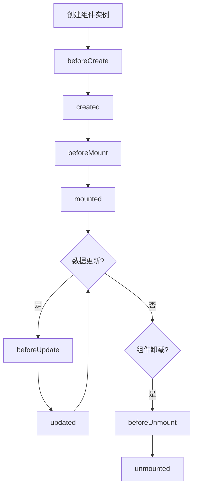

# 生命周期钩子

Vue3的生命周期钩子提供了一种在组件不同阶段执行代码的机制，通过合理使用这些钩子，我们可以更好地控制组件的行为和状态。

## 基础概念与实现

### [Vue3生命周期钩子](./2.5.1-Vue3生命周期钩子.md)
深入了解Vue3组件的生命周期各个阶段：
- 创建阶段：组件实例的初始化过程
- 挂载阶段：组件渲染到DOM的过程
- 更新阶段：组件数据变化时的处理
- 卸载阶段：组件销毁时的清理工作
- 特殊钩子：处理缓存组件和错误捕获

## 版本对比

### [与Vue2生命周期对比](./2.5.2-与Vue2生命周期对比.md)
了解Vue3相对于Vue2的生命周期变化：
- 命名变化：更直观的钩子命名
- 行为差异：setup的执行时机等变化
- 性能优化：更高效的生命周期实现
- 迁移策略：平滑升级的最佳实践

## 组合式API集成

### [组合式API中的生命周期](./2.5.3-组合式API中的生命周期.md)
掌握组合式API中的生命周期使用方式：
- 生命周期钩子的注册和使用
- 多个钩子的组合和顺序控制
- 在组合式函数中复用生命周期逻辑
- 实际应用场景和最佳实践

通过本章节的学习，您将能够：

1. 全面理解Vue3组件的生命周期流程
2. 掌握各个生命周期钩子的使用时机和方法
3. 了解Vue3相对于Vue2的生命周期改进
4. 在组合式API中灵活运用生命周期钩子
5. 处理常见的生命周期相关问题

生命周期钩子是Vue3中非常重要的概念，它们不仅帮助我们控制组件的行为，还为性能优化和资源管理提供了重要的切入点。通过合理使用这些钩子，我们可以构建更健壮和高效的Vue应用。

