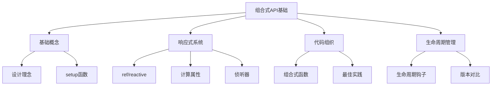

# 组合式API基础

组合式API是Vue3的核心特性，它提供了一种更灵活的组织组件逻辑的方式。通过组合式API，我们可以更好地复用代码，提高可维护性，并获得更好的TypeScript支持。

## 基础概念

### [组合式API设计理念](./2.1-组合式API设计理念.md)
深入理解组合式API的核心思想：
- 逻辑组织的灵活性
- 代码复用的改进
- 更好的类型推导
- 与选项式API的对比

### [setup函数与生命周期](./2.2-setup函数与生命周期.md)
掌握setup函数的使用方法：
- setup函数的基本用法
- 组件属性和上下文
- 生命周期钩子的集成
- 异步setup的处理

## 响应式系统

### 响应式核心
深入了解Vue3的响应式系统：

#### [ref与reactive对比](./2.3-响应式核心/2.3.1-ref与reactive对比.md)
- 两种响应式API的特点
- 使用场景对比
- 最佳实践指南

#### [ref及其相关API](./2.3-响应式核心/2.3.2-ref及其相关API.md)
- ref的基本用法
- 模板中的自动解包
- 相关工具函数

#### [reactive及其局限性](./2.3-响应式核心/2.3.3-reactive及其局限性.md)
- reactive的深层响应性
- 解构和展开的处理
- 常见限制和解决方案

#### [toRef与toRefs](./2.3-响应式核心/2.3.4-toRef与toRefs.md)
- 响应式引用的创建
- 解构响应式对象
- 保持响应性的技巧

#### [computed计算属性](./2.3-响应式核心/2.3.5-computed计算属性.md)
- 计算属性的基本用法
- 可写计算属性
- 性能优化考虑

#### [watch与watchEffect](./2.3-响应式核心/2.3.6-watch与watchEffect.md)
- 响应式数据监听
- 副作用清理
- 调试和性能优化

#### [响应式工具函数集](./2.3-响应式核心/2.3.7-响应式工具函数集.md)
- 常用工具函数
- 响应式转换
- 调试工具

## 代码组织

### 组合式函数
学习如何创建和使用可复用的逻辑单元：

#### [自定义组合式函数](./2.4-组合式函数/2.4.1-自定义组合式函数.md)
- 组合式函数的基本概念
- 创建自定义组合式函数
- 状态共享和隔离

#### [组合式函数最佳实践](./2.4-组合式函数/2.4.2-组合式函数最佳实践.md)
- 设计原则
- 常见陷阱
- 代码组织策略

#### [常用组合式函数示例](./2.4-组合式函数/2.4.3-常用组合式函数示例.md)
- 状态管理相关
- 生命周期相关
- DOM操作相关
- 网络请求相关

## 生命周期管理

### 生命周期钩子
了解组件生命周期的管理：

#### [Vue3生命周期钩子](./2.5-生命周期钩子/2.5.1-Vue3生命周期钩子.md)
- 完整的生命周期图解
- 各个钩子的使用时机
- 最佳实践指南

#### [与Vue2生命周期对比](./2.5-生命周期钩子/2.5.2-与Vue2生命周期对比.md)
- 命名变化
- 行为差异
- 迁移策略

#### [组合式API中的生命周期](./2.5-生命周期钩子/2.5.3-组合式API中的生命周期.md)
- 生命周期钩子的使用
- 多个钩子的组合
- 实际应用场景

通过本章节的学习，您将能够：

1. 理解组合式API的核心概念和优势
2. 掌握setup函数的使用方法
3. 熟练运用响应式系统的各种API
4. 创建和管理自定义组合式函数
5. 正确处理组件的生命周期

组合式API为Vue3带来了更大的灵活性和更好的代码组织方式。通过合理使用这些特性，我们可以构建出更易维护、更高效的Vue应用。

