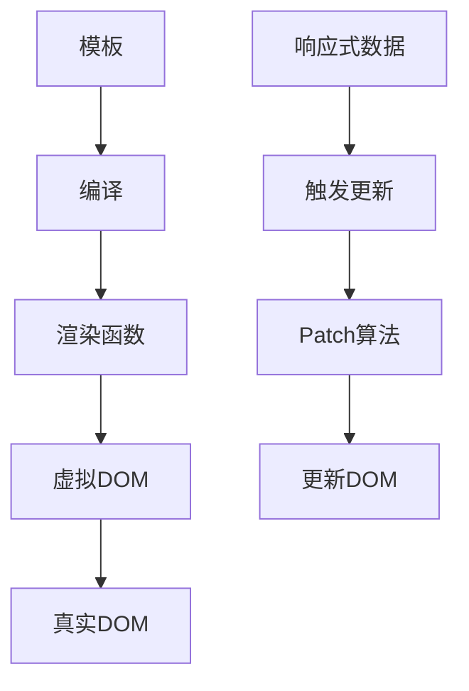

# Vue3渲染机制解析

## 虚拟DOM原理

### 基础实现

```typescript:c:\project\kphub\src\components\vdom\VirtualDOM.ts
import { h, VNode } from 'vue'

// 虚拟DOM节点示例
interface MyVNode {
  type: string | object
  props: Record<string, any>
  children: MyVNode[] | string[]
}

// 创建虚拟DOM节点
const createVNode = (
  type: string,
  props: Record<string, any> = {},
  children: any[] = []
): MyVNode => ({
  type,
  props,
  children
})

// 简单的虚拟DOM示例
const vdom = createVNode('div', { class: 'container' }, [
  createVNode('h1', { class: 'title' }, ['Hello']),
  createVNode('p', { style: 'color: blue' }, ['Virtual DOM'])
])

// Vue3的虚拟DOM使用
export default {
  setup() {
    return () => h('div', { class: 'container' }, [
      h('h1', { class: 'title' }, 'Hello'),
      h('p', { style: { color: 'blue' } }, 'Virtual DOM')
    ])
  }
}
```

### 差异对比算法

```typescript:c:\project\kphub\src\components\vdom\DiffAlgorithm.ts
import { h, ref, onMounted, nextTick } from 'vue'

export default {
  setup() {
    const list = ref(['A', 'B', 'C'])
    
    // 模拟列表更新
    const updateList = async () => {
      list.value = ['B', 'A', 'D']
      
      // 等待更新完成
      await nextTick()
      console.log('DOM已更新')
    }
    
    return () => h('div', {}, [
      // 列表渲染
      ...list.value.map(item =>
        h('div', { key: item }, item)
      ),
      // 更新按钮
      h('button', { onClick: updateList }, '更新列表')
    ])
  }
}
```

## 渲染管线

### 完整渲染流程

```typescript:c:\project\kphub\src\components\pipeline\RenderPipeline.ts
import { defineComponent, ref, onMounted, onUpdated, onBeforeUnmount } from 'vue'

export default defineComponent({
  setup() {
    const count = ref(0)
    
    // 编译阶段（开发环境可见）
    console.log('模板编译为渲染函数')
    
    // 挂载阶段
    onMounted(() => {
      console.log('组件已挂载')
    })
    
    // 更新阶段
    onUpdated(() => {
      console.log('组件已更新')
    })
    
    // 卸载阶段
    onBeforeUnmount(() => {
      console.log('组件即将卸载')
    })
    
    return () => h('div', [
      h('p', `计数: ${count.value}`),
      h('button', {
        onClick: () => count.value++
      }, '增加')
    ])
  }
})
```

## 静态提升与缓存

### 优化示例

```vue:c:\project\kphub\src\components\optimization\StaticHoisting.vue
<script setup>
import { ref } from 'vue'

const dynamicText = ref('动态内容')
const onClick = () => console.log('点击')
</script>

<template>
  <!-- 静态节点 -->
  <div class="static">
    <h1>静态标题</h1>
    <p>静态段落</p>
  </div>
  
  <!-- 混合节点 -->
  <div class="mixed">
    <h2>{{ dynamicText }}</h2>
    <p>静态文本</p>
    <button @click="onClick">
      点击我
    </button>
  </div>
</template>

<!-- 编译后的渲染函数（示意） -->
<script>
const _hoisted_1 = /*#__PURE__*/ _createVNode("div", { class: "static" }, [
  /*#__PURE__*/ _createVNode("h1", null, "静态标题"),
  /*#__PURE__*/ _createVNode("p", null, "静态段落")
])

export default {
  setup() {
    const dynamicText = ref('动态内容')
    
    return () => {
      return [
        _hoisted_1, // 静态节点提升
        _createVNode("div", { class: "mixed" }, [
          _createVNode("h2", null, dynamicText.value),
          _hoisted_2, // 静态p标签提升
          _createVNode("button", {
            onClick: _cache[0] || (_cache[0] = () => onClick())
          }, "点击我")
        ])
      ]
    }
  }
}
</script>
```

## 编译优化

### Block Tree实现

```typescript:c:\project\kphub\src\components\compiler\BlockTree.ts
import { defineComponent, ref } from 'vue'

export default defineComponent({
  setup() {
    const visible = ref(true)
    const items = ref(['A', 'B', 'C'])
    
    return () => (
      <div>
        {/* Block 1: 条件块 */}
        {visible.value ? (
          <div class="content">
            <h1>标题</h1>
            <p>内容</p>
          </div>
        ) : null}
        
        {/* Block 2: 列表块 */}
        <ul>
          {items.value.map(item => (
            <li key={item}>{item}</li>
          ))}
        </ul>
      </div>
    )
  }
})
```

### 自定义渲染器

```typescript:c:\project\kphub\src\components\compiler\CustomRenderer.ts
import { createRenderer } from 'vue'

// 自定义渲染器
const renderer = createRenderer({
  createElement(type) {
    // 创建元素
    return document.createElement(type)
  },
  
  setElementText(node, text) {
    // 设置文本
    node.textContent = text
  },
  
  insert(child, parent, anchor = null) {
    // 插入节点
    parent.insertBefore(child, anchor)
  },
  
  // 其他必要的渲染方法...
  patchProp(el, key, prevValue, nextValue) {
    // 属性更新
    if (key === 'class') {
      el.className = nextValue || ''
    } else if (key === 'style') {
      if (nextValue) {
        Object.assign(el.style, nextValue)
      }
    } else if (key.startsWith('on')) {
      // 事件处理
      const eventName = key.slice(2).toLowerCase()
      if (prevValue) {
        el.removeEventListener(eventName, prevValue)
      }
      if (nextValue) {
        el.addEventListener(eventName, nextValue)
      }
    } else {
      // 其他属性
      el.setAttribute(key, nextValue)
    }
  }
})
```

Vue3的渲染机制主要包括以下几个方面：

1. 虚拟DOM：
   - 使用JavaScript对象描述UI
   - 高效的差异对比算法
   - 跨平台渲染能力

2. 渲染管线：
   - 模板编译优化
   - 响应式数据追踪
   - 高效的更新机制

3. 静态优化：
   - 静态节点提升
   - 事件监听器缓存
   - PatchFlags标记

4. 编译优化：
   - Block Tree结构
   - 动态节点追踪
   - 自定义渲染器



使用建议：

1. 性能优化：
   - 合理使用静态提升
   - 避免不必要的动态节点
   - 利用编译优化特性

2. 开发实践：
   - 理解虚拟DOM的工作原理
   - 合理组织组件结构
   - 使用编译时提示

3. 调试技巧：
   - 使用Vue DevTools
   - 观察更新过程
   - 分析性能瓶颈

通过深入理解Vue3的渲染机制，我们可以更好地优化应用性能，编写高质量的代码。