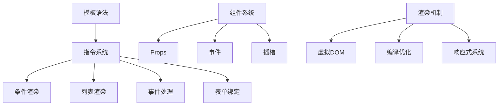

# Vue3模板与渲染

Vue3提供了强大的模板系统和渲染机制，通过声明式的方式来构建用户界面。本章节将全面介绍Vue3的模板与渲染相关知识，帮助您掌握Vue3的核心开发能力。

## 章节概述

### [模板语法与指令](./3.1-模板语法与指令.md)
掌握Vue3的基础模板语法和指令系统，包括文本插值、属性绑定、条件渲染、列表渲染等核心概念，为构建动态用户界面打下基础。

### [类与样式绑定](./3.2-类与样式绑定.md)
深入学习Vue3中的类名和样式绑定机制，包括对象语法、数组语法、组件绑定等，实现灵活的样式控制和主题切换。

### [条件与列表渲染](./3.3-条件与列表渲染.md)
详细探讨条件渲染和列表渲染的实现方式，包括v-if/v-show的使用场景、v-for的列表渲染技巧，以及性能优化策略。

### [事件处理机制](./3.4-事件处理机制.md)
了解Vue3的事件处理系统，包括事件监听、修饰符使用、按键修饰符等，实现丰富的用户交互功能。

### [表单输入绑定](./3.5-表单输入绑定.md)
掌握表单处理和双向数据绑定，包括各种表单元素的处理方式、修饰符使用，以及自定义组件的v-model实现。

### [模板引用(ref)](./3.6-模板引用(ref).md)
学习如何通过模板引用直接访问DOM元素和组件实例，处理特殊场景下的DOM操作需求。

### [组件基础](./3.7-组件基础.md)
理解Vue3组件系统的基础概念，包括组件注册、通信机制、生命周期等，为构建可复用的组件打下基础。

### [渲染函数与JSX](./3.8-渲染函数与JSX.md)
探索Vue3中的编程式渲染方案，掌握渲染函数的使用和JSX语法，处理复杂的动态渲染场景。

### [Vue3渲染机制解析](./3.9-Vue3渲染机制解析.md)
深入理解Vue3的渲染原理，包括虚拟DOM、渲染管线、编译优化等核心概念，提升开发效率和应用性能。

## 学习路径

1. 首先学习基础的模板语法和指令系统，掌握Vue3的声明式渲染方式
2. 深入理解样式处理和条件/列表渲染，实现动态界面
3. 掌握事件处理和表单绑定，处理用户交互
4. 学习组件系统和高级渲染特性，构建复杂应用
5. 理解渲染机制，优化应用性能

## 重要概念

通过系统学习本章节内容，您将能够：

- 熟练使用Vue3的模板语法和指令系统
- 掌握组件开发和状态管理
- 理解Vue3的渲染原理和优化策略
- 构建高性能的Vue3应用

让我们开始深入学习Vue3的模板与渲染体系。