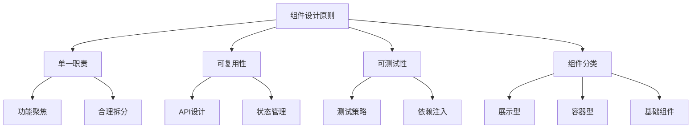

# 组件设计原则

## 单一职责原则

### 功能聚焦示例

```vue:c:\project\kphub\src\components\principles\SingleResponsibility.vue
<script setup>
// 错误示例：一个组件承担多个职责
const BadUserCard = {
  props: ['user'],
  template: `
    <div class="user-card">
      <h2>{{ user.name }}</h2>
      <div class="stats">
        <div>关注: {{ user.followers }}</div>
        <div>文章: {{ user.posts }}</div>
      </div>
      <!-- 不应该在这里处理复杂的表单逻辑 -->
      <form @submit.prevent="handleSubmit">
        <input v-model="message" />
        <button>发送消息</button>
      </form>
    </div>
  `
}

// 正确示例：职责分离
const UserProfile = {
  props: ['user'],
  template: `
    <div class="user-profile">
      <h2>{{ user.name }}</h2>
      <UserStats :stats="user.stats" />
    </div>
  `
}

const UserStats = {
  props: ['stats'],
  template: `
    <div class="user-stats">
      <div>关注: {{ stats.followers }}</div>
      <div>文章: {{ stats.posts }}</div>
    </div>
  `
}

const MessageForm = {
  props: ['userId'],
  emits: ['send'],
  template: `
    <form @submit.prevent="$emit('send', message)">
      <input v-model="message" />
      <button>发送消息</button>
    </form>
  `
}
</script>
```

## 可复用性设计

### API设计示例

```vue:c:\project\kphub\src\components\principles\Reusability.vue
<script setup>
import { ref, computed } from 'vue'

// 可复用的基础按钮组件
const BaseButton = {
  props: {
    // 明确的API设计
    type: {
      type: String,
      default: 'default',
      validator: value => ['default', 'primary', 'danger'].includes(value)
    },
    size: {
      type: String,
      default: 'medium',
      validator: value => ['small', 'medium', 'large'].includes(value)
    },
    disabled: Boolean
  },
  emits: ['click'],
  setup(props, { emit }) {
    // 计算样式类
    const buttonClass = computed(() => ({
      [`btn-${props.type}`]: true,
      [`btn-${props.size}`]: true,
      'is-disabled': props.disabled
    }))

    // 事件处理
    const handleClick = (event) => {
      if (!props.disabled) {
        emit('click', event)
      }
    }

    return {
      buttonClass,
      handleClick
    }
  }
}

// 使用示例
const MyComponent = {
  setup() {
    const handleClick = () => {
      console.log('按钮点击')
    }

    return () => (
      <BaseButton
        type="primary"
        size="large"
        onClick={handleClick}
      >
        点击我
      </BaseButton>
    )
  }
}
</script>
```

## 可测试性

### 测试友好设计

```vue:c:\project\kphub\src\components\principles\Testability.vue
<script setup>
import { ref, inject } from 'vue'

// 依赖注入的服务
const userService = {
  async getUser(id) {
    return { id, name: '测试用户' }
  }
}

// 可测试的组件设计
const UserProfile = {
  props: {
    userId: {
      type: Number,
      required: true
    }
  },
  setup(props) {
    // 通过依赖注入获取服务
    const service = inject('userService', userService)
    const user = ref(null)
    const error = ref(null)

    // 可测试的异步操作
    const loadUser = async () => {
      try {
        user.value = await service.getUser(props.userId)
      } catch (e) {
        error.value = e.message
      }
    }

    return {
      user,
      error,
      loadUser
    }
  }
}
</script>

<!-- 对应的测试代码 -->
<script>
import { mount } from '@vue/test-utils'

describe('UserProfile', () => {
  test('加载用户信息', async () => {
    const mockService = {
      getUser: vi.fn().mockResolvedValue({ id: 1, name: '测试用户' })
    }

    const wrapper = mount(UserProfile, {
      props: {
        userId: 1
      },
      global: {
        provide: {
          userService: mockService
        }
      }
    })

    await wrapper.vm.loadUser()
    expect(wrapper.text()).toContain('测试用户')
  })
})
</script>
```

## 组件分类与层次

### 组件层次结构

```vue:c:\project\kphub\src\components\principles\ComponentHierarchy.vue
<script setup>
// 1. 展示型组件 - 纯展示，无状态
const DisplayCard = {
  props: ['title', 'content'],
  template: `
    <div class="card">
      <h3>{{ title }}</h3>
      <p>{{ content }}</p>
    </div>
  `
}

// 2. 容器型组件 - 处理数据和状态
const UserContainer = {
  setup() {
    const users = ref([])
    const loading = ref(false)

    const fetchUsers = async () => {
      loading.value = true
      try {
        users.value = await fetchUserData()
      } finally {
        loading.value = false
      }
    }

    return {
      users,
      loading,
      fetchUsers
    }
  }
}

// 3. 通用基础组件
const BaseInput = {
  props: ['modelValue'],
  emits: ['update:modelValue'],
  template: `
    <input
      :value="modelValue"
      @input="$emit('update:modelValue', $event.target.value)"
      class="base-input"
    >
  `
}

// 4. 业务组件
const UserRegistration = {
  setup() {
    const form = ref({
      username: '',
      email: '',
      password: ''
    })

    const handleSubmit = async () => {
      // 业务逻辑处理
    }

    return {
      form,
      handleSubmit
    }
  }
}

// 5. 布局组件
const PageLayout = {
  template: `
    <div class="layout">
      <header>
        <slot name="header"></slot>
      </header>
      <main>
        <slot></slot>
      </main>
      <footer>
        <slot name="footer"></slot>
      </footer>
    </div>
  `
}
</script>
```

组件设计原则是构建可维护、可扩展Vue应用的关键。主要包括：

1. 单一职责原则：
   - 每个组件只做一件事
   - 功能内聚，职责明确
   - 适度拆分，避免过度设计

2. 可复用性设计：
   - 统一的API设计规范
   - 避免组件间紧耦合
   - 合理的状态管理

3. 可测试性：
   - 依赖注入便于测试
   - 清晰的组件边界
   - 完善的错误处理

4. 组件分类：
   - 展示型组件：纯UI展示
   - 容器型组件：状态管理
   - 基础组件：通用功能
   - 业务组件：特定业务
   - 布局组件：页面结构



使用建议：

1. 组件设计：
   - 从小做起，逐步抽象
   - 保持组件的独立性
   - 明确组件的职责

2. API设计：
   - 简单直观的接口
   - 完善的类型定义
   - 合理的默认值

3. 测试策略：
   - 单元测试覆盖
   - 组件隔离测试
   - 边界情况处理

通过遵循这些原则，我们可以构建出高质量的Vue组件库。