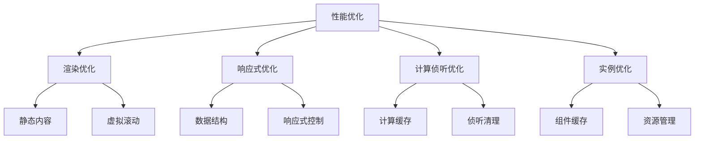

# 组件性能优化策略

## 渲染性能优化

### 静态内容优化

```vue:c:\project\kphub\src\components\optimization\StaticContent.vue
<script setup>
import { ref } from 'vue'

const count = ref(0)
const items = ref([])

// 加载大量数据
for (let i = 0; i < 1000; i++) {
  items.value.push({
    id: i,
    text: `项目 ${i}`
  })
}
</script>

<template>
  <!-- 使用v-once优化静态内容 -->
  <header v-once>
    <h1>性能优化示例</h1>
    <p>这段内容只会渲染一次</p>
  </header>

  <!-- 使用v-memo优化列表渲染 -->
  <ul>
    <li
      v-for="item in items"
      :key="item.id"
      v-memo="[item.id]"
    >
      {{ item.text }}
    </li>
  </ul>

  <div>计数: {{ count }}</div>
</template>
```

### 虚拟滚动实现

```vue:c:\project\kphub\src\components\optimization\VirtualScroll.vue
<script setup>
import { ref, computed } from 'vue'

const items = ref(Array.from({ length: 10000 }, (_, i) => ({
  id: i,
  text: `项目 ${i}`
})))

const itemHeight = 30
const visibleCount = 10
const scrollTop = ref(0)

// 计算可见项
const visibleItems = computed(() => {
  const start = Math.floor(scrollTop.value / itemHeight)
  const end = start + visibleCount
  return items.value.slice(start, end)
})

// 计算总高度
const totalHeight = computed(() => 
  items.value.length * itemHeight
)

// 计算偏移量
const offsetY = computed(() => 
  Math.floor(scrollTop.value / itemHeight) * itemHeight
)

function handleScroll(event) {
  scrollTop.value = event.target.scrollTop
}
</script>

<template>
  <div
    class="virtual-scroll"
    @scroll="handleScroll"
    :style="{ height: visibleCount * itemHeight + 'px' }"
  >
    <div
      class="scroll-container"
      :style="{ height: totalHeight + 'px' }"
    >
      <div
        class="items"
        :style="{ transform: `translateY(${offsetY}px)` }"
      >
        <div
          v-for="item in visibleItems"
          :key="item.id"
          class="item"
          :style="{ height: itemHeight + 'px' }"
        >
          {{ item.text }}
        </div>
      </div>
    </div>
  </div>
</template>

<style scoped>
.virtual-scroll {
  overflow-y: auto;
  position: relative;
  border: 1px solid #ccc;
}

.scroll-container {
  position: relative;
}

.items {
  position: absolute;
  width: 100%;
}

.item {
  border-bottom: 1px solid #eee;
  padding: 5px;
}
</style>
```

## 响应式优化

### 响应式数据结构优化

```vue:c:\project\kphub\src\components\optimization\ReactiveOptimization.vue
<script setup>
import { ref, shallowRef, shallowReactive } from 'vue'

// 使用Object.freeze优化大数据
const frozenData = Object.freeze({
  list: Array.from({ length: 1000 }, (_, i) => ({
    id: i,
    text: `项目 ${i}`
  }))
})

// 使用shallowRef优化大对象
const largeObject = shallowRef({
  data: new Array(1000).fill(0),
  metadata: {
    timestamp: Date.now()
  }
})

// 使用shallowReactive优化嵌套对象
const state = shallowReactive({
  user: {
    profile: {
      name: '张三',
      age: 25
    }
  },
  settings: {
    theme: 'light'
  }
})

// 更新优化
function updateData() {
  // 整体替换而不是修改属性
  largeObject.value = {
    ...largeObject.value,
    metadata: {
      timestamp: Date.now()
    }
  }
}
</script>

<template>
  <div>
    <!-- 展示冻结数据 -->
    <div>
      总项目数: {{ frozenData.list.length }}
    </div>

    <!-- 展示大对象数据 -->
    <div>
      更新时间: {{ largeObject.metadata.timestamp }}
    </div>

    <!-- 展示浅层响应式数据 -->
    <div>
      用户名: {{ state.user.profile.name }}
    </div>
  </div>
</template>
```

## 计算属性与侦听器优化

### 优化计算和侦听

```vue:c:\project\kphub\src\components\optimization\ComputedWatcher.vue
<script setup>
import { ref, computed, watch, watchEffect } from 'vue'

const items = ref([])
const searchText = ref('')
const sortBy = ref('name')

// 优化计算属性
const filteredItems = computed(() => {
  console.log('计算过滤项目')
  return items.value
    .filter(item => 
      item.name.includes(searchText.value)
    )
    .sort((a, b) => 
      a[sortBy.value] > b[sortBy.value] ? 1 : -1
    )
})

// 优化侦听器
watch(
  searchText,
  (newValue, oldValue) => {
    console.log('搜索文本变化:', newValue)
  },
  {
    // 防抖优化
    debounce: 300
  }
)

// 自动清理的副作用
watchEffect((onCleanup) => {
  const controller = new AbortController()
  const { signal } = controller
  
  fetch(`/api/search?q=${searchText.value}`, { signal })
    .then(response => response.json())
    .then(data => {
      items.value = data
    })
  
  // 清理函数
  onCleanup(() => {
    controller.abort()
  })
})
</script>
```

## 组件实例优化

### 组件缓存与懒加载

```vue:c:\project\kphub\src\components\optimization\ComponentOptimization.vue
<script setup>
import { defineAsyncComponent, onMounted, onUnmounted } from 'vue'

// 异步组件
const AsyncComponent = defineAsyncComponent(() => 
  import('./HeavyComponent.vue')
)

// 预加载组件
const preloadComponent = () => {
  const component = import('./HeavyComponent.vue')
}

// 资源清理
const cleanup = () => {
  // 清理定时器
  clearInterval(timer)
  // 清理事件监听
  window.removeEventListener('resize', handleResize)
}

onMounted(() => {
  // 添加事件监听
  window.addEventListener('resize', handleResize)
})

onUnmounted(() => {
  cleanup()
})
</script>

<template>
  <!-- 使用keep-alive缓存组件 -->
  <keep-alive>
    <component
      :is="currentComponent"
      v-if="showComponent"
    />
  </keep-alive>

  <!-- 懒加载组件 -->
  <Suspense>
    <template #default>
      <AsyncComponent />
    </template>
    <template #fallback>
      <div>加载中...</div>
    </template>
  </Suspense>
</template>
```

Vue3组件性能优化涉及多个方面，主要包括：

1. 渲染性能优化：
   - 使用v-once处理静态内容
   - v-memo减少不必要的重渲染
   - 虚拟滚动处理大列表
   - 组件懒加载

2. 响应式优化：
   - 合理使用shallowRef/shallowReactive
   - Object.freeze处理只读数据
   - 优化响应式数据结构

3. 计算与侦听优化：
   - 合理使用计算属性缓存
   - 优化侦听器性能
   - 及时清理副作用

4. 实例优化：
   - keep-alive缓存组件
   - 异步组件加载
   - 防止内存泄漏



使用建议：

1. 渲染优化：
   - 识别并缓存静态内容
   - 合理使用虚拟滚动
   - 按需加载组件

2. 响应式处理：
   - 避免深层响应式
   - 合理使用不可变数据
   - 优化数据结构

3. 性能监控：
   - 使用Vue DevTools
   - 监控关键性能指标
   - 及时优化瓶颈

通过合理应用这些优化策略，可以显著提升Vue应用的性能表现。