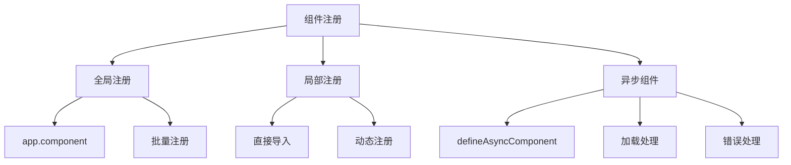

# 组件注册与异步组件

## 全局组件注册

### 基础注册方法

```typescript:c:\project\kphub\src\main.ts
import { createApp } from 'vue'
import App from './App.vue'
import BaseButton from './components/BaseButton.vue'
import BaseInput from './components/BaseInput.vue'

const app = createApp(App)

// 单个组件注册
app.component('BaseButton', BaseButton)

// 批量注册组件
const components = {
  BaseInput,
  BaseCard: () => import('./components/BaseCard.vue')
}

Object.entries(components).forEach(([name, component]) => {
  app.component(name, component)
})

app.mount('#app')
```

### 自动化注册

```typescript:c:\project\kphub\src\utils\registerComponents.ts
import { App } from 'vue'

// 自动注册全局组件
export function registerGlobalComponents(app: App) {
  // 获取所有基础组件
  const components = import.meta.glob('../components/base/*.vue')
  
  Object.entries(components).forEach(([path, component]) => {
    // 提取组件名
    const componentName = path
      .split('/')
      .pop()
      ?.replace(/\.\w+$/, '')
    
    if (componentName) {
      app.component(componentName, component)
    }
  })
}
```

## 局部组件注册

### 组件内注册

```vue:c:\project\kphub\src\components\registration\LocalRegistration.vue
<script setup>
import { defineAsyncComponent, shallowRef } from 'vue'
import ChildComponent from './ChildComponent.vue'

// 常规导入
const StaticComponent = {
  template: `
    <div class="static">
      静态组件
    </div>
  `
}

// 异步导入
const AsyncChild = defineAsyncComponent(() =>
  import('./AsyncChild.vue')
)

// 动态组件注册
const currentComponent = shallowRef(null)

const loadComponent = async (name) => {
  try {
    const component = await import(`./components/${name}.vue`)
    currentComponent.value = component.default
  } catch (error) {
    console.error('组件加载失败:', error)
  }
}
</script>

<template>
  <div class="container">
    <!-- 使用静态组件 -->
    <StaticComponent />
    <ChildComponent />
    
    <!-- 使用异步组件 -->
    <AsyncChild />
    
    <!-- 动态组件 -->
    <component
      :is="currentComponent"
      v-if="currentComponent"
    />
    
    <button @click="loadComponent('DynamicComponent')">
      加载动态组件
    </button>
  </div>
</template>
```

## 异步组件

### 完整配置示例

```vue:c:\project\kphub\src\components\async\AsyncComponentDemo.vue
<script setup>
import { defineAsyncComponent, ref } from 'vue'

// 基础异步组件
const SimpleAsync = defineAsyncComponent(() =>
  import('./SimpleComponent.vue')
)

// 完整配置的异步组件
const ComplexAsync = defineAsyncComponent({
  // 加载函数
  loader: () => import('./ComplexComponent.vue'),
  
  // 加载中组件
  loadingComponent: {
    template: `
      <div class="loading">
        <span class="spinner"></span>
        加载中...
      </div>
    `
  },
  
  // 错误组件
  errorComponent: {
    template: `
      <div class="error">
        组件加载失败
        <button @click="$emit('retry')">重试</button>
      </div>
    `
  },
  
  // 延迟显示加载中组件的时间
  delay: 200,
  
  // 超时时间
  timeout: 3000,
  
  // 加载失败后是否重试
  onError(error, retry, fail, attempts) {
    if (attempts <= 3) {
      // 重试
      retry()
    } else {
      // 失败
      fail()
    }
  }
})

// 控制加载
const showComponent = ref(false)
</script>

<template>
  <div class="async-demo">
    <!-- 简单异步组件 -->
    <SimpleAsync v-if="showComponent" />
    
    <!-- 完整配置的异步组件 -->
    <Suspense>
      <template #default>
        <ComplexAsync />
      </template>
      <template #fallback>
        <div>加载中...</div>
      </template>
    </Suspense>
    
    <button @click="showComponent = !showComponent">
      切换显示
    </button>
  </div>
</template>

<style scoped>
.loading {
  padding: 20px;
  text-align: center;
}

.error {
  color: red;
  padding: 20px;
}

.spinner {
  display: inline-block;
  width: 20px;
  height: 20px;
  border: 2px solid #ccc;
  border-top-color: #333;
  border-radius: 50%;
  animation: spin 1s infinite linear;
}

@keyframes spin {
  to { transform: rotate(360deg); }
}
</style>
```

## 组件懒加载最佳实践

### 路由懒加载

```typescript:c:\project\kphub\src\router\index.ts
import { createRouter, createWebHistory } from 'vue-router'

const router = createRouter({
  history: createWebHistory(),
  routes: [
    {
      path: '/',
      component: () => import('../views/Home.vue')
    },
    {
      path: '/about',
      // 使用注释进行分块
      component: () => import(/* webpackChunkName: "about" */ '../views/About.vue')
    },
    {
      path: '/dashboard',
      // 预加载下一页
      component: () => import(/* webpackPrefetch: true */ '../views/Dashboard.vue')
    }
  ]
})
```

### 按需加载策略

```vue:c:\project\kphub\src\components\lazy\LazyLoadStrategy.vue
<script setup>
import { defineAsyncComponent, onMounted } from 'vue'

// 基于视口加载
const ViewportComponent = defineAsyncComponent(() =>
  new Promise((resolve) => {
    const observer = new IntersectionObserver((entries) => {
      if (entries[0].isIntersecting) {
        import('./ViewportComponent.vue').then(resolve)
        observer.disconnect()
      }
    })
    
    observer.observe(document.getElementById('viewport-trigger'))
  })
)

// 预加载组件
const preloadComponent = () => {
  const component = import('./HeavyComponent.vue')
}

onMounted(() => {
  // 空闲时预加载
  if ('requestIdleCallback' in window) {
    requestIdleCallback(() => {
      preloadComponent()
    })
  } else {
    setTimeout(preloadComponent, 1000)
  }
})
</script>

<template>
  <div class="lazy-load">
    <!-- 视口触发区域 -->
    <div id="viewport-trigger">
      <ViewportComponent v-if="isVisible" />
    </div>
    
    <!-- 用户交互触发 -->
    <button
      @mouseenter="preloadComponent"
      @click="showComponent = true"
    >
      显示组件
    </button>
  </div>
</template>
```

组件注册与异步组件是Vue应用中的重要概念，主要包括：

1. 全局注册：
   - app.component()方法注册
   - 批量注册和自动化注册
   - 适用于常用基础组件

2. 局部注册：
   - 组件内直接导入
   - 动态组件注册
   - 更好的代码分割

3. 异步组件：
   - 基础异步加载
   - 加载状态处理
   - 错误处理和重试
   - 性能优化配置

4. 懒加载策略：
   - 路由级别懒加载
   - 视口触发加载
   - 用户交互预加载



使用建议：

1. 注册策略：
   - 全局注册用于基础组件
   - 局部注册用于业务组件
   - 合理使用异步组件

2. 性能优化：
   - 适当的加载延迟
   - 预加载关键组件
   - 错误重试机制

3. 开发实践：
   - 统一的命名规范
   - 清晰的目录结构
   - 完善的错误处理

通过合理使用这些特性，我们可以构建出高性能、可维护的Vue应用。