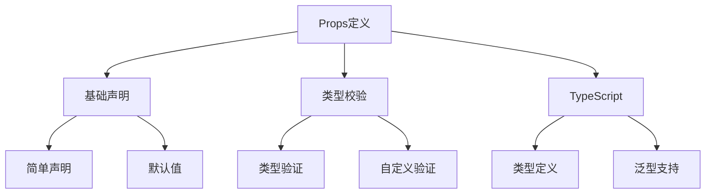

# Props定义与校验

## Props声明

### 基础声明方式

```vue:c:\project\kphub\src\components\props\BasicProps.vue
<script setup>
// 简单声明
defineProps(['title', 'content'])

// 带类型的声明
defineProps({
  title: String,
  content: String,
  count: Number,
  isActive: Boolean
})

// 带默认值的声明
defineProps({
  title: {
    type: String,
    default: '默认标题'
  },
  items: {
    type: Array,
    default: () => []
  },
  config: {
    type: Object,
    default: () => ({
      theme: 'light',
      size: 'medium'
    })
  }
})
</script>

<template>
  <div class="component">
    <h2>{{ title }}</h2>
    <p>{{ content }}</p>
    <span>计数: {{ count }}</span>
    <div :class="{ active: isActive }">
      状态示例
    </div>
  </div>
</template>
```

### 必填属性设置

```vue:c:\project\kphub\src\components\props\RequiredProps.vue
<script setup>
defineProps({
  // 必填字符串
  username: {
    type: String,
    required: true
  },
  
  // 必填对象，带默认值
  userProfile: {
    type: Object,
    required: true,
    default: () => ({
      avatar: '/default-avatar.png',
      level: 1
    })
  },
  
  // 可选属性
  description: {
    type: String,
    required: false,
    default: '暂无描述'
  }
})
</script>

<template>
  <div class="user-card">
    <h3>{{ username }}</h3>
    
    <p>等级: {{ userProfile.level }}</p>
    <p>{{ description }}</p>
  </div>
</template>
```

## Props校验

### 类型与自定义校验

```vue:c:\project\kphub\src\components\props\PropsValidation.vue
<script setup>
defineProps({
  // 基础类型校验
  age: {
    type: Number,
    validator: (value) => value >= 0 && value <= 120
  },
  
  // 多类型支持
  identifier: {
    type: [String, Number],
    required: true
  },
  
  // 枚举值校验
  theme: {
    type: String,
    validator: (value) => ['light', 'dark', 'auto'].includes(value)
  },
  
  // 复杂对象校验
  product: {
    type: Object,
    validator: (obj) => {
      return (
        typeof obj.id === 'number' &&
        typeof obj.name === 'string' &&
        Array.isArray(obj.categories) &&
        obj.price > 0
      )
    }
  },
  
  // 自定义验证函数
  email: {
    type: String,
    validator: (value) => {
      const emailRegex = /^[^\s@]+@[^\s@]+\.[^\s@]+$/
      return emailRegex.test(value)
    }
  }
})
</script>
```

## TypeScript集成

### 类型定义与泛型组件

```vue:c:\project\kphub\src\components\props\TypeScriptProps.vue
<script setup lang="ts">
import { PropType } from 'vue'

// 定义接口
interface User {
  id: number
  name: string
  email: string
}

interface PaginationConfig {
  page: number
  pageSize: number
  total: number
}

// 使用类型定义Props
const props = defineProps({
  // 基础类型
  title: {
    type: String as PropType<string>,
    required: true
  },
  
  // 复杂对象
  user: {
    type: Object as PropType<User>,
    required: true
  },
  
  // 泛型数组
  items: {
    type: Array as PropType<Array<User>>,
    default: () => []
  },
  
  // 函数类型
  onSelect: {
    type: Function as PropType<(user: User) => void>,
    required: true
  },
  
  // 联合类型
  status: {
    type: String as PropType<'active' | 'inactive' | 'pending'>,
    default: 'pending'
  },
  
  // 嵌套对象
  pagination: {
    type: Object as PropType<PaginationConfig>,
    required: true
  }
})

// 使用defineProps宏
defineProps<{
  message: string
  count: number
  isEnabled: boolean
  callback: (id: number) => void
}>()
</script>
```

## Props最佳实践

### 规范与文档化

```vue:c:\project\kphub\src\components\props\PropsPattern.vue
<script setup lang="ts">
interface TableColumn {
  key: string
  title: string
  width?: number
  sortable?: boolean
}

// 文档化的Props定义
const props = defineProps({
  /**
   * 表格列配置
   * @property {string} key - 列标识
   * @property {string} title - 列标题
   * @property {number} [width] - 列宽度
   * @property {boolean} [sortable] - 是否可排序
   */
  columns: {
    type: Array as PropType<TableColumn[]>,
    required: true,
    validator: (columns: TableColumn[]) => {
      return columns.every(col => 
        typeof col.key === 'string' &&
        typeof col.title === 'string'
      )
    }
  },
  
  /**
   * 表格数据源
   * @type {Record<string, any>[]}
   */
  dataSource: {
    type: Array as PropType<Record<string, any>[]>,
    default: () => []
  },
  
  /**
   * 表格大小
   * @type {'small' | 'medium' | 'large'}
   */
  size: {
    type: String as PropType<'small' | 'medium' | 'large'>,
    default: 'medium'
  }
})

// 不可变性处理
function handleSort(column: TableColumn) {
  if (!column.sortable) return
  
  // 创建新数组而不是修改原数组
  const newData = [...props.dataSource].sort((a, b) => {
    return a[column.key] > b[column.key] ? 1 : -1
  })
  
  emit('sort', newData)
}
</script>

<template>
  <table :class="['data-table', `size-${size}`]">
    <thead>
      <tr>
        <th 
          v-for="col in columns"
          :key="col.key"
          :style="{ width: col.width + 'px' }"
          @click="handleSort(col)"
        >
          {{ col.title }}
          <span 
            v-if="col.sortable"
            class="sort-icon"
          >
            ↕
          </span>
        </th>
      </tr>
    </thead>
    <tbody>
      <tr 
        v-for="(row, index) in dataSource"
        :key="index"
      >
        <td
          v-for="col in columns"
          :key="col.key"
        >
          {{ row[col.key] }}
        </td>
      </tr>
    </tbody>
  </table>
</template>
```

Props是Vue组件的重要通信机制，主要包括：

1. Props声明：
   - 简单声明和类型声明
   - 默认值设置
   - 必填属性控制

2. Props校验：
   - 类型校验
   - 自定义验证
   - 复杂对象验证

3. TypeScript支持：
   - 类型定义
   - 泛型组件
   - 类型推导

4. 最佳实践：
   - 单向数据流
   - 不可变性
   - 文档化



使用建议：

1. 定义规范：
   - 明确的类型声明
   - 合理的默认值
   - 完整的校验规则

2. 开发实践：
   - 遵循单向数据流
   - 保持Props不可变
   - 编写清晰文档

3. 类型支持：
   - 使用TypeScript
   - 泛型组件设计
   - 完善类型定义

通过合理使用Props，我们可以构建出接口清晰、类型安全的Vue组件。