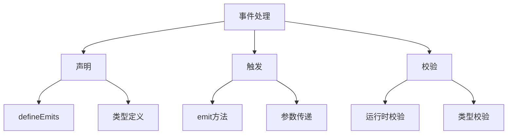

# 事件处理与emit

## 事件声明

### 基础声明方式

```vue:c:\project\kphub\src\components\events\BasicEmits.vue
<script setup>
// 简单声明
defineEmits(['change', 'update', 'delete'])

// 带验证的声明
defineEmits({
  // 无参数事件
  submit: null,
  
  // 带参数事件
  change: (value) => {
    return typeof value === 'string'
  },
  
  // 多参数事件
  update: (id, value) => {
    return typeof id === 'number' && typeof value === 'object'
  }
})
</script>

<template>
  <div class="event-demo">
    <button @click="$emit('submit')">提交</button>
    <input
      type="text"
      @input="$emit('change', $event.target.value)"
    >
    <button @click="$emit('update', 1, { status: 'active' })">
      更新
    </button>
  </div>
</template>
```

### TypeScript类型定义

```vue:c:\project\kphub\src\components\events\TypedEmits.vue
<script setup lang="ts">
interface UpdatePayload {
  id: number
  data: {
    name?: string
    status?: 'active' | 'inactive'
  }
}

// 使用类型定义
const emit = defineEmits<{
  (e: 'change', value: string): void
  (e: 'update', payload: UpdatePayload): void
  (e: 'delete', id: number): void
}>()

// 事件处理函数
function handleChange(value: string) {
  emit('change', value)
}

function handleUpdate(id: number, status: 'active' | 'inactive') {
  emit('update', {
    id,
    data: { status }
  })
}
</script>
```

## 事件触发

### 事件触发与冒泡控制

```vue:c:\project\kphub\src\components\events\EventTrigger.vue
<script setup>
const emit = defineEmits(['select', 'update', 'nested'])

// 基础触发
function handleClick() {
  emit('select', 'clicked')
}

// 带参数触发
function handleUpdate(data) {
  emit('update', {
    time: new Date(),
    data
  })
}

// 控制事件冒泡
function handleNested(event) {
  // 阻止事件冒泡
  event.stopPropagation()
  
  // 触发自定义事件
  emit('nested', {
    originalEvent: event,
    customData: 'nested data'
  })
}
</script>

<template>
  <div class="event-container">
    <!-- 直接触发 -->
    <button @click="$emit('select', 'direct')">
      直接触发
    </button>
    
    <!-- 方法触发 -->
    <button @click="handleClick">
      方法触发
    </button>
    
    <!-- 带参数触发 -->
    <button @click="handleUpdate({ type: 'click' })">
      更新数据
    </button>
    
    <!-- 嵌套事件 -->
    <div @click="$emit('outer')">
      外层
      <button @click="handleNested">
        内层
      </button>
    </div>
  </div>
</template>
```

## 事件校验

### 运行时与类型校验

```vue:c:\project\kphub\src\components\events\EventValidation.vue
<script setup lang="ts">
interface FormData {
  name: string
  age: number
}

// 运行时校验
const emit = defineEmits({
  // 基础类型校验
  'update:name': (value: string) => {
    return typeof value === 'string' && value.length > 0
  },
  
  // 复杂对象校验
  submit: (form: FormData) => {
    return (
      typeof form.name === 'string' &&
      typeof form.age === 'number' &&
      form.age >= 0
    )
  },
  
  // 自定义校验函数
  validate: (value: any) => {
    if (!value) return false
    if (Array.isArray(value)) {
      return value.every(item => typeof item === 'string')
    }
    return typeof value === 'string'
  }
})

// 处理表单提交
function handleSubmit(form: FormData) {
  if (form.name && form.age >= 0) {
    emit('submit', form)
  }
}
</script>
```

## 最佳实践

### 事件设计模式

```vue:c:\project\kphub\src\components\events\EventPatterns.vue
<script setup lang="ts">
interface TableEvent {
  type: 'sort' | 'filter' | 'select'
  payload: any
}

// 声明事件
const emit = defineEmits<{
  // 更新事件（v-model支持）
  (e: 'update:selected', value: string[]): void
  
  // 动作事件
  (e: 'action', event: TableEvent): void
  
  // 生命周期事件
  (e: 'mounted'): void
  (e: 'beforeUpdate'): void
  (e: 'updated'): void
  
  // 状态变更事件
  (e: 'stateChange', oldState: any, newState: any): void
}>()

// 组件生命周期钩子
onMounted(() => {
  emit('mounted')
})

// 状态变更处理
function handleStateChange(state: any) {
  emit('beforeUpdate')
  emit('stateChange', state, newState)
  emit('updated')
}

// 动作处理
function handleAction(type: 'sort' | 'filter' | 'select', data: any) {
  emit('action', {
    type,
    payload: data
  })
}
</script>

<template>
  <div class="data-table">
    <!-- 选择操作 -->
    <div class="selection">
      <input
        type="checkbox"
        v-model="selected"
        @change="$emit('update:selected', selected)"
      >
    </div>
    
    <!-- 表格操作 -->
    <div class="actions">
      <button @click="handleAction('sort', { column: 'name' })">
        排序
      </button>
      <button @click="handleAction('filter', { status: 'active' })">
        筛选
      </button>
    </div>
  </div>
</template>
```

事件处理与emit是Vue组件通信的重要机制，主要包括：

1. 事件声明：
   - defineEmits基础使用
   - TypeScript类型支持
   - 事件参数设计

2. 事件触发：
   - emit方法使用
   - 参数传递
   - 冒泡控制

3. 事件校验：
   - 运行时验证
   - 类型检查
   - 自定义验证

4. 最佳实践：
   - 命名规范
   - 文档化
   - 设计模式



使用建议：

1. 事件设计：
   - 明确的命名规范
   - 合理的参数设计
   - 完整的类型定义

2. 开发实践：
   - 适度使用事件
   - 处理事件冒泡
   - 做好参数校验

3. 类型支持：
   - 使用TypeScript
   - 定义清晰的接口
   - 完善的校验机制

通过合理使用事件机制，我们可以构建出交互清晰、类型安全的Vue组件。