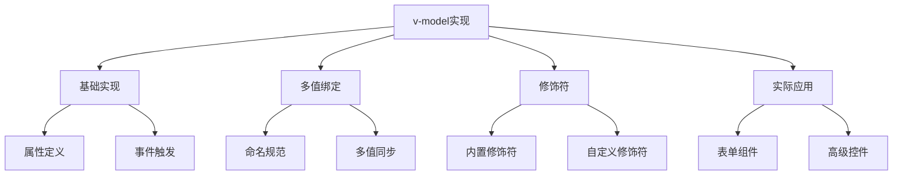

# v-model组件实现

## 基本实现

### 基础表单组件

```vue:c:\project\kphub\src\components\v-model\BasicInput.vue
<script setup>
// 定义props和emit
const props = defineProps({
  modelValue: {
    type: String,
    default: ''
  }
})

const emit = defineEmits(['update:modelValue'])

// 处理输入更新
function handleInput(event) {
  emit('update:modelValue', event.target.value)
}
</script>

<template>
  <input
    :value="modelValue"
    @input="handleInput"
    class="custom-input"
  >
</template>

<style scoped>
.custom-input {
  padding: 8px;
  border: 1px solid #ddd;
  border-radius: 4px;
}
</style>
```

### 使用示例

```vue:c:\project\kphub\src\components\v-model\Usage.vue
<script setup>
import { ref } from 'vue'
import BasicInput from './BasicInput.vue'

const text = ref('')
</script>

<template>
  <div class="form-demo">
    <BasicInput v-model="text" />
    <p>输入的内容: {{ text }}</p>
  </div>
</template>
```

## 多个v-model

### 多值绑定实现

```vue:c:\project\kphub\src\components\v-model\MultiModel.vue
<script setup>
const props = defineProps({
  // 第一个v-model
  title: {
    type: String,
    default: ''
  },
  // 第二个v-model
  content: {
    type: String,
    default: ''
  }
})

const emit = defineEmits([
  'update:title',
  'update:content'
])

// 处理标题更新
function updateTitle(event) {
  emit('update:title', event.target.value)
}

// 处理内容更新
function updateContent(event) {
  emit('update:content', event.target.value)
}
</script>

<template>
  <div class="editor">
    <input
      :value="title"
      @input="updateTitle"
      placeholder="输入标题"
    >
    
    <textarea
      :value="content"
      @input="updateContent"
      placeholder="输入内容"
    ></textarea>
  </div>
</template>
```

### 使用多个v-model

```vue:c:\project\kphub\src\components\v-model\MultiModelUsage.vue
<script setup>
import { ref } from 'vue'
import MultiModel from './MultiModel.vue'

const title = ref('初始标题')
const content = ref('初始内容')
</script>

<template>
  <MultiModel
    v-model:title="title"
    v-model:content="content"
  />
  
  <div class="preview">
    <h3>{{ title }}</h3>
    <p>{{ content }}</p>
  </div>
</template>
```

## v-model修饰符

### 修饰符处理

```vue:c:\project\kphub\src\components\v-model\ModifierInput.vue
<script setup>
const props = defineProps({
  modelValue: String,
  modelModifiers: {
    default: () => ({})
  }
})

const emit = defineEmits(['update:modelValue'])

function handleInput(event) {
  let value = event.target.value
  
  // 处理内置修饰符
  if (props.modelModifiers.capitalize) {
    value = value.charAt(0).toUpperCase() + value.slice(1)
  }
  
  if (props.modelModifiers.trim) {
    value = value.trim()
  }
  
  emit('update:modelValue', value)
}
</script>

<template>
  <input
    :value="modelValue"
    @input="handleInput"
  >
</template>
```

## 实际应用案例

### 日期选择器

```vue:c:\project\kphub\src\components\v-model\DatePicker.vue
<script setup>
import { ref, computed } from 'vue'

const props = defineProps({
  modelValue: {
    type: Date,
    default: () => new Date()
  }
})

const emit = defineEmits(['update:modelValue'])

// 计算属性
const formattedDate = computed(() => {
  return props.modelValue.toISOString().split('T')[0]
})

// 日期更新处理
function handleDateChange(event) {
  const newDate = new Date(event.target.value)
  emit('update:modelValue', newDate)
}

// 快捷选择
function selectToday() {
  emit('update:modelValue', new Date())
}

function selectTomorrow() {
  const tomorrow = new Date()
  tomorrow.setDate(tomorrow.getDate() + 1)
  emit('update:modelValue', tomorrow)
}
</script>

<template>
  <div class="date-picker">
    <input
      type="date"
      :value="formattedDate"
      @input="handleDateChange"
    >
    
    <div class="quick-select">
      <button @click="selectToday">今天</button>
      <button @click="selectTomorrow">明天</button>
    </div>
  </div>
</template>
```

### 颜色选择器

```vue:c:\project\kphub\src\components\v-model\ColorPicker.vue
<script setup>
const props = defineProps({
  modelValue: {
    type: String,
    default: '#000000'
  },
  // 自定义修饰符
  modelModifiers: {
    default: () => ({
      uppercase: false
    })
  }
})

const emit = defineEmits(['update:modelValue'])

function handleColorChange(event) {
  let color = event.target.value
  
  // 处理自定义修饰符
  if (props.modelModifiers.uppercase) {
    color = color.toUpperCase()
  }
  
  emit('update:modelValue', color)
}

// 预设颜色
const presetColors = [
  '#ff0000',
  '#00ff00',
  '#0000ff',
  '#ffff00',
  '#ff00ff'
]
</script>

<template>
  <div class="color-picker">
    <input
      type="color"
      :value="modelValue"
      @input="handleColorChange"
    >
    
    <div class="presets">
      <button
        v-for="color in presetColors"
        :key="color"
        :style="{ backgroundColor: color }"
        @click="$emit('update:modelValue', color)"
      ></button>
    </div>
    
    <div class="preview">
      选中的颜色: {{ modelValue }}
    </div>
  </div>
</template>
```

v-model是Vue中实现双向绑定的核心机制，主要包括：

1. 基本实现：
   - modelValue属性接收值
   - update:modelValue事件更新值
   - 组件内部值同步

2. 多个v-model：
   - 自定义属性名
   - 多值同步处理
   - 命名规范遵循

3. 修饰符处理：
   - 内置修饰符支持
   - 自定义修饰符
   - 修饰符参数处理

4. 实际应用：
   - 表单控件封装
   - 复合组件实现
   - 高级控件开发



使用建议：

1. 基础实现：
   - 遵循命名规范
   - 处理值同步
   - 注意性能优化

2. 多值处理：
   - 明确的命名
   - 合理的默认值
   - 完整的类型定义

3. 修饰符：
   - 合理使用内置修饰符
   - 谨慎添加自定义修饰符
   - 做好参数校验

通过合理使用v-model，我们可以构建出交互流畅、易于使用的Vue组件。