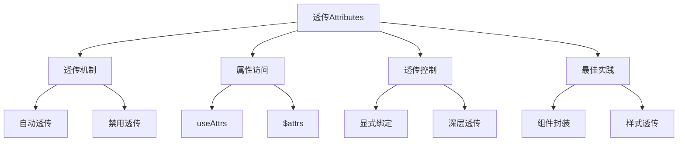

# 透传Attributes

## 属性透传机制

### 基础透传示例

```vue:c:\project\kphub\src\components\attrs\BasicAttrs.vue
<script setup>
// 不需要声明props，自动透传
</script>

<template>
  <div class="wrapper">
    <!-- class, style, id等属性会自动透传到这里 -->
    <button>
      <slot></slot>
    </button>
  </div>
</template>
```

### 禁用透传

```vue:c:\project\kphub\src\components\attrs\DisableAttrs.vue
<script setup>
// 禁用属性透传
defineOptions({
  inheritAttrs: false
})

// 使用useAttrs访问透传属性
const attrs = useAttrs()
</script>

<template>
  <div class="container">
    <!-- 手动绑定需要的属性 -->
    <button v-bind="attrs">
      <slot></slot>
    </button>
  </div>
</template>
```

### 多根节点透传

```vue:c:\project\kphub\src\components\attrs\MultiRootAttrs.vue
<script setup>
defineOptions({
  inheritAttrs: false
})

const attrs = useAttrs()
</script>

<template>
  <!-- 多根节点需要明确指定透传目标 -->
  <header>
    <slot name="header"></slot>
  </header>
  
  <main v-bind="attrs">
    <slot></slot>
  </main>
  
  <footer>
    <slot name="footer"></slot>
  </footer>
</template>
```

## 访问透传属性

### 组合式API访问

```vue:c:\project\kphub\src\components\attrs\CompositionAttrs.vue
<script setup>
import { useAttrs, computed } from 'vue'

const attrs = useAttrs()

// 计算处理透传属性
const classes = computed(() => {
  return {
    ...attrs.class,
    'custom-component': true
  }
})

// 提取事件处理器
const eventHandlers = computed(() => {
  return Object.entries(attrs)
    .filter(([key]) => key.startsWith('on'))
    .reduce((handlers, [key, value]) => {
      handlers[key] = value
      return handlers
    }, {})
})
</script>

<template>
  <div
    v-bind="attrs"
    :class="classes"
    v-on="eventHandlers"
  >
    <slot></slot>
  </div>
</template>
```

### 选项式API访问

```vue:c:\project\kphub\src\components\attrs\OptionsAttrs.vue
<script>
export default {
  inheritAttrs: false,
  
  created() {
    console.log(this.$attrs)
  },
  
  methods: {
    handleAttrs() {
      const { class: className, style, ...rest } = this.$attrs
      return {
        class: [className, 'custom-class'],
        style: {
          ...style,
          padding: '10px'
        },
        ...rest
      }
    }
  }
}
</script>

<template>
  <div v-bind="handleAttrs()">
    <slot></slot>
  </div>
</template>
```

## 透传控制

### 深层组件透传

```vue:c:\project\kphub\src\components\attrs\DeepAttrs.vue
<script setup>
// 父组件
const ParentComponent = {
  template: `
    <div>
      <ChildComponent
        class="parent-class"
        style="color: red"
        @click="handleClick"
      />
    </div>
  `
}

// 子组件
const ChildComponent = {
  template: `
    <div>
      <GrandChildComponent v-bind="$attrs" />
    </div>
  `
}

// 孙组件
const GrandChildComponent = {
  setup(props, { attrs }) {
    // 可以访问到父组件的透传属性
    console.log(attrs)
  },
  template: `
    <div v-bind="$attrs">
      最终接收透传属性的组件
    </div>
  `
}
</script>
```

## 最佳实践

### 组件封装示例

```vue:c:\project\kphub\src\components\attrs\CustomInput.vue
<script setup lang="ts">
interface Props {
  modelValue: string
  label?: string
}

// 声明需要的props
const props = withDefaults(defineProps<Props>(), {
  label: ''
})

const emit = defineEmits(['update:modelValue'])

// 获取其他透传属性
const attrs = useAttrs()

// 处理输入事件
function handleInput(e: Event) {
  const target = e.target as HTMLInputElement
  emit('update:modelValue', target.value)
}
</script>

<template>
  <div class="input-wrapper">
    <label v-if="label">{{ label }}</label>
    
    <input
      :value="modelValue"
      @input="handleInput"
      v-bind="attrs"
    >
  </div>
</template>

<style scoped>
.input-wrapper {
  display: flex;
  flex-direction: column;
  gap: 4px;
}

label {
  font-size: 14px;
  color: #666;
}

input {
  padding: 8px;
  border: 1px solid #ddd;
  border-radius: 4px;
}
</style>
```

### 使用示例

```vue:c:\project\kphub\src\components\attrs\Usage.vue
<script setup>
import { ref } from 'vue'
import CustomInput from './CustomInput.vue'

const value = ref('')

function handleFocus() {
  console.log('输入框获得焦点')
}
</script>

<template>
  <CustomInput
    v-model="value"
    label="用户名"
    placeholder="请输入用户名"
    class="custom-input"
    @focus="handleFocus"
  />
</template>
```

透传Attributes是Vue组件系统中的重要特性，主要包括：

1. 透传机制：
   - 自动属性透传
   - 透传控制
   - 多根节点规则

2. 属性访问：
   - useAttrs组合式API
   - $attrs选项式API
   - 模板中的使用

3. 透传控制：
   - 显式绑定
   - 继承控制
   - 深层透传

4. 最佳实践：
   - 组件封装
   - API设计
   - 样式透传



使用建议：

1. 透传设计：
   - 合理使用自动透传
   - 必要时禁用透传
   - 注意多根节点情况

2. 属性处理：
   - 选择合适的访问方式
   - 处理样式和事件
   - 注意性能影响

3. 组件封装：
   - 明确透传范围
   - 合理的默认行为
   - 完善的文档说明

通过合理使用透传特性，我们可以构建出灵活、可复用的Vue组件。