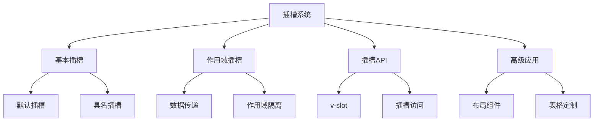

# 插槽与作用域插槽

## 基本插槽

### 默认插槽与具名插槽

```vue:c:\project\kphub\src\components\slots\BasicSlot.vue
<script setup>
// 基础组件定义
</script>

<template>
  <div class="card">
    <!-- 默认插槽 -->
    <div class="content">
      <slot>
        <!-- 默认内容 -->
        <p>暂无内容</p>
      </slot>
    </div>
    
    <!-- 具名插槽 -->
    <header class="header">
      <slot name="header">
        <h3>默认标题</h3>
      </slot>
    </header>
    
    <footer class="footer">
      <slot name="footer"></slot>
    </footer>
  </div>
</template>
```

### 动态插槽名

```vue:c:\project\kphub\src\components\slots\DynamicSlot.vue
<script setup>
import { ref } from 'vue'

const currentSlot = ref('header')
const slots = ['header', 'content', 'footer']
</script>

<template>
  <div class="dynamic-container">
    <!-- 动态插槽名称 -->
    <template v-for="name in slots" :key="name">
      <slot :name="name">
        默认内容 - {{ name }}
      </slot>
    </template>
    
    <!-- 动态切换插槽 -->
    <slot :name="currentSlot">
      {{ currentSlot }} 的默认内容
    </slot>
    
    <button @click="currentSlot = slots[(slots.indexOf(currentSlot) + 1) % slots.length]">
      切换插槽
    </button>
  </div>
</template>
```

## 作用域插槽

### 基础作用域插槽

```vue:c:\project\kphub\src\components\slots\ScopedSlot.vue
<script setup>
const items = [
  { id: 1, name: '项目1', status: 'active' },
  { id: 2, name: '项目2', status: 'inactive' },
  { id: 3, name: '项目3', status: 'active' }
]
</script>

<template>
  <div class="list">
    <div v-for="item in items" :key="item.id">
      <!-- 传递数据到插槽 -->
      <slot
        :item="item"
        :index="index"
        :active="item.status === 'active'"
      >
        <!-- 默认渲染 -->
        {{ item.name }}
      </slot>
    </div>
  </div>
</template>
```

### 使用作用域插槽

```vue:c:\project\kphub\src\components\slots\ScopedSlotUsage.vue
<script setup>
import ScopedSlot from './ScopedSlot.vue'
</script>

<template>
  <ScopedSlot>
    <!-- 解构插槽prop -->
    <template #default="{ item, index, active }">
      <div :class="['item', { active }]">
        <span>{{ index + 1 }}. </span>
        <strong>{{ item.name }}</strong>
        <span>({{ item.status }})</span>
      </div>
    </template>
  </ScopedSlot>
</template>
```

## 插槽API

### 组件内部访问插槽

```vue:c:\project\kphub\src\components\slots\SlotAPI.vue
<script setup>
import { useSlots, computed } from 'vue'

const slots = useSlots()

// 检查插槽是否存在
const hasHeaderSlot = computed(() => !!slots.header)
const hasDefaultSlot = computed(() => !!slots.default)

// 渲染插槽内容
function renderSlot(name = 'default', props = {}) {
  const slot = slots[name]
  if (slot) {
    return slot(props)
  }
  return null
}
</script>

<template>
  <div class="container">
    <!-- 条件渲染插槽 -->
    <header v-if="hasHeaderSlot">
      <slot name="header"></slot>
    </header>
    
    <!-- 手动渲染插槽 -->
    <div class="content">
      {{ renderSlot('default', { text: '示例文本' }) }}
    </div>
  </div>
</template>
```

## 高级应用模式

### 布局组件

```vue:c:\project\kphub\src\components\slots\LayoutComponent.vue
<script setup>
const props = defineProps({
  layout: {
    type: String,
    default: 'default',
    validator: value => ['default', 'sidebar', 'dashboard'].includes(value)
  }
})
</script>

<template>
  <div :class="['layout', `layout-${layout}`]">
    <!-- 顶部区域 -->
    <header class="header">
      <slot name="header"></slot>
    </header>
    
    <!-- 主要内容区 -->
    <div class="main">
      <!-- 侧边栏 -->
      <aside v-if="layout !== 'default'" class="sidebar">
        <slot name="sidebar">
          <nav>默认导航</nav>
        </slot>
      </aside>
      
      <!-- 内容区 -->
      <main class="content">
        <slot></slot>
      </main>
    </div>
    
    <!-- 底部区域 -->
    <footer class="footer">
      <slot name="footer"></slot>
    </footer>
  </div>
</template>

<style scoped>
.layout {
  display: grid;
  min-height: 100vh;
  grid-template-rows: auto 1fr auto;
}

.main {
  display: flex;
}

.layout-sidebar .main {
  grid-template-columns: 250px 1fr;
}

.layout-dashboard .main {
  grid-template-columns: 200px 1fr;
}
</style>
```

### 表格组件

```vue:c:\project\kphub\src\components\slots\TableComponent.vue
<script setup lang="ts">
interface Column {
  key: string
  title: string
  width?: number
}

interface Props {
  columns: Column[]
  data: Record<string, any>[]
}

const props = defineProps<Props>()
</script>

<template>
  <table class="data-table">
    <thead>
      <tr>
        <th
          v-for="col in columns"
          :key="col.key"
          :style="{ width: col.width + 'px' }"
        >
          <!-- 表头插槽 -->
          <slot :name="`header-${col.key}`" :column="col">
            {{ col.title }}
          </slot>
        </th>
      </tr>
    </thead>
    
    <tbody>
      <tr v-for="(row, index) in data" :key="index">
        <td v-for="col in columns" :key="col.key">
          <!-- 单元格插槽 -->
          <slot
            :name="`cell-${col.key}`"
            :row="row"
            :column="col"
            :value="row[col.key]"
          >
            {{ row[col.key] }}
          </slot>
        </td>
      </tr>
    </tbody>
    
    <!-- 空状态插槽 -->
    <template v-if="data.length === 0">
      <slot name="empty">
        <tr>
          <td :colspan="columns.length">
            暂无数据
          </td>
        </tr>
      </slot>
    </template>
  </table>
</template>
```

插槽系统是Vue组件复用和定制化的关键机制，主要包括：

1. 基本插槽：
   - 默认插槽
   - 具名插槽
   - 动态插槽名

2. 作用域插槽：
   - 数据传递
   - 插槽prop
   - 作用域隔离

3. 插槽API：
   - v-slot指令
   - 插槽访问
   - 插槽检测

4. 高级应用：
   - 布局系统
   - 组件定制
   - 性能优化



使用建议：

1. 插槽设计：
   - 合理使用默认内容
   - 明确的插槽命名
   - 必要的类型约束

2. 作用域插槽：
   - 传递必要的数据
   - 保持作用域清晰
   - 避免过度使用

3. 性能考虑：
   - 合理的插槽粒度
   - 避免不必要的更新
   - 使用编译优化

通过合理使用插槽系统，我们可以构建出灵活、可定制的Vue组件。