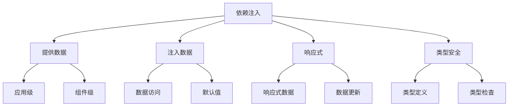

# 依赖注入(provide/inject)

## 基本概念

### 工作原理与数据流

```vue:c:\project\kphub\src\components\injection\BasicInjection.vue
<script setup>
import { provide } from 'vue'

// 提供数据
provide('theme', {
  primary: '#3498db',
  secondary: '#2ecc71'
})

provide('config', {
  apiUrl: '/api/v1',
  timeout: 5000
})
</script>

<template>
  <div class="app-container">
    <header>
      <h1>应用标题</h1>
    </header>
    
    <!-- 子组件可以注入上述提供的数据 -->
    <main>
      <slot></slot>
    </main>
  </div>
</template>
```

### 子组件注入

```vue:c:\project\kphub\src\components\injection\ChildComponent.vue
<script setup>
import { inject } from 'vue'

// 注入数据
const theme = inject('theme')
const config = inject('config')

// 使用注入的数据
const buttonStyle = {
  backgroundColor: theme.primary,
  color: '#ffffff'
}
</script>

<template>
  <div class="child-component">
    <button :style="buttonStyle">
      主题按钮
    </button>
    
    <div class="config-info">
      API地址: {{ config.apiUrl }}
    </div>
  </div>
</template>
```

## 使用方式

### 应用级注入

```typescript:c:\project\kphub\src\main.ts
import { createApp } from 'vue'
import App from './App.vue'

const app = createApp(App)

// 应用级依赖注入
app.provide('globalConfig', {
  appName: '示例应用',
  version: '1.0.0',
  api: {
    baseUrl: '/api',
    timeout: 5000
  }
})

app.mount('#app')
```

### 组件级注入

```vue:c:\project\kphub\src\components\injection\ComponentInjection.vue
<script setup>
import { provide, ref, readonly } from 'vue'

// 响应式数据
const count = ref(0)
const message = ref('Hello')

// 提供只读数据
provide('count', readonly(count))
// 提供可修改数据
provide('message', message)

// 提供方法
provide('increment', () => {
  count.value++
})

provide('updateMessage', (newMessage: string) => {
  message.value = newMessage
})
</script>

<template>
  <div class="provider">
    <div>计数: {{ count }}</div>
    <div>消息: {{ message }}</div>
    <slot></slot>
  </div>
</template>
```

## 响应式依赖注入

### 响应式数据处理

```vue:c:\project\kphub\src\components\injection\ReactiveInjection.vue
<script setup lang="ts">
import { provide, ref, reactive, computed } from 'vue'

// 响应式状态
const state = reactive({
  user: {
    name: '张三',
    role: 'admin'
  },
  settings: {
    theme: 'light',
    language: 'zh-CN'
  }
})

// 计算属性
const userInfo = computed(() => {
  return `${state.user.name} (${state.user.role})`
})

// 提供响应式数据
provide('appState', state)
provide('userInfo', userInfo)

// 提供更新方法
provide('updateUser', (name: string, role: string) => {
  state.user.name = name
  state.user.role = role
})

provide('updateSettings', (settings: Partial<typeof state.settings>) => {
  Object.assign(state.settings, settings)
})
</script>
```

### 注入使用

```vue:c:\project\kphub\src\components\injection\InjectUsage.vue
<script setup lang="ts">
import { inject } from 'vue'

// 注入响应式数据
const appState = inject('appState')
const userInfo = inject('userInfo')
const updateUser = inject('updateUser')
const updateSettings = inject('updateSettings')

// 处理更新
function handleUserUpdate() {
  updateUser?.('李四', 'user')
}

function handleThemeChange() {
  updateSettings?.({ theme: 'dark' })
}
</script>

<template>
  <div class="consumer">
    <div>用户信息: {{ userInfo }}</div>
    <div>主题: {{ appState.settings.theme }}</div>
    
    <button @click="handleUserUpdate">
      更新用户
    </button>
    
    <button @click="handleThemeChange">
      切换主题
    </button>
  </div>
</template>
```

## 高级用法

### TypeScript集成

```typescript:c:\project\kphub\src\components\injection\types.ts
import { InjectionKey } from 'vue'

// 定义注入类型
export interface UserState {
  name: string
  role: string
}

export interface AppConfig {
  theme: 'light' | 'dark'
  language: string
}

// 创建注入键
export const UserStateKey: InjectionKey<UserState> = Symbol('userState')
export const AppConfigKey: InjectionKey<AppConfig> = Symbol('appConfig')
```

### 类型安全的注入

```vue:c:\project\kphub\src\components\injection\TypeSafeInjection.vue
<script setup lang="ts">
import { provide, inject } from 'vue'
import { UserStateKey, AppConfigKey, UserState, AppConfig } from './types'

// 提供带类型的数据
provide(UserStateKey, {
  name: '张三',
  role: 'admin'
})

// 注入带默认值的数据
const config = inject<AppConfig>(AppConfigKey, {
  theme: 'light',
  language: 'zh-CN'
})

// 类型安全的注入
const user = inject(UserStateKey)
if (user) {
  console.log(user.name) // 类型安全
}
</script>
```

依赖注入是Vue中实现跨层级组件通信的重要机制，主要包括：

1. 基本概念：
   - provide/inject工作原理
   - 数据流向
   - 使用场景

2. 使用方式：
   - 应用级注入
   - 组件级注入
   - 响应式数据

3. 响应式处理：
   - ref和reactive
   - 计算属性
   - 数据更新

4. 高级特性：
   - TypeScript集成
   - 符号键
   - 默认值



使用建议：

1. 注入设计：
   - 合理的数据结构
   - 清晰的命名
   - 适度使用

2. 响应式处理：
   - 选择合适的响应式API
   - 控制数据修改权限
   - 保持响应性

3. 类型支持：
   - 使用TypeScript
   - 定义注入键
   - 提供默认值

通过合理使用依赖注入，我们可以构建出结构清晰、易于维护的Vue应用。