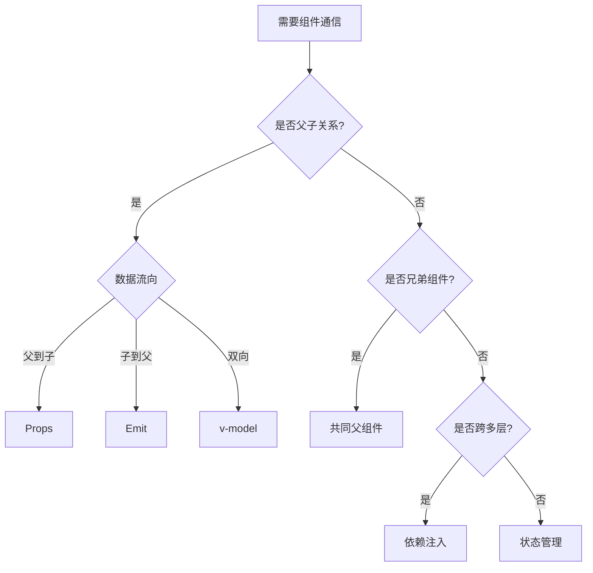

# 组件通信方式全解析

## 父子组件通信

### Props和Emit基础通信

```vue:c:\project\kphub\src\components\communication\ParentChild.vue
<script setup>
import { ref } from 'vue'

// 父组件
const ParentComponent = {
  setup() {
    const message = ref('父组件消息')
    const count = ref(0)
    
    function handleChildEvent(value) {
      count.value = value
      console.log('收到子组件事件:', value)
    }
    
    return {
      message,
      count,
      handleChildEvent
    }
  },
  template: `
    <div class="parent">
      <h3>父组件</h3>
      <p>计数: {{ count }}</p>
      <ChildComponent
        :message="message"
        @update="handleChildEvent"
      />
    </div>
  `
}

// 子组件
const ChildComponent = {
  props: {
    message: String
  },
  emits: ['update'],
  setup(props, { emit }) {
    function increment() {
      emit('update', props.count + 1)
    }
    
    return { increment }
  },
  template: `
    <div class="child">
      <p>来自父组件的消息: {{ message }}</p>
      <button @click="increment">增加</button>
    </div>
  `
}
</script>
```

### v-model和ref通信

```vue:c:\project\kphub\src\components\communication\ModelRef.vue
<script setup>
import { ref } from 'vue'

// 父组件
const ParentWithModel = {
  setup() {
    const inputValue = ref('')
    const childRef = ref(null)
    
    function accessChild() {
      // 通过ref直接访问子组件
      childRef.value.focus()
      childRef.value.reset()
    }
    
    return {
      inputValue,
      childRef,
      accessChild
    }
  },
  template: `
    <div class="parent">
      <CustomInput
        v-model="inputValue"
        ref="childRef"
      />
      <button @click="accessChild">
        操作子组件
      </button>
    </div>
  `
}

// 子组件
const CustomInput = {
  props: ['modelValue'],
  emits: ['update:modelValue'],
  setup(props, { emit }) {
    const inputRef = ref(null)
    
    function focus() {
      inputRef.value?.focus()
    }
    
    function reset() {
      emit('update:modelValue', '')
    }
    
    return {
      inputRef,
      focus,
      reset
    }
  },
  template: `
    <input
      ref="inputRef"
      :value="modelValue"
      @input="$emit('update:modelValue', $event.target.value)"
    >
  `
}
</script>
```

## 兄弟组件通信

### 通过共同父组件

```vue:c:\project\kphub\src\components\communication\SiblingsCommunication.vue
<script setup>
import { ref } from 'vue'

// 父组件
const Parent = {
  setup() {
    const sharedState = ref({
      count: 0,
      message: ''
    })
    
    return { sharedState }
  },
  template: `
    <div class="container">
      <SiblingA :state="sharedState" />
      <SiblingB :state="sharedState" />
    </div>
  `
}

// 兄弟组件A
const SiblingA = {
  props: ['state'],
  template: `
    <div class="sibling">
      <h4>组件A</h4>
      <button @click="state.count++">
        增加计数
      </button>
    </div>
  `
}

// 兄弟组件B
const SiblingB = {
  props: ['state'],
  template: `
    <div class="sibling">
      <h4>组件B</h4>
      <p>计数: {{ state.count }}</p>
    </div>
  `
}
</script>
```

### 事件总线替代方案

```typescript:c:\project\kphub\src\utils\eventBus.ts
import { ref } from 'vue'

// 简单的事件总线实现
export class EventBus {
  private events = new Map()
  
  on(event: string, callback: Function) {
    if (!this.events.has(event)) {
      this.events.set(event, [])
    }
    this.events.get(event).push(callback)
  }
  
  emit(event: string, data?: any) {
    if (this.events.has(event)) {
      this.events.get(event).forEach(callback => callback(data))
    }
  }
  
  off(event: string, callback?: Function) {
    if (!callback) {
      this.events.delete(event)
    } else if (this.events.has(event)) {
      const callbacks = this.events.get(event)
      const index = callbacks.indexOf(callback)
      if (index > -1) {
        callbacks.splice(index, 1)
      }
    }
  }
}

export const eventBus = new EventBus()
```

## 跨层级组件通信

### 依赖注入方式

```vue:c:\project\kphub\src\components\communication\DeepCommunication.vue
<script setup>
import { provide, inject, readonly } from 'vue'

// 根组件
const Root = {
  setup() {
    const state = reactive({
      theme: 'light',
      user: null
    })
    
    // 提供只读状态
    provide('appState', readonly(state))
    // 提供更新方法
    provide('updateTheme', (theme) => {
      state.theme = theme
    })
    
    return { state }
  }
}

// 深层子组件
const DeepChild = {
  setup() {
    const appState = inject('appState')
    const updateTheme = inject('updateTheme')
    
    return {
      appState,
      updateTheme
    }
  }
}
</script>
```

### 组合式函数共享状态

```typescript:c:\project\kphub\src\composables\useSharedState.ts
import { ref, computed } from 'vue'

const count = ref(0)
const doubleCount = computed(() => count.value * 2)

export function useSharedState() {
  function increment() {
    count.value++
  }
  
  function decrement() {
    count.value--
  }
  
  return {
    count,
    doubleCount,
    increment,
    decrement
  }
}
```

## 通信方式对比

### 决策流程图



### 各方式对比

| 通信方式 | 使用场景 | 优点 | 缺点 |
|---------|---------|------|------|
| Props/Emit | 父子组件 | 简单直接，类型安全 | 多层级传递繁琐 |
| v-model | 表单组件 | 双向绑定方便 | 可能违反单向数据流 |
| ref | 父子组件 | 直接访问组件实例 | 耦合度高 |
| 依赖注入 | 跨层级组件 | 避免属性透传 | 数据来源不明确 |
| 状态管理 | 全局状态 | 集中管理，易于调试 | 配置复杂，学习成本高 |

使用建议：

1. 父子通信：
   - 优先使用Props/Emit
   - 需要双向绑定时使用v-model
   - ref仅用于必要的DOM操作

2. 兄弟通信：
   - 优先通过共同父组件
   - 避免使用事件总线
   - 考虑使用组合式函数

3. 跨层级通信：
   - 优先使用依赖注入
   - 状态复杂时使用状态管理
   - 保持数据流向清晰

通过合理选择通信方式，我们可以构建出结构清晰、易于维护的Vue应用。