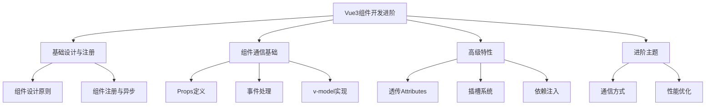

# Vue3组件开发进阶

Vue3组件开发进阶章节涵盖了构建高质量Vue3组件所需的核心概念和最佳实践。通过本章节的学习，您将掌握：

## 基础设计与注册
- [组件设计原则](./4.1-组件设计原则.md)：探讨单一职责、可复用性、可测试性等核心设计原则
- [组件注册与异步组件](./4.2-组件注册与异步组件.md)：深入理解组件注册机制和异步加载策略

## 组件通信基础
- [Props定义与校验](./4.3-Props定义与校验.md)：学习Props的类型定义、校验和最佳实践
- [事件处理与emit](./4.4-事件处理与emit.md)：掌握组件事件系统和emit机制
- [v-model组件实现](./4.5-v-model组件实现.md)：深入理解双向绑定的实现原理

## 高级特性
- [透传Attributes](./4.6-透传Attributes.md)：学习属性透传机制和控制方法
- [插槽与作用域插槽](./4.7-插槽与作用域插槽.md)：掌握组件内容分发系统
- [依赖注入(provide/inject)](./4.8-依赖注入(provide-inject).md)：理解跨层级组件通信

## 进阶主题
- [组件通信方式全解析](./4.9-组件通信方式全解析.md)：全面对比各种组件通信方式
- [组件性能优化策略](./4.10-组件性能优化策略.md)：学习组件性能优化的关键技巧

本章节的学习路径：

1. 首先掌握组件的基础设计原则和注册机制
2. 深入理解组件通信的基础知识
3. 学习高级特性以增强组件的灵活性
4. 最后掌握全面的通信方案和性能优化

通过系统学习这些内容，您将能够：

- 设计出结构清晰、可维护的组件
- 实现灵活的组件通信
- 构建高性能的组件系统
- 应用Vue3的最佳实践

建议按照章节顺序循序渐进地学习，每个主题都包含了从基础到进阶的完整内容，同时配有详细的示例代码和实践建议。