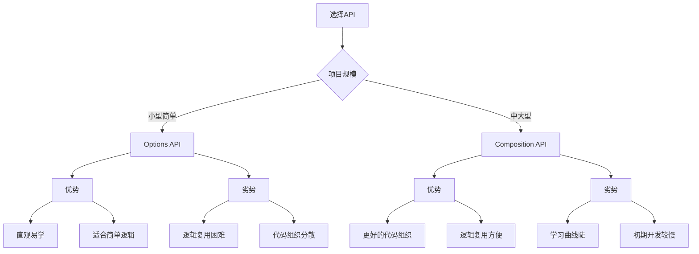

# Composition API vs Options API

## 两种API范式概述

### Options API示例

```vue:c:\project\kphub\src\components\api-comparison\OptionsAPI.vue
<script>
export default {
  // 数据
  data() {
    return {
      count: 0,
      message: 'Hello',
      loading: false
    }
  },
  
  // 计算属性
  computed: {
    doubleCount() {
      return this.count * 2
    }
  },
  
  // 方法
  methods: {
    increment() {
      this.count++
    },
    async fetchData() {
      this.loading = true
      try {
        const response = await fetch('/api/data')
        const data = await response.json()
        this.message = data.message
      } finally {
        this.loading = false
      }
    }
  },
  
  // 生命周期钩子
  mounted() {
    this.fetchData()
  },
  
  // 侦听器
  watch: {
    count(newValue, oldValue) {
      console.log(`计数从 ${oldValue} 变为 ${newValue}`)
    }
  }
}
</script>
```

### Composition API示例

```vue:c:\project\kphub\src\components\api-comparison\CompositionAPI.vue
<script setup>
import { ref, computed, watch, onMounted } from 'vue'

// 状态管理
const count = ref(0)
const message = ref('Hello')
const loading = ref(false)

// 计算属性
const doubleCount = computed(() => count.value * 2)

// 方法
function increment() {
  count.value++
}

async function fetchData() {
  loading.value = true
  try {
    const response = await fetch('/api/data')
    const data = await response.json()
    message.value = data.message
  } finally {
    loading.value = false
  }
}

// 生命周期
onMounted(() => {
  fetchData()
})

// 侦听器
watch(count, (newValue, oldValue) => {
  console.log(`计数从 ${oldValue} 变为 ${newValue}`)
})
</script>
```

## 代码组织对比

### 逻辑复用示例

```typescript:c:\project\kphub\src\composables\useCounter.ts
// Composition API 逻辑复用
import { ref, computed } from 'vue'

export function useCounter(initialValue = 0) {
  const count = ref(initialValue)
  const doubleCount = computed(() => count.value * 2)
  
  function increment() {
    count.value++
  }
  
  function decrement() {
    count.value--
  }
  
  return {
    count,
    doubleCount,
    increment,
    decrement
  }
}
```

```vue:c:\project\kphub\src\mixins\counterMixin.js
// Options API 逻辑复用
export const counterMixin = {
  data() {
    return {
      count: 0
    }
  },
  
  computed: {
    doubleCount() {
      return this.count * 2
    }
  },
  
  methods: {
    increment() {
      this.count++
    },
    decrement() {
      this.count--
    }
  }
}
```

### TypeScript支持对比

```typescript:c:\project\kphub\src\components\api-comparison\TypeSupport.vue
<script setup lang="ts">
// Composition API with TypeScript
import { ref, computed } from 'vue'

interface User {
  id: number
  name: string
  email: string
}

const user = ref<User>({
  id: 1,
  name: 'John',
  email: 'john@example.com'
})

const userName = computed(() => user.value.name)

function updateUser(newName: string) {
  user.value.name = newName
}
</script>

<script lang="ts">
// Options API with TypeScript
import { defineComponent } from 'vue'

interface User {
  id: number
  name: string
  email: string
}

export default defineComponent({
  data() {
    return {
      user: {
        id: 1,
        name: 'John',
        email: 'john@example.com'
      } as User
    }
  },
  
  computed: {
    userName(): string {
      return this.user.name
    }
  },
  
  methods: {
    updateUser(newName: string): void {
      this.user.name = newName
    }
  }
})
</script>
```

## 性能与开发体验

### 打包优化示例

```typescript:c:\project\kphub\src\components\api-comparison\TreeShaking.vue
// Composition API 更好的 tree-shaking
import { ref, onMounted, watch } from 'vue'

// 只打包使用的API
const count = ref(0)

// Options API 需要包含完整的运行时
export default {
  data() {
    return { count: 0 }
  }
}
```

## 选择指南



两种API的对比分析：

1. Options API：
   - 优点：
     - 结构清晰，选项分类明确
     - 适合简单组件
     - 学习曲线平缓
   - 缺点：
     - 逻辑复用依赖混入
     - 代码组织分散
     - TypeScript支持有限

2. Composition API：
   - 优点：
     - 更好的代码组织
     - 灵活的逻辑复用
     - 优秀的TypeScript支持
   - 缺点：
     - 初期学习成本高
     - 简单场景可能过度设计
     - 需要了解响应式原理

选择建议：

1. 使用Options API：
   - 小型项目
   - 简单组件
   - 团队以Vue2经验为主
   - 学习阶段

2. 使用Composition API：
   - 中大型项目
   - 复杂组件
   - 需要良好TypeScript支持
   - 注重代码复用

3. 混合使用策略：
   - 新功能使用Composition API
   - 保留原有Options API代码
   - 按组件复杂度选择
   - 渐进式迁移

通过合理选择API风格，我们可以在不同场景下获得最佳的开发体验。