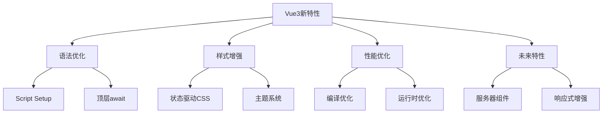

# 实验性新特性预览

## Script Setup语法糖

### 基础语法示例

```vue:c:\project\kphub\src\components\experimental\ScriptSetupBasic.vue
<script setup>
import { ref, computed } from 'vue'
import ChildComponent from './ChildComponent.vue'

// 响应式状态
const count = ref(0)
const message = ref('Hello')

// 计算属性
const doubleCount = computed(() => count.value * 2)

// 方法定义
function increment() {
  count.value++
}

// 组件自动注册，无需components选项
</script>

<template>
  <div class="container">
    <h2>{{ message }}</h2>
    <p>Count: {{ count }} (Double: {{ doubleCount }})</p>
    <button @click="increment">增加</button>
    <ChildComponent />
  </div>
</template>
```

### Props与Emits定义

```vue:c:\project\kphub\src\components\experimental\PropsEmitsSetup.vue
<script setup lang="ts">
// Props类型定义
interface Props {
  title: string
  count?: number
}

// 定义props和默认值
const props = withDefaults(defineProps<Props>(), {
  count: 0
})

// 定义emit事件
const emit = defineEmits<{
  (e: 'update', value: number): void
  (e: 'submit', data: { id: number, value: string }): void
}>()

// 导出内部属性和方法
defineExpose({
  reset() {
    emit('update', 0)
  }
})

// 访问插槽和透传属性
const slots = useSlots()
const attrs = useAttrs()
</script>
```

### 顶层Await支持

```vue:c:\project\kphub\src\components\experimental\TopLevelAwait.vue
<script setup>
// 顶层await，无需包装在async函数中
const data = await fetch('/api/data').then(r => r.json())

// 多个异步操作
const [users, posts] = await Promise.all([
  fetch('/api/users').then(r => r.json()),
  fetch('/api/posts').then(r => r.json())
])
</script>

<template>
  <div>
    <h2>用户列表</h2>
    <ul>
      <li v-for="user in users" :key="user.id">
        {{ user.name }}
      </li>
    </ul>
    
    <h2>文章列表</h2>
    <ul>
      <li v-for="post in posts" :key="post.id">
        {{ post.title }}
      </li>
    </ul>
  </div>
</template>
```

## 单文件组件状态驱动CSS

### 响应式样式绑定

```vue:c:\project\kphub\src\components\experimental\StateDrivenCSS.vue
<script setup>
import { ref } from 'vue'

const theme = ref('light')
const primaryColor = ref('#3498db')
const fontSize = ref(16)

function toggleTheme() {
  theme.value = theme.value === 'light' ? 'dark' : 'light'
}
</script>

<template>
  <div class="container">
    <button @click="toggleTheme">
      切换主题
    </button>
    
    <input
      type="color"
      v-model="primaryColor"
    >
    
    <input
      type="range"
      v-model="fontSize"
      min="12"
      max="24"
    >
    
    <div class="content">
      动态样式示例
    </div>
  </div>
</template>

<style>
.container {
  /* 使用v-bind在样式中绑定响应式变量 */
  background-color: v-bind('theme === "light" ? "#ffffff" : "#333333"');
  color: v-bind('theme === "light" ? "#333333" : "#ffffff"');
}

.content {
  /* 直接绑定响应式变量 */
  color: v-bind(primaryColor);
  font-size: v-bind(fontSize + 'px');
  padding: 20px;
  border: 1px solid v-bind(primaryColor);
  transition: all 0.3s ease;
}
</style>
```

## 新一代编译优化

### 编译优化示例

```vue:c:\project\kphub\src\components\experimental\CompilerOptimizations.vue
<script setup>
import { ref } from 'vue'

const count = ref(0)
const message = ref('Hello')

// 事件处理函数缓存
const increment = () => count.value++
</script>

<template>
  <!-- 静态内容会被提升 -->
  <div class="static-content">
    这是静态内容
  </div>
  
  <!-- 动态绑定会生成补丁标记 -->
  <div :class="{ active: count > 0 }">
    计数: {{ count }}
  </div>
  
  <!-- v-if/v-for 会生成块树结构 -->
  <ul>
    <li v-for="n in count" :key="n">
      项目 {{ n }}
    </li>
  </ul>
  
  <!-- 事件监听器缓存 -->
  <button @click="increment">
    增加
  </button>
</template>
```

## 未来规划特性

### 服务器组件原型

```vue:c:\project\kphub\src\components\experimental\ServerComponent.vue
<script setup>
// 服务器组件示例（实验性）
import { defineAsyncComponent } from 'vue'

// 异步加载服务器组件
const ServerList = defineAsyncComponent(async () => {
  // 模拟服务器组件加载
  const data = await fetch('/api/list')
  const items = await data.json()
  
  return {
    setup() {
      return () => (
        <ul>
          {items.map(item => (
            <li key={item.id}>{item.name}</li>
          ))}
        </ul>
      )
    }
  }
})
</script>
```

Vue3的实验性特性主要包括：

1. Script Setup：
   - 更简洁的组件编写方式
   - 自动组件注册
   - 改进的TypeScript支持
   - 顶层await支持

2. 状态驱动CSS：
   - 响应式样式变量
   - 动态主题切换
   - 性能优化

3. 编译优化：
   - 静态内容提升
   - 补丁标记优化
   - 事件处理器缓存

4. 未来特性：
   - 服务器组件
   - 响应式增强
   - 编译优化



使用建议：

1. Script Setup：
   - 新项目推荐使用
   - 提高开发效率
   - 更好的类型支持

2. 状态驱动CSS：
   - 动态主题场景
   - 响应式样式需求
   - 注意性能影响

3. 编译优化：
   - 自动优化
   - 无需手动干预
   - 关注构建配置

通过合理使用这些新特性，我们可以构建出更高效、更易维护的Vue3应用。